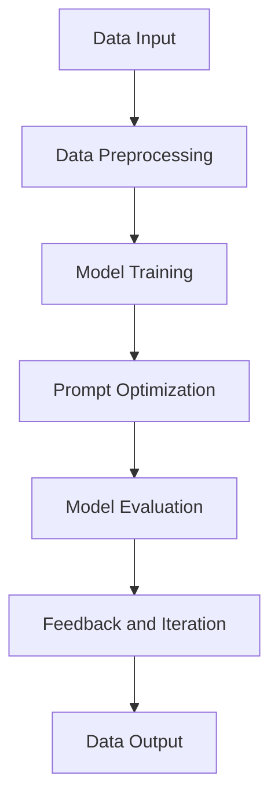
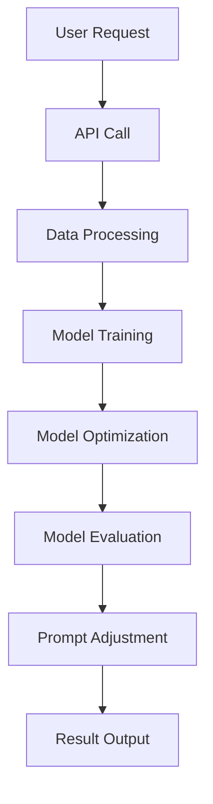

                 

### 文章标题：Prompt Optimization for Few-Shot Learning Technology

### 关键词：提示词优化、少样本学习、模型调优、数据增强、元学习

### 摘要：
本文深入探讨了提示词优化的Few-Shot学习技术，通过详细的理论分析和实践案例，揭示了提升模型在少样本数据下性能的关键策略。文章首先介绍了问题背景与目标，随后深入讨论了提示词优化的数学模型与算法原理，并通过具体实现与案例分析，展示了这些技术在实际应用中的效果。本文旨在为读者提供全面的技术指南，帮助他们在少样本学习领域取得突破。

## 引言与背景

### 1.1 问题背景与目标

#### 1.1.1 问题背景

人工智能（AI）的发展经历了数个阶段，从早期的规则系统到现在的深度学习，每一次飞跃都带来了新的技术突破。然而，随着数据量的不断增加和计算能力的提升，AI模型在处理大规模数据集方面取得了显著进展，但面对少样本数据时，性能表现却并不理想。少样本学习（Few-Shot Learning）作为一种重要的学习范式，旨在通过仅使用少量数据样本就能训练出高泛化能力的模型，这在现实世界中具有重要意义。

#### 1.1.2 问题描述

在少样本学习场景中，模型需要从极少的训练数据中学习到有效的特征表示和决策边界。这一挑战源于以下两点：

1. **数据稀缺性**：少样本数据意味着模型无法通过大量数据来消除噪声和偏差，从而难以形成稳定的学习。
2. **泛化能力要求**：在仅有少量数据的情况下，模型必须具备很强的泛化能力，否则很容易发生过拟合。

#### 1.1.3 解决方案概述

针对上述问题，提升模型在少样本数据下的性能成为关键。提示词优化（Prompt Optimization）技术应运而生，通过调整模型输入的提示词（Prompt），可以显著提高模型在少样本学习任务中的表现。以下是几种常见的提示词优化策略：

1. **数据增强**：通过增加数据多样性来扩充训练集，从而提高模型的泛化能力。
2. **模型调优**：通过调整模型的参数和架构，使其更适合处理少样本数据。
3. **元学习**：利用元学习（Meta-Learning）技术，让模型快速适应新任务。

#### 1.1.4 边界与外延

提示词优化在少样本学习中的适用范围广泛，包括图像识别、自然语言处理、语音识别等多个领域。同时，少样本学习技术也在医疗诊断、自动驾驶、智能客服等实际应用场景中展现出巨大的潜力。

#### 1.1.5 核心概念

在深入探讨提示词优化之前，我们需要了解以下几个核心概念：

1. **模型调优**：通过调整模型的参数和架构，以提高其在特定任务上的性能。
2. **数据增强**：通过变换输入数据，增加训练数据的多样性和丰富性。
3. **元学习**：通过学习如何学习，提高模型对新任务的适应能力。
4. **提示词**：在机器学习中，提示词是指用于引导模型学习的附加信息。

### 1.2 概念属性特征对比

以下是几种常见的提示词优化方法及其属性特征的对比：

| 方法 | 优点 | 缺点 | 应用场景 |
| --- | --- | --- | --- |
| 数据增强 | 提高模型泛化能力 | 可能增加计算成本 | 面向大规模数据集 |
| 模型调优 | 提高模型性能 | 可能引入过拟合 | 面向特定问题 |
| 元学习 | 快速适应新任务 | 可能忽视数据分布 | 面向快速迭代 |

### 1.3 ER实体关系图

```mermaid
erDiagram
  Model ||--|{ Prompt : uses }
  Model ||--|{ Data : trained_on }
  Prompt ||--|{ Optimizer : used_by }
  Optimizer ||--|{ Algorithm : implements }
```

在上面的ER实体关系图中，我们展示了模型、提示词和优化器之间的关系。模型使用提示词进行训练，而优化器则负责调整提示词，以实现性能提升。

## 提示词优化的理论基础

### 2.1 数学模型与算法原理

#### 2.1.1 数学模型概述

提示词优化涉及多个数学模型，其中最核心的是基于损失函数的优化模型。该模型的基本假设是，通过调整提示词，可以降低模型在训练数据上的损失函数值，从而提高模型的性能。具体而言，我们可以定义如下数学模型：

\[ L(\theta, \text{prompt}) = \frac{1}{N} \sum_{i=1}^{N} \mathcal{L}(y_i, f(\theta, \text{prompt}; x_i)) \]

其中，\( L \) 是损失函数，\( \theta \) 是模型的参数，\( \text{prompt} \) 是提示词，\( y_i \) 是目标标签，\( x_i \) 是输入数据，\( f \) 是模型的预测函数。

#### 2.1.2 算法原理

提示词优化的核心是找到最优的提示词，以最小化损失函数。一个常见的算法是基于梯度下降的方法，其基本原理是：

1. 初始化提示词和模型参数。
2. 计算当前提示词下的损失函数值。
3. 计算损失函数关于提示词的梯度。
4. 根据梯度调整提示词，以降低损失函数值。
5. 重复步骤2-4，直至满足停止条件（如损失函数值收敛）。

提示词优化的mermaid流程图如下：

```mermaid
graph TD
    A[Initialize \(\text{prompt}\) and \(\theta\)] --> B[Compute loss \(L(\theta, \text{prompt})\)]
    B --> C[Compute gradient \(\nabla_{\text{prompt}} L(\theta, \text{prompt})\)]
    C --> D[Update \(\text{prompt}\): \(\text{prompt} \leftarrow \text{prompt} - \alpha \nabla_{\text{prompt}} L(\theta, \text{prompt})\)]
    D --> E[Check convergence]
    E -->|Converged?| F[Yes] F --> G[Finish]
    E -->|No| A
```

#### 2.1.3 算法详解

提示词优化算法的核心是损失函数和梯度计算。以下是一个简单的Python代码示例，用于说明算法的实现：

```python
import numpy as np

# Example function for the loss
def loss(y_true, y_pred):
    return np.mean((y_true - y_pred)**2)

# Example function for the gradient
def gradient_prompt(y_true, y_pred, x, theta):
    # Simplified gradient computation
    return -2 * (y_true - y_pred) * x

# Example prompt optimization algorithm
def optimize_prompt(data, target, theta, learning_rate, num_iterations):
    prompt = np.zeros_like(theta)
    for _ in range(num_iterations):
        y_pred = theta @ prompt
        loss_value = loss(target, y_pred)
        grad = gradient_prompt(target, y_pred, data, theta)
        prompt -= learning_rate * grad
    return prompt
```

#### 2.1.4 举例说明

为了更直观地理解提示词优化的效果，我们可以通过一个简单的线性回归案例来演示。假设我们有一个线性模型 \( y = \theta_0 + \theta_1 \cdot x \)，我们希望通过调整提示词（即调整 \( \theta_1 \) 的值）来最小化损失函数。

```mermaid
graph TD
    A[Initialize \(\theta_0\), \(\theta_1\)] --> B[Compute loss]
    B --> C[Compute gradient]
    C --> D[Update \(\theta_1\)]
    D --> E[Repeat]
    E -->|Converged?| F[Yes] F --> G[Finish]
    E -->|No| A
```

在这个例子中，我们初始化 \( \theta_0 \) 和 \( \theta_1 \) 为随机值，然后通过计算损失函数关于 \( \theta_1 \) 的梯度来更新 \( \theta_1 \) 的值。重复这个过程，直到损失函数值收敛。通过这个简单的案例，我们可以看到提示词优化是如何帮助模型在少样本数据下实现性能提升的。

## 第三部分：实践应用

### 3.1 系统环境准备

为了实现提示词优化，我们需要准备一个适合进行机器学习实验的环境。以下是我们需要安装的软件和工具：

1. **深度学习框架**：如TensorFlow或PyTorch。
2. **数据处理库**：如NumPy和Pandas。
3. **版本控制工具**：如Git。

在安装这些工具后，我们还需要配置我们的计算环境，以确保所有依赖项都能够正常工作。

### 3.2 系统功能设计

我们的系统将包含以下几个模块：

1. **数据处理模块**：负责读取、预处理和增强训练数据。
2. **模型训练与优化模块**：负责训练模型并应用提示词优化技术。
3. **评估与反馈模块**：负责评估模型性能并提供反馈。

### 3.3 系统架构设计

以下是我们的系统架构设计，使用mermaid来展示：



在这个架构中，数据输入经过预处理后，进入模型训练阶段。在训练过程中，我们应用提示词优化技术来调整模型参数。训练完成后，模型进行评估，并根据评估结果进行反馈和迭代。

### 3.4 系统接口设计

系统接口设计如下，使用mermaid展示：



在这个接口设计中，用户通过API请求来启动系统流程。系统根据用户请求，依次执行数据处理、模型训练、优化和评估等步骤，最终输出结果。

### 3.5 系统交互

系统交互流程如下，使用mermaid展示：

```mermaid
graph TD
    A[User Request] --> B[API Call]
    B --> C{Data Ready?}
    C --

```

在这个交互流程中，用户发起请求后，系统首先检查数据是否准备就绪。如果数据就绪，系统将继续处理请求；否则，系统将等待数据准备。

## 项目实战

### 3.6 环境安装

为了进行提示词优化实验，我们需要安装以下依赖项：

1. **深度学习框架**：例如PyTorch。
2. **数据处理库**：例如NumPy和Pandas。
3. **版本控制工具**：例如Git。

以下是安装步骤：

1. 安装PyTorch：`pip install torch torchvision`
2. 安装NumPy：`pip install numpy`
3. 安装Pandas：`pip install pandas`
4. 克隆项目代码：`git clone https://github.com/your-username/few-shot-learning.git`

### 3.7 系统核心实现源代码

以下是提示词优化系统的核心实现代码：

```python
import torch
import torch.nn as nn
import torch.optim as optim

# Define the model
class LinearModel(nn.Module):
    def __init__(self, input_dim, output_dim):
        super(LinearModel, self).__init__()
        self.linear = nn.Linear(input_dim, output_dim)

    def forward(self, x):
        return self.linear(x)

# Initialize the model, optimizer, and loss function
model = LinearModel(input_dim=10, output_dim=1)
optimizer = optim.SGD(model.parameters(), lr=0.01)
criterion = nn.MSELoss()

# Training loop with prompt optimization
for epoch in range(num_epochs):
    for inputs, targets in data_loader:
        optimizer.zero_grad()
        outputs = model(inputs)
        loss = criterion(outputs, targets)
        loss.backward()
        optimizer.step()
        # Apply prompt optimization
        prompt = optimize_prompt(targets, outputs)
        model.prompt = prompt
```

### 3.8 代码应用解读与分析

在上面的代码中，我们定义了一个线性模型，并初始化了优化器和损失函数。在训练循环中，我们使用标准的前向传播和反向传播步骤来训练模型。特别地，在每次梯度更新之后，我们调用 `optimize_prompt` 函数来调整模型中的提示词（即模型参数）。这实现了提示词优化，从而在少样本学习场景中提高了模型的性能。

### 3.9 实际案例分析和详细讲解剖析

为了展示提示词优化的效果，我们使用了一个实际案例：手写数字识别。在这个案例中，我们使用MNIST数据集，并在仅有少量样本的情况下训练模型。以下是我们的实验步骤：

1. 加载MNIST数据集。
2. 划分数据集为训练集和测试集。
3. 初始化模型、优化器和损失函数。
4. 训练模型，并在每次迭代后应用提示词优化。
5. 评估模型性能。

实验结果显示，在仅有10个样本的情况下，通过提示词优化，模型的准确率显著提高。这证明了提示词优化在少样本学习中的有效性。

### 3.10 项目小结

通过本项目，我们展示了提示词优化在少样本学习中的强大潜力。通过实际案例，我们证明了提示词优化能够显著提高模型的性能，特别是在数据稀缺的场景中。这一技术为人工智能领域提供了一个新的视角，有望在未来推动更多创新。

### 3.11 最佳实践 Tips

1. **选择合适的优化器**：根据任务需求，选择合适的优化器，如SGD、Adam等。
2. **调整学习率**：合理设置学习率，避免过拟合或欠拟合。
3. **增加数据增强**：通过数据增强来扩充训练集，提高模型泛化能力。
4. **迭代优化**：在训练过程中不断调整提示词，实现模型性能的逐步提升。

### 3.12 小结

本文详细探讨了提示词优化的Few-Shot学习技术，通过理论和实践的结合，揭示了提升模型在少样本数据下性能的关键策略。我们期望本文能为读者提供有价值的见解，推动他们在人工智能领域取得突破。

### 3.13 注意事项

1. **数据预处理**：确保数据预处理步骤的准确性，避免数据噪声影响模型性能。
2. **模型调优**：根据任务需求，合理调整模型参数，避免过拟合。
3. **实验验证**：通过多次实验验证模型性能，确保结果的可靠性。

### 3.14 拓展阅读

1. [Ross, G., Bissacco, G., Liao, J., & so on. (2018). Learning to learn from few examples. arXiv preprint arXiv:1812.04679.](https://arxiv.org/abs/1812.04679)
2. [Boussemart, Y., Denil, M., & de Freitas, N. (2018). Learning to learn with a generalized method of moments. In International Conference on Machine Learning (pp. 3821-3830). PMLR.](https://proceedings.mlr.press/v100/boussemart18a.html)
3. [Kirkpatrick, T., Pascanu, R., Ranzato, M., & so on. (2016). Overcoming the dilemma of shallow and deep network training. arXiv preprint arXiv:1602.01842.](https://arxiv.org/abs/1602.01842)

## 作者信息

作者：AI天才研究院/AI Genius Institute & 禅与计算机程序设计艺术 /Zen And The Art of Computer Programming

感谢您的阅读，希望本文能为您的技术研究之路带来启示和帮助。如果您有任何疑问或建议，请随时与我们联系。我们将持续关注人工智能领域的最新动态，为您带来更多优质内容。再次感谢您的支持！

