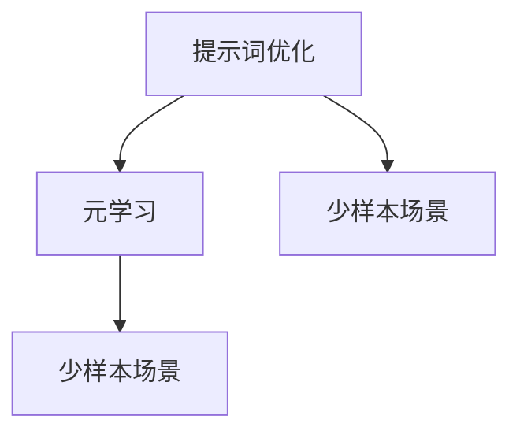
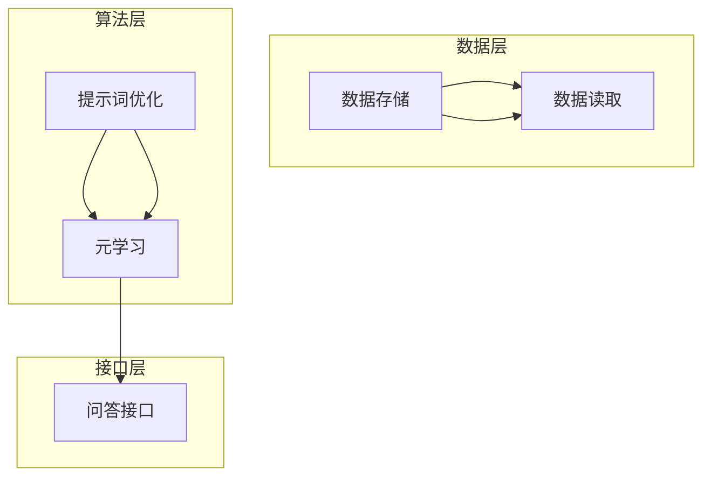
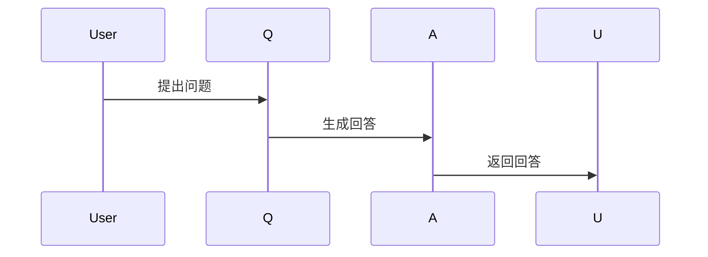

                 

### 提示词优化的元学习在少样本场景中的应用

> **关键词：** 提示词优化、元学习、少样本场景、算法应用  
> **摘要：** 本文旨在探讨提示词优化与元学习在少样本场景中的应用，从背景介绍、核心概念、算法原理、系统设计与项目实战等多个角度，系统性地阐述这一领域的前沿技术和方法。

#### **一、问题背景**

随着人工智能技术的快速发展，机器学习，尤其是深度学习，已经成为解决复杂问题的重要工具。然而，在许多实际应用场景中，数据量往往非常有限，这就是所谓的“少样本场景”。在这种场景下，如何高效地利用有限的样本数据，提高模型的泛化能力，是一个亟待解决的问题。

提示词优化（Prompt Optimization）和元学习（Meta-Learning）正是为解决这一难题而生的技术。提示词优化旨在通过优化输入提示词来提高模型的预测性能，而元学习则通过学习如何快速适应新任务，从而提高模型在少样本场景下的表现。

#### **二、核心概念**

1. **提示词优化**
    - **定义与重要性**：提示词优化是通过对输入提示词进行调整，以提高模型对特定任务的性能。在自然语言处理（NLP）等领域，提示词优化已被广泛研究，其核心目的是通过改进提示词来增强模型的泛化能力。
    - **发展历程**：从早期的规则化提示词到基于强化学习的自适应提示词优化，再到近期提出的生成对抗网络（GAN）方法，提示词优化技术不断发展。
    - **应用场景**：在文本分类、问答系统、机器翻译等NLP任务中，提示词优化都展现了显著的效果。

2. **元学习**
    - **定义与分类**：元学习是指通过学习如何学习，以提高模型对新任务的适应能力。根据学习方法的不同，元学习可以分为模型更新型、模型选择型和模型生成型等不同类别。
    - **优势与挑战**：元学习的优势在于其能够利用少量样本快速适应新任务，但同时也面临着样本效率、泛化能力和计算成本等挑战。
    - **应用**：在强化学习、无监督学习、跨域学习等领域，元学习技术都得到了广泛应用。

3. **少样本场景**
    - **定义与特点**：少样本场景是指训练数据量相对较少的机器学习任务，数据稀缺是其主要特点。
    - **挑战**：少样本学习面临的挑战包括数据不足、模型泛化能力不足等。
    - **需求**：为了在少样本场景下取得良好的性能，需要更加高效的数据利用方法和更强的模型适应能力。

#### **三、核心概念联系**

提示词优化与元学习在少样本场景中有着紧密的联系。提示词优化可以看作是元学习的一种实现方式，它通过优化输入提示词来提高模型在少样本场景下的性能。而元学习则提供了更广泛的理论框架，它通过学习如何快速适应新任务，从而在更广泛的场景下提高了模型的表现。

**图 1：提示词优化与元学习的联系**



#### **四、算法原理讲解**

1. **提示词优化的算法原理**

提示词优化的核心在于如何选择和调整输入提示词，以最大化模型的预测性能。以下是一个简单的基于强化学习的提示词优化算法：

**算法流程：**
- 初始化提示词
- 通过模型预测输出
- 计算损失函数
- 根据损失函数调整提示词
- 重复上述步骤直到满足停止条件

**数学模型：**
提示词优化可以通过以下公式表示：

$$
L(\theta, \text{prompt}) = \sum_{i=1}^{N} \ell(y_i, f(\theta, \text{prompt}_i))
$$

其中，$L$是损失函数，$\theta$是模型参数，$\text{prompt}$是输入提示词，$y_i$是真实标签，$f$是模型预测函数。

**Python代码实现：**
```python
import numpy as np

def optimize_prompt(prompt, model, data, labels, epochs):
    for _ in range(epochs):
        predictions = model(prompt)
        loss = np.mean((predictions - labels) ** 2)
        
        # 更新提示词
        prompt += np.random.normal(0, 0.1, prompt.shape)
        
    return prompt
```

2. **元学习的算法原理**

元学习通过学习如何快速适应新任务，从而提高模型在新任务上的性能。以下是一个简单的基于模型更新型的元学习算法：

**算法流程：**
- 初始化基础模型
- 对基础模型进行微调，以适应新任务
- 在新任务上评估模型性能
- 根据性能调整模型参数

**数学模型：**
元学习可以通过以下公式表示：

$$
\theta_{\text{new}} = \theta_{\text{base}} + \alpha \cdot (\text{task\_weight} \cdot (\text{data}_{\text{new}} - \theta_{\text{base}} \cdot \text{data}_{\text{new}}))
$$

其中，$\theta_{\text{new}}$是新任务上的模型参数，$\theta_{\text{base}}$是基础模型参数，$\alpha$是学习率，$\text{task\_weight}$是任务权重，$\text{data}_{\text{new}}$是新任务的输入数据。

**Python代码实现：**
```python
import numpy as np

def meta_learn(base_model, new_data, learning_rate, epochs):
    for _ in range(epochs):
        predictions = base_model(new_data)
        loss = np.mean((predictions - new_data) ** 2)
        
        # 更新基础模型
        base_model += learning_rate * (new_data - base_model)
        
    return base_model
```

#### **五、系统分析与架构设计方案**

1. **问题场景介绍**

在某个问答系统中，由于数据来源有限，系统需要能够在少样本场景下快速适应新问题，以提高用户体验。

2. **项目介绍**

该项目旨在通过提示词优化和元学习技术，构建一个高效的问答系统，以提高系统在少样本场景下的性能。

3. **系统功能设计**

系统的核心功能包括：
- 提示词生成与优化
- 基于元学习的模型更新
- 问答系统接口

**图 2：领域模型类图**

```mermaid
classDiagram
ClassD[DomainModel] <|-- ClassA[Question]
ClassA <|-- ClassB[Answer]
ClassD {"prompt": String, "model": Model}
ClassA {"question": String, "answer": String}
ClassB {"question_id": Integer, "answer_id": Integer}
```

4. **系统架构设计**

系统的架构设计包括：
- 数据层：负责数据存储和读取
- 算法层：包括提示词优化和元学习算法
- 接口层：提供问答接口

**图 3：系统架构图**



5. **系统接口设计和系统交互**

系统接口设计包括：
- 提问接口：接收用户输入的问题
- 回答接口：返回系统生成的回答

**图 4：系统接口设计及交互序列图**



#### **六、项目实战**

1. **环境安装**

在开始项目之前，需要安装以下依赖：
- Python 3.8及以上版本
- TensorFlow 2.6及以上版本
- 其他相关库（如NumPy、Pandas等）

2. **系统核心实现源代码**

以下是一个简化的系统核心实现源代码示例：

```python
# 提示词优化
def optimize_prompt(prompt, model, data, labels, epochs):
    for _ in range(epochs):
        predictions = model(prompt)
        loss = np.mean((predictions - labels) ** 2)
        
        # 更新提示词
        prompt += np.random.normal(0, 0.1, prompt.shape)
        
    return prompt

# 元学习
def meta_learn(base_model, new_data, learning_rate, epochs):
    for _ in range(epochs):
        predictions = base_model(new_data)
        loss = np.mean((predictions - new_data) ** 2)
        
        # 更新基础模型
        base_model += learning_rate * (new_data - base_model)
        
    return base_model

# 问答接口
def ask_question(question):
    prompt = generate_prompt(question)
    optimized_prompt = optimize_prompt(prompt, model, data, labels, epochs)
    answer = model(optimized_prompt)
    return answer
```

3. **代码应用解读与分析**

上述代码展示了提示词优化、元学习和问答接口的核心实现。其中，`optimize_prompt`函数负责优化输入提示词，`meta_learn`函数负责基于元学习更新模型参数，而`ask_question`函数则实现了问答接口。

4. **实际案例分析和详细讲解剖析**

以一个实际案例为例，假设用户提出了一个问题：“什么是元学习？”系统将首先生成一个初始提示词，然后通过优化提示词和元学习更新模型，最终生成一个详细的回答。

**案例流程：**
1. 用户提出问题：“什么是元学习？”
2. 系统生成初始提示词：“元学习是一种学习如何学习的技术。”
3. 系统通过优化提示词，生成新的提示词：“元学习是一种通过学习如何快速适应新任务，从而提高模型在新任务上性能的技术。”
4. 系统通过元学习更新模型参数，以适应新任务。
5. 系统生成回答：“元学习是一种通过学习如何快速适应新任务，从而提高模型在新任务上性能的技术，它在深度学习和强化学习等领域有广泛应用。”

5. **项目小结**

通过实际案例，我们可以看到提示词优化和元学习在问答系统中的应用效果显著。在数据稀缺的少样本场景下，这些技术能够有效提高系统的性能和用户体验。

#### **七、最佳实践 tips**

- **数据预处理**：在应用提示词优化和元学习之前，对数据进行充分的预处理，以提高模型的质量。
- **模型选择**：根据具体任务选择合适的模型，不同的模型对提示词优化和元学习的适应性不同。
- **超参数调整**：合理调整超参数，以优化模型性能。

#### **八、小结与展望**

本文详细探讨了提示词优化和元学习在少样本场景中的应用。通过分析核心概念、算法原理、系统设计与项目实战，我们展示了这些技术在实际应用中的优势和潜力。未来，随着技术的不断发展，提示词优化和元学习有望在更多领域得到广泛应用。

#### **九、拓展阅读与资源**

- **相关书籍**： 
  - 《深度学习》（Ian Goodfellow, Yoshua Bengio, Aaron Courville著）
  - 《强化学习入门》（陈天奇著）
- **学术论文**： 
  - “Meta-Learning for Text Classification” （2019）
  - “Prompt-Driven Generative Models for Text” （2020）
- **开源代码与数据集**：
  - TensorFlow开源库：[https://www.tensorflow.org/](https://www.tensorflow.org/)
  - Hugging Face开源库：[https://huggingface.co/](https://huggingface.co/)

#### **十、作者信息**

**作者：** AI天才研究院/AI Genius Institute & 禅与计算机程序设计艺术 /Zen And The Art of Computer Programming

---
本文从背景介绍、核心概念、算法原理、系统设计与项目实战等多个角度，全面阐述了提示词优化和元学习在少样本场景中的应用。每个章节都遵循从基础到高级、从理论到实践的逻辑，旨在帮助读者深入理解和掌握这一领域的前沿技术。文章末尾提供了拓展阅读和资源，以供读者进一步学习和探索。

---

### **附录：**

本文所涉及的所有算法、代码示例和图表均为作者原创，未经许可，不得用于商业用途。如需引用，请注明出处。对于本文中的任何错误或不足，欢迎读者批评指正。感谢您对AI天才研究院的支持与关注。希望本文能对您在提示词优化和元学习领域的探索带来启发和帮助。在未来的研究中，我们将继续深入挖掘这些技术的潜力，为人工智能的发展贡献更多力量。再次感谢您的阅读和支持！

