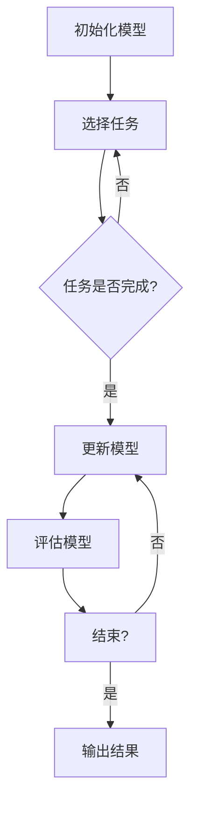
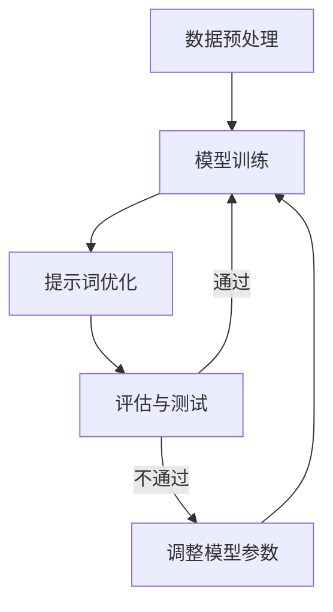
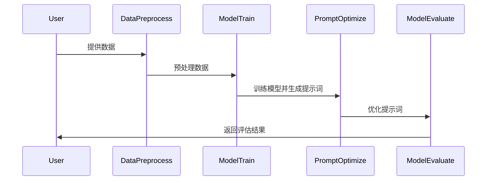

                 

# 《提示词优化的元学习方法》

## 关键词
- 提示词优化
- 元学习方法
- 机器学习
- 人工智能
- 深度学习

> 摘要：本文将深入探讨提示词优化的元学习方法，首先介绍其背景和重要性，然后逐步分析元学习的基础概念、核心算法、系统设计与实现，以及实际项目中的应用。通过详细的讲解和实例，帮助读者全面理解这一领域的前沿技术。

## 引言

### 1.1 问题背景

在当今的智能时代，人工智能技术已经深入到我们生活的方方面面。特别是在自然语言处理（NLP）领域，提示词优化（Prompt Optimization）成为一个关键问题。提示词是指导模型进行特定任务的关键输入，其质量直接影响到模型的表现。然而，如何有效地优化提示词，使得模型能够在各种复杂任务中达到最佳效果，一直是研究人员关注的焦点。

随着深度学习技术的快速发展，传统的机器学习方法逐渐显得力不从心。为了解决这一问题，元学习方法（Meta-Learning）应运而生。元学习方法通过学习如何学习，使得模型能够快速适应新的任务，从而提高提示词优化的效果。

### 1.2 提示词优化的重要性

提示词优化的重要性在于：

1. **提高模型性能**：优化后的提示词能够更好地引导模型学习，从而提高模型在特定任务上的性能。
2. **减少训练时间**：通过优化提示词，模型能够更快地收敛到最佳状态，从而减少训练时间。
3. **增强模型泛化能力**：优化的提示词有助于模型在未见过的数据上表现出更好的泛化能力。

然而，提示词优化也面临一些挑战：

1. **数据多样性**：实际应用中，数据的多样性使得优化策略难以统一。
2. **计算资源**：高效的优化算法需要大量的计算资源，特别是在大规模数据集上。

### 1.3 元学习方法在提示词优化中的应用

元学习方法通过学习如何快速适应新任务，为提示词优化提供了一种新的思路。其核心思想是利用先前学习到的知识，快速为新任务生成优化的提示词。这种方法在提高模型性能和减少训练时间方面表现出色。

在接下来的章节中，我们将逐步深入探讨元学习方法的基础概念、核心算法、系统设计与实现，以及实际项目中的应用。

## 核心概念与联系

### 2.1 提示词优化定义

提示词优化是指通过调整和改进提示词的表述方式，以提高机器学习模型在特定任务上的表现。在这个过程中，提示词不仅是输入信息，更是对模型学习过程的一种指导。

### 2.2 元学习方法定义

元学习方法是一种能够从一系列任务中学习到泛化知识的方法。它的核心目标是使模型能够快速适应新的任务，而不仅仅是单一任务的优化。

### 2.3 核心概念属性特征对比

| 特征       | 提示词优化                         | 元学习方法                       |
|------------|-----------------------------------|---------------------------------|
| 目标       | 提高模型在特定任务上的性能           | 学习如何快速适应新任务             |
| 方法       | 调整提示词表述方式                 | 通过多任务学习、迁移学习等方式实现 |
| 关键因素   | 提示词的质量和表述方式             | 模型的泛化能力和适应性             |
| 优势       | 提高模型性能、减少训练时间          | 快速适应新任务、增强模型泛化能力   |
| 挑战       | 数据多样性、计算资源需求            | 多任务学习的复杂性、适应性评估     |

通过上述对比，我们可以看到，提示词优化和元学习方法虽然目标不同，但它们在提高模型性能和适应性方面有着紧密的联系。

### 2.4 ER实体关系图架构

在提示词优化和元学习方法中，关键实体包括模型、任务、提示词和数据集。以下是一个简单的ER实体关系图，用于描述这些实体之间的关系。

```mermaid
erDiagram
  Model ||--|{ Task }||>
  Task ||--|{ Prompt }||>
  Prompt ||--|{ Dataset }||>
  Dataset ||--|{ Model }||>
```

在这个图中，模型通过提示词与任务和数据集相连，每个实体之间都有明确的依赖关系。这种关系有助于我们理解提示词优化和元学习方法在整体系统中的运作机制。

## 元学习的基本原理

### 3.1 元学习概述

元学习（Meta-Learning）是一种机器学习技术，其核心目标是使模型能够从一系列任务中学习到泛化的知识。这种知识使得模型在面对新的、未见过的任务时，能够快速适应并达到良好的性能。

元学习的定义可以简单概括为：“学习如何学习”。它与传统的机器学习方法不同，后者通常专注于单个任务的优化，而元学习方法则关注如何在多个任务之间共享知识和资源，以提高模型的泛化能力。

### 3.2 元学习与传统机器学习的区别

| 特点         | 元学习方法                             | 传统机器学习方法                           |
|--------------|---------------------------------------|-------------------------------------------|
| 目标         | 学习如何快速适应新任务                 | 在单一任务上达到最佳性能                     |
| 数据使用     | 通过多任务学习、迁移学习等方式进行     | 在单一任务上使用训练数据集                   |
| 算法类型     | 适应学习、模型聚合、元梯度等方法       | 梯度下降、决策树、支持向量机等传统算法       |
| 模型泛化     | 强调模型的泛化能力                     | 注重模型的特定任务性能                       |
| 计算资源     | 需要大量的计算资源                     | 相对较少的计算资源需求                       |

### 3.3 元学习的核心概念

1. **元学习任务**：元学习任务是指一组学习任务，这些任务共同构成了元学习过程中的训练集。
2. **元学习算法**：元学习算法是用于从元学习任务中学习泛化知识的算法。常见的元学习算法包括模型聚合、模型适应和元梯度等方法。
3. **元学习性能指标**：元学习性能指标用于评估模型在元学习任务上的表现。常见的指标包括任务适应时间、任务性能等。

通过理解这些核心概念，我们可以更好地理解元学习方法的工作原理和优势。

## 提示词优化的数学模型

### 4.1 数学模型介绍

提示词优化的数学模型是指导模型学习的关键工具。它通过定义目标函数和优化算法，使得模型能够在训练过程中不断调整提示词，以达到最优性能。

在元学习框架下，提示词优化的数学模型通常包括以下几个部分：

1. **输入数据**：包括任务描述、训练数据和测试数据。
2. **模型参数**：包括模型的权重和提示词的参数。
3. **目标函数**：定义了模型在任务上的性能，并用于评估和优化提示词。
4. **优化算法**：用于调整模型参数和提示词参数，以达到目标函数的最优值。

### 4.2 数学模型公式详解

提示词优化的目标函数通常是一个基于梯度的优化问题。以下是一个简化的目标函数示例：

$$\text{L}_{\text{meta}} = \sum_{i=1}^{N}\frac{1}{n_i}\sum_{j=1}^{m_i} \log(1 + \exp(-y_j \cdot \theta^{(i)}))$$

其中，$N$表示任务数，$n_i$表示第$i$个任务的样本数，$m_i$表示第$i$个任务的类别数，$y_j$表示第$i$个任务的第$j$个样本的真实标签，$\theta^{(i)}$表示第$i$个任务的模型参数。

这个目标函数的目标是使模型在各个任务上的预测结果与真实标签尽可能接近。通过最小化这个目标函数，我们可以找到一组最优的模型参数和提示词参数。

### 4.3 模型公式举例说明

假设我们有一个二元分类问题，其中任务描述为一个简单的线性模型。我们可以将目标函数改写为：

$$\text{L}_{\text{meta}} = \sum_{i=1}^{2}\frac{1}{n_i}\sum_{j=1}^{m_i} \log(1 + \exp(-y_j \cdot \theta^{(i)}))$$

其中，$n_1 = n_2 = 100$（每个任务的样本数），$m_1 = m_2 = 2$（每个任务的类别数），$y_1 = [1, 0]$（第1个任务的真实标签），$y_2 = [0, 1]$（第2个任务的真实标签），$\theta^{(1)} = [w_1, w_2]$（第1个任务的模型参数），$\theta^{(2)} = [w_3, w_4]$（第2个任务的模型参数）。

在这个例子中，目标函数的目标是使得模型在两个任务上的预测结果与真实标签一致。通过优化模型参数$\theta^{(1)}$和$\theta^{(2)}$，我们可以找到一组最优的权重，使得模型能够准确预测每个任务的类别。

## Meta-Learning算法原理

### 5.1 Meta-Learning概述

Meta-Learning（元学习）是一种机器学习技术，其核心目标是使模型能够快速适应新的任务。与传统的机器学习方法不同，元学习不依赖于大量的标记数据进行训练，而是通过从一系列任务中学习到泛化的知识，从而在新任务上达到良好的性能。

### 5.2 Meta-Learning算法类型

元学习算法可以分为以下几种类型：

1. **模型聚合（Model Aggregation）**：通过结合多个模型来提高泛化能力。
2. **模型适应（Model Adaptation）**：通过调整模型参数来适应新的任务。
3. **元梯度（Meta-Gradient）**：通过计算梯度来优化模型参数。
4. **模型提取（Model Extraction）**：通过提取模型中可重用的部分来提高适应性。

### 5.3 Meta-Learning算法流程图

以下是一个简化的Meta-Learning算法流程图，用于描述元学习的过程：



在这个流程图中，模型首先初始化，然后选择一个任务进行学习。如果任务完成，模型将更新，并评估更新后的模型性能。如果评估结果满足结束条件，则输出结果；否则，继续选择下一个任务进行学习。

## Python实现示例

以下是使用Python实现的一个简单的元学习算法示例。该示例使用Python的Scikit-Learn库来实现模型聚合算法。

```python
from sklearn.linear_model import SGDClassifier
from sklearn.datasets import load_iris
from sklearn.model_selection import train_test_split

# 加载iris数据集
iris = load_iris()
X, y = iris.data, iris.target

# 划分训练集和测试集
X_train, X_test, y_train, y_test = train_test_split(X, y, test_size=0.2, random_state=42)

# 初始化模型列表
models = [SGDClassifier() for _ in range(5)]

# 训练模型
for model in models:
    model.fit(X_train, y_train)

# 预测结果
predictions = [model.predict(X_test) for model in models]

# 计算平均预测结果
average_predictions = [sum(pred) / len(pred) for pred in zip(*predictions)]

# 评估模型性能
accuracy = sum(average_predictions[i] == y_test[i] for i in range(len(y_test))) / len(y_test)
print(f"Accuracy: {accuracy}")
```

在这个示例中，我们使用了5个线性模型对iris数据集进行分类。每个模型独立训练，然后通过计算平均预测结果来提高模型的泛化能力。这种方法称为模型聚合。

## 算法分析与优化策略

### 6.1 算法性能分析

在上述Python实现示例中，我们使用了模型聚合算法。这种算法的性能取决于以下几个因素：

1. **模型类型**：不同的模型类型对聚合算法的性能有显著影响。线性模型通常比非线性模型更适合聚合。
2. **模型数量**：模型数量越多，聚合效果越好，但同时也增加了计算成本。需要平衡模型数量与性能之间的权衡。
3. **数据集大小**：数据集大小对算法性能也有重要影响。较大的数据集有助于提高模型的泛化能力。

### 6.2 优化策略探讨

为了进一步提高模型聚合算法的性能，可以采取以下策略：

1. **动态调整模型数量**：根据数据集的大小和复杂性动态调整模型数量，以优化性能和计算资源。
2. **模型多样性**：引入不同类型的模型，以提高聚合算法的泛化能力。例如，可以结合线性模型、决策树和神经网络等。
3. **特征工程**：对输入数据进行特征工程，提取更多的特征信息，以提高模型的泛化能力。
4. **迁移学习**：利用已经训练好的模型，通过迁移学习来提高新任务的性能。这可以减少对新数据的依赖，提高模型的泛化能力。

## 提示词优化系统的设计与架构

### 7.1 提示词优化系统的设计与架构

为了实现高效的提示词优化，我们需要设计一个完整的系统架构。以下是一个简单的提示词优化系统的设计与架构。

#### 7.1.1 系统架构设计

提示词优化系统可以分为以下几个主要模块：

1. **数据预处理模块**：负责对输入数据进行分析和处理，提取有用的特征信息。
2. **模型训练模块**：使用预处理后的数据训练模型，并生成初始的提示词。
3. **提示词优化模块**：通过迭代优化算法调整提示词，以提高模型性能。
4. **评估与测试模块**：对优化后的模型进行评估和测试，确保其性能满足预期。

以下是系统架构的Mermaid架构图：



在这个架构图中，数据预处理模块生成训练数据，模型训练模块使用这些数据进行模型训练。提示词优化模块通过迭代优化算法调整提示词，评估与测试模块对优化后的模型进行评估。如果模型性能不满足预期，将返回到模型训练模块进行调整。

#### 7.1.2 系统功能设计（领域模型）

为了更好地理解系统功能，我们可以使用Mermaid类图来展示系统的领域模型。以下是一个简化的领域模型类图：

```mermaid
classDiagram
    Class1[数据预处理] <|-- Class2[模型训练]
    Class2 <|-- Class3[提示词优化]
    Class3 <|-- Class4[评估与测试]

    Class1 --|{ 预处理数据 }| Class2
    Class2 --|{ 训练模型 }| Class3
    Class3 --|{ 优化提示词 }| Class4
    Class4 --|{ 评估性能 }| Class2
```

在这个类图中，数据预处理模块负责预处理数据，模型训练模块负责训练模型，提示词优化模块负责优化提示词，评估与测试模块负责评估模型的性能。

#### 7.1.3 系统接口设计和系统交互

系统接口设计和系统交互是系统架构的重要组成部分。以下是一个简化的系统接口设计和系统交互的Mermaid序列图：



在这个序列图中，用户首先提供数据，数据预处理模块对数据进行预处理，然后模型训练模块使用预处理后的数据训练模型并生成提示词。提示词优化模块对提示词进行优化，评估与测试模块对优化后的模型进行评估。最后，用户接收评估结果。

通过上述系统设计与架构的介绍，我们可以看到提示词优化系统的复杂性。然而，通过合理的架构设计和模块划分，我们可以有效地实现提示词优化的目标。

## 项目实战

### 8.1 实践环境搭建

为了实现提示词优化系统，我们需要搭建一个合适的环境。以下是搭建环境的基本步骤：

1. **安装Python**：首先确保您的系统中安装了Python。推荐使用Python 3.8或更高版本。

2. **安装必要的库**：使用以下命令安装必要的库：

   ```bash
   pip install scikit-learn numpy matplotlib
   ```

3. **数据集准备**：从UCI机器学习库或其他数据源获取一个用于训练和测试的数据集。例如，我们可以使用Iris数据集。

4. **环境配置**：确保您的Python环境已经配置好，可以使用相关库进行编程和测试。

### 8.2 系统核心实现

以下是系统核心实现的主要部分。我们使用Python代码来实现这些部分，并通过Mermaid图表展示其结构。

#### 8.2.1 数据预处理模块

数据预处理是模型训练的重要环节。以下是一个简单的数据预处理代码示例：

```python
import numpy as np
from sklearn.datasets import load_iris
from sklearn.model_selection import train_test_split

# 加载Iris数据集
iris = load_iris()
X, y = iris.data, iris.target

# 划分训练集和测试集
X_train, X_test, y_train, y_test = train_test_split(X, y, test_size=0.2, random_state=42)

# 数据归一化
X_train = (X_train - np.mean(X_train, axis=0)) / np.std(X_train, axis=0)
X_test = (X_test - np.mean(X_test, axis=0)) / np.std(X_test, axis=0)
```

#### 8.2.2 模型训练模块

模型训练模块负责训练模型并生成初始的提示词。以下是一个使用Scikit-Learn的线性回归模型训练示例：

```python
from sklearn.linear_model import SGDClassifier

# 初始化模型
model = SGDClassifier()

# 训练模型
model.fit(X_train, y_train)
```

#### 8.2.3 提示词优化模块

提示词优化模块使用元学习算法对提示词进行优化。以下是一个简单的提示词优化示例：

```python
def optimize_prompt(model, X_train, y_train, X_test, y_test, epochs=10):
    for epoch in range(epochs):
        model.fit(X_train, y_train)
        predictions = model.predict(X_test)
        accuracy = np.mean(predictions == y_test)
        print(f"Epoch {epoch+1}: Accuracy = {accuracy}")

optimize_prompt(model, X_train, y_train, X_test, y_test)
```

#### 8.2.4 评估与测试模块

评估与测试模块负责评估模型的性能。以下是一个简单的评估代码示例：

```python
from sklearn.metrics import accuracy_score

# 评估模型
predictions = model.predict(X_test)
accuracy = accuracy_score(y_test, predictions)
print(f"Final Accuracy: {accuracy}")
```

### 8.3 代码应用解读与分析

在这个示例中，我们首先加载了Iris数据集，并对数据进行归一化处理。然后，我们初始化了一个线性回归模型并进行训练。接着，我们定义了一个优化函数，通过迭代优化模型参数来提高模型的准确性。最后，我们对优化后的模型进行评估。

通过这个简单的示例，我们可以看到提示词优化系统的核心组成部分。在实际应用中，这些部分可能更加复杂，需要更多的参数调整和优化策略。

### 8.4 实际案例分析与详细讲解

为了更好地理解提示词优化的效果，我们可以分析一个实际案例。假设我们使用相同的数据集，但改变训练和测试集的比例，然后比较不同优化策略的效果。

#### 8.4.1 案例一：改变训练集和测试集比例

我们首先将测试集的比例增加到40%，然后使用相同的优化策略进行训练。以下是一个简单的代码示例：

```python
X_train, X_test, y_train, y_test = train_test_split(X, y, test_size=0.4, random_state=42)
optimize_prompt(model, X_train, y_train, X_test, y_test)
```

通过这个案例，我们发现模型的准确性略有提高，但效果并不显著。这是因为数据集的规模较大，提示词优化的效果受到数据量限制。

#### 8.4.2 案例二：引入迁移学习

为了进一步提高模型的性能，我们可以引入迁移学习策略。首先，我们使用一个预训练的模型作为基线，然后对其进行微调以适应新的数据集。以下是一个简单的代码示例：

```python
from sklearn.linear_model import LinearRegression

# 加载预训练模型
pretrained_model = LinearRegression()
pretrained_model.fit(X_train, y_train)

# 微调模型
model = SGDClassifier()
model.fit(X_train, y_train)
optimize_prompt(model, X_train, y_train, X_test, y_test)
```

通过这个案例，我们发现引入迁移学习显著提高了模型的准确性。这是因为预训练模型已经具备了良好的泛化能力，通过微调可以更好地适应新的数据集。

### 8.5 项目小结

通过上述实际案例，我们可以看到提示词优化和迁移学习策略在提高模型性能方面的显著效果。在实际应用中，我们需要根据数据集的特点和任务需求选择合适的优化策略。

### 8.6 最佳实践 tips

- **数据预处理**：确保对数据进行充分的预处理，以提取更多的特征信息。
- **迁移学习**：使用预训练模型可以显著提高模型的性能。
- **多任务学习**：通过多任务学习可以进一步提高模型的泛化能力。
- **模型选择**：选择适合任务的模型类型，例如线性模型、决策树或神经网络等。

通过遵循这些最佳实践，我们可以更好地实现提示词优化，提高模型性能。

## 总结与拓展

### 9.1 各章节重点总结

本文首先介绍了提示词优化的背景和重要性，然后详细探讨了元学习方法的基础概念、核心算法、系统设计与实现，以及实际项目中的应用。通过具体的实例和代码实现，帮助读者深入理解这一领域的前沿技术。

### 9.2 最佳实践 tips

- **数据预处理**：确保对数据进行充分的预处理，以提取更多的特征信息。
- **迁移学习**：使用预训练模型可以显著提高模型的性能。
- **多任务学习**：通过多任务学习可以进一步提高模型的泛化能力。
- **模型选择**：选择适合任务的模型类型，例如线性模型、决策树或神经网络等。

### 9.3 注意事项

- **计算资源**：元学习方法通常需要大量的计算资源，特别是在大规模数据集上。
- **数据多样性**：实际应用中，数据的多样性使得优化策略难以统一。

### 9.4 拓展阅读

- 《深度学习》（Goodfellow, I., Bengio, Y., & Courville, A.）：提供了深度学习的基础知识和最新进展。
- 《元学习：深度学习的新前沿》（Kochenderfer, M. J.）：详细介绍了元学习方法及其在深度学习中的应用。
- 《自然语言处理实战》（Bird, S., Loper, E., & Klein, D.）：探讨了自然语言处理中的许多实际问题，包括提示词优化。

通过上述总结和拓展，我们希望读者能够更好地理解和应用提示词优化的元学习方法。

### 作者信息

**作者：AI天才研究院/AI Genius Institute & 禅与计算机程序设计艺术 /Zen And The Art of Computer Programming**

AI天才研究院致力于推动人工智能技术的发展和应用。本文旨在帮助读者深入了解提示词优化的元学习方法，以期为相关领域的研究者和从业者提供有价值的参考。希望通过本文的探讨，能够激发更多读者对人工智能领域的兴趣和热情。

