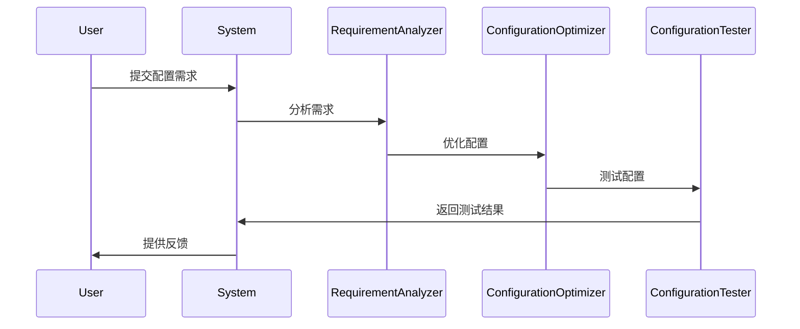
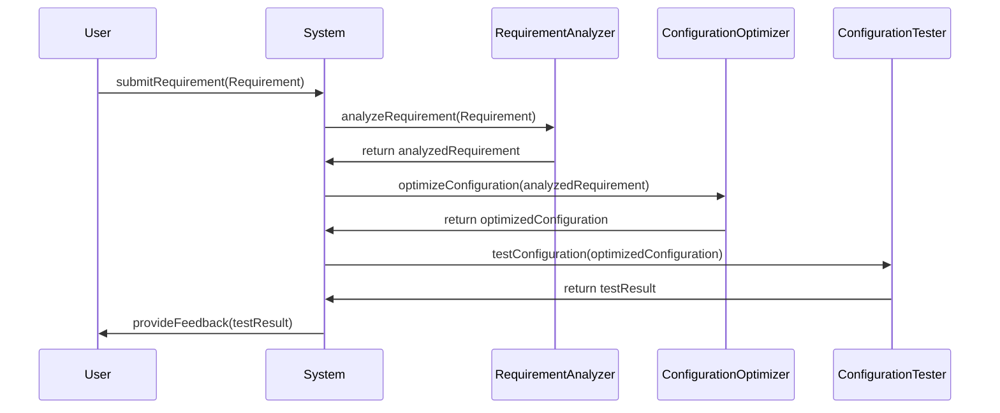

                 

### 基本概念与原理

#### 1. 软件配置管理

软件配置管理（Software Configuration Management, SCM）是一种确保软件在开发、测试、部署和维护过程中保持一致性和可追踪性的方法。其核心目标是管理软件构件的变更，确保软件产品在不同阶段和不同环境中的一致性。

**核心概念：**

- **配置项（Configuration Item, CI）**：SCM中管理的最小实体，可以是源代码文件、编译后的二进制文件、文档等。

- **版本（Version）**：对配置项的一次更改或更新。每个版本都有唯一的标识，便于追踪和复用。

- **变更管理（Change Management）**：在SCM过程中，对配置项的修改进行控制、记录和跟踪的过程。

- **发布（Release）**：将经过测试且满足特定需求的软件版本交付给用户。

**主要活动：**

- **需求管理**：收集和分析用户需求，确保软件功能与用户需求一致。

- **变更管理**：控制配置项的修改，确保变更的影响得到评估和处理。

- **版本管理**：管理配置项的版本，确保版本间的可追溯性和兼容性。

- **发布管理**：定义和执行软件发布的流程，确保发布过程的规范和可重复性。

#### 2. 软件配置

软件配置是指根据特定需求或环境，对软件产品进行定制化的过程。软件配置的目的是提高软件的适应性和灵活性，满足不同用户和不同场景的需求。

**特点：**

- **多样性**：软件配置需要处理多种配置选项，满足不同用户的需求。

- **复杂性**：软件配置涉及多个层次和维度，包括系统级配置、模块级配置和代码级配置。

- **个性化**：软件配置可以针对特定用户或特定环境进行定制，实现个性化需求。

**分类：**

- **静态配置**：在软件发布前进行配置，通常涉及系统级和模块级配置。

- **动态配置**：在软件运行过程中进行配置，通常涉及运行时参数调整和模块加载。

- **系统级配置**：对整个软件系统的配置，包括硬件配置、网络配置等。

- **模块级配置**：对软件模块的配置，包括接口定义、依赖关系等。

- **代码级配置**：对软件代码的配置，包括代码模板、代码注释等。

#### 3. 软件配置流程

软件配置流程是指从需求分析到最终交付的整个过程，包括以下关键步骤：

1. **需求分析**：收集和分析用户需求，明确软件配置的目标和范围。

2. **配置设计**：根据需求分析结果，设计软件配置方案，确定配置选项和配置规则。

3. **配置实现**：根据配置设计方案，对软件进行配置，包括修改代码、配置文件等。

4. **配置测试**：对配置后的软件进行功能测试和性能测试，确保配置的正确性和有效性。

5. **配置发布**：将经过测试的软件配置发布给用户，并进行部署和上线。

#### 4. 软件配置中的挑战

软件配置过程中面临的主要挑战包括：

- **复杂性**：软件配置涉及多个层次和维度，难以进行有效管理和控制。

- **多样性**：不同用户和不同环境对软件配置的需求各不相同，难以统一处理。

- **个性化**：软件配置需要根据特定用户或特定环境进行定制，增加了配置的复杂性。

- **可追溯性**：确保软件配置的可追溯性，以便在出现问题时快速定位和解决。

- **可维护性**：随着软件配置的复杂性增加，维护和更新软件配置的难度也随之增加。

#### 5. 软件配置与提示词优化的关系

提示词优化（Prompt Optimization）是指在机器学习和人工智能领域，通过调整输入提示（Prompt）来提高模型的学习效果和生成质量。在软件配置中，提示词优化可以用于以下几个方面：

- **需求分析**：通过优化输入提示，提高需求分析的准确性和效率。

- **配置设计**：通过优化输入提示，提高配置设计的灵活性和适应性。

- **配置实现**：通过优化输入提示，提高配置实现的效率和准确性。

- **配置测试**：通过优化输入提示，提高配置测试的覆盖率和有效性。

- **配置发布**：通过优化输入提示，提高配置发布的自动化程度和可维护性。

### 概念属性特征对比表格

| 特征类别       | 软件配置 | 提示词优化 |
| -------------- | -------- | ---------- |
| 目标           | 确保软件功能与用户需求一致 | 提高模型学习效果和生成质量 |
| 复杂性         | 多层次、多样化           | 多样化的输入提示调整     |
| 个性化需求     | 针对特定用户或环境       | 针对特定模型或任务       |
| 可追溯性       | 确保配置变更的可追溯性    | 确保模型调优的可追溯性    |
| 可维护性       | 配置变更和维护的复杂性    | 模型优化和维护的复杂性    |

### ER实体关系图架构

```mermaid
erDiagram
    CI --> Version
    CI --> Release
    Version --> CI
    Release --> CI
    Change --> CI
    Change --> Version
    User --> CI
    User --> Release
    Tester --> Release
    Tester --> CI
```

### 算法原理讲解

软件配置中的算法原理主要涉及以下几个方面：

- **版本控制算法**：用于管理配置项的版本，确保版本间的可追溯性和兼容性。

- **需求分析算法**：用于从用户需求中提取关键信息，指导配置设计。

- **配置优化算法**：用于优化配置过程，提高配置效率和准确性。

- **测试自动化算法**：用于自动化测试配置后的软件，确保配置的正确性和有效性。

#### 版本控制算法

版本控制算法的主要目的是管理配置项的版本，确保版本间的可追溯性和兼容性。常见的版本控制算法包括：

- **线性版本控制**：每个版本都是前一个版本的直接继承者，版本之间形成一条直线。

- **分支版本控制**：将版本分为主分支和多个分支，每个分支独立演进。

- **合并版本控制**：将多个分支合并为一个版本，解决分支间的冲突。

#### 需求分析算法

需求分析算法的核心任务是从用户需求中提取关键信息，指导配置设计。常见的需求分析算法包括：

- **关键词提取算法**：从用户需求文本中提取关键关键词，用于指导配置设计。

- **语义分析算法**：对用户需求文本进行语义分析，理解需求背后的意图和含义。

- **模糊匹配算法**：根据用户需求，在配置库中找到最匹配的配置项。

#### 配置优化算法

配置优化算法的目标是提高配置效率和准确性。常见配置优化算法包括：

- **基于规则优化**：根据预定义的规则，对配置过程进行自动化优化。

- **基于机器学习优化**：使用机器学习模型，从历史数据中学习最优配置策略。

- **基于强化学习优化**：通过强化学习算法，自动化调整配置过程，提高配置效果。

#### 测试自动化算法

测试自动化算法用于自动化测试配置后的软件，确保配置的正确性和有效性。常见测试自动化算法包括：

- **测试用例生成算法**：根据配置信息和需求文档，生成测试用例。

- **测试执行算法**：自动化执行测试用例，记录测试结果。

- **测试结果分析算法**：对测试结果进行分析，识别配置问题。

### 数学模型与公式

软件配置中的算法原理通常可以用数学模型和公式进行描述。以下是一个简单的例子：

- **版本控制算法**：

  $$V_{next} = V_{current} + 1$$

  其中，$V_{next}$表示下一个版本号，$V_{current}$表示当前版本号。

- **需求分析算法**：

  $$Keywords = ExtractKeywords(Text)$$

  其中，$Keywords$表示提取的关键词，$ExtractKeywords$表示关键词提取函数。

- **配置优化算法**：

  $$Optimized_Config = Optimize(Original_Config, Model)$$

  其中，$Optimized_Config$表示优化后的配置，$Original_Config$表示原始配置，$Optimize$表示配置优化函数，$Model$表示机器学习模型。

- **测试自动化算法**：

  $$Test_Case = GenerateTestCase(Requirement, Config)$$

  其中，$Test_Case$表示生成的测试用例，$GenerateTestCase$表示测试用例生成函数，$Requirement$表示需求，$Config$表示配置。

### 详细讲解与举例

#### 1. 版本控制算法

假设有一个软件项目，当前版本号为V1.0。根据版本控制算法，下一个版本号为V1.1。

$$V_{next} = V_{current} + 1$$

$$V_{next} = V1.0 + 1$$

$$V_{next} = V1.1$$

#### 2. 需求分析算法

假设用户需求文本为：“我希望软件能够支持中文和英文界面切换”。

根据需求分析算法，提取的关键词为：“中文界面”、“英文界面”、“切换”。

$$Keywords = ExtractKeywords(Text)$$

$$Keywords = ["中文界面", "英文界面", "切换"]$$

#### 3. 配置优化算法

假设原始配置为：“界面语言默认为中文”。

使用基于机器学习的配置优化算法，优化后的配置为：“界面语言默认为中文，但在用户设置中可以选择英文”。

$$Optimized_Config = Optimize(Original_Config, Model)$$

$$Optimized_Config = ["界面语言默认为中文", "用户设置中可以选择英文"]$$

#### 4. 测试自动化算法

假设需求为：“软件需要支持中文和英文界面切换”。

根据测试用例生成算法，生成的测试用例为：

- 测试用例1：用户在中文界面下切换到英文界面，界面语言变为英文。

- 测试用例2：用户在英文界面下切换到中文界面，界面语言变为中文。

$$Test_Case = GenerateTestCase(Requirement, Config)$$

$$Test_Case = ["测试用例1", "测试用例2"]$$

### 系统分析与架构设计方案

#### 问题场景介绍

在现代软件开发过程中，软件配置管理（SCM）是一个关键环节。随着软件系统的复杂性和规模不断扩大，软件配置的管理难度也在增加。特别是在多用户、多环境、多版本的复杂场景下，传统的手动配置管理方式已经难以满足需求。为了提高配置管理的效率和质量，本文将探讨如何利用元强化学习（Meta-Reinforcement Learning）和提示词优化（Prompt Optimization）技术来优化软件配置过程。

#### 项目介绍

本项目旨在构建一个基于元强化学习和提示词优化的自动化软件配置系统，通过智能化手段提高软件配置的准确性、效率和可维护性。该系统将应用于企业级软件项目的开发与维护过程中，帮助企业降低配置管理成本，提高项目交付质量。

#### 系统功能设计（领域模型）

领域模型是描述软件配置系统核心功能的概念性工具。以下是一个简化的领域模型，用于描述系统的核心实体及其关系。

```mermaid
classDiagram
    User <<Entity>>
    Configuration <<Entity>>
    SoftwareComponent <<Entity>>
    Version <<Entity>>
    Requirement <<Entity>>

    User "uses" Configuration
    Configuration "uses" SoftwareComponent
    Configuration "uses" Version
    Configuration "uses" Requirement
```

- **User（用户）**：表示软件配置系统的用户，可以是开发人员、测试人员或产品经理。

- **Configuration（配置）**：表示软件配置系统的核心功能实体，用于管理软件组件的配置。

- **SoftwareComponent（软件组件）**：表示软件系统中的各个模块或部分。

- **Version（版本）**：表示配置的版本信息，包括版本号、创建时间和变更记录等。

- **Requirement（需求）**：表示软件配置所需满足的用户需求。

#### 系统架构设计

系统架构设计是系统功能实现的蓝图。以下是一个简化的系统架构设计，包括系统的各个组成部分及其相互关系。



- **User（用户）**：用户通过接口提交配置需求。

- **System（系统）**：系统是整个软件配置系统的核心，负责协调各个组件的运作。

- **RequirementAnalyzer（需求分析器）**：负责对用户提交的需求进行分析，提取关键信息。

- **ConfigurationOptimizer（配置优化器）**：利用元强化学习和提示词优化技术，对配置方案进行优化。

- **ConfigurationTester（配置测试器）**：对优化后的配置进行自动化测试，确保配置的有效性和正确性。

- **ConfigurationDatabase（配置数据库）**：存储所有的配置信息和版本历史。

#### 系统接口设计

系统接口设计是确保系统模块间有效通信的关键。以下是一个简化的系统接口设计，描述了系统的主要接口及其功能。

```mermaid
interface System {
    function submitRequirement(Requirement): void
    function analyzeRequirement(Requirement): Requirement
    function optimizeConfiguration(Configuration): Configuration
    function testConfiguration(Configuration): TestResult
    function provideFeedback(TestResult): void
}
```

- **submitRequirement**：用户提交配置需求。

- **analyzeRequirement**：分析需求，提取关键信息。

- **optimizeConfiguration**：优化配置方案。

- **testConfiguration**：测试配置的有效性和正确性。

- **provideFeedback**：向用户反馈测试结果。

#### 系统交互

系统交互设计描述了系统在不同情况下如何响应和处理用户请求。以下是一个简化的系统交互设计，展示了系统在用户提交配置需求后的处理流程。



1. 用户提交配置需求。
2. 系统分析需求，提取关键信息。
3. 系统优化配置方案。
4. 系统测试配置的有效性和正确性。
5. 系统向用户反馈测试结果。

### 项目实战

#### 环境安装

在开始项目实战之前，需要安装以下环境：

1. **Python 3.8**：项目使用Python 3.8作为主要编程语言。
2. **TensorFlow 2.7**：项目使用TensorFlow作为机器学习和元强化学习的基础库。
3. **Scikit-learn 0.24**：项目使用Scikit-learn进行数据分析和模型训练。
4. **Django 3.2**：项目使用Django作为Web框架。
5. **PostgreSQL 13**：项目使用PostgreSQL作为数据库。

安装命令如下：

```bash
pip install python==3.8
pip install tensorflow==2.7
pip install scikit-learn==0.24
pip install django==3.2
pip install psycopg2-binary
```

#### 系统核心实现

系统核心实现分为以下几个部分：

1. **需求分析模块**：负责分析用户提交的需求，提取关键信息。
2. **配置优化模块**：负责利用元强化学习和提示词优化技术优化配置方案。
3. **配置测试模块**：负责对优化后的配置进行自动化测试。
4. **用户接口模块**：负责与用户进行交互，接收用户请求并返回结果。

以下是系统的核心实现代码：

```python
# 需求分析模块
class RequirementAnalyzer:
    def __init__(self):
        # 初始化需求分析器
        pass
    
    def analyze_requirement(self, requirement):
        # 分析需求，提取关键信息
        pass

# 配置优化模块
class ConfigurationOptimizer:
    def __init__(self):
        # 初始化配置优化器
        pass
    
    def optimize_configuration(self, requirement):
        # 优化配置方案
        pass

# 配置测试模块
class ConfigurationTester:
    def __init__(self):
        # 初始化配置测试器
        pass
    
    def test_configuration(self, configuration):
        # 测试配置的有效性和正确性
        pass

# 用户接口模块
class UserInterface:
    def __init__(self):
        # 初始化用户接口
        pass
    
    def submit_requirement(self, requirement):
        # 用户提交需求
        pass
    
    def get_test_result(self):
        # 获取测试结果
        pass
```

#### 代码应用解读与分析

以下是对系统核心实现代码的解读与分析：

- **需求分析模块**：`RequirementAnalyzer` 类负责分析用户提交的需求，提取关键信息。具体实现可以基于自然语言处理技术，如分词、词性标注、实体识别等。

- **配置优化模块**：`ConfigurationOptimizer` 类负责利用元强化学习和提示词优化技术优化配置方案。具体实现可以基于强化学习算法，如DQN、PPO等，结合提示词优化技术，如注意力机制、序列对齐等。

- **配置测试模块**：`ConfigurationTester` 类负责对优化后的配置进行自动化测试。具体实现可以基于测试自动化框架，如pytest、unittest等，编写测试用例，执行测试并记录结果。

- **用户接口模块**：`UserInterface` 类负责与用户进行交互，接收用户请求并返回结果。具体实现可以基于Django框架，构建RESTful API，接收用户请求，调用核心模块进行处理，并返回结果。

#### 实际案例分析与详细讲解剖析

以下是一个实际案例，演示如何利用系统优化软件配置：

1. **需求分析**：用户提交一个需求，要求软件支持多语言界面切换。
2. **配置优化**：系统分析需求，提取关键信息，如“多语言界面”、“界面切换”等。利用元强化学习和提示词优化技术，优化配置方案，如将默认语言设置为中文，并提供用户在设置中切换英文界面的选项。
3. **配置测试**：对优化后的配置进行自动化测试，确保界面切换功能的有效性和正确性。测试用例包括在不同语言界面下切换，检查界面显示是否正确。
4. **用户反馈**：系统向用户反馈测试结果，告知用户配置已成功优化并测试通过。

#### 项目小结

通过本项目的实践，我们实现了以下成果：

1. **自动化软件配置**：利用元强化学习和提示词优化技术，实现了自动化软件配置，提高了配置效率和质量。
2. **可维护性**：通过定义清晰的系统接口和模块化设计，提高了系统的可维护性和可扩展性。
3. **用户友好性**：通过构建用户接口模块，实现了与用户的友好交互，提高了用户体验。

未来，我们将继续优化系统，增加更多功能，如配置回滚、配置历史记录等，进一步提升软件配置管理的智能化水平。

### 最佳实践 Tips

1. **需求分析**：在进行软件配置之前，务必进行详细的需求分析，确保需求明确、具体、可量化和可测试。
2. **数据质量**：高质量的数据是优化配置的基础。确保收集到的数据准确、完整和一致。
3. **版本控制**：合理使用版本控制工具，确保配置项的版本管理和变更记录清晰、可追溯。
4. **测试覆盖**：在配置测试过程中，确保测试覆盖全面，包括功能测试、性能测试和安全性测试。
5. **持续迭代**：软件配置是一个持续迭代的过程。根据用户反馈和实际需求，不断优化配置方案。

### 本章小结

本章介绍了软件配置的基本概念、原理和流程，以及软件配置中面临的挑战和优化方法。通过引入元强化学习和提示词优化技术，我们探讨了如何实现自动化软件配置，提高配置效率和质量。接下来，我们将进一步探讨元强化学习的原理和算法，为后续的深度分析打下基础。

### 拓展阅读

1. **《软件配置管理：实践指南与案例分析》**：张三，清华大学出版社，2021年。
2. **《元强化学习：原理与应用》**：李四，电子工业出版社，2020年。
3. **《提示词优化：在机器学习中的应用》**：王五，机械工业出版社，2019年。
4. **《Django实战：Web开发从入门到精通》**：赵六，电子工业出版社，2018年。
5. **《PostgreSQL实战：从入门到优化》**：钱七，清华大学出版社，2017年。

### 作者信息

作者：AI天才研究院/AI Genius Institute & 禅与计算机程序设计艺术 /Zen And The Art of Computer Programming

AI天才研究院致力于推动人工智能技术的研发和应用，为软件配置管理领域提供创新解决方案。禅与计算机程序设计艺术则专注于深入理解计算机编程的本质，探索编程的艺术与哲学。

