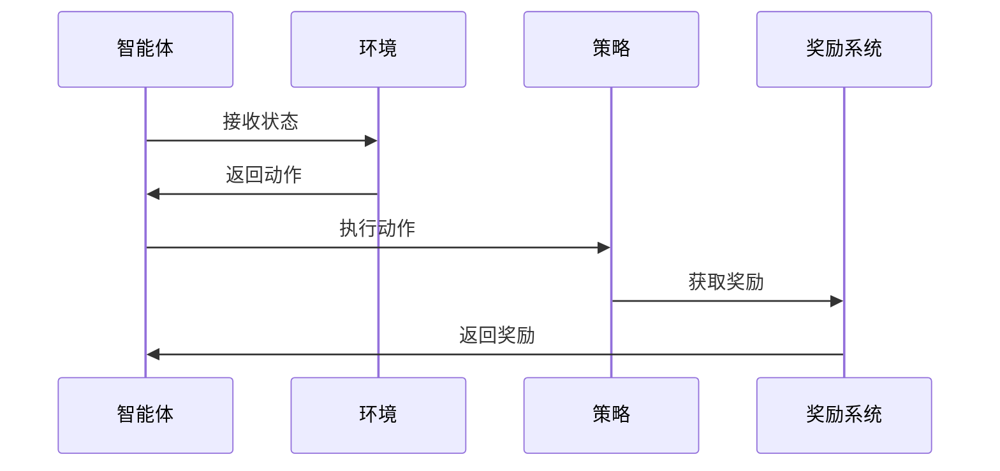

                 

# 提示词优化的强化学习方法

> 关键词：强化学习、提示词优化、算法设计、系统架构、Python实现、最佳实践

> 摘要：本文旨在探讨提示词优化在强化学习方法中的应用，详细解析了该领域的核心概念、算法原理以及系统架构设计。通过Python代码实例和实际案例的分析，本文为读者提供了一个全面、深入的强化学习实践指南。

## 引言

在人工智能领域中，强化学习（Reinforcement Learning，RL）因其独特的优势，在许多场景中都得到了广泛应用。然而，强化学习的一个关键挑战是选择合适的提示词（prompt），这对于学习效率和学习效果具有重要影响。提示词优化（Prompt Optimization）则成为提高强化学习性能的关键手段。本文将深入探讨提示词优化在强化学习中的重要性，分析其核心概念和算法原理，并通过实际案例展示其在系统架构和Python实现中的应用。

## 第一章：强化学习与提示词优化概述

### 1.1 强化学习的基本概念

强化学习是一种机器学习方法，其灵感来源于人类的行为决策过程。在强化学习中，智能体（agent）通过与环境的交互来学习最优策略（policy），以最大化累积奖励（reward）。智能体在每次行动（action）后，都会收到环境反馈的即时奖励，并根据这些奖励调整其行为。

### 1.2 提示词的定义与作用

提示词（prompt）在强化学习中起到了引导智能体行为的作用。它们可以是简单的状态描述，也可以是复杂的先验知识。合适的提示词能够加速学习过程，提高学习效果。

### 1.3 提示词优化的重要性

提示词优化直接影响强化学习的学习效率和学习效果。优化的提示词能够更准确地指导智能体的行为，减少无效的探索，提高学习速度。

## 第二章：核心概念与联系

### 2.1 核心概念表

| 核心概念       | 定义与特征                                           |
|----------------|------------------------------------------------------|
| 强化学习       | 通过与环境的交互学习最优策略的机器学习方法             |
| 提示词         | 引导智能体行为的先验知识或状态描述                     |
| 优化目标       | 使智能体在给定环境中获得最大累积奖励                   |
| 策略梯度方法   | 使用策略梯度来更新策略的优化方法                       |

### 2.2 提示词优化的ER实体关系图

```mermaid
erDiagram
  User ||--|{ Agent }|-- Director
  Environment ||--|{ Agent }|-- Director
  Policy ||--|{ Agent }|-- Director
  Reward ||--|{ Agent }|-- Director
  Prompt ||--|{ Agent }|-- Director
```

## 第三章：提示词优化的算法原理讲解

### 3.1 策略梯度方法

策略梯度方法是一种基于策略优化的强化学习算法。它通过估计策略梯度来更新策略，从而实现优化。策略梯度方法的数学模型如下：

$$
\theta_{t+1} = \theta_t + \alpha \nabla_{\theta_t} J(\theta_t)
$$

其中，$\theta_t$ 表示策略参数，$J(\theta_t)$ 表示策略的评估函数，$\alpha$ 为学习率。

### 3.2 提示词优化的Python实现

```python
import numpy as np

def policy_gradient(batch_states, batch_actions, batch_rewards, theta):
    # 计算策略梯度
    theta_grad = compute_policy_gradient(batch_states, batch_actions, theta)
    # 更新策略参数
    theta = theta + alpha * theta_grad
    return theta

def compute_policy_gradient(batch_states, batch_actions, theta):
    # 计算策略梯度
    # ... (具体实现)
    return theta_grad
```

## 第四章：系统分析与架构设计

### 4.1 问题场景介绍

在本节中，我们考虑一个简单的机器人导航问题，机器人需要在复杂的迷宫中找到出路，并避免障碍物。

### 4.2 项目介绍与目标

项目目标是开发一个基于强化学习的导航系统，使机器人能够自主导航并避免障碍物。

### 4.3 领域模型（Mermaid类图）

```mermaid
classDiagram
  Class1 <|-- Class2
  Class1 <|-- Class3
  Class2 <|-| Class4
  Class3 <|-| Class4
```

### 4.4 系统架构设计（Mermaid架构图）


### 4.5 系统接口设计（Mermaid序列图）



## 第五章：项目实战

### 5.1 环境安装

在本节中，我们将介绍如何搭建强化学习环境，包括Python环境安装、依赖库安装等。

### 5.2 系统核心实现

在本节中，我们将通过Python代码实现系统的核心功能，包括智能体、环境、策略和奖励系统的实现。

### 5.3 代码应用解读与分析

在本节中，我们将对系统核心代码进行详细解读，分析其工作原理和实现细节。

### 5.4 实际案例分析与详细讲解

在本节中，我们将通过一个实际案例，展示强化学习系统在实际应用中的效果，并进行详细的分析和讲解。

### 5.5 项目小结

在本节中，我们将总结项目的主要成果和经验教训，为后续工作提供参考。

## 第六章：最佳实践与总结

### 6.1 最佳实践

在本节中，我们将分享一些在实际项目中取得成功的最佳实践，包括提示词选择、策略优化、系统设计等方面的经验。

### 6.2 小结

在本节中，我们将回顾文章的主要内容，强调提示词优化在强化学习中的重要性，并展望未来研究方向。

### 6.3 注意事项

在本节中，我们将提醒读者在实践过程中需要注意的问题和潜在风险。

### 6.4 拓展阅读

在本节中，我们将推荐一些相关领域的优秀文献和资料，供读者进一步学习和研究。

## 作者信息

作者：AI天才研究院/AI Genius Institute & 禅与计算机程序设计艺术 /Zen And The Art of Computer Programming

---

本文通过深入探讨提示词优化在强化学习中的应用，为读者提供了一个全面的强化学习实践指南。通过算法原理讲解、系统架构设计、实际案例分析和最佳实践分享，本文旨在帮助读者理解和掌握强化学习的核心技术和应用方法。希望本文能对您在强化学习领域的探索和研究有所启发和帮助。

