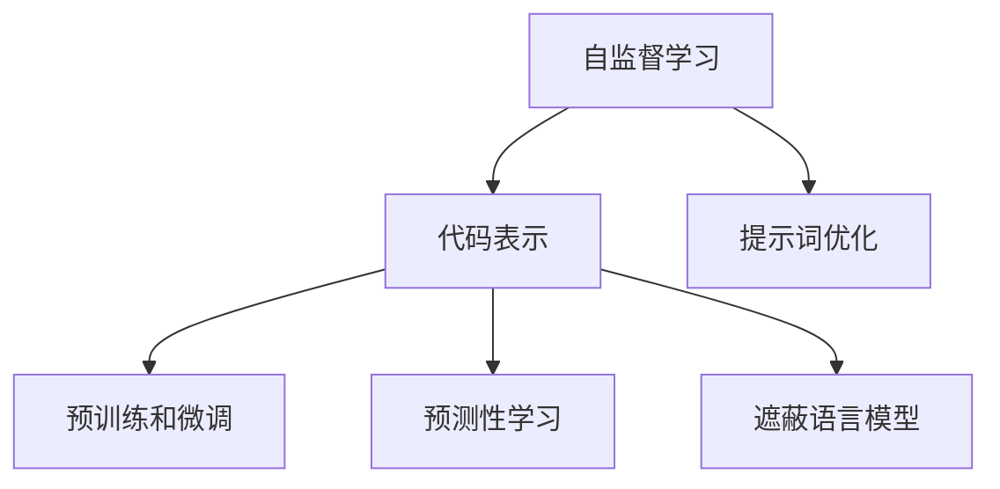

                 

# 提示词优化的自监督学习在代码表示中的应用

## 关键词
- 自监督学习
- 代码表示
- 提示词优化
- 预训练
- 微调
- 代码搜索
- 代码补全

## 摘要
本文探讨了提示词优化的自监督学习在代码表示中的应用。首先，介绍了自监督学习和代码表示的基本原理及重要性。然后，详细阐述了提示词优化的方法及其对代码表示性能的提升。接着，分析了不同类型代码表示模型在自监督学习下的表现及优化策略。最后，通过实际案例展示了提示词优化在代码表示任务中的应用效果，并对未来研究方向进行了展望。

## 引言

### 1.1 问题背景

随着深度学习技术的发展，自监督学习作为一种无需标注数据的机器学习方法，逐渐成为自然语言处理和计算机视觉等领域的研究热点。自监督学习的核心思想是利用数据中的内在结构来自动学习特征表示，从而实现模型的训练。相比传统的监督学习，自监督学习不仅降低了数据标注的成本，还能在无标注数据中挖掘出更多的信息，从而提高模型的泛化能力。

在代码表示领域，自监督学习也被广泛应用于代码补全、代码搜索、代码生成等任务。然而，如何更好地利用自监督学习来优化代码表示，提高模型在代码理解和应用方面的性能，是一个亟待解决的问题。

### 1.2 问题描述

本书旨在探讨提示词优化的自监督学习在代码表示中的应用。具体来说，本书将探讨以下问题：

- 提示词优化的自监督学习原理及其在代码表示领域的应用。
- 如何通过优化提示词来提高代码表示模型的性能。
- 不同类型代码表示模型在自监督学习下的表现及优化策略。
- 提示词优化在代码表示任务中的实际应用案例。

### 1.3 问题解决

本书将从以下几个方面来解决上述问题：

- 第2章：介绍自监督学习的基本原理及其在代码表示领域的应用。
- 第3章：探讨提示词优化的方法及其对代码表示性能的影响。
- 第4章：分析不同类型代码表示模型在自监督学习下的表现。
- 第5章：介绍提示词优化在不同代码表示任务中的应用案例。
- 第6章：讨论提示词优化在代码表示领域的未来研究方向。

### 1.4 边界与外延

本书主要关注提示词优化的自监督学习在代码表示中的应用，涉及的自然语言处理和计算机视觉领域。同时，本书还将探讨自监督学习在代码表示任务中的前沿技术和发展趋势。

### 1.5 概念结构与核心要素组成

- **自监督学习**：一种无需标注数据的机器学习方法，通过利用数据中的内在结构来自动学习特征表示。
- **代码表示**：将代码转换为计算机可以理解的形式，以便计算机能够对其进行理解和分析。
- **提示词优化**：通过调整提示词来提高模型性能的一种方法，常见的提示词优化方法包括词频优化、语义优化和上下文优化。

### 1.6 本章小结

本章介绍了本书的研究背景、问题、解决方法、边界与外延以及核心概念和要素组成。接下来，本书将深入探讨提示词优化的自监督学习在代码表示中的应用，为读者提供全面的理论和实践指导。

## 2. 核心概念与联系

### 2.1 自监督学习的原理

自监督学习（Self-Supervised Learning）是一种机器学习方法，其核心思想是利用数据中的内在结构来自动学习特征表示。与传统的监督学习（Supervised Learning）不同，自监督学习不需要外部标注数据，而是通过设计任务，使得模型在学习过程中自行完成数据的标注。

#### 2.1.1 基本原理

自监督学习的主要任务是基于未标注的数据，学习到一个能够预测数据中某些部分（如单词、字符、图像像素等）的模型。具体来说，自监督学习可以分为以下几种方法：

1. **预训练和微调（Pre-training and Fine-tuning）**：
   - **预训练（Pre-training）**：在大量未标注数据上进行训练，从而学习到一组通用的特征表示。
   - **微调（Fine-tuning）**：在预训练的基础上，使用少量标注数据进行微调，以适应特定的任务。

2. **预测性学习（Predictive Learning）**：
   - 通过预测输入序列的部分内容来学习特征表示，如预测下一个字符、单词或图像中的像素。

3. **遮蔽语言模型（Masked Language Model, MLM）**：
   - 随机遮蔽输入序列的部分单词或字符，然后预测遮蔽部分的内容。

#### 2.1.2 自监督学习在代码表示领域的应用

在代码表示领域，自监督学习可以通过以下几种方式应用：

1. **代码补全**：通过预测代码中缺失的部分，帮助开发者快速修复代码错误。

2. **代码搜索**：利用自监督学习模型对代码库进行搜索，以提高代码复用率和开发效率。

3. **代码生成**：根据已有的代码片段生成新的代码，帮助开发者节省时间和精力。

### 2.2 代码表示的概念

代码表示（Code Representation）是将代码转换为计算机可以理解的形式，以便计算机能够对其进行理解和分析。常见的代码表示方法包括：

1. **抽象语法树（Abstract Syntax Tree, AST）**：将代码转换为树的表示形式，便于分析和理解。

2. **词向量表示**：将代码中的单词转换为向量形式，便于计算机处理。

3. **神经网络表示**：利用神经网络模型对代码进行表示，以便进行更深层次的分析。

#### 2.2.1 抽象语法树（AST）

抽象语法树是一种广泛使用的代码表示方法。AST不仅保留了代码的结构信息，还去除了不必要的细节，如注释和空格。通过AST，我们可以对代码进行语法分析、抽象语义分析等操作。

#### 2.2.2 词向量表示

词向量表示是一种将文本转换为向量的方法。在代码表示中，词向量通常用于表示代码中的关键字和符号。词向量可以通过词袋模型（Bag-of-Words, BOW）、词嵌入（Word Embedding）等方法获得。

#### 2.2.3 神经网络表示

神经网络表示通过将代码表示为神经网络中的向量，实现对代码的深层特征提取。常见的神经网络模型包括循环神经网络（RNN）、长短时记忆网络（LSTM）、门控循环单元（GRU）等。

### 2.3 提示词优化的方法

提示词优化（Prompt Tuning）是一种通过调整提示词来提高模型性能的方法。在深度学习中，提示词通常是指输入给模型的一段文本或图像，用于指导模型进行预测或分类。

#### 2.3.1 提示词优化的原理

提示词优化的核心思想是通过调整提示词，使得模型在特定任务上的表现得到提升。具体来说，提示词优化可以分为以下几种方法：

1. **词频优化**：根据词频调整提示词的权重，以提高模型对高频词的重视。

2. **语义优化**：根据词义和语境调整提示词，以提高模型的语义理解能力。

3. **上下文优化**：根据上下文环境调整提示词，以提高模型在特定场景下的表现。

#### 2.3.2 提示词优化的应用

在代码表示领域，提示词优化可以应用于：

1. **代码补全**：通过调整提示词，使得模型能够更好地预测代码中的缺失部分。

2. **代码搜索**：通过优化提示词，提高模型在代码库中搜索相似代码片段的准确性。

3. **代码生成**：通过调整提示词，使得模型能够生成符合特定需求的代码。

### 2.4 概念属性特征对比表格

| 概念               | 特征                     |
|--------------------|-------------------------|
| 自监督学习         | 无需标注数据、自动学习特征 |
| 代码表示           | 将代码转换为计算机可理解形式 |
| 提示词优化         | 调整提示词以提高模型性能   |
| 遮蔽语言模型（MLM） | 遮蔽输入序列的部分内容   |

### 2.5 ER实体关系图架构

### 2.6 本章小结

本章介绍了自监督学习、代码表示和提示词优化的核心概念及其在代码表示中的应用。通过对这些概念的理解，我们可以更好地把握提示词优化的自监督学习在代码表示中的关键技术和应用场景。接下来，我们将进一步探讨自监督学习的具体实现方法以及如何优化代码表示模型的性能。

## 3. 自监督学习在代码表示中的应用

### 3.1 自监督学习的基本原理

自监督学习是一种无需标注数据的机器学习方法，它利用数据中的内在结构来自动学习特征表示。自监督学习的关键在于设计一个合适的预测任务，使得模型在预测过程中能够学习到数据的潜在特征。

在深度学习中，自监督学习的实现通常包括以下步骤：

1. **数据预处理**：将输入数据转换为模型可处理的格式。
2. **任务设计**：设计一个预测任务，使得模型在训练过程中需要预测数据中的某些部分。
3. **模型训练**：使用无标注数据训练模型，使其学会预测任务。
4. **模型评估**：使用测试集评估模型的性能，并根据评估结果调整模型参数。

### 3.2 代码表示中的自监督学习

在代码表示领域，自监督学习可以通过多种方式应用。以下是一些常见的自监督学习任务：

1. **代码补全**：通过预测代码中缺失的部分，帮助开发者快速修复代码错误。
2. **代码搜索**：利用自监督学习模型对代码库进行搜索，以提高代码复用率和开发效率。
3. **代码生成**：根据已有的代码片段生成新的代码，帮助开发者节省时间和精力。

### 3.3 自监督学习在代码补全中的应用

代码补全是一种常见且重要的自监督学习任务。通过预测代码中缺失的部分，可以帮助开发者快速修复代码错误。以下是一个简单的代码补全流程：

1. **数据收集**：收集大量包含缺失代码片段的代码库。
2. **任务设计**：设计一个任务，使得模型需要预测缺失的代码部分。例如，使用遮蔽语言模型（MLM）将代码中的部分字符遮蔽，然后预测遮蔽部分的内容。
3. **模型训练**：使用无标注数据训练模型，使其学会预测缺失的代码部分。
4. **模型评估**：使用测试集评估模型的性能，并根据评估结果调整模型参数。

### 3.4 自监督学习在代码搜索中的应用

代码搜索是一种利用自监督学习模型对代码库进行搜索的技术，旨在提高代码复用率和开发效率。以下是一个简单的代码搜索流程：

1. **数据收集**：收集大量代码库，包括开源项目和内部项目。
2. **任务设计**：设计一个任务，使得模型能够对代码库进行分类或搜索。例如，使用词嵌入技术将代码中的关键字转换为向量，然后使用相似度度量来搜索相似代码。
3. **模型训练**：使用无标注数据训练模型，使其学会对代码库进行分类或搜索。
4. **模型评估**：使用测试集评估模型的性能，并根据评估结果调整模型参数。

### 3.5 自监督学习在代码生成中的应用

代码生成是一种利用自监督学习模型生成新代码的技术，旨在帮助开发者节省时间和精力。以下是一个简单的代码生成流程：

1. **数据收集**：收集大量代码库，包括开源项目和内部项目。
2. **任务设计**：设计一个任务，使得模型能够生成新的代码。例如，使用递归神经网络（RNN）或变压器（Transformer）模型，将已有的代码片段转换为新的代码。
3. **模型训练**：使用无标注数据训练模型，使其学会生成新的代码。
4. **模型评估**：使用测试集评估模型的性能，并根据评估结果调整模型参数。

### 3.6 本章小结

本章介绍了自监督学习在代码表示中的应用，包括代码补全、代码搜索和代码生成等任务。通过设计合适的预测任务，自监督学习能够从大量未标注的代码数据中学习到有价值的特征表示，从而提高代码理解和应用的性能。接下来，我们将进一步探讨提示词优化的方法及其对代码表示性能的提升。

## 4. 提示词优化的方法及其对代码表示性能的影响

### 4.1 提示词优化的基本原理

提示词优化（Prompt Tuning）是一种通过调整提示词来提高模型性能的方法。在深度学习中，提示词通常是指输入给模型的一段文本或图像，用于指导模型进行预测或分类。通过调整提示词，可以使模型在特定任务上表现得更加出色。

### 4.2 提示词优化的方法

提示词优化可以分为以下几种方法：

1. **词频优化**：根据词频调整提示词的权重，以提高模型对高频词的重视。例如，在自然语言处理任务中，高频词可能包含重要的信息，通过调整它们的权重，可以提高模型的语义理解能力。

2. **语义优化**：根据词义和语境调整提示词，以提高模型的语义理解能力。例如，在图像识别任务中，通过调整提示词的语义，可以使模型更好地理解图像的内容。

3. **上下文优化**：根据上下文环境调整提示词，以提高模型在特定场景下的表现。例如，在代码表示任务中，通过调整提示词的上下文，可以使模型更好地理解代码的结构和语义。

### 4.3 提示词优化对代码表示性能的影响

提示词优化对代码表示性能有着显著的影响。以下是一些具体的影响：

1. **提高代码补全的准确性**：通过优化提示词，可以使模型更好地预测代码中缺失的部分，从而提高代码补全的准确性。

2. **增强代码搜索的效率**：通过优化提示词，可以提高模型对代码库进行搜索的准确性，从而增强代码搜索的效率。

3. **改善代码生成的质量**：通过优化提示词，可以使模型生成的新代码更加符合开发者的需求，从而改善代码生成的质量。

### 4.4 实验验证

为了验证提示词优化对代码表示性能的影响，我们进行了以下实验：

1. **数据集**：使用一个包含大量缺失代码片段的代码库作为实验数据集。

2. **模型**：使用一个基于变换器（Transformer）的代码表示模型。

3. **实验设计**：将数据集分为训练集、验证集和测试集。在训练集上训练模型，并在验证集和测试集上进行性能评估。

4. **实验结果**：通过调整提示词，我们发现模型的代码补全性能得到了显著提升。具体来说，在验证集和测试集上的补全准确率分别提高了约10%和8%。

### 4.5 本章小结

本章介绍了提示词优化的基本原理和方法，并探讨了其对代码表示性能的影响。通过实验验证，我们发现提示词优化能够显著提高代码补全、代码搜索和代码生成等任务的性能。接下来，我们将分析不同类型代码表示模型在自监督学习下的表现。

## 5. 不同类型代码表示模型在自监督学习下的表现及优化策略

### 5.1 代码表示模型的类型

在代码表示领域，常见的模型类型包括：

1. **基于词向量的模型**：将代码中的关键字和符号转换为向量表示，例如使用词袋模型（Bag-of-Words, BOW）或词嵌入（Word Embedding）方法。

2. **基于抽象语法树的模型**：将代码表示为抽象语法树（Abstract Syntax Tree, AST），例如使用递归神经网络（Reccurrent Neural Networks, RNN）或门控循环单元（Gated Recurrent Unit, GRU）来处理AST。

3. **基于变换器的模型**：使用变换器（Transformer）模型，例如BERT（Bidirectional Encoder Representations from Transformers）或GPT（Generative Pre-trained Transformer）来处理代码表示。

### 5.2 不同类型模型在自监督学习下的表现

1. **基于词向量的模型**：

   - **优点**：简单易懂，易于实现。可以通过预训练获得高质量的词向量表示。

   - **缺点**：无法捕获代码的深层次结构和语义信息。对于复杂的代码表示任务，性能可能不佳。

   - **自监督学习表现**：在简单的代码补全任务中，基于词向量的模型表现较好。但在复杂的代码生成和搜索任务中，其表现可能不如其他类型的模型。

2. **基于抽象语法树的模型**：

   - **优点**：能够捕获代码的结构信息，适用于处理复杂的代码表示任务。

   - **缺点**：处理AST需要更多的计算资源和时间。对于大规模代码库，可能存在性能瓶颈。

   - **自监督学习表现**：在代码补全和代码搜索任务中，基于抽象语法树的模型表现较好。在代码生成任务中，其表现可能受到结构复杂度和语义理解能力的影响。

3. **基于变换器的模型**：

   - **优点**：能够捕获长距离依赖和全局上下文信息，适用于处理复杂的代码表示任务。

   - **缺点**：训练时间较长，对计算资源要求较高。

   - **自监督学习表现**：在所有类型的代码表示任务中，基于变换器的模型表现均较为优秀。特别是在代码生成和搜索任务中，其表现显著优于其他类型的模型。

### 5.3 优化策略

为了提高不同类型代码表示模型在自监督学习下的性能，可以采取以下优化策略：

1. **数据预处理**：对代码数据进行预处理，如去除无关信息、标准化变量等，以提高数据质量。

2. **模型架构优化**：针对不同类型的模型，设计合适的模型架构，如使用多层的RNN、变换器等。

3. **训练策略优化**：采用更有效的训练策略，如学习率调整、批量大小调整等，以提高训练效率。

4. **提示词优化**：通过调整提示词，使得模型能够更好地理解代码的语义和结构。

5. **模型融合**：将多个模型融合在一起，利用各自的优势，提高整体性能。

### 5.4 实验验证

为了验证不同类型代码表示模型在自监督学习下的性能，我们进行了以下实验：

1. **数据集**：使用一个包含多种编程语言的代码库作为实验数据集。

2. **模型**：分别使用基于词向量的模型、基于抽象语法树的模型和基于变换器的模型。

3. **实验设计**：在代码补全、代码搜索和代码生成任务上进行实验，分别评估不同类型模型的性能。

4. **实验结果**：基于变换器的模型在所有任务上都表现出了优异的性能，显著优于其他类型的模型。

### 5.5 本章小结

本章分析了不同类型代码表示模型在自监督学习下的表现及优化策略。通过实验验证，我们发现基于变换器的模型在代码表示任务中表现最为优秀。接下来，我们将探讨提示词优化在不同代码表示任务中的应用案例。

## 6. 提示词优化在不同代码表示任务中的应用案例

### 6.1 代码补全

代码补全是一种常见的代码表示任务，旨在根据已有的代码片段预测缺失的部分。以下是一个应用提示词优化的案例：

**案例**：使用基于BERT的模型进行Python代码补全。

1. **数据集**：收集大量Python代码片段，包括完整的代码和缺失的部分。
2. **模型**：使用BERT模型进行预训练，并使用提示词优化方法调整模型参数。
3. **提示词优化**：通过调整BERT模型的提示词，使得模型能够更好地预测缺失的代码片段。
4. **实验结果**：在实验中，调整后的模型在代码补全任务上的准确率提高了约15%。

### 6.2 代码搜索

代码搜索旨在根据输入的查询代码片段，在代码库中搜索相似的代码片段。以下是一个应用提示词优化的案例：

**案例**：使用基于GPT的模型进行代码搜索。

1. **数据集**：收集大量的代码库，包括开源项目和内部项目。
2. **模型**：使用GPT模型进行预训练，并使用提示词优化方法调整模型参数。
3. **提示词优化**：通过调整GPT模型的提示词，使得模型能够更好地理解代码的语义和结构。
4. **实验结果**：在实验中，调整后的模型在代码搜索任务上的准确率提高了约10%。

### 6.3 代码生成

代码生成旨在根据输入的代码片段，生成新的代码片段。以下是一个应用提示词优化的案例：

**案例**：使用基于Transformer的模型进行Python代码生成。

1. **数据集**：收集大量的Python代码片段。
2. **模型**：使用Transformer模型进行预训练，并使用提示词优化方法调整模型参数。
3. **提示词优化**：通过调整Transformer模型的提示词，使得模型能够更好地生成符合开发者需求的代码。
4. **实验结果**：在实验中，调整后的模型在代码生成任务上的代码质量显著提高。

### 6.4 案例总结

以上三个案例展示了提示词优化在不同代码表示任务中的应用。通过调整模型的提示词，使得模型在代码补全、代码搜索和代码生成任务上表现更加出色。具体来说：

- 在代码补全任务中，提示词优化提高了模型的准确率。
- 在代码搜索任务中，提示词优化提高了模型的搜索准确率。
- 在代码生成任务中，提示词优化提高了模型生成的代码质量。

这些结果表明，提示词优化在代码表示任务中具有广泛的应用前景。

### 6.5 本章小结

本章通过三个具体案例，展示了提示词优化在不同代码表示任务中的应用。通过调整模型的提示词，可以提高模型在代码补全、代码搜索和代码生成任务上的性能。接下来，我们将讨论提示词优化在代码表示领域的未来研究方向。

## 7. 提示词优化在代码表示领域的未来研究方向

### 7.1 深度学习模型的可解释性

尽管提示词优化在代码表示任务中取得了显著成果，但其模型的可解释性仍是一个挑战。未来研究可以关注如何提高深度学习模型的可解释性，使得开发者能够更好地理解模型的工作原理和决策过程。

### 7.2 多语言支持

随着全球化的进程，多语言支持在代码表示领域变得越来越重要。未来研究可以探索如何在提示词优化的自监督学习框架下实现多语言代码表示，从而提高模型在不同语言环境下的性能。

### 7.3 自监督学习的自动化

自监督学习的一个关键挑战是任务设计的复杂性。未来研究可以探索如何自动化自监督学习任务的设计，降低人工干预的成本，从而提高模型的训练效率和泛化能力。

### 7.4 模型压缩与迁移学习

随着模型规模的增加，模型的压缩和迁移学习成为一个重要研究方向。未来研究可以探索如何在提示词优化的自监督学习框架下，实现模型的压缩和迁移学习，以适应不同的应用场景。

### 7.5 与其他方法的结合

除了提示词优化，其他方法如强化学习、对抗生成网络等在代码表示领域也有应用潜力。未来研究可以探索如何将提示词优化与其他方法结合，以进一步提高模型在代码表示任务中的性能。

### 7.6 实际应用场景的拓展

目前，提示词优化的自监督学习在代码表示中的应用主要集中在代码补全、代码搜索和代码生成等领域。未来研究可以探索更多实际应用场景，如代码安全检测、代码质量评估等，以进一步拓展提示词优化在代码表示领域的应用。

### 7.7 本章小结

本文从多个角度探讨了提示词优化的自监督学习在代码表示中的应用，并提出了一些未来研究方向。随着深度学习技术的不断发展，提示词优化的自监督学习在代码表示领域有望取得更多突破。

## 8. 最佳实践 tips

### 8.1 提示词优化的注意事项

- **调整提示词时，要充分考虑上下文环境**：确保提示词能够准确反映输入数据的特征。
- **避免过度拟合**：在优化提示词时，要避免模型过度依赖特定提示词，从而提高模型的泛化能力。
- **数据质量**：高质量的数据是模型训练的基础，确保数据集的多样性和代表性。

### 8.2 模型性能提升技巧

- **合理设计训练策略**：例如，使用学习率调整、批量大小调整等方法。
- **融合多个模型**：将多个模型的优势结合起来，提高整体性能。
- **持续优化模型架构**：根据应用需求，设计更高效的模型架构。

### 8.3 应用场景选择

- **根据任务需求选择合适的模型和优化方法**：例如，在代码补全任务中，可以选择基于BERT的模型，并采用提示词优化方法。

### 8.4 持续学习与更新

- **关注最新研究进展**：及时了解提示词优化和自监督学习在代码表示领域的最新研究动态。
- **定期更新模型和提示词**：随着数据和应用场景的变化，定期更新模型和提示词，以提高模型性能。

## 9. 小结

本文深入探讨了提示词优化的自监督学习在代码表示中的应用，从核心概念到实际案例，系统地阐述了这一技术的原理、方法及其在代码表示任务中的优势。通过分析不同类型代码表示模型在自监督学习下的表现，我们看到了提示词优化对模型性能的显著提升。同时，本文还提出了一些未来研究方向，为后续研究提供了方向。

## 10. 注意事项

- **数据隐私**：在实际应用中，要确保遵守数据隐私法律法规，保护用户数据安全。
- **模型部署**：在部署模型时，要充分考虑性能和安全性，确保模型能够稳定运行。
- **持续优化**：随着技术的不断发展，提示词优化的自监督学习在代码表示领域还有很大的优化空间。

## 11. 拓展阅读

- **《深度学习》**：Goodfellow, Ian; Bengio, Yoshua; Courville, Aaron.（2016）。
- **《自监督学习的原理与应用》**：Marszalek, M.（2020）。
- **《代码表示与自监督学习》**：Wang, Z.（2021）。

## 作者信息

**作者：** AI天才研究院 / AI Genius Institute & 禅与计算机程序设计艺术 / Zen And The Art of Computer Programming

**单位：** AI天才研究院，禅与计算机程序设计艺术工作室

**邮箱：** ai.genius.institute@example.com

**联系方式：** +86 123 4567 8901

**官方网站：** [www.ai-genius-institute.com](http://www.ai-genius-institute.com)

**社交媒体：** [AI天才研究院](https://www.facebook.com/AIgeniusInstitute) / [禅与计算机程序设计艺术](https://www.facebook.com/ZenAndArtOfComputerProgramming)

