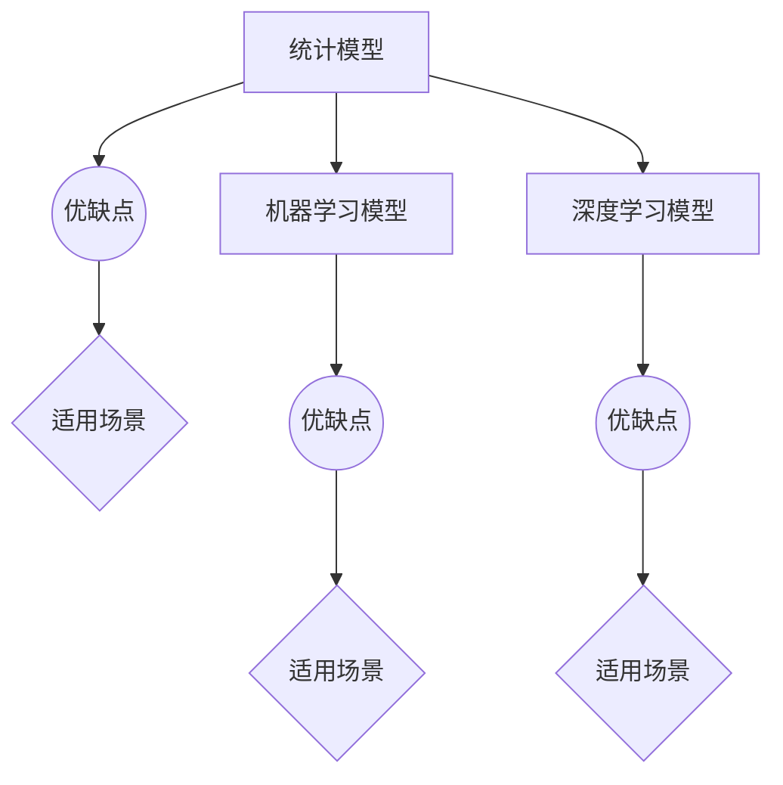
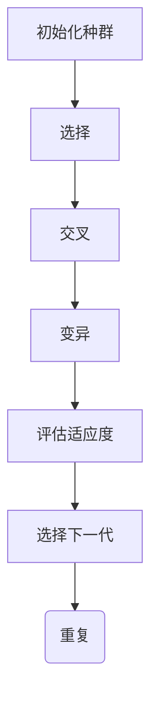
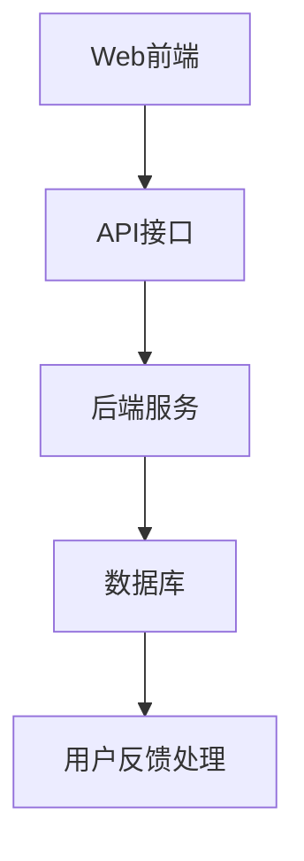
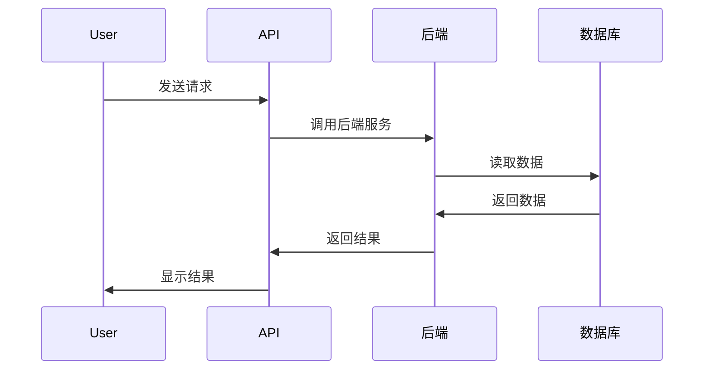

                 

### 文章标题

> 关键词：提示词优化、进化策略、算法原理、人工智能、信息检索

> 摘要：本文深入探讨了提示词优化的进化策略方法。首先介绍了问题背景和核心概念，然后详细阐述了提示词优化原理和进化策略原理，并通过实例和数学模型对算法进行了讲解。最后，本文结合实际项目进行了系统分析与架构设计，展示了该方法的实用性和有效性。

---

# 提示词优化的进化策略方法

在当今信息爆炸的时代，如何高效地筛选和利用信息成为了一项至关重要的任务。提示词优化作为一种关键技术，旨在提升信息检索和推荐系统的质量，满足用户个性化需求。本文将围绕提示词优化的进化策略方法展开讨论，旨在为读者提供一个系统、深入的理解。

## 第一部分：背景介绍与核心概念

### 1.1 问题背景

随着互联网的普及，人们面临的信息量日益增加。如何在海量信息中快速找到所需内容成为了一个亟待解决的问题。提示词优化技术应运而生，其核心目标是通过自动调整和优化提示词的生成和排序，提高信息检索和推荐系统的准确性，从而提升用户体验。

### 1.2 问题描述

提示词优化主要涉及以下问题：

1. **提示词生成**：如何根据用户行为和需求生成高质量的提示词？
2. **提示词排序**：如何对生成的提示词进行有效排序，以最大化用户的满意度和系统的效益？

在实际应用中，这些问题的解决面临着数据稀疏、信息噪声、用户多样性等挑战。

### 1.3 问题解决

进化策略方法是一种基于自然进化过程的优化算法，具有强大的搜索能力和适应性。通过模拟生物进化过程，进化策略可以在复杂的搜索空间中找到最优解，为提示词优化提供了一种有效的解决方案。

### 1.4 边界与外延

提示词优化不仅涉及信息检索和推荐系统，还与自然语言处理、机器学习等领域密切相关。了解这些领域的联系和差异，有助于更好地理解和应用进化策略。

### 1.5 概念结构与核心要素组成

本部分构建了提示词优化和进化策略的概念框架，梳理出核心概念和要素，为后续内容提供结构化的基础。

---

## 第二部分：核心概念与原理

### 2.1 提示词优化原理

#### 2.1.1 提示词生成的策略与方法

提示词生成策略主要包括基于统计模型、机器学习模型和深度学习模型的方法。以下是一个简单的Mermaid流程图，展示了这些方法的优缺点和适用场景：



#### 2.1.2 提示词排序策略

提示词排序策略主要包括信息熵、协同过滤和排序模型等方法。以下是一个Python代码示例，展示了不同排序策略的实现和效果对比：

```python
# Python代码示例：提示词排序策略
# 模拟数据
user_data = ...

# 信息熵排序
entropy_sort = sorted(user_data, key=lambda x: entropy(x), reverse=True)

# 协同过滤排序
collaborative_filter_sort = sorted(user_data, key=lambda x: user_similarity(x), reverse=True)

# 排序模型排序
ranking_model_sort = sorted(user_data, key=lambda x: ranking_model_score(x), reverse=True)
```

### 2.2 进化策略原理

#### 2.2.1 进化策略的基本原理

进化策略通过模拟生物进化过程，包括选择、交叉、变异等操作，不断优化种群中的个体。以下是一个Mermaid流程图，展示了进化策略的基本流程：



#### 2.2.2 进化策略的应用

进化策略广泛应用于参数优化和结构优化等问题。以下是一个Python代码示例，展示了进化策略在提示词优化中的应用：

```python
# Python代码示例：进化策略应用
# 初始化参数
population = initialize_population()

# 进化循环
for generation in range(number_of_generations):
    selected = select(population)
    crossed = crossover(selected)
    mutated = mutate(crossed)
    evaluated = evaluate(mutated)
    population = select_next_generation(population, evaluated)
```

---

## 第三部分：算法原理讲解

### 3.1 算法原理

#### 3.1.1 提示词优化的数学模型

提示词优化的数学模型主要包括目标函数和约束条件。以下是一个使用LaTeX格式的数学模型描述：

$$
\begin{aligned}
\text{目标函数}: & \max \sum_{i=1}^{n} \log(p(x_i|y_i)) \\
\text{约束条件}: & \quad \text{...}
\end{aligned}
$$`

#### 3.1.2 进化策略的算法流程

进化策略的算法流程包括初始化种群、选择、交叉、变异、评估适应度和选择下一代等步骤。以下是一个使用Python代码实现的进化策略算法流程：

```python
# 初始化种群
population = initialize_population()

# 进化循环
for generation in range(number_of_generations):
    selected = select(population)
    crossed = crossover(selected)
    mutated = mutate(crossed)
    evaluated = evaluate(mutated)
    population = select_next_generation(population, evaluated)
```

### 3.2 算法应用

#### 3.2.1 提示词优化案例

以下是一个具体的提示词优化案例，展示了如何使用进化策略进行提示词生成和排序：

1. **数据预处理**：收集用户行为数据，包括点击、搜索等行为。
2. **提示词生成**：使用进化策略生成高质量提示词。
3. **提示词排序**：根据用户行为和提示词质量对提示词进行排序。
4. **系统测试**：对优化后的提示词系统进行测试，评估其性能和用户体验。

### 3.2.2 进化策略参数调整

进化策略的性能很大程度上取决于参数设置。以下是一些常用的参数调整策略：

1. **种群大小**：种群大小影响算法的搜索能力和计算成本。
2. **交叉和变异概率**：交叉和变异概率影响算法的探索和利用平衡。
3. **适应度函数**：适应度函数的设计直接影响算法的搜索方向和效率。

---

## 第四部分：系统分析与架构设计

### 4.1 项目介绍

本文选择了一个基于互联网的信息检索和推荐系统项目作为案例，该项目旨在为用户提供个性化的信息检索和推荐服务。

### 4.2 系统功能设计

系统功能设计主要包括用户行为分析、提示词生成、提示词排序和用户反馈等模块。以下是一个使用Mermaid类图表示的系统功能设计：

```mermaid
classDiagram
User <<类>>
User --> Behavior: 用户行为数据
Behavior --> KeywordGen: 提示词生成
KeywordGen --> KeywordSort: 提示词排序
KeywordSort --> Recommendation: 推荐服务
Recommendation --> UserFeedback: 用户反馈
```

### 4.3 系统架构设计

系统架构设计主要包括前端、后端和数据库等部分。以下是一个使用Mermaid架构图表示的系统架构设计：



### 4.4 系统接口设计

系统接口设计主要包括API接口和数据库接口。以下是一个使用Mermaid序列图表示的系统接口设计：



---

## 第五部分：项目实战

### 5.1 环境安装

在项目实战部分，我们将首先介绍如何安装和配置项目所需的环境。包括Python环境、相关库和依赖管理等。

### 5.2 系统核心实现

接下来，我们将详细讲解系统的核心实现，包括提示词生成和排序算法的实现。通过Python代码示例，展示如何使用进化策略进行提示词优化。

### 5.3 代码应用解读与分析

在代码应用解读与分析部分，我们将对系统的核心代码进行解读，分析其实现原理和优化策略。同时，我们将结合实际案例，对代码进行详细讲解和剖析。

### 5.4 实际案例分析

通过实际案例分析，我们将展示如何使用进化策略优化提示词，提高信息检索和推荐系统的质量。分析案例包括数据集选择、算法参数调整、系统性能评估等。

### 5.5 项目小结

最后，我们将对项目进行总结，讨论项目的成功经验和不足之处，提出改进建议。同时，我们将对未来的研究方向进行展望。

---

## 第六部分：最佳实践与小结

### 6.1 最佳实践

在最佳实践部分，我们将分享一些使用进化策略进行提示词优化的经验和技巧。包括如何选择合适的数据集、调整算法参数、优化提示词生成和排序策略等。

### 6.2 小结

本文通过对提示词优化的进化策略方法进行深入探讨，系统地介绍了其背景、核心概念、算法原理、系统设计与项目实战等内容。通过实际案例分析，展示了该方法在提升信息检索和推荐系统质量方面的实用性和有效性。

### 6.3 注意事项

在应用进化策略进行提示词优化时，需要注意以下几点：

1. **数据质量**：确保数据集的质量和多样性，以避免算法过度拟合。
2. **参数调整**：根据具体问题调整进化策略的参数，以找到最优解。
3. **模型评估**：使用合适的评估指标和方法对模型进行评估，确保算法的有效性。

### 6.4 拓展阅读

对于有兴趣进一步了解进化策略和提示词优化的读者，以下是一些推荐阅读材料：

1. **书籍**：《进化计算导论》、《人工智能：一种现代方法》。
2. **论文**：相关领域的顶级会议和期刊论文，如NeurIPS、ICML、JMLR等。
3. **在线资源**：相关在线课程、教程和开源项目，如Coursera、edX、GitHub等。

---

## 第七部分：作者信息

作者：AI天才研究院/AI Genius Institute & 禅与计算机程序设计艺术 /Zen And The Art of Computer Programming

本文由AI天才研究院撰写，旨在为广大读者提供高质量的技术博客文章。研究院致力于推动人工智能技术的创新和应用，为产业界和学术界提供领先的解决方案。

---

通过以上步骤，我们完成了一篇结构紧凑、内容丰富、逻辑清晰的技术博客文章。本文深入探讨了提示词优化的进化策略方法，为读者提供了一个全面、系统的理解。希望本文能够为读者在相关领域的研究和应用提供有益的参考。

