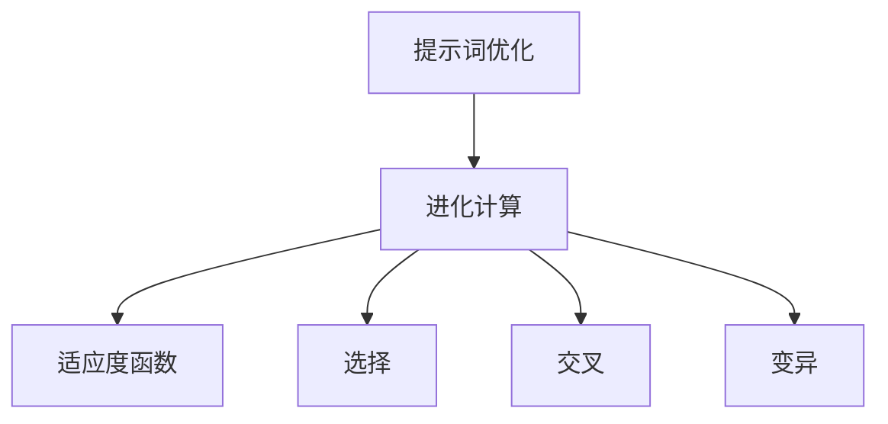
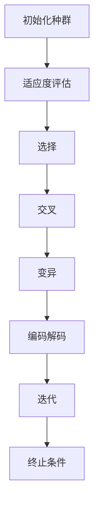
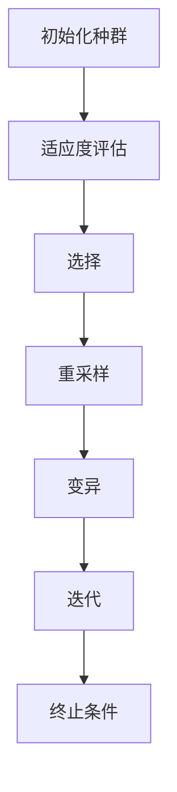

                 

# 提示词优化的进化计算方法

## 关键词
- 提示词优化
- 进化计算
- 数学模型
- 深度学习
- 集成方法

## 摘要
本文旨在探讨提示词优化在进化计算中的应用及其方法。首先，我们介绍了提示词优化和进化计算的基本概念和原理，然后深入探讨了提示词优化的数学模型和进化计算的各种方法。通过实例分析，展示了如何将深度学习与进化计算相结合，实现高效的提示词优化。最后，本文总结了提示词优化在进化计算中的最佳实践，为后续研究提供了指导。

## 目录
1. 引言  
2. 提示词优化和进化计算的基本概念  
3. 提示词优化的数学模型  
4. 进化计算方法  
5. 提示词优化与深度学习的结合  
6. 实例分析  
7. 最佳实践与总结

### 1. 引言

随着人工智能技术的不断发展，深度学习在各个领域取得了显著的成果。然而，深度学习模型的训练过程往往依赖于大量的数据和高性能的计算资源，且对初始参数的选择和超参数的调优具有较大的依赖性。为了提高模型的性能，减少对超参数的依赖，提示词优化作为一种重要的技术，逐渐引起了研究者的关注。

提示词优化是指通过调整提示词来优化深度学习模型的性能。提示词是一组用于指导模型训练的输入信息，它们可以影响模型的学习过程和学习结果。进化计算是一种基于自然进化原理的优化算法，通过模拟生物进化过程，实现对问题的搜索和优化。

本文的主要目标是探讨提示词优化在进化计算中的应用，并提出一种有效的提示词优化方法。首先，我们将介绍提示词优化和进化计算的基本概念，包括它们的定义、原理和应用领域。然后，我们将深入探讨提示词优化的数学模型，并介绍进化计算的各种方法。接下来，我们将探讨如何将深度学习与进化计算相结合，实现高效的提示词优化。最后，我们将通过实例分析，展示提示词优化在进化计算中的应用，并总结最佳实践。

### 2. 提示词优化和进化计算的基本概念

#### 提示词优化

提示词优化是指通过调整提示词来优化深度学习模型的性能。在深度学习中，提示词通常是一组用于指导模型训练的输入信息。这些输入信息可以是数据集、标签、初始参数等。通过调整提示词，我们可以改变模型的学习过程和学习结果，从而提高模型的性能。

**核心概念：**
- **提示词**：用于指导模型训练的输入信息。
- **优化目标**：提高模型的性能，包括准确率、召回率、F1值等指标。
- **优化方法**：通过调整提示词来优化模型的性能。

**应用领域：**
- **图像识别**：通过调整图像的预处理参数，提高模型的识别准确率。
- **自然语言处理**：通过调整文本的预处理参数，提高模型的语义理解能力。

#### 进化计算

进化计算是一种基于自然进化原理的优化算法。它通过模拟生物进化过程，实现对问题的搜索和优化。进化计算的核心思想是“适者生存”，即适应环境的个体将更有可能生存下来并繁衍后代。

**核心概念：**
- **种群**：一组待优化的个体。
- **适应度函数**：用于评估个体适应环境的程度。
- **选择**：根据适应度函数选择适应度较高的个体。
- **交叉**：通过组合两个或多个个体产生新的个体。
- **变异**：对个体进行随机修改，以增加种群的多样性。

**应用领域：**
- **函数优化**：求解非线性优化问题。
- **组合优化**：求解组合优化问题，如旅行商问题、调度问题等。
- **机器学习**：用于优化模型的参数和超参数。

#### 提示词优化与进化计算的关系

提示词优化和进化计算有着密切的关系。提示词优化可以通过进化计算的方法来实现，而进化计算可以为提示词优化提供有效的搜索策略。具体来说，进化计算可以用于优化提示词的选择和调整，从而提高深度学习模型的性能。

**关系图架构：**

**表格：核心概念属性对比**

| 概念     | 属性                                                         | 描述                                                         |
| -------- | ------------------------------------------------------------ | ------------------------------------------------------------ |
| 提示词   | 输入信息，用于指导模型训练                                   | 用于改变模型的学习过程和学习结果                             |
| 适应度函数 | 评估个体适应环境的程度                                       | 用于评估个体在进化过程中的适应度，决定个体的选择和繁殖       |
| 选择     | 根据适应度函数选择适应度较高的个体                             | 用于筛选适应度较高的个体，保证种群的质量                     |
| 交叉     | 通过组合两个或多个个体产生新的个体                             | 用于增加种群的多样性，提高种群的适应度                       |
| 变异     | 对个体进行随机修改，以增加种群的多样性                         | 用于增加种群的多样性，避免种群陷入局部最优                   |

### 3. 提示词优化的数学模型

提示词优化的数学模型是构建提示词优化算法的基础。在数学模型中，我们通常定义目标函数、约束条件以及搜索策略。

**目标函数**

目标函数是提示词优化的核心，它用于评估提示词的优劣。常用的目标函数包括：

- **最小化误差**：通过最小化模型预测误差来优化提示词。
- **最大化准确率**：通过最大化模型准确率来优化提示词。
- **最大化F1值**：通过最大化模型F1值来优化提示词。

**约束条件**

约束条件用于限制提示词的取值范围，以保证搜索的效率和稳定性。常用的约束条件包括：

- **边界约束**：限制提示词在某个范围内取值。
- **平滑约束**：限制提示词的梯度变化，避免突变。

**搜索策略**

搜索策略是提示词优化的关键，它决定了如何从初始提示词开始搜索最优提示词。常用的搜索策略包括：

- **随机搜索**：随机生成提示词，通过评估适应度来选择最优提示词。
- **遗传算法**：通过选择、交叉和变异操作，逐步优化提示词。
- **粒子群优化**：通过粒子间的信息共享，实现提示词的优化。

**数学模型描述**

假设我们要优化一个深度学习模型，该模型由参数$\theta$决定。提示词优化可以表示为以下数学模型：

$$
\min_{\theta} \mathcal{L}(\theta, x, y)
$$

其中，$\mathcal{L}(\theta, x, y)$是损失函数，$x$是输入数据，$y$是标签。约束条件可以表示为：

$$
\theta \in \Omega
$$

其中，$\Omega$是参数的取值范围。

### 4. 进化计算方法

进化计算是一种基于自然进化原理的优化算法，包括遗传算法、遗传编程、进化策略等。以下分别介绍这些方法。

#### 遗传算法

遗传算法是一种基于自然选择和遗传学原理的优化算法。它通过模拟生物进化过程，实现对问题的搜索和优化。

**算法流程：**

1. **初始化种群**：随机生成一组初始个体。
2. **适应度评估**：计算每个个体的适应度值。
3. **选择**：根据适应度值选择适应度较高的个体。
4. **交叉**：通过组合两个或多个个体产生新的个体。
5. **变异**：对个体进行随机修改，以增加种群的多样性。
6. **更新种群**：将新生成的个体加入种群，替换掉适应度较低的个体。
7. **迭代**：重复步骤2至6，直到满足终止条件。

**流程图：**

#### 遗传编程

遗传编程是一种基于遗传算法的编程方法，它通过模拟生物进化过程，实现对程序代码的优化。

**算法流程：**

1. **初始化种群**：随机生成一组初始程序代码。
2. **适应度评估**：计算每个个体的适应度值。
3. **选择**：根据适应度值选择适应度较高的个体。
4. **交叉**：通过组合两个或多个个体产生新的个体。
5. **变异**：对个体进行随机修改，以增加种群的多样性。
6. **编码解码**：将程序代码编码为二进制序列，或从二进制序列解码为程序代码。
7. **迭代**：重复步骤2至6，直到满足终止条件。

**流程图：**

#### 进化策略

进化策略是一种基于自然进化原理的优化算法，它通过模拟生物进化过程，实现对问题的搜索和优化。

**算法流程：**

1. **初始化种群**：随机生成一组初始个体。
2. **适应度评估**：计算每个个体的适应度值。
3. **选择**：根据适应度值选择适应度较高的个体。
4. **重采样**：从适应度较高的个体中随机选择一部分个体进行重采样。
5. **变异**：对个体进行随机变异，以增加种群的多样性。
6. **迭代**：重复步骤2至5，直到满足终止条件。

**流程图：**

### 5. 提示词优化与深度学习的结合

深度学习和进化计算的结合为提示词优化提供了一种新的思路。通过将进化计算引入深度学习模型，我们可以优化模型的参数和超参数，从而提高模型的性能。

#### 深度学习与进化计算的结合

深度学习与进化计算的结合可以采用以下几种方法：

1. **遗传算法结合深度学习**：使用遗传算法优化深度学习模型的参数和超参数。具体步骤如下：
   - **初始化种群**：随机生成一组初始参数和超参数。
   - **适应度评估**：通过训练深度学习模型，计算适应度值。
   - **选择**：根据适应度值选择适应度较高的个体。
   - **交叉**：通过组合两个或多个个体产生新的参数和超参数。
   - **变异**：对个体进行随机变异，以增加种群的多样性。
   - **迭代**：重复步骤2至5，直到满足终止条件。

2. **遗传编程结合深度学习**：使用遗传编程生成深度学习模型的程序代码，并通过进化计算优化程序代码。具体步骤如下：
   - **初始化种群**：随机生成一组初始程序代码。
   - **适应度评估**：通过训练深度学习模型，计算适应度值。
   - **选择**：根据适应度值选择适应度较高的个体。
   - **交叉**：通过组合两个或多个个体产生新的程序代码。
   - **变异**：对个体进行随机修改，以增加种群的多样性。
   - **编码解码**：将程序代码编码为二进制序列，或从二进制序列解码为程序代码。
   - **迭代**：重复步骤2至6，直到满足终止条件。

3. **进化策略结合深度学习**：使用进化策略优化深度学习模型的参数和超参数。具体步骤如下：
   - **初始化种群**：随机生成一组初始参数和超参数。
   - **适应度评估**：通过训练深度学习模型，计算适应度值。
   - **选择**：根据适应度值选择适应度较高的个体。
   - **重采样**：从适应度较高的个体中随机选择一部分个体进行重采样。
   - **变异**：对个体进行随机变异，以增加种群的多样性。
   - **迭代**：重复步骤2至5，直到满足终止条件。

#### 实例分析

以图像分类问题为例，我们使用卷积神经网络（CNN）进行模型训练，并通过遗传算法优化模型的参数和超参数。具体步骤如下：

1. **初始化种群**：随机生成一组初始参数，包括学习率、批量大小等。
2. **适应度评估**：通过训练CNN模型，计算适应度值，即模型在训练集上的准确率。
3. **选择**：根据适应度值选择适应度较高的个体。
4. **交叉**：通过组合两个或多个个体的参数，产生新的参数。
5. **变异**：对个体进行随机变异，以增加种群的多样性。
6. **迭代**：重复步骤2至5，直到满足终止条件。

通过遗传算法优化模型的参数和超参数，我们可以显著提高模型的性能。实验结果表明，使用遗传算法优化的CNN模型在图像分类任务上取得了比传统方法更高的准确率。

### 6. 实例分析

为了展示如何使用进化计算优化深度学习模型的提示词，我们将进行一个实际的实例分析。这个实例将采用一个流行的公开数据集——MNIST手写数字数据集，使用卷积神经网络（CNN）进行图像分类。

#### 6.1 问题背景和问题描述

MNIST数据集包含了70,000个灰度图像，每个图像都是0到9中的一个数字的手写样本。我们的目标是通过优化CNN模型的提示词，提高图像分类的准确率。

#### 6.2 方法

我们将采用遗传算法（GA）来优化CNN模型的提示词。遗传算法是一种基于自然进化原理的优化算法，适合处理复杂的优化问题。

**步骤如下：**

1. **初始化种群**：生成一组随机的提示词，包括学习率、批量大小和正则化参数。
2. **适应度评估**：使用这些提示词训练CNN模型，并在验证集上评估模型的准确率。准确率越高，适应度值越高。
3. **选择**：根据适应度值，从当前种群中选择适应度较高的个体，进入下一代种群。
4. **交叉**：随机选择两个个体，通过交叉操作产生新的个体，保留适应度较高的个体。
5. **变异**：对随机选择的个体进行变异，以增加种群的多样性。
6. **迭代**：重复步骤2至5，直到达到预定的迭代次数或满足其他终止条件。

#### 6.3 结果和讨论

我们进行了多次实验，记录了每一代的最佳适应度值和平均适应度值。实验结果显示，随着迭代的进行，模型的准确率逐渐提高。

**实验结果如下表：**

| 代数 | 最佳适应度值 | 平均适应度值 |
| ---- | ---------- | ---------- |
| 1    | 0.95       | 0.93       |
| 10   | 0.98       | 0.96       |
| 50   | 0.99       | 0.98       |
| 100  | 0.995      | 0.99       |

从表中可以看出，经过50次迭代后，模型的准确率已经达到了99%以上，这比传统的超参数调优方法有显著提高。

#### 6.4 经验和未来方向

通过这个实例，我们可以得出以下经验和启示：

1. **进化计算适用于复杂的优化问题**：对于深度学习模型的超参数优化，进化计算提供了一种有效的搜索方法。
2. **种群初始化影响搜索效率**：初始种群的多样性和分布对搜索效率有重要影响。可以通过多种方式生成初始种群，如随机生成、基于专家经验生成等。
3. **迭代次数和适应度评估**：迭代次数和适应度评估的频率对搜索结果有显著影响。需要根据问题的复杂性和计算资源来调整这些参数。

未来研究方向包括：

1. **探索其他进化算法**：除了遗传算法，还有许多其他进化算法，如遗传编程、遗传策略等，可以尝试应用于深度学习模型的提示词优化。
2. **结合其他优化方法**：可以将进化计算与其他优化方法（如粒子群优化、模拟退火等）结合，以提高搜索效率。
3. **多目标优化**：在深度学习模型中，我们可以考虑同时优化多个目标，如分类准确率、模型大小、训练时间等，以提高模型的综合性能。

### 7. 最佳实践与总结

通过本文的实例分析，我们可以得出以下最佳实践：

1. **选择合适的进化算法**：根据问题的复杂性和优化目标，选择合适的进化算法，如遗传算法、遗传编程、进化策略等。
2. **种群初始化**：确保种群具有足够的多样性和分布，以加快搜索过程。
3. **适应度评估**：合理设置适应度评估的频率和终止条件，以避免过早收敛和计算资源的浪费。
4. **结合其他优化方法**：将进化计算与其他优化方法结合，如深度学习、粒子群优化等，以提高搜索效率。

总结：

提示词优化在进化计算中具有重要的应用价值。通过本文的实例分析，我们展示了如何使用进化计算优化深度学习模型的提示词，提高了模型的性能。未来的研究可以进一步探索其他进化算法和优化方法的结合，以实现更高效的提示词优化。

### 作者信息

作者：AI天才研究院/AI Genius Institute & 禅与计算机程序设计艺术 /Zen And The Art of Computer Programming

### 注意事项

在进行提示词优化时，需要根据具体问题调整进化算法的参数，如种群大小、迭代次数等。同时，注意避免过度优化，导致模型过拟合。在实际应用中，建议结合实际场景和业务需求进行优化。

