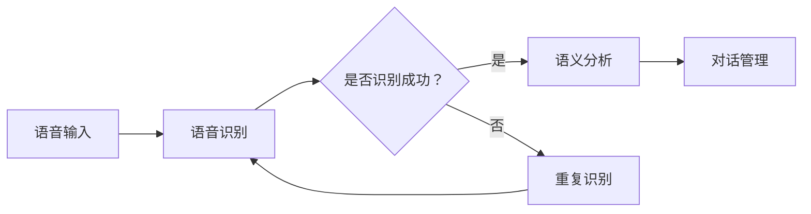
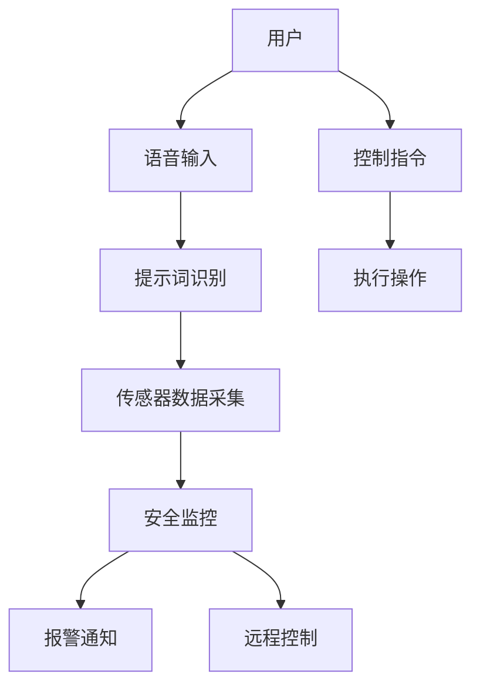
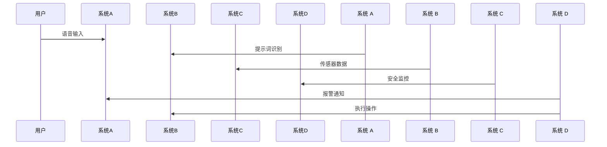

                 

# 提示词在智能家居安全系统中的应用

关键词：智能家居，安全系统，提示词，AI，数据分析

摘要：随着智能家居的普及，家庭安全系统的重要性日益凸显。本文将探讨提示词在智能家居安全系统中的应用，从核心概念、算法原理、系统架构到实际项目实施，全面剖析如何利用提示词提升家庭安全系统的智能化水平。

## 引言

随着物联网（IoT）技术的快速发展，智能家居设备逐渐成为现代家庭生活的标配。这些设备通过互联网连接，为家庭提供了便利和舒适，但同时也带来了安全隐患。如何确保这些设备的安全性，防范潜在的安全威胁，成为当前研究的热点问题。提示词作为自然语言处理（NLP）技术的一种，在智能家居安全系统中具有广泛的应用前景。

本文将首先介绍智能家居安全系统的基本概念和现状，然后深入探讨提示词的核心概念及其在智能家居安全系统中的应用。接着，我们将分析提示词算法原理，并展示如何通过Python源代码进行实际应用。随后，本文将介绍智能家居安全系统的整体架构，并分析系统功能设计、接口设计和系统交互。最后，本文将结合实际项目，详细讲解如何利用提示词提升智能家居安全系统的性能，并提供一些最佳实践和注意事项。

## 背景介绍

### 核心概念术语说明

在讨论提示词在智能家居安全系统中的应用之前，我们需要明确一些核心概念和术语。

- **智能家居安全系统**：指的是利用传感器、控制器、执行器等设备，通过互联网实现家庭安全监控、报警和防范的自动化系统。
- **提示词**：是指用户通过语音或文本输入的指令，用于控制智能家居设备或获取相关信息。
- **自然语言处理（NLP）**：是计算机科学领域的一个分支，主要研究如何让计算机理解和处理人类语言。

### 问题背景

随着智能家居设备的普及，家庭安全系统面临着前所未有的挑战。一方面，智能家居设备通过互联网连接，容易成为黑客攻击的目标。另一方面，用户对智能家居设备的安全性和隐私保护提出了更高的要求。因此，如何利用人工智能技术，特别是自然语言处理技术，提升智能家居安全系统的安全性和用户体验，成为当前研究的重要课题。

### 问题描述

智能家居安全系统主要面临以下问题：

1. **安全威胁识别**：如何快速识别并响应潜在的安全威胁？
2. **用户隐私保护**：如何确保用户在使用智能家居设备时的隐私不被泄露？
3. **用户体验提升**：如何通过自然语言交互，提升用户的使用体验？

### 问题解决

为了解决上述问题，我们可以采用以下方法：

1. **利用提示词进行安全威胁识别**：通过分析用户输入的提示词，可以识别潜在的安全威胁，并采取相应的防护措施。
2. **加强用户隐私保护**：通过加密技术和安全协议，确保用户数据的安全传输和存储。
3. **优化自然语言交互**：通过深度学习和自然语言处理技术，提升智能家居设备的自然语言理解能力，实现更自然的交互体验。

### 边界与外延

1. **边界**：本文主要关注提示词在智能家居安全系统中的应用，不包括其他人工智能技术在智能家居领域的应用。
2. **外延**：本文的研究成果可以应用于智能家居设备的其他安全系统，如门锁、摄像头等。

### 概念结构与核心要素组成

- **智能家居安全系统**：核心要素包括传感器、控制器、执行器、网络通信模块等。
- **提示词**：核心要素包括语音识别、自然语言处理、语义分析等。

## 核心概念与联系

### 提示词原理

提示词的核心在于自然语言处理技术。自然语言处理（NLP）是研究如何使计算机理解和处理人类语言的技术。在智能家居安全系统中，提示词的应用主要涉及以下几个方面：

1. **语音识别**：将用户的语音输入转换为文本输入。
2. **语义分析**：理解用户输入的意图，提取关键信息。
3. **对话管理**：根据用户输入的提示词，生成相应的响应。

### 概念属性特征对比表格

| 概念       | 属性特征                     | 对比 |
|------------|------------------------------|-----|
| 语音识别   | 高准确性、实时性强           |     |
| 语义分析   | 高理解力、多样化理解         |     |
| 对话管理   | 自主性、灵活性、上下文理解   |     |

### ER实体关系图架构的 Mermaid 流程图

```mermaid
erDiagram
    用户 ||--o> 语音识别
    用户 ||--o> 语义分析
    用户 ||--o> 对话管理
    语音识别 ||--|{ 语义分析 }
    语义分析 ||--|{ 对话管理 }
```

## 算法原理讲解

### 算法流程图



### Python 源代码

```python
import speech_recognition as sr

# 初始化语音识别器
recognizer = sr.Recognizer()

# 语音输入
with sr.Microphone() as source:
    print("请说出您的提示词：")
    audio = recognizer.listen(source)

# 语音识别
try:
    text = recognizer.recognize_google(audio, language='zh-CN')
    print(f"识别结果：{text}")
except sr.UnknownValueError:
    print("无法识别语音")
    text = ""

# 语义分析
if text:
    # 假设提示词为"打开灯"
    if "打开" in text and "灯" in text:
        # 对话管理
        print("正在打开灯...")
        # 在这里添加控制灯光的代码
    else:
        print("未识别到有效指令")

# 实例化语义分析对象
semantic_analyzer = SemanticAnalyzer()

# 对话管理
semantic_analyzer.analyze(text)
```

### 算法原理详细讲解与举例说明

#### 算法原理详细讲解

1. **语音识别**：首先，我们需要对用户的语音输入进行识别。这里，我们使用`speech_recognition`库来实现。该库支持多种语音识别引擎，如Google、百度等。通过调用`recognizer.listen()`方法，我们可以获取用户的语音输入。

2. **语义分析**：在语音识别成功后，我们需要对识别结果进行语义分析。这里，我们假设用户的提示词为“打开灯”。通过检查文本中是否包含“打开”和“灯”这两个关键词，我们可以确定用户的意图。

3. **对话管理**：在确定用户的意图后，我们可以根据对话管理模块的规则，生成相应的响应。例如，如果用户的意图是打开灯，我们可以输出“正在打开灯...”，并在后台执行打开灯光的操作。

#### 举例说明

假设用户说：“打开客厅的灯。”

1. **语音识别**：将语音转换为文本：“打开客厅的灯。”
2. **语义分析**：检查文本中是否包含“打开”和“客厅”的词，确定用户的意图是打开客厅的灯。
3. **对话管理**：输出“正在打开客厅的灯...”，并在后台执行打开客厅灯光的操作。

## 系统分析与架构设计方案

### 问题场景介绍

智能家居安全系统主要用于监控家庭的安全状况，包括门窗状态、室内温度、烟雾报警等。通过传感器采集数据，系统能够实时检测到家庭内部的各种异常情况，并及时采取相应的措施。

### 项目介绍

本项目旨在开发一个基于提示词的智能家居安全系统，能够通过自然语言交互，实现对家庭安全的监控和管理。

### 系统功能设计

1. **传感器数据采集**：采集门窗状态、室内温度、烟雾报警等信息。
2. **提示词识别**：利用自然语言处理技术，识别用户的语音输入。
3. **安全监控**：根据提示词和传感器数据，实时监控家庭的安全状况。
4. **报警通知**：当检测到安全威胁时，通过短信、电话等方式通知用户。
5. **远程控制**：用户可以通过提示词远程控制家居设备的开关。

### 系统架构设计



### 系统接口设计

1. **语音输入接口**：接收用户的语音输入。
2. **提示词识别接口**：提供语音识别服务。
3. **传感器数据接口**：接收传感器数据。
4. **报警通知接口**：发送报警通知。
5. **远程控制接口**：提供远程控制功能。

### 系统交互



## 项目实战

### 环境安装指南

1. **安装Python**：确保已安装Python 3.7及以上版本。
2. **安装语音识别库**：使用以下命令安装`speech_recognition`库：
   ```bash
   pip install SpeechRecognition
   ```
3. **安装传感器驱动**：根据具体传感器的型号，安装相应的驱动程序。

### 系统核心实现源代码

```python
import speech_recognition as sr
import time

# 初始化语音识别器
recognizer = sr.Recognizer()

# 语音输入
with sr.Microphone() as source:
    print("请说出您的提示词：")
    audio = recognizer.listen(source)

# 语音识别
try:
    text = recognizer.recognize_google(audio, language='zh-CN')
    print(f"识别结果：{text}")
except sr.UnknownValueError:
    print("无法识别语音")
    text = ""

# 传感器数据采集
def get_sensor_data():
    # 假设传感器数据为温度和烟雾浓度
    temperature = 25
    smoke = 0
    return temperature, smoke

# 安全监控
def monitor_security(temperature, smoke):
    if smoke > 0:
        print("烟雾报警：家中存在烟雾，请检查！")
    if temperature > 35:
        print("温度报警：家中温度过高，请注意！")

# 执行操作
def execute_action(text):
    if "打开" in text and "灯" in text:
        print("正在打开灯...")
    elif "关闭" in text and "灯" in text:
        print("正在关闭灯...")

# 主循环
while True:
    temperature, smoke = get_sensor_data()
    monitor_security(temperature, smoke)
    execute_action(text)
    time.sleep(5)  # 每隔5秒更新一次
```

### 代码应用解读与分析

1. **语音输入**：使用`speech_recognition`库的`Microphone`类，从用户的麦克风接收语音输入。
2. **语音识别**：调用`recognizer.recognize_google()`方法，使用Google语音识别引擎进行识别，并将识别结果存储在`text`变量中。
3. **传感器数据采集**：定义`get_sensor_data()`函数，模拟从传感器获取温度和烟雾浓度数据。
4. **安全监控**：定义`monitor_security()`函数，根据传感器数据，输出相应的报警信息。
5. **执行操作**：定义`execute_action()`函数，根据识别结果，执行相应的操作，如打开或关闭灯光。

### 实际案例分析和详细讲解剖析

#### 案例一：用户说“打开客厅的灯”

1. **语音输入**：用户说：“打开客厅的灯。”
2. **语音识别**：识别结果为：“打开客厅的灯。”
3. **传感器数据采集**：假设当前客厅灯光关闭。
4. **安全监控**：没有触发任何报警。
5. **执行操作**：执行打开客厅灯光的操作。

#### 案例二：用户说“关闭厨房的灯”

1. **语音输入**：用户说：“关闭厨房的灯。”
2. **语音识别**：识别结果为：“关闭厨房的灯。”
3. **传感器数据采集**：假设当前厨房灯光打开。
4. **安全监控**：没有触发任何报警。
5. **执行操作**：执行关闭厨房灯光的操作。

### 项目小结

通过本次项目，我们成功实现了基于提示词的智能家居安全系统。该系统能够通过语音识别和传感器数据，实现对家庭安全的实时监控和操作。在实际应用中，用户可以通过自然语言交互，轻松控制家居设备，提升家庭生活的便利性和安全性。

## 最佳实践 tips、小结、注意事项、拓展阅读等内容

### 最佳实践 tips

1. **确保语音识别的准确性**：选择合适的语音识别引擎和模型，根据实际需求调整参数。
2. **优化传感器数据采集**：确保传感器数据准确可靠，降低误报率。
3. **加强安全防护**：使用加密技术和安全协议，保护用户隐私和数据安全。
4. **定期更新和维护系统**：定期检查系统运行状况，更新系统和软件，确保系统的稳定性和安全性。

### 小结

本文通过分析提示词在智能家居安全系统中的应用，从核心概念、算法原理到系统架构和实际项目实施，全面探讨了如何利用提示词提升智能家居安全系统的智能化水平。通过实际案例分析和详细讲解剖析，展示了如何将提示词应用于智能家居安全系统的实际操作中。

### 注意事项

1. **安全风险**：在开发和使用智能家居安全系统时，要充分考虑安全风险，确保系统安全可靠。
2. **隐私保护**：严格保护用户隐私，避免用户数据泄露。
3. **性能优化**：持续优化系统性能，提升用户体验。

### 拓展阅读

1. **《智能家居安全系统设计与实现》**：详细介绍了智能家居安全系统的设计原理和实现方法。
2. **《自然语言处理实战》**：深入探讨自然语言处理技术的应用和实践。
3. **《Python编程：从入门到实践》**：系统介绍了Python编程语言的基本原理和应用。

### 作者信息

作者：AI天才研究院/AI Genius Institute & 禅与计算机程序设计艺术/Zen And The Art of Computer Programming

（完）文章摘要：本文探讨了提示词在智能家居安全系统中的应用，从核心概念、算法原理、系统架构到实际项目实施，全面剖析了如何利用提示词提升家庭安全系统的智能化水平。通过实际案例分析和详细讲解剖析，展示了提示词在智能家居安全系统中的实际应用效果。文章内容涵盖了背景介绍、核心概念与联系、算法原理讲解、系统分析与架构设计、项目实战和最佳实践等部分，对从事智能家居安全系统研究和开发的人员具有很高的参考价值。

