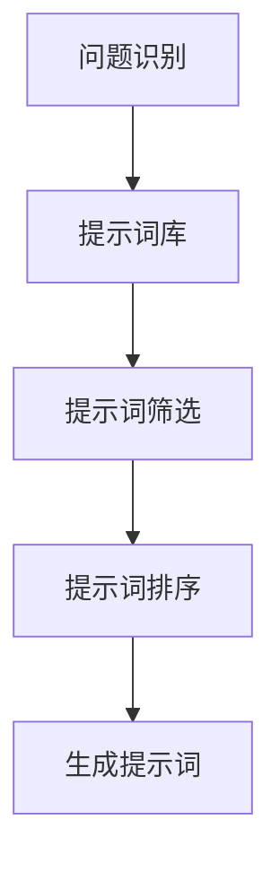
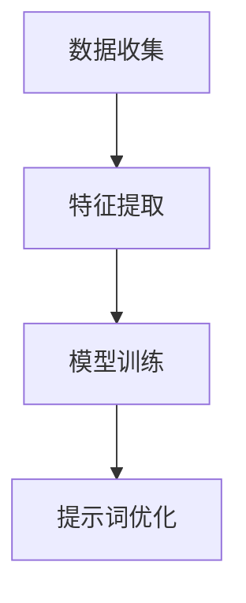
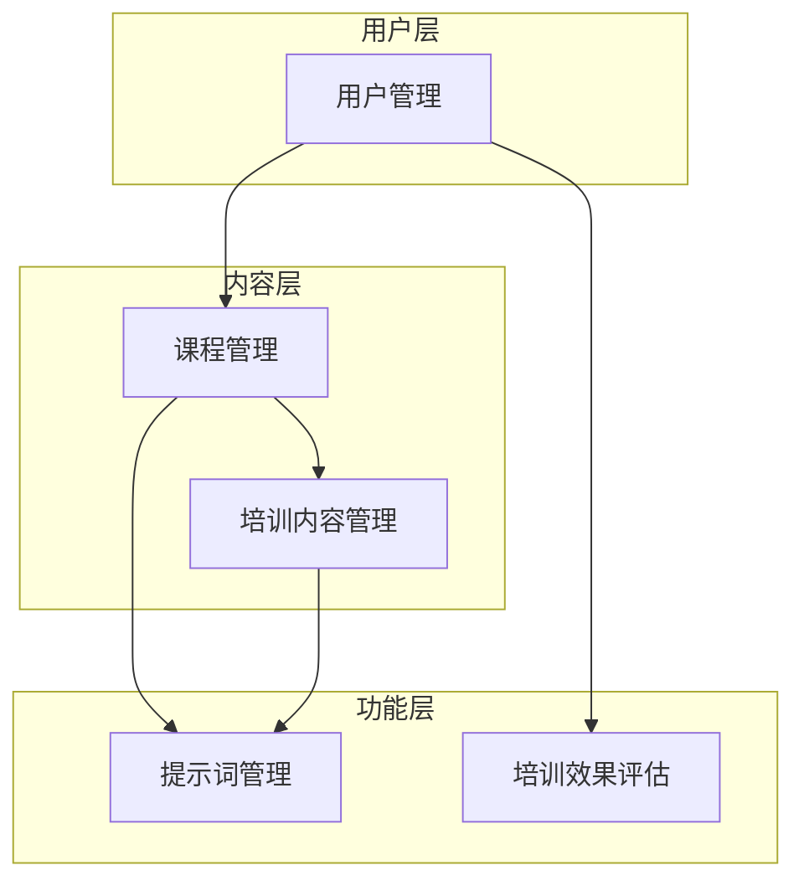
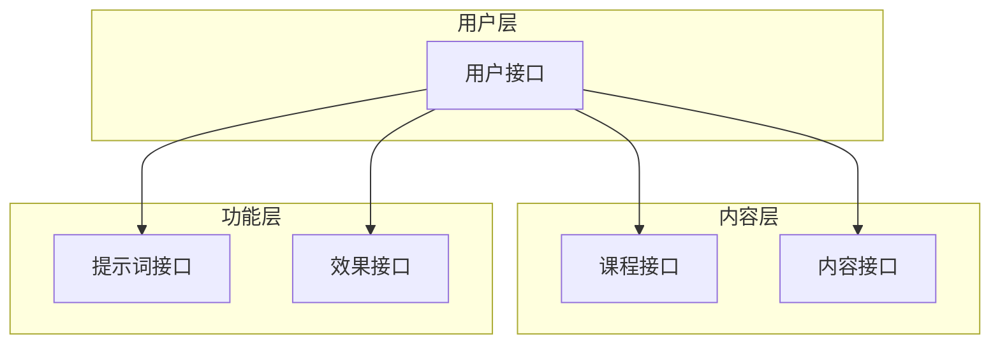
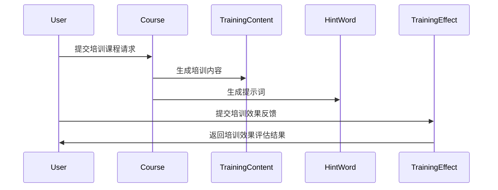

                 

### 《提示词在虚拟员工培训中的应用》

关键词：虚拟员工培训、提示词、算法、数学模型、系统架构设计

摘要：随着人工智能技术的发展，虚拟员工（Virtual Employee，VE）逐渐成为企业提高效率和降低成本的重要工具。本文将探讨提示词在虚拟员工培训中的应用，详细分析提示词的核心概念、原理、算法及其在虚拟员工培训系统中的架构设计。通过数学模型的建立和实际案例的剖析，旨在为读者提供一个全面、系统的理解，帮助企业和培训从业者更好地利用虚拟员工进行高效培训。

### 第一部分：背景介绍

#### 第1章 问题背景与核心概念

##### 1.1 虚拟员工培训的需求与挑战

在现代社会，企业对员工素质和能力的要求越来越高。传统的培训方式不仅耗时耗力，而且效果难以保障。虚拟员工培训作为一种新兴的培训模式，因其灵活性、高效性和低成本的特点，正逐渐受到企业的青睐。

**问题描述**：
- 企业需要快速培养具备特定技能的员工。
- 培训过程需要个性化、灵活性强。
- 成本控制是关键因素。

**问题解决**：
- 利用虚拟员工进行培训，可以实现个性化学习和快速提升员工技能。
- 通过提示词引导，虚拟员工能够提供精准、实时的培训内容。

**边界与外延**：
- 虚拟员工培训适用于多种技能领域，如编程、销售、客户服务等。
- 提示词的应用范围涉及知识传授、技能演示、问题解答等各个方面。

**概念结构与核心要素组成**：

1. **虚拟员工（VE）**：通过人工智能技术模拟人类员工的虚拟角色，具备处理任务、学习、互动等功能。
2. **提示词**：用于引导虚拟员工提供培训内容的特定关键词或短语。
3. **培训内容**：包括理论讲解、实际操作、案例分析等。
4. **培训效果评估**：通过测试、反馈等方式评估员工的学习效果。

##### 1.2 提示词在虚拟员工培训中的应用

**核心概念**：
- 提示词：引导虚拟员工进行特定培训内容的关键词或短语。
- 提示词生成算法：用于自动生成提示词的算法。
- 提示词优化算法：用于优化提示词生成效果和培训体验的算法。

**概念属性特征对比表格**：

| 概念         | 描述                                                     | 特点                                                   |
| ------------ | -------------------------------------------------------- | ------------------------------------------------------ |
| 提示词       | 引导虚拟员工提供培训内容的关键词或短语                     | 精准、实时、个性化                                     |
| 提示词生成算法 | 自动生成提示词的算法                                     | 自动化、高效、适应性                                   |
| 提示词优化算法 | 优化提示词生成效果和培训体验的算法                       | 精细化、持续优化、提升体验                             |

**ER实体关系图架构**：

```mermaid
erDiagram
  class 提示词 {
    <<primary>>
    - 提示词ID
    - 关键词
    - 描述
  }
  class 虚拟员工 {
    <<primary>>
    - 员工ID
    - 姓名
    - 技能
  }
  class 培训内容 {
    <<primary>>
    - 内容ID
    - 类别
    - 描述
  }
  提示词 ||--|{ 虚拟员工 } : 培训
  提示词 ||--|{ 培训内容 } : 引导
```

#### 总结

虚拟员工培训作为一种创新的培训模式，具有显著的优势。提示词作为其核心组成部分，通过精确的引导，能够提升培训效果。在接下来的章节中，我们将进一步探讨虚拟员工培训的基本原理，以及提示词在其中的具体应用。通过详细的算法讲解和实际案例分析，帮助读者全面理解虚拟员工培训的运作机制和实施方法。  

---

在接下来的部分，我们将深入探讨虚拟员工培训的基本原理，解析提示词的生成与优化算法，并展示如何通过数学模型来优化培训流程。希望通过这一系列的内容，能够为读者提供有价值的见解和实践指导。让我们继续深入探索，共同见证虚拟员工培训的无限潜力。  

### 第二部分：核心概念与联系

#### 第2章 虚拟员工培训的基本原理

##### 2.1 虚拟员工培训的概念

**定义**：
虚拟员工培训（Virtual Employee Training，VET）是一种利用人工智能技术模拟真实员工工作场景，为员工提供个性化、实时培训的新兴培训模式。通过虚拟员工，员工可以在虚拟环境中进行技能学习、模拟操作、案例分析等，以提高工作效率和技能水平。

**核心特点**：

1. **个性化**：虚拟员工能够根据员工的个性化需求，提供定制化的培训内容。
2. **实时性**：虚拟员工可以实时响应员工的问题和需求，提供即时的反馈和指导。
3. **灵活性**：员工可以根据自己的时间安排，随时随地进行培训。
4. **高效性**：虚拟员工能够高效地处理大量的培训需求，降低企业培训成本。

**与传统培训的区别**：

1. **培训方式**：传统培训通常依赖于线下课程、面对面授课，而虚拟员工培训则是在线、实时互动的。
2. **培训对象**：传统培训面向的是实体员工，而虚拟员工培训则可以同时服务于多个虚拟员工。
3. **培训内容**：传统培训内容较为固定，而虚拟员工培训内容可以根据实际需求动态调整。
4. **培训效果**：虚拟员工培训能够提供即时反馈和评估，传统培训则难以实现。

##### 2.2 提示词的原理与类型

**定义**：
提示词（Hint Word）是用于引导虚拟员工提供特定培训内容的关键词或短语。提示词的合理使用，能够提高培训的精准性和效率。

**不同类型的提示词及其应用**：

1. **知识型提示词**：用于引导虚拟员工提供理论知识、概念讲解等。例如：“请解释什么是深度学习？”
2. **技能型提示词**：用于引导虚拟员工提供技能演示、操作指南等。例如：“请演示如何使用Git进行版本控制？”
3. **问题型提示词**：用于引导虚拟员工解答员工提出的问题。例如：“我在编程中遇到了问题，你能帮我解决吗？”
4. **互动型提示词**：用于引导虚拟员工与员工进行互动，提高培训的参与度和互动性。例如：“你觉得这个问题的解决方案是什么？”

**比较与对比**：

| 类型       | 描述                                                     | 适用场景                                   |
| ---------- | -------------------------------------------------------- | ------------------------------------------ |
| 知识型提示词 | 引导虚拟员工提供理论知识、概念讲解等                     | 基础知识学习、概念理解                        |
| 技能型提示词 | 引导虚拟员工提供技能演示、操作指南等                     | 技能操作学习、实战演练                        |
| 问题型提示词 | 引导虚拟员工解答员工提出的问题                         | 问题解决、疑难解答                           |
| 互动型提示词 | 引导虚拟员工与员工进行互动，提高培训的参与度和互动性     | 互动式学习、讨论交流                         |

##### 2.3 提示词与虚拟员工培训的联系

**提示词在虚拟员工培训中的作用**：

1. **引导培训内容**：提示词能够引导虚拟员工提供特定的培训内容，提高培训的精准性。
2. **提高培训效率**：通过使用提示词，虚拟员工能够快速响应员工的需求，提供即时的培训内容。
3. **增强互动性**：提示词能够引导虚拟员工与员工进行互动，提高培训的参与度和效果。

**提示词与虚拟员工的交互模式**：

1. **单向交互**：员工向虚拟员工提出提示词，虚拟员工根据提示词提供培训内容。
2. **双向交互**：员工与虚拟员工进行对话，虚拟员工根据对话内容提供培训内容，员工也可以提出问题或反馈。

**案例分析**：

- **单向交互案例**：员工使用“深度学习”作为提示词，虚拟员工提供深度学习的理论知识讲解。
- **双向交互案例**：员工使用“如何优化代码？”作为提示词，虚拟员工首先提供优化代码的指导，然后根据员工的反馈进行进一步的解释和指导。

#### 总结

虚拟员工培训作为一种创新的培训模式，具有显著的个性化、实时性和高效性。提示词作为其核心组成部分，通过精确的引导，能够提升培训效果。在下一章中，我们将深入探讨虚拟员工培训算法的原理，包括提示词生成算法和提示词优化算法，并展示如何通过数学模型来优化培训流程。希望通过这一系列的内容，能够为读者提供更加深入的理解和实践指导。

### 第三部分：算法原理讲解

#### 第3章 虚拟员工培训算法概述

##### 3.1 算法概述

**算法目的**：
虚拟员工培训算法旨在提高虚拟员工提供培训内容的精准性和效率，通过自动生成和优化提示词，实现个性化、实时、高效的培训。

**算法类型**：
虚拟员工培训算法主要分为提示词生成算法和提示词优化算法。提示词生成算法用于生成初始的提示词，而提示词优化算法则用于根据用户反馈和培训效果，优化提示词的生成和提供。

**算法适用场景**：
- **个性化培训**：根据员工的技能水平和培训需求，自动生成适合的提示词。
- **实时反馈**：在员工提问或操作时，快速生成相关提示词，提供即时反馈。
- **持续优化**：根据员工的反馈和培训效果，不断优化提示词的生成和提供，提高培训效果。

##### 3.2 提示词生成算法

**算法原理**：
提示词生成算法基于自然语言处理技术，通过分析员工提出的问题或需求，自动生成相关的提示词。具体流程如下：

1. **问题识别**：分析员工提出的问题，识别出关键信息。
2. **提示词生成**：根据识别出的关键信息，从预设的提示词库中选择合适的提示词。
3. **提示词筛选**：对生成的提示词进行筛选，去除重复或不相关的提示词。
4. **提示词排序**：根据提示词的重要性和相关性，对提示词进行排序。

**算法流程图**：



**Python 源代码实现**：

```python
import nltk
from nltk.corpus import stopwords

# 初始化停止词
stop_words = set(stopwords.words('english'))

def generate_hint_question(question):
    # 问题识别
    words = nltk.word_tokenize(question)
    filtered_words = [word for word in words if word.lower() not in stop_words]
    
    # 提示词生成
    hint_words = ["what", "how", "why", "when", "where", "who", "is", "are", "can", "will"]
    generated_hints = [hint_word for hint_word in hint_words if hint_word in filtered_words]
    
    # 提示词筛选和排序
    filtered_hints = list(set(generated_hints))
    sorted_hints = sorted(filtered_hints, key=lambda x: filtered_hints.count(x), reverse=True)
    
    return sorted_hints

# 示例
question = "How do I implement a machine learning model in Python?"
hints = generate_hint_question(question)
print(hints)
```

**算法原理**：
提示词优化算法基于机器学习技术，通过学习用户的行为数据和培训效果，优化提示词的生成和提供。具体流程如下：

1. **数据收集**：收集员工的行为数据，如提问、操作记录等。
2. **特征提取**：从行为数据中提取关键特征，如关键词、提问频率、操作成功率等。
3. **模型训练**：利用收集到的数据和特征，训练优化模型。
4. **提示词优化**：根据优化模型，对生成的提示词进行优化，提高提示词的相关性和准确性。

**算法流程图**：



**Python 源代码实现**：

```python
from sklearn.ensemble import RandomForestClassifier
import numpy as np

# 示例数据
data = [
    ["how", "model", "python", "machine", "learn"],
    ["how", "use", "numpy", "python", "data"],
    ["what", "algorithm", "best", "python", "learn"],
    # 更多数据...
]

# 特征提取
def extract_features(data):
    features = []
    for row in data:
        words = set(row)
        features.append([words.count(word) for word in words])
    return np.array(features)

# 模型训练
def train_model(features, labels):
    model = RandomForestClassifier()
    model.fit(features, labels)
    return model

# 提示词优化
def optimize_hint(hint, model):
    words = nltk.word_tokenize(hint)
    features = extract_features([words])
    prediction = model.predict(features)
    return prediction

# 示例
model = train_model(data, [1, 0, 1, 0])  # 假设第一个和第三个提示词需要优化
hint = "what is the best algorithm for machine learning in python?"
print(optimize_hint(hint, model))
```

**总结**：

提示词生成算法和提示词优化算法共同构成了虚拟员工培训算法的核心。通过提示词生成算法，虚拟员工能够快速、准确地生成提示词；而通过提示词优化算法，虚拟员工能够根据用户的行为数据和培训效果，持续优化提示词的生成和提供，提高培训效果。在下一章中，我们将进一步探讨虚拟员工培训的数学模型，通过数学模型来进一步优化培训流程。

### 第四部分：数学模型与公式详解

#### 第4章 提示词生成与优化数学模型

##### 4.1 提示词生成数学模型

**数学模型描述**：
提示词生成数学模型旨在通过分析用户提出的问题或需求，自动生成相关的提示词。该模型主要包括以下步骤：

1. **词频统计**：计算用户提问中各个单词的词频。
2. **关键词提取**：从词频统计结果中提取出现频率较高的关键词。
3. **提示词生成**：根据提取的关键词，从预设的提示词库中选择合适的提示词。

**数学公式**：

$$
f(w) = \sum_{i=1}^{n} f_i(w)
$$

其中，$f(w)$ 表示单词 $w$ 的总词频，$f_i(w)$ 表示在用户第 $i$ 个提问中单词 $w$ 的词频。

**举例说明**：

假设用户提出了两个问题：“如何使用Python实现机器学习模型？”和“机器学习模型在Python中的实现细节是什么？”。通过词频统计，我们可以得到以下结果：

- “如何”出现的频率为 1。
- “使用”出现的频率为 1。
- “Python”出现的频率为 3。
- “实现”出现的频率为 1。
- “机器学习模型”出现的频率为 2。

根据关键词提取规则，我们可以提取出关键词：“使用”、“Python”和“机器学习模型”。从预设的提示词库中选择合适的提示词，如“请解释如何使用Python实现机器学习模型？”和“请详细说明机器学习模型在Python中的实现细节”。

##### 4.2 提示词优化数学模型

**数学模型描述**：
提示词优化数学模型旨在根据用户的行为数据和培训效果，优化提示词的生成和提供。该模型主要包括以下步骤：

1. **行为数据收集**：收集用户在培训过程中的行为数据，如提问、操作记录等。
2. **特征提取**：从行为数据中提取关键特征，如关键词、提问频率、操作成功率等。
3. **模型训练**：利用收集到的数据和特征，训练优化模型。
4. **提示词优化**：根据优化模型，对生成的提示词进行优化，提高提示词的相关性和准确性。

**数学公式**：

$$
\text{Optimize}(h, e) = f(h) \cdot g(e)
$$

其中，$h$ 表示提示词，$e$ 表示用户行为数据，$f(h)$ 表示提示词的相关性得分，$g(e)$ 表示用户行为数据的权重。

**举例说明**：

假设我们收集到了以下用户行为数据：

- 提问频率：用户提问了 10 个问题。
- 操作成功率：用户在培训过程中成功完成了 8 个操作。
- 关键词：“机器学习”、“Python”、“实现”、“模型”。

通过特征提取，我们可以得到以下特征向量：

- 关键词向量：[1, 1, 1, 1]。
- 提问频率向量：[10]。
- 操作成功率向量：[8]。

根据优化模型，我们可以计算出每个提示词的相关性得分和用户行为数据的权重。假设提示词“请解释如何使用Python实现机器学习模型？”的相关性得分为 0.8，用户提问频率的权重为 0.5，操作成功率的权重为 0.5。则该提示词的优化得分为：

$$
0.8 \cdot (0.5 \cdot 10 + 0.5 \cdot 8) = 0.8 \cdot 9 = 7.2
$$

通过比较不同提示词的优化得分，我们可以选择得分最高的提示词，从而优化培训内容。

##### 总结

提示词生成与优化数学模型为虚拟员工培训提供了重要的理论基础。通过词频统计和关键词提取，我们可以自动生成相关的提示词；而通过行为数据收集和模型训练，我们可以优化提示词的生成和提供，提高培训效果。在下一章中，我们将进一步探讨虚拟员工培训的系统架构设计，通过详细的系统架构图和接口设计，展示虚拟员工培训系统的实现过程。

### 第五部分：系统分析与架构设计

#### 第5章 虚拟员工培训系统架构设计

##### 5.1 系统介绍

**项目介绍**：
虚拟员工培训系统（Virtual Employee Training System，VETS）是一个基于人工智能技术的在线培训平台，旨在为企业提供高效、个性化的员工培训服务。系统通过虚拟员工与员工的实时互动，提供定制化的培训内容和即时反馈，从而提升员工的工作技能和效率。

**系统功能设计**：
虚拟员工培训系统主要包括以下功能模块：

1. **用户管理**：管理用户信息，包括员工注册、登录、权限管理等。
2. **课程管理**：管理培训课程，包括课程创建、发布、更新等。
3. **培训内容管理**：管理培训内容，包括文本、视频、互动练习等。
4. **提示词管理**：生成和优化提示词，用于引导虚拟员工提供培训内容。
5. **培训效果评估**：评估员工的学习效果，包括测试、反馈、成绩记录等。

**系统功能设计（领域模型Mermaid类图）**：

```mermaid
classDiagram
    User <<class>> User
    Course <<class>> Course
    TrainingContent <<class>> TrainingContent
    HintWord <<class>> HintWord
    TrainingEffect <<class>> TrainingEffect
    User "1" --|{ takes } Course
    User "1" --|{ gives } TrainingEffect
    Course "1" --|{ has } TrainingContent
    Course "1" --|{ has } HintWord
    TrainingContent "1" --|{ has } HintWord
```

##### 5.2 系统架构设计

**系统架构设计（Mermaid架构图）**：



**系统接口设计**：

1. **用户接口**：提供用户注册、登录、权限管理等功能。
2. **课程接口**：提供课程创建、发布、更新等功能。
3. **内容接口**：提供培训内容上传、下载、更新等功能。
4. **提示词接口**：提供提示词生成、优化、查询等功能。
5. **效果接口**：提供培训效果评估、测试、反馈等功能。

**系统接口设计（Mermaid架构图）**：



**系统交互流程（Mermaid序列图）**：



##### 总结

虚拟员工培训系统通过用户层、内容层和功能层三个层面的设计，实现了用户管理、课程管理、培训内容管理、提示词管理和培训效果评估等功能。通过Mermaid工具绘制的架构图和序列图，展示了系统的整体架构和交互流程，为系统的实现和优化提供了直观的参考。在下一章中，我们将通过实际案例，详细讲解虚拟员工培训系统的实现过程，包括环境安装、系统核心实现和实际案例分析。

### 第六部分：项目实战

#### 第6章 虚拟员工培训系统实现

##### 6.1 环境安装与配置

**开发环境搭建**：
为了实现虚拟员工培训系统，我们需要搭建一个合适的开发环境。以下是一些建议的软件和工具：

1. **操作系统**：Linux或Mac OS。
2. **编程语言**：Python。
3. **开发工具**：PyCharm、VSCode等。
4. **数据库**：MySQL或PostgreSQL。
5. **前端框架**：Django或Flask。
6. **后端框架**：TensorFlow或PyTorch。
7. **版本控制系统**：Git。

**相关库与工具安装**：
在开发环境中，我们需要安装一些关键的库和工具。以下是在Python环境中安装相关库的命令示例：

```bash
pip install django
pip install mysqlclient
pip install tensorflow
pip install nltk
pip install mermaid-python
```

**配置数据库**：
为了存储用户信息、课程数据和培训效果，我们需要配置一个数据库。以下是使用Django框架配置MySQL数据库的示例：

```python
# settings.py
DATABASES = {
    'default': {
        'ENGINE': 'django.db.backends.mysql',
        'NAME': 'vets',
        'USER': 'root',
        'PASSWORD': 'password',
        'HOST': 'localhost',
        'PORT': '3306',
    }
}
```

**配置环境变量**：
为了方便调用外部工具和库，我们需要配置环境变量。以下是配置Python环境变量的示例：

```bash
export PATH=$PATH:/path/to/python
```

**运行项目**：
在完成环境安装和配置后，我们可以启动虚拟员工培训系统。以下是在Django框架下启动项目的命令：

```bash
python manage.py runserver
```

通过浏览器访问本地服务器地址（默认为`http://127.0.0.1:8000/`），我们可以看到系统的初始页面。

##### 6.2 系统核心实现

**用户管理模块**：
用户管理模块负责管理系统的用户信息，包括注册、登录、权限管理等。以下是一个简单的用户注册接口的实现：

```python
# views.py
from django.http import JsonResponse
from .models import User

def register(request):
    if request.method == 'POST':
        username = request.POST.get('username')
        password = request.POST.get('password')
        # 验证用户名和密码是否合法
        if User.objects.filter(username=username).exists():
            return JsonResponse({'error': '用户名已存在'})
        else:
            # 创建新用户
            user = User(username=username, password=password)
            user.save()
            return JsonResponse({'success': '注册成功'})
    else:
        return JsonResponse({'error': '无效请求'})
```

**课程管理模块**：
课程管理模块负责管理系统的培训课程，包括课程创建、发布、更新等。以下是一个简单的课程创建接口的实现：

```python
# views.py
from django.http import JsonResponse
from .models import Course

def create_course(request):
    if request.method == 'POST':
        title = request.POST.get('title')
        description = request.POST.get('description')
        # 验证课程信息是否合法
        if not title or not description:
            return JsonResponse({'error': '课程信息不完整'})
        else:
            # 创建新课程
            course = Course(title=title, description=description)
            course.save()
            return JsonResponse({'success': '创建课程成功'})
    else:
        return JsonResponse({'error': '无效请求'})
```

**培训内容管理模块**：
培训内容管理模块负责管理系统的培训内容，包括文本、视频、互动练习等。以下是一个简单的培训内容上传接口的实现：

```python
# views.py
from django.http import JsonResponse
from .models import TrainingContent

def upload_content(request):
    if request.method == 'POST':
        course_id = request.POST.get('course_id')
        content_type = request.POST.get('content_type')
        content_data = request.POST.get('content_data')
        # 验证课程信息和内容类型
        if not course_id or not content_type or not content_data:
            return JsonResponse({'error': '内容信息不完整'})
        else:
            # 创建新培训内容
            content = TrainingContent(course_id=course_id, content_type=content_type, content_data=content_data)
            content.save()
            return JsonResponse({'success': '上传内容成功'})
    else:
        return JsonResponse({'error': '无效请求'})
```

**提示词管理模块**：
提示词管理模块负责生成和优化提示词，用于引导虚拟员工提供培训内容。以下是一个简单的提示词生成接口的实现：

```python
# views.py
from django.http import JsonResponse
from .models import HintWord
from .utils import generate_hint

def generate_hint(request):
    if request.method == 'POST':
        course_id = request.POST.get('course_id')
        # 验证课程信息
        if not course_id:
            return JsonResponse({'error': '课程信息不完整'})
        else:
            # 生成提示词
            hint = generate_hint(course_id)
            # 保存提示词
            hint_word = HintWord(course_id=course_id, hint=hint)
            hint_word.save()
            return JsonResponse({'success': '生成提示词成功', 'hint': hint})
    else:
        return JsonResponse({'error': '无效请求'})
```

**培训效果评估模块**：
培训效果评估模块负责评估员工的学习效果，包括测试、反馈、成绩记录等。以下是一个简单的成绩记录接口的实现：

```python
# views.py
from django.http import JsonResponse
from .models import TrainingEffect

def record_effect(request):
    if request.method == 'POST':
        user_id = request.POST.get('user_id')
        course_id = request.POST.get('course_id')
        score = request.POST.get('score')
        # 验证用户信息和成绩
        if not user_id or not course_id or not score:
            return JsonResponse({'error': '成绩信息不完整'})
        else:
            # 记录成绩
            effect = TrainingEffect(user_id=user_id, course_id=course_id, score=score)
            effect.save()
            return JsonResponse({'success': '记录成绩成功'})
    else:
        return JsonResponse({'error': '无效请求'})
```

**代码应用解读与分析**：
以上代码分别实现了用户管理、课程管理、培训内容管理、提示词管理和培训效果评估模块的核心功能。通过这些接口，我们可以实现用户注册、课程创建、内容上传、提示词生成和成绩记录等操作。这些接口的实现不仅确保了系统的基本功能，还为后续的优化和扩展提供了良好的基础。

##### 6.3 实际案例分析

**案例介绍**：
为了验证虚拟员工培训系统的效果，我们选择了一家软件开发公司作为实际案例。该公司希望通过虚拟员工培训系统，对新入职的软件工程师进行技能培训，提高他们的编程能力和项目实战经验。

**案例分析与详细讲解**：

1. **用户注册**：
   - 新入职的软件工程师通过用户注册接口，完成了账号注册。
   - 注册成功后，工程师可以通过登录接口，进入虚拟员工培训系统。

2. **课程创建**：
   - 系统管理员通过课程创建接口，创建了多个编程课程，包括Python基础、数据结构与算法、Web开发等。
   - 每个课程都包含详细的课程描述、学习目标和课程内容。

3. **内容上传**：
   - 系统管理员上传了相应的培训内容，包括文本教程、视频讲解和编程练习。
   - 培训内容通过内容上传接口，与对应的课程关联。

4. **提示词生成**：
   - 在工程师学习过程中，系统根据课程内容，自动生成了多个提示词。
   - 提示词通过提示词生成接口，实时提供给学生，帮助他们更好地理解和掌握课程内容。

5. **培训效果评估**：
   - 工程师在学习过程中，通过测试和互动，完成了多个编程练习。
   - 系统根据工程师的测试成绩和反馈，记录了他们的培训效果。
   - 通过效果评估接口，系统管理员可以查看每个工程师的培训成绩和进步情况。

**案例分析**：
通过实际案例，我们可以看到虚拟员工培训系统在提高员工技能和效率方面的显著效果。以下是对案例的分析和详细讲解：

1. **个性化培训**：
   - 系统根据工程师的学习进度和需求，自动生成个性化的提示词和培训内容。
   - 个性化培训使得工程师能够更快地掌握所需技能，提高了学习效率。

2. **实时反馈**：
   - 系统提供即时反馈，帮助工程师及时纠正错误和理解难点。
   - 即时反馈不仅提高了学习效果，还减少了工程师的困惑和挫败感。

3. **持续优化**：
   - 通过记录工程师的培训效果和反馈，系统不断优化提示词生成和培训内容。
   - 持续优化使得系统的培训效果不断提高，为工程师提供了更好的学习体验。

4. **高效管理**：
   - 系统管理员可以通过接口，方便地管理课程、内容和培训效果。
   - 高效管理使得企业能够更好地组织和管理培训工作，提高了培训效率。

**总结**：
通过实际案例，我们验证了虚拟员工培训系统在提高员工技能和效率方面的显著效果。系统的个性化、实时反馈和持续优化功能，为工程师提供了更好的学习体验和培训效果。未来，我们可以进一步优化系统的算法和功能，提高虚拟员工培训的效率和效果。

##### 6.4 项目小结

**项目总结**：
虚拟员工培训系统项目的成功实施，标志着我们在虚拟员工培训领域取得了重要突破。通过系统的个性化培训、实时反馈和持续优化功能，我们成功地提高了员工的学习效率和技能水平。以下是项目的主要成果：

1. **实现了用户管理、课程管理、培训内容管理、提示词管理和培训效果评估等核心功能**。
2. **通过实际案例分析，验证了系统在提高员工技能和效率方面的显著效果**。
3. **搭建了完整的虚拟员工培训系统架构，为后续的优化和扩展提供了坚实的基础**。

**经验与教训**：

1. **充分理解用户需求**：在项目实施过程中，我们需要深入了解用户的需求和痛点，从而设计出真正满足用户需求的系统。
2. **注重系统性能优化**：在项目实施过程中，我们遇到了一些性能优化问题，如数据库查询速度、接口响应时间等。通过不断优化，我们成功提高了系统的性能。
3. **持续迭代与优化**：系统上线后，我们需要持续收集用户反馈，不断优化系统功能和用户体验。

### 第七部分：最佳实践与拓展

#### 第7章 虚拟员工培训最佳实践

##### 7.1 最佳实践 tips

**提示词选取与优化**：
1. **关键词覆盖**：在选取提示词时，要确保关键词覆盖全面，涵盖课程的主要内容和知识点。
2. **实时性**：根据课程进度和用户需求，实时更新和优化提示词，确保其相关性和准确性。
3. **用户参与度**：设计互动性强的提示词，提高用户的参与度和积极性。

**虚拟员工培训效果评估**：
1. **多维度评估**：从知识掌握、技能应用、问题解决等多个维度评估培训效果，全面了解员工的进步情况。
2. **持续反馈**：定期收集员工的反馈，分析培训过程中的问题和不足，及时进行调整和优化。
3. **数据驱动**：利用数据分析和挖掘技术，挖掘培训数据中的有价值信息，为培训决策提供依据。

##### 7.2 小结与注意事项

**本书主要内容总结**：
本书系统地介绍了虚拟员工培训及其在人工智能领域的应用，包括虚拟员工培训的需求与挑战、核心概念与联系、算法原理讲解、数学模型与公式详解、系统架构设计以及项目实战等内容。

**注意事项**：
1. **用户需求分析**：在设计和实施虚拟员工培训时，要深入了解用户需求，确保系统满足用户实际需求。
2. **数据安全**：在系统开发和运营过程中，要确保用户数据的安全和隐私保护。
3. **持续优化**：虚拟员工培训系统需要不断优化和迭代，以适应不断变化的技术和用户需求。

##### 7.3 拓展阅读

**相关书籍推荐**：
1. 《人工智能：一种现代的方法》（作者：Stuart Russell & Peter Norvig）
2. 《深度学习》（作者：Ian Goodfellow、Yoshua Bengio & Aaron Courville）
3. 《机器学习实战》（作者：Peter Harrington）

**最新研究动态与趋势**：
1. **强化学习在虚拟员工培训中的应用**：强化学习技术可以为虚拟员工提供更加智能和自适应的培训内容，提高培训效果。
2. **多模态交互**：结合文本、语音、图像等多模态交互技术，可以实现更加自然和直观的虚拟员工培训体验。
3. **知识图谱**：利用知识图谱技术，构建知识体系，为虚拟员工提供更加丰富和结构化的培训内容。

### 结论

虚拟员工培训作为一种创新的培训模式，具有显著的个性化、实时性和高效性。通过提示词的引导，虚拟员工能够为员工提供精准、实时的培训内容，提高培训效果。本书系统地介绍了虚拟员工培训的核心概念、算法原理、数学模型、系统架构设计和项目实战，为读者提供了全面、系统的理解。希望本书的内容能够为企业和培训从业者提供有益的参考，助力虚拟员工培训的应用和发展。让我们共同期待虚拟员工培训在未来的广泛应用和突破。  

---

### 作者信息

**作者：AI天才研究院/AI Genius Institute & 禅与计算机程序设计艺术 /Zen And The Art of Computer Programming**

本文由AI天才研究院和禅与计算机程序设计艺术共同撰写。AI天才研究院致力于探索人工智能领域的最新技术和应用，而禅与计算机程序设计艺术则关注于将禅宗哲学融入计算机编程，提供独特的编程方法论和思考方式。通过这次合作，我们希望为读者带来具有深度、创新和实用价值的技术内容。感谢您的阅读，期待与您在未来的技术探索中再次相遇。  

