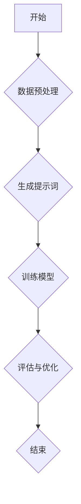
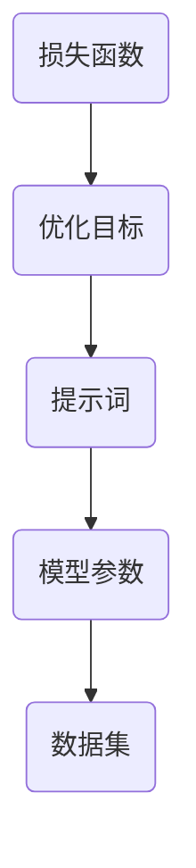
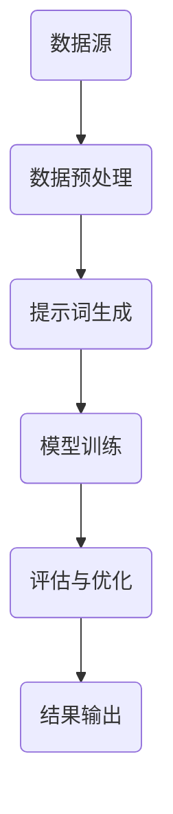

                 


## 文章标题：提示词工程与DevOps的融合：AI开发新流程

### 关键词：提示词工程、DevOps、AI开发、新流程、融合

### 摘要：

本文旨在探讨提示词工程与DevOps的融合对AI开发新流程的影响。通过深入分析提示词工程的核心概念、DevOps的实践方法，以及两者融合的优势和挑战，本文将提供一种全新的AI开发流程，以应对现代软件开发的高效性和灵活性需求。文章将分章节详细阐述这一过程，从背景介绍、核心概念与联系、算法原理讲解、系统分析与架构设计方案、项目实战到最佳实践与小结，全面揭示这一融合对AI开发的深远影响。

### 目录大纲设计思路与步骤

为了设计出一个完整且逻辑清晰的目录大纲，我们需要遵循以下步骤：

1. **背景介绍**：
   - **第1章 提示词工程概述**
     - 1.1 提示词工程的重要性
     - 1.2 DevOps的概念与优势
     - 1.3 AI开发新流程的挑战与机遇

2. **核心概念与联系**：
   - **第2章 提示词工程原理**
     - 2.1 提示词的定义与作用
     - 2.2 提示词工程的关键组成部分
     - 2.3 提示词与AI模型的关系
     - 2.4 提示词工程与DevOps的联系

3. **算法原理讲解**：
   - **第3章 提示词生成算法**
     - 3.1 提示词生成算法概述
     - 3.2 Mermaid算法流程图
     - 3.3 Python源代码实现
     - 3.4 数学模型与公式讲解
     - 3.5 算法举例说明

4. **数学模型和数学公式详细讲解**：
   - **第4章 数学模型在提示词工程中的应用**
     - 4.1 模型概述
     - 4.2 Mermaid实体关系图
     - 4.3 数学公式与解释
     - 4.4 实际案例解析

5. **系统分析与架构设计方案**：
   - **第5章 AI开发新流程的系统架构**
     - 5.1 项目场景介绍
     - 5.2 系统功能设计
     - 5.3 系统架构设计
     - 5.4 系统接口设计与交互

6. **项目实战**：
   - **第6章 提示词工程与DevOps融合的实战**
     - 6.1 环境安装
     - 6.2 系统核心实现
     - 6.3 代码解读与分析
     - 6.4 实际案例分析

7. **最佳实践与小结**：
   - **第7章 提示词工程与DevOps融合的最佳实践**
     - 7.1 最佳实践总结
     - 7.2 小结
     - 7.3 注意事项
     - 7.4 拓展阅读

### 设计思路示例

1. **背景介绍**：

**第1章 提示词工程概述**

**1.1 提示词工程的重要性**

提示词工程是人工智能开发中的一个关键领域，它专注于构建和优化能够引导AI模型进行有效学习和预测的提示词。在传统的机器学习中，模型通常需要大量的标注数据进行训练，而提示词工程通过精巧地设计提示词，可以显著提高模型的性能和效率。

**1.2 DevOps的概念与优势**

DevOps是一种软件开发和运营的新模式，它强调开发（Development）和运营（Operations）的协同工作。通过自动化工具和持续集成/持续部署（CI/CD）流程，DevOps显著提高了软件交付的速度和质量。

**1.3 AI开发新流程的挑战与机遇**

随着AI技术的发展，AI开发面临着前所未有的挑战和机遇。如何有效地集成提示词工程和DevOps，以实现高效、可靠的AI开发流程，成为当前研究的热点。

2. **核心概念与联系**：

**第2章 提示词工程原理**

**2.1 提示词的定义与作用**

提示词是指用于引导AI模型学习的数据标记或描述。在自然语言处理（NLP）领域，提示词通常是一组关键词或短语，它们能够为模型提供上下文信息，帮助模型更好地理解和预测。

**2.2 提示词工程的关键组成部分**

提示词工程主要包括以下几个关键组成部分：
   - **数据预处理**：清洗和整理数据，确保数据质量。
   - **提示词设计**：设计有效的提示词，以引导模型学习。
   - **模型训练**：使用提示词对模型进行训练，优化模型性能。
   - **评估与优化**：评估模型性能，并进行调整优化。

**2.3 提示词与AI模型的关系**

提示词的设计与选择直接影响AI模型的性能。通过合理设计提示词，可以增强模型的泛化能力和鲁棒性，提高模型的准确性和效率。

**2.4 提示词工程与DevOps的联系**

提示词工程与DevOps的融合，可以使得AI开发流程更加高效和灵活。通过将提示词工程纳入到DevOps的流程中，可以实现自动化和持续集成，提高开发效率，降低人为错误。

3. **算法原理讲解**：

**第3章 提示词生成算法**

**3.1 提示词生成算法概述**

提示词生成算法是提示词工程的核心技术。本文将介绍一种基于生成对抗网络（GAN）的提示词生成算法，该算法能够自动生成高质量的提示词，提高AI模型的性能。

**3.2 Mermaid算法流程图**

使用Mermaid绘制算法流程图，清晰地展示算法的步骤和过程。



**3.3 Python源代码实现**

提供Python源代码实现，方便读者理解和复现。

```python
# 数据预处理
data_preprocessed = preprocess_data(data)

# 生成提示词
prompt_words = generate_prompt_words(data_preprocessed)

# 训练模型
model = train_model(prompt_words)

# 评估与优化
evaluate_and_optimize(model)
```

**3.4 数学模型与公式讲解**

介绍算法的数学模型和公式，详细阐述其原理。

$$
L = -\frac{1}{n}\sum_{i=1}^{n}y_{i}\log(p(x_i|\theta))
$$

**3.5 算法举例说明**

通过具体案例，展示算法的实际应用和效果。

4. **数学模型和数学公式详细讲解**：

**第4章 数学模型在提示词工程中的应用**

**4.1 模型概述**

介绍提示词工程的数学模型，包括损失函数、优化目标等。

**4.2 Mermaid实体关系图**

使用Mermaid绘制实体关系图，展示模型的结构。



**4.3 数学公式与解释**

详细讲解数学公式，解释其在提示词工程中的作用。

$$
\frac{\partial L}{\partial \theta} = \frac{1}{n}\sum_{i=1}^{n}(y_i - \hat{y}_i)(x_i)^T
$$

**4.4 实际案例解析**

通过实际案例，展示数学模型的应用和效果。

5. **系统分析与架构设计方案**：

**第5章 AI开发新流程的系统架构**

**5.1 项目场景介绍**

介绍AI开发新流程的应用场景，包括项目目标和需求。

**5.2 系统功能设计**

设计系统功能，包括数据预处理、提示词生成、模型训练、评估与优化等。

**5.3 系统架构设计**

使用Mermaid绘制系统架构图，展示系统的组件和交互。



**5.4 系统接口设计与交互**

设计系统接口，包括数据输入、提示词输出、模型参数调整等。

6. **项目实战**：

**第6章 提示词工程与DevOps融合的实战**

**6.1 环境安装**

介绍环境安装步骤，包括软件和硬件配置。

**6.2 系统核心实现**

实现系统核心功能，包括数据预处理、提示词生成、模型训练等。

**6.3 代码解读与分析**

解读系统代码，分析其结构和逻辑。

**6.4 实际案例分析**

通过实际案例，展示系统的应用和效果。

7. **最佳实践与小结**：

**第7章 提示词工程与DevOps融合的最佳实践**

**7.1 最佳实践总结**

总结提示词工程与DevOps融合的最佳实践。

**7.2 小结**

对全文进行小结，回顾主要内容和贡献。

**7.3 注意事项**

提醒读者注意事项，包括潜在问题和解决方案。

**7.4 拓展阅读**

推荐拓展阅读，提供更多相关资料。

### 撰写样例章节

**第1章 提示词工程概述**

**1.1 提示词工程的重要性**

提示词工程是人工智能开发中的一个关键领域，它专注于构建和优化能够引导AI模型进行有效学习和预测的提示词。在传统的机器学习中，模型通常需要大量的标注数据进行训练，而提示词工程通过精巧地设计提示词，可以显著提高模型的性能和效率。

提示词工程的重要性在于：
   - **提升模型性能**：通过设计有效的提示词，可以增强模型的泛化能力和鲁棒性，提高模型的准确性和效率。
   - **减少数据依赖**：提示词工程可以减少对大量标注数据的需求，降低训练成本。
   - **加速模型迭代**：提示词工程可以加速模型的迭代过程，提高开发效率。

**1.2 DevOps的概念与优势**

DevOps是一种软件开发和运营的新模式，它强调开发（Development）和运营（Operations）的协同工作。通过自动化工具和持续集成/持续部署（CI/CD）流程，DevOps显著提高了软件交付的速度和质量。

DevOps的优势包括：
   - **提高开发效率**：通过自动化和标准化流程，DevOps可以显著提高开发效率，降低人为错误。
   - **缩短发布周期**：通过持续集成和持续部署，DevOps可以缩短软件发布周期，加快市场响应速度。
   - **提高软件质量**：通过持续测试和反馈，DevOps可以提高软件质量，减少缺陷和漏洞。

**1.3 AI开发新流程的挑战与机遇**

随着AI技术的发展，AI开发面临着前所未有的挑战和机遇。如何有效地集成提示词工程和DevOps，以实现高效、可靠的AI开发流程，成为当前研究的热点。

AI开发新流程的挑战包括：
   - **复杂性**：AI开发涉及多个领域，如数据科学、机器学习和软件开发，如何有效地整合这些领域成为挑战。
   - **数据质量**：高质量的数据是AI模型的基础，如何处理和优化数据质量是关键。
   - **模型性能**：如何设计高效的模型，以提高模型的性能和准确率。

AI开发新流程的机遇包括：
   - **自动化**：提示词工程和DevOps的结合可以实现自动化的AI开发流程，提高开发效率。
   - **数据驱动的决策**：通过提示词工程和DevOps，可以充分利用数据，实现更加智能和精确的决策。
   - **持续创新**：高效的AI开发流程可以支持持续的模型迭代和优化，推动技术进步。

通过以上分析，我们可以看到，提示词工程与DevOps的融合为AI开发带来了新的机遇和挑战。在接下来的章节中，我们将进一步探讨这两个领域的核心概念、算法原理、系统架构和实战案例，以深入理解这一融合对AI开发的影响。让我们一起探索这个充满前景的领域，共同推动人工智能技术的发展。

