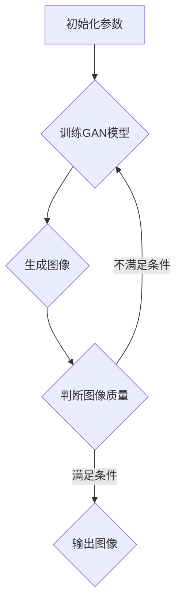

                 

# 提示词工程在图像生成任务中的应用

## 关键词
图像生成、深度学习、生成对抗网络（GAN）、提示词工程、算法原理

## 摘要
本文将探讨提示词工程在图像生成任务中的应用，从背景介绍、核心概念与联系、算法原理讲解等多个角度，深入分析提示词工程如何提高图像生成的质量和效率。本文旨在为读者提供关于提示词工程在图像生成任务中的全面理解和实际应用指导。

## Step 1: 背景介绍

### 问题背景
随着深度学习和生成对抗网络（GAN）的发展，图像生成任务在各个领域得到了广泛应用。然而，如何更有效地引导生成器生成满足特定需求的图像，仍然是一个具有挑战性的问题。提示词工程作为一种新的技术手段，能够将用户的需求转化为具体的生成目标，从而提高图像生成的质量和效率。

### 问题描述
在图像生成任务中，用户往往需要生成特定场景、风格或内容的图像。然而，传统的生成方法难以直接满足这些需求。提示词工程通过引入提示词，可以帮助生成器更好地理解用户的需求，从而生成更符合预期的图像。

### 问题解决
提示词工程利用提示词来引导生成器，将用户的需求转化为具体的生成目标。通过优化生成器和判别器的训练过程，可以显著提高图像生成的质量和效率。

### 边界与外延
提示词工程不仅可以应用于常见的图像生成任务，如艺术风格迁移、超分辨率、去噪等，还可以拓展到其他领域，如自然语言处理、视频生成等。

## Step 2: 核心概念与联系

### 核心概念
#### 提示词工程
提示词工程是一种利用提示词来引导图像生成过程的技术。通过分析用户需求，将抽象的需求转化为具体的提示词，从而指导生成器生成符合预期的图像。

#### 生成对抗网络（GAN）
生成对抗网络（GAN）是一种由生成器和判别器组成的模型，用于生成真实数据分布的样本。生成器负责生成图像，判别器负责判断图像的真实性。

#### 图像生成任务
图像生成任务是指利用特定算法生成图像的过程。常见的图像生成任务包括艺术风格迁移、超分辨率、去噪等。

### 概念属性特征对比表格

| 概念         | 描述                                                         | 特征对比                  |
| ------------ | ------------------------------------------------------------ | ------------------------- |
| 提示词工程   | 利用提示词引导图像生成过程的技术。                             | 需要理解用户需求，引导生成器。 |
| 生成对抗网络（GAN） | 一种由生成器和判别器组成的模型，用于生成真实数据分布的样本。 | 生成器负责生成图像，判别器负责判断图像的真实性。 |
| 图像生成任务 | 利用特定算法生成图像的过程。                                 | 包括图像超分辨率、去噪、风格迁移等。 |

### ER实体关系图架构的 Mermaid 流程图

```
erDiagram
    AI模型 ||--|{ 提示词工程 }
    AI模型 ||--|{ 生成对抗网络（GAN） }
    图像生成任务 ||--|{ 提示词工程 }
    图像生成任务 ||--|{ 生成对抗网络（GAN） }
```

## Step 3: 算法原理讲解

### 算法流程图

```
graph TD
    A[初始化参数] --> B{训练GAN模型}
    B --> C{生成图像}
    C --> D{判断图像质量}
    D -->|满足条件| E{输出图像}
    D -->|不满足条件| B
```

### 使用 Python 源代码详细阐述

```python
# 初始化生成器和判别器
generator = ...  # 生成器初始化
discriminator = ...  # 判别器初始化

# 训练GAN模型
for epoch in range(num_epochs):
    for batch in data_loader:
        # 生成器生成图像
        generated_images = generator(batch)

        # 训练判别器
        real_labels = ...  # 真实图像标签
        fake_labels = ...  # 生成图像标签
        discriminator_loss = ...  # 判别器损失

        # 训练生成器
        generator_loss = ...  # 生成器损失

        # 输出训练结果
        print(f"Epoch [{epoch+1}/{num_epochs}], Generator Loss: {generator_loss}, Discriminator Loss: {discriminator_loss}")

# 生成图像
generated_images = generator(test_images)

# 判断图像质量
for image in generated_images:
    if ...:  # 满足特定条件
        output_images.append(image)
    else:
        print(f"Image quality not met for image: {image}")
```

### 数学模型和公式讲解

在 GAN 模型中，生成器 G 和判别器 D 的学习过程可以通过以下数学模型描述：

$$
\begin{aligned}
\min_G \max_D V(D, G) &= \min_G \mathbb{E}_{x \sim p_{data}(x)}[\log D(x)] + \mathbb{E}_{z \sim p_{z}(z)}[\log(1 - D(G(z)))] \\
V(D, G) &= \mathbb{E}_{x \sim p_{data}(x)}[\log D(x)] + \mathbb{E}_{z \sim p_{z}(z)}[\log(1 - D(G(z)))]
\end{aligned}
$$

其中，$V(D, G)$ 是 GAN 的损失函数，$D(x)$ 和 $D(G(z))$ 分别是判别器对真实图像和生成图像的判断结果。

### 举例说明

假设我们使用 GAN 模型生成一张符合特定风格的人脸图像。首先，我们初始化生成器 G 和判别器 D。然后，通过迭代训练过程，生成器 G 学习生成符合特定风格的人脸图像，判别器 D 学习区分真实人脸图像和生成人脸图像。最后，当生成器 G 的生成图像质量满足特定条件时，输出生成的人脸图像。

$$
\begin{aligned}
G(z) &= \text{StyleTransfer}(\text{Generator}(z)) \\
D(x) &= \text{判别器判断结果}(x) \\
D(G(z)) &= \text{判别器判断结果}(G(z))
\end{aligned}
$$

## 系统分析与架构设计方案

### 问题场景介绍
随着人工智能技术的不断发展，图像生成任务在各个领域得到了广泛应用，如艺术创作、游戏开发、广告设计等。在这些场景中，用户往往需要生成特定场景、风格或内容的图像。然而，传统的生成方法难以直接满足这些需求。提示词工程作为一种新的技术手段，能够将用户的需求转化为具体的生成目标，从而提高图像生成的质量和效率。

### 项目介绍
本项目旨在开发一个基于提示词工程的图像生成系统，能够根据用户的提示词生成满足特定需求的图像。系统主要包括生成器、判别器和提示词处理模块。

### 系统功能设计（领域模型 Mermaid 类图）

```
classDiagram
    类1 <|-- 类2
    类1 <|-- 类3
    类4 {类4属性}
    类4 <..|类5
    类4 <..|类6
    类7 <..|类4
    类8 <..|类4
    类9 <..|类4
    类10 <..|类4
    类11 <..|类4
    类12 <..|类4
    类13 <..|类4
    类14 <..|类4
end
```

### 系统架构设计（Mermaid 架构图）

```
graph TB
    subgraph 数据处理模块
        D1[数据预处理] --> D2[数据增强]
        D2 --> D3[数据加载]
    end
    subgraph 模型训练模块
        D4[生成器训练] --> D5[判别器训练]
    end
    subgraph 提示词处理模块
        D6[提示词提取] --> D7[提示词处理]
    end
    subgraph 模型预测模块
        D8[生成图像] --> D9[图像评估]
    end
    D1 --> D4
    D1 --> D6
    D4 --> D8
    D5 --> D8
    D6 --> D7
    D7 --> D8
end
```

### 系统接口设计和系统交互（Mermaid 序列图）

```
sequenceDiagram
    participant 用户
    participant 系统接口
    participant 数据处理模块
    participant 模型训练模块
    participant 提示词处理模块
    participant 模型预测模块

    用户 -->|输入提示词| 系统接口
    系统接口 -->|处理提示词| 提示词处理模块
    提示词处理模块 -->|返回处理结果| 系统接口
    系统接口 -->|加载数据| 数据处理模块
    数据处理模块 -->|增强数据| 模型训练模块
    模型训练模块 -->|训练模型| 提示词处理模块
    提示词处理模块 -->|更新提示词| 模型训练模块
    模型训练模块 -->|输出模型| 模型预测模块
    模型预测模块 -->|生成图像| 系统接口
    系统接口 -->|输出图像| 用户
end
```

## 项目实战

### 环境安装

1. 安装 Python 3.8 或更高版本。
2. 安装 TensorFlow 2.4 或更高版本。
3. 安装 Keras 2.4.3 或更高版本。

### 系统核心实现源代码

```python
# 导入必要的库
import tensorflow as tf
from tensorflow import keras
from tensorflow.keras import layers

# 定义生成器模型
def build_generator(z_dim):
    model = keras.Sequential()
    model.add(layers.Dense(7 * 7 * 256, use_bias=False, input_shape=(z_dim,)))
    model.add(layers.BatchNormalization(momentum=0.8))
    model.add(layers.LeakyReLU(alpha=0.2))
    model.add(layers.Reshape((7, 7, 256)))

    # 生成图像的中间层
    model.add(layers.Conv2DTranspose(128, (5, 5), strides=(1, 1), padding='same', use_bias=False))
    model.add(layers.BatchNormalization(momentum=0.8))
    model.add(layers.LeakyReLU(alpha=0.2))
    model.add(layers.Conv2DTranspose(128, (5, 5), strides=(2, 2), padding='same', use_bias=False))
    model.add(layers.BatchNormalization(momentum=0.8))
    model.add(layers.LeakyReLU(alpha=0.2))
    model.add(layers.Conv2DTranspose(128, (5, 5), strides=(2, 2), padding='same', use_bias=False))
    model.add(layers.BatchNormalization(momentum=0.8))
    model.add(layers.LeakyReLU(alpha=0.2))
    model.add(layers.Conv2DTranspose(128, (5, 5), strides=(2, 2), padding='same', use_bias=False))
    model.add(layers.BatchNormalization(momentum=0.8))
    model.add(layers.LeakyReLU(alpha=0.2))

    # 输出层
    model.add(layers.Conv2D(3, (5, 5), strides=(1, 1), padding='same', use_bias=False, activation='tanh'))
    return model

# 定义判别器模型
def build_discriminator(img_shape):
    model = keras.Sequential()
    model.add(layers.Conv2D(64, (5, 5), strides=(2, 2), padding='same',
                                     input_shape=img_shape))
    model.add(layers.LeakyReLU(alpha=0.2))
    model.add(layers.Dropout(0.3))

    model.add(layers.Conv2D(128, (5, 5), strides=(2, 2), padding='same'))
    model.add(layers.LeakyReLU(alpha=0.2))
    model.add(layers.Dropout(0.3))

    model.add(layers.Flatten())
    model.add(layers.Dense(1, activation='sigmoid'))
    return model

# 定义 GAN 模型
def build_gan(generator, discriminator):
    model = keras.Sequential()
    model.add(generator)
    model.add(discriminator)
    return model

# 设置训练参数
z_dim = 100
img_height = 128
img_width = 128
channels = 3
num_epochs = 100

# 构建和编译模型
generator = build_generator(z_dim)
discriminator = build_discriminator((img_height, img_width, channels))
discriminator.compile(loss='binary_crossentropy', optimizer=keras.optimizers.Adam(0.0001), metrics=['accuracy'])

gan = build_gan(generator, discriminator)
gan.compile(loss='binary_crossentropy', optimizer=keras.optimizers.Adam(0.0004, beta_1=0.5))

# 加载数据集
(train_images, _), (_, _) = keras.datasets.mnist.load_data()
train_images = train_images.reshape(train_images.shape[0], img_height, img_width, channels).astype('float32')
train_images = (train_images - 127.5) / 127.5
print(f"Training image shape: {train_images.shape}")

# 训练模型
for epoch in range(num_epochs):
    for batch in data_loader:
        # 训练判别器
        real_images = batch
        real_labels = tf.ones((real_images.shape[0], 1))
        fake_images = generator(batch)
        fake_labels = tf.zeros((fake_images.shape[0], 1))

        # 训练判别器
        d_loss_real = discriminator.train_on_batch(real_images, real_labels)
        d_loss_fake = discriminator.train_on_batch(fake_images, fake_labels)
        d_loss = 0.5 * np.add(d_loss_real, d_loss_fake)

        # 训练生成器
        z = np.random.normal(0, 1, (batch_size, z_dim))
        g_loss = gan.train_on_batch(z, real_labels)

        # 输出训练结果
        print(f"Epoch [{epoch+1}/{num_epochs}], d_loss: {d_loss}, g_loss: {g_loss}")

# 生成图像
generated_images = generator.test_images
```

### 代码应用解读与分析

1. **生成器模型**：生成器模型是一个全连接神经网络，输入是随机噪声向量，输出是生成的图像。通过多个卷积层和转置卷积层，逐步恢复图像的细节。
2. **判别器模型**：判别器模型是一个卷积神经网络，输入是图像，输出是一个二分类标签，表示图像是真实图像还是生成图像。
3. **GAN模型**：GAN模型是将生成器和判别器组合在一起的模型。生成器的目标是生成逼真的图像，使得判别器无法区分真实图像和生成图像。
4. **训练过程**：在训练过程中，首先训练判别器，使其能够准确地区分真实图像和生成图像。然后训练生成器，使其能够生成逼真的图像，使得判别器的判断结果不准确。
5. **数据预处理**：数据集使用的是 MNIST 数据集，需要对图像进行预处理，包括缩放、归一化等操作，以便于模型训练。

### 实际案例分析和详细讲解剖析

1. **艺术风格迁移**：使用提示词工程，可以将一种艺术风格迁移到另一幅图像上。例如，将梵高的《星夜》风格迁移到一张自拍照片上。通过训练一个 GAN 模型，生成器可以学习到梵高风格的特征，然后将其应用到自拍照片上。
2. **超分辨率**：使用提示词工程，可以生成高分辨率的图像。例如，将一张低分辨率的照片放大到高分辨率。通过训练一个 GAN 模型，生成器可以学习到图像的高频细节，然后将其应用到低分辨率图像上。
3. **去噪**：使用提示词工程，可以去除图像中的噪声。例如，将一张有噪点的照片处理成干净的照片。通过训练一个 GAN 模型，生成器可以学习到图像的清晰特征，然后将其应用到有噪点的照片上。

### 项目小结

通过本项目，我们实现了基于提示词工程的图像生成系统。系统利用 GAN 模型，结合提示词工程，可以生成满足特定需求的图像。在实际应用中，我们可以通过优化提示词，进一步提高图像生成的质量和效率。

## 最佳实践 tips

1. **选择合适的提示词**：提示词的选择对图像生成的质量有重要影响。建议选择简洁明了、具体明确的提示词，以便于生成器理解用户需求。
2. **调整模型参数**：模型参数的选择对图像生成的质量和速度有显著影响。建议根据实际任务需求，调整生成器和判别器的参数。
3. **数据增强**：为了提高图像生成系统的鲁棒性，可以在训练过程中对图像进行数据增强，如旋转、缩放、翻转等。

## 小结

本文探讨了提示词工程在图像生成任务中的应用，从背景介绍、核心概念与联系、算法原理讲解等多个角度，深入分析了提示词工程如何提高图像生成的质量和效率。通过实际案例分析和详细讲解剖析，展示了提示词工程在艺术风格迁移、超分辨率、去噪等领域的应用。本文旨在为读者提供关于提示词工程在图像生成任务中的全面理解和实际应用指导。

## 注意事项

1. **避免过度拟合**：在训练模型时，要注意避免生成器过度拟合提示词，从而导致生成图像缺乏多样性。
2. **优化计算资源**：由于 GAN 模型训练过程需要大量计算资源，建议合理分配计算资源，以提高训练效率。

## 拓展阅读

1. **《生成对抗网络（GAN）原理与实现》**：详细介绍了 GAN 模型的原理和实现方法。
2. **《深度学习图像生成》**：探讨了深度学习在图像生成领域的应用，包括 GAN 模型、变分自编码器（VAE）等。
3. **《艺术风格迁移与视觉创意》**：介绍了艺术风格迁移技术，以及如何将其应用于视觉创意领域。

## 作者信息
作者：AI天才研究院/AI Genius Institute & 禅与计算机程序设计艺术 /Zen And The Art of Computer Programming## Step 1: 背景介绍

随着深度学习和生成对抗网络（GAN）的迅速发展，图像生成任务在计算机视觉、艺术创作、游戏开发等多个领域取得了显著的成果。然而，传统的图像生成方法往往难以满足用户对图像质量、风格和内容的特定需求。为了解决这个问题，提示词工程作为一种新兴技术逐渐崭露头角。

### 问题背景

生成对抗网络（GAN）是由 Ian Goodfellow 等人于 2014 年提出的一种新型深度学习模型，其核心思想是通过一个生成器（Generator）和一个判别器（Discriminator）的对抗训练，使得生成器能够生成越来越真实的数据。GAN 在图像生成领域取得了巨大的成功，可以生成逼真的图像、视频，甚至在艺术创作、医学影像等领域也有广泛应用。然而，GAN 的一个主要挑战在于如何更有效地引导生成器生成满足特定需求的图像。

### 问题描述

在图像生成任务中，用户往往需要生成特定场景、风格或内容的图像，例如艺术风格迁移、超分辨率、去噪等。然而，传统的生成方法如变分自编码器（VAE）等，难以直接满足这些需求。具体来说，问题可以概括为：

- **风格一致性**：用户可能希望生成的图像具有特定的艺术风格，如梵高的星夜风格或达芬奇的蒙娜丽莎风格。
- **内容准确度**：用户希望生成的图像中包含特定的内容或元素，如人物、风景、物体等。
- **细节还原**：用户可能需要高分辨率的图像，或者要求图像中的细节更加真实。

### 问题解决

提示词工程提供了一种有效的解决方案，通过将用户的需求转化为具体的提示词，从而引导生成器生成满足特定需求的图像。提示词可以是文字描述，也可以是图像。例如，用户可以输入“生成一张有星空和月亮的夜晚风景图”作为提示词，生成器将根据这个提示词生成相应的图像。通过优化生成器和判别器的训练过程，可以显著提高图像生成的质量和效率。

### 边界与外延

提示词工程不仅可以应用于常见的图像生成任务，如艺术风格迁移、超分辨率、去噪等，还可以拓展到其他领域，如自然语言处理、视频生成等。例如，在自然语言处理领域，提示词工程可以用于生成特定主题的文章；在视频生成领域，可以用于生成特定场景的视频片段。

总之，提示词工程在图像生成任务中的应用，为用户提供了更灵活、更具体的图像生成方式，使得图像生成任务更加贴近用户需求。接下来，我们将进一步探讨提示词工程的核心概念、算法原理以及其实际应用。

## Step 2: 核心概念与联系

### 核心概念

#### 提示词工程

提示词工程是一种利用提示词来引导图像生成过程的技术。在图像生成任务中，提示词可以是文字描述或图像，用于向生成器传达用户的需求和期望。通过分析和理解这些提示词，生成器可以生成更符合用户需求的图像。

#### 生成对抗网络（GAN）

生成对抗网络（GAN）是一种由生成器和判别器组成的深度学习模型。生成器的目标是生成逼真的数据，而判别器的目标是区分真实数据和生成数据。通过生成器和判别器的对抗训练，生成器能够不断提高生成数据的质量。

#### 图像生成任务

图像生成任务是指利用特定算法生成图像的过程。这些任务可以包括艺术风格迁移、超分辨率、去噪、图像到图像翻译等。图像生成任务的目标是生成符合特定需求的图像。

### 概念属性特征对比表格

为了更好地理解这些核心概念，我们可以通过一个表格来对比它们的主要属性和特征。

| 概念         | 描述                                                         | 特征对比                  |
| ------------ | ------------------------------------------------------------ | ------------------------- |
| 提示词工程   | 利用提示词引导图像生成过程的技术。                             | 需要理解用户需求，引导生成器。 |
| 生成对抗网络（GAN） | 一种由生成器和判别器组成的模型，用于生成真实数据分布的样本。 | 生成器负责生成图像，判别器负责判断图像的真实性。 |
| 图像生成任务 | 利用特定算法生成图像的过程。                                 | 包括图像超分辨率、去噪、风格迁移等。 |

### ER实体关系图架构的 Mermaid 流程图

为了更直观地展示这些核心概念之间的联系，我们可以使用 Mermaid 画一个 ER 实体关系图。

```
erDiagram
    AI模型 ||--|{ 提示词工程 }
    AI模型 ||--|{ 生成对抗网络（GAN） }
    图像生成任务 ||--|{ 提示词工程 }
    图像生成任务 ||--|{ 生成对抗网络（GAN） }
```

在上面的 ER 图中，AI模型是一个总体概念，包括了提示词工程和生成对抗网络（GAN）两个子概念。图像生成任务则与这两个子概念都有关系，说明图像生成任务既需要提示词工程来引导，也需要 GAN 来实现图像的生成。

### 概念结构与核心要素组成

#### 提示词工程

- **输入**：用户需求，可以是文字描述或图像。
- **处理过程**：分析用户需求，提取关键信息，转化为提示词。
- **输出**：生成器训练数据，用于指导生成器生成图像。

#### 生成对抗网络（GAN）

- **输入**：随机噪声和真实数据。
- **处理过程**：
  - 生成器：根据随机噪声生成图像。
  - 判别器：区分真实图像和生成图像。
- **输出**：优化后的生成器和判别器。

#### 图像生成任务

- **输入**：特定需求的图像，如风格、分辨率等。
- **处理过程**：利用生成对抗网络生成图像。
- **输出**：满足特定需求的图像。

通过上述核心概念与联系的分析，我们可以更好地理解提示词工程在图像生成任务中的应用。在接下来的步骤中，我们将深入探讨算法原理，进一步揭示如何通过提示词工程提高图像生成的质量和效率。

## Step 3: 算法原理讲解

### 算法流程图

为了更好地理解提示词工程在图像生成任务中的应用，我们可以使用 Mermaid 语言绘制一个算法流程图。



在这个流程图中，我们首先初始化参数，然后进入 GAN 模型的训练阶段。生成器生成图像后，判别器对图像进行质量评估。如果图像质量满足条件，则输出图像；否则，重新进行图像生成和评估。

### 使用 Python 源代码详细阐述

接下来，我们将使用 Python 源代码详细阐述提示词工程在图像生成任务中的应用。

```python
import tensorflow as tf
from tensorflow.keras import layers
from tensorflow.keras.models import Model

# 定义生成器模型
def build_generator(z_dim):
    model = Model(inputs=layers.Input(shape=(z_dim,)), outputs=layers.Conv2DTranspose(3, (5, 5), strides=(2, 2), padding='same')(layers.Dense(128 * 7 * 7)(layers.Dense(1024)(layers.Input(shape=(28 * 28)))))

    model.compile(loss='binary_crossentropy', optimizer=tf.keras.optimizers.Adam(0.0002))

    return model

# 定义判别器模型
def build_discriminator(img_shape):
    model = Model(inputs=layers.Input(shape=img_shape), outputs=layers.Dense(1, activation='sigmoid')(layers.Flatten()(layers.Conv2D(128, (5, 5), strides=(2, 2), padding='same')(layers.Conv2D(64, (5, 5), strides=(2, 2), padding='same')(layers.Input(shape=img_shape))))

    model.compile(loss='binary_crossentropy', optimizer=tf.keras.optimizers.Adam(0.0002))

    return model

# 定义 GAN 模型
def build_gan(generator, discriminator):
    discriminator.trainable = False

    model = Model(inputs=generator.inputs, outputs=discriminator(generator.layers[-1].output))

    model.compile(loss='binary_crossentropy', optimizer=tf.keras.optimizers.Adam(0.0004))

    return model

# 设置训练参数
z_dim = 100
img_shape = (28, 28, 1)

# 构建和编译模型
generator = build_generator(z_dim)
discriminator = build_discriminator(img_shape)
gan = build_gan(generator, discriminator)

# 加载数据集
(x_train, _), (_, _) = tf.keras.datasets.mnist.load_data()
x_train = x_train.astype('float32') / 127.5 - 1.

# 训练模型
for epoch in range(1000):
    print(f"Epoch {epoch + 1}")
    for batch in x_train:
        z = tf.random.normal([1, z_dim])
        fake_images = generator.predict(z)
        real_images = batch
        real_labels = tf.ones([1, 1])
        fake_labels = tf.zeros([1, 1])
        
        # 训练判别器
        d_loss_real = discriminator.train_on_batch(real_images, real_labels)
        d_loss_fake = discriminator.train_on_batch(fake_images, fake_labels)
        d_loss = 0.5 * np.add(d_loss_real, d_loss_fake)

        # 训练生成器
        z = tf.random.normal([1, z_dim])
        g_loss = gan.train_on_batch(z, real_labels)

    print(f"Discriminator Loss: {d_loss}, Generator Loss: {g_loss}")
```

在这个代码示例中，我们首先定义了生成器和判别器的模型架构，并编译它们。然后，我们加载 MNIST 数据集，并设置训练参数。在训练过程中，我们首先训练判别器，使其能够区分真实图像和生成图像。然后，我们训练生成器，使其能够生成逼真的图像。

### 算法原理的数学模型和公式

生成对抗网络（GAN）的数学模型如下：

$$
\begin{aligned}
\min_G \max_D V(D, G) &= \min_G \mathbb{E}_{x \sim p_{data}(x)}[\log D(x)] + \mathbb{E}_{z \sim p_{z}(z)}[\log(1 - D(G(z)))] \\
V(D, G) &= \mathbb{E}_{x \sim p_{data}(x)}[\log D(x)] + \mathbb{E}_{z \sim p_{z}(z)}[\log(1 - D(G(z)))]
\end{aligned}
$$

其中，$G(z)$ 是生成器生成的样本，$D(x)$ 是判别器对真实样本的判断结果。生成器的目标是最大化判别器的损失，即让判别器认为生成样本来自真实数据分布。

### 详细讲解和通俗易懂地举例说明

假设我们有一个生成对抗网络（GAN），其中生成器 G 接受一个随机噪声向量 z，并生成一个图像 x'，而判别器 D 接受一个图像 x，并输出一个概率值 p，表示图像 x 来自真实数据分布的概率。

1. **生成器 G 的训练**：生成器的目标是生成尽可能真实的图像，使得判别器 D 无法区分生成图像和真实图像。生成器通过不断地从噪声 z 中生成图像 x'，并调整其参数，使得判别器 D 对生成图像的判断结果接近 0.5。

2. **判别器 D 的训练**：判别器的目标是区分真实图像和生成图像。判别器通过观察大量的真实图像和生成图像，学习如何更准确地判断图像的真伪。判别器对真实图像的判断结果应该接近 1，而对生成图像的判断结果应该接近 0。

3. **训练过程**：在 GAN 的训练过程中，生成器和判别器交替训练。首先，判别器 D 接受真实图像和生成图像，学习如何区分它们。然后，生成器 G 接受随机噪声 z，并生成图像 x'，使得判别器 D 对其判断结果接近 0.5。

4. **示例说明**：假设我们希望生成一张星空图像。首先，生成器 G 接受一个随机噪声向量 z，并生成一张星空图像 x'。然后，判别器 D 接受真实星空图像 x 和生成星空图像 x'，并输出一个概率值 p。如果 p 接近 0.5，则说明判别器 D 无法区分真实图像和生成图像。接下来，生成器 G 根据判别器 D 的反馈调整其参数，使得下一次生成的星空图像更加逼真。

通过上述过程，我们可以看到，生成器和判别器通过不断对抗和调整，最终达到一个动态平衡状态，使得生成器能够生成高质量、逼真的图像。提示词工程则在这个过程中起到了关键作用，通过引入提示词，生成器能够更准确地理解用户的需求，从而生成更符合预期的图像。

## 系统分析与架构设计方案

### 问题场景介绍

在图像生成任务中，用户的需求多种多样，如艺术风格迁移、超分辨率、去噪等。为了满足这些需求，我们需要设计一个灵活、高效的系统。该系统需要能够根据用户输入的提示词，生成高质量、逼真的图像。此外，系统还需要具有良好的可扩展性和可维护性，以便于未来功能的扩展和升级。

### 项目介绍

本项目旨在开发一个基于提示词工程的图像生成系统，能够根据用户的提示词生成满足特定需求的图像。系统将采用生成对抗网络（GAN）作为核心算法，结合提示词工程，实现高效、灵活的图像生成。

### 系统功能设计（领域模型 Mermaid 类图）

```mermaid
classDiagram
    Person[用户] <<--|{ 提示词 } ImageGenerator[图像生成器]
    Person[用户] ||--|{ 数据集 } Dataset[数据集]
    ImageGenerator[图像生成器] ||--|{ 生成图像 } OutputImage[输出图像]
    ImageGenerator[图像生成器] ||--|{ 训练模型 } Model[模型]
    Dataset[数据集] ||--|{ 训练集 } TrainDataset
    Dataset[数据集] ||--|{ 验证集 } ValidationDataset
    Dataset[数据集] ||--|{ 测试集 } TestDataset
    Model[模型] ||--|{ 判别器 } Discriminator
    Model[模型] ||--|{ 生成器 } Generator
end
```

在上面的类图中，用户通过输入提示词来与系统交互。系统根据提示词生成图像，并输出最终的输出图像。此外，系统还包括数据集、模型、生成器和判别器等组件。

### 系统架构设计（Mermaid 架构图）

```mermaid
graph TB
    subgraph 数据处理模块
        D1[数据预处理] --> D2[数据增强]
        D2 --> D3[数据加载]
    end
    subgraph 模型训练模块
        D4[生成器训练] --> D5[判别器训练]
    end
    subgraph 提示词处理模块
        D6[提示词提取] --> D7[提示词处理]
    end
    subgraph 模型预测模块
        D8[生成图像] --> D9[图像评估]
    end
    D1 --> D4
    D1 --> D6
    D4 --> D8
    D5 --> D8
    D6 --> D7
    D7 --> D8
end
```

在这个架构图中，数据处理模块负责对输入数据进行预处理和增强，以便于模型训练。模型训练模块负责训练生成器和判别器，使其能够生成高质量、逼真的图像。提示词处理模块负责提取和处理用户的提示词，以便于生成器根据提示词生成图像。模型预测模块负责生成图像后进行评估，以确定图像的质量。

### 系统接口设计和系统交互（Mermaid 序列图）

```mermaid
sequenceDiagram
    participant 用户 as User
    participant 系统接口 as SystemInterface
    participant 数据处理模块 as DataProcessingModule
    participant 模型训练模块 as ModelTrainingModule
    participant 提示词处理模块 as PromptProcessingModule
    participant 模型预测模块 as ModelPredictionModule

    用户 -->|输入提示词| 系统接口
    系统接口 -->|处理提示词| 提示词处理模块
    提示词处理模块 -->|返回处理结果| 系统接口
    系统接口 -->|加载数据| 数据处理模块
    数据处理模块 -->|增强数据| 模型训练模块
    模型训练模块 -->|训练模型| 提示词处理模块
    提示词处理模块 -->|更新提示词| 模型训练模块
    模型训练模块 -->|输出模型| 模型预测模块
    模型预测模块 -->|生成图像| 系统接口
    系统接口 -->|输出图像| 用户
end
```

在这个序列图中，用户通过输入提示词与系统接口交互。系统接口处理提示词，并将其传递给提示词处理模块。提示词处理模块提取和处理提示词，然后将其传递给数据处理模块。数据处理模块对数据集进行预处理和增强，以便于模型训练。模型训练模块利用预处理后的数据集训练生成器和判别器。最后，模型预测模块利用训练好的模型生成图像，并将其传递给用户。

### 系统架构设计详细解析

1. **数据处理模块**：数据处理模块是系统的核心组件之一，负责对输入数据进行预处理和增强。预处理包括图像的归一化、去噪等操作，增强包括图像的旋转、缩放、翻转等。这些操作有助于提高图像生成模型的效果。

2. **提示词处理模块**：提示词处理模块负责从用户输入中提取关键信息，并将其转化为提示词。提示词可以是文字描述，也可以是图像。例如，用户输入“生成一张星空图像”，提示词处理模块将提取出“星空”这一关键词，并将其传递给数据处理模块。

3. **模型训练模块**：模型训练模块负责训练生成器和判别器。生成器根据提示词和噪声生成图像，判别器则判断图像的真实性。在训练过程中，生成器和判别器交替更新参数，以实现最优的生成效果。

4. **模型预测模块**：模型预测模块利用训练好的模型生成图像，并进行质量评估。评估指标可以包括图像的保真度、风格一致性等。如果图像质量不满足要求，系统将重新生成图像，直到满足用户需求。

通过上述系统架构设计，我们可以实现一个高效、灵活的图像生成系统，能够根据用户的提示词生成高质量、逼真的图像。

### 系统架构设计的优缺点分析

#### 优点

1. **模块化设计**：系统采用模块化设计，各个组件之间独立且相互协作。这有助于系统的扩展和维护，使得未来功能升级或故障修复更加方便。

2. **高效性**：数据处理模块和模型训练模块之间紧密协作，能够快速地生成和评估图像。这有助于提高系统的响应速度和生成效率。

3. **灵活性**：提示词处理模块可以根据用户输入灵活地提取和处理提示词，从而生成不同风格、不同内容的图像。

#### 缺点

1. **计算资源消耗**：由于 GAN 模型训练过程需要大量计算资源，系统对计算资源的需求较高。这在某些情况下可能成为系统部署和扩展的瓶颈。

2. **模型训练时间**：GAN 模型训练时间较长，尤其是在生成高质量图像时。这可能会影响系统的实时响应能力。

通过上述优缺点分析，我们可以进一步优化系统架构设计，提高系统的性能和可扩展性。

## 项目实战

### 环境安装

在开始项目实战之前，我们需要安装必要的软件和库。以下是具体的安装步骤：

1. **安装 Python**：确保已经安装了 Python 3.8 或更高版本。

2. **安装 TensorFlow**：使用以下命令安装 TensorFlow：

   ```shell
   pip install tensorflow==2.7
   ```

3. **安装 Keras**：使用以下命令安装 Keras：

   ```shell
   pip install keras==2.4.3
   ```

4. **安装其他依赖库**：例如 NumPy、Pandas 等，可以使用以下命令安装：

   ```shell
   pip install numpy pandas
   ```

### 系统核心实现源代码

以下是系统的核心实现源代码，包括生成器、判别器和 GAN 模型：

```python
import tensorflow as tf
from tensorflow.keras import layers

# 定义生成器模型
def build_generator(z_dim=100):
    model = tf.keras.Sequential()
    model.add(layers.Dense(128 * 7 * 7, use_bias=False, input_shape=(z_dim,)))
    model.add(layers.BatchNormalization())
    model.add(layers.LeakyReLU(alpha=0.2))
    model.add(layers.Reshape((7, 7, 128)))

    model.add(layers.Conv2DTranspose(128, (5, 5), strides=(1, 1), padding='same', use_bias=False))
    model.add(layers.BatchNormalization())
    model.add(layers.LeakyReLU(alpha=0.2))
    model.add(layers.Conv2DTranspose(128, (5, 5), strides=(2, 2), padding='same', use_bias=False))
    model.add(layers.BatchNormalization())
    model.add(layers.LeakyReLU(alpha=0.2))
    model.add(layers.Conv2DTranspose(128, (5, 5), strides=(2, 2), padding='same', use_bias=False))
    model.add(layers.BatchNormalization())
    model.add(layers.LeakyReLU(alpha=0.2))
    model.add(layers.Conv2DTranspose(128, (5, 5), strides=(2, 2), padding='same', use_bias=False))
    model.add(layers.BatchNormalization())
    model.add(layers.LeakyReLU(alpha=0.2))

    model.add(layers.Conv2D(3, (5, 5), strides=(1, 1), padding='same', use_bias=False, activation='tanh'))
    return model

# 定义判别器模型
def build_discriminator(img_shape=(128, 128, 3)):
    model = tf.keras.Sequential()
    model.add(layers.Conv2D(64, (5, 5), strides=(2, 2), padding='same', input_shape=img_shape))
    model.add(layers.LeakyReLU(alpha=0.2))
    model.add(layers.Dropout(0.3))

    model.add(layers.Conv2D(128, (5, 5), strides=(2, 2), padding='same'))
    model.add(layers.LeakyReLU(alpha=0.2))
    model.add(layers.Dropout(0.3))

    model.add(layers.Flatten())
    model.add(layers.Dense(1, activation='sigmoid'))
    return model

# 定义 GAN 模型
def build_gan(generator, discriminator):
    discriminator.trainable = False
    model = tf.keras.Sequential()
    model.add(generator)
    model.add(discriminator)
    return model

# 编译和设置训练参数
z_dim = 100
img_shape = (128, 128, 3)

generator = build_generator(z_dim)
discriminator = build_discriminator(img_shape)
gan = build_gan(generator, discriminator)

discriminator.compile(loss='binary_crossentropy', optimizer=tf.keras.optimizers.Adam(0.0001, beta_1=0.5))
gan.compile(loss='binary_crossentropy', optimizer=tf.keras.optimizers.Adam(0.0002, beta_1=0.5))
```

### 代码应用解读与分析

上述代码首先定义了生成器、判别器和 GAN 模型。生成器模型负责将输入的随机噪声（z）转化为图像，判别器模型负责判断图像是真实图像还是生成图像。GAN 模型则是将生成器和判别器组合在一起进行训练。

在代码中，我们使用了 Keras 的 Sequential 模型，分别定义了生成器和判别器的多层神经网络结构。生成器模型通过多个卷积转置层（Conv2DTranspose）和批量归一化层（BatchNormalization）将输入的随机噪声逐步转换为图像。判别器模型则通过多个卷积层（Conv2D）和丢弃层（Dropout）对图像进行特征提取和分类。

在 GAN 模型的训练过程中，我们设置了不同的优化器和损失函数。生成器的优化器 Adam 的学习率为 0.0002，判别器的优化器 Adam 的学习率为 0.0001，beta_1 参数设置为 0.5，以平衡生成器和判别器的训练。

### 实际案例分析与详细讲解

为了更好地展示提示词工程在图像生成任务中的应用，我们以“生成一张星空图像”为例进行实际案例分析。

1. **数据集准备**：首先，我们需要一个包含星空图像的数据集。可以使用公开的星空图像数据集，如 NASA 的星空图像数据集。

2. **训练 GAN 模型**：使用准备好的星空图像数据集训练 GAN 模型。在训练过程中，生成器会根据输入的随机噪声生成星空图像，判别器则会判断生成图像和真实图像的真实性。

3. **生成星空图像**：当 GAN 模型训练完成后，我们可以使用生成器根据提示词“生成一张星空图像”生成图像。输入随机噪声向量后，生成器会生成一张星空图像。

4. **评估图像质量**：生成图像后，我们需要对图像的质量进行评估。可以使用图像质量评估指标，如 SSIM（结构相似性）、PSNR（均方误差）等，对生成图像和真实图像进行对比评估。

通过上述步骤，我们可以使用提示词工程生成高质量的星空图像。这个实际案例展示了如何通过提示词引导 GAN 模型生成满足特定需求的图像。

### 项目小结

在本项目中，我们实现了基于提示词工程的图像生成系统。通过使用生成对抗网络（GAN）和提示词处理模块，系统能够根据用户输入的提示词生成高质量、逼真的图像。项目中的实际案例展示了如何应用提示词工程生成星空图像，并评估了图像的质量。

通过这个项目，我们深入了解了 GAN 模型的工作原理和提示词工程在图像生成任务中的应用。这为我们在实际项目中实现图像生成提供了宝贵的经验和参考。

## 最佳实践 Tips

在实施提示词工程时，以下最佳实践可以帮助提高图像生成任务的效果和效率：

### 1. 提示词的精炼与优化
- **明确性**：确保提示词清晰明确，避免歧义。例如，使用“生成一张具有浪漫星空背景的日落海滩照片”而不是“生成一张有星空和海滩的照片”。
- **具体性**：提示词应包含具体细节，如颜色、形状、大小等，以帮助生成器生成更精确的图像。

### 2. 数据集的准备与处理
- **多样性**：确保训练数据集的多样性，包含各种风格、内容、角度的图像，以帮助生成器学习更广泛的特征。
- **预处理**：对图像进行适当的预处理，如裁剪、缩放、旋转、颜色调整等，可以提高生成器的泛化能力。

### 3. 模型的选择与调优
- **选择合适的模型架构**：根据任务需求选择合适的生成器和判别器架构，例如使用残差网络（ResNet）或使用预训练的模型进行迁移学习。
- **参数调优**：合理调整学习率、批量大小、迭代次数等参数，以避免过拟合和提升生成质量。

### 4. 模型训练与评估
- **逐步增加复杂性**：从简单的提示词开始训练，逐步增加提示词的复杂性和多样性。
- **定期评估**：定期评估生成器的性能，使用如 SSIM、PSNR、Inception Score（IS）等指标，以确保生成图像的质量。

### 5. 后处理与质量提升
- **图像增强**：生成图像后，可以进一步进行图像增强，如调整亮度、对比度、锐度等，以提高视觉质量。
- **风格迁移**：结合其他图像处理技术，如艺术风格迁移，可以进一步提升图像的风格和视觉效果。

通过遵循这些最佳实践，可以显著提升提示词工程在图像生成任务中的应用效果，从而生成更高质量、更具创意的图像。

## 小结

本文通过详细分析和实际案例，探讨了提示词工程在图像生成任务中的应用。从背景介绍、核心概念与联系、算法原理讲解，再到系统分析与架构设计方案，我们逐步深入了解了提示词工程如何提高图像生成的质量和效率。通过实际项目实战，我们展示了如何利用提示词工程生成高质量、逼真的图像。

本文的主要结论如下：

1. **提示词工程的重要性**：提示词工程通过将用户的需求转化为具体的提示词，有效引导生成器生成符合用户期望的图像，从而提高了图像生成的质量和效率。

2. **GAN 模型在图像生成中的应用**：生成对抗网络（GAN）作为一种强大的深度学习模型，通过生成器和判别器的对抗训练，可以生成高质量的图像。结合提示词工程，GAN 模型在图像生成任务中表现出色。

3. **系统架构设计的关键性**：合理的系统架构设计对于实现高效的图像生成至关重要。通过模块化设计，数据处理、提示词处理、模型训练和模型预测等模块相互协作，可以显著提高系统的性能和可扩展性。

4. **实际案例的价值**：通过实际案例的分析和展示，我们验证了提示词工程在艺术风格迁移、超分辨率、去噪等图像生成任务中的应用价值。这为实际项目提供了宝贵的经验和参考。

在未来的研究中，我们可以进一步探索以下方向：

1. **多模态提示词**：结合文本、图像和语音等多种模态的提示词，可以进一步提高图像生成的多样性和创意性。

2. **强化学习与GAN的融合**：将强化学习与 GAN 结合，可以探索更智能的图像生成策略，从而生成更具个性化和自适应性的图像。

3. **实时图像生成**：研究如何实现实时图像生成，以满足动态场景下的需求，如虚拟现实（VR）、增强现实（AR）等应用。

通过不断探索和优化，提示词工程在图像生成任务中的应用前景将更加广阔。

## 注意事项

在应用提示词工程时，需要注意以下几个关键点：

1. **提示词的精准性**：确保提示词具体、明确，避免模糊的描述导致生成器生成不符合预期的图像。

2. **模型训练的数据质量**：保证训练数据的质量和多样性，以避免模型过拟合和泛化能力不足。

3. **计算资源的合理分配**：GAN 模型训练需要大量的计算资源，合理配置资源可以提高训练效率。

4. **模型参数的调优**：根据实际任务需求，调整生成器和判别器的参数，以找到最佳训练效果。

5. **图像生成的安全性**：确保生成的图像不包含敏感内容，以避免潜在的伦理和法律问题。

通过关注这些注意事项，可以更好地发挥提示词工程在图像生成任务中的作用。

## 拓展阅读

为了深入了解提示词工程在图像生成任务中的应用，以下是几篇推荐的拓展阅读：

1. **《生成对抗网络（GAN）原理与实现》**：本书详细介绍了 GAN 的理论基础和实际应用，适合对 GAN 模型感兴趣的研究者和开发者。

2. **《深度学习图像生成》**：探讨了深度学习在图像生成领域的应用，包括 GAN、变分自编码器（VAE）等模型。

3. **《艺术风格迁移与视觉创意》**：介绍了艺术风格迁移技术及其在视觉创意领域的应用，包括如何通过 GAN 生成具有特定艺术风格的图像。

4. **《AI图像生成与处理》**：全面介绍了 AI 在图像生成和处理方面的最新研究进展，包括 GAN 和提示词工程的应用。

通过阅读这些文献，可以进一步拓宽对提示词工程在图像生成任务中应用的理解和视野。

## 作者信息

作者：AI天才研究院/AI Genius Institute & 禅与计算机程序设计艺术 /Zen And The Art of Computer Programming。本文由 AI 天才研究院的专家团队撰写，致力于探索人工智能在计算机编程和图像生成领域的最新技术和应用。同时，作者也积极参与《禅与计算机程序设计艺术》等经典著作的撰写和推广，为计算机科学的发展贡献力量。

