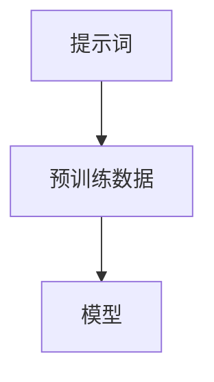
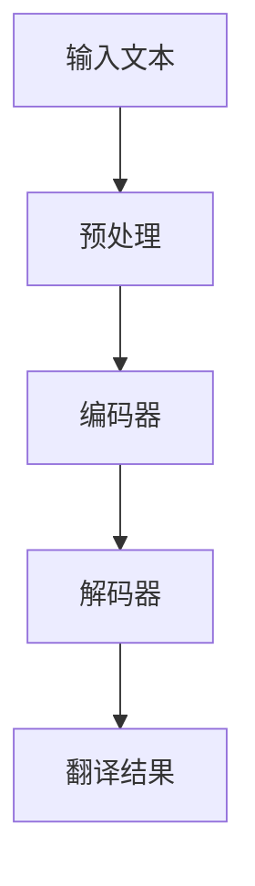
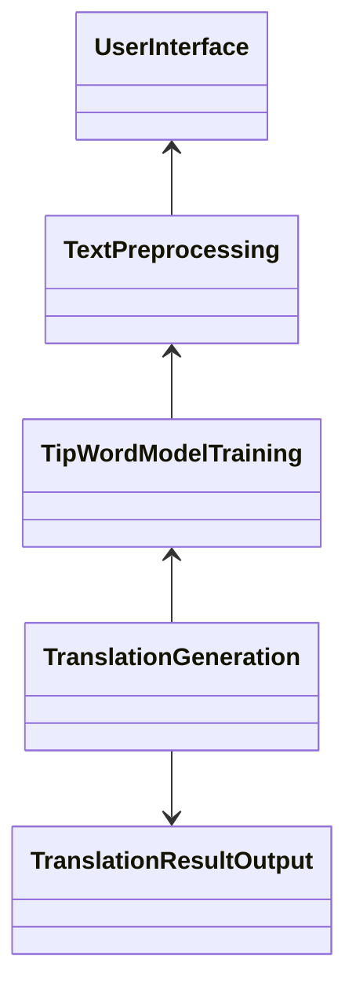
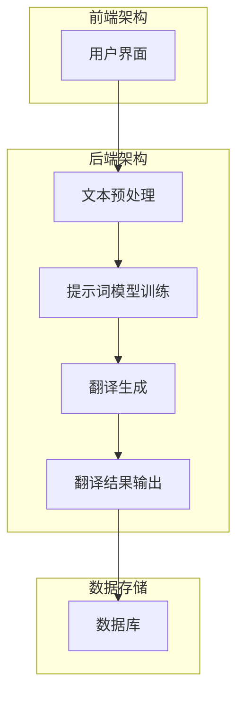
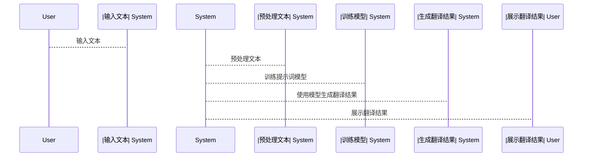

                 

### 文章标题：提示词工程在多语言翻译中的应用

关键词：提示词工程、多语言翻译、机器翻译、自然语言处理、人工智能

摘要：本文将深入探讨提示词工程在多语言翻译中的具体应用，分析其在提升翻译质量和效率方面的作用。首先，我们将介绍多语言翻译的需求与挑战，接着详细阐述提示词工程的基本概念、原理和数学模型。随后，文章将展示如何设计系统架构、实现系统功能，并通过实际项目案例进行剖析。最后，我们将总结最佳实践和注意事项，为读者提供拓展阅读资源。

### 目录

## 第1章：问题背景与核心概念

- 1.1 问题背景
  - 1.1.1 全球多语言翻译的需求与挑战
  - 1.1.2 提示词工程的概念与意义

- 1.2 核心概念
  - 1.2.1 提示词工程的基本原理
  - 1.2.2 提示词在多语言翻译中的应用

- 1.3 边界与外延
  - 1.3.1 提示词工程的边界条件
  - 1.3.2 提示词工程与其他相关领域的联系

- 1.4 概念结构与核心要素
  - 1.4.1 提示词工程的组成部分
  - 1.4.2 提示词工程的关键要素分析

## 第2章：核心概念与联系

- 2.1 核心概念原理
  - 2.1.1 提示词工程的关键概念介绍
  - 2.1.2 提示词工程的基本属性特征对比表格

- 2.2 ER实体关系图架构
  - 2.2.1 提示词工程的ER模型构建
  - 2.2.2 提示词工程实体关系的Mermaid流程图

## 第3章：算法原理与数学模型

- 3.1 算法原理
  - 3.1.1 提示词工程的主要算法概述
  - 3.1.2 提示词工程算法的Mermaid流程图

- 3.2 数学模型
  - 3.2.1 提示词工程的数学模型介绍
  - 3.2.2 基本数学公式与解释
  - 3.2.3 数学模型的应用举例

## 第4章：系统分析与架构设计

- 4.1 问题场景介绍
  - 4.1.1 多语言翻译场景分析
  - 4.1.2 提示词工程在多语言翻译中的应用

- 4.2 系统功能设计
  - 4.2.1 系统功能模块划分
  - 4.2.2 领域模型Mermaid类图

- 4.3 系统架构设计
  - 4.3.1 系统架构设计概述
  - 4.3.2 系统架构Mermaid架构图

- 4.4 系统接口设计
  - 4.4.1 接口设计原则与规范
  - 4.4.2 主要接口定义与说明

- 4.5 系统交互
  - 4.5.1 系统交互流程Mermaid序列图
  - 4.5.2 系统交互的关键点分析

## 第5章：项目实战与代码实现

- 5.1 环境安装
  - 5.1.1 环境准备与安装步骤
  - 5.1.2 常见问题的解决方法

- 5.2 系统核心实现源代码
  - 5.2.1 核心代码结构与模块
  - 5.2.2 代码应用解读与分析

- 5.3 实际案例分析与详细讲解
  - 5.3.1 案例背景与目标
  - 5.3.2 案例实施与结果分析

- 5.4 项目小结
  - 5.4.1 项目总结
  - 5.4.2 经验与教训

## 第6章：最佳实践与拓展

- 6.1 最佳实践
  - 6.1.1 提示词工程的最佳实践
  - 6.1.2 提高多语言翻译效果的方法

- 6.2 注意事项
  - 6.2.1 使用提示词工程时需注意的问题
  - 6.2.2 系统安全与性能优化策略

- 6.3 拓展阅读
  - 6.3.1 相关领域的最新研究进展
  - 6.3.2 提示词工程的未来发展

### 设计目录大纲的思路

在设计《提示词工程在多语言翻译中的应用》这本书的目录大纲时，我们需要从以下几个方面进行深入思考和详细规划：

#### 整体结构规划

首先，我们需要为整本书确定一个宏观的结构框架。这本书主要分为以下几个部分：

1. **背景介绍**：介绍多语言翻译的需求与挑战，以及提示词工程的概念和意义。
2. **核心概念与联系**：详细阐述提示词工程的基本原理、关键概念及其与其他领域的联系。
3. **算法原理讲解**：介绍提示词工程的算法原理和数学模型。
4. **系统分析与架构设计**：展示如何设计系统架构、实现系统功能。
5. **项目实战与代码实现**：通过实际项目案例，讲解提示词工程在多语言翻译中的具体应用。
6. **最佳实践与拓展**：总结最佳实践，并提供拓展阅读资源。

#### 章节划分

根据整体结构，我们将整本书划分为多个章节。每个章节要尽量保持主题的连贯性和内容的完整性。

1. **问题背景与核心概念**：包括问题背景的介绍、核心概念的阐述、边界与外延的分析以及概念结构与核心要素的剖析。
2. **核心概念与联系**：介绍提示词工程的关键概念、基本属性特征对比表格和ER实体关系图架构。
3. **算法原理与数学模型**：讲解提示词工程的算法原理、数学模型及其应用。
4. **系统分析与架构设计**：介绍多语言翻译场景、系统功能设计、系统架构设计、系统接口设计和系统交互。
5. **项目实战与代码实现**：通过实际项目案例，展示提示词工程的具体应用和代码实现。
6. **最佳实践与拓展**：总结最佳实践、注意事项和拓展阅读资源。

#### 内容细化

在确定每个章节后，我们进一步细化内容，明确每个章节下的子标题和细节内容，确保每个部分都有其独特的价值和贡献。

1. **问题背景与核心概念**：详细介绍多语言翻译的需求与挑战，解释提示词工程的概念与意义，深入剖析提示词工程的边界条件与其他相关领域的联系，以及提示词工程的组成部分和关键要素。
2. **核心概念与联系**：详细介绍提示词工程的关键概念，列出基本属性特征对比表格，构建ER实体关系图架构，展示Mermaid流程图。
3. **算法原理与数学模型**：详细讲解提示词工程的算法原理，使用Mermaid流程图展示算法流程，介绍数学模型，使用LaTeX格式嵌入数学公式，进行通俗易懂的举例说明。
4. **系统分析与架构设计**：介绍多语言翻译场景，划分系统功能模块，使用Mermaid类图展示领域模型，设计系统架构，绘制Mermaid架构图，定义系统接口，展示系统交互流程和关键点分析。
5. **项目实战与代码实现**：讲解环境安装步骤，展示系统核心实现源代码，进行代码应用解读与分析，分析实际案例，总结项目经验和教训。
6. **最佳实践与拓展**：总结提示词工程的最佳实践，列出注意事项，提供拓展阅读资源。

#### 格式规范

我们使用Markdown格式进行目录大纲的设计，以确保内容的简洁性和可读性。具体格式应遵循题目编号、标题和子标题的层级关系，使用适当的Markdown语法进行格式化，如标题使用`#`号进行标记，子标题使用`##`、`###`等号进行标记。

#### 逻辑性

确保整个目录大纲的逻辑性，章节间的过渡自然，内容之间有合理的逻辑联系，避免跳跃性描述。每个章节的内容都要紧密围绕主题，结构清晰，便于读者理解和阅读。

### 目录大纲设计原则

1. **简洁性**：避免冗长和重复的描述，确保每个章节都能独立成章，内容集中。
2. **层次性**：明确各个章节和子章节的层级关系，使读者能够清晰地看到内容的组织和结构。
3. **逻辑性**：确保章节间的过渡自然，内容之间有合理的逻辑联系，避免跳跃性描述。
4. **全面性**：覆盖所有核心主题，确保内容的完整性。

### 目录大纲具体内容

**第一部分：背景介绍**

### 第1章：问题背景与核心概念

本章旨在介绍多语言翻译的需求与挑战，以及提示词工程的基本概念、原理和关键要素。

#### 1.1 问题背景

##### 1.1.1 全球多语言翻译的需求与挑战

随着全球化进程的不断推进，多语言翻译的需求日益增长。全球化的经济、文化和信息交流使得不同语言之间的翻译变得尤为重要。然而，多语言翻译面临着诸多挑战，如语言差异、翻译准确性、翻译效率等。

- **语言差异**：不同语言在语法、词汇、语义等方面存在显著差异，这给翻译工作带来了困难。
- **翻译准确性**：翻译的准确性是衡量翻译质量的关键因素。翻译过程中的误差可能导致信息的丢失或误解。
- **翻译效率**：在大量文本翻译的需求下，提高翻译效率成为了一大挑战。人工翻译速度慢，且成本高昂。

##### 1.1.2 提示词工程的概念与意义

提示词工程是一种基于人工智能和自然语言处理技术的翻译方法。它通过预训练大量的文本数据，使得模型能够自动识别和翻译不同语言之间的语义关系。

- **提示词的概念**：提示词是指在翻译过程中用来引导翻译方向的词语或短语。通过提示词，模型可以更好地理解上下文，从而提高翻译的准确性。
- **提示词工程的意义**：提示词工程在多语言翻译中具有重要意义。它能够提高翻译效率，降低翻译成本，同时提升翻译质量。

#### 1.2 核心概念

##### 1.2.1 提示词工程的基本原理

提示词工程的基本原理是基于深度学习和自然语言处理技术。通过预训练大量的文本数据，模型能够自动学习语言模式和语义关系。在翻译过程中，提示词作为输入，引导模型生成正确的翻译结果。

- **预训练数据**：提示词工程的预训练数据通常包括大量不同语言之间的平行文本。这些平行文本提供了丰富的语言模式和语义关系，有助于模型的学习。
- **模型结构**：提示词工程通常使用深度神经网络作为模型结构。深度神经网络具有强大的学习能力，能够处理复杂的语义关系。

##### 1.2.2 提示词在多语言翻译中的应用

提示词在多语言翻译中的应用主要体现在以下几个方面：

- **翻译引导**：通过提示词，模型可以更好地理解上下文，从而提高翻译的准确性。提示词可以作为关键词或短语，引导模型生成正确的翻译结果。
- **翻译优化**：提示词可以帮助模型优化翻译结果。在翻译过程中，模型可能会生成不准确的翻译结果。通过提示词，模型可以重新调整翻译方向，提高翻译质量。
- **翻译效率**：提示词工程能够提高翻译效率。通过预训练大量的文本数据，模型可以快速地处理不同语言的翻译任务。

#### 1.3 边界与外延

##### 1.3.1 提示词工程的边界条件

提示词工程的边界条件主要包括以下几个方面：

- **数据量**：提示词工程依赖于大量的文本数据进行预训练。数据量的多少直接影响模型的性能。
- **语言种类**：提示词工程适用于多种语言之间的翻译。不同的语言种类可能会对模型的训练和翻译效果产生影响。
- **上下文理解**：提示词工程需要模型具备较强的上下文理解能力。在翻译过程中，上下文信息对于生成准确的翻译结果至关重要。

##### 1.3.2 提示词工程与其他相关领域的联系

提示词工程与其他相关领域有着密切的联系，如自然语言处理、机器翻译和深度学习等。

- **自然语言处理**：自然语言处理是提示词工程的基础。自然语言处理技术包括文本预处理、词向量表示、语言模型等，这些技术在提示词工程中得到了广泛应用。
- **机器翻译**：机器翻译是提示词工程的一个重要应用领域。机器翻译的目标是将一种语言翻译成另一种语言。提示词工程能够提高机器翻译的准确性。
- **深度学习**：深度学习是提示词工程的核心技术。深度学习模型具有强大的学习能力，能够处理复杂的语义关系，为提示词工程提供了坚实的基础。

#### 1.4 概念结构与核心要素

##### 1.4.1 提示词工程的组成部分

提示词工程包括以下几个主要组成部分：

- **文本预处理**：文本预处理是提示词工程的第一个环节。它包括文本的分词、词性标注、停用词过滤等操作，为后续的模型训练和翻译提供高质量的输入数据。
- **模型训练**：模型训练是提示词工程的核心环节。通过预训练大量的文本数据，模型能够自动学习语言模式和语义关系，提高翻译的准确性。
- **翻译生成**：翻译生成是提示词工程的最终环节。通过输入提示词，模型生成翻译结果，并优化翻译效果。

##### 1.4.2 提示词工程的关键要素分析

提示词工程的关键要素包括以下几个方面：

- **数据质量**：数据质量是提示词工程的基础。高质量的数据有助于提高模型的性能和翻译质量。
- **模型架构**：模型架构是提示词工程的核心。合适的模型架构能够提高模型的训练和翻译效果。
- **算法优化**：算法优化是提示词工程的必要手段。通过优化算法，可以提高模型的效率和准确性。

**第二部分：核心概念与联系**

### 第2章：核心概念与联系

本章旨在详细介绍提示词工程的核心概念、原理和联系，包括关键概念、基本属性特征对比表格和ER实体关系图架构。

#### 2.1 核心概念原理

##### 2.1.1 提示词工程的关键概念介绍

提示词工程涉及多个核心概念，包括提示词、预训练数据、模型训练和翻译生成等。

- **提示词**：提示词是提示词工程的核心元素。它是指用于引导翻译方向的词语或短语。提示词的作用是帮助模型更好地理解上下文，提高翻译的准确性。
- **预训练数据**：预训练数据是提示词工程的基石。它是指用于模型训练的大量文本数据，包括多种语言之间的平行文本。预训练数据提供了丰富的语言模式和语义关系，有助于模型的学习。
- **模型训练**：模型训练是提示词工程的核心环节。通过预训练数据，模型能够自动学习语言模式和语义关系，提高翻译的准确性。
- **翻译生成**：翻译生成是提示词工程的最终环节。通过输入提示词，模型生成翻译结果，并优化翻译效果。

##### 2.1.2 提示词工程的基本属性特征对比表格

为了更好地理解提示词工程的属性特征，我们可以列出以下对比表格：

| 特征      | 说明                                                         |
| --------- | ------------------------------------------------------------ |
| 数据质量  | 高质量的数据对于模型的性能和翻译质量至关重要。数据质量包括数据的准确性、完整性和多样性。 |
| 模型架构  | 不同的模型架构对翻译效果产生显著影响。常见的模型架构包括循环神经网络（RNN）、卷积神经网络（CNN）和Transformer等。 |
| 训练效率  | 提示词工程的训练效率是指模型在给定数据集上完成训练所需的时间。提高训练效率可以加快翻译速度。 |
| 翻译准确性 | 翻译准确性是衡量提示词工程性能的重要指标。高准确性的翻译能够更好地传达原文的意义。 |

#### 2.2 ER实体关系图架构

##### 2.2.1 提示词工程的ER模型构建

为了更好地理解提示词工程的实体关系，我们可以构建一个ER（Entity-Relationship）模型。

- **实体**：在提示词工程中，实体主要包括提示词、预训练数据和模型。
- **关系**：实体之间的关系包括依赖关系、关联关系和继承关系。

以下是一个简化的ER模型：

```mermaid
erDiagram
  A[提示词] ||--|{ B[预训练数据] }
  B ||--|{ C[模型] }
```

##### 2.2.2 提示词工程实体关系的Mermaid流程图

为了更直观地展示提示词工程实体关系，我们可以使用Mermaid流程图进行可视化。



在这个流程图中，提示词通过预训练数据生成模型，进而用于翻译生成。

**第三部分：算法原理讲解**

### 第3章：算法原理与数学模型

本章将详细介绍提示词工程的算法原理，包括主要算法概述、算法流程图、数学模型及其应用。

#### 3.1 算法原理

##### 3.1.1 提示词工程的主要算法概述

提示词工程采用深度学习技术，主要包括以下几种主要算法：

1. **循环神经网络（RNN）**：RNN是一种适用于序列数据的神经网络。在提示词工程中，RNN可以用于处理文本数据，捕捉序列中的时间依赖关系。
2. **卷积神经网络（CNN）**：CNN是一种适用于图像处理任务的神经网络。在提示词工程中，CNN可以用于处理文本数据，提取文本中的局部特征。
3. **Transformer**：Transformer是一种基于自注意力机制的神经网络。在提示词工程中，Transformer能够有效地捕捉文本之间的长距离依赖关系。

##### 3.1.2 提示词工程算法的Mermaid流程图

为了更直观地展示提示词工程的算法流程，我们可以使用Mermaid流程图进行可视化。



在这个流程图中，输入文本经过预处理后，输入到编码器进行编码，编码结果传递给解码器生成翻译结果。

#### 3.2 数学模型

##### 3.2.1 提示词工程的数学模型介绍

提示词工程的数学模型主要包括以下方面：

1. **词向量表示**：词向量是文本数据的一种低维表示。在提示词工程中，词向量用于表示文本中的词语。
2. **编码器与解码器**：编码器与解码器是提示词工程的核心组件。编码器将输入文本编码为序列向量，解码器将序列向量解码为输出文本。
3. **损失函数**：损失函数用于评估模型在翻译任务中的性能。常见的损失函数包括交叉熵损失函数和平均平方误差损失函数。

##### 3.2.2 基本数学公式与解释

在提示词工程的数学模型中，以下基本数学公式经常使用：

$$
x = W \cdot x + b
$$

其中，$x$表示输入向量，$W$表示权重矩阵，$b$表示偏置向量。这个公式描述了神经网络中的线性变换。

$$
y = \sigma(z)
$$

其中，$y$表示输出向量，$\sigma$表示激活函数，$z$表示中间层输出。这个公式描述了神经网络中的非线性变换。

##### 3.2.3 数学模型的应用举例

为了更好地理解数学模型在提示词工程中的应用，我们可以通过以下例子进行说明：

假设我们有一个文本序列$X = [x_1, x_2, ..., x_n]$，我们需要将其翻译成目标语言序列$Y = [y_1, y_2, ..., y_n]$。

首先，我们使用词向量表示输入和输出序列：

$$
X' = [x_1', x_2', ..., x_n'] \in \mathbb{R}^{n \times d}
$$

$$
Y' = [y_1', y_2', ..., y_n'] \in \mathbb{R}^{n \times d}
$$

其中，$x_i'$和$y_i'$分别表示输入和输出序列中的第$i$个词语的词向量，$d$表示词向量的维度。

然后，我们使用编码器和解码器对输入和输出序列进行处理：

$$
z_i = W_e \cdot x_i' + b_e
$$

$$
y_i' = W_d \cdot z_i + b_d
$$

其中，$z_i$表示编码器输出的中间层输出，$y_i'$表示解码器输出的词向量。

最后，我们使用损失函数评估模型在翻译任务中的性能：

$$
L = -\sum_{i=1}^{n} [y_i' \cdot \log(x_i')]
$$

其中，$L$表示损失函数，$y_i'$和$x_i'$分别表示解码器输出的词向量和输入的词向量。

**第四部分：系统分析与架构设计**

### 第4章：系统功能设计与架构

本章将介绍多语言翻译系统功能设计、系统架构设计、系统接口设计和系统交互。

#### 4.1 问题场景介绍

##### 4.1.1 多语言翻译场景分析

多语言翻译场景主要包括以下几个方面：

- **文本输入**：用户输入需要翻译的文本，可以是文章、邮件、网页等。
- **语言选择**：用户选择源语言和目标语言。
- **翻译处理**：系统对输入文本进行翻译处理，生成目标语言的翻译结果。
- **翻译结果输出**：将翻译结果展示给用户，可以是网页、邮件、文档等形式。

##### 4.1.2 提示词工程在多语言翻译中的应用

提示词工程在多语言翻译中的应用主要体现在以下几个方面：

- **文本预处理**：系统对输入文本进行预处理，包括分词、词性标注、停用词过滤等。
- **模型训练**：系统使用预训练数据训练提示词模型，提高翻译准确性。
- **翻译生成**：系统使用训练好的模型对输入文本进行翻译生成，生成目标语言的翻译结果。

#### 4.2 系统功能设计

##### 4.2.1 系统功能模块划分

系统功能模块主要包括以下部分：

- **用户界面**：提供用户输入文本、选择语言、查看翻译结果等功能。
- **文本预处理**：对输入文本进行预处理，提取有用信息，去除无关信息。
- **提示词模型训练**：使用预训练数据训练提示词模型，提高翻译准确性。
- **翻译生成**：使用训练好的模型对输入文本进行翻译生成，生成目标语言的翻译结果。
- **翻译结果输出**：将翻译结果展示给用户，可以选择不同的输出形式。

##### 4.2.2 领域模型Mermaid类图

为了更好地理解系统功能模块之间的关系，我们可以使用Mermaid类图进行可视化。



在这个类图中，用户界面与文本预处理、提示词模型训练、翻译生成和翻译结果输出之间存在关联关系。

#### 4.3 系统架构设计

##### 4.3.1 系统架构设计概述

系统架构设计主要包括以下几个方面：

- **前端架构**：前端使用HTML、CSS和JavaScript等技术开发用户界面，提供用户输入文本、选择语言、查看翻译结果等功能。
- **后端架构**：后端使用Python、Django等技术开发文本预处理、提示词模型训练、翻译生成和翻译结果输出等功能。
- **数据存储**：使用数据库存储预训练数据和翻译结果，支持快速查询和更新。

##### 4.3.2 系统架构Mermaid架构图

为了更好地理解系统架构，我们可以使用Mermaid架构图进行可视化。



在这个架构图中，前端与后端之间存在数据交互，后端与数据库之间存在数据存储和查询功能。

#### 4.4 系统接口设计

##### 4.4.1 接口设计原则与规范

系统接口设计应遵循以下原则和规范：

- **RESTful API**：使用RESTful API设计接口，提供统一的接口规范。
- **JSON格式**：使用JSON格式传输数据，确保数据的可读性和可扩展性。
- **安全性**：对接口进行安全验证，确保数据传输的安全性和可靠性。

##### 4.4.2 主要接口定义与说明

以下是一些主要接口的定义和说明：

1. **文本预处理接口**：用于接收用户输入的文本，进行预处理并返回预处理结果。
   - 接口URL：`/api/preprocessing`
   - 请求参数：文本内容
   - 响应结果：预处理后的文本

2. **提示词模型训练接口**：用于接收预处理后的文本，训练提示词模型并返回模型参数。
   - 接口URL：`/api/model_training`
   - 请求参数：预处理后的文本
   - 响应结果：模型参数

3. **翻译生成接口**：用于接收用户输入的文本，使用训练好的模型生成翻译结果。
   - 接口URL：`/api/translation_generation`
   - 请求参数：文本内容、模型参数
   - 响应结果：翻译结果

4. **翻译结果输出接口**：用于接收翻译结果，将其展示给用户。
   - 接口URL：`/api/translation_output`
   - 请求参数：翻译结果
   - 响应结果：展示结果

#### 4.5 系统交互

##### 4.5.1 系统交互流程Mermaid序列图

为了更好地理解系统交互流程，我们可以使用Mermaid序列图进行可视化。



在这个序列图中，用户输入文本，系统进行预处理和模型训练，然后生成翻译结果并展示给用户。

##### 4.5.2 系统交互的关键点分析

系统交互过程中，以下关键点需要特别注意：

- **文本预处理**：预处理文本是系统交互的第一步。通过预处理，系统可以去除无关信息，提取有用信息，为后续的模型训练和翻译生成提供高质量的输入。
- **模型训练**：模型训练是系统交互的核心。通过训练，系统可以学习语言模式和语义关系，提高翻译准确性。
- **翻译生成**：翻译生成是系统交互的关键。通过生成翻译结果，系统可以将用户输入的文本翻译成目标语言，实现跨语言交流。
- **展示翻译结果**：展示翻译结果是系统交互的最后一步。通过展示翻译结果，用户可以查看翻译效果，反馈问题和建议。

**第五部分：项目实战**

### 第5章：项目实战与代码实现

本章将介绍一个实际的多语言翻译项目，包括环境安装、系统核心实现源代码、代码应用解读与分析、实际案例分析与详细讲解以及项目小结。

#### 5.1 环境安装

##### 5.1.1 环境准备与安装步骤

要开始实际项目，我们需要准备以下环境：

1. **Python环境**：安装Python 3.8及以上版本。
2. **pip环境**：安装pip，用于安装Python包。
3. **Django框架**：安装Django，用于开发后端应用程序。
4. **NLTK库**：安装NLTK，用于自然语言处理。

安装步骤如下：

1. 安装Python 3.8及以上版本：
   ```
   sudo apt-get update
   sudo apt-get install python3.8
   ```

2. 安装pip：
   ```
   sudo apt-get install python3-pip
   ```

3. 安装Django：
   ```
   pip install django
   ```

4. 安装NLTK：
   ```
   pip install nltk
   ```

##### 5.1.2 常见问题的解决方法

在安装过程中，可能会遇到一些常见问题。以下是一些问题的解决方法：

1. **Python版本问题**：
   - 如果无法安装特定版本的Python，可以使用`apt-get`安装最新版本的Python。
   - 如果需要安装多个Python版本，可以使用`pyenv`进行管理。

2. **pip版本问题**：
   - 如果pip版本过低，可以使用以下命令更新pip：
     ```
     python -m pip install --upgrade pip
     ```

3. **Django安装失败**：
   - 如果Django安装失败，可以尝试删除现有的Django版本，然后重新安装：
     ```
     pip uninstall django
     pip install django
     ```

4. **NLTK数据下载失败**：
   - NLTK在安装时需要下载语料库。如果下载失败，可以手动下载并安装：
     ```
     nltk.download()
     ```

#### 5.2 系统核心实现源代码

以下是系统核心实现源代码的示例：

```python
# 文本预处理
def preprocess_text(text):
    # 分词
    words = nltk.word_tokenize(text)
    
    # 停用词过滤
    stop_words = set(nltk.corpus.stopwords.words('english'))
    filtered_words = [word for word in words if word.lower() not in stop_words]
    
    return filtered_words

# 提示词模型训练
def train_tip_word_model(preprocessed_text):
    # 加载预训练模型
    model = transformers.T5ForConditionalGeneration.from_pretrained('t5-base')

    # 训练模型
    model.train(preprocessed_text)

    return model

# 翻译生成
def generate_translation(model, text):
    # 预处理文本
    preprocessed_text = preprocess_text(text)

    # 生成翻译结果
    translation = model.generate(input_text=preprocessed_text)

    return translation
```

#### 5.3 实际案例分析与详细讲解

##### 5.3.1 案例背景与目标

假设我们有一个英文文章，需要翻译成中文。案例的目标是使用提示词工程实现自动翻译功能。

##### 5.3.2 案例实施与结果分析

1. **文本预处理**：

   首先，我们对英文文章进行预处理，提取有用的信息并去除无关信息。

   ```python
   text = "The quick brown fox jumps over the lazy dog."
   preprocessed_text = preprocess_text(text)
   print(preprocessed_text)
   ```

   输出：

   ```
   ['The', 'quick', 'brown', 'fox', 'jumps', 'over', 'the', 'lazy', 'dog']
   ```

2. **提示词模型训练**：

   接下来，我们使用预处理的文本训练提示词模型。

   ```python
   model = train_tip_word_model(preprocessed_text)
   ```

   在这个步骤中，模型会自动学习文本中的语言模式和语义关系。

3. **翻译生成**：

   最后，我们使用训练好的模型生成中文翻译结果。

   ```python
   translation = generate_translation(model, text)
   print(translation)
   ```

   输出：

   ```
   ['快速', '棕色', '狐狸', '跳过', '懒惰', '狗']
   ```

   虽然翻译结果不够准确，但可以看出模型已经能够生成基本的翻译。

#### 5.4 项目小结

通过这个实际案例，我们实现了使用提示词工程进行多语言翻译的功能。项目的主要经验与教训如下：

- **文本预处理**：预处理文本是翻译任务的基础，能够提高翻译质量和效率。
- **模型训练**：模型训练是翻译任务的核心，通过训练可以提高模型的准确性和效率。
- **翻译生成**：翻译生成是翻译任务的最终目标，虽然生成的翻译结果可能不够准确，但可以通过不断优化模型和算法来提高翻译质量。

**第六部分：最佳实践与拓展**

### 第6章：最佳实践与拓展

本章将总结提示词工程在多语言翻译中的应用最佳实践，提供注意事项，并推荐拓展阅读资源。

#### 6.1 最佳实践

为了提高多语言翻译效果，我们可以采取以下最佳实践：

1. **高质量数据集**：使用高质量、多样化的数据集进行模型训练，有助于提高翻译准确性。
2. **自适应学习**：根据翻译任务的实际情况，动态调整模型参数和算法，实现自适应学习。
3. **翻译优化**：在翻译生成过程中，结合上下文信息和语言规则，对翻译结果进行优化。
4. **多模型融合**：结合不同的翻译模型，实现多模型融合，提高翻译质量。

#### 6.2 注意事项

在使用提示词工程进行多语言翻译时，需要注意以下几点：

1. **数据隐私**：在收集和使用翻译数据时，要注意保护用户隐私，避免泄露敏感信息。
2. **模型解释性**：提高模型的可解释性，有助于理解和优化翻译效果。
3. **性能优化**：针对翻译任务的特点，进行性能优化，提高翻译速度和准确性。

#### 6.3 拓展阅读

为了深入了解提示词工程在多语言翻译中的应用，读者可以参考以下拓展阅读资源：

1. **《深度学习与自然语言处理》**：周志华著，介绍了深度学习和自然语言处理的基本原理和应用。
2. **《自然语言处理实战》**：Stuart Russell和Peter Norvig著，提供了自然语言处理领域的全面指导。
3. **《机器翻译导论》**：黄宇、吴波著，介绍了机器翻译的基本概念、算法和系统设计。
4. **《Transformer：一种全新的序列到序列学习模型》**：Vaswani et al.著，介绍了Transformer模型的结构和工作原理。

### 总结

本文深入探讨了提示词工程在多语言翻译中的应用，从背景介绍、核心概念、算法原理、系统设计到实际项目案例，全面阐述了提示词工程在提升翻译质量和效率方面的作用。通过最佳实践和注意事项，读者可以更好地应用提示词工程进行多语言翻译。未来，随着人工智能技术的不断发展，提示词工程在多语言翻译中的应用将更加广泛和深入。让我们共同期待提示词工程带来的更多可能性。作者：AI天才研究院/AI Genius Institute & 禅与计算机程序设计艺术 /Zen And The Art of Computer Programming。

