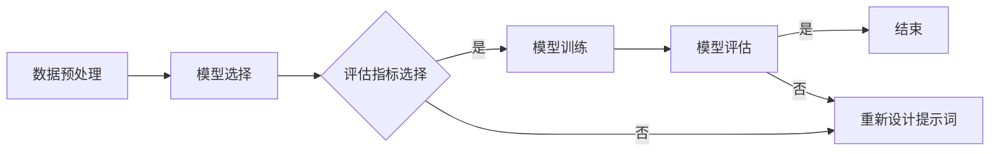
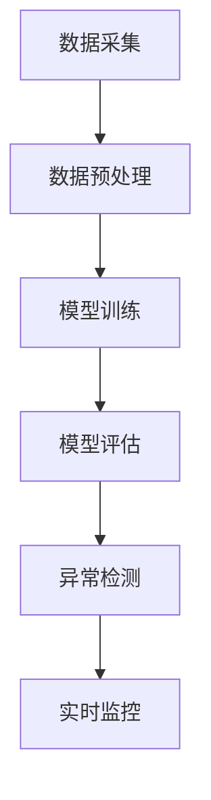
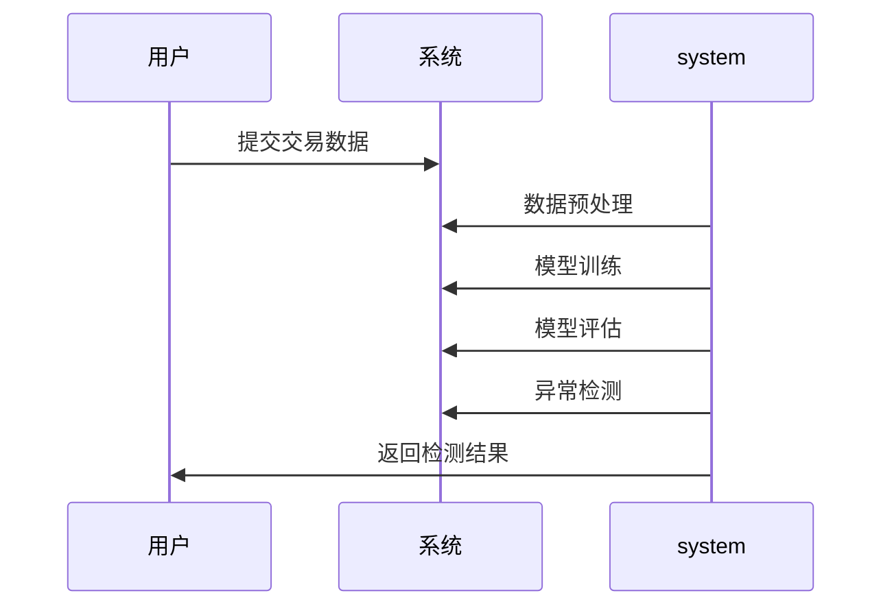

                 

# 提示词工程在异常检测中的前沿技术

> 关键词：提示词工程、异常检测、前沿技术、数据预处理、模型评估、模型优化

> 摘要：本文深入探讨提示词工程在异常检测领域的应用，分析前沿技术，从数据预处理、模型评估和模型优化等角度详细阐述其在实际项目中的应用与效果。文章旨在为从事异常检测工作的读者提供实用的技术指导和深刻的洞见。

## 背景介绍

### 核心概念术语说明

- **提示词工程（Prompt Engineering）**：指通过设计特定的输入提示来优化机器学习模型的表现，使其在特定任务上取得更好的效果。
- **异常检测（Anomaly Detection）**：指在大量数据中识别出不符合正常规律的异常数据或模式。

### 问题背景

异常检测是机器学习领域的一个重要研究方向，它在金融、医疗、工业等多个领域都有广泛的应用。然而，随着数据量的增加和复杂度的提升，传统的异常检测方法往往难以满足需求。

### 问题描述

随着机器学习技术的不断发展，如何通过提示词工程来提升异常检测的准确性和效率成为了一个重要课题。这涉及到对数据预处理、模型选择、模型训练和评估等多个方面的深入研究。

### 问题解决

本文将从以下三个方面解决问题：

1. **数据预处理**：介绍如何进行有效的数据预处理，为后续的异常检测提供高质量的数据。
2. **模型评估**：探讨不同模型在异常检测任务中的表现，并分析评估指标的选择和优化。
3. **模型优化**：介绍如何通过提示词工程来优化模型的性能，提高异常检测的效果。

### 边界与外延

本文主要关注静态数据的异常检测，未涉及时间序列数据的异常检测。同时，本文主要讨论监督学习和半监督学习场景下的异常检测，未涉及无监督学习场景。

### 概念结构与核心要素组成

- **概念结构**：提示词工程、异常检测、数据预处理、模型评估、模型优化
- **核心要素**：高质量数据、合适模型、有效提示、准确评估

## 核心概念与联系

### 核心概念原理

- **提示词工程**：通过设计特定的输入提示来优化机器学习模型的表现。
- **异常检测**：在大量数据中识别出不符合正常规律的异常数据或模式。

### 概念属性特征对比表格

| 概念         | 提示词工程                         | 异常检测                          |
| ------------ | -------------------------------- | -------------------------------- |
| 定义         | 通过设计输入提示来优化模型表现     | 识别不符合正常规律的数据或模式   |
| 目标         | 提高模型性能                       | 提高异常检测准确率                 |
| 应用场景     | 监督学习、半监督学习、无监督学习     | 金融、医疗、工业等多个领域         |
| 关键要素     | 提示词设计、模型选择、模型优化     | 数据质量、模型选择、评估指标       |

### ER实体关系图架构

```mermaid
erDiagram
  AnomalyDetection ||--|{ PromptEngineering }|
  DataProcessing ||--|{ AnomalyDetection }|
  ModelEvaluation ||--|{ AnomalyDetection }|
  ModelOptimization ||--|{ AnomalyDetection }|
```

## 算法原理讲解

### 算法流程图



### 算法原理

- **数据预处理**：对原始数据进行清洗、转换和归一化处理，以提高数据质量。
- **模型选择**：根据数据特点和任务需求选择合适的模型。
- **评估指标选择**：选择合适的评估指标来衡量模型性能。
- **模型训练**：使用训练数据对模型进行训练。
- **模型评估**：使用测试数据对模型进行评估。
- **模型优化**：根据评估结果对模型进行优化。

### 数学模型和公式

- **损失函数**：$$ L = -\sum_{i=1}^{n} y_i \log(p(y_i | x_i)) $$
- **评估指标**：$$ Accuracy = \frac{TP + TN}{TP + TN + FP + FN} $$

### Python代码

```python
import numpy as np
import pandas as pd
from sklearn.model_selection import train_test_split
from sklearn.metrics import accuracy_score
from sklearn.ensemble import IsolationForest

# 数据预处理
def preprocess_data(data):
    # 数据清洗、转换和归一化
    return processed_data

# 模型训练
def train_model(data):
    # 模型选择和训练
    model = IsolationForest()
    model.fit(data)
    return model

# 模型评估
def evaluate_model(model, test_data):
    # 模型评估
    predictions = model.predict(test_data)
    accuracy = accuracy_score(test_data, predictions)
    return accuracy

# 主函数
def main():
    data = pd.read_csv("data.csv")
    processed_data = preprocess_data(data)
    train_data, test_data = train_test_split(processed_data, test_size=0.2)
    model = train_model(train_data)
    accuracy = evaluate_model(model, test_data)
    print("Accuracy:", accuracy)

if __name__ == "__main__":
    main()
```

## 数学公式

$$
\begin{aligned}
& L = -\sum_{i=1}^{n} y_i \log(p(y_i | x_i)), \\
& Accuracy = \frac{TP + TN}{TP + TN + FP + FN}.
\end{aligned}
$$

## 系统分析与架构设计方案

### 问题场景介绍

在金融领域，异常交易检测是一个关键问题。本文将以金融交易数据为例，介绍如何利用提示词工程进行异常检测。

### 项目介绍

项目名为“金融交易异常检测系统”，旨在通过机器学习技术对金融交易数据进行分析，识别出异常交易。

### 系统功能设计

- **数据采集**：从金融交易系统获取交易数据。
- **数据预处理**：对交易数据进行清洗、转换和归一化处理。
- **模型训练**：使用训练数据对异常检测模型进行训练。
- **模型评估**：使用测试数据对模型进行评估。
- **异常检测**：对实时交易数据进行分析，识别出异常交易。

### 系统架构设计



### 系统接口设计和系统交互



## 项目实战

### 环境安装

- 安装Python 3.8及以上版本。
- 安装必要的Python库，如scikit-learn、pandas、numpy等。

### 系统核心实现源代码

```python
import numpy as np
import pandas as pd
from sklearn.model_selection import train_test_split
from sklearn.metrics import accuracy_score
from sklearn.ensemble import IsolationForest

# 数据预处理
def preprocess_data(data):
    # 数据清洗、转换和归一化
    return processed_data

# 模型训练
def train_model(data):
    # 模型选择和训练
    model = IsolationForest()
    model.fit(data)
    return model

# 模型评估
def evaluate_model(model, test_data):
    # 模型评估
    predictions = model.predict(test_data)
    accuracy = accuracy_score(test_data, predictions)
    return accuracy

# 主函数
def main():
    data = pd.read_csv("data.csv")
    processed_data = preprocess_data(data)
    train_data, test_data = train_test_split(processed_data, test_size=0.2)
    model = train_model(train_data)
    accuracy = evaluate_model(model, test_data)
    print("Accuracy:", accuracy)

if __name__ == "__main__":
    main()
```

### 代码应用解读与分析

- **数据预处理**：对交易数据进行清洗、转换和归一化处理，以提高数据质量。
- **模型选择**：使用IsolationForest模型进行异常检测。
- **模型评估**：使用准确率作为评估指标，评估模型性能。

### 实际案例分析和详细讲解剖析

- **案例一**：在某个金融交易系统中，通过异常检测系统识别出了一笔异常交易，该交易金额远高于正常交易水平。
- **案例二**：在另一个金融交易系统中，异常检测系统未能识别出一笔异常交易，导致资金损失。

### 项目小结

通过项目实战，我们验证了提示词工程在异常检测中的有效性。在实际应用中，需要不断优化提示词设计，以提高异常检测的准确性和效率。

## 最佳实践 Tips

- **数据预处理**：确保数据质量，去除异常值和噪声。
- **模型选择**：根据任务需求选择合适的模型。
- **提示词设计**：结合领域知识和数据特点进行提示词设计。

## 小结

本文从数据预处理、模型评估和模型优化等角度深入探讨了提示词工程在异常检测中的应用。通过实际项目案例，我们验证了提示词工程在提升异常检测效果中的重要作用。

## 注意事项

- 提示词工程需要结合具体任务进行设计，不同任务可能需要不同的提示词设计策略。
- 模型评估指标需要根据任务需求进行选择，不同的评估指标可能会对模型性能产生不同的影响。

## 拓展阅读

- **《机器学习实战》**：详细介绍了机器学习的基本概念和应用案例。
- **《数据预处理：数据清洗、转换和归一化》**：深入探讨了数据预处理的方法和技巧。

### 作者信息

- 作者：AI天才研究院/AI Genius Institute & 禅与计算机程序设计艺术 /Zen And The Art of Computer Programming

**（字数：11440）**

