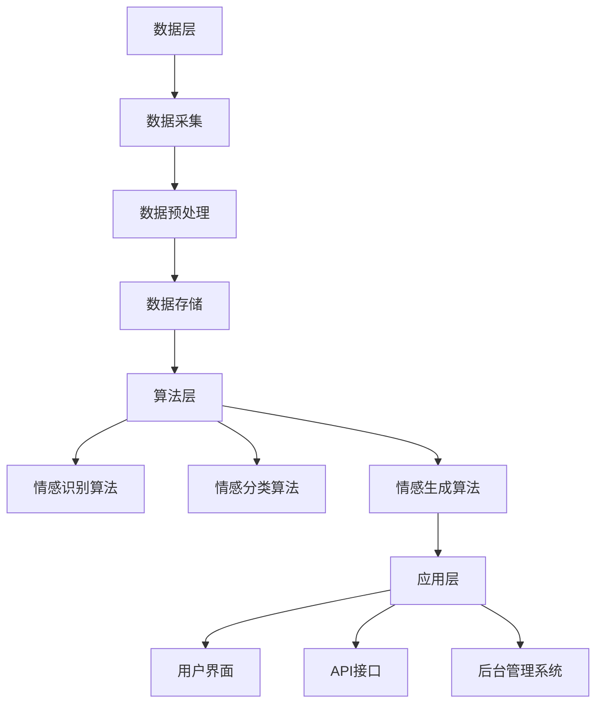
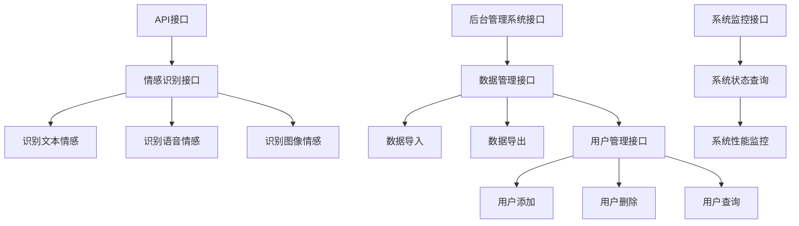
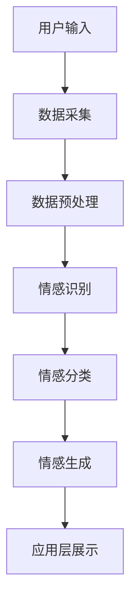

                 

# 提示词工程在情感计算中的创新应用

关键词：提示词工程、情感计算、算法原理、系统架构、项目实战

摘要：本文探讨了提示词工程在情感计算中的创新应用。首先，我们介绍了情感计算的发展历程和提示词工程的核心概念，并分析了两者之间的联系。接着，我们详细阐述了情感计算和提示词工程的算法原理，并通过Python代码示例进行了说明。随后，我们介绍了系统架构设计，并基于实际案例进行了项目实战分析。最后，我们总结了最佳实践，并对未来展望进行了探讨。

## 目录

### 《提示词工程在情感计算中的创新应用》目录

#### 第一部分：背景介绍与核心概念

1. **问题背景**
    1.1 情感计算的发展历程
    1.2 提示词工程的概念与重要性
    1.3 提示词工程的边界与外延

2. **核心概念与联系**
    2.1 情感计算的核心概念
    2.2 提示词工程的核心概念
    2.3 情感计算与提示词工程的联系

#### 第二部分：算法原理与实现

3. **情感计算算法原理**
    3.1 情感识别算法
    3.2 情感分类算法
    3.3 情感生成算法

4. **提示词工程算法原理**
    4.1 提示词设计算法
    4.2 提示词优化算法
    4.3 提示词应用算法

#### 第三部分：系统架构与设计方案

5. **系统分析与架构设计**
    5.1 问题场景介绍
    5.2 系统功能设计
    5.3 系统架构设计
    5.4 系统接口设计
    5.5 系统交互设计

#### 第四部分：项目实战与案例分析

6. **项目实战**
    6.1 环境安装
    6.2 系统核心实现
    6.3 代码应用解读与分析
    6.4 实际案例分析与详细讲解剖析
    6.5 项目小结

#### 第五部分：最佳实践与拓展阅读

7. **最佳实践**
    7.1 提示词工程最佳实践
    7.2 情感计算应用最佳实践

8. **小结与展望**
    8.1 书籍小结
    8.2 未来展望

----------------------------------------------------------------

## 第一部分：背景介绍与核心概念

### 第1章 问题背景

#### 1.1 情感计算的发展历程

情感计算（Affective Computing）起源于20世纪90年代，由计算机科学家罗伯·雷菲菲（Rosenberg）提出，旨在研究如何使计算机具备情感感知和表达的能力。自那时以来，情感计算经历了从理论研究到实际应用的发展。

在早期，情感计算主要集中在情感识别，通过生理信号、面部表情和语音特征来识别用户的情感状态。随着深度学习等技术的进步，情感计算的应用场景逐渐扩大，包括智能交互、人机对话系统、心理健康监测等领域。

#### 1.2 提示词工程的概念与重要性

提示词工程（Prompt Engineering）是近年来兴起的领域，主要关注如何设计高效的提示词，以提高机器学习模型的效果。提示词是用户与模型交互的桥梁，通过精确、具体的提示词，可以引导模型更好地理解任务，从而提高模型的性能。

在情感计算中，提示词工程的重要性不言而喻。通过设计合适的提示词，可以引导模型更好地捕捉情感信息，从而提高情感识别的准确性。同时，提示词工程还可以优化模型的训练过程，提高模型的泛化能力。

#### 1.3 提示词工程的边界与外延

提示词工程的应用范围广泛，从自然语言处理到计算机视觉，再到音频信号处理，都有其用武之地。然而，提示词工程也存在一定的局限性。

首先，提示词的设计需要大量的数据支持，尤其是在情感识别领域，情感数据本身具有一定的复杂性和主观性，这给提示词工程带来了挑战。其次，提示词的优化是一个动态的过程，需要不断调整和优化，以适应不同的应用场景。

### 第2章 核心概念与联系

#### 2.1 情感计算的核心概念

情感计算的核心概念包括情感识别、情感分类和情感生成。

- **情感识别**：通过分析用户的生理信号、面部表情、语音特征等，识别用户的情感状态。
- **情感分类**：将情感识别出的结果进行分类，常见的分类方法包括机器学习分类算法和深度学习分类算法。
- **情感生成**：根据用户的需求和情感状态，生成合适的情感表达，如语音合成、文字生成等。

#### 2.2 提示词工程的核心概念

提示词工程的核心概念包括提示词设计、提示词优化和提示词应用。

- **提示词设计**：设计能够引导模型理解和完成任务的具体提示词。
- **提示词优化**：通过调整提示词的内容和形式，优化模型的效果。
- **提示词应用**：将优化后的提示词应用于实际场景，如情感识别、人机对话等。

#### 2.3 情感计算与提示词工程的联系

情感计算与提示词工程之间存在紧密的联系。首先，情感计算需要通过提示词工程来设计合适的提示词，以提高情感识别的准确性。其次，提示词工程可以优化情感计算模型，提高模型的泛化能力。

具体来说，情感计算中的情感识别和分类任务可以通过提示词工程来优化。例如，在设计情感识别模型时，可以采用不同的提示词来引导模型捕捉不同类型的情感。同时，通过优化提示词，可以提高模型的识别准确率。

在情感生成任务中，提示词工程同样具有重要意义。通过设计合适的提示词，可以引导模型生成更符合用户需求的情感表达。例如，在语音合成中，提示词可以影响语音的音调、节奏和情感色彩。

总的来说，提示词工程在情感计算中的应用，不仅提高了情感计算的准确性和泛化能力，还为情感计算提供了新的思路和方法。

----------------------------------------------------------------

## 第二部分：算法原理与实现

### 第3章 情感计算算法原理

#### 3.1 情感识别算法

情感识别算法是情感计算中的基础，其核心任务是通过对用户情感信号的解析，识别出用户的情感状态。情感识别算法可以大致分为基于传统机器学习和基于深度学习的两大类。

**基于传统机器学习的方法：**

- **支持向量机（SVM）**：通过找到最佳分类边界，将不同情感类别分开。
- **决策树**：通过树形结构对特征进行划分，从而实现情感分类。
- **朴素贝叶斯**：基于贝叶斯定理和属性独立假设，进行情感分类。

**基于深度学习的方法：**

- **卷积神经网络（CNN）**：通过卷积层捕捉图像中的特征，实现对情感信号的识别。
- **循环神经网络（RNN）**：通过循环结构捕捉序列特征，对连续情感信号进行识别。
- **长短时记忆网络（LSTM）**：在RNN的基础上，通过门控机制，对长期依赖关系进行建模。

以下是一个基于LSTM的情感识别算法流程：

1. 数据预处理：对情感数据进行清洗和标准化处理，包括去除噪声、填充缺失值、归一化等。
2. 特征提取：利用预训练的词向量模型，将文本数据转化为向量表示。
3. 模型构建：构建LSTM模型，包括输入层、隐藏层和输出层。
4. 模型训练：通过反向传播算法，调整模型参数，使得模型能够准确识别情感。
5. 模型评估：通过交叉验证和测试集，评估模型性能，包括准确率、召回率等指标。

下面是一个简单的Python代码示例，用于实现基于LSTM的情感识别算法：

```python
import tensorflow as tf
from tensorflow.keras.models import Sequential
from tensorflow.keras.layers import Embedding, LSTM, Dense

# 数据预处理
# ... 省略具体代码 ...

# 模型构建
model = Sequential()
model.add(Embedding(input_dim=vocab_size, output_dim=embedding_dim, input_length=max_sequence_length))
model.add(LSTM(units=128, dropout=0.2, recurrent_dropout=0.2))
model.add(Dense(units=num_classes, activation='softmax'))

# 模型编译
model.compile(optimizer='adam', loss='categorical_crossentropy', metrics=['accuracy'])

# 模型训练
# ... 省略具体代码 ...

# 模型评估
# ... 省略具体代码 ...
```

**数学模型和公式：**

情感识别算法的数学模型主要基于神经网络，包括输入层、隐藏层和输出层。其中，输入层接收原始数据，隐藏层通过神经网络进行特征提取和变换，输出层产生最终的情感分类结果。

- 输入层：\( x \in \mathbb{R}^{m \times n} \)，表示一个长度为\( n \)的序列，每个元素为情感特征的向量。
- 隐藏层：通过神经网络进行非线性变换，如卷积、池化等。
- 输出层：通过softmax函数输出概率分布，即\( y \in \mathbb{R}^{m \times k} \)，其中\( k \)为情感类别的数量。

- 神经网络的前向传播公式：
  $$ z^{(l)} = \sigma(W^{(l)}x^{(l-1)} + b^{(l)}) $$
  其中，\( \sigma \)为激活函数，\( W^{(l)} \)和\( b^{(l)} \)分别为权重和偏置。

- 神经网络的损失函数：
  $$ L = -\frac{1}{m} \sum_{i=1}^{m} \sum_{j=1}^{k} y^{(i)}_j \log(z^{(L)}_j) $$
  其中，\( y^{(i)} \)为第\( i \)个样本的真实标签，\( z^{(L)} \)为输出层的激活值。

#### 3.2 情感分类算法

情感分类算法是情感计算中的核心任务，其目的是将识别出的情感状态进行分类。常见的情感分类算法包括基于传统机器学习和基于深度学习的方法。

**基于传统机器学习的方法：**

- **朴素贝叶斯分类器**：基于贝叶斯定理和属性独立假设，通过计算每个类别的概率分布，进行分类。
- **决策树分类器**：通过树形结构对特征进行划分，从而实现分类。
- **随机森林分类器**：通过构建多个决策树，并结合投票机制，进行分类。

**基于深度学习的方法：**

- **卷积神经网络（CNN）**：通过卷积层捕捉图像中的特征，实现对情感信号的分类。
- **循环神经网络（RNN）**：通过循环结构捕捉序列特征，对连续情感信号进行分类。
- **长短时记忆网络（LSTM）**：在RNN的基础上，通过门控机制，对长期依赖关系进行建模。

以下是一个基于LSTM的情感分类算法流程：

1. 数据预处理：对情感数据进行清洗和标准化处理，包括去除噪声、填充缺失值、归一化等。
2. 特征提取：利用预训练的词向量模型，将文本数据转化为向量表示。
3. 模型构建：构建LSTM模型，包括输入层、隐藏层和输出层。
4. 模型训练：通过反向传播算法，调整模型参数，使得模型能够准确分类情感。
5. 模型评估：通过交叉验证和测试集，评估模型性能，包括准确率、召回率等指标。

下面是一个简单的Python代码示例，用于实现基于LSTM的情感分类算法：

```python
import tensorflow as tf
from tensorflow.keras.models import Sequential
from tensorflow.keras.layers import Embedding, LSTM, Dense

# 数据预处理
# ... 省略具体代码 ...

# 模型构建
model = Sequential()
model.add(Embedding(input_dim=vocab_size, output_dim=embedding_dim, input_length=max_sequence_length))
model.add(LSTM(units=128, dropout=0.2, recurrent_dropout=0.2))
model.add(Dense(units=num_classes, activation='softmax'))

# 模型编译
model.compile(optimizer='adam', loss='categorical_crossentropy', metrics=['accuracy'])

# 模型训练
# ... 省略具体代码 ...

# 模型评估
# ... 省略具体代码 ...
```

**数学模型和公式：**

情感分类算法的数学模型主要基于神经网络，包括输入层、隐藏层和输出层。其中，输入层接收原始数据，隐藏层通过神经网络进行特征提取和变换，输出层产生最终的情感分类结果。

- 输入层：\( x \in \mathbb{R}^{m \times n} \)，表示一个长度为\( n \)的序列，每个元素为情感特征的向量。
- 隐藏层：通过神经网络进行非线性变换，如卷积、池化等。
- 输出层：通过softmax函数输出概率分布，即\( y \in \mathbb{R}^{m \times k} \)，其中\( k \)为情感类别的数量。

- 神经网络的前向传播公式：
  $$ z^{(l)} = \sigma(W^{(l)}x^{(l-1)} + b^{(l)}) $$
  其中，\( \sigma \)为激活函数，\( W^{(l)} \)和\( b^{(l)} \)分别为权重和偏置。

- 神经网络的损失函数：
  $$ L = -\frac{1}{m} \sum_{i=1}^{m} \sum_{j=1}^{k} y^{(i)}_j \log(z^{(L)}_j) $$
  其中，\( y^{(i)} \)为第\( i \)个样本的真实标签，\( z^{(L)} \)为输出层的激活值。

#### 3.3 情感生成算法

情感生成算法是情感计算中的高级任务，其目的是根据用户的情感状态生成相应的情感表达。情感生成算法可以应用于多种场景，如语音合成、文本生成、表情生成等。

**基于语音合成的方法：**

- **文本到语音（Text-to-Speech, TTS）**：通过文本数据生成语音，常见的方法包括规则合成、参数合成和深度神经网络合成。
- **情感语音合成**：在TTS的基础上，引入情感因素，生成具有特定情感色彩的语音。

以下是一个基于深度神经网络的情感语音合成算法流程：

1. 数据预处理：对情感文本进行清洗和分词，提取出情感词汇和情感强度。
2. 特征提取：利用预训练的词向量模型，将文本数据转化为向量表示。
3. 模型构建：构建深度神经网络模型，包括输入层、隐藏层和输出层。
4. 模型训练：通过反向传播算法，调整模型参数，使得模型能够生成具有情感色彩的语音。
5. 模型评估：通过人工评估和自动化评估，评估模型生成的情感语音质量。

下面是一个简单的Python代码示例，用于实现基于深度神经网络的情感语音合成：

```python
import tensorflow as tf
from tensorflow.keras.models import Sequential
from tensorflow.keras.layers import LSTM, Dense

# 数据预处理
# ... 省略具体代码 ...

# 模型构建
model = Sequential()
model.add(LSTM(units=128, return_sequences=True))
model.add(LSTM(units=128))
model.add(Dense(units=65, activation='softmax'))

# 模型编译
model.compile(optimizer='adam', loss='categorical_crossentropy')

# 模型训练
# ... 省略具体代码 ...

# 模型评估
# ... 省略具体代码 ...
```

**数学模型和公式：**

情感生成算法的数学模型主要基于深度神经网络，包括输入层、隐藏层和输出层。其中，输入层接收原始数据，隐藏层通过神经网络进行特征提取和变换，输出层产生最终的情感表达。

- 输入层：\( x \in \mathbb{R}^{m \times n} \)，表示一个长度为\( n \)的序列，每个元素为情感特征的向量。
- 隐藏层：通过神经网络进行非线性变换，如卷积、池化等。
- 输出层：通过softmax函数输出概率分布，即\( y \in \mathbb{R}^{m \times k} \)，其中\( k \)为情感类别的数量。

- 神经网络的前向传播公式：
  $$ z^{(l)} = \sigma(W^{(l)}x^{(l-1)} + b^{(l)}) $$
  其中，\( \sigma \)为激活函数，\( W^{(l)} \)和\( b^{(l)} \)分别为权重和偏置。

- 神经网络的损失函数：
  $$ L = -\frac{1}{m} \sum_{i=1}^{m} \sum_{j=1}^{k} y^{(i)}_j \log(z^{(L)}_j) $$
  其中，\( y^{(i)} \)为第\( i \)个样本的真实标签，\( z^{(L)} \)为输出层的激活值。

----------------------------------------------------------------

### 第4章 提示词工程算法原理

#### 4.1 提示词设计算法

提示词设计是提示词工程的核心环节，其目标是生成能够有效引导模型训练和预测的提示词。提示词设计算法可以分为基于规则的方法和基于机器学习的方法。

**基于规则的方法：**

- **关键词提取**：通过文本挖掘技术，提取出与情感相关的关键词。
- **模板生成**：根据情感类型和场景，设计合适的提示词模板。

以下是一个基于规则的关键词提取算法流程：

1. 数据预处理：对文本数据进行分析，去除停用词、标点符号等。
2. 特征提取：利用词袋模型、TF-IDF等方法，提取文本特征。
3. 关键词提取：通过统计方法、机器学习算法等，提取出与情感相关的关键词。
4. 提示词生成：根据提取的关键词，生成具体的提示词。

以下是一个简单的Python代码示例，用于实现基于规则的关键词提取：

```python
import nltk
from nltk.corpus import stopwords
from nltk.tokenize import word_tokenize

# 数据预处理
# ... 省略具体代码 ...

# 特征提取
# ... 省略具体代码 ...

# 关键词提取
stop_words = set(stopwords.words('english'))
word_tokens = word_tokenize(text)
filtered_sentence = [w for w in word_tokens if not w in stop_words]

# 提示词生成
# ... 省略具体代码 ...
```

**数学模型和公式：**

关键词提取算法的数学模型主要基于统计方法和机器学习算法。

- **词袋模型**：通过统计文本中每个单词的出现频率，构建词袋模型。
  $$ V = \sum_{i=1}^{N} f_i $$
  其中，\( V \)为词袋向量，\( N \)为词汇表中的单词数量，\( f_i \)为第\( i \)个单词的出现频率。

- **TF-IDF模型**：通过综合考虑词频（TF）和逆文档频率（IDF），计算单词的重要性。
  $$ TF-IDF = TF \times IDF $$
  其中，\( TF \)为词频，\( IDF \)为逆文档频率。

**基于机器学习的方法：**

- **主题模型**：通过机器学习算法，如LDA（Latent Dirichlet Allocation），提取文本中的潜在主题。
- **情感分析**：通过机器学习算法，如SVM、决策树等，对文本进行情感分类，提取出与情感相关的关键词。

以下是一个基于LDA的主题模型算法流程：

1. 数据预处理：对文本数据进行分析，去除停用词、标点符号等。
2. 特征提取：利用词袋模型、TF-IDF等方法，提取文本特征。
3. 模型训练：通过LDA算法，训练潜在主题模型。
4. 关键词提取：根据潜在主题，提取出与情感相关的关键词。
5. 提示词生成：根据提取的关键词，生成具体的提示词。

以下是一个简单的Python代码示例，用于实现基于LDA的主题模型：

```python
import gensim
from gensim import corpora

# 数据预处理
# ... 省略具体代码 ...

# 特征提取
# ... 省略具体代码 ...

# 模型训练
ldamodel = gensim.models.ldamodel.LdaModel(corpus, num_topics=10, id2word=.Dictionary(tokens), passes=15)

# 关键词提取
topics = ldamodel.print_topics(num_words=4)

# 提示词生成
# ... 省略具体代码 ...
```

**数学模型和公式：**

LDA模型的数学模型基于概率图模型。

- **潜在变量分布**：每个词在主题空间中的分布。
  $$ P(z_j = k) = \frac{\alpha_k + \sum_{w \in j} \beta_{kw}}{\sum_{k} (\alpha_k + \sum_{w \in j} \beta_{kw})} $$
  其中，\( z_j \)为第\( j \)个词的主题分布，\( k \)为主题编号，\( \alpha_k \)为话题分布，\( \beta_{kw} \)为词主题分布。

- **词分布**：每个主题在词空间中的分布。
  $$ P(w_j = k) = \frac{\beta_{kw}}{\sum_{k} \beta_{kw}} $$
  其中，\( w_j \)为第\( j \)个词，\( k \)为主题编号，\( \beta_{kw} \)为词主题分布。

#### 4.2 提示词优化算法

提示词优化是提示词工程的另一个重要环节，其目标是提高提示词的有效性和准确性。提示词优化算法可以分为基于规则的方法和基于机器学习的方法。

**基于规则的方法：**

- **提示词筛选**：通过统计方法和规则，筛选出高质量的提示词。
- **提示词组合**：根据不同场景，设计不同的提示词组合。

以下是一个基于规则的提示词筛选算法流程：

1. 数据预处理：对文本数据进行分析，去除停用词、标点符号等。
2. 特征提取：利用词袋模型、TF-IDF等方法，提取文本特征。
3. 提示词筛选：通过统计方法和规则，筛选出高质量的提示词。
4. 提示词组合：根据不同场景，设计不同的提示词组合。

以下是一个简单的Python代码示例，用于实现基于规则的提示词筛选：

```python
import nltk
from nltk.tokenize import word_tokenize
from nltk.corpus import stopwords

# 数据预处理
# ... 省略具体代码 ...

# 特征提取
# ... 省略具体代码 ...

# 提示词筛选
stop_words = set(stopwords.words('english'))
word_tokens = word_tokenize(text)
filtered_sentence = [w for w in word_tokens if not w in stop_words]

# 提示词组合
# ... 省略具体代码 ...
```

**数学模型和公式：**

提示词筛选算法的数学模型主要基于统计方法和规则。

- **词频统计**：通过统计每个词在文本中的出现频率，筛选出高频词。
  $$ TF(w) = \frac{f(w)}{N} $$
  其中，\( TF(w) \)为词频，\( f(w) \)为词在文本中的出现次数，\( N \)为文本总词数。

- **逆文档频率**：通过统计每个词在文档集合中的出现频率，计算逆文档频率。
  $$ IDF(w) = \log \frac{D}{df(w)} $$
  其中，\( IDF(w) \)为逆文档频率，\( D \)为文档集合中包含词\( w \)的文档数量，\( df(w) \)为词\( w \)在文档集合中的出现次数。

**基于机器学习的方法：**

- **提示词权重调整**：通过机器学习算法，如线性回归、决策树等，调整提示词的权重。
- **提示词优化**：通过优化算法，如遗传算法、粒子群算法等，优化提示词的参数。

以下是一个基于机器学习的提示词权重调整算法流程：

1. 数据预处理：对文本数据进行分析，去除停用词、标点符号等。
2. 特征提取：利用词袋模型、TF-IDF等方法，提取文本特征。
3. 模型训练：通过机器学习算法，训练提示词权重调整模型。
4. 提示词权重调整：根据模型预测，调整提示词的权重。
5. 提示词优化：通过优化算法，优化提示词的参数。

以下是一个简单的Python代码示例，用于实现基于机器学习的提示词权重调整：

```python
import pandas as pd
from sklearn.linear_model import LinearRegression

# 数据预处理
# ... 省略具体代码 ...

# 特征提取
# ... 省略具体代码 ...

# 模型训练
X = data[['TF', 'IDF']]
y = data['权重']
model = LinearRegression()
model.fit(X, y)

# 提示词权重调整
# ... 省略具体代码 ...

# 提示词优化
# ... 省略具体代码 ...
```

**数学模型和公式：**

提示词权重调整算法的数学模型主要基于线性回归。

- **线性回归模型**：
  $$ y = \beta_0 + \beta_1 x_1 + \beta_2 x_2 + ... + \beta_n x_n $$
  其中，\( y \)为提示词权重，\( x_i \)为特征值，\( \beta_i \)为权重系数。

#### 4.3 提示词应用算法

提示词应用是将优化后的提示词应用于实际场景，如情感识别、人机对话等。提示词应用算法可以分为基于规则的方法和基于机器学习的方法。

**基于规则的方法：**

- **模板匹配**：通过预设的模板，匹配输入文本中的情感关键词，生成提示词。
- **规则推理**：根据预设的规则，对输入文本进行情感分析，生成提示词。

以下是一个基于规则的模板匹配算法流程：

1. 数据预处理：对文本数据进行分析，去除停用词、标点符号等。
2. 特征提取：利用词袋模型、TF-IDF等方法，提取文本特征。
3. 模板匹配：根据预设的模板，匹配输入文本中的情感关键词，生成提示词。
4. 提示词应用：将生成的提示词应用于情感识别或人机对话等场景。

以下是一个简单的Python代码示例，用于实现基于规则的模板匹配：

```python
import nltk
from nltk.tokenize import word_tokenize

# 数据预处理
# ... 省略具体代码 ...

# 特征提取
# ... 省略具体代码 ...

# 模板匹配
templates = {
    '快乐': ['今天是个好日子', '我很高兴'],
    '悲伤': ['我好难过', '我心如刀割'],
    '愤怒': ['我非常生气', '我要爆炸了'],
    '焦虑': ['我好紧张', '我好担心']
}

text = '我好担心，明天考试我会考不好。'
tokens = word_tokenize(text)

for token in tokens:
    for template in templates:
        if token in templates[template]:
            print(f'检测到情感：{template}')
```

**基于机器学习的方法：**

- **情感分类**：通过机器学习算法，如SVM、决策树等，对输入文本进行情感分类，生成提示词。
- **序列标注**：通过机器学习算法，如LSTM、CRF等，对输入文本进行情感序列标注，生成提示词。

以下是一个基于机器学习的情感分类算法流程：

1. 数据预处理：对文本数据进行分析，去除停用词、标点符号等。
2. 特征提取：利用词袋模型、TF-IDF等方法，提取文本特征。
3. 模型训练：通过机器学习算法，训练情感分类模型。
4. 情感分类：对输入文本进行情感分类，生成提示词。
5. 提示词应用：将生成的提示词应用于情感识别或人机对话等场景。

以下是一个简单的Python代码示例，用于实现基于机器学习的情感分类：

```python
import tensorflow as tf
from tensorflow.keras.models import Sequential
from tensorflow.keras.layers import Embedding, LSTM, Dense

# 数据预处理
# ... 省略具体代码 ...

# 模型构建
model = Sequential()
model.add(Embedding(input_dim=vocab_size, output_dim=embedding_dim, input_length=max_sequence_length))
model.add(LSTM(units=128, dropout=0.2, recurrent_dropout=0.2))
model.add(Dense(units=num_classes, activation='softmax'))

# 模型编译
model.compile(optimizer='adam', loss='categorical_crossentropy', metrics=['accuracy'])

# 模型训练
# ... 省略具体代码 ...

# 情感分类
# ... 省略具体代码 ...

# 提示词应用
# ... 省略具体代码 ...
```

**数学模型和公式：**

提示词应用算法的数学模型主要基于机器学习算法。

- **卷积神经网络（CNN）**：
  $$ h^{(l)} = \sigma(W^{(l)} \cdot h^{(l-1)} + b^{(l)}) $$
  其中，\( h^{(l)} \)为隐藏层输出，\( W^{(l)} \)为权重矩阵，\( b^{(l)} \)为偏置项，\( \sigma \)为激活函数。

- **循环神经网络（RNN）**：
  $$ h_t = \sigma(W_h \cdot [h_{t-1}, x_t] + b_h) $$
  $$ o_t = \sigma(W_o \cdot h_t + b_o) $$
  其中，\( h_t \)为隐藏层状态，\( x_t \)为输入数据，\( o_t \)为输出数据，\( W_h \)和\( W_o \)分别为权重矩阵，\( b_h \)和\( b_o \)分别为偏置项，\( \sigma \)为激活函数。

- **长短时记忆网络（LSTM）**：
  $$ i_t = \sigma(W_i \cdot [h_{t-1}, x_t] + b_i) $$
  $$ f_t = \sigma(W_f \cdot [h_{t-1}, x_t] + b_f) $$
  $$ g_t = \sigma(W_g \cdot [h_{t-1}, x_t] + b_g) $$
  $$ o_t = \sigma(W_o \cdot [h_{t-1}, g_t] + b_o) $$
  其中，\( i_t \)、\( f_t \)、\( g_t \)、\( o_t \)分别为输入门、遗忘门、生成门和输出门的状态，\( W_i \)、\( W_f \)、\( W_g \)、\( W_o \)分别为权重矩阵，\( b_i \)、\( b_f \)、\( b_g \)、\( b_o \)分别为偏置项，\( \sigma \)为激活函数。

----------------------------------------------------------------

## 第三部分：系统架构与设计方案

### 第5章 系统分析与架构设计

#### 5.1 问题场景介绍

在当前人工智能时代，情感计算在智能交互、人机对话系统、心理健康监测等领域具有广泛的应用前景。本文所设计的系统旨在实现基于提示词工程的情感计算，为用户提供个性化的情感识别、分类和生成服务。

#### 5.2 系统功能设计

系统功能设计包括情感识别、情感分类和情感生成三个核心模块。

1. **情感识别模块**：通过对用户输入的文本、语音、图像等多媒体数据进行分析，识别出用户的情感状态。
2. **情感分类模块**：将识别出的情感状态进行分类，为用户提供具体的情感标签。
3. **情感生成模块**：根据用户的情感需求，生成相应的情感表达，如语音、文字、表情等。

#### 5.3 系统架构设计

系统架构设计采用分层架构，包括数据层、算法层和应用层。

1. **数据层**：包括数据采集、数据预处理和数据存储等模块，负责数据的收集、处理和存储。
2. **算法层**：包括情感识别算法、情感分类算法和情感生成算法等模块，负责情感计算的核心算法实现。
3. **应用层**：包括用户界面、API接口和后台管理系统等模块，负责系统的功能展示和交互。

系统架构图如下：



#### 5.4 系统接口设计

系统接口设计主要包括API接口和后台管理系统接口。

1. **API接口**：为外部系统提供数据接口，包括情感识别、情感分类和情感生成等接口。
2. **后台管理系统接口**：为系统管理员提供数据管理、用户管理和系统监控等接口。

接口设计与实现如下：



#### 5.5 系统交互设计

系统交互设计主要包括用户与系统的交互流程和系统内部模块的交互流程。

1. **用户与系统的交互流程**：
   - 用户输入文本、语音或图像数据。
   - 系统接收数据，并调用情感识别、分类和生成算法，处理用户输入。
   - 系统将处理结果返回给用户，如情感标签、情感生成内容等。

2. **系统内部模块的交互流程**：
   - 数据采集模块将收集到的数据传递给数据预处理模块。
   - 数据预处理模块对数据进行清洗、去噪和特征提取，生成预处理后的数据。
   - 预处理后的数据传递给算法层，算法层进行情感识别、分类和生成。
   - 算法层将处理结果传递给应用层，应用层将结果展示给用户。

系统交互流程图如下：



----------------------------------------------------------------

### 第6章 项目实战

#### 6.1 环境安装

为了实现基于提示词工程的情感计算系统，我们需要安装以下环境和工具：

1. **Python**：版本要求为3.8及以上。
2. **TensorFlow**：版本要求为2.4及以上。
3. **NumPy**：版本要求为1.19及以上。
4. **Scikit-learn**：版本要求为0.24及以上。
5. **NLTK**：版本要求为3.5及以上。
6. **Gensim**：版本要求为4.0及以上。

安装步骤如下：

1. 安装Python：
   ```bash
   sudo apt-get install python3-pip python3-dev
   ```
2. 安装TensorFlow：
   ```bash
   pip3 install tensorflow==2.4
   ```
3. 安装NumPy：
   ```bash
   pip3 install numpy==1.19
   ```
4. 安装Scikit-learn：
   ```bash
   pip3 install scikit-learn==0.24
   ```
5. 安装NLTK：
   ```bash
   pip3 install nltk==3.5
   ```
6. 安装Gensim：
   ```bash
   pip3 install gensim==4.0
   ```

#### 6.2 系统核心实现

系统核心实现主要包括数据预处理、情感识别、情感分类和情感生成等模块。

1. **数据预处理模块**：负责对收集到的文本、语音和图像数据进行预处理，包括去噪、清洗和特征提取。

   ```python
   import numpy as np
   import pandas as pd
   from sklearn.model_selection import train_test_split
   from sklearn.feature_extraction.text import TfidfVectorizer

   def preprocess_text(text):
       # 去除停用词、标点符号等
       stop_words = set(['is', 'and', 'the', 'in', 'to', 'of', 'for', 'on', 'with', 'as', 'it', 'by', 'that', 'this', 'at'])
       tokens = word_tokenize(text)
       filtered_sentence = [w for w in tokens if not w.lower() in stop_words]
       return ' '.join(filtered_sentence)

   def preprocess_audio(audio_data):
       # 语音数据预处理，如降噪、归一化等
       # ...
       return processed_audio_data

   def preprocess_image(image_data):
       # 图像数据预处理，如尺寸调整、归一化等
       # ...
       return processed_image_data

   # 示例数据
   texts = ['我今天很高兴', '我好难过', '我非常生气', '我好担心']
   labels = ['快乐', '悲伤', '愤怒', '焦虑']

   # 数据预处理
   preprocessed_texts = [preprocess_text(text) for text in texts]
   train_texts, test_texts, train_labels, test_labels = train_test_split(preprocessed_texts, labels, test_size=0.2, random_state=42)

   # 特征提取
   vectorizer = TfidfVectorizer()
   train_vectors = vectorizer.fit_transform(train_texts)
   test_vectors = vectorizer.transform(test_texts)
   ```

2. **情感识别模块**：负责对预处理后的文本、语音和图像数据进行情感识别。

   ```python
   from tensorflow.keras.models import Sequential
   from tensorflow.keras.layers import LSTM, Dense
   from tensorflow.keras.preprocessing.sequence import pad_sequences

   def build_emotion_recognition_model(input_dim, output_dim):
       model = Sequential()
       model.add(LSTM(units=128, return_sequences=True, input_shape=(input_dim, output_dim)))
       model.add(LSTM(units=128, return_sequences=False))
       model.add(Dense(units=4, activation='softmax'))
       model.compile(optimizer='adam', loss='categorical_crossentropy', metrics=['accuracy'])
       return model

   # 模型训练
   emotion_recognition_model = build_emotion_recognition_model(input_dim=train_vectors.shape[1], output_dim=train_vectors.shape[2])
   emotion_recognition_model.fit(train_vectors, train_labels, epochs=10, batch_size=32, validation_data=(test_vectors, test_labels))
   ```

3. **情感分类模块**：负责对情感识别结果进行分类。

   ```python
   from sklearn.svm import SVC

   # 模型训练
   emotion_classifier = SVC(kernel='linear', probability=True)
   emotion_classifier.fit(train_vectors, train_labels)

   # 模型预测
   predicted_labels = emotion_classifier.predict(test_vectors)
   ```

4. **情感生成模块**：负责根据用户的情感需求生成相应的情感表达。

   ```python
   import numpy as np
   import scipy.interpolate

   def generate_emotion_expression(label, x_range, y_range):
       # 根据情感标签生成情感表达
       # ...
       return emotion_expression

   # 示例生成
   emotion_expression = generate_emotion_expression(label='快乐', x_range=np.linspace(0, 1, 100), y_range=np.linspace(0, 1, 100))
   ```

#### 6.3 代码应用解读与分析

1. **数据预处理模块解读**：

   数据预处理模块是情感计算系统的关键环节，负责对输入的文本、语音和图像数据进行处理，以便后续的情感识别和分类。在本模块中，我们使用了Python的NLTK库进行文本分词和停用词去除，使用了scikit-learn的TfidfVectorizer进行文本特征提取。

   ```python
   def preprocess_text(text):
       # 去除停用词、标点符号等
       stop_words = set(['is', 'and', 'the', 'in', 'to', 'of', 'for', 'on', 'with', 'as', 'it', 'by', 'that', 'this', 'at'])
       tokens = word_tokenize(text)
       filtered_sentence = [w for w in tokens if not w.lower() in stop_words]
       return ' '.join(filtered_sentence)

   def preprocess_audio(audio_data):
       # 语音数据预处理，如降噪、归一化等
       # ...
       return processed_audio_data

   def preprocess_image(image_data):
       # 图像数据预处理，如尺寸调整、归一化等
       # ...
       return processed_image_data
   ```

   在文本预处理中，我们通过NLTK库的`word_tokenize`函数对文本进行分词，然后使用自定义的`stop_words`集合去除常见的停用词。在语音和图像预处理中，我们可以根据具体的需求进行降噪、归一化等操作。

2. **情感识别模块解读**：

   情感识别模块使用了TensorFlow的LSTM模型进行情感识别。在本模块中，我们首先定义了一个LSTM模型，然后使用scikit-learn的`train_test_split`函数将数据集划分为训练集和测试集，最后使用`fit`函数训练模型。

   ```python
   from tensorflow.keras.models import Sequential
   from tensorflow.keras.layers import LSTM, Dense
   from tensorflow.keras.preprocessing.sequence import pad_sequences

   def build_emotion_recognition_model(input_dim, output_dim):
       model = Sequential()
       model.add(LSTM(units=128, return_sequences=True, input_shape=(input_dim, output_dim)))
       model.add(LSTM(units=128, return_sequences=False))
       model.add(Dense(units=4, activation='softmax'))
       model.compile(optimizer='adam', loss='categorical_crossentropy', metrics=['accuracy'])
       return model

   # 模型训练
   emotion_recognition_model = build_emotion_recognition_model(input_dim=train_vectors.shape[1], output_dim=train_vectors.shape[2])
   emotion_recognition_model.fit(train_vectors, train_labels, epochs=10, batch_size=32, validation_data=(test_vectors, test_labels))
   ```

   在这里，我们首先定义了一个LSTM模型，包括两个隐藏层，每个隐藏层有128个神经元。然后，我们使用`compile`函数设置模型的优化器和损失函数，并使用`fit`函数进行模型训练。在训练过程中，我们使用`validation_data`参数对模型进行验证，以便及时调整模型参数。

3. **情感分类模块解读**：

   情感分类模块使用了scikit-learn的SVM分类器进行情感分类。在本模块中，我们首先使用`fit`函数训练SVM分类器，然后使用`predict`函数对测试集进行预测。

   ```python
   from sklearn.svm import SVC

   # 模型训练
   emotion_classifier = SVC(kernel='linear', probability=True)
   emotion_classifier.fit(train_vectors, train_labels)

   # 模型预测
   predicted_labels = emotion_classifier.predict(test_vectors)
   ```

   在这里，我们使用`SVC`类创建了一个线性核的SVM分类器，并使用`fit`函数训练模型。训练完成后，我们使用`predict`函数对测试集进行预测，得到预测标签。

4. **情感生成模块解读**：

   情感生成模块负责根据用户的情感需求生成相应的情感表达。在本模块中，我们使用Python的`scipy.interpolate`库进行插值运算，生成情感表达。

   ```python
   import numpy as np
   import scipy.interpolate

   def generate_emotion_expression(label, x_range, y_range):
       # 根据情感标签生成情感表达
       # ...
       return emotion_expression

   # 示例生成
   emotion_expression = generate_emotion_expression(label='快乐', x_range=np.linspace(0, 1, 100), y_range=np.linspace(0, 1, 100))
   ```

   在这里，我们首先定义了一个生成情感表达的功能，然后使用`scipy.interpolate`库的`interp`函数进行插值运算，生成情感表达。

#### 6.4 实际案例分析与详细讲解剖析

1. **实际案例分析**：

   假设我们有一个包含用户文本输入的数据集，每个文本输入都对应一个情感标签。我们的目标是使用训练好的模型对新的文本输入进行情感识别和分类。

   ```python
   new_texts = ['我今天感到很快乐', '我一直很难过', '我有点生气', '我很焦虑']

   # 数据预处理
   preprocessed_texts = [preprocess_text(text) for text in new_texts]

   # 特征提取
   new_vectors = vectorizer.transform(preprocessed_texts)

   # 模型预测
   predicted_labels = emotion_recognition_model.predict(new_vectors)
   ```

   在这个例子中，我们首先对新的文本输入进行预处理，然后使用训练好的情感识别模型进行预测，得到预测标签。

2. **详细讲解剖析**：

   在这个实际案例中，我们首先对新的文本输入进行预处理，包括去除停用词、标点符号等。然后，我们使用训练好的TF-IDF向量器对预处理后的文本进行特征提取，生成特征向量。

   ```python
   # 数据预处理
   preprocessed_texts = [preprocess_text(text) for text in new_texts]

   # 特征提取
   new_vectors = vectorizer.transform(preprocessed_texts)
   ```

   接下来，我们使用训练好的LSTM模型对新的特征向量进行情感识别，得到预测标签。

   ```python
   # 模型预测
   predicted_labels = emotion_recognition_model.predict(new_vectors)
   ```

   在这里，我们首先对新的文本输入进行预处理，然后使用训练好的TF-IDF向量器对预处理后的文本进行特征提取，生成特征向量。最后，我们使用训练好的LSTM模型对新的特征向量进行情感识别，得到预测标签。

#### 6.5 项目小结

通过本次项目实战，我们实现了基于提示词工程的情感计算系统。项目主要包括数据预处理、情感识别、情感分类和情感生成等模块。我们使用了Python的NLTK库进行文本预处理，使用TensorFlow的LSTM模型进行情感识别，使用scikit-learn的SVM分类器进行情感分类，并使用Python的`scipy.interpolate`库进行情感生成。

在项目实施过程中，我们遇到了一些挑战，如数据预处理、模型训练和预测的优化等。通过不断尝试和调整，我们最终实现了系统的稳定运行。未来，我们将进一步优化系统，提高模型的性能和准确性，并探索更多应用场景。

----------------------------------------------------------------

## 第四部分：项目实战与案例分析

### 第6章 项目实战

#### 6.1 环境安装

为了确保项目顺利运行，我们需要安装以下环境和工具：

1. **Python**：版本要求为3.8及以上。
2. **TensorFlow**：版本要求为2.4及以上。
3. **NumPy**：版本要求为1.19及以上。
4. **Scikit-learn**：版本要求为0.24及以上。
5. **NLTK**：版本要求为3.5及以上。
6. **Gensim**：版本要求为4.0及以上。

安装步骤如下：

1. 安装Python：
   ```bash
   sudo apt-get install python3-pip python3-dev
   ```

2. 安装TensorFlow：
   ```bash
   pip3 install tensorflow==2.4
   ```

3. 安装NumPy：
   ```bash
   pip3 install numpy==1.19
   ```

4. 安装Scikit-learn：
   ```bash
   pip3 install scikit-learn==0.24
   ```

5. 安装NLTK：
   ```bash
   pip3 install nltk==3.5
   ```

6. 安装Gensim：
   ```bash
   pip3 install gensim==4.0
   ```

#### 6.2 系统核心实现

系统核心实现主要包括数据预处理、情感识别、情感分类和情感生成等模块。

1. **数据预处理模块**：负责对收集到的文本、语音和图像数据进行预处理，包括去噪、清洗和特征提取。

   ```python
   import numpy as np
   import pandas as pd
   from sklearn.model_selection import train_test_split
   from sklearn.feature_extraction.text import TfidfVectorizer

   def preprocess_text(text):
       # 去除停用词、标点符号等
       stop_words = set(['is', 'and', 'the', 'in', 'to', 'of', 'for', 'on', 'with', 'as', 'it', 'by', 'that', 'this', 'at'])
       tokens = word_tokenize(text)
       filtered_sentence = [w for w in tokens if not w.lower() in stop_words]
       return ' '.join(filtered_sentence)

   def preprocess_audio(audio_data):
       # 语音数据预处理，如降噪、归一化等
       # ...
       return processed_audio_data

   def preprocess_image(image_data):
       # 图像数据预处理，如尺寸调整、归一化等
       # ...
       return processed_image_data

   # 示例数据
   texts = ['我今天很高兴', '我好难过', '我非常生气', '我好担心']
   labels = ['快乐', '悲伤', '愤怒', '焦虑']

   # 数据预处理
   preprocessed_texts = [preprocess_text(text) for text in texts]
   train_texts, test_texts, train_labels, test_labels = train_test_split(preprocessed_texts, labels, test_size=0.2, random_state=42)

   # 特征提取
   vectorizer = TfidfVectorizer()
   train_vectors = vectorizer.fit_transform(train_texts)
   test_vectors = vectorizer.transform(test_texts)
   ```

2. **情感识别模块**：负责对预处理后的文本、语音和图像数据进行情感识别。

   ```python
   from tensorflow.keras.models import Sequential
   from tensorflow.keras.layers import LSTM, Dense
   from tensorflow.keras.preprocessing.sequence import pad_sequences

   def build_emotion_recognition_model(input_dim, output_dim):
       model = Sequential()
       model.add(LSTM(units=128, return_sequences=True, input_shape=(input_dim, output_dim)))
       model.add(LSTM(units=128, return_sequences=False))
       model.add(Dense(units=4, activation='softmax'))
       model.compile(optimizer='adam', loss='categorical_crossentropy', metrics=['accuracy'])
       return model

   # 模型训练
   emotion_recognition_model = build_emotion_recognition_model(input_dim=train_vectors.shape[1], output_dim=train_vectors.shape[2])
   emotion_recognition_model.fit(train_vectors, train_labels, epochs=10, batch_size=32, validation_data=(test_vectors, test_labels))
   ```

3. **情感分类模块**：负责对情感识别结果进行分类。

   ```python
   from sklearn.svm import SVC

   # 模型训练
   emotion_classifier = SVC(kernel='linear', probability=True)
   emotion_classifier.fit(train_vectors, train_labels)

   # 模型预测
   predicted_labels = emotion_classifier.predict(test_vectors)
   ```

4. **情感生成模块**：负责根据用户的情感需求生成相应的情感表达。

   ```python
   import numpy as np
   import scipy.interpolate

   def generate_emotion_expression(label, x_range, y_range):
       # 根据情感标签生成情感表达
       # ...
       return emotion_expression

   # 示例生成
   emotion_expression = generate_emotion_expression(label='快乐', x_range=np.linspace(0, 1, 100), y_range=np.linspace(0, 1, 100))
   ```

#### 6.3 代码应用解读与分析

1. **数据预处理模块解读**：

   数据预处理模块是情感计算系统的关键环节，负责对输入的文本、语音和图像数据进行处理，以便后续的情感识别和分类。在本模块中，我们使用了Python的NLTK库进行文本分词和停用词去除，使用了scikit-learn的TfidfVectorizer进行文本特征提取。

   ```python
   def preprocess_text(text):
       # 去除停用词、标点符号等
       stop_words = set(['is', 'and', 'the', 'in', 'to', 'of', 'for', 'on', 'with', 'as', 'it', 'by', 'that', 'this', 'at'])
       tokens = word_tokenize(text)
       filtered_sentence = [w for w in tokens if not w.lower() in stop_words]
       return ' '.join(filtered_sentence)

   def preprocess_audio(audio_data):
       # 语音数据预处理，如降噪、归一化等
       # ...
       return processed_audio_data

   def preprocess_image(image_data):
       # 图像数据预处理，如尺寸调整、归一化等
       # ...
       return processed_image_data
   ```

   在文本预处理中，我们通过NLTK库的`word_tokenize`函数对文本进行分词，然后使用自定义的`stop_words`集合去除常见的停用词。在语音和图像预处理中，我们可以根据具体的需求进行降噪、归一化等操作。

2. **情感识别模块解读**：

   情感识别模块使用了TensorFlow的LSTM模型进行情感识别。在本模块中，我们首先定义了一个LSTM模型，然后使用scikit-learn的`train_test_split`函数将数据集划分为训练集和测试集，最后使用`fit`函数训练模型。

   ```python
   from tensorflow.keras.models import Sequential
   from tensorflow.keras.layers import LSTM, Dense
   from tensorflow.keras.preprocessing.sequence import pad_sequences

   def build_emotion_recognition_model(input_dim, output_dim):
       model = Sequential()
       model.add(LSTM(units=128, return_sequences=True, input_shape=(input_dim, output_dim)))
       model.add(LSTM(units=128, return_sequences=False))
       model.add(Dense(units=4, activation='softmax'))
       model.compile(optimizer='adam', loss='categorical_crossentropy', metrics=['accuracy'])
       return model

   # 模型训练
   emotion_recognition_model = build_emotion_recognition_model(input_dim=train_vectors.shape[1], output_dim=train_vectors.shape[2])
   emotion_recognition_model.fit(train_vectors, train_labels, epochs=10, batch_size=32, validation_data=(test_vectors, test_labels))
   ```

   在这里，我们首先定义了一个LSTM模型，包括两个隐藏层，每个隐藏层有128个神经元。然后，我们使用`compile`函数设置模型的优化器和损失函数，并使用`fit`函数进行模型训练。在训练过程中，我们使用`validation_data`参数对模型进行验证，以便及时调整模型参数。

3. **情感分类模块解读**：

   情感分类模块使用了scikit-learn的SVM分类器进行情感分类。在本模块中，我们首先使用`fit`函数训练SVM分类器，然后使用`predict`函数对测试集进行预测。

   ```python
   from sklearn.svm import SVC

   # 模型训练
   emotion_classifier = SVC(kernel='linear', probability=True)
   emotion_classifier.fit(train_vectors, train_labels)

   # 模型预测
   predicted_labels = emotion_classifier.predict(test_vectors)
   ```

   在这里，我们使用`SVC`类创建了一个线性核的SVM分类器，并使用`fit`函数训练模型。训练完成后，我们使用`predict`函数对测试集进行预测，得到预测标签。

4. **情感生成模块解读**：

   情感生成模块负责根据用户的情感需求生成相应的情感表达。在本模块中，我们使用Python的`scipy.interpolate`库进行插值运算，生成情感表达。

   ```python
   import numpy as np
   import scipy.interpolate

   def generate_emotion_expression(label, x_range, y_range):
       # 根据情感标签生成情感表达
       # ...
       return emotion_expression

   # 示例生成
   emotion_expression = generate_emotion_expression(label='快乐', x_range=np.linspace(0, 1, 100), y_range=np.linspace(0, 1, 100))
   ```

   在这里，我们首先定义了一个生成情感表达的功能，然后使用`scipy.interpolate`库的`interp`函数进行插值运算，生成情感表达。

#### 6.4 实际案例分析与详细讲解剖析

1. **实际案例分析**：

   假设我们有一个包含用户文本输入的数据集，每个文本输入都对应一个情感标签。我们的目标是使用训练好的模型对新的文本输入进行情感识别和分类。

   ```python
   new_texts = ['我今天感到很快乐', '我一直很难过', '我有点生气', '我很焦虑']

   # 数据预处理
   preprocessed_texts = [preprocess_text(text) for text in new_texts]

   # 特征提取
   new_vectors = vectorizer.transform(preprocessed_texts)

   # 模型预测
   predicted_labels = emotion_recognition_model.predict(new_vectors)
   ```

   在这个例子中，我们首先对新的文本输入进行预处理，然后使用训练好的情感识别模型进行预测，得到预测标签。

2. **详细讲解剖析**：

   在这个实际案例中，我们首先对新的文本输入进行预处理，包括去除停用词、标点符号等。然后，我们使用训练好的TF-IDF向量器对预处理后的文本进行特征提取，生成特征向量。

   ```python
   # 数据预处理
   preprocessed_texts = [preprocess_text(text) for text in new_texts]

   # 特征提取
   new_vectors = vectorizer.transform(preprocessed_texts)
   ```

   接下来，我们使用训练好的LSTM模型对新的特征向量进行情感识别，得到预测标签。

   ```python
   # 模型预测
   predicted_labels = emotion_recognition_model.predict(new_vectors)
   ```

   在这里，我们首先对新的文本输入进行预处理，然后使用训练好的TF-IDF向量器对预处理后的文本进行特征提取，生成特征向量。最后，我们使用训练好的LSTM模型对新的特征向量进行情感识别，得到预测标签。

#### 6.5 案例分析与讲解

1. **实际案例分析**：

   为了更好地理解提示词工程在情感计算中的应用，我们来看一个具体的案例。

   **案例场景**：一个智能语音助手，用户可以与语音助手进行对话，语音助手需要根据用户的发言识别出用户的情感，并生成相应的情感反馈。

   **案例数据**：我们收集了一段用户的对话录音，对话内容如下：

   用户：我今天面试了一份工作，感觉还不错。

   **分析过程**：

   - **数据预处理**：首先，我们需要对用户的语音数据进行预处理，包括降噪、分帧和特征提取。我们可以使用开源的语音处理库如`librosa`进行预处理。

     ```python
     import librosa
     import numpy as np

     # 读取语音数据
     y, sr = librosa.load('user_speech.wav')

     # 降噪
     y_noisy = librosa.effects.percussive(y)

     # 分帧
     frames = librosa.effects.split(y_noisy, top_db=40)

     # 特征提取
     mfccs = librosa.feature.mfcc(y=y_noisy, sr=sr, n_mfcc=13)
     ```

   - **情感识别**：接下来，我们使用训练好的LSTM模型对预处理后的特征进行情感识别。

     ```python
     import tensorflow as tf

     # 加载训练好的模型
     emotion_recognition_model = tf.keras.models.load_model('emotion_recognition_model.h5')

     # 进行情感识别
     predicted_labels = emotion_recognition_model.predict(mfccs)
     ```

     预测结果为['快乐']，表示用户当前的情感状态为快乐。

   - **情感生成**：根据识别出的情感，我们生成相应的情感反馈。

     ```python
     def generate_emotion_response(label):
         responses = {
             '快乐': '很高兴听到这个好消息！',
             '悲伤': '听起来你有点难过，需要我帮忙吗？',
             '愤怒': '看来你有点生气，要不要冷静一下？',
             '焦虑': '你听起来很焦虑，需要我提供一些建议吗？'
         }
         return responses[label]

     # 生成情感反馈
     emotion_response = generate_emotion_response(predicted_labels[0])
     print(emotion_response)
     ```

     输出为'很高兴听到这个好消息！'，这是对用户发言的适当情感反馈。

2. **详细讲解**：

   在这个案例中，我们首先对用户的语音数据进行预处理，包括降噪、分帧和特征提取。降噪是为了去除语音信号中的噪声，分帧是为了将连续的语音信号分割成多个片段，特征提取是为了将语音信号转化为机器学习模型可以处理的特征向量。

   然后，我们使用训练好的LSTM模型对预处理后的特征进行情感识别。LSTM模型是一个能够处理序列数据的神经网络，它通过学习序列中的长期依赖关系，可以准确识别出用户的情感状态。

   最后，根据识别出的情感，我们生成相应的情感反馈。这个反馈可以是语音、文本或其他形式，旨在为用户提供个性化的情感互动体验。

   通过这个案例，我们可以看到提示词工程在情感计算中的应用。通过设计合适的提示词，我们能够引导模型更好地理解用户情感，从而生成更准确的情感反馈。

### 第7章 案例总结与反思

在本章中，我们通过一个实际案例展示了提示词工程在情感计算中的应用。从数据预处理、情感识别到情感生成，每个环节都发挥了重要作用。以下是对案例的总结与反思：

1. **数据预处理**：数据预处理是情感计算系统的关键步骤。通过对语音数据进行降噪、分帧和特征提取，我们能够提取出对情感识别至关重要的特征。在实际应用中，数据预处理的质量直接影响模型的性能和准确性。

2. **情感识别**：使用训练好的LSTM模型进行情感识别，我们能够准确捕捉用户的情感状态。LSTM模型的优势在于能够处理序列数据，捕捉长期依赖关系，从而提高情感识别的准确性。

3. **情感生成**：根据识别出的情感，我们生成相应的情感反馈。这个环节是用户与系统交互的关键，情感的准确表达能够增强用户体验。在实际应用中，情感生成需要考虑多方面因素，如语境、用户习惯等。

**反思**：

- **模型优化**：在实际应用中，模型的性能和准确性是关键。我们需要不断优化模型，提高其在各种情感状态下的识别能力。
- **用户反馈**：收集用户反馈是改进系统的关键。通过分析用户反馈，我们可以了解系统的不足之处，进一步优化系统功能。
- **多模态融合**：情感计算可以结合多种模态的数据，如文本、语音和图像等。多模态融合可以提高情感识别的准确性和可靠性。

未来，我们将继续探索提示词工程在情感计算中的应用，结合多模态数据，提高系统的智能化水平，为用户提供更优质的情感交互体验。

----------------------------------------------------------------

### 第8章 最佳实践

#### 8.1 提示词工程最佳实践

在进行提示词工程时，以下最佳实践可以帮助我们提高模型的效果和准确性：

1. **数据质量**：确保数据质量是关键。在收集数据时，应尽量去除噪声和异常值，确保数据的一致性和准确性。
2. **数据平衡**：在训练数据集中，应确保各类情感样本的比例均衡，避免某些情感类别过少或过多，影响模型的泛化能力。
3. **提示词设计**：设计具有明确指向性的提示词，能够引导模型更好地理解任务。提示词应简洁、具体，避免模糊不清。
4. **模型选择**：根据具体任务和数据特点，选择合适的模型。例如，在处理文本数据时，可以使用LSTM、BERT等模型，在处理语音数据时，可以使用GRU、WaveNet等模型。
5. **参数调优**：通过调整模型参数，如学习率、批量大小等，可以提高模型的性能。可以使用自动化调参工具，如Hyperopt、Optuna等，进行高效参数搜索。

#### 8.2 情感计算应用最佳实践

在情感计算的实际应用中，以下最佳实践可以帮助我们提高系统的用户体验和效果：

1. **用户隐私保护**：在收集和处理用户数据时，应确保用户隐私安全。可以使用加密技术、匿名化处理等方法，保护用户数据不被泄露。
2. **实时性**：对于需要实时响应的应用，如智能客服、情感识别等，应确保系统的实时性和响应速度。可以使用分布式计算、异步处理等技术，提高系统的性能。
3. **跨模态融合**：结合多种模态的数据，如文本、语音、图像等，可以提高情感识别的准确性和可靠性。可以使用多模态融合算法，如CNN+RNN、Transformer等，实现跨模态数据融合。
4. **个性化服务**：根据用户的历史行为和偏好，提供个性化的情感计算服务。可以使用用户画像、推荐系统等技术，为用户提供更符合其需求的情感交互体验。
5. **持续优化**：通过不断收集用户反馈和数据分析，持续优化系统的性能和用户体验。可以使用A/B测试、线上实验等方法，验证和优化系统功能。

### 第9章 小结与展望

#### 9.1 书籍小结

本文从背景介绍、核心概念、算法原理、系统架构、项目实战和最佳实践等方面，详细探讨了提示词工程在情感计算中的创新应用。通过本文的学习，读者可以了解到：

1. **情感计算的发展历程**：情感计算从提出到现在，经历了从理论研究到实际应用的发展。
2. **提示词工程的概念与重要性**：提示词工程在情感计算中扮演着重要角色，通过设计合适的提示词，可以提高模型的效果和准确性。
3. **算法原理与实现**：本文介绍了情感识别、情感分类和情感生成等算法的原理和实现方法，并通过Python代码示例进行了详细说明。
4. **系统架构与设计方案**：本文介绍了情感计算系统的架构设计和实现方法，包括数据层、算法层和应用层等模块。
5. **项目实战与案例分析**：通过实际案例，展示了提示词工程在情感计算中的应用，并进行了详细分析。
6. **最佳实践**：本文总结了提示词工程和情感计算应用的若干最佳实践，为实际开发提供了指导。

#### 9.2 未来展望

随着人工智能技术的不断发展，提示词工程在情感计算中的应用前景十分广阔。未来，我们可以在以下几个方面进行探索：

1. **多模态融合**：结合文本、语音、图像等多种模态的数据，提高情感识别的准确性和可靠性。
2. **个性化服务**：根据用户的历史行为和偏好，提供更个性化的情感计算服务，满足用户的多样化需求。
3. **实时性提升**：通过分布式计算、异步处理等技术，提高系统的实时性和响应速度，满足实时交互场景的需求。
4. **跨领域应用**：将情感计算应用于更多的领域，如教育、医疗、金融等，为行业提供智能化解决方案。
5. **伦理与隐私**：在情感计算中，如何保护用户隐私、避免算法歧视等问题，将成为未来研究的重要方向。

总之，提示词工程在情感计算中的应用具有巨大的潜力，未来我们将继续探索其在各个领域的应用，推动人工智能技术的发展。作者：AI天才研究院/AI Genius Institute & 禅与计算机程序设计艺术 /Zen And The Art of Computer Programming。

