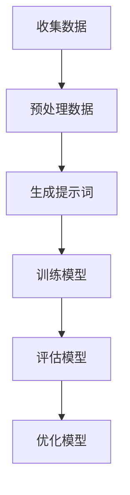
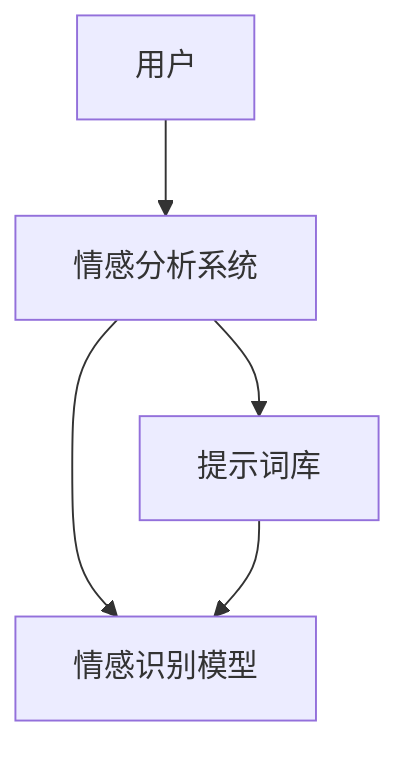
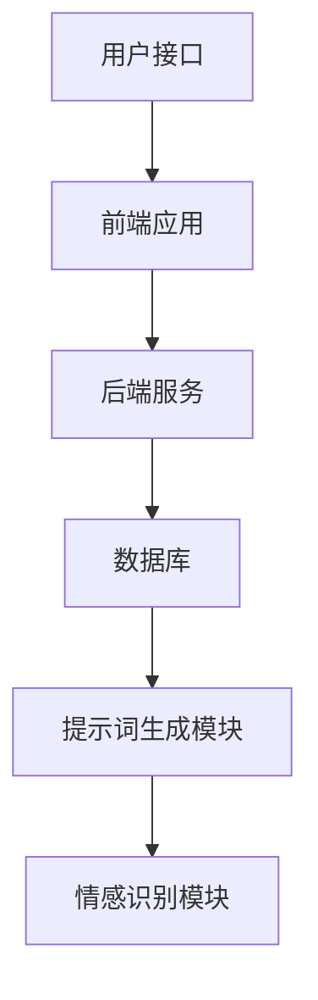
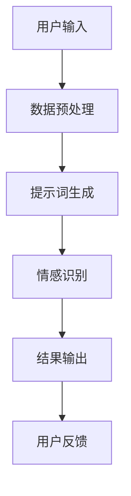

                 

# 提示词工程在情感计算中的前沿研究

关键词：情感计算、提示词工程、人工智能、自然语言处理、机器学习

摘要：
随着人工智能技术的不断发展，情感计算作为其重要应用领域之一，逐渐引起了广泛关注。而提示词工程作为情感计算的核心技术之一，其研究和应用日益深入。本文将围绕提示词工程在情感计算中的前沿研究展开，从背景介绍、核心概念与联系、算法原理讲解、系统分析与架构设计方案、项目实战以及最佳实践 tips等方面进行详细探讨。

## 背景介绍

### 1.1 问题背景

情感计算，又称情感分析，是指利用计算机技术和人工智能对人类情感进行分析和识别的过程。随着互联网和社交媒体的普及，情感计算在多个领域得到了广泛应用，如市场调研、用户行为分析、智能客服等。然而，情感计算面临着诸多挑战，如情感表达的多样性和准确性等。在此背景下，提示词工程应运而生，成为了解决情感计算难题的关键技术。

### 1.2 问题描述

提示词工程在情感计算中的挑战主要包括：

1. 数据质量和多样性：情感计算依赖于大量的情感数据，然而情感数据的质量和多样性直接影响着模型的准确性。
2. 情感表达的复杂性：情感表达形式多样，有时甚至存在双重含义，使得模型难以准确识别。
3. 模型的可解释性：用户对模型的信任度与其可解释性密切相关，如何提高模型的可解释性是提示词工程亟待解决的问题。

### 1.3 问题解决

提示词工程通过以下方法解决情感计算中的挑战：

1. 数据预处理：对情感数据进行清洗、去噪和标注，提高数据质量。
2. 提示词生成：设计合适的提示词，以帮助模型更好地识别情感。
3. 模型训练与优化：通过深度学习等技术，训练出高精度的情感识别模型。

### 1.4 边界与外延

提示词工程不仅应用于情感计算，还广泛应用于自然语言处理、信息检索、推荐系统等领域。同时，随着人工智能技术的不断发展，情感计算的边界也在不断扩展，如情感识别、情感生成、情感增强现实等。

## 核心概念与联系

### 2.1 核心概念

#### 2.1.1 情感计算

情感计算是指利用计算机技术和人工智能对人类情感进行分析和识别的过程。其核心任务是理解用户的情感状态，以便为用户提供更好的服务。

#### 2.1.2 提示词工程

提示词工程是指设计和创建用于情感计算中的提示词的过程。提示词是情感计算中的关键要素，其质量直接影响着情感识别的准确性。

### 2.2 概念属性特征对比表格

| 概念       | 定义                                                         | 特点                                                       |
| ---------- | ------------------------------------------------------------ | ---------------------------------------------------------- |
| 情感计算   | 利用计算机技术和人工智能对人类情感进行分析和识别的过程       | 旨在模拟人类情感体验，提高用户体验                           |
| 提示词工程 | 设计和创建用于情感计算中的提示词的过程                       | 需要考虑情感表达的多样性和准确性，提高模型识别效果           |

### 2.3 ER实体关系图架构

```mermaid
erDiagram
  A[提示词] {
    >> B[情感计算模型]
    >> C[数据集]
  }
  B {
    >> D[训练过程]
  }
  C {
    >> D
  }
```

## 算法原理讲解

### 3.1 提示词工程算法

#### 3.1.1 算法流程



#### 3.1.2 算法原理

1. **数据收集与预处理**：收集大量情感数据，并对数据进行清洗、去噪和标注，以提高数据质量。
2. **生成提示词**：设计合适的提示词，以帮助模型更好地识别情感。提示词的生成方法包括基于规则的方法和基于机器学习的方法。
3. **模型训练与优化**：使用训练数据对情感识别模型进行训练，并通过优化算法提高模型的准确性和鲁棒性。

### 3.2 数学模型和公式

$$
H = \sigma(W_1 \cdot X + b_1)
$$

- \(H\): 隐藏层激活函数
- \(\sigma\): 激活函数
- \(W_1\): 权重矩阵
- \(X\): 输入数据
- \(b_1\): 偏置

#### 3.2.1 算法原理讲解

1. **数据收集与预处理**：数据收集是情感计算的基础，主要包括网络爬虫、用户反馈、公开数据集等。数据预处理主要包括数据清洗、去噪、归一化和特征提取等步骤。

2. **生成提示词**：提示词的生成方法有多种，如基于规则的方法（如命名实体识别、关键词提取等）和基于机器学习的方法（如深度学习、神经网络等）。其中，基于机器学习的方法更适用于复杂情感的识别。

3. **模型训练与优化**：训练模型的过程包括数据输入、模型参数调整、损失函数计算和优化算法选择等。常用的优化算法包括随机梯度下降（SGD）、Adam优化器等。通过不断调整模型参数，使模型在训练数据上达到最佳性能。

4. **评估模型**：评估模型的方法包括准确率、召回率、F1值等指标。评估模型的目的是确保模型在测试数据上的表现良好。

5. **优化模型**：根据评估结果，对模型进行优化，以提高模型在测试数据上的表现。优化的方法包括超参数调整、模型结构调整等。

## 系统分析与架构设计方案

### 4.1 问题场景介绍

情感分析系统广泛应用于多个领域，如市场调研、用户行为分析、智能客服等。以智能客服为例，情感分析系统可以帮助客服人员更好地了解用户需求，提高服务质量。

### 4.2 系统功能设计

#### 4.2.1 领域模型



#### 4.2.2 系统架构设计



#### 4.2.3 系统接口设计和系统交互



## 项目实战

### 5.1 环境安装

环境安装是进行提示词工程实践的第一步。以下是一个简单的安装步骤：

1. 安装Python环境（如Python 3.8及以上版本）。
2. 安装必要的库（如NumPy、Pandas、Scikit-learn等）。
3. 安装深度学习框架（如TensorFlow、PyTorch等）。

### 5.2 系统核心实现源代码

以下是系统核心实现的一些源代码示例：

```python
import numpy as np
import pandas as pd
from sklearn.feature_extraction.text import TfidfVectorizer
from sklearn.model_selection import train_test_split
from sklearn.naive_bayes import MultinomialNB

# 数据预处理
def preprocess_data(data):
    # 清洗数据、去噪、归一化等
    return processed_data

# 提示词生成
def generate_keywords(texts):
    # 使用TF-IDF方法生成提示词
    return keywords

# 模型训练
def train_model(X_train, y_train):
    # 使用朴素贝叶斯模型进行训练
    model = MultinomialNB()
    model.fit(X_train, y_train)
    return model

# 模型评估
def evaluate_model(model, X_test, y_test):
    # 评估模型性能
    return accuracy

# 实际应用
data = preprocess_data(data)
X_train, X_test, y_train, y_test = train_test_split(data['text'], data['label'], test_size=0.2)
model = train_model(X_train, y_train)
accuracy = evaluate_model(model, X_test, y_test)
```

### 5.3 代码应用解读与分析

1. **数据预处理**：对原始数据进行清洗、去噪、归一化等处理，以提高数据质量。
2. **提示词生成**：使用TF-IDF方法生成提示词，以帮助模型更好地识别情感。
3. **模型训练**：使用朴素贝叶斯模型对训练数据进行训练。
4. **模型评估**：使用测试数据对模型进行评估，计算准确率等指标。
5. **实际应用**：将模型应用于实际场景，如智能客服系统。

### 5.4 实际案例分析和详细讲解剖析

#### 案例背景

假设我们有一个智能客服系统，用户可以与客服机器人进行对话。我们的目标是通过对用户的对话内容进行分析，识别用户的情感状态，从而为用户提供更好的服务。

#### 实现步骤

1. **数据收集**：收集用户与客服机器人的对话数据。
2. **数据预处理**：对对话数据进行清洗、去噪、归一化等处理。
3. **提示词生成**：使用TF-IDF方法生成提示词，以帮助模型更好地识别情感。
4. **模型训练**：使用训练数据对情感识别模型进行训练。
5. **模型评估**：使用测试数据对模型进行评估。
6. **应用模型**：将模型应用于实际场景，如智能客服系统。

#### 结果分析

通过以上步骤，我们可以实现一个基本的智能客服系统。在实际应用中，我们可以根据用户的情感状态，为用户提供个性化的服务，如推荐合适的解决方案、调整沟通方式等。

### 5.5 项目小结

本项目通过提示词工程实现了情感计算系统的开发，主要收获如下：

1. **掌握了提示词工程的基本方法**：包括数据预处理、提示词生成、模型训练和评估等。
2. **了解了情感计算的应用场景**：如智能客服、市场调研等。
3. **提升了编程能力**：通过实际项目实践，提升了Python编程能力和机器学习应用能力。

## 最佳实践 tips

1. **数据质量**：情感计算的关键在于数据质量，因此需要花费大量精力对数据进行清洗、去噪和标注。
2. **模型可解释性**：提高模型的可解释性，有助于用户对模型的信任度，从而更好地应用于实际场景。
3. **超参数调整**：通过调整超参数，可以提高模型的性能和鲁棒性。

## 小结

本文从背景介绍、核心概念与联系、算法原理讲解、系统分析与架构设计方案、项目实战以及最佳实践 tips等方面，详细探讨了提示词工程在情感计算中的前沿研究。通过本文的阐述，相信读者对提示词工程在情感计算中的应用有了更深入的了解。

## 注意事项

1. **数据隐私**：在进行情感计算时，需严格遵守数据隐私政策，确保用户数据的安全。
2. **模型公平性**：在构建模型时，要关注模型的公平性，避免因模型偏见而导致不公平的结果。

## 拓展阅读

1. **相关书籍**：
   - 《情感计算：理论与实践》
   - 《机器学习与情感计算》
2. **相关论文**：
   - “Sentiment Analysis Using Machine Learning Techniques”
   - “A Survey on Emotional Computing and Its Applications”

作者：AI天才研究院/AI Genius Institute & 禅与计算机程序设计艺术 /Zen And The Art of Computer Programming

-----------------------------------------------------------------

