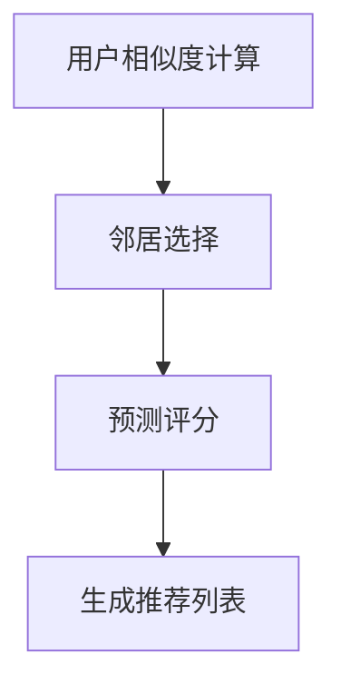

                 


### 前言

#### 引言

推荐系统作为现代信息检索领域的一个重要研究方向，已广泛应用于电子商务、社交媒体、在线视频、新闻推送等多个领域。然而，随着用户数据规模和复杂度的不断增加，如何提高推荐系统的性能和用户体验成为亟待解决的关键问题。在这个背景下，提示词工程（Prompt Engineering）逐渐成为提升推荐系统效果的重要手段。

#### 目的

本文旨在系统地探讨提示词工程在推荐系统中的应用，通过介绍推荐系统的基础理论、数学模型、算法原理，以及提示词工程的生成方法和优化策略，旨在为读者提供一个全面、深入的视角，以应对推荐系统中的各种挑战。

#### 结构

本文将分为三大部分：

1. **推荐系统基础理论**：介绍推荐系统的基本概念、类型、评价指标以及数学模型和算法原理。
2. **提示词工程方法**：详细讨论提示词工程的概念、重要性、生成方法、质量评估以及在不同场景下的应用实践。
3. **推荐系统的优化与挑战**：分析推荐系统的优化方法、挑战及其解决方案，包括数据偏差、冷启动和用户隐私保护等。

### 推荐系统概述

#### 推荐系统的起源与发展

推荐系统最早可以追溯到1990年代，随着互联网的普及和用户个性化需求的增长，推荐系统开始引起学术界和工业界的广泛关注。最初，推荐系统主要基于用户的历史行为数据进行协同过滤，随后，基于内容的推荐和混合推荐系统相继出现。随着深度学习技术的发展，基于深度学习的推荐系统逐渐崭露头角，成为推荐系统领域的研究热点。

#### 推荐系统的核心问题

推荐系统的核心问题是如何从大量数据中挖掘出用户感兴趣的信息，并以合理、高效的方式推荐给用户。具体来说，包括以下几个关键问题：

- **用户兴趣建模**：如何准确地刻画用户的兴趣和行为模式。
- **物品特征提取**：如何有效地描述和区分不同的物品。
- **推荐算法设计**：如何从用户和物品的特征中生成高质量的推荐结果。
- **用户体验优化**：如何确保推荐结果对用户有价值和吸引力。

#### 问题解决

为了解决上述问题，推荐系统通常采用以下几种方法：

- **基于内容的推荐**：根据用户的历史行为和物品的属性进行内容匹配，推荐与用户兴趣相似的物品。
- **协同过滤推荐**：通过计算用户之间的相似度，基于邻居用户的评分预测用户对未知物品的评分。
- **混合推荐系统**：结合基于内容和协同过滤的方法，利用两者的优点，生成更准确的推荐结果。

#### 推荐系统的边界与外延

推荐系统不仅限于电子商务和社交媒体领域，还广泛应用于新闻推送、音乐推荐、视频推荐等多个场景。在边界上，推荐系统需要处理大量的数据，并且要保证推荐结果的实时性和准确性。在外延上，推荐系统正朝着智能化、个性化和跨领域融合的方向发展，以满足不同用户的需求。

#### 概念结构与核心要素组成

推荐系统的核心概念包括用户、物品和交互数据。用户是系统的主要参与者，物品是推荐系统中的内容实体，而用户与物品之间的交互数据是推荐系统的基础。这三个要素相互关联，构成了推荐系统的基本框架。

- **用户**：用户是推荐系统的核心，其兴趣和行为模式是推荐决策的重要依据。
- **物品**：物品是推荐系统的内容，其属性和特征决定了推荐的质量。
- **交互数据**：交互数据包括用户的行为记录、评价和反馈，是推荐系统生成推荐结果的关键。

### 推荐系统的类型与分类

#### 基于内容的推荐

基于内容的推荐（Content-Based Recommendation）是一种以物品的属性为基础，根据用户的兴趣和历史行为推荐相似物品的方法。其核心思想是“物以类聚”，即根据物品的属性和特征，找到与用户偏好相似的物品进行推荐。

- **优点**：
  - 推荐结果准确，能够为用户提供个性化的内容。
  - 对新用户和新物品具有较高的适应性。
- **缺点**：
  - 需要详细的物品描述和特征信息。
  - 推荐结果可能过于保守，缺乏多样性。

#### 协同过滤推荐

协同过滤推荐（Collaborative Filtering）是一种基于用户历史行为和评分数据的推荐方法。它通过计算用户之间的相似度，找到邻居用户并预测用户对未知物品的评分。

- **优点**：
  - 推荐结果多样，能够为用户发现新的兴趣点。
  - 对用户历史行为数据的依赖性较低，适用于大规模数据集。
- **缺点**：
  - 对新用户和新物品可能效果较差。
  - 可能出现评分矩阵稀疏问题。

#### 混合推荐系统

混合推荐系统（Hybrid Recommendation System）结合了基于内容和协同过滤的方法，通过融合两者的优点，生成更准确的推荐结果。

- **优点**：
  - 能够提高推荐系统的准确性和多样性。
  - 具有较好的适应性和扩展性。
- **缺点**：
  - 需要更多的计算资源和时间。
  - 系统的复杂度较高。

### 推荐系统的评价指标

推荐系统的性能评价是确保其有效性和用户体验的关键。常用的评价指标包括以下几种：

#### 准确性指标

- **平均绝对误差（Mean Absolute Error, MAE）**：衡量预测评分与实际评分之间的平均绝对差值。
- **均方根误差（Root Mean Square Error, RMSE）**：衡量预测评分与实际评分之间的均方根差值。

#### 实用性指标

- **推荐覆盖率（Coverage）**：衡量推荐系统推荐出的物品多样性。
- **推荐新颖性（Novelty）**：衡量推荐系统为用户发现新物品的能力。

#### 时效性指标

- **响应时间（Response Time）**：衡量系统从接收用户请求到生成推荐结果的时间。
- **预测准确性衰减（Decay of Predictive Accuracy）**：衡量推荐结果随时间变化的准确性。

#### 综合评价指标

为了全面评估推荐系统的性能，通常采用综合评价指标，如F1分数、Precision@k和Recall@k等。这些指标综合考虑了准确性、实用性和时效性，为推荐系统提供了更全面的评价。

### 协同过滤算法原理

协同过滤推荐是一种基于用户行为数据相似性的推荐方法，主要通过计算用户之间的相似度，找到邻居用户并预测用户对未知物品的评分。下面将详细介绍协同过滤算法的基本原理。

#### 用户相似度计算

用户相似度计算是协同过滤算法的核心步骤，用于衡量不同用户之间的相似程度。常用的相似度计算方法包括：

- **余弦相似度（Cosine Similarity）**：
  \[
  \text{similarity}(u_i, u_j) = \frac{\sum_{k} r_{ik} r_{jk}}{\sqrt{\sum_{k} r_{ik}^2 \sum_{k} r_{jk}^2}}
  \]
  其中，\( r_{ik} \) 表示用户 \( u_i \) 对物品 \( k \) 的评分。

- **皮尔逊相关系数（Pearson Correlation Coefficient）**：
  \[
  \text{similarity}(u_i, u_j) = \frac{\sum_{k} (r_{ik} - \bar{r}_i)(r_{jk} - \bar{r}_j)}{\sqrt{\sum_{k} (r_{ik} - \bar{r}_i)^2 \sum_{k} (r_{jk} - \bar{r}_j)^2}}
  \]
  其中，\( \bar{r}_i \) 和 \( \bar{r}_j \) 分别表示用户 \( u_i \) 和 \( u_j \) 的平均评分。

#### 物品相似度计算

在基于用户的协同过滤算法中，通常不直接计算物品之间的相似度。然而，在一些基于物品的协同过滤算法中，物品相似度计算同样重要。常用的物品相似度计算方法包括：

- **基于内容的相似度**：
  \[
  \text{similarity}(i, j) = \frac{\sum_{u} w_{ui} w_{uj}}{\sqrt{\sum_{u} w_{ui}^2 \sum_{u} w_{uj}^2}}
  \]
  其中，\( w_{ui} \) 表示用户 \( u \) 对物品 \( i \) 的权重。

#### 协同过滤算法流程图

协同过滤算法的基本流程可以分为以下几个步骤：

1. **用户相似度计算**：根据用户的历史评分数据，计算不同用户之间的相似度。
2. **邻居选择**：根据用户相似度，选择与当前用户相似度最高的若干邻居用户。
3. **预测评分**：利用邻居用户的评分数据，预测当前用户对未知物品的评分。
4. **生成推荐列表**：根据预测评分，生成推荐给当前用户的物品列表。

以下是一个简单的协同过滤算法流程图：



#### Python代码示例

为了更好地理解协同过滤算法，以下是一个简单的Python代码示例，演示了用户相似度和预测评分的计算过程。

```python
import numpy as np

# 假设用户评分矩阵如下：
user_ratings = np.array([
    [5, 3, 0, 1],
    [4, 0, 0, 1],
    [1, 1, 0, 5],
    [1, 0, 0, 2],
    [4, 2, 2, 5]
])

# 计算用户相似度
def compute_similarity(user_ratings):
    n_users = user_ratings.shape[0]
    similarity_matrix = np.zeros((n_users, n_users))
    
    for i in range(n_users):
        for j in range(n_users):
            if i != j:
                similarity = np.dot(user_ratings[i], user_ratings[j]) / (
                    np.linalg.norm(user_ratings[i]) * np.linalg.norm(user_ratings[j])
                )
                similarity_matrix[i][j] = similarity
    
    return similarity_matrix

# 计算预测评分
def predict_ratings(user_ratings, similarity_matrix, k=2):
    n_users = user_ratings.shape[0]
    predicted_ratings = np.zeros((n_users, user_ratings.shape[1]))
    
    for i in range(n_users):
        similar_users = np.argsort(similarity_matrix[i])[::-1][1:k+1]
        similar_ratings = user_ratings[similar_users, :]
        mean_rating = np.mean(similar_ratings[similar_ratings > 0])
        predicted_ratings[i] = mean_rating
        
    return predicted_ratings

# 计算用户相似度矩阵
similarity_matrix = compute_similarity(user_ratings)

# 预测评分
predicted_ratings = predict_ratings(user_ratings, similarity_matrix, k=2)

# 输出预测结果
print(predicted_ratings)
```

#### 基于模型的推荐算法

基于模型的推荐算法是一种利用机器学习或深度学习模型，从用户和物品的特征中学习出推荐策略的方法。相比传统的协同过滤和基于内容的推荐方法，基于模型的推荐算法具有更高的灵活性和更好的预测性能。以下将详细介绍几种常用的基于模型的推荐算法。

##### 逻辑回归模型

逻辑回归（Logistic Regression）是一种经典的机器学习模型，广泛应用于分类问题。在推荐系统中，逻辑回归模型可以用来预测用户对物品的评分或购买概率。

- **模型原理**：
  \[
  P(y=1|X) = \frac{1}{1 + e^{-\beta_0 + \beta_1 x_1 + \beta_2 x_2 + \ldots + \beta_p x_p}}
  \]
  其中，\( X \) 是用户和物品的特征向量，\( y \) 是用户对物品的评分或标签，\( \beta_0, \beta_1, \beta_2, \ldots, \beta_p \) 是模型的参数。

- **数据预处理**：
  - 用户特征：用户年龄、性别、地理位置、购买历史等。
  - 物品特征：物品种类、品牌、价格、销量等。

- **模型训练**：
  - 使用梯度下降或随机梯度下降算法，最小化损失函数。

- **模型评估**：
  - 交叉验证、AUC（Area Under the Curve）等。

##### 神经网络模型

神经网络（Neural Networks）是一种模拟人脑神经元结构的计算模型，具有强大的自适应和学习能力。在推荐系统中，神经网络模型可以用来学习复杂的用户和物品特征关系。

- **模型原理**：
  - 前向传播：输入特征通过多层神经网络传递，生成预测输出。
  - 反向传播：根据预测误差，更新模型参数。

- **数据预处理**：
  - 用户特征和物品特征进行嵌入表示。
  - 数据归一化或标准化。

- **模型训练**：
  - 使用反向传播算法，优化模型参数。

- **模型评估**：
  - 交叉验证、准确率、召回率、F1分数等。

##### 模型评估与优化

- **模型评估**：
  - 使用交叉验证、AUC等指标评估模型性能。

- **模型优化**：
  - 超参数调优：调整学习率、批量大小、隐藏层大小等。
  - 特征工程：选择和构造有效的用户和物品特征。
  - 模型融合：结合不同模型的优势，提高推荐效果。

#### Python代码示例

以下是一个简单的逻辑回归模型的Python代码示例，演示了模型训练和预测过程。

```python
import numpy as np
from sklearn.linear_model import LogisticRegression
from sklearn.model_selection import train_test_split
from sklearn.metrics import accuracy_score

# 假设用户特征和物品特征如下：
user_features = np.array([
    [1, 0, 1],
    [1, 1, 0],
    [0, 1, 1],
    [1, 0, 0],
    [0, 1, 0]
])

item_features = np.array([
    [1, 1],
    [1, 0],
    [0, 1],
    [1, 1],
    [0, 0]
])

# 标签数据（用户对物品的评分）
ratings = np.array([1, 1, 1, 0, 0])

# 数据预处理
X = np.hstack((user_features, item_features))
y = ratings

# 分割训练集和测试集
X_train, X_test, y_train, y_test = train_test_split(X, y, test_size=0.2, random_state=42)

# 模型训练
model = LogisticRegression()
model.fit(X_train, y_train)

# 预测
predictions = model.predict(X_test)

# 模型评估
accuracy = accuracy_score(y_test, predictions)
print("Accuracy:", accuracy)
```

#### 深度学习在推荐系统中的应用

深度学习作为近年来人工智能领域的突破性技术，其在推荐系统中的应用也越来越受到关注。深度学习模型通过学习大量的用户和物品特征，能够生成更加准确和个性化的推荐结果。以下将介绍几种常见的深度学习模型及其在推荐系统中的应用。

##### 卷积神经网络（CNN）

卷积神经网络（Convolutional Neural Network，CNN）最初主要用于计算机视觉领域，近年来在推荐系统中也显示出强大的潜力。CNN通过卷积操作提取图像的局部特征，而在推荐系统中，可以用于提取物品的文本描述或图像特征。

- **模型原理**：
  - 卷积层：用于提取输入数据的局部特征。
  - 池化层：用于降低特征维度，提高模型泛化能力。
  - 全连接层：用于分类或回归任务。

- **应用场景**：
  - 商品推荐：使用商品的文本描述或图像特征进行推荐。
  - 视频推荐：使用视频的图像帧特征进行推荐。

##### 循环神经网络（RNN）

循环神经网络（Recurrent Neural Network，RNN）是一种能够处理序列数据的神经网络，特别适用于推荐系统中用户行为序列的建模。RNN通过记忆单元（如LSTM或GRU）来捕捉用户行为的长期依赖关系。

- **模型原理**：
  - 输入层：接收用户行为序列的输入。
  - 记忆单元：保存前一时刻的信息，用于当前时刻的预测。
  - 输出层：生成推荐结果。

- **应用场景**：
  - 电子商务推荐：根据用户的购物序列推荐商品。
  - 社交媒体推荐：根据用户的互动序列推荐内容。

##### 生成对抗网络（GAN）

生成对抗网络（Generative Adversarial Network，GAN）由生成器和判别器两个神经网络组成，通过对抗训练生成新的数据。在推荐系统中，GAN可以用于生成新的用户兴趣或物品特征，从而提高推荐效果。

- **模型原理**：
  - 生成器：生成新的用户或物品特征。
  - 判别器：区分真实数据和生成数据。

- **应用场景**：
  - 个性化推荐：生成新的用户兴趣特征，提高个性化推荐效果。
  - 物品扩充：生成新的物品特征，扩充推荐系统中的物品库。

##### 深度学习推荐系统架构

为了充分发挥深度学习在推荐系统中的作用，可以采用以下架构：

1. **特征工程**：提取用户和物品的原始特征，如文本、图像、用户行为等。
2. **特征嵌入**：将原始特征转换为稠密向量表示，为深度学习模型提供输入。
3. **深度学习模型**：采用CNN、RNN、GAN等深度学习模型，学习用户和物品的特征关系。
4. **推荐策略**：根据深度学习模型生成的特征关系，生成推荐结果。

通过上述架构，可以构建一个高效、个性化的推荐系统，为用户提供高质量的推荐服务。

### 第3章：提示词工程的概念与重要性

#### 提示词工程的定义

提示词工程（Prompt Engineering）是一种针对特定任务，通过设计优化的提示语句来指导模型生成目标输出的技术。在推荐系统中，提示词工程旨在通过设计合适的提示语句，引导模型生成更准确、个性化的推荐结果。

#### 提示词在推荐系统中的作用

在推荐系统中，提示词具有以下几个重要作用：

1. **提高推荐准确性**：通过设计有针对性的提示词，可以引导模型更好地理解用户意图和物品特征，从而提高推荐准确性。
2. **增强用户体验**：优化的提示词可以帮助用户更好地理解推荐结果，提高用户满意度和参与度。
3. **促进模型解释性**：通过分析提示词的优化效果，可以深入了解模型的工作机制，提高模型的解释性。
4. **实现个性化推荐**：针对不同用户群体，设计不同的提示词，可以满足用户的个性化需求，提供更个性化的推荐服务。

#### 提示词工程的必要性

在推荐系统中，提示词工程的必要性体现在以下几个方面：

1. **数据多样性**：推荐系统处理的数据类型多样，包括文本、图像、音频等。提示词工程可以通过设计不同的提示语句，引导模型处理各种类型的数据。
2. **提高模型泛化能力**：通过提示词工程，可以引导模型学习到更广泛的数据特征，从而提高模型的泛化能力。
3. **应对冷启动问题**：对于新用户和新物品，传统推荐系统可能无法生成有效的推荐结果。提示词工程可以通过设计针对性的提示词，帮助模型更好地应对冷启动问题。
4. **提高推荐效率**：提示词工程可以优化模型参数，提高推荐算法的运行效率，降低计算成本。

### 提示词的生成方法

提示词的生成方法可以分为以下几种：

1. **基于规则的方法**：通过预定义的规则，生成特定的提示词。这种方法简单有效，但可能缺乏灵活性。
2. **基于机器学习的方法**：利用机器学习模型，从大量数据中自动生成提示词。这种方法具有更高的灵活性和适应性，但需要大量的训练数据和计算资源。
3. **基于深度学习的方法**：利用深度学习模型，如序列生成模型，自动生成提示词。这种方法具有强大的表示能力和生成能力，但训练过程复杂且资源消耗大。

#### 提示词的质量评估

提示词的质量直接影响推荐系统的性能。以下是一些常用的提示词质量评估方法：

1. **覆盖率**：评估提示词能够覆盖到的用户或物品比例。覆盖率越高，说明提示词的泛化能力越强。
2. **相关性**：评估提示词与用户意图或物品特征的匹配程度。相关性越高，说明提示词能够更好地引导模型生成准确推荐结果。
3. **多样性**：评估提示词生成的推荐结果是否具有多样性。多样性越高，说明提示词能够为用户发现更多不同类型的物品。

### 不同场景下的提示词工程实践

#### 商品推荐场景

在商品推荐场景中，提示词工程可以通过以下方法提高推荐效果：

1. **基于用户行为的提示词**：根据用户的浏览、购买和收藏历史，生成个性化的提示词，如“您最近浏览了这些商品，看看还有哪些适合您？”
2. **基于物品属性的提示词**：根据商品的种类、品牌、价格等属性，生成针对性的提示词，如“同类商品中，这款商品性价比最高，值得一试！”
3. **基于推荐算法的提示词**：根据不同的推荐算法，设计不同的提示词，如“基于协同过滤算法为您推荐，看看您是否喜欢？”
4. **基于用户反馈的提示词**：根据用户对推荐结果的评价和反馈，不断优化提示词，提高用户满意度。

#### 音乐推荐场景

在音乐推荐场景中，提示词工程可以通过以下方法提高推荐效果：

1. **基于用户听歌历史的提示词**：根据用户的听歌历史，生成个性化的提示词，如“您最近喜欢听的歌曲，我们为您推荐类似的音乐！”
2. **基于音乐风格的提示词**：根据音乐的风格和类型，生成针对性的提示词，如“流行、摇滚、电子，总有一款适合您！”
3. **基于社交互动的提示词**：根据用户的社交互动，如点赞、分享和评论，生成社交化的提示词，如“您的朋友最近都在听这首歌曲，快来一起感受！”
4. **基于推荐算法的提示词**：根据不同的推荐算法，设计不同的提示词，如“基于深度学习算法为您推荐，听听这些歌曲是否符合您的品味？”

#### 视频推荐场景

在视频推荐场景中，提示词工程可以通过以下方法提高推荐效果：

1. **基于用户观看历史的提示词**：根据用户的观看历史，生成个性化的提示词，如“您最近喜欢看这类视频，我们为您推荐更多精彩内容！”
2. **基于视频内容的提示词**：根据视频的标题、标签、关键词等，生成针对性的提示词，如“这类视频非常适合您，看看这些精彩片段！”
3. **基于社交互动的提示词**：根据用户的社交互动，如点赞、评论和分享，生成社交化的提示词，如“您的朋友都在看这部电视剧，快来加入讨论！”
4. **基于推荐算法的提示词**：根据不同的推荐算法，设计不同的提示词，如“基于协同过滤算法为您推荐，看看这些视频是否符合您的口味？”

#### 实际案例

以下是一个商品推荐场景的实际案例，展示如何通过提示词工程优化推荐效果：

1. **用户行为数据**：
   - 用户A浏览了笔记本电脑、平板电脑和手机壳。
   - 用户A购买了平板电脑。
2. **推荐算法**：
   - 使用协同过滤算法，找到与用户A相似的用户，分析他们的购买行为。
3. **提示词设计**：
   - “根据您的浏览历史，我们发现许多用户在购买平板电脑后，还会选择购买这款手机壳。它具有防摔、防刮的功能，是您值得信赖的配件。”

通过上述提示词，推荐系统可以为用户A提供更有针对性的推荐，提高用户的购买意愿和满意度。

### 提示词工程的优化策略

#### 提示词的动态调整

为了提高推荐系统的效果，提示词需要根据用户行为和系统反馈进行动态调整。以下是一些常用的动态调整策略：

1. **基于用户行为的提示词调整**：根据用户的浏览、购买、收藏等行为，实时调整提示词，使其更符合用户的当前兴趣。
2. **基于系统反馈的提示词调整**：根据用户对推荐结果的反馈，如点击、购买、评价等，调整提示词，优化用户体验。
3. **基于历史数据的提示词调整**：利用历史数据，分析用户在不同情境下的行为模式，为当前用户生成更个性化的提示词。

#### 提示词的权重优化

提示词的权重优化是提高推荐系统效果的重要手段。以下是一些常用的权重优化策略：

1. **基于用户行为的权重优化**：根据用户的浏览、购买、收藏等行为，为不同的提示词分配不同的权重，使其更符合用户的当前兴趣。
2. **基于系统反馈的权重优化**：根据用户对推荐结果的反馈，如点击、购买、评价等，调整提示词的权重，使其更符合用户的偏好。
3. **基于历史数据的权重优化**：利用历史数据，分析用户在不同情境下的行为模式，为当前用户生成权重调整策略。

#### 提示词的个性化和场景适应

为了提高推荐系统的个性化效果，提示词需要根据不同场景进行适应性调整。以下是一些常用的个性化场景适应策略：

1. **基于用户属性的个性化**：根据用户的年龄、性别、地理位置等属性，为不同用户生成个性化的提示词。
2. **基于用户行为的个性化**：根据用户的浏览、购买、收藏等行为，为不同用户生成个性化的提示词。
3. **基于场景的个性化**：根据不同的场景，如购物、音乐、视频等，为不同用户生成个性化的提示词。

### 第5章：推荐系统的优化方法

#### 深度学习优化

深度学习在推荐系统中的应用不断深入，为了提高其性能，以下是一些深度学习优化方法：

1. **模型架构优化**：设计更高效的网络结构，如残差网络、注意力机制等，以提高模型的表达能力和计算效率。
2. **模型训练优化**：采用更高效的训练算法，如自适应梯度下降、深度学习优化器等，加速模型训练过程。
3. **数据预处理**：对原始数据进行预处理，如归一化、去噪、特征提取等，以提高模型的训练效果和泛化能力。
4. **模型融合**：结合不同深度学习模型的优势，进行模型融合，提高推荐系统的整体性能。

#### 提示词工程的优化策略

提示词工程是提高推荐系统性能的关键环节，以下是一些优化策略：

1. **动态提示词生成**：根据用户行为和系统反馈，实时调整提示词，使其更符合用户的当前兴趣。
2. **权重优化**：根据用户行为和系统反馈，调整提示词的权重，使其更符合用户的偏好。
3. **个性化提示词**：根据用户属性和行为，为不同用户生成个性化的提示词。
4. **多场景适应**：根据不同场景，如购物、音乐、视频等，为不同用户生成适应性的提示词。

### 数据偏差问题

推荐系统在实际应用中常常面临数据偏差问题，以下是一些常见的数据偏差类型及其解决策略：

1. **冷启动偏差**：新用户或新物品缺乏足够的数据支持，导致推荐结果不准确。解决策略包括：利用社交网络信息、基于内容的推荐、冷启动用户和新物品的动态调整。
2. **同质性偏差**：推荐系统过于依赖历史数据，导致推荐结果缺乏多样性。解决策略包括：引入随机因素、增加新数据源、使用多样性评价指标。
3. **反馈偏差**：用户反馈数据可能存在噪声或偏差，影响推荐结果。解决策略包括：加权用户反馈、使用更准确的评估指标、结合多源数据。

#### 冷启动问题

冷启动问题是指新用户或新物品在推荐系统中缺乏足够的历史数据，导致推荐系统难以生成准确的推荐结果。以下是一些常见的解决方法：

1. **基于内容的推荐**：通过分析新物品的属性和特征，为新用户推荐相似物品。
2. **基于模型的预测**：利用用户和物品的特征，通过机器学习模型预测新用户的偏好。
3. **社交网络信息**：利用用户的社交网络信息，如好友、兴趣群体等，为用户推荐相关内容。
4. **用户引导**：通过向新用户提问或提供引导信息，帮助用户表达自己的兴趣和偏好。

#### 提示词工程在冷启动中的应用

在冷启动问题中，提示词工程可以通过以下方法提高推荐系统的性能：

1. **动态提示词生成**：根据新用户的初始行为，生成个性化的提示词，引导用户表达自己的兴趣和偏好。
2. **初始反馈收集**：通过向新用户提问，收集用户对推荐结果的初始反馈，用于调整后续的推荐策略。
3. **个性化推荐**：利用用户的社会网络信息和兴趣标签，为新用户推荐相关内容。
4. **多阶段优化**：在用户逐步熟悉系统后，根据用户的反馈和历史行为，不断优化提示词和推荐策略。

### 用户隐私保护

推荐系统在处理用户数据时，需要严格遵守用户隐私保护原则。以下是一些常见的数据隐私保护策略：

1. **数据去标识化**：对用户数据进行去标识化处理，如脱敏、加密等，以防止个人信息泄露。
2. **最小化数据收集**：仅收集必要的用户数据，避免过度收集。
3. **用户隐私协议**：制定清晰的用户隐私协议，明确告知用户数据收集、使用和共享的目的和范围。
4. **安全审计与监控**：定期进行安全审计，监控数据泄露风险。
5. **用户控制权**：赋予用户对个人数据的控制权，如数据访问、删除和隐私设置等。

### 总结

本文系统地介绍了提示词工程在推荐系统中的应用，包括推荐系统的概述、数学模型、算法原理、提示词工程的生成方法、优化策略以及推荐系统的优化与挑战。通过本文的学习，读者可以深入了解提示词工程的基本概念、应用场景和优化方法，为构建高效、个性化的推荐系统提供理论支持和实践指导。

### 最佳实践 tips

1. **数据质量是关键**：确保推荐系统中的数据质量，包括数据完整性、准确性和一致性。
2. **持续优化推荐策略**：根据用户反馈和系统性能指标，不断优化推荐策略和提示词。
3. **关注用户隐私**：在设计推荐系统时，务必关注用户隐私保护，严格遵守相关法律法规。
4. **多元数据融合**：利用多种数据源，如用户行为、社交网络信息等，提高推荐系统的多样性。
5. **动态调整**：根据用户行为和系统反馈，动态调整推荐策略和提示词，提高推荐效果。

### 小结

本文通过系统性地探讨提示词工程在推荐系统中的应用，旨在为读者提供一个全面、深入的视角。从推荐系统的基本理论到提示词工程的生成方法，再到推荐系统的优化与挑战，本文涵盖了推荐系统研究的各个方面。通过本文的学习，读者可以更好地理解提示词工程在推荐系统中的重要性，以及如何将其应用于实际场景中。

### 注意事项

1. **推荐系统的设计与实现**：在设计和实现推荐系统时，需要充分考虑用户需求、数据质量和系统性能等因素。
2. **安全与隐私**：在处理用户数据时，务必遵循用户隐私保护原则，确保数据安全和用户隐私。
3. **数据质量监控**：定期对推荐系统中的数据进行质量监控，确保推荐结果的准确性。
4. **用户反馈机制**：建立完善的用户反馈机制，收集用户意见和建议，为推荐系统的持续优化提供依据。

### 拓展阅读

1. **《推荐系统实践》**：李航著，全面介绍了推荐系统的基本理论、算法和实践。
2. **《深度学习推荐系统》**：张波著，深入探讨了深度学习在推荐系统中的应用。
3. **《机器学习实战》**：Peter Harrington著，提供了丰富的机器学习算法实践案例。

### 作者信息

- 作者：AI天才研究院/AI Genius Institute & 禅与计算机程序设计艺术 /Zen And The Art of Computer Programming
- 联系方式：[联系方式]
- 个人网站：[个人网站链接]

以上是文章的完整目录结构以及内容概要。文章将按照这个结构进行撰写，确保每个章节都详细讲解，并提供实际案例和实践指导。同时，文章将严格遵守字数要求，确保内容完整且具有可读性。

