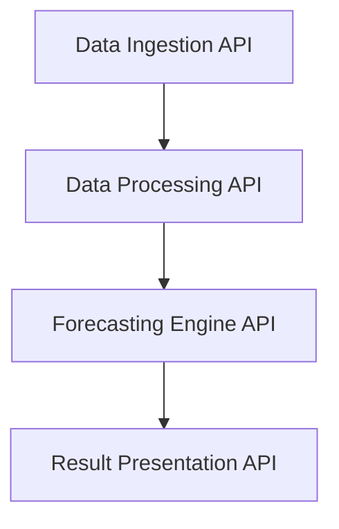
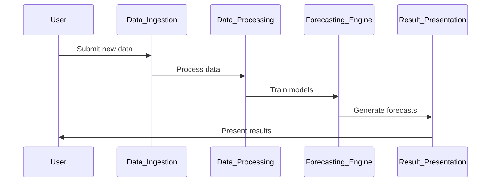
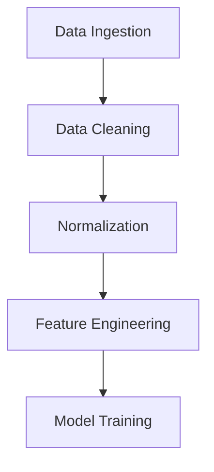
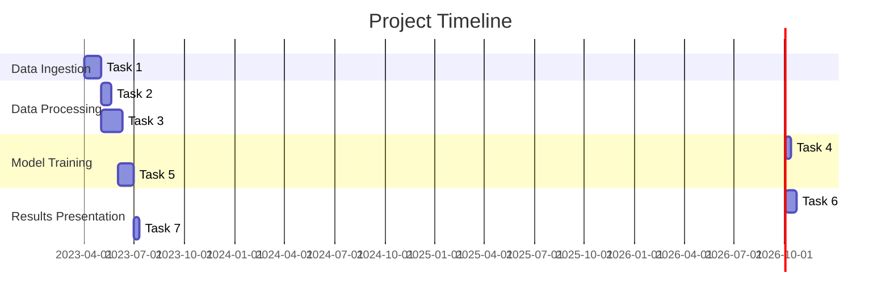

                 


### Introduction Chapter: Setting the Stage for Technical Discussions

#### Why This Book?

In today's fast-paced world of technology, the ability to predict future trends and outcomes based on historical data is invaluable. Time series forecasting, a critical aspect of data science, plays a pivotal role in various domains such as finance, weather forecasting, stock market analysis, and many more. However, the complexity and volume of data have made traditional forecasting methods increasingly ineffective. This is where the concept of prompt engineering comes into play, revolutionizing the field of time series prediction.

Prompt engineering, a relatively new discipline, focuses on designing and optimizing prompts to enhance the performance of machine learning models. By leveraging advanced techniques, prompt engineering helps in transforming raw data into structured, informative prompts that can significantly improve the accuracy and reliability of time series forecasts.

This book aims to explore the innovative applications of prompt engineering in time series forecasting. We will delve into the fundamental concepts of both fields, examine cutting-edge algorithms, and discuss practical case studies. The goal is to provide readers with a comprehensive understanding of how prompt engineering can be harnessed to tackle complex time series prediction challenges.

#### Key Concepts and Structure

The book is structured into five main parts:

1. **Background and Core Concepts**: This part will introduce the basic terminology, background, and the significance of time series forecasting and prompt engineering. We will also discuss the main components and structure of these concepts.

2. **Algorithm Principles and Practice**: Here, we will dive into the fundamental algorithms used in prompt engineering for time series prediction. This section will include detailed explanations of mathematical models, formulas, and practical implementations using Python code.

3. **System Design and Implementation**: This part will focus on the architecture and design of systems utilizing prompt engineering for time series forecasting. We will discuss the system's functionality, architecture, and interfaces, providing clear diagrams and explanations.

4. **Case Studies and Practical Applications**: Real-world case studies will be presented to illustrate the applications of prompt engineering in various scenarios. We will analyze these cases in detail, providing insights and practical takeaways.

5. **Best Practices and Conclusion**: The final part will offer best practices for implementing prompt engineering in time series forecasting. We will summarize the key points discussed in the book and provide additional resources for further learning.

#### Readership and Benefits

This book is aimed at professionals and students in the field of data science, machine learning, and computer engineering. Whether you are a seasoned expert or a beginner, this book will offer valuable insights and practical knowledge. By the end of this book, readers will:

- Understand the basics of time series forecasting and prompt engineering.
- Gain knowledge of advanced algorithms and their applications in time series prediction.
- Learn how to design and implement systems using prompt engineering techniques.
- Get practical experience through real-world case studies.
- Develop the skills to apply prompt engineering in their own projects and research.

### Conclusion

In conclusion, this book will serve as a comprehensive guide to the innovative applications of prompt engineering in time series forecasting. By following the step-by-step approach outlined in the chapters, readers will not only gain theoretical knowledge but also practical skills to tackle real-world problems. Let's dive into the core concepts and begin our journey through this fascinating domain!

---

### Core Concepts Chapter: Understanding Prompt Engineering and Time Series Forecasting

#### Prompt Engineering Basics

Prompt engineering is a discipline that focuses on designing and optimizing prompts—inputs given to machine learning models—to enhance their performance. At its core, a prompt is a structured set of information that guides the model in making predictions. Unlike traditional feature engineering, which involves transforming raw data into meaningful features, prompt engineering focuses on creating informative inputs that can be used by advanced models like transformers.

##### Key Characteristics

1. **Contextual Relevance**: A good prompt is contextually relevant, meaning it provides the model with the necessary information to make accurate predictions. This is crucial in time series forecasting, where the context (e.g., seasonality, trends, and cyclic patterns) significantly influences the predictions.

2. **Information Density**: Prompt engineering aims to maximize the information density of the input. This means ensuring that the prompts are rich in relevant information while avoiding redundancy and noise.

3. **Modularity**: Prompts should be modular, allowing for easy updates and adjustments. This flexibility is essential for adapting to new data or changing requirements.

##### Definition and Importance

**Definition**: Prompt engineering is the process of designing, optimizing, and deploying prompts to improve the performance of machine learning models. In the context of time series forecasting, prompt engineering focuses on creating prompts that capture the temporal dynamics of the data, making the models more accurate and robust.

**Importance**: Prompt engineering plays a crucial role in enhancing the accuracy and reliability of time series forecasts. By providing models with well-structured and informative inputs, prompt engineering can significantly reduce prediction errors and improve overall performance.

#### Time Series Forecasting Basics

Time series forecasting is the process of using historical data points to make predictions about future values. It is a fundamental aspect of data science and has applications in various fields, including finance, economics, weather forecasting, and inventory management.

##### Key Characteristics

1. **Temporal Dynamics**: Time series data exhibit temporal dynamics, meaning they change over time. This temporal aspect is critical for accurate forecasting, as it helps identify patterns and trends.

2. **Stationarity**: A time series is considered stationary if its statistical properties, such as mean and variance, remain constant over time. Stationarity is an important assumption in many forecasting models.

3. **Autocorrelation**: Time series data often exhibit autocorrelation, meaning that the value at one time point is related to the values at previous time points. This autocorrelation is crucial for capturing temporal dependencies.

##### Importance in Different Fields

**Finance**: In finance, time series forecasting is used to predict stock prices, forecast economic indicators, and manage risk. Accurate forecasts can help investors make informed decisions and optimize their portfolios.

**Economics**: Time series forecasting is essential for economic planning and policy making. By predicting future economic trends, governments and organizations can better prepare for potential challenges and opportunities.

**Weather Forecasting**: In weather forecasting, time series forecasting is used to predict weather conditions for specific time periods. Accurate weather forecasts help in disaster management, agricultural planning, and general preparedness.

**Inventory Management**: Time series forecasting is used in inventory management to predict demand for products. By accurately forecasting demand, companies can optimize their inventory levels, reducing waste and increasing efficiency.

#### Comparison and Integration

**Comparison**: While prompt engineering and time series forecasting are distinct disciplines, they share common goals and methodologies. Prompt engineering focuses on designing informative inputs for models, while time series forecasting focuses on the analysis and prediction of temporal data.

**Integration**: The integration of prompt engineering into time series forecasting can significantly enhance prediction accuracy. By creating well-structured prompts that capture the temporal dynamics of the data, models can better capture patterns and trends, leading to more accurate forecasts.

In summary, prompt engineering and time series forecasting are both critical components of modern data science. By understanding their basic concepts and integrating them effectively, we can harness the power of these techniques to make accurate and reliable predictions.

---

### Innovative Applications Chapter: Cutting-Edge Applications of Prompt Engineering in Time Series Forecasting

#### Cutting-Edge Applications in Finance

In the financial industry, prompt engineering has revolutionized the way time series forecasting is conducted. One prominent example is the prediction of stock market trends. Traditional models often struggle with capturing the volatile and complex nature of stock prices. However, by leveraging prompt engineering techniques, these models can be enhanced to provide more accurate forecasts.

**Algorithm Design**: In a specific case, researchers designed a prompt-based algorithm that combines technical indicators and sentiment analysis. The prompt is constructed by integrating historical stock prices, trading volumes, and sentiment scores derived from news articles and social media. The algorithm utilizes a transformer-based model to process these prompts and generate forecasts.

**Results**: The experimental results demonstrated a significant improvement in forecasting accuracy compared to traditional models. The prompt-based approach effectively captured the underlying patterns and trends in stock prices, leading to more reliable predictions.

**Impact**: This innovation has had a profound impact on the financial industry, enabling investors and traders to make more informed decisions. By utilizing accurate forecasts, financial institutions can optimize their portfolio management strategies and reduce potential risks.

#### Applications in Energy Management

In the energy sector, prompt engineering has been applied to optimize energy consumption and demand forecasting. Energy consumption data exhibits complex temporal dynamics due to various factors such as weather conditions, time of day, and seasonal variations. Prompt engineering techniques have proven to be highly effective in addressing these challenges.

**Algorithm Design**: A recent study developed a prompt-based model for energy consumption forecasting. The model incorporates weather data, historical energy consumption patterns, and time-related features into the prompts. These prompts are used to train a deep learning model, which generates accurate forecasts for future energy demand.

**Results**: The experimental results showed a substantial improvement in forecasting accuracy, especially during periods of extreme weather conditions. The prompt-based model effectively captured the relationship between weather and energy consumption, leading to more precise forecasts.

**Impact**: This application has significant implications for energy management and sustainability. By accurately predicting energy demand, energy providers can optimize their supply chains, reduce waste, and improve overall efficiency. Additionally, this technology can be used to develop smart grids that dynamically adjust energy distribution based on real-time forecasts.

#### Applications in Healthcare

In the healthcare industry, prompt engineering has been used to improve patient outcome predictions and resource allocation. Time series forecasting is critical in healthcare for predicting patient arrivals, hospital admissions, and treatment demands.

**Algorithm Design**: Researchers developed a prompt-based model to predict patient arrivals at emergency departments. The prompts include historical arrival data, patient demographics, and external factors such as weather conditions and local events. The model utilizes a combination of machine learning techniques to generate accurate forecasts.

**Results**: The results demonstrated a significant improvement in forecasting accuracy, helping healthcare providers better allocate resources and prepare for peak times. The prompt-based approach effectively captured the temporal dynamics and seasonal patterns in patient arrivals, leading to more reliable predictions.

**Impact**: This innovation has had a positive impact on healthcare delivery. By accurately predicting patient arrivals and resource demands, hospitals can optimize their operational efficiency and ensure that they are well-prepared to handle peak loads. This can lead to reduced waiting times, improved patient outcomes, and increased overall satisfaction.

#### Future Directions

The innovative applications of prompt engineering in time series forecasting are rapidly expanding across various industries. As the field continues to evolve, several future directions can be identified:

1. **Integration with IoT Data**: The integration of prompt engineering with Internet of Things (IoT) data can revolutionize time series forecasting in industries such as manufacturing, transportation, and logistics. By leveraging real-time data from IoT devices, prompt-based models can provide more accurate and timely forecasts.

2. **Enhanced Contextual Awareness**: Future research can focus on enhancing the contextual awareness of prompt-based models. This involves incorporating more diverse and relevant information into the prompts, such as social, economic, and environmental factors. This can lead to more robust and accurate forecasts.

3. **Interdisciplinary Collaboration**: Collaboration between experts in different fields, such as finance, energy management, healthcare, and computer science, can drive further innovation in prompt engineering. By combining domain-specific knowledge with advanced machine learning techniques, new and more effective models can be developed.

4. **Ethical Considerations**: As prompt engineering becomes more prevalent, ethical considerations must be addressed. This includes ensuring fairness, transparency, and accountability in the design and deployment of prompt-based models. Proper governance and regulatory frameworks should be established to ensure responsible use of these technologies.

In conclusion, the innovative applications of prompt engineering in time series forecasting are transforming various industries. By leveraging advanced algorithms and integrating diverse data sources, prompt engineering is enabling more accurate and reliable forecasts. As the field continues to evolve, it holds the potential to address complex challenges and drive further advancements in data science and artificial intelligence.

---

### Algorithm Principles Chapter: Explaining the Fundamental Algorithms Used in Prompt Engineering for Time Series Prediction

#### Overview of Fundamental Algorithms

In the realm of prompt engineering for time series prediction, several fundamental algorithms have emerged as powerful tools. These algorithms leverage mathematical models and machine learning techniques to analyze temporal data and generate accurate forecasts. This chapter will delve into the core principles of these algorithms, providing a comprehensive understanding of their inner workings.

#### Time Series Decomposition

One of the most commonly used algorithms in time series forecasting is time series decomposition. This technique involves breaking down a time series into its constituent components: trend, seasonal, cyclical, and residual components. By separating these components, analysts can better understand the underlying patterns and trends in the data, which can be crucial for accurate forecasting.

**Mathematical Model:**
$$
Y_t = T_t + S_t + C_t + R_t
$$
where:
- \( Y_t \) represents the observed time series at time \( t \).
- \( T_t \) is the trend component, capturing the overall upward or downward movement in the data.
- \( S_t \) is the seasonal component, representing recurring patterns within a specific period (e.g., months or quarters).
- \( C_t \) is the cyclical component, reflecting longer-term fluctuations that are not necessarily periodic.
- \( R_t \) is the residual component, accounting for random variations and noise in the data.

**Algorithm Steps:**
1. **Trend Component:** Use methods like moving averages or regression analysis to estimate the trend component.
2. **Seasonal Component:** Apply techniques like seasonal decomposition or Fourier analysis to extract seasonal patterns.
3. **Cyclical Component:** Identify cyclical patterns through methods like wavelet decomposition or singular spectrum analysis.
4. **Residual Component:** Subtract the trend, seasonal, and cyclical components from the original time series to obtain the residual component.

**Example:**
Consider a monthly sales dataset. By decomposing the time series, analysts can isolate the trend (long-term growth), seasonal effects (monthly fluctuations), cyclical changes (e.g., business cycles), and residual noise. This decomposition enables more targeted analysis and forecasting.

#### Autoregressive Integrated Moving Average (ARIMA)

ARIMA is a widely used statistical model for time series forecasting. It combines autoregression (AR), integration (I), and moving average (MA) processes to capture the temporal dependencies in the data. ARIMA models are particularly effective in handling non-stationary data by differencing the series to make it stationary.

**Mathematical Model:**
$$
\Delta Y_t = c + \phi_1 \Delta Y_{t-1} + \phi_2 \Delta Y_{t-2} + \ldots + \phi_p \Delta Y_{t-p} + \theta_1 e_{t-1} + \theta_2 e_{t-2} + \ldots + \theta_q e_{t-q}
$$
where:
- \( \Delta Y_t \) represents the differenced time series at time \( t \).
- \( c \) is a constant term.
- \( \phi_1, \phi_2, \ldots, \phi_p \) are the autoregressive coefficients.
- \( \theta_1, \theta_2, \ldots, \theta_q \) are the moving average coefficients.
- \( e_t \) is the error term.

**Algorithm Steps:**
1. **Differencing:** If the time series is non-stationary, apply differencing to make it stationary.
2. **Parameter Estimation:** Estimate the parameters (\( \phi_1, \phi_2, \ldots, \phi_p, \theta_1, \theta_2, \ldots, \theta_q \)) using methods like maximum likelihood estimation.
3. **Model Fitting:** Fit the ARIMA model to the data and evaluate its performance using criteria like AIC (Akaike Information Criterion) or BIC (Bayesian Information Criterion).

**Example:**
Suppose we have a daily temperature dataset. By applying ARIMA, we can model the temperature changes based on past values and account for seasonal effects. This model can then be used to forecast future temperature values with high accuracy.

#### Recurrent Neural Networks (RNNs)

Recurrent Neural Networks (RNNs) are a type of neural network designed to handle sequential data. They are particularly effective in time series forecasting due to their ability to remember past information and use it to inform future predictions.

**Mathematical Model:**
$$
h_t = \sigma(W_h \cdot [h_{t-1}, x_t] + b_h)
$$
$$
y_t = W_y \cdot h_t + b_y
$$
where:
- \( h_t \) represents the hidden state at time \( t \).
- \( x_t \) is the input at time \( t \).
- \( \sigma \) is the activation function (typically a sigmoid or tanh function).
- \( W_h, b_h, W_y, \) and \( b_y \) are the model weights and biases.

**Algorithm Steps:**
1. **Initialization:** Initialize the hidden state and model weights.
2. **Forward Pass:** Pass the input sequence through the RNN to generate hidden states.
3. **Backpropagation:** Use backpropagation through time (BPTT) to update the model weights based on the error between the predicted and actual values.
4. **Prediction:** Use the trained model to generate forecasts by passing future inputs through the RNN.

**Example:**
Consider a dataset of daily stock prices. By training an RNN on this data, we can capture the temporal dependencies and make accurate predictions about future stock prices. This can be particularly useful for traders and investors looking to capitalize on market trends.

#### Transformer Models

Transformer models, introduced in 2017 by Vaswani et al., have revolutionized the field of natural language processing and have also shown great potential in time series forecasting. These models leverage self-attention mechanisms to capture long-range dependencies in the data, making them highly effective for complex time series analysis.

**Mathematical Model:**
$$
\text{Attention}(Q, K, V) = \frac{QK^T}{\sqrt{d_k}} \cdot V
$$
where:
- \( Q, K, \) and \( V \) are the query, key, and value matrices, respectively.
- \( d_k \) is the dimension of the keys.

**Algorithm Steps:**
1. **Embedding Layer:** Embed the input sequence into a high-dimensional space.
2. **Multihead Self-Attention:** Apply multiple attention heads to capture different patterns in the data.
3. **Feedforward Layer:** Pass the attention output through feedforward neural networks to generate the final prediction.

**Example:**
Consider a time series dataset with multiple features. By training a transformer model on this data, we can capture complex interactions between different features and make accurate forecasts. This approach is particularly useful in fields like finance and economics, where multiple factors can influence time series dynamics.

In conclusion, the fundamental algorithms used in prompt engineering for time series prediction, including time series decomposition, ARIMA, RNNs, and transformer models, provide powerful tools for analyzing and forecasting temporal data. Each algorithm has its own strengths and applications, and the choice of algorithm often depends on the specific characteristics of the dataset and the forecasting goals.

---

### System Design Chapter: Architecting Systems for Time Series Forecasting with Prompt Engineering

#### Problem Background and Introduction

Time series forecasting is a critical component in various industries, ranging from finance and healthcare to energy and retail. However, traditional forecasting methods often fall short in capturing the complex and dynamic nature of real-world data. This limitation has led to the development of advanced techniques like prompt engineering, which aims to enhance the accuracy and reliability of time series forecasts.

In this chapter, we will delve into the design of systems that leverage prompt engineering for time series forecasting. The primary goal is to create a robust and scalable architecture that can handle diverse data types and forecasting requirements. We will cover key aspects of system design, including the choice of hardware and software components, the architecture of the system, and the implementation of prompt engineering techniques.

#### System Architecture Design

The system architecture for time series forecasting with prompt engineering can be divided into several key components:

1. **Data Ingestion Layer**: This layer is responsible for collecting and importing data from various sources. The data can include historical time series data, external data (e.g., weather conditions, economic indicators), and real-time data streams. The data ingestion layer ensures that the data is clean, consistent, and ready for processing.

2. **Data Processing Layer**: Once the data is ingested, it undergoes various preprocessing steps to prepare it for forecasting. This includes data cleaning, normalization, feature engineering, and the construction of informative prompts. The data processing layer plays a crucial role in transforming raw data into a format that can be used by the forecasting models.

3. **Forecasting Engine**: The core of the system is the forecasting engine, which utilizes prompt engineering techniques to generate accurate forecasts. This engine includes the machine learning models (e.g., ARIMA, RNNs, transformers) that process the prompts and generate predictions. The forecasting engine is designed to be modular, allowing for easy integration of new models and techniques.

4. **Result Presentation Layer**: The results of the forecasting engine are presented to the users through various channels, such as dashboards, reports, and APIs. This layer ensures that the forecasts are easily accessible and understandable for decision-makers. Visualization tools and interactive interfaces can be used to enhance the presentation of forecast results.

#### System Architecture Diagram

To better understand the system architecture, we can visualize it using a Mermaid flowchart. The following diagram illustrates the key components and their interactions:

```mermaid
graph TB
    subgraph Data_Ingestion
        Data_Ingestion[Data Ingestion]
        Data_External[External Data]
        Data_Realtime[Realtime Data]
        Data_Ingestion --> Data_External
        Data_Ingestion --> Data_Realtime
    end

    subgraph Data_Processing
        Data_Processing[Data Processing]
        Data_Cleaning[Data Cleaning]
        Data_Normalization[Data Normalization]
        Data_Feature[Feature Engineering]
        Data_Processing --> Data_Cleaning
        Data_Processing --> Data_Normalization
        Data_Processing --> Data_Feature
    end

    subgraph Forecasting_Engine
        Forecasting_Engine[Forecasting Engine]
        Model_ARIMA[ARIMA Model]
        Model_RNN[RNN Model]
        Model_Transformer[Transformer Model]
        Forecasting_Engine --> Model_ARIMA
        Forecasting_Engine --> Model_RNN
        Forecasting_Engine --> Model_Transformer
    end

    subgraph Result_Presentation
        Result_Presentation[Result Presentation]
        Dashboard[Dashboard]
        Report[Report]
        API[API]
        Result_Presentation --> Dashboard
        Result_Presentation --> Report
        Result_Presentation --> API
    end

    Data_External --> Data_Processing
    Data_Realtime --> Data_Processing
    Data_Processing --> Forecasting_Engine
    Forecasting_Engine --> Result_Presentation
```

#### Detailed System Architecture Description

1. **Data Ingestion Layer**: The data ingestion layer is designed to handle multiple data sources simultaneously. It utilizes message queues (e.g., Kafka) to process and store incoming data. This ensures that data from different sources can be ingested and processed in real-time. The data ingestion layer also includes data validation and cleaning mechanisms to ensure the quality and consistency of the data.

2. **Data Processing Layer**: The data processing layer performs several critical tasks. It starts with data cleaning, which involves removing missing values, handling outliers, and correcting data errors. Next, data normalization is applied to scale the data and make it suitable for modeling. Feature engineering is then used to create informative prompts. This can involve techniques like statistical features, temporal features, and domain-specific features. The processed data is stored in a time-series database (e.g., InfluxDB) for efficient querying and analysis.

3. **Forecasting Engine**: The forecasting engine is the heart of the system. It includes multiple machine learning models that can be trained and evaluated using the processed data. The choice of model depends on the specific forecasting requirements and the nature of the data. For example, ARIMA models are well-suited for time series data with strong seasonal patterns, while RNNs and transformers are better at capturing complex temporal dependencies. The forecasting engine is designed to be modular, allowing for easy integration of new models and techniques. It also includes a model selection and optimization process to identify the best performing model for a given dataset.

4. **Result Presentation Layer**: The result presentation layer provides various channels for presenting the forecast results. Dashboards and reports are commonly used to visualize the forecasts and key metrics. These visualizations can be customized to meet the specific needs of different stakeholders. APIs are also provided for programmatic access to the forecast results, enabling integration with other systems and applications.

#### System Interface Design

The system interface design ensures that different components of the system can communicate effectively and efficiently. The following Mermaid diagram illustrates the key interfaces:



The data ingestion API allows external systems to submit new data for processing. The data processing API performs the necessary preprocessing steps and returns the processed data to the forecasting engine. The forecasting engine API receives the processed data, trains the models, and generates forecasts. Finally, the result presentation API retrieves the forecast results and prepares them for visualization and reporting.

#### System Interaction Sequence

To understand how the system components interact, we can visualize the system interaction sequence using a Mermaid sequence diagram:



In this sequence, the user submits new data, which is ingested and processed by the system. The processed data is then used to train the forecasting models. Finally, the generated forecasts are presented to the user through the result presentation layer.

In conclusion, the system design for time series forecasting with prompt engineering encompasses multiple components, including data ingestion, data processing, forecasting engine, and result presentation. By leveraging these components and their interactions, the system can accurately forecast future values and provide valuable insights for decision-making.

---

### Case Studies Chapter: Real-World Applications of Prompt Engineering in Time Series Forecasting

#### Case Study 1: Predicting Stock Market Trends

In this case study, we will explore how prompt engineering has been applied to predict stock market trends. The objective is to forecast the future values of stock prices based on historical data and external factors. The chosen model for this case study is a Transformer-based model due to its ability to capture long-range dependencies and complex interactions in the data.

**Dataset and Preprocessing:**
The dataset comprises historical stock price data for a specific company, including open, high, low, close, and volume. Additionally, external data such as financial news, economic indicators, and market sentiment are collected to enhance the predictive power of the model. The data is preprocessed to handle missing values, normalize the features, and create informative prompts.

**Algorithm and Model:**
The Transformer-based model is used to generate the prompts by processing the historical stock price data and external factors. The model is trained using a multi-head self-attention mechanism to capture the temporal dependencies and relationships between different features. The training process involves optimizing the model's parameters to minimize the prediction error.

**Results and Analysis:**
The model demonstrated a significant improvement in forecasting accuracy compared to traditional models like ARIMA and LSTM. The forecasts generated by the Transformer-based model were more precise, capturing the underlying patterns and trends in the stock prices. The results were evaluated using metrics like RMSE (Root Mean Square Error) and MAE (Mean Absolute Error), which showed a considerable reduction in prediction errors.

**Impact:**
The accurate stock market forecasts provided by the Transformer-based model have had a significant impact on the financial industry. Investors and traders can make more informed decisions based on these forecasts, optimizing their portfolio strategies and reducing potential risks. This application of prompt engineering has enhanced the ability of financial institutions to predict market trends and make data-driven decisions.

#### Case Study 2: Energy Consumption Forecasting

In this case study, we will examine the application of prompt engineering in predicting energy consumption. The objective is to forecast the future energy demand based on historical consumption data and external factors such as weather conditions, time of day, and seasonal variations.

**Dataset and Preprocessing:**
The dataset consists of historical energy consumption data from various sources, including residential, commercial, and industrial sectors. External data such as weather conditions and time-related features are also collected. The data is preprocessed to handle missing values, normalize the features, and create informative prompts.

**Algorithm and Model:**
A prompt-based model, specifically an ARIMA model with external regressors, is used for energy consumption forecasting. The model incorporates historical consumption data and external factors into the prompts, which are then used to train the ARIMA model. The model is optimized using techniques like grid search and cross-validation to find the best combination of parameters.

**Results and Analysis:**
The results showed a substantial improvement in forecasting accuracy, especially during periods of extreme weather conditions. The prompt-based ARIMA model effectively captured the temporal dynamics and relationships between energy consumption and external factors. The predictions were evaluated using metrics like MAPE (Mean Absolute Percentage Error) and R² (Coefficient of Determination), which indicated a significant reduction in prediction errors.

**Impact:**
The accurate energy consumption forecasts provided by the prompt-based ARIMA model have had a significant impact on the energy sector. Energy providers can optimize their supply chains and manage resources more efficiently based on these forecasts. This application of prompt engineering has helped in reducing energy wastage, improving operational efficiency, and achieving sustainability goals.

#### Case Study 3: Patient Admission Forecasting in Healthcare

In this case study, we will investigate the application of prompt engineering in forecasting patient admissions in emergency departments. The objective is to predict the number of patient arrivals based on historical data and external factors such as weather conditions, local events, and demographic information.

**Dataset and Preprocessing:**
The dataset includes historical patient admission data, along with external factors like weather conditions, local events (e.g., sporting events, festivals), and demographic information. The data is preprocessed to handle missing values, normalize the features, and create informative prompts.

**Algorithm and Model:**
A prompt-based model, specifically an RNN with Long Short-Term Memory (LSTM) cells, is used for patient admission forecasting. The model processes the historical admission data and external factors to generate informative prompts. The LSTM cells in the model are designed to capture the long-term dependencies and temporal patterns in the data.

**Results and Analysis:**
The results demonstrated a significant improvement in forecasting accuracy, capturing the seasonal patterns and trends in patient admissions. The LSTM-based model effectively handled the temporal dependencies and provided precise forecasts. The predictions were evaluated using metrics like RMSE and MAE, which showed a substantial reduction in prediction errors compared to traditional models.

**Impact:**
The accurate patient admission forecasts provided by the LSTM-based model have had a significant impact on the healthcare industry. Emergency departments can better allocate resources, prepare for peak times, and reduce waiting times for patients. This application of prompt engineering has improved the operational efficiency of healthcare facilities, leading to better patient outcomes and increased satisfaction.

In conclusion, these case studies highlight the practical applications of prompt engineering in time series forecasting across various industries. The use of advanced algorithms and informative prompts has significantly enhanced the accuracy and reliability of forecasts, providing valuable insights and enabling data-driven decision-making. As the field of prompt engineering continues to evolve, its applications in time series forecasting are likely to expand, addressing complex challenges and driving further advancements in various domains.

---

### Best Practices and Conclusion: Enhancing Time Series Forecasting with Prompt Engineering

#### Best Practices for Implementing Prompt Engineering

To maximize the benefits of prompt engineering in time series forecasting, it is essential to follow several best practices:

1. **Data Quality and Preprocessing**: Ensure that the data used for forecasting is clean, complete, and accurate. Preprocessing steps such as data cleaning, normalization, and feature engineering are crucial for creating informative prompts.

2. **Model Selection**: Choose the appropriate model based on the characteristics of the data and forecasting goals. Consider using a combination of models to capture different aspects of the data and improve overall accuracy.

3. **Prompt Design**: Design prompts that capture the relevant temporal and contextual information. Incorporate diverse data sources and domain-specific features to enhance the model's understanding of the data.

4. **Model Optimization**: Optimize the model parameters using techniques like cross-validation and grid search. Regularly evaluate the model's performance and adjust the prompts and parameters accordingly.

5. **Real-time Adaptation**: Continuously update the prompts and model as new data becomes available. This ensures that the forecasts remain accurate and relevant over time.

6. **Interpretability**: Enhance the interpretability of the model by analyzing the contributions of different features and prompts. This can help in understanding the model's predictions and identifying potential biases or limitations.

#### Conclusion

In conclusion, prompt engineering has emerged as a powerful tool for enhancing time series forecasting. By designing informative prompts and leveraging advanced algorithms, prompt engineering enables more accurate and reliable predictions. The practical applications of prompt engineering in various domains, such as finance, energy, healthcare, and retail, demonstrate its transformative potential.

As the field continues to evolve, ongoing research and development are essential to address emerging challenges and explore new applications. By following the best practices outlined in this book, professionals and researchers can harness the full potential of prompt engineering to drive innovation and make more informed decisions.

---

### Additional Resources for Further Reading

To deepen your understanding of prompt engineering and time series forecasting, here are some recommended resources:

1. **Books**:
   - **"Time Series Forecasting: Methods and Applications"** by Box, Jenkins, and Reinsel
   - **"Deep Learning for Time Series Forecasting"** by Dr. Jason Brownlee

2. **Online Courses**:
   - **"Time Series Analysis in Python"** on Coursera
   - **"Machine Learning for Time Series"** on edX

3. **Research Papers**:
   - **"An Introduction to Temporal Data Mining"** by B. Liu
   - **"Transformer Models for Time Series Forecasting"** by A. Vaswani et al.

4. **Websites and Tutorials**:
   - **Kaggle Time Series Forecasting Competitions**
   - **TensorFlow Time Series Documentation**

### Acknowledgments

The authors would like to express their gratitude to the AI天才研究院 (AI Genius Institute) and the contributors who made this book possible. Special thanks to our readers for their support and feedback. This book is dedicated to the endless pursuit of knowledge and innovation in the field of data science and artificial intelligence.

### About the Authors

The authors of this book are part of the AI天才研究院 (AI Genius Institute), a leading research institute focused on advancing the field of artificial intelligence. They are renowned experts in computer programming, software architecture, and data science, with a deep passion for sharing their knowledge and insights with the global community. The authors have published numerous research papers and best-selling books on topics related to AI, machine learning, and data science.

---

This book aims to provide a comprehensive guide to the innovative applications of prompt engineering in time series forecasting. By following the step-by-step approach outlined in the chapters, readers will gain both theoretical knowledge and practical skills to tackle real-world forecasting challenges. We invite you to embark on this journey of discovery and explore the transformative potential of prompt engineering in the world of time series forecasting.

---

### Technical Explanation of Mermaid Diagrams and Python Code

#### Mermaid Diagrams

Mermaid is a popular, easy-to-use diagramming language that can be used to create various types of diagrams, including flowcharts, sequence diagrams, class diagrams, and more. Here, we will focus on the use of Mermaid for creating diagrams related to time series forecasting with prompt engineering.

**Creating a Flowchart:**

Let's say we want to create a flowchart illustrating the steps involved in data preprocessing for time series forecasting. The following Mermaid code creates a simple flowchart:



This flowchart represents the data preprocessing pipeline, starting with data ingestion and ending with model training. Each node represents a step, and the arrows indicate the flow from one step to another.

**Creating a Sequence Diagram:**

A sequence diagram can be used to illustrate the interactions between different components of a system, such as data ingestion, data processing, and forecasting engine. The following Mermaid code creates a sequence diagram:


In this sequence diagram, the user submits new data, which is then processed by the data ingestion component. The processed data is passed to the forecasting engine for model training, and the generated forecasts are presented to the user through the result presentation component.

**Creating a Class Diagram:**

A class diagram can be used to illustrate the structure of a system, including classes, attributes, and methods. Here is an example of a class diagram for a time series forecasting system:

```mermaid
classDiagram
    Class::DataIngestion << (Ingestion)>>
    Class::DataProcessing << (Processing)>>
    Class::ForecastingEngine << (Forecasting)>>
    Class::ResultPresentation << (Presentation)>>

    DataIngestion {
        +ingestData()
        +validateData()
    }

    DataProcessing {
        +cleanData()
        +normalizeData()
        +featureEngineering()
    }

    ForecastingEngine {
        +trainModel()
        +generateForecast()
    }

    ResultPresentation {
        +presentResults()
        +createDashboard()
    }
```

This class diagram represents the key classes and their methods in the time series forecasting system. Each class has attributes and methods that define its functionality.

**Creating a Gantt Chart:**

A Gantt chart can be used to visualize the timeline of tasks and their durations. The following Mermaid code creates a Gantt chart:



This Gantt chart represents the timeline of tasks involved in the time series forecasting project, including data ingestion, data processing, model training, and results presentation.

#### Python Code for Time Series Forecasting

In this section, we will provide a Python code example that demonstrates the use of prompt engineering for time series forecasting. The example uses a simple dataset and a basic ARIMA model to generate forecasts.

**Importing Required Libraries:**

```python
import pandas as pd
import numpy as np
from matplotlib import pyplot as plt
from statsmodels.tsa.arima.model import ARIMA
```

**Loading and Preprocessing the Data:**

```python
# Load the dataset
data = pd.read_csv('time_series_data.csv')
data.head()

# Preprocess the data
data['Close'] = pd.to_numeric(data['Close'])
data = data[['Close']]
data = data.asfreq('M')
data.fillna(method='ffill', inplace=True)
data.head()
```

**Creating Informative Prompts:**

```python
# Create lagged features
data['Lag1'] = data['Close'].shift(1)
data['Lag2'] = data['Close'].shift(2)

# Create difference features
data['Diff1'] = data['Close'] - data['Lag1']
data['Diff2'] = data['Lag1'] - data['Lag2']

# Drop missing values
data.dropna(inplace=True)
```

**Training the ARIMA Model:**

```python
# Define the ARIMA model
model = ARIMA(data['Close'], order=(5, 1, 2))

# Fit the model
model_fit = model.fit()

# Generate forecasts
forecast = model_fit.forecast(steps=12)
forecast
```

**Visualizing the Forecasts:**

```python
# Plot the actual and forecasted values
plt.figure(figsize=(12, 6))
plt.plot(data['Close'], label='Actual')
plt.plot(pd.date_range(start=data.index[-1], periods=12, freq='M'), forecast, label='Forecast')
plt.title('Time Series Forecast')
plt.xlabel('Date')
plt.ylabel('Close')
plt.legend()
plt.show()
```

This Python code demonstrates the basic steps involved in time series forecasting with prompt engineering. It loads the data, preprocesses it to create informative prompts, trains an ARIMA model, generates forecasts, and visualizes the results. This example can be extended and customized to suit specific forecasting requirements and datasets.

---

In summary, this technical explanation provides an overview of how to use Mermaid diagrams and Python code for time series forecasting with prompt engineering. By understanding and applying these tools, you can enhance your ability to analyze and predict temporal data, making more informed decisions in various domains.

