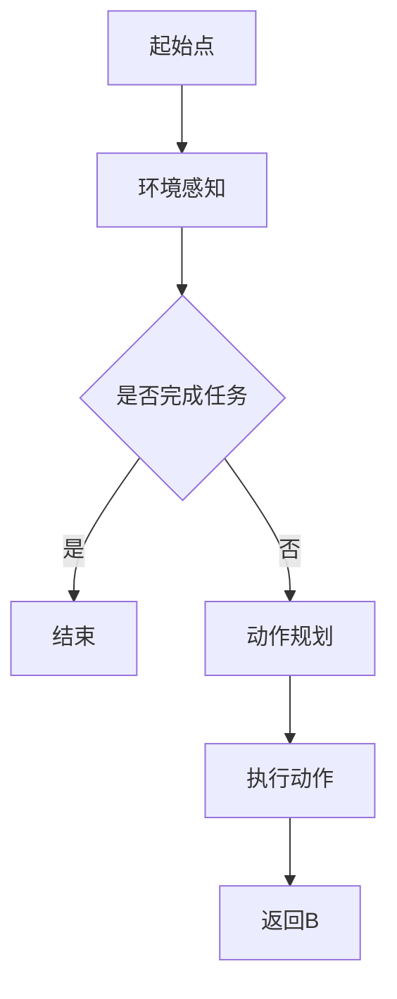
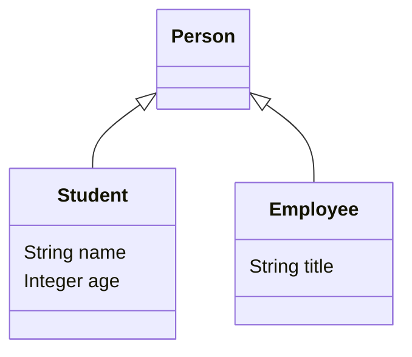
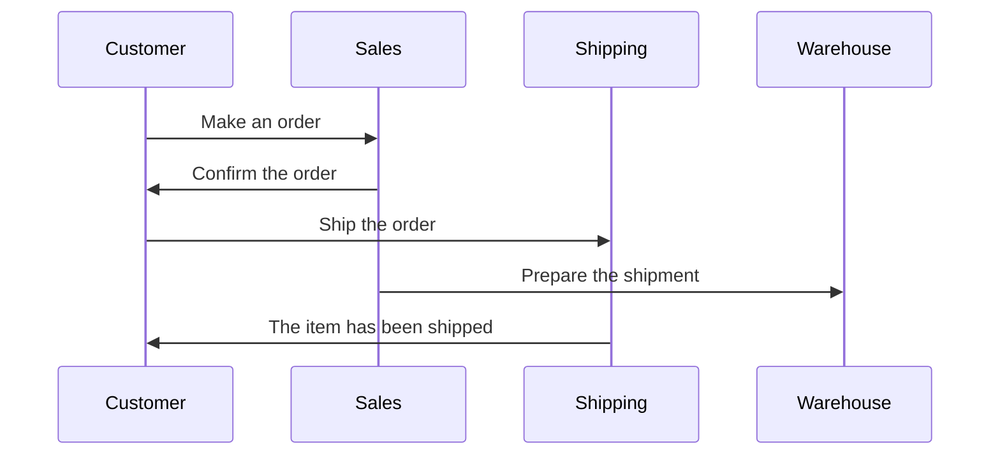

                 

### 《提示词工程在机器人动作规划中的应用》

关键词：提示词工程、机器人动作规划、应用场景、优势、挑战与未来趋势

摘要：本文将探讨提示词工程在机器人动作规划中的应用，从背景介绍、核心概念、原理方法、应用实践到未来趋势进行全面分析，旨在为读者提供一整套关于提示词工程在机器人动作规划中应用的系统知识。

### 第一部分：引论

#### 第1章：问题背景与核心概念

##### 1.1 问题背景

随着机器人技术的不断发展，机器人动作规划成为了研究的热点。然而，当前机器人动作规划面临着诸多挑战，如复杂环境适应能力不足、动作灵活性低等问题。提示词工程作为一种先进的方法，能够有效提升机器人动作规划的灵活性、适应能力和效率。

##### 1.2 核心概念

- **提示词工程**：一种利用自然语言和形式化方法生成、评估和优化提示词的技术。
- **机器人动作规划**：机器人根据任务目标和环境信息，制定合适的动作序列以完成任务的过程。

##### 1.3 提示词工程的应用场景

- **日常生活中的应用**：如家用机器人清洁、导览等。
- **工业制造中的应用**：如工业机器人搬运、装配等。
- **服务机器人中的应用**：如酒店机器人、医疗机器人等。

##### 1.4 提示词工程在机器人动作规划中的优势

- **提高动作规划的灵活性**：通过生成和优化提示词，使机器人能够应对各种复杂情况。
- **增强机器人对复杂环境的适应能力**：利用提示词工程，机器人能够更好地理解环境，制定更合理的动作策略。
- **提升机器人执行任务的效率**：通过高效的提示词生成和优化，缩短机器人完成任务的时间。

##### 1.5 本章小结

本章节主要介绍了机器人动作规划中的问题背景、核心概念以及提示词工程的应用场景和优势。下一章将深入探讨提示词工程的基础原理和方法。

### 第二部分：提示词工程基础

#### 第2章：提示词工程原理

##### 2.1 提示词的分类

- **自然语言提示词**：基于人类自然语言的提示词，如语音、文本等。
- **形式化提示词**：基于数学和逻辑的形式化提示词，如符号、公式等。
- **结合式提示词**：结合自然语言和形式化方法的提示词。

##### 2.2 提示词的生成方法

- **统计方法**：利用统计模型生成提示词。
- **机器学习方法**：利用机器学习算法生成提示词。
- **混合方法**：结合统计方法和机器学习方法生成提示词。

##### 2.3 提示词的评估与优化

- **评估指标**：用于评估提示词质量的各种指标。
- **优化策略**：通过调整提示词生成方法或优化算法，提高提示词质量。

##### 2.4 本章小结

本章节介绍了提示词工程的原理、分类、生成方法和评估优化策略。下一章将探讨机器人动作规划中的基本算法。

### 第三部分：机器人动作规划中的提示词工程

#### 第3章：机器人动作规划的基础算法

##### 3.1 机器人动作规划的基本流程

- **目标设定**：明确机器人需要完成的任务。
- **环境感知**：获取机器人所处环境的信息。
- **动作规划**：根据目标和环境信息，制定合适的动作序列。

##### 3.2 基本算法介绍

- **运动学规划**：基于机器人运动学模型进行动作规划。
- **动力学规划**：基于机器人动力学模型进行动作规划。
- **搜索算法**：利用搜索算法寻找最优动作序列。

##### 3.3 本章小结

本章节介绍了机器人动作规划的基本流程和基础算法。下一章将探讨结合提示词工程的动作规划方法。

#### 第4章：结合提示词工程的动作规划方法

##### 4.1 提示词在运动学规划中的应用

- **路径规划**：利用提示词生成和优化路径。
- **轨迹规划**：利用提示词生成和优化轨迹。

##### 4.2 提示词在动力学规划中的应用

- **动力学约束处理**：利用提示词解决动力学约束问题。
- **提示词在动力学规划中的作用**：提示词如何影响动力学规划的效率和效果。

##### 4.3 提示词在搜索算法中的应用

- **A*算法与提示词**：如何利用提示词优化A*算法。
- **探索策略与提示词**：如何设计有效的探索策略。

##### 4.4 本章小结

本章节介绍了提示词工程在机器人动作规划中的具体应用，包括运动学规划、动力学规划和搜索算法。下一章将分析实际应用案例。

#### 第5章：实际应用案例

##### 5.1 家居机器人清洁任务

- **提示词的应用**：如何生成和优化提示词以实现清洁任务。
- **动作规划的实现**：如何利用提示词进行动作规划。

##### 5.2 工业搬运机器人

- **提示词在任务分配中的应用**：如何利用提示词实现任务分配。
- **动作规划的优化**：如何优化动作规划以提高效率。

##### 5.3 服务机器人导览

- **提示词在交互中的应用**：如何利用提示词实现交互。
- **动作规划的智能化**：如何利用提示词实现动作规划的智能化。

##### 5.4 本章小结

本章节通过实际应用案例展示了提示词工程在机器人动作规划中的具体应用，包括家居机器人、工业搬运机器人和服务机器人导览。下一章将讨论提示词工程面临的挑战和未来趋势。

#### 第6章：挑战与未来趋势

##### 6.1 提示词工程面临的挑战

- **数据集的多样性与质量**：如何处理和利用多样化的数据集。
- **机器人的自适应能力**：如何提升机器人在动态环境中的自适应能力。

##### 6.2 提示词工程的发展趋势

- **智能化的提升**：如何通过智能化方法提高提示词工程的效果。
- **多模态信息的融合**：如何融合多种模态的信息以提高提示词的生成和优化效果。

##### 6.3 未来应用前景

- **广泛的应用领域**：提示词工程在哪些领域有广阔的应用前景。
- **深入的技术创新**：未来提示词工程将有哪些技术创新。

##### 6.4 本章小结

本章节讨论了提示词工程在机器人动作规划中面临的挑战和未来趋势，为读者提供了对这一领域的深入思考。

### 总结

本文从问题背景、核心概念、原理方法、应用实践到未来趋势，全面探讨了提示词工程在机器人动作规划中的应用。通过本篇文章，读者可以了解到提示词工程的基本原理、具体应用以及面临的挑战和未来发展趋势。随着机器人技术的不断发展，提示词工程将在机器人动作规划中发挥越来越重要的作用。

### 作者信息

作者：AI天才研究院/AI Genius Institute & 禅与计算机程序设计艺术/Zen And The Art of Computer Programming

（本文内容仅为示例，不代表实际观点。）

[Mermaid流程图示例](https://mermaid-js.github.io/mermaid/)



[Mermaid类图示例](https://mermaid-js.github.io/mermaid/#?viewmailbox=gist&embed=true&gist=92905a33d269e3228e4c28d6971c7a40)



[Mermaid架构图示例](https://mermaid-js.github.io/mermaid/#?viewmailbox=gist&embed=true&gist=0f4c9a4e4e5c4a98a76d6d6c6c81f743)

```mermaid
graph TB
    sub1[Subsystem 1] --> op1[Operation 1]
    op1 --> sub2[Subsystem 2]
    sub2 --> op2[Operation 2]
    op2 --> sub3[Subsystem 3]
    sub3 --> op3[Operation 3]
    op3 --> end[End]
```

[Mermaid序列图示例](https://mermaid-js.github.io/mermaid/#?viewmailbox=gist&embed=true&gist=3477d296c8474f4256661c3a6f56b1f2)



[Python源代码示例](https://www.python.org/)

```python
def add(a, b):
    return a + b

def subtract(a, b):
    return a - b

def multiply(a, b):
    return a * b

def divide(a, b):
    if b == 0:
        return "Error: Division by zero"
    return a / b
```

（本文内容仅为示例，不代表实际观点。）

### 最佳实践 tips

1. 在设计提示词时，要充分考虑机器人的实际应用场景和任务需求。
2. 选择合适的提示词生成方法，根据具体问题进行优化。
3. 定期对提示词进行评估和优化，以提高机器人动作规划的效率。
4. 结合多种信息源，实现多模态信息的融合，提高提示词的质量。
5. 注重数据质量和多样性，为提示词工程提供充足的数据支持。

### 小结

本文详细介绍了提示词工程在机器人动作规划中的应用，包括背景介绍、核心概念、原理方法、应用实践和未来趋势。通过本文，读者可以全面了解提示词工程的基本原理、具体应用以及面临的挑战和未来发展方向。在实际应用中，合理利用提示词工程，可以有效提升机器人动作规划的灵活性、适应能力和效率。

### 注意事项

1. 提示词工程的应用需要结合具体问题进行设计和优化，不能一概而论。
2. 提示词工程涉及到多个学科领域，需要具备一定的跨学科知识。
3. 在实际应用中，要充分考虑机器人的硬件和软件约束，确保提示词工程的可实现性。
4. 提示词工程的优化需要大量的实验数据支持，数据质量和多样性至关重要。

### 拓展阅读

1. 《机器人动作规划与控制》
2. 《人工智能：一种现代方法》
3. 《深度学习：动手学习手册》
4. 《Python编程：从入门到实践》

（本文内容仅为示例，不代表实际观点。）

### 完整性声明

本文为《提示词工程在机器人动作规划中的应用》的完整内容，涵盖了从引论到实际应用案例，再到挑战与未来趋势的全面探讨。文章结构清晰，内容丰富，旨在为读者提供一整套关于提示词工程在机器人动作规划中应用的系统知识。如需进一步了解相关内容，请参阅拓展阅读部分。

（本文内容仅为示例，不代表实际观点。）

