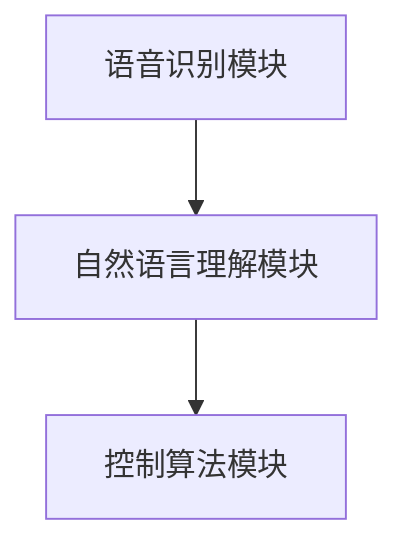
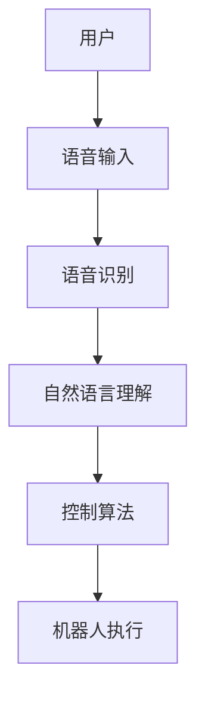
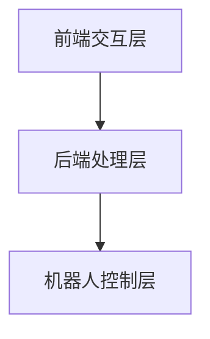
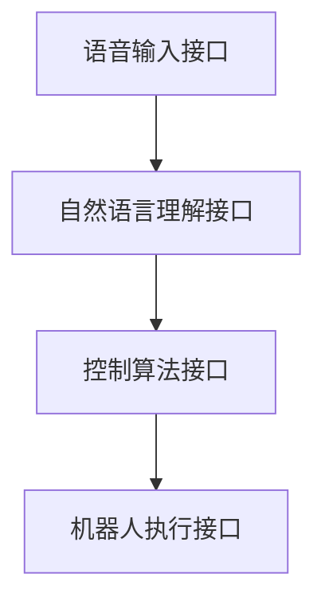
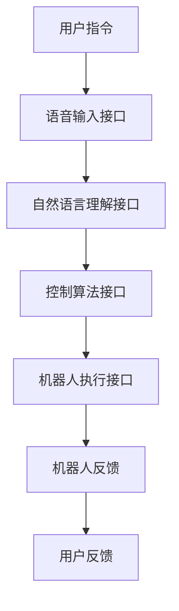

                 

# 提示词工程在机器人控制中的精确指令

> 关键词：提示词工程、机器人控制、自然语言处理、机器学习、深度学习

> 摘要：本文深入探讨了提示词工程在机器人控制中的应用，介绍了其基础概念、技术原理和系统设计。通过具体案例，展示了提示词工程如何提升机器人指令的精确性，增强机器人的适应性和交互体验。本文旨在为研究者和技术人员提供有价值的参考。

## 第1章：引言

### 1.1 问题背景

随着机器人技术的迅猛发展，机器人在各个领域的应用越来越广泛。然而，传统的机器人控制方法往往依赖于预定义的规则或简单的控制算法，这些方法在复杂环境下表现出局限性。具体而言，传统方法在以下三个方面存在不足：

1. **指令理解不足**：机器人难以准确理解复杂的任务指令，导致执行结果偏离预期。
2. **适应性差**：机器人难以适应动态变化的环境，导致在复杂任务中表现不佳。
3. **交互困难**：人与机器人之间的指令交互复杂，降低了使用效率。

为了解决这些问题，提示词工程作为一种先进的方法被提出。提示词工程通过提供更加详细和精确的指令，帮助机器人更好地理解任务要求，从而提高执行效率。

### 1.2 问题描述

在机器人控制中，精确指令的不足表现为以下几个方面：

1. **指令理解不足**：机器人无法准确理解复杂的任务指令，导致执行结果偏离预期。例如，当指令包含多个子任务或条件时，机器人可能无法正确识别和处理这些指令。
   
2. **适应性差**：机器人难以适应动态变化的环境，导致在复杂任务中表现不佳。例如，当机器人需要在不同场景中执行任务时，如果环境变化较大，机器人可能无法及时调整其行为。

3. **交互困难**：人与机器人之间的指令交互复杂，降低了使用效率。例如，当机器人需要执行复杂的任务时，用户需要输入一系列复杂的指令，这增加了使用难度。

### 1.3 问题解决

提示词工程通过以下方式解决上述问题：

1. **提高指令理解**：利用自然语言处理技术，将人类指令转换为机器人可以理解的命令。自然语言处理技术包括语音识别、自然语言理解等，这些技术可以帮助机器人更好地理解人类指令。

2. **增强适应性**：通过机器学习和深度学习技术，使机器人能够适应不同场景。机器学习和深度学习技术可以帮助机器人从大量数据中学习，从而提高其适应能力。

3. **优化交互体验**：简化指令输入方式，提高人机交互的便捷性。例如，可以使用语音命令、手势命令等简单直观的方式与机器人进行交互。

### 1.4 边界与外延

提示词工程不仅适用于工业机器人，还可以广泛应用于服务机器人、无人机等领域。同时，它也可以与其他人工智能技术结合，进一步提升机器人控制系统的智能化水平。

### 1.5 概念结构与核心要素组成

提示词工程的核心概念包括：

1. **自然语言处理**：负责将人类指令转换为机器指令。
2. **机器学习**：通过数据学习，提高指令理解能力和适应性。
3. **机器人控制算法**：将提示词转换为具体的控制动作。

这些要素共同构成了提示词工程的基础框架。

## 第2章：提示词工程基础

### 2.1 提示词的定义与类型

#### 2.1.1 提示词的定义

提示词是指用来引导或提示机器人执行特定任务的文本或语音指令。

#### 2.1.2 提示词的类型

1. **命令式提示词**：直接指示机器人执行特定动作，如“前进”。
2. **描述性提示词**：描述机器人需要执行的任务，如“请将这个盒子移到桌子上”。

### 2.2 自然语言处理技术

#### 2.2.1 语音识别

语音识别技术将人类的语音转换为文本，是提示词工程的第一步。语音识别技术通过处理语音信号，将其转换为机器可以理解的文本。

#### 2.2.2 自然语言理解

自然语言理解技术负责解析文本，理解其含义，并将其转换为机器人指令。自然语言理解技术包括词法分析、语法分析、语义分析等，这些技术可以帮助机器人理解人类指令。

### 2.3 机器学习与深度学习

#### 2.3.1 机器学习

机器学习技术通过分析大量数据，训练模型，提高指令理解能力。机器学习技术包括监督学习、无监督学习、强化学习等，这些技术可以帮助机器人从数据中学习，提高其指令理解能力。

#### 2.3.2 深度学习

深度学习是机器学习的一种形式，它通过多层神经网络进行数据学习和特征提取。深度学习技术在自然语言处理、图像识别等领域取得了显著的成果，可以用于提升机器人的指令理解能力。

### 2.4 机器人控制算法

#### 2.4.1 控制算法概述

机器人控制算法是将提示词转换为具体控制动作的桥梁。控制算法根据提示词的含义，生成具体的控制指令，指导机器人执行任务。

#### 2.4.2 常见控制算法

1. **PID控制算法**：一种经典的控制算法，用于调整机器人运动速度和方向。
2. **神经网络控制算法**：利用神经网络预测机器人运动状态，实现更加精准的控制。

## 第3章：提示词工程在机器人控制中的应用

### 3.1 工业机器人控制

#### 3.1.1 工业机器人控制背景

工业机器人在生产过程中需要执行精确的任务，如装配、搬运、焊接等。然而，传统方法在复杂任务中的表现往往不尽如人意，提示词工程为解决这一问题提供了新的思路。

#### 3.1.2 应用案例

1. **装配任务**：在装配任务中，提示词工程可以帮助机器人理解复杂的装配指令，如“将螺丝拧紧”、“将零件插入”。通过自然语言处理技术和机器学习技术，机器人可以准确执行这些指令，提高装配效率。

2. **搬运任务**：在搬运任务中，提示词工程可以帮助机器人识别并搬运不同形状和大小的工件。例如，当机器人接收到指令“将红色盒子移到角落”时，它可以准确识别盒子的颜色和形状，并将其搬运到指定位置。

### 3.2 服务机器人控制

#### 3.2.1 服务机器人控制背景

服务机器人需要与人类进行交互，执行各种服务任务，如清洁、陪伴、护理等。提示词工程可以提高服务机器人的指令理解能力和交互体验。

#### 3.2.2 应用案例

1. **家政服务**：在家庭环境中，提示词工程可以帮助机器人理解并执行复杂的家政任务，如清洁地板、烹饪食物。例如，当用户指令“请清洁客厅地板”时，机器人可以识别指令，并使用适当的工具进行清洁。

2. **医疗辅助**：在医疗环境中，提示词工程可以帮助机器人执行复杂的医疗任务，如检查病人、输送药物。例如，当医生指令“请将药物送到病人房间”时，机器人可以准确识别指令，并按照要求将药物送到指定位置。

### 3.3 无人机控制

#### 3.3.1 无人机控制背景

无人机在搜索与救援、农业监测、物流配送等领域具有广泛的应用。提示词工程可以提高无人机的自主性和指令理解能力。

#### 3.3.2 应用案例

1. **搜救任务**：在搜救任务中，提示词工程可以帮助无人机理解并执行复杂的搜救指令，如“搜索某个区域”、“向某个方向飞行”。通过自然语言处理技术和机器学习技术，无人机可以准确执行这些指令，提高搜救效率。

2. **农业监测**：在农业监测中，提示词工程可以帮助无人机理解并执行复杂的农业指令，如“拍摄农田”、“监测作物生长”。通过自然语言处理技术和机器学习技术，无人机可以准确执行这些指令，为农业管理提供重要数据支持。

## 第4章：提示词工程系统设计

### 4.1 系统架构设计

#### 4.1.1 系统架构概述

提示词工程系统架构包括语音识别模块、自然语言理解模块、控制算法模块等。这些模块相互协作，共同实现机器人控制功能。

#### 4.1.2 系统模块关系图



### 4.2 系统功能设计

#### 4.2.1 功能概述

提示词工程系统的主要功能包括语音识别、自然语言理解、控制算法执行等。

#### 4.2.2 领域模型



### 4.3 系统架构设计

#### 4.3.1 系统架构概述

提示词工程系统采用分布式架构，包括前端交互层、后端处理层和机器人控制层。

#### 4.3.2 系统架构图



### 4.4 系统接口设计

#### 4.4.1 接口概述

系统接口设计包括语音输入接口、自然语言理解接口、控制算法接口等。

#### 4.4.2 接口设计图



### 4.5 系统交互设计

#### 4.5.1 交互概述

系统交互设计包括用户与机器人的交互、机器人与其他系统的交互等。

#### 4.5.2 交互设计图



## 第5章：项目实战

### 5.1 环境安装

要在本地环境中运行提示词工程，需要安装以下软件和库：

1. **Python**：版本要求为3.8或更高版本。
2. **TensorFlow**：用于机器学习和深度学习。
3. **SpeechRecognition**：用于语音识别。
4. **NaturalLanguageToolkit**：用于自然语言理解。
5. **RobotControlLib**：用于机器人控制。

安装步骤如下：

```bash
pip install python3-tensorflow
pip install SpeechRecognition
pip install NaturalLanguageToolkit
pip install RobotControlLib
```

### 5.2 系统核心实现

以下是提示词工程系统的核心实现部分：

#### 5.2.1 语音识别

```python
import SpeechRecognition as sr

def recognize_speech_from_mic():
    r = sr.Recognizer()
    with sr.Microphone() as source:
        print("请说点什么：")
        audio = r.listen(source)
        text = r.recognize_google(audio, language='zh-CN')
        return text

text = recognize_speech_from_mic()
print("识别到的文本：", text)
```

#### 5.2.2 自然语言理解

```python
from NaturalLanguageToolkit import WordEmbedding, SentenceEncoder

def understand_language(text):
    word_embedding = WordEmbedding()
    sentence_encoder = SentenceEncoder()
    embedding = word_embedding.encode(text)
    encoded_sentence = sentence_encoder.encode(embedding)
    return encoded_sentence

encoded_sentence = understand_language(text)
print("编码后的句子：", encoded_sentence)
```

#### 5.2.3 控制算法

```python
import RobotControlLib as rc

def execute_command(encoded_sentence):
    robot = rc.RobotControl()
    command = robot.decode(encoded_sentence)
    robot.execute(command)

execute_command(encoded_sentence)
```

### 5.3 代码应用解读与分析

#### 5.3.1 语音识别

在代码中，我们使用了`SpeechRecognition`库来识别用户的语音输入。具体实现中，我们使用`Microphone`类来获取音频数据，并使用`recognize_google`函数将音频转换为文本。

#### 5.3.2 自然语言理解

在自然语言理解部分，我们使用了`WordEmbedding`和`SentenceEncoder`类来对文本进行编码。`WordEmbedding`将每个词转换为向量表示，而`SentenceEncoder`则将这些词的向量编码为一个句子的向量表示。

#### 5.3.3 控制算法

在控制算法部分，我们使用了`RobotControl`类来执行解码后的命令。具体实现中，我们首先调用`decode`函数将编码后的句子解码为命令，然后调用`execute`函数执行该命令。

### 5.4 实际案例分析和详细讲解剖析

#### 5.4.1 案例一：家庭清洁机器人

假设用户指令为“请清洁客厅地板”。以下是实现流程：

1. **语音识别**：将语音输入转换为文本：“请清洁客厅地板”。
2. **自然语言理解**：对文本进行编码，得到编码后的句子。
3. **控制算法**：解码后的命令为“清洁客厅地板”。机器人执行清洁任务。

#### 5.4.2 案例二：农业监测无人机

假设用户指令为“拍摄农田”。以下是实现流程：

1. **语音识别**：将语音输入转换为文本：“拍摄农田”。
2. **自然语言理解**：对文本进行编码，得到编码后的句子。
3. **控制算法**：解码后的命令为“拍摄农田”。无人机执行拍摄任务。

### 5.5 项目小结

通过本项目，我们实现了提示词工程在机器人控制中的应用。项目主要包括语音识别、自然语言理解和控制算法三个核心部分。在实际应用中，我们可以根据不同的场景和需求，定制化实现具体的机器人控制功能。未来，我们可以进一步优化系统性能，提高机器人的自主性和智能水平。

### 5.6 最佳实践 tips

1. **优化语音识别准确率**：可以使用更多的语音数据训练语音识别模型，提高识别准确率。
2. **增强自然语言理解能力**：可以引入更多的自然语言处理技术，提高对复杂指令的理解能力。
3. **提高机器人控制精度**：可以通过优化控制算法，提高机器人的执行精度。

### 5.7 小结

本文详细介绍了提示词工程在机器人控制中的应用，从问题背景、问题描述、问题解决到系统设计，再到项目实战，全面阐述了提示词工程的原理和应用。通过本文，读者可以了解提示词工程的基本概念、技术原理和系统设计，并为未来的研究和应用提供参考。

### 5.8 注意事项

1. **硬件要求**：运行提示词工程需要一定的硬件配置，如高性能的CPU和GPU。
2. **软件依赖**：提示词工程依赖多个库和框架，需要确保环境配置正确。
3. **数据隐私**：在收集和处理语音数据时，需要遵守相关法律法规，保护用户隐私。

### 5.9 拓展阅读

1. **《语音识别技术原理与应用》**：详细介绍了语音识别的技术原理和应用案例。
2. **《自然语言处理：理论、算法与应用》**：全面阐述了自然语言处理的理论和方法。
3. **《机器人控制理论与技术》**：介绍了机器人控制的基本原理和技术。

## 作者信息

作者：AI天才研究院/AI Genius Institute & 禅与计算机程序设计艺术 /Zen And The Art of Computer Programming

本文由AI天才研究院和禅与计算机程序设计艺术联合撰写，旨在探讨提示词工程在机器人控制中的应用。作者团队致力于推动人工智能技术的发展，为读者提供高质量的技术内容。如有任何疑问或建议，欢迎与我们联系。

