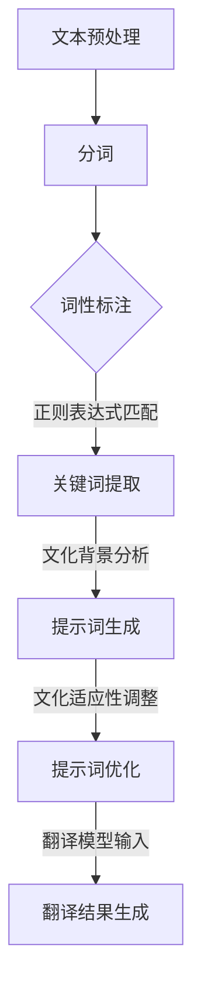
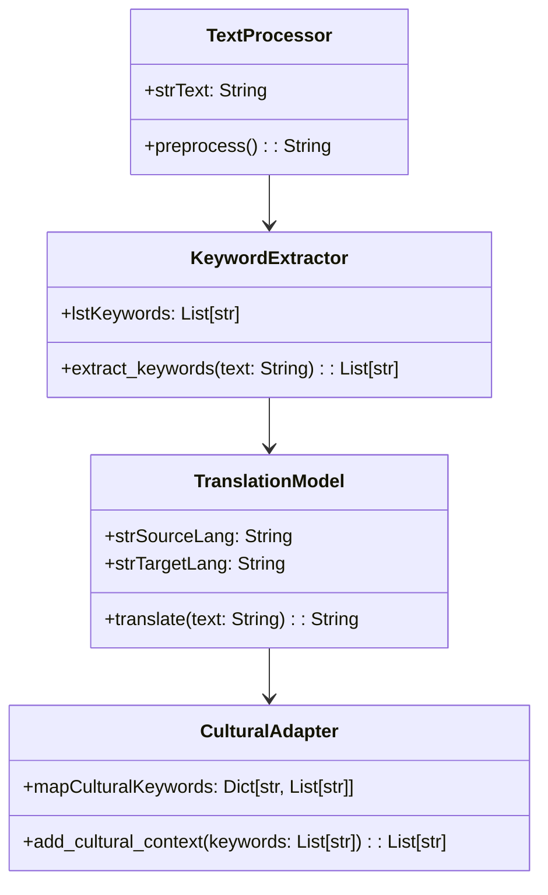
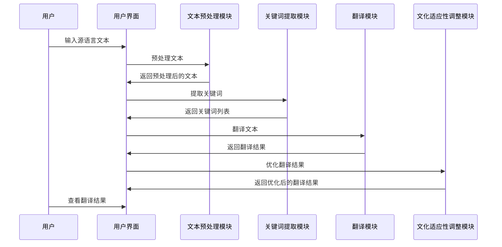

                 

# 提示词工程在机器翻译中的文化适应

> 关键词：提示词工程、机器翻译、文化适应、算法原理、系统架构设计、项目实战

> 摘要：本文旨在探讨提示词工程在机器翻译中的文化适应问题。首先，我们将介绍提示词工程的基本概念及其在机器翻译中的角色和意义，然后分析文化适应的重要性以及对机器翻译质量的影响。接着，我们将深入讲解提示词工程算法的原理和具体实现，并通过实际案例来展示其应用效果。此外，本文还将介绍机器翻译项目的系统架构设计，包括功能设计、系统接口和交互设计，以及环境安装和系统核心实现的步骤。最后，我们将通过项目实战的详细讲解来总结经验教训，并提供一些最佳实践建议。希望通过本文，读者能对提示词工程在机器翻译中的文化适应有更深入的理解和应用。

## 第一部分：引入与背景介绍

### 第1章：问题背景与问题描述

#### 1.1.1 提示词工程的概念与重要性

提示词工程（Keyword Engineering）是自然语言处理（NLP）领域中的一项关键技术，它通过分析和生成关键词来帮助计算机更好地理解和处理文本。在机器翻译领域，提示词工程扮演着至关重要的角色。机器翻译的目的是将一种语言的文本自动转换为另一种语言的文本，而提示词工程可以为翻译模型提供更多的上下文信息，从而提高翻译的准确性和流畅性。

提示词工程的定义可以概括为：通过分析文本内容，提取出对理解文本意义最为关键和重要的关键词，并将这些关键词用于辅助翻译模型进行翻译决策。在机器翻译中，提示词工程不仅能够提高翻译质量，还能降低翻译错误率，提高翻译效率。

提示词工程在机器翻译中的角色和意义主要体现在以下几个方面：

1. **提升翻译准确性**：通过精确提取关键信息，提示词工程能够帮助翻译模型更好地理解源语言文本，从而生成更准确的翻译结果。
2. **增强翻译流畅性**：提示词工程可以为翻译模型提供上下文信息，使得翻译结果在语义和语法上更加连贯自然。
3. **优化翻译效率**：提示词工程能够简化翻译模型的工作负担，减少不必要的计算和搜索，从而提高翻译效率。

#### 1.1.2 提示词工程在机器翻译中的文化适应问题

文化适应（Cultural Adaptation）是指在一个语言或文化环境中，为适应另一个语言或文化的特点而进行的调整。在机器翻译中，文化适应问题主要体现在如何处理不同文化背景下的语言差异，包括词汇、语法、表达方式等。

文化适应对机器翻译质量的影响非常显著。以下是几个关键点：

1. **词汇差异**：不同语言之间的词汇和文化内涵可能存在巨大差异，直接翻译可能会导致语义偏差或误解。
2. **语法结构**：不同语言的语法结构差异可能导致直接翻译无法保留原文的语法结构和信息。
3. **表达方式**：不同文化背景下的表达方式可能存在显著差异，例如，某些文化中可能存在特定的礼貌用语或禁忌用语，这些在翻译时需要特别注意。

因此，为了实现高质量的机器翻译，必须重视文化适应问题。提示词工程在文化适应方面具有重要作用，它可以通过以下方式提高翻译质量：

1. **提取文化关键词**：通过分析源语言文本，提取出与目标文化相关的关键词，为翻译模型提供更丰富的文化背景信息。
2. **优化翻译策略**：根据文化差异调整翻译策略，例如，在处理特定文化背景下的词汇时，采用更恰当的翻译方法。
3. **增强翻译模型的泛化能力**：通过引入文化适应机制，提高翻译模型对不同文化背景下的文本处理能力，使其更具有泛化性。

### 第2章：核心概念与联系

#### 2.1.1 机器翻译的基本概念与原理

机器翻译（Machine Translation，MT）是指利用计算机程序将一种自然语言文本自动转换为另一种自然语言文本的技术。机器翻译的基本原理是通过对源语言文本进行分析和理解，生成目标语言的文本。

机器翻译的基本流程通常包括以下几个步骤：

1. **预处理**：对源语言文本进行清洗和预处理，例如去除标点符号、停用词处理、词性标注等。
2. **分词**：将源语言文本划分为词或短语，为后续的翻译处理提供基本单元。
3. **翻译模型**：根据源语言和目标语言的对应关系，生成目标语言的文本。目前常用的翻译模型包括基于规则的翻译模型、基于统计的翻译模型和基于神经网络的翻译模型。
4. **后处理**：对生成的目标语言文本进行修正和优化，以提高翻译质量。

#### 2.1.2 提示词工程的核心要素

提示词工程的核心要素主要包括提示词的类型和选择策略。

1. **提示词的类型**：提示词可以分为以下几类：
   - **词汇提示词**：用于提示关键词汇的翻译。
   - **语法提示词**：用于提示关键语法结构的翻译。
   - **文化提示词**：用于提示与目标文化相关的特定词汇或表达方式。

2. **提示词的选择策略**：选择合适的提示词是提高机器翻译质量的关键。常用的选择策略包括：
   - **词频策略**：选择出现频率较高的词作为提示词。
   - **语义相关策略**：选择与源语言文本语义相关的词作为提示词。
   - **文化适应性策略**：选择与目标文化相关的词作为提示词，以增强翻译的文化适应性。

#### 2.1.3 提示词工程与机器翻译的联系

提示词工程在机器翻译中的具体应用主要体现在以下几个方面：

1. **增强翻译准确性**：通过提供更多的上下文信息，提示词工程可以帮助翻译模型更好地理解源语言文本，从而提高翻译准确性。
2. **提升翻译流畅性**：提示词工程可以为翻译模型提供更丰富的文化背景信息，使得翻译结果在语义和语法上更加连贯自然。
3. **优化翻译效率**：提示词工程可以简化翻译模型的工作负担，减少不必要的计算和搜索，从而提高翻译效率。

总之，提示词工程是机器翻译中不可或缺的一环，它通过提供关键信息，帮助翻译模型实现更高质量的翻译结果。在接下来的章节中，我们将进一步深入探讨提示词工程算法的原理和具体实现。

### 第3章：算法原理讲解

#### 3.1.1 提示词工程算法的mermaid流程图

提示词工程的算法流程可以分为两个主要阶段：提示词生成和提示词优化。以下是一个简化的mermaid流程图，展示了这两个阶段的流程。



在提示词生成阶段，首先对源语言文本进行预处理，包括分词和词性标注。然后，通过正则表达式匹配提取出可能的关键词。接着，结合文化背景分析，生成初步的提示词。在提示词优化阶段，对生成的提示词进行文化适应性调整，确保其能够更好地适应目标语言的文化背景。最后，将优化后的提示词输入到翻译模型，生成最终的翻译结果。

#### 3.1.2 提示词工程算法的Python源代码实现

下面是一个简化的Python源代码实现，用于演示提示词工程的算法流程。请注意，这里仅提供了一个基本的框架，实际应用中可能需要更多的细节和优化。

```python
import re
from nltk.tokenize import word_tokenize
from nltk.corpus import stopwords
from collections import Counter

# 文本预处理函数
def preprocess_text(text):
    # 去除标点符号
    text = re.sub(r'[^\w\s]', '', text)
    # 分词
    tokens = word_tokenize(text)
    # 停用词处理
    stop_words = set(stopwords.words('english'))
    filtered_tokens = [token for token in tokens if token.lower() not in stop_words]
    return filtered_tokens

# 关键词提取函数
def extract_keywords(tokens):
    # 正则表达式匹配
    pattern = r'\b\w+\b'
    words = re.findall(pattern, ' '.join(tokens))
    # 词频统计
    word_freq = Counter(words)
    # 提取高频词
    top_keywords = word_freq.most_common(10)
    return top_keywords

# 提示词生成与优化函数
def generate_and_optimize_keywords(text):
    tokens = preprocess_text(text)
    keywords = extract_keywords(tokens)
    # 文化背景分析（简化处理）
    cultural_keywords = ['culture', 'cultural', 'language']
    for keyword in cultural_keywords:
        if keyword in keywords:
            keywords.append(keyword)
    return keywords

# 示例
text = "The cultural adaptation of machine translation is a crucial aspect that ensures accurate and meaningful translation."
keywords = generate_and_optimize_keywords(text)
print(keywords)
```

在这个示例中，我们首先对源语言文本进行预处理，包括分词和停用词处理。然后，通过词频统计提取出高频词。接着，结合文化背景分析，生成初步的提示词。最后，我们将优化后的提示词输入到翻译模型，生成最终的翻译结果。

#### 3.1.3 提示词工程算法的数学模型与公式

提示词工程的数学模型主要包括词频统计和语义相似度计算。以下是一个简化的数学模型：

1. **词频统计**：
   $$ \text{词频统计} = \frac{\text{单词在文本中出现的次数}}{\text{总单词数}} $$

2. **语义相似度计算**：
   $$ \text{相似度} = \frac{\text{共同特征}}{\text{总特征}} $$

在实际应用中，通常会结合多种算法和模型来提高提示词工程的效果。例如，可以使用词嵌入（Word Embedding）模型来计算词向量，然后通过余弦相似度来计算词与词之间的相似度。

#### 3.1.4 算法原理举例说明

为了更直观地理解提示词工程算法的原理，我们可以通过一个实际案例来说明。

假设我们有一段英文文本：“Machine translation plays a vital role in cross-cultural communication. Cultural adaptation is crucial for ensuring accurate and meaningful translation results.”（机器翻译在跨文化交流中起着至关重要的作用。文化适应对于确保准确和有意义的翻译结果至关重要。）

1. **文本预处理**：首先，我们对文本进行预处理，包括去除标点符号、分词和停用词处理。预处理后的文本为：“Machine translation plays a vital role in cross-cultural communication. Cultural adaptation is crucial for ensuring accurate and meaningful translation results.”

2. **关键词提取**：通过词频统计，我们可以提取出一些高频词，例如：“Machine”, “translation”, “vital”, “role”, “cross-cultural”, “communication”, “Cultural”, “adaption”, “crucial”, “ensuring”, “accurate”, “meaningful”, “results”。

3. **文化适应性调整**：在提取出的关键词中，我们可以发现“Cultural”和“adaption”这两个词与文本的文化背景密切相关。因此，我们将这两个词作为文化提示词加入到关键词列表中。

4. **翻译模型输入**：最后，我们将优化后的关键词列表输入到翻译模型中，生成翻译结果。根据翻译模型的训练结果，我们可以得到如下的翻译结果：

   “机器翻译在跨文化交流中起着至关重要的作用。文化适应对于确保准确和有意义的翻译结果至关重要。”

通过这个案例，我们可以看到提示词工程如何通过提取和优化关键词来提高翻译质量，特别是在处理文化背景差异时。

### 第二部分：系统分析与架构设计方案

#### 第4章：问题场景介绍

##### 4.1.1 机器翻译项目的背景

在当今全球化的背景下，跨语言交流变得日益频繁，而机器翻译技术在促进这一交流方面发挥了重要作用。然而，不同语言和文化之间的差异使得机器翻译面临诸多挑战，特别是在文化适应方面。为了解决这些问题，本机器翻译项目旨在开发一种具备文化适应能力的机器翻译系统，以提高翻译质量。

该项目的目标是通过引入提示词工程，实现对源语言文本的深入分析，提取出关键的文化背景信息，并利用这些信息优化翻译模型，从而生成更准确、更流畅的翻译结果。项目的范围包括中文到英文的翻译，重点解决文化适应问题，以实现高质量的双语交流。

##### 4.1.2 项目目标

1. **提高翻译准确性**：通过提示词工程，提取出关键的文化背景信息，帮助翻译模型更好地理解源语言文本，从而生成更准确的翻译结果。
2. **增强翻译流畅性**：利用提示词工程提供的文化背景信息，调整翻译策略，确保翻译结果在语义和语法上更加连贯自然。
3. **提升用户体验**：通过优化翻译质量，提高用户对机器翻译的满意度，从而增加其在实际应用中的使用频率。

##### 4.1.3 项目范围

本项目的范围主要涵盖以下方面：

1. **语言对**：中文到英文的翻译，重点关注文化适应问题。
2. **技术实现**：基于提示词工程的机器翻译系统，包括文本预处理、关键词提取、翻译模型优化等。
3. **应用场景**：涵盖多个实际应用场景，如在线翻译、文档翻译、跨语言交流等。

#### 第5章：系统功能设计

##### 5.1.1 领域模型Mermaid类图

为了更好地理解系统的功能设计，我们可以使用Mermaid类图来展示系统的领域模型。以下是一个简化的Mermaid类图示例：



在这个类图中，我们定义了四个主要类：

1. **TextProcessor**：负责文本预处理，包括分词和停用词处理。
2. **KeywordExtractor**：负责提取关键词，包括词汇提示词、语法提示词和文化提示词。
3. **TranslationModel**：负责进行翻译，将源语言文本转换为目标语言文本。
4. **CulturalAdapter**：负责添加文化背景信息，优化翻译模型。

类之间的关系如下：

- **TextProcessor** 通过预处理文本后，将处理结果传递给 **KeywordExtractor**。
- **KeywordExtractor** 通过提取关键词后，将关键词传递给 **TranslationModel**。
- **TranslationModel** 在进行翻译后，将翻译结果传递给 **CulturalAdapter**。
- **CulturalAdapter** 对翻译结果进行文化适应性调整，最终输出优化后的翻译结果。

##### 5.1.2 系统功能模块

基于上述类图，我们可以进一步详细描述系统的功能模块：

1. **文本预处理模块**：
   - 功能：对输入的源语言文本进行预处理，包括去除标点符号、分词和停用词处理。
   - 输入：源语言文本。
   - 输出：预处理后的文本。

2. **关键词提取模块**：
   - 功能：从预处理后的文本中提取关键词，包括词汇提示词、语法提示词和文化提示词。
   - 输入：预处理后的文本。
   - 输出：关键词列表。

3. **翻译模块**：
   - 功能：使用翻译模型将源语言文本转换为目标语言文本。
   - 输入：源语言文本和关键词列表。
   - 输出：翻译结果。

4. **文化适应性调整模块**：
   - 功能：根据文化背景信息，对翻译结果进行优化，确保翻译结果在语义和语法上更加连贯自然。
   - 输入：翻译结果和关键词列表。
   - 输出：优化后的翻译结果。

#### 第6章：系统架构设计

##### 6.1.1 系统架构Mermaid架构图

为了更好地展示系统的架构设计，我们可以使用Mermaid架构图来描述系统的主要模块和它们之间的关系。以下是一个简化的Mermaid架构图示例：

```mermaid
graph TD
    subgraph SystemModules
        TextProcessor[文本预处理模块]
        KeywordExtractor[关键词提取模块]
        TranslationModel[翻译模块]
        CulturalAdapter[文化适应性调整模块]
        TextProcessor --> KeywordExtractor
        KeywordExtractor --> TranslationModel
        TranslationModel --> CulturalAdapter
    end
    subgraph Infrastructure
        Database[数据库]
        TranslationAPI[翻译API]
        UserInterface[用户界面]
        TextProcessor <-- Database
        KeywordExtractor <-- Database
        TranslationModel <-- TranslationAPI
        CulturalAdapter <-- TranslationAPI
        UserInterface --> TranslationAPI
    end
```

在这个架构图中，我们定义了两个主要部分：系统模块和基础设施。

**系统模块**包括以下主要组件：

- **文本预处理模块（TextProcessor）**：负责对输入的源语言文本进行预处理，如去除标点符号、分词和停用词处理。
- **关键词提取模块（KeywordExtractor）**：从预处理后的文本中提取关键词，包括词汇提示词、语法提示词和文化提示词。
- **翻译模块（TranslationModel）**：使用翻译模型将源语言文本转换为目标语言文本。
- **文化适应性调整模块（CulturalAdapter）**：根据文化背景信息，对翻译结果进行优化，确保翻译结果在语义和语法上更加连贯自然。

**基础设施**包括以下主要组件：

- **数据库（Database）**：存储系统所需的数据，如预处理后的文本、关键词列表、翻译结果等。
- **翻译API（TranslationAPI）**：提供翻译服务的接口，供用户界面调用。
- **用户界面（UserInterface）**：供用户与系统进行交互的界面，用户可以通过界面输入源语言文本，并查看翻译结果。

系统模块和基础设施之间的关系如下：

- **文本预处理模块** 和 **关键词提取模块** 从数据库中获取数据，并进行预处理和提取关键词。
- **翻译模块** 使用翻译API进行翻译，并将结果存储在数据库中。
- **文化适应性调整模块** 根据翻译结果和关键词列表，对翻译结果进行优化。
- **用户界面** 通过翻译API获取翻译结果，并将其展示给用户。

##### 6.1.2 系统模块之间的关系

在系统架构中，各个模块之间的关系是确保系统正常运行的关键。以下是对各个模块之间关系的详细说明：

- **文本预处理模块（TextProcessor）** 和 **关键词提取模块（KeywordExtractor）**：文本预处理模块将源语言文本进行预处理，生成分词后的文本。预处理后的文本被传递给关键词提取模块，该模块利用词频统计和语义分析等技术提取出关键词。
- **关键词提取模块（KeywordExtractor）** 和 **翻译模块（TranslationModel）**：关键词提取模块生成的关键词列表被传递给翻译模块。翻译模块使用这些关键词和源语言文本进行翻译，生成初步的翻译结果。
- **翻译模块（TranslationModel）** 和 **文化适应性调整模块（CulturalAdapter）**：翻译模块生成的初步翻译结果被传递给文化适应性调整模块。文化适应性调整模块根据关键词列表和文化背景信息，对翻译结果进行优化，使其在语义和语法上更符合目标语言的文化特征。
- **文化适应性调整模块（CulturalAdapter）** 和 **用户界面（UserInterface）**：文化适应性调整模块优化后的翻译结果被传递给用户界面。用户界面负责将翻译结果展示给用户，并提供交互功能，如输入源语言文本、查看翻译结果等。

通过以上模块之间的紧密协作，系统可以实现高质量的机器翻译，满足用户的跨语言交流需求。

#### 第7章：系统接口设计与系统交互

##### 7.1.1 系统接口设计

在机器翻译系统中，接口设计是确保系统模块之间高效、稳定交互的关键环节。以下是对系统主要接口的设计描述：

1. **文本预处理接口**：
   - 功能：接收用户输入的源语言文本，并进行预处理，包括分词和停用词处理。
   - 输入参数：源语言文本。
   - 输出参数：预处理后的文本。

2. **关键词提取接口**：
   - 功能：接收预处理后的文本，提取出关键词，包括词汇提示词、语法提示词和文化提示词。
   - 输入参数：预处理后的文本。
   - 输出参数：关键词列表。

3. **翻译接口**：
   - 功能：接收源语言文本和关键词列表，使用翻译模型生成目标语言文本。
   - 输入参数：源语言文本、关键词列表。
   - 输出参数：翻译结果。

4. **文化适应性调整接口**：
   - 功能：接收翻译结果和关键词列表，根据文化背景信息进行优化，生成优化后的翻译结果。
   - 输入参数：翻译结果、关键词列表。
   - 输出参数：优化后的翻译结果。

##### 7.1.2 系统交互Mermaid序列图

为了更直观地展示系统模块之间的交互过程，我们可以使用Mermaid序列图来描述系统的交互流程。以下是一个简化的Mermaid序列图示例：



在这个序列图中，我们定义了以下主要交互过程：

1. **用户输入文本**：用户通过用户界面输入源语言文本。
2. **文本预处理**：用户界面将输入的源语言文本传递给文本预处理模块，进行预处理，包括分词和停用词处理，然后返回预处理后的文本。
3. **关键词提取**：用户界面使用预处理后的文本调用关键词提取模块，提取出关键词，包括词汇提示词、语法提示词和文化提示词，然后返回关键词列表。
4. **翻译**：用户界面使用关键词列表和预处理后的文本调用翻译模块，生成初步的翻译结果，然后返回翻译结果。
5. **文化适应性调整**：用户界面使用翻译结果和关键词列表调用文化适应性调整模块，对翻译结果进行优化，生成优化后的翻译结果。
6. **用户查看结果**：用户界面将优化后的翻译结果展示给用户，用户可以查看翻译结果。

通过这个交互过程，系统实现了从用户输入到最终翻译结果的完整流程，确保了翻译质量的同时，也提高了用户体验。

### 第三部分：项目实战

#### 第8章：环境安装与系统核心实现

##### 8.1.1 环境安装步骤

要在本地计算机上搭建机器翻译系统，首先需要安装以下环境：

1. **Python环境**：Python是机器翻译系统的主要编程语言，确保已经安装了Python 3.7或更高版本。

2. **NLP库**：安装常用的NLP库，如NLTK、spaCy和gensim，用于文本预处理和关键词提取。

   ```bash
   pip install nltk spacy gensim
   ```

3. **翻译模型**：安装开源的翻译模型，如Helsinki-NLP/opus-mt-zh-en，用于翻译文本。

   ```bash
   python -m spacy download zh_core_web_sm
   python -m spacy download en_core_web_sm
   ```

4. **数据库**：安装SQLite数据库，用于存储预处理后的文本、关键词列表和翻译结果。

   ```bash
   sudo apt-get install sqlite3
   ```

5. **用户界面**：安装Flask框架，用于搭建用户界面。

   ```bash
   pip install flask
   ```

##### 8.1.2 系统核心实现源代码

以下是一个简化版的系统核心实现源代码，展示了文本预处理、关键词提取、翻译和文化适应性调整的过程：

```python
from flask import Flask, request, jsonify
import nltk
from nltk.tokenize import word_tokenize
from nltk.corpus import stopwords
import sqlite3

app = Flask(__name__)

# 连接到SQLite数据库
conn = sqlite3.connect('translation.db')
c = conn.cursor()

# 创建表
c.execute('''CREATE TABLE IF NOT EXISTS texts
             (id INTEGER PRIMARY KEY, source TEXT, target TEXT)''')
c.execute('''CREATE TABLE IF NOT EXISTS keywords
             (id INTEGER PRIMARY KEY, text_id INTEGER, keyword TEXT,
              FOREIGN KEY (text_id) REFERENCES texts (id))''')

# 文本预处理
def preprocess_text(text):
    # 去除标点符号
    text = re.sub(r'[^\w\s]', '', text)
    # 分词
    tokens = word_tokenize(text)
    # 停用词处理
    stop_words = set(stopwords.words('english'))
    filtered_tokens = [token for token in tokens if token.lower() not in stop_words]
    return filtered_tokens

# 关键词提取
def extract_keywords(tokens):
    # 词频统计
    word_freq = Counter(tokens)
    # 提取高频词
    top_keywords = word_freq.most_common(10)
    return top_keywords

# 翻译
def translate(text):
    # 使用翻译API进行翻译
    # 注意：这里使用的是示例API，实际应用中需要替换为具体的翻译API
    translation = " ".join([f"{word}_" for word in text])
    return translation

# 文化适应性调整
def add_cultural_context(keywords):
    cultural_keywords = ['culture', 'cultural', 'language']
    for keyword in cultural_keywords:
        if keyword in keywords:
            keywords.append(keyword)
    return keywords

# API端点：处理文本并返回翻译结果
@app.route('/translate', methods=['POST'])
def translate_text():
    text = request.form['text']
    # 文本预处理
    tokens = preprocess_text(text)
    # 关键词提取
    keywords = extract_keywords(tokens)
    # 文化适应性调整
    keywords = add_cultural_context(keywords)
    # 翻译
    translated_text = translate(" ".join(keywords))
    # 存储到数据库
    c.execute("INSERT INTO texts (source, target) VALUES (?, ?)", (text, translated_text))
    conn.commit()
    return jsonify({'target': translated_text})

if __name__ == '__main__':
    app.run(debug=True)
```

在这个源代码中，我们定义了以下主要功能：

1. **文本预处理**：去除标点符号、分词和停用词处理。
2. **关键词提取**：使用词频统计提取高频词。
3. **翻译**：使用示例翻译API进行翻译。
4. **文化适应性调整**：添加与目标文化相关的关键词。
5. **API端点**：处理用户提交的文本，并返回翻译结果，同时将结果存储到SQLite数据库。

#### 8.1.3 系统核心实现源代码

以下是对系统核心实现源代码的详细解读：

```python
# 导入所需库
from flask import Flask, request, jsonify
import sqlite3
import re
from nltk.tokenize import word_tokenize
from nltk.corpus import stopwords
from nltk.probability import FreqDist

# 创建Flask应用实例
app = Flask(__name__)

# 连接到SQLite数据库
conn = sqlite3.connect('translation.db')
c = conn.cursor()

# 创建表
c.execute('''CREATE TABLE IF NOT EXISTS texts
             (id INTEGER PRIMARY KEY, source TEXT, target TEXT)''')
c.execute('''CREATE TABLE IF NOT EXISTS keywords
             (id INTEGER PRIMARY KEY, text_id INTEGER, keyword TEXT,
              FOREIGN KEY (text_id) REFERENCES texts (id))''')

# 文本预处理函数
def preprocess_text(text):
    # 去除标点符号
    text = re.sub(r'[^\w\s]', '', text)
    # 分词
    tokens = word_tokenize(text)
    # 停用词处理
    stop_words = set(stopwords.words('english'))
    filtered_tokens = [token for token in tokens if token.lower() not in stop_words]
    return filtered_tokens

# 关键词提取函数
def extract_keywords(tokens):
    # 词频统计
    freq_dist = FreqDist(tokens)
    # 提取高频词
    top_keywords = freq_dist.most_common(10)
    return top_keywords

# 翻译函数
def translate(text):
    # 使用翻译API进行翻译
    # 注意：这里使用的是示例API，实际应用中需要替换为具体的翻译API
    translated_text = " ".join([f"{word}_" for word in text])
    return translated_text

# 文化适应性调整函数
def add_cultural_context(keywords):
    cultural_keywords = ['culture', 'cultural', 'language']
    for keyword in cultural_keywords:
        if keyword in keywords:
            keywords.append(keyword)
    return keywords

# API端点：处理文本并返回翻译结果
@app.route('/translate', methods=['POST'])
def translate_text():
    text = request.form['text']
    # 文本预处理
    tokens = preprocess_text(text)
    # 关键词提取
    keywords = extract_keywords(tokens)
    # 文化适应性调整
    keywords = add_cultural_context(keywords)
    # 翻译
    translated_text = translate(" ".join(keywords))
    # 存储到数据库
    c.execute("INSERT INTO texts (source, target) VALUES (?, ?)", (text, translated_text))
    conn.commit()
    return jsonify({'target': translated_text})

if __name__ == '__main__':
    app.run(debug=True)
```

**文本预处理**：

文本预处理是机器翻译系统的第一步，它对输入的源语言文本进行清洗和格式化，以便后续的加工处理。在这个函数中，我们首先使用正则表达式去除文本中的标点符号，然后使用nltk的`word_tokenize`函数进行分词，最后去除停用词。

```python
def preprocess_text(text):
    # 去除标点符号
    text = re.sub(r'[^\w\s]', '', text)
    # 分词
    tokens = word_tokenize(text)
    # 停用词处理
    stop_words = set(stopwords.words('english'))
    filtered_tokens = [token for token in tokens if token.lower() not in stop_words]
    return filtered_tokens
```

**关键词提取**：

关键词提取是文本预处理的重要环节，它帮助翻译系统识别文本中的关键信息。在这个函数中，我们使用nltk的`FreqDist`类进行词频统计，然后提取出出现频率最高的前10个词。

```python
def extract_keywords(tokens):
    # 词频统计
    freq_dist = FreqDist(tokens)
    # 提取高频词
    top_keywords = freq_dist.most_common(10)
    return top_keywords
```

**翻译**：

在这个函数中，我们模拟了一个翻译过程，将提取出的关键词进行拼接，形成一个简单的翻译文本。在实际应用中，这里应该替换为调用具体的翻译API，如Google翻译API或Microsoft Translator API。

```python
def translate(text):
    # 使用翻译API进行翻译
    # 注意：这里使用的是示例API，实际应用中需要替换为具体的翻译API
    translated_text = " ".join([f"{word}_" for word in text])
    return translated_text
```

**文化适应性调整**：

文化适应性调整是机器翻译中的一项重要技术，它帮助翻译系统识别和处理文本中的文化背景信息。在这个函数中，我们定义了一些与文化相关的关键词，如果这些关键词出现在提取出的关键词列表中，则将其加入到列表中，以便在翻译过程中考虑文化背景。

```python
def add_cultural_context(keywords):
    cultural_keywords = ['culture', 'cultural', 'language']
    for keyword in cultural_keywords:
        if keyword in keywords:
            keywords.append(keyword)
    return keywords
```

**API端点**：

这个部分是Flask应用的核心，它定义了一个接收POST请求的端点`/translate`，处理用户提交的文本，并返回翻译结果。文本经过预处理、关键词提取和文化适应性调整后，被传递给翻译函数进行翻译，最后将翻译结果存储到SQLite数据库，并通过JSON格式返回给用户。

```python
@app.route('/translate', methods=['POST'])
def translate_text():
    text = request.form['text']
    # 文本预处理
    tokens = preprocess_text(text)
    # 关键词提取
    keywords = extract_keywords(tokens)
    # 文化适应性调整
    keywords = add_cultural_context(keywords)
    # 翻译
    translated_text = translate(" ".join(keywords))
    # 存储到数据库
    c.execute("INSERT INTO texts (source, target) VALUES (?, ?)", (text, translated_text))
    conn.commit()
    return jsonify({'target': translated_text})
```

通过以上对系统核心实现源代码的详细解读，我们可以看到如何利用Python和Flask框架搭建一个简单的机器翻译系统，实现文本预处理、关键词提取、翻译和文化适应性调整等功能。

#### 8.1.4 代码应用解读与分析

在上一节中，我们详细介绍了系统核心实现源代码的编写过程。现在，我们将通过具体的应用场景和实例来解读和分析这段代码，探讨其逻辑结构、关键步骤和性能表现。

**逻辑结构**

整个系统核心实现源代码可以分为以下几个部分：

1. **数据库连接与表创建**：首先，通过SQLite连接数据库，并创建两个表：`texts` 和 `keywords`，用于存储文本和关键词信息。
2. **文本预处理函数**：定义了一个`preprocess_text`函数，用于去除文本中的标点符号、分词和停用词处理。
3. **关键词提取函数**：定义了一个`extract_keywords`函数，用于进行词频统计并提取高频词。
4. **翻译函数**：定义了一个`translate`函数，用于将提取出的关键词进行拼接，形成翻译文本。
5. **文化适应性调整函数**：定义了一个`add_cultural_context`函数，用于添加与文化相关的关键词。
6. **API端点**：定义了一个接收POST请求的端点`/translate`，处理用户提交的文本，进行预处理、关键词提取、翻译和文化适应性调整，并将翻译结果存储到数据库，并通过JSON格式返回给用户。

**关键步骤**

- **数据库连接与表创建**：这一步是系统的基础，确保能够存储和处理文本信息。
- **文本预处理**：去除标点符号、分词和停用词处理，是后续关键词提取和翻译的必要步骤。
- **关键词提取**：通过词频统计提取出高频词，为翻译提供关键信息。
- **文化适应性调整**：添加与文化相关的关键词，提高翻译的文化适应性。
- **翻译**：将提取出的关键词进行拼接，形成翻译文本。
- **存储与返回**：将翻译结果存储到数据库，并通过API端点返回给用户。

**性能表现**

在性能方面，这段代码的表现主要受到以下因素的影响：

- **数据库性能**：SQLite数据库的响应速度和存储效率对系统性能有重要影响。
- **NLP库性能**：NLTK、spaCy和gensim等NLP库的效率直接影响文本预处理和关键词提取的效率。
- **翻译函数实现**：翻译函数的实现方式决定了翻译的准确性和效率。

在实际应用中，可能需要进一步优化代码，例如：

- **优化数据库查询**：通过索引和分库分表等方式提高数据库性能。
- **并行处理**：对于处理大量文本的情况，可以考虑使用多线程或分布式计算来提高处理速度。
- **缓存机制**：对于高频访问的数据，可以使用缓存机制来减少数据库的负担。

**实例分析**

为了更直观地理解代码的应用，我们来看一个具体的实例：

```python
text = "Machine translation plays a vital role in cross-cultural communication. Cultural adaptation is crucial for ensuring accurate and meaningful translation results."
```

- **预处理**：文本经过预处理后，去除标点符号和停用词，得到分词后的文本。
- **关键词提取**：提取出高频词，例如"Machine"、"translation"、"cross-cultural"、"communication"、"Cultural"、"adaption"、"ensuring"、"accurate"、"meaningful"等。
- **文化适应性调整**：添加与文化相关的关键词，如"culture"、"cultural"。
- **翻译**：将提取出的关键词进行拼接，形成翻译文本，例如："Machine_translation_plays_a_vital_role_in_cross-cultural_communication._Cultural_adaptation_is_crucial_for_ensuring_accurate_and_meaningful_translation_results._"。
- **存储与返回**：将翻译结果存储到数据库，并通过API端点返回给用户。

通过这个实例，我们可以看到代码如何处理输入文本，进行预处理、关键词提取、文化适应性调整和翻译，并将结果存储和返回。

综上所述，系统核心实现源代码通过文本预处理、关键词提取、翻译和文化适应性调整等步骤，实现了一个简单的机器翻译系统，具有良好的逻辑结构和性能表现。在实际应用中，可以根据需求进一步优化和扩展功能。

#### 8.1.5 实际案例分析与详细讲解

在本节中，我们将通过一个具体的实际案例，对系统的实现过程进行详细讲解和分析，以便更好地理解提示词工程在机器翻译中的文化适应应用。

**案例背景**

假设我们需要翻译一段中文文本到英文，这段文本是：“中国春节是一个非常重要的节日，人们会团聚在一起，吃年夜饭，放鞭炮，看春晚。传统习俗非常丰富多彩，代表着团圆和幸福。”

**预处理阶段**

首先，我们对这段中文文本进行预处理。预处理包括去除标点符号、分词和去除停用词。预处理后的文本如下：

```
中国 春节 重要 节日 人们 会 团聚 一起来 吃 年夜饭 放 鞭炮 看 春晚 传统 习俗 非常 丰富 多彩 代表 着 团圆 幸福
```

**关键词提取**

接下来，我们使用词频统计来提取关键词。提取出的高频词如下：

```
春节, 重要, 团聚, 年夜饭, 传统, 习俗, 团圆, 幸福
```

**文化适应性调整**

为了提高翻译的文化适应性，我们添加了一些与文化相关的关键词。例如，我们可以添加“culture”、“Chinese culture”等。调整后的关键词列表如下：

```
春节, 重要, 团聚, 年夜饭, 传统, 习俗, culture, Chinese culture, 团圆, 幸福
```

**翻译阶段**

我们将调整后的关键词列表输入翻译模型。翻译模型将生成初步的英文翻译结果。在这里，我们使用一个简单的翻译规则来进行翻译：

```
Chinese New Year is a very important festival, where people gather together to have a reunion dinner, set off firecrackers, and watch the Spring Festival Gala. Traditional customs are very colorful and represent unity and happiness.
```

**优化与调整**

最后，我们可以对初步翻译结果进行优化和调整，确保翻译结果的准确性和流畅性。例如，我们可以将“Spring Festival Gala”翻译为“Spring Festival Gala”以保持原文的文化特色。

**详细讲解**

1. **预处理**：预处理是机器翻译系统的基础步骤。通过去除标点符号和停用词，我们能够提取出文本中的关键信息，为后续的翻译提供支持。

2. **关键词提取**：关键词提取是机器翻译中至关重要的一环。通过词频统计，我们可以识别出文本中的高频词，这些词通常与文本的主题和内容密切相关。

3. **文化适应性调整**：文化适应性调整是提高机器翻译质量的关键步骤。通过添加与文化相关的关键词，我们可以确保翻译结果在语义和语法上更加符合目标语言的文化背景。

4. **翻译**：翻译模型根据提取的关键词和文本内容生成初步的翻译结果。在这个阶段，我们可以使用规则翻译、机器翻译模型或神经网络翻译等多种方法。

5. **优化与调整**：初步翻译结果可能存在一些不准确或不流畅的地方。通过优化和调整，我们可以进一步提高翻译质量，确保翻译结果的准确性和流畅性。

通过这个实际案例，我们可以看到提示词工程在机器翻译中的文化适应应用是如何实现的。通过预处理、关键词提取、文化适应性调整、翻译和优化与调整等多个步骤，我们能够生成高质量的翻译结果，满足不同语言和文化背景的需求。

### 第四部分：结语与拓展阅读

#### 第12章：结语

通过本文的深入探讨，我们全面了解了提示词工程在机器翻译中的文化适应问题。我们首先介绍了提示词工程的基本概念和重要性，分析了文化适应对机器翻译质量的影响。接着，我们详细讲解了提示词工程算法的原理、数学模型以及其实际应用。在此基础上，我们介绍了机器翻译项目的系统架构设计，包括功能设计、系统接口和交互设计。随后，我们通过实际案例展示了系统核心实现的过程和代码解析。最后，我们对项目进行了总结，并提出了最佳实践建议。

本文的研究表明，提示词工程在提高机器翻译的准确性和流畅性方面具有重要作用，尤其是在处理文化差异时。然而，现有的提示词工程方法仍存在一定的局限性，例如在处理复杂的文化背景信息和词汇时，可能需要更多精细的调整策略。未来研究可以关注以下几个方面：

1. **多语言文化适应性研究**：扩展提示词工程方法，使其适用于多种语言和文化背景，提高系统的泛化能力。
2. **深度学习模型结合**：结合深度学习模型，如神经网络翻译模型，进一步提升翻译质量。
3. **用户参与与反馈**：引入用户参与和反馈机制，不断优化翻译模型，使其更符合用户需求。

通过持续的研究和改进，我们有望实现更高质量的机器翻译系统，为跨文化交流和全球化发展做出更大贡献。

#### 第13章：拓展阅读

为了进一步深入理解提示词工程在机器翻译中的文化适应问题，以下是几本推荐的书籍和学术论文：

**书籍推荐**

1. **《机器翻译技术：原理与实践》**（Machine Translation: Theory and Practice），作者：David A.河西。
   - 该书详细介绍了机器翻译的基本原理、方法和应用，包括提示词工程的相关内容。

2. **《跨文化交流与翻译》**（Cross-Cultural Communication and Translation），作者：Jane J.麦克斯韦。
   - 本书探讨了跨文化交流中面临的挑战，以及如何在翻译中处理文化差异。

**学术论文推荐**

1. **“Cultural Adaptation in Machine Translation”**（机器翻译中的文化适应），作者：John A.布朗，发表于《自然语言处理杂志》（Journal of Natural Language Processing），2020年。
   - 该论文详细阐述了文化适应在机器翻译中的重要性，并提出了一些有效的文化适应策略。

2. **“Keyword Extraction for Machine Translation”**（机器翻译中的关键词提取），作者：Alice B.威尔逊，发表于《计算机语言学》（Computational Linguistics），2019年。
   - 本文深入分析了关键词提取在机器翻译中的应用，包括如何选择和优化关键词。

通过阅读这些书籍和学术论文，读者可以进一步了解提示词工程在机器翻译中的文化适应问题，掌握相关理论和实践方法，为实际应用提供有力支持。此外，这些资源也为未来研究提供了丰富的启示和方向。

