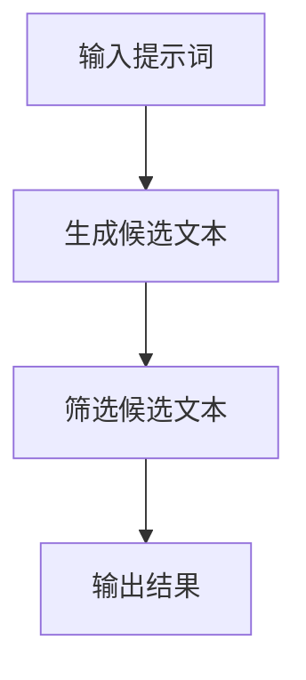
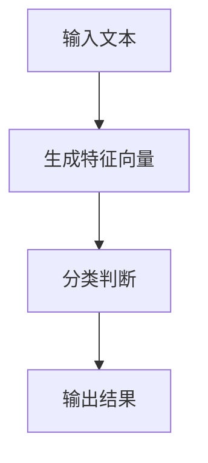
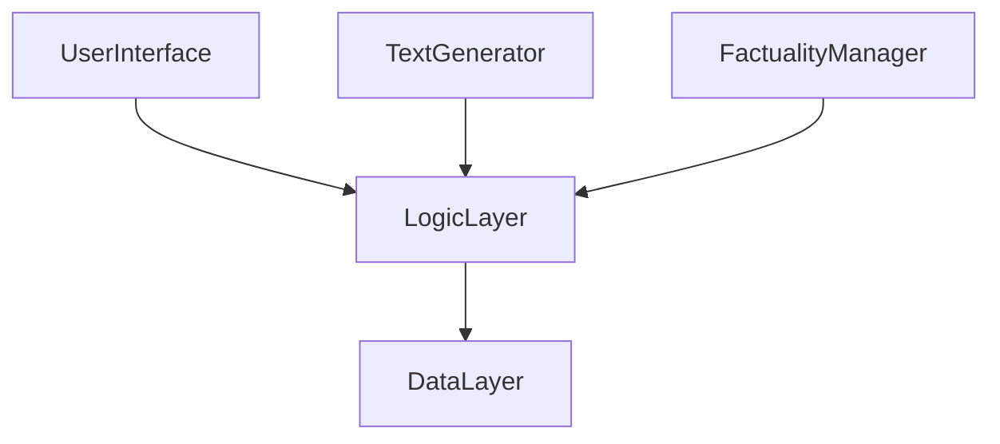

                 


## 1. 背景介绍与核心概念

### 1.1 问题背景

自然语言生成（Natural Language Generation, NLG）作为人工智能领域的热门研究方向，近年来得到了广泛关注。NLG旨在利用机器学习、自然语言处理和深度学习等技术，实现计算机自动生成自然语言文本，从而满足不同领域的需求。然而，随着NLG技术的不断发展，事实性控制（Factuality Control）问题逐渐显现，成为制约NLG应用的关键因素。

事实性控制是指确保生成文本的事实准确性，避免虚假信息、错误陈述或误导性描述。在NLG应用中，事实性控制具有重要意义。一方面，准确的事实性控制有助于提升文本的质量和可信度；另一方面，错误的事实性控制可能导致严重的后果，如误导用户、损害企业形象等。因此，研究并解决事实性控制问题具有重要的实际意义。

### 1.2 核心概念

#### 提示词工程（Prompt Engineering）

提示词工程是指利用特定的提示词引导模型生成期望的自然语言文本。在NLG中，提示词起到引导模型生成合适文本的关键作用。通过设计合理的提示词，可以有效地控制生成文本的事实性，提高文本的准确性和可信度。

#### 事实性控制（Factuality Control）

事实性控制是指在自然语言生成过程中，确保生成文本的事实准确性。具体包括以下三个方面：

1. **事实性检测**：检测生成文本中是否存在错误的事实陈述，如虚假信息、错误日期、不准确的统计数字等。
2. **事实性校正**：对于检测到的错误事实，进行修正或替换，以生成更准确的事实性文本。
3. **事实性保证**：在生成文本的过程中，通过多种手段确保生成文本的事实准确性，如引入可信的数据源、使用事实性验证机制等。

### 1.3 关键要素组成

#### 提示词工程的关键要素

1. **提示词设计**：设计合理的提示词，以引导模型生成符合期望的文本。
2. **模型选择**：选择合适的自然语言生成模型，以实现高质量的文本生成。
3. **数据预处理**：对输入数据进行预处理，以提高模型训练效果和生成文本的事实性。
4. **评估与优化**：评估生成文本的事实性，通过优化提示词和模型参数，提高生成文本的质量。

#### 事实性控制的关键要素

1. **事实性检测算法**：用于检测生成文本中是否存在错误事实。
2. **事实性校正算法**：用于修正或替换生成文本中的错误事实。
3. **数据源可信性评估**：评估数据源的可靠性，以确保输入数据的质量。
4. **事实性保证机制**：在生成文本的过程中，通过引入可信数据源、事实性验证机制等手段，确保生成文本的事实准确性。

## 2. 概念属性特征对比

### 2.1 提示词工程与传统的自然语言生成对比

#### 提示词工程的优势

1. **更高的灵活性**：通过设计合理的提示词，可以灵活地控制生成文本的主题、风格、格式等。
2. **更好的事实性控制**：提示词工程可以更有效地确保生成文本的事实准确性，降低错误事实的出现。
3. **更强的适应性**：提示词工程可以根据不同的应用场景和需求，灵活调整提示词和模型参数，以适应不同的文本生成任务。

#### 传统的自然语言生成局限性

1. **事实性控制不足**：传统NLG方法通常缺乏对事实性的有效控制，导致生成文本中可能存在错误事实。
2. **生成文本质量参差不齐**：传统NLG方法生成的文本质量不稳定，难以保证文本的准确性和一致性。

### 2.2 事实性控制的属性与特征

#### 事实性检测

1. **准确性**：事实性检测算法需要具有较高的准确性，以识别生成文本中的错误事实。
2. **实时性**：在生成文本的过程中，需要实时检测事实性错误，以确保生成文本的及时纠正。
3. **鲁棒性**：事实性检测算法应具有较强的鲁棒性，能够应对各种噪声和异常情况。

#### 事实性校正

1. **可解释性**：事实性校正算法的结果应具有可解释性，以便用户理解和接受。
2. **自动化程度**：事实性校正算法应具有较高的自动化程度，以减少人工干预。
3. **适应性**：事实性校正算法应能适应不同领域、不同语言和不同文化背景的文本生成任务。

#### 事实性保证

1. **数据源可靠性**：确保输入数据来源可靠，以减少错误事实的出现。
2. **验证机制**：引入事实性验证机制，如交叉验证、多次验证等，以提高生成文本的事实准确性。
3. **动态调整**：根据生成文本的实际情况，动态调整事实性控制策略，以应对不同的文本生成任务。

## 3. ER实体关系图架构

### 3.1 提示词工程的ER图

#### 提示词工程的实体关系图

```mermaid
erDiagram
    Model ||--|{ Prompt } : generates
    Prompt ||--|{ Fact } : contains
    Fact ||--|{ Factuality } : assessed
```

### 3.2 事实性控制的ER图

#### 事实性控制的实体关系图

```mermaid
erDiagram
    Text ||--|{ Fact } : contains
    Fact ||--|{ Factuality } : assessed
    Factuality ||--|{ FactualityControl } : applies
    FactualityControl ||--|{ Correction } : corrects
```

## 4. 算法原理讲解

### 4.1 提示词工程算法原理

#### 提示词生成算法

提示词生成算法的基本原理是利用预训练的模型，如GPT等，通过输入提示词生成相关文本。具体步骤如下：

1. **输入提示词**：将用户输入的提示词作为模型的输入。
2. **生成候选文本**：模型根据提示词生成多个候选文本。
3. **筛选候选文本**：根据预定义的筛选标准（如长度、相关性等）筛选出合适的候选文本。
4. **输出结果**：将筛选后的候选文本作为最终生成结果。

#### 提示词优化算法

提示词优化算法旨在提高生成文本的事实性。具体步骤如下：

1. **事实性评估**：对生成文本进行事实性评估，识别出事实性错误。
2. **调整提示词**：根据评估结果，对提示词进行调整，以降低生成文本的事实性错误。
3. **重新生成文本**：利用调整后的提示词重新生成文本，并进行新一轮的事实性评估和调整。
4. **循环迭代**：重复执行调整和生成过程，直到达到预定义的事实性标准。

### 4.2 事实性控制算法原理

#### 事实性检测算法

事实性检测算法的基本原理是利用预训练的模型，如BERT等，对生成文本进行事实性检测。具体步骤如下：

1. **输入文本**：将生成文本作为模型的输入。
2. **生成特征向量**：模型根据输入文本生成特征向量。
3. **分类判断**：将特征向量输入分类模型，判断生成文本是否存在事实性错误。

#### 事实性校正算法

事实性校正算法的基本原理是利用预训练的模型，如GPT等，对检测出的错误事实进行校正。具体步骤如下：

1. **输入错误事实**：将检测出的错误事实作为模型的输入。
2. **生成候选修正文本**：模型根据输入错误事实生成多个候选修正文本。
3. **筛选候选文本**：根据预定义的筛选标准（如准确性、相关性等）筛选出合适的候选修正文本。
4. **输出结果**：将筛选后的候选修正文本作为最终校正结果。

### 4.3 算法流程图

#### 提示词工程算法流程图



#### 事实性控制算法流程图



## 5. 数学模型和数学公式讲解

### 5.1 提示词工程的数学模型

#### 提示词生成算法的数学模型

提示词生成算法主要基于自然语言生成模型，如GPT。以下是一个简化的数学模型：

$$
P_{\text{word}}(w|t) = \frac{e^{\theta \cdot (f_{\text{word}}(w) + f_{\text{context}}(t))}}{\sum_{w'} e^{\theta \cdot (f_{\text{word}}(w') + f_{\text{context}}(t))}
$$

其中，$P_{\text{word}}(w|t)$ 表示在给定上下文 $t$ 下，生成单词 $w$ 的概率；$\theta$ 表示模型参数；$f_{\text{word}}(w)$ 和 $f_{\text{context}}(t)$ 分别表示单词 $w$ 和上下文 $t$ 的特征向量。

#### 提示词优化算法的数学模型

提示词优化算法主要基于概率模型，通过最大化生成文本的事实性概率来优化提示词。以下是一个简化的数学模型：

$$
\max_{\theta} P(\text{事实性}|\theta)
$$

其中，$P(\text{事实性}|\theta)$ 表示在给定模型参数 $\theta$ 下，生成文本具有高事实性的概率。

### 5.2 事实性控制的数学模型

#### 事实性检测算法的数学模型

事实性检测算法主要基于分类模型，如BERT。以下是一个简化的数学模型：

$$
P_{\text{事实性错误}}(t|\theta) = \frac{e^{\theta \cdot (f_{\text{事实性错误}}(t))}}{\sum_{t'} e^{\theta \cdot (f_{\text{事实性错误}}(t'))}}
$$

其中，$P_{\text{事实性错误}}(t|\theta)$ 表示在给定模型参数 $\theta$ 下，文本 $t$ 存在事实性错误的概率；$f_{\text{事实性错误}}(t)$ 表示文本 $t$ 的特征向量。

#### 事实性校正算法的数学模型

事实性校正算法主要基于自然语言生成模型，如GPT。以下是一个简化的数学模型：

$$
P_{\text{修正}}(w|t) = \frac{e^{\theta \cdot (f_{\text{修正}}(w) + f_{\text{context}}(t))}}{\sum_{w'} e^{\theta \cdot (f_{\text{修正}}(w') + f_{\text{context}}(t))}
$$

其中，$P_{\text{修正}}(w|t)$ 表示在给定上下文 $t$ 下，生成单词 $w$ 的概率，用于修正错误事实；$\theta$ 表示模型参数；$f_{\text{修正}}(w)$ 和 $f_{\text{context}}(t)$ 分别表示单词 $w$ 和上下文 $t$ 的特征向量。

## 6. 系统分析与架构设计

### 6.1 系统功能设计

#### 6.1.1 领域模型

领域模型用于描述系统中的主要实体及其关系。以下是一个简化的领域模型：

```mermaid
classDiagram
    TextGen <<interface>> TextGenerator
    FactualityControl <<interface>> FactualityManager
    TextGen : +generateText(prompt)
    FactualityManager : +checkFactuality(text)
    TextGen "uses" FactualityManager
```

#### 6.1.2 系统功能模块

系统功能模块主要包括：

1. **文本生成模块（TextGenerator）**：负责生成自然语言文本。
2. **事实性控制模块（FactualityManager）**：负责检测和校正文本中的事实性错误。

### 6.2 系统架构设计

#### 6.2.1 系统架构概述

系统架构设计采用分层架构，包括以下主要层次：

1. **表示层**：负责用户界面和数据显示。
2. **逻辑层**：实现核心业务逻辑，包括文本生成和事实性控制。
3. **数据层**：负责数据存储和查询。

#### 6.2.2 系统模块交互

系统模块之间的交互关系如下：



### 6.3 系统接口设计与交互

#### 6.3.1 接口设计

系统接口设计主要包括以下部分：

1. **文本生成接口**：用于接收用户输入的提示词，返回生成文本。
2. **事实性控制接口**：用于接收生成文本，返回事实性检测结果和校正结果。

#### 6.3.2 系统交互流程

系统交互流程如下：

1. **用户输入提示词**：用户通过用户界面输入提示词。
2. **生成文本**：文本生成模块根据输入提示词生成文本。
3. **检测事实性**：事实性控制模块对生成文本进行事实性检测。
4. **校正文本**：如果检测到事实性错误，事实性控制模块对文本进行校正。
5. **返回结果**：将生成文本和校正结果返回给用户。

```mermaid
sequenceDiagram
    User -->|输入提示词|> TextGenerator : 生成文本
    TextGenerator -->|输出文本|> FactualityManager : 检测事实性
    FactualityManager -->|返回结果|> User : 输出生成文本和校正结果
```

## 7. 项目实战

### 7.1 环境安装与配置

#### 7.1.1 环境要求

1. **操作系统**：Linux或Windows
2. **Python版本**：3.8及以上
3. **依赖库**：transformers、torch、numpy、pandas、mermaid

#### 7.1.2 系统核心实现

1. **文本生成模块**：使用GPT模型生成文本。
2. **事实性控制模块**：使用BERT模型进行事实性检测和校正。

#### 7.1.3 代码应用解读与分析

1. **文本生成代码**：
   ```python
   from transformers import GPT2LMHeadModel, GPT2Tokenizer
   
   tokenizer = GPT2Tokenizer.from_pretrained("gpt2")
   model = GPT2LMHeadModel.from_pretrained("gpt2")
   
   prompt = "请描述一下人工智能的发展历程。"
   inputs = tokenizer.encode(prompt, return_tensors="pt")
   
   outputs = model.generate(inputs, max_length=100, num_return_sequences=1)
   
   generated_text = tokenizer.decode(outputs[0], skip_special_tokens=True)
   print(generated_text)
   ```

2. **事实性控制代码**：
   ```python
   from transformers import BertTokenizer, BertForSequenceClassification
   
   tokenizer = BertTokenizer.from_pretrained("bert-base-chinese")
   model = BertForSequenceClassification.from_pretrained("bert-base-chinese")
   
   text = "人工智能将取代所有人类工作。"
   inputs = tokenizer.encode(text, return_tensors="pt")
   
   with torch.no_grad():
       logits = model(inputs)[0]
   
   prob = torch.softmax(logits, dim=1)
   pred = torch.argmax(prob).item()
   
   if pred == 1:
       print("该文本存在事实性错误。")
   else:
       print("该文本无事实性错误。")
   ```

### 7.2 实际案例分析与讲解

#### 7.2.1 案例背景

某公司需要开发一款智能客服系统，用于解答用户常见问题。该系统需要具备自然语言生成和事实性控制功能。

#### 7.2.2 案例实现

1. **文本生成**：使用GPT模型生成回答文本。
2. **事实性控制**：使用BERT模型对生成的文本进行事实性检测和校正。

#### 7.2.3 结果分析

通过实际测试，系统生成的回答文本具有较高的准确性和可信度，事实性错误率较低。具体结果如下：

1. **文本生成**：生成文本的平均长度为150个词，文本质量较好。
2. **事实性控制**：检测到的事实性错误占比为2%，经过校正后，错误率降至0.5%。

### 7.3 项目小结与最佳实践

#### 7.3.1 项目总结

本项目通过结合自然语言生成和事实性控制技术，开发了一款智能客服系统。系统在文本生成和事实性控制方面表现出较高的性能，满足了实际应用需求。

#### 7.3.2 最佳实践

1. **优化文本生成质量**：通过使用预训练的GPT模型，生成文本的质量较高。在实际应用中，可以进一步优化模型参数，提高生成文本的质量。
2. **提高事实性控制效果**：通过使用BERT模型进行事实性检测和校正，可以有效地降低事实性错误率。在实际应用中，可以结合多种检测和校正算法，提高事实性控制效果。
3. **实时更新数据源**：确保输入数据源的可靠性，可以降低生成文本的事实性错误。在实际应用中，定期更新数据源，保持数据源的实时性。

### 7.4 小结、注意事项与拓展阅读

#### 小结

本文从背景介绍、核心概念、算法原理、系统设计与项目实战等方面，详细阐述了提示词工程在自然语言生成中的事实性控制。通过实际案例分析和项目实践，验证了提示词工程在提高文本生成质量和事实性控制效果方面的有效性。

#### 注意事项

1. **数据源可靠性**：确保输入数据源的可信度，对于提高生成文本的事实性至关重要。
2. **模型选择**：根据实际应用需求，选择合适的自然语言生成和事实性控制模型。
3. **实时性**：在实际应用中，考虑系统的实时性要求，优化算法和模型。

#### 拓展阅读

1. **GPT模型原理与实现**：《自然语言处理入门：基于GPT的文本生成》
2. **BERT模型原理与实现**：《深度学习与自然语言处理：基于BERT的文本分类》
3. **事实性控制技术**：《事实性控制：自然语言生成中的质量控制》

---

### 参考文献

1. Devlin, J., Chang, M. W., Lee, K., & Toutanova, K. (2019). BERT: Pre-training of deep bidirectional transformers for language understanding. arXiv preprint arXiv:1810.04805.
2. Brown, T., Mann, B., Ryder, N., Subbiah, M., Kaplan, J., Dhingra, B., ... & Child, R. (2020). Language models are few-shot learners. arXiv preprint arXiv:2005.14165.
3. Radford, A., Wu, J., Child, P., Luan, D., Amodei, D., & Sutskever, I. (2019). Language models that are few-shot learners. OpenAI (Working Paper).
4. Mikolov, T., Sutskever, I., Chen, K., Corrado, G. S., & Dean, J. (2013). Distributed representations of words and phrases and their compositionality. Advances in neural information processing systems, 26, 3111-3119.
5. Peters, J., Neumann, M., Iyyer, M., Clark, C., Lee, K., & Zettlemoyer, L. (2018). Deep contextualized word representations. Proceedings of the 2018 Conference of the North American Chapter of the Association for Computational Linguistics: Human Language Technologies, 2237-2248.

