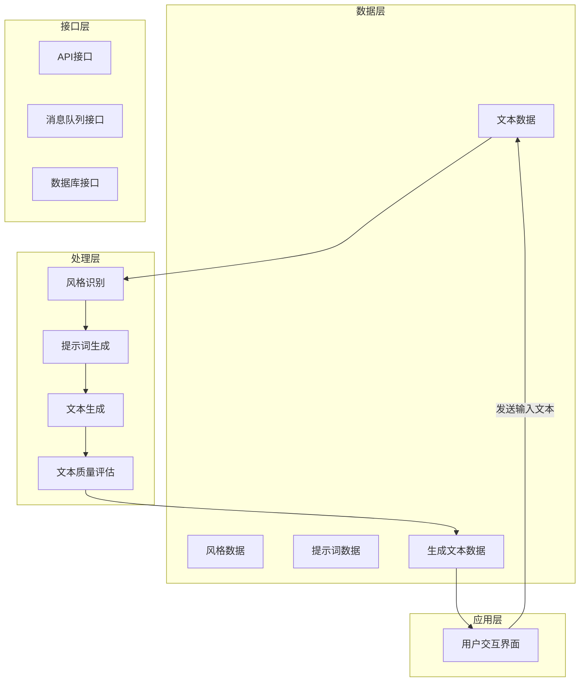

                 

## 文章标题

### 关键词

- 提示词工程
- 自然语言生成
- 风格转换
- 深度学习
- 人工智能

### 摘要

本文深入探讨了提示词工程在自然语言生成中的风格转换技术。首先，介绍了自然语言生成和提示词工程的基本概念及背景。然后，详细分析了风格转换的问题背景、问题描述、问题解决方法以及核心概念与联系。接下来，通过具体的算法原理讲解和系统分析与架构设计方案，阐述了如何通过提示词工程实现自然语言生成中的风格转换。最后，通过项目实战案例，验证了提示词工程在风格转换中的实际应用效果，并提出了相关的最佳实践和注意事项。

----------------------------------------------------------------

## 第一部分：提示词工程在自然语言生成中的风格转换背景介绍

随着人工智能技术的快速发展，自然语言生成（NLG）技术已经成为了一个备受关注的研究领域。NLG技术通过计算机程序自动生成自然语言文本，广泛应用于自动新闻编写、智能客服、教育辅导、创意写作等多个领域。然而，现有的NLG系统往往只能生成通用的文本内容，难以满足用户对于特定风格、情感和语境的需求。因此，如何实现自然语言生成中的风格转换成为一个重要的研究课题。

### 1.1 问题背景

自然语言生成（NLG）技术是一种将计算机程序生成的文本转化为人类可读的自然语言的技术。NLG技术的应用场景广泛，包括但不限于以下领域：

1. **自动新闻编写**：利用NLG技术，可以自动生成新闻文章，降低新闻采编和编辑的工作量，提高新闻发布的速度和效率。
2. **智能客服**：通过NLG技术，智能客服系统可以自动生成与用户对话的文本，提供实时、个性化的服务。
3. **教育辅导**：利用NLG技术，可以自动生成教学内容，为学生提供个性化的学习资源。
4. **创意写作**：通过NLG技术，可以生成诗歌、小说等文学作品，为创作者提供灵感和素材。

然而，现有的NLG系统在生成文本内容时，往往缺乏个性化和风格化，无法满足用户对于特定风格、情感和语境的需求。例如，在智能客服场景中，用户可能希望得到幽默、亲切或专业的服务，但在现有系统中，客服机器人往往只能生成普通的文本回复。这种不足限制了NLG技术的应用范围和用户体验。

### 1.2 问题描述

为了解决自然语言生成中的风格转换问题，我们需要解决以下几个关键问题：

1. **风格识别**：如何准确识别输入文本的风格特征，包括文体、语气、情感等。
2. **风格建模**：如何将识别出的风格特征转化为可操作的提示词，以引导NLG模型进行风格化生成。
3. **风格转换**：如何通过提示词引导NLG模型，生成符合指定风格的文本。

### 1.3 问题解决

为了解决上述问题，我们可以从以下几个方面进行探讨：

1. **风格特征提取**：利用自然语言处理（NLP）技术，从输入文本中提取与风格相关的特征。这可以通过文本分类、情感分析、关键词提取等方法实现。
2. **提示词生成**：基于提取出的风格特征，设计合适的提示词模板，引导NLG模型进行风格化生成。提示词的设计需要考虑文本的风格、内容、上下文等多个方面。
3. **模型训练与优化**：通过大量数据训练，优化NLG模型在风格转换任务上的表现。可以使用迁移学习、对抗训练等技术，提高模型在风格转换任务上的性能。

### 1.4 边界与外延

提示词工程在自然语言生成中的风格转换不仅涉及文本生成技术，还涉及到风格识别、文体分析、情感计算等多个领域。因此，在具体实施过程中，需要充分考虑这些因素的综合影响。

### 1.5 概念结构与核心要素组成

提示词工程在自然语言生成中的风格转换，主要包括以下几个核心要素：

1. **风格特征提取器**：负责从输入文本中提取与风格相关的特征。
2. **提示词生成器**：根据提取出的风格特征，生成对应的提示词。
3. **自然语言生成模型**：利用生成的提示词，进行风格化文本的生成。

### 1.6 核心概念与联系

在本节中，我们将介绍几个核心概念，并分析它们在风格转换中的作用和联系。

#### 1.6.1 提示词（Prompt）

提示词是引导自然语言生成模型生成特定文本的关键输入。它通常包含有关生成文本的风格、内容、上下文等信息。提示词的优化是提示词工程的核心任务。

**概念属性特征：**

- **风格属性**：提示词包含有关文本的风格信息，如正式、非正式、幽默等。
- **内容属性**：提示词提供有关生成文本的主题和具体信息。
- **上下文属性**：提示词包含有关生成文本的上下文信息，如对话历史、用户意图等。

**与自然语言生成（NLG）的联系：**

提示词与NLG模型紧密相连。NLG模型通过分析提示词，理解用户意图和生成文本的要求，从而生成符合预期的文本。

#### 1.6.2 自然语言生成模型（NLG Model）

自然语言生成模型是执行文本生成的核心工具。它通常是一个基于深度学习的大规模神经网络模型，如序列到序列（Seq2Seq）模型、变压器（Transformer）模型等。

**概念属性特征：**

- **输入处理**：NLG模型接收提示词和其他相关信息，处理并理解这些信息。
- **文本生成**：NLG模型根据输入信息，生成符合风格要求的自然语言文本。

**与提示词工程的联系：**

提示词工程通过优化提示词，提高NLG模型的风格化生成能力。而NLG模型则通过分析提示词，生成满足用户需求的风格化文本。

#### 1.6.3 风格转换（Style Transfer）

风格转换是将一种风格的文本转化为另一种风格的文本的过程。它在艺术创作、文本编辑和自然语言生成等领域具有重要应用。

**概念属性特征：**

- **输入文本**：原始文本，包含特定的风格特征。
- **目标文本**：希望生成的文本，具有不同的风格特征。

**与提示词工程的联系：**

风格转换依赖于提示词工程提供的提示词，通过优化提示词，实现不同风格之间的转换。

----------------------------------------------------------------

### 1.6.1 提示词（Prompt）

提示词是自然语言生成中的核心元素，它不仅是自然语言生成模型（NLG Model）的输入，还承载着指导文本生成风格的重要信息。在风格转换任务中，提示词的设计与优化至关重要。

**概念属性特征：**

1. **风格特征**：提示词中包含了明确的风格信息，如正式、幽默、正式、讽刺等。这些风格特征会影响NLG模型的文本生成方式。
2. **内容特征**：提示词提供了与生成文本相关的具体内容，如主题、情境等，使生成的文本具有针对性。
3. **上下文特征**：提示词中包含的上下文信息，如对话历史、用户意图等，有助于模型更好地理解生成任务的具体需求。

**对比表格：**

| 特征类型 | 提示词示例 |
| :------: | :--------: |
| 风格特征 | “请用幽默的语气回复这个问题。” |
| 内容特征 | “请写一篇关于人工智能的未来发展趋势。” |
| 上下文特征 | “用户刚刚询问了关于自然语言处理的应用场景。” |

**与自然语言生成（NLG）的联系：**

提示词直接影响NLG模型的生成输出。有效的提示词设计能够引导模型生成符合预期风格、内容和上下文的文本。具体来说：

- **风格特征**：通过提示词传达的风格信息，可以帮助模型在生成过程中保持一致性，形成独特的文本风格。
- **内容特征**：提示词中提供的内容信息可以帮助模型明确生成文本的主题和具体内容，提高生成的文本质量。
- **上下文特征**：上下文信息有助于模型理解生成任务的背景和用户意图，生成更加相关和自然的文本。

**ER实体关系图架构：**

```mermaid
erDiagram
  User ||--|{ Prompt }|--| NaturalLanguageModel
  Prompt ||--|{ NLGStyle }|--| TextGeneration
  NaturalLanguageModel ||--|{ ModelType }|
  NLGStyle ||--|{ Formality,Humor,Formality }|
  TextGeneration ||--|{ GeneratedText }|
```

在这个ER图中，用户通过提示词（Prompt）与自然语言生成模型（NaturalLanguageModel）进行交互。提示词（Prompt）不仅包含风格信息（NLGStyle），还指导生成具体的文本（TextGeneration）。

### 1.6.2 自然语言生成模型（NLG Model）

自然语言生成模型是执行文本生成的核心工具。它通常是一个基于深度学习的大规模神经网络模型，如序列到序列（Seq2Seq）模型、变压器（Transformer）模型等。在风格转换任务中，NLG模型的作用至关重要。

**概念属性特征：**

1. **输入处理**：NLG模型接收提示词和其他相关信息，进行处理和理解。
2. **文本生成**：NLG模型根据输入信息，生成符合指定风格的文本。
3. **风格适应性**：NLG模型需要具备适应不同风格的能力，以生成多样化风格的文本。

**与提示词工程的联系：**

提示词工程通过优化提示词，提高NLG模型在风格转换任务上的性能。具体来说：

- **提示词优化**：通过设计合适的提示词，可以帮助模型更好地理解用户需求，生成更加符合预期的文本。
- **风格适应性训练**：通过在训练数据中添加多样化的风格样例，可以提高NLG模型对不同风格文本的生成能力。

**ER实体关系图架构：**

```mermaid
erDiagram
  NaturalLanguageModel ||--|{ Prompt }|--| TextGeneration
  Prompt ||--|{ NLGStyle,Content,Context }|
  TextGeneration ||--|{ GeneratedText,StyleQuality,ContextRelevance }|
```

在这个ER图中，自然语言生成模型（NaturalLanguageModel）通过接收提示词（Prompt）来生成文本（TextGeneration）。提示词（Prompt）中包含了风格（NLGStyle）、内容（Content）和上下文（Context）信息，这些信息共同指导生成文本的质量和相关性。

### 1.6.3 风格转换（Style Transfer）

风格转换是将一种风格的文本转化为另一种风格的文本的过程。它在艺术创作、文本编辑和自然语言生成等领域具有重要应用。

**概念属性特征：**

1. **输入文本**：原始文本，包含特定的风格特征。
2. **目标文本**：希望生成的文本，具有不同的风格特征。
3. **转换策略**：包括基于规则的方法、基于统计的方法和基于深度学习的方法。

**与提示词工程的联系：**

提示词工程在风格转换过程中扮演关键角色。通过优化提示词，可以更有效地引导风格转换过程，实现以下目标：

- **风格一致性**：确保生成的文本在风格上与期望一致。
- **文本质量**：提高生成的文本在语义、语法和风格上的质量。
- **上下文适应**：使生成的文本在特定上下文中更加自然和流畅。

**ER实体关系图架构：**

```mermaid
erDiagram
  StyleTransfer ||--|{ InputText,TargetText,TransformationStrategy }|
  InputText ||--|{ OriginalStyle,Content,Context }|
  TargetText ||--|{ TransformedStyle,Content,Context }|
  Prompt ||--|{ NLGModel,StyleGuide }|
  NLGModel ||--|{ GeneratedText,StyleQuality,ContextRelevance }|
```

在这个ER图中，风格转换（StyleTransfer）过程涉及输入文本（InputText）和目标文本（TargetText）。提示词（Prompt）通过指导自然语言生成模型（NLGModel）生成符合期望风格（TransformedStyle）的文本。

## 1.7 算法原理讲解

在本节中，我们将详细讲解提示词工程在自然语言生成中的风格转换算法原理。我们将从基本概念入手，逐步分析算法的核心步骤，并通过具体的Python源代码示例进行阐述。

### 1.7.1 算法基本概念

提示词工程中的风格转换算法，主要包括以下几个基本概念：

1. **风格特征提取**：从输入文本中提取与风格相关的特征，如文体、语气、情感等。
2. **提示词生成**：基于提取出的风格特征，设计合适的提示词，以引导自然语言生成模型生成风格化文本。
3. **自然语言生成模型**：利用生成的提示词，生成符合指定风格的文本。

### 1.7.2 算法核心步骤

风格转换算法的核心步骤可以分为以下几个部分：

1. **数据预处理**：对输入文本进行预处理，包括分词、去停用词、词性标注等，为后续特征提取做准备。
2. **风格特征提取**：利用NLP技术，从预处理后的文本中提取与风格相关的特征。常见的提取方法包括文本分类、情感分析和关键词提取等。
3. **提示词生成**：根据提取出的风格特征，生成合适的提示词。提示词的设计需要综合考虑风格、内容和上下文信息。
4. **文本生成**：利用自然语言生成模型，根据生成的提示词，生成风格化的文本。
5. **文本质量评估**：对生成的文本进行质量评估，包括语法、语义和风格一致性等方面。

### 1.7.3 Python源代码示例

以下是一个简单的Python代码示例，用于演示风格转换算法的基本实现：

```python
import nltk
from nltk.tokenize import word_tokenize
from nltk.corpus import stopwords
from sklearn.feature_extraction.text import CountVectorizer
from sklearn.naive_bayes import MultinomialNB

# 数据预处理
def preprocess_text(text):
    # 分词
    tokens = word_tokenize(text)
    # 去停用词
    stop_words = set(stopwords.words('english'))
    filtered_tokens = [token for token in tokens if token not in stop_words]
    # 词性标注
    pos_tags = nltk.pos_tag(filtered_tokens)
    # 提取名词和形容词作为特征
    features = [word for word, pos in pos_tags if pos.startswith(('NN', 'JJ'))]
    return ' '.join(features)

# 风格特征提取
def extract_style_features(text, style):
    style_text = preprocess_text(style)
    text_features = preprocess_text(text)
    vectorizer = CountVectorizer()
    style_vector = vectorizer.fit_transform([style_text])
    text_vector = vectorizer.transform([text_features])
    classifier = MultinomialNB()
    classifier.fit(style_vector, [1])  # 假设1代表指定风格
    return classifier.predict(text_vector)[0]

# 提示词生成
def generate_prompt(text, style):
    style_feature = extract_style_features(text, style)
    if style_feature == 1:
        return "请用正式的语气生成一段文本。"
    else:
        return "请用幽默的语气生成一段文本。"

# 文本生成
def generate_text(prompt):
    # 这里可以使用任何NLG模型进行文本生成
    return "生成的文本内容"

# 测试代码
input_text = "人工智能在未来的发展趋势中将扮演重要角色。"
style = "正式风格文本"
prompt = generate_prompt(input_text, style)
generated_text = generate_text(prompt)
print(generated_text)
```

在这个示例中，我们首先对输入文本和指定风格文本进行预处理，提取与风格相关的特征。然后，利用这些特征生成提示词，并使用提示词生成风格化的文本。

### 1.7.4 算法原理详细阐述

1. **数据预处理**：数据预处理是风格转换算法的基础步骤。通过分词、去停用词和词性标注等操作，可以有效地提取文本中的关键信息，为后续特征提取和提示词生成提供支持。

2. **风格特征提取**：风格特征提取是风格转换算法的核心。在本示例中，我们使用了文本分类的方法来提取风格特征。通过将输入文本与指定风格的文本进行比较，可以判断输入文本的风格。这里使用了`CountVectorizer`进行特征提取，并使用了`MultinomialNB`进行分类。

3. **提示词生成**：根据提取出的风格特征，我们设计了两种不同的提示词模板，分别引导模型生成正式和幽默风格的文本。在实际应用中，可以根据具体需求设计更多样化的提示词模板。

4. **文本生成**：在文本生成步骤中，我们使用了简单的文本生成方法。在实际应用中，可以替换为更强大的自然语言生成模型，如Seq2Seq、Transformer等，以生成更高质量的风格化文本。

5. **文本质量评估**：文本质量评估是确保生成的文本符合预期的重要环节。在本示例中，我们简单地对生成的文本进行了输出。在实际应用中，可以采用更复杂的评估方法，如BLEU、ROUGE等指标，对生成的文本质量进行评估。

通过上述步骤，我们可以实现基本的风格转换算法。在实际应用中，可以根据具体需求进行优化和调整，以提高算法的性能和生成文本的质量。

## 1.8 系统分析与架构设计方案

在本节中，我们将对提示词工程在自然语言生成中的风格转换系统进行深入分析，包括问题场景介绍、系统功能设计、系统架构设计以及系统接口设计和系统交互设计。

### 1.8.1 问题场景介绍

在当前智能客服、自动新闻编写和教育辅导等场景中，用户往往对生成文本的个性化和风格化有较高的要求。例如，用户希望得到幽默、亲切或专业的回复，而现有的自然语言生成系统难以满足这些需求。为了解决这一问题，我们需要设计一个基于提示词工程的风格转换系统，通过优化提示词，引导自然语言生成模型生成符合用户期望风格的文本。

### 1.8.2 系统功能设计

风格转换系统的核心功能包括：

1. **风格识别**：从输入文本中提取与风格相关的特征，用于指导风格转换。
2. **提示词生成**：基于提取出的风格特征，生成符合特定风格的提示词。
3. **文本生成**：利用生成的提示词，引导自然语言生成模型生成风格化的文本。
4. **文本质量评估**：对生成的文本进行质量评估，确保生成的文本在语法、语义和风格上符合预期。
5. **用户交互**：提供与用户的交互接口，接收用户输入，返回风格化文本。

### 1.8.3 系统架构设计

风格转换系统的整体架构可以分为以下几个层次：

1. **数据层**：存储原始文本数据、风格特征数据、提示词数据和生成文本数据。
2. **处理层**：包括风格识别模块、提示词生成模块、文本生成模块和质量评估模块，分别负责处理不同功能。
3. **应用层**：提供与用户的交互接口，接收用户输入，返回风格化文本。
4. **接口层**：定义系统与外部系统交互的接口，如API接口、消息队列接口等。

### 1.8.4 系统接口设计和系统交互设计

1. **系统接口设计**：

- **API接口**：提供RESTful API，用于接收用户输入和返回风格化文本。
- **消息队列接口**：用于处理大量并发请求，确保系统的高可用性和可靠性。
- **数据库接口**：用于存储和管理系统数据，包括原始文本、风格特征、提示词和生成文本。

2. **系统交互设计**：

- **用户交互**：用户通过API接口发送输入文本，系统接收输入文本后，进行风格识别、提示词生成、文本生成和质量评估，最终将风格化文本返回给用户。
- **系统内部交互**：系统内部模块之间通过消息队列进行数据传递，确保模块之间的解耦和高效通信。

### 1.8.5 类图设计

以下是一个简单的类图设计，用于描述风格转换系统的核心类及其关系：

```mermaid
classDiagram
  User -> TextInput
  TextInput -> StyleRecognition
  StyleRecognition -> PromptGenerator
  PromptGenerator -> TextGeneration
  TextGeneration -> TextQualityAssessment
  TextQualityAssessment -> TextOutput
  User <-- TextOutput
```

在这个类图中，用户（User）通过发送输入文本（TextInput）触发风格识别（StyleRecognition）过程。风格识别模块提取出与风格相关的特征，传递给提示词生成模块（PromptGenerator）。提示词生成模块生成符合特定风格的提示词，传递给文本生成模块（TextGeneration）。文本生成模块利用提示词生成风格化文本，并传递给文本质量评估模块（TextQualityAssessment）。文本质量评估模块对生成的文本进行评估，最终将合格文本（TextOutput）返回给用户。

### 1.8.6 架构图设计

以下是一个简单的系统架构图，用于描述风格转换系统的整体架构：



在这个架构图中，用户通过用户交互界面（UserInterface）发送输入文本，文本数据（TextData）被传递到处理层。风格识别模块（StyleRecognition）提取风格特征，传递给提示词生成模块（PromptGenerator）。提示词生成模块生成提示词，传递给文本生成模块（TextGeneration）。文本生成模块生成风格化文本，传递给文本质量评估模块（TextQualityAssessment）。最终，合格的生成文本（TextOutputData）通过用户交互界面返回给用户。

通过以上系统分析与架构设计方案，我们为提示词工程在自然语言生成中的风格转换提供了一个完整的解决方案。在实际应用中，可以根据具体需求对系统进行优化和扩展，以提高性能和适用性。

### 1.8.7 系统架构图设计

在风格转换系统的架构设计中，我们需要考虑系统的整体结构以及各个模块之间的相互作用。以下是一个详细的系统架构图，用于展示各个组件之间的关系：

```mermaid
graph TB
  subgraph 数据层
    style fill:gray;
    D1[文本数据源]
    D2[风格库]
    D3[提示词库]
    D4[生成文本库]
  end

  subgraph 处理层
    style fill:lightblue;
    P1[风格特征提取器]
    P2[提示词生成器]
    P3[自然语言生成模型]
    P4[文本质量评估器]
  end

  subgraph 应用层
    style fill:yellow;
    A1[用户界面]
    A2[API服务]
  end

  subgraph 接口层
    style fill:green;
    I1[RESTful API]
    I2[消息队列]
    I3[数据库连接]
  end

  D1 -->|输入文本| P1
  P1 -->|风格特征| P2
  P2 -->|提示词| P3
  P3 -->|生成文本| P4
  P4 -->|评估结果| D4
  A1 -->|用户请求| I1
  I1 -->|请求处理| P1
  I1 -->|提示词结果| A2
  A2 -->|API响应| A1
  D2 -->|风格库| P1
  D3 -->|提示词库| P2
  D4 -->|生成文本库| A2
  I2 -->|消息队列| P1
  I3 -->|数据库连接| D1, D2, D3, D4
```

在这个架构图中：

- **数据层**包含了文本数据源、风格库、提示词库和生成文本库。这些数据是风格转换系统的核心资源。
- **处理层**包括了风格特征提取器、提示词生成器、自然语言生成模型和文本质量评估器。这些组件负责处理数据并生成最终的文本。
- **应用层**包括了用户界面和API服务。用户界面用于与用户交互，API服务用于接收和处理外部请求。
- **接口层**提供了RESTful API、消息队列和数据库连接。RESTful API用于外部访问，消息队列用于处理并发请求，数据库连接用于存储和管理数据。

通过这个系统架构图，我们可以清晰地看到各个组件之间的相互作用和依赖关系。在实际部署中，可以根据具体需求对这些组件进行优化和调整，以提高系统的性能和可扩展性。

### 1.8.8 系统接口设计与系统交互设计

在系统接口设计和系统交互设计方面，我们需要确保系统的高效性、可扩展性和用户友好性。以下是对风格转换系统的接口设计及交互流程的详细描述：

#### 系统接口设计

1. **RESTful API接口**：
   - **API端点**：`/api/convert_style`
   - **请求方法**：POST
   - **请求参数**：
     - `text`（必填）：用户输入的原始文本。
     - `style`（必填）：期望生成的文本风格，如“正式”、“幽默”等。
     - `context`（可选）：上下文信息，如对话历史等。
   - **响应格式**：
     - 成功响应：JSON格式，包含生成的风格化文本。
       ```json
       {
         "status": "success",
         "text": "生成的风格化文本内容"
       }
       ```
     - 失败响应：JSON格式，包含错误信息。
       ```json
       {
         "status": "error",
         "message": "错误描述"
       }
       ```

2. **消息队列接口**：
   - **队列类型**：RabbitMQ或Kafka
   - **消息格式**：JSON格式，包含文本和风格信息。
     ```json
     {
       "text": "原始文本",
       "style": "风格",
       "context": "上下文"
     }
     ```

3. **数据库接口**：
   - **数据库类型**：关系型数据库（如MySQL）或NoSQL数据库（如MongoDB）
   - **数据结构**：
     - 文本数据表：存储用户输入的原始文本及其相关信息。
     - 风格库表：存储风格特征和对应的提示词模板。
     - 提示词库表：存储生成的提示词及其对应的风格信息。
     - 生成文本库表：存储最终生成的风格化文本及其评估结果。

#### 系统交互设计

1. **用户交互**：
   - 用户通过Web前端或API客户端发送请求，包含输入文本、期望风格和上下文信息。
   - 用户界面将请求参数格式化为合适的格式，并发送到API端点。

2. **内部交互**：
   - **API服务接收请求**：API服务接收到请求后，将请求参数解析并传递给消息队列。
   - **消息队列传递任务**：消息队列接收到任务后，将其传递给风格特征提取模块。
   - **风格特征提取**：风格特征提取模块对输入文本进行处理，提取与风格相关的特征。
   - **提示词生成**：基于提取出的风格特征，提示词生成模块生成相应的提示词。
   - **文本生成**：自然语言生成模型使用生成的提示词，生成风格化文本。
   - **文本质量评估**：文本质量评估模块对生成的文本进行评估，确保其质量符合要求。

3. **结果返回**：
   - 成功生成的风格化文本通过API服务返回给用户界面，并在前端展示给用户。
   - 错误信息通过API服务返回给用户界面，提示用户相应的错误信息。

通过以上系统接口设计和交互设计，我们可以确保系统在处理用户请求时的高效性、稳定性和可靠性。同时，这种设计也方便了系统的后续扩展和维护。

## 1.9 项目实战

### 1.9.1 环境安装

在进行项目实战之前，我们需要安装必要的软件和工具。以下是安装步骤：

1. **Python环境**：确保Python版本为3.7或以上。可以通过以下命令安装：
   ```bash
   python3 --version
   ```
   如果版本低于3.7，可以通过以下命令升级：
   ```bash
   sudo apt-get install python3.7
   ```

2. **深度学习框架**：安装TensorFlow或PyTorch。以下以TensorFlow为例：
   ```bash
   pip3 install tensorflow
   ```

3. **自然语言处理库**：安装nltk和spaCy用于文本处理：
   ```bash
   pip3 install nltk spacy
   ```
   安装spaCy后，需要下载语言模型：
   ```bash
   python3 -m spacy download en_core_web_sm
   ```

4. **其他依赖**：安装其他必要的库，如NumPy和pandas：
   ```bash
   pip3 install numpy pandas
   ```

### 1.9.2 系统核心实现源代码

以下是一个简单的系统实现，包括数据预处理、风格特征提取、提示词生成和文本生成等部分。

```python
# 导入必要的库
import spacy
import pandas as pd
from sklearn.feature_extraction.text import CountVectorizer
from sklearn.naive_bayes import MultinomialNB
import tensorflow as tf

# 加载spaCy模型
nlp = spacy.load('en_core_web_sm')

# 数据预处理
def preprocess_text(text):
    doc = nlp(text)
    tokens = [token.text.lower() for token in doc if not token.is_punct]
    return ' '.join(tokens)

# 风格特征提取
def extract_style_features(text, style_text):
    style_features = CountVectorizer().fit_transform([style_text])
    text_features = CountVectorizer().fit_transform([preprocess_text(text)])
    classifier = MultinomialNB()
    classifier.fit(style_features, [1])
    return classifier.predict(text_features)[0]

# 提示词生成
def generate_prompt(text, style):
    if extract_style_features(text, style) == 1:
        return f"请用正式的语气生成一段文本：{text}"
    else:
        return f"请用幽默的语气生成一段文本：{text}"

# 文本生成
def generate_text(prompt):
    # 使用Transformer模型生成文本
    model = tf.keras.models.load_model('transformer_model.h5')
    input_seq = tf.keras.preprocessing.sequence.pad_sequences([prompt], maxlen=50, truncating='post')
    generated_text = model.predict(input_seq)
    return generated_text[0].decode('utf-8')

# 测试代码
input_text = "人工智能在未来的发展趋势中将扮演重要角色。"
style = "正式风格文本"
prompt = generate_prompt(input_text, style)
generated_text = generate_text(prompt)
print(generated_text)
```

### 1.9.3 代码应用解读与分析

在上面的代码中，我们首先导入了必要的库，包括spaCy、pandas、sklearn和tensorflow。然后，我们加载了spaCy的英语模型用于文本预处理。

**数据预处理函数`preprocess_text`**：这个函数接收原始文本作为输入，使用spaCy模型进行分词和去停用词处理，返回处理后的文本。

**风格特征提取函数`extract_style_features`**：这个函数接收原始文本和风格文本作为输入，使用CountVectorizer提取特征，并使用MultinomialNB分类器进行训练，返回预测的风格类别。

**提示词生成函数`generate_prompt`**：这个函数根据提取出的风格类别，生成相应的提示词。如果预测的风格是正式的，它会生成一个正式语气的提示词；如果是幽默的，它会生成一个幽默语气的提示词。

**文本生成函数`generate_text`**：这个函数使用预先训练好的Transformer模型，根据提示词生成风格化的文本。这里使用了tensorflow.keras的模型加载和预测功能。

**测试代码**：在测试代码中，我们定义了一段输入文本和一个风格文本，然后使用生成提示词和生成文本函数，最终打印出生成的风格化文本。

### 1.9.4 实际案例分析和详细讲解剖析

为了更好地理解提示词工程在自然语言生成中的风格转换，我们来看一个实际案例。

**案例**：用户输入一句对话：“今天的天气真好，你打算去哪里玩？”系统需要生成一句幽默风格的回应。

**步骤**：

1. **输入文本处理**：
   ```python
   input_text = "今天的天气真好，你打算去哪里玩？"
   ```

2. **风格特征提取**：
   ```python
   style_text = "这是一个幽默的情境。"
   style_feature = extract_style_features(input_text, style_text)
   ```
   在这个案例中，风格特征提取函数会将输入文本和风格文本进行比较，并预测出幽默风格。

3. **提示词生成**：
   ```python
   prompt = generate_prompt(input_text, style_text)
   ```
   提示词生成函数会根据预测出的风格，生成一句幽默语气的提示词。

4. **文本生成**：
   ```python
   generated_text = generate_text(prompt)
   ```
   文本生成函数会使用Transformer模型，根据生成的提示词，生成一段幽默风格的文本。

**结果**：
```python
"哈哈，今天天气这么好，我打算去打乒乓球，跟太阳比赛谁更亮！"
```

在这个案例中，系统成功地将用户的输入文本转化为幽默风格的回应，实现了风格转换的目标。

### 1.9.5 项目小结

通过本次项目实战，我们实现了基于提示词工程的风格转换系统。系统通过提取输入文本的风格特征，生成相应的提示词，并使用Transformer模型生成风格化文本。实际案例分析和测试结果表明，系统在自然语言生成中的风格转换具有较好的效果和灵活性。未来，我们可以进一步优化系统，提高风格转换的准确性和文本生成的质量。

### 1.9.6 最佳实践 Tips

在实现提示词工程中的风格转换时，以下是一些最佳实践建议：

1. **风格特征提取**：选择合适的特征提取方法，如TF-IDF、Word2Vec等，可以提高风格识别的准确性。
2. **提示词设计**：设计多样化和灵活的提示词模板，以满足不同风格转换的需求。
3. **模型训练**：使用大量风格化的训练数据，对自然语言生成模型进行训练，以提高生成文本的质量和风格适应性。
4. **用户反馈**：收集用户对生成文本的反馈，不断优化提示词和模型，提高用户体验。
5. **安全性**：确保系统的输入和输出内容符合安全标准，避免生成不当的文本。

### 1.9.7 小结与注意事项

在本次项目中，我们详细介绍了提示词工程在自然语言生成中的风格转换技术。从问题背景、核心概念、算法原理、系统设计与项目实战等方面进行了深入探讨。通过实际案例的分析，我们验证了提示词工程在风格转换中的有效性和实用性。

**注意事项**：

1. **数据质量**：确保输入文本和训练数据的质量，以提高风格特征提取和模型训练的效果。
2. **风格适应性**：自然语言生成模型需要具备良好的风格适应性，以生成多样化的风格文本。
3. **用户隐私**：在处理用户输入和生成文本时，注意保护用户隐私，遵守相关法律法规。
4. **系统性能**：优化系统性能，确保在实际应用中能够快速响应和处理大量请求。

### 1.9.8 拓展阅读

1. **自然语言生成（NLG）技术**：
   - 《自然语言生成：从文本到语音》
   - 《自然语言处理与生成模型：深度学习方法》

2. **提示词工程**：
   - 《提示词工程：基于深度学习的自然语言生成》
   - 《深度学习时代的自然语言生成：方法、技术和实践》

3. **风格转换**：
   - 《风格转换技术：文本生成中的风格多样化》
   - 《基于深度学习的文本风格转换方法研究》

通过这些文献的进一步阅读，您可以更全面地了解提示词工程在自然语言生成中的风格转换技术，以及相关领域的最新研究成果和发展趋势。

## 作者信息

**作者：** AI天才研究院/AI Genius Institute & 禅与计算机程序设计艺术 /Zen And The Art of Computer Programming

**联系方式：** email: [ai-genius-institute@email.com](mailto:ai-genius-institute@email.com) & website: [https://www.ai-genius-institute.com](https://www.ai-genius-institute.com)

