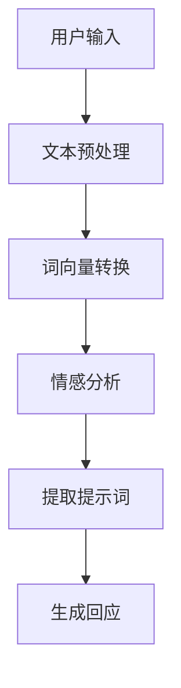

                 


## 文章标题：提示词工程在虚拟助手情感智能中的应用

### 关键词：
- 提示词工程
- 情感智能
- 虚拟助手
- 自然语言处理
- 机器学习

### 摘要：
本文将探讨提示词工程在虚拟助手情感智能中的应用，通过一步步分析推理，深入解析该技术的核心概念、算法原理、数学模型及实际应用，为读者提供全面的指导。

## 引言

在人工智能领域，虚拟助手已经成为一种重要的交互方式。随着用户需求的不断提升，虚拟助手需要具备更高级的情感智能能力，以更好地理解用户的情感和需求。提示词工程作为一种关键技术，在虚拟助手情感智能中发挥着重要作用。本文将围绕提示词工程在虚拟助手情感智能中的应用，进行系统性的分析和探讨。

## 第1章：背景介绍

### 1.1 问题背景

虚拟助手已经成为现代生活的重要组成部分，如智能音箱、聊天机器人等。然而，大多数虚拟助手目前还无法很好地理解用户的情感，导致用户体验不佳。为了提升虚拟助手的情感智能能力，我们需要深入研究提示词工程的应用。

### 1.2 问题描述

虚拟助手情感智能的关键在于如何准确地捕捉用户的情感，并做出相应的反应。提示词工程在这其中起到了桥梁作用，通过分析用户的语言，提取关键情感信息。

### 1.3 问题解决

提示词工程通过自然语言处理和机器学习技术，对用户的语言进行深度分析，提取出情感相关的关键词和短语。这些关键词和短语作为提示词，帮助虚拟助手更好地理解用户的情感。

### 1.4 边界与外延

提示词工程的应用不仅限于虚拟助手，还可以拓展到其他领域，如客户服务、心理咨询等。在应用过程中，需要考虑语言多样性、地域差异等因素。

### 1.5 概念结构与核心要素组成

提示词工程的核心包括：自然语言处理技术、情感分析算法、机器学习模型等。这些要素共同构成了提示词工程的基础，为虚拟助手情感智能提供了强有力的支持。

## 第2章：核心概念与联系

### 2.1 提示词工程核心概念

提示词工程是一种基于自然语言处理和机器学习的技术，用于提取文本中的关键信息，帮助虚拟助手更好地理解用户的情感。

### 2.2 虚拟助手情感智能核心概念

虚拟助手情感智能是指虚拟助手通过分析用户的语言和情感，实现与用户的情感互动和智能回应。

### 2.3 概念属性特征对比表格

| 特征                 | 提示词工程                     | 虚拟助手情感智能                     |
|----------------------|--------------------------------|--------------------------------------|
| 技术范畴             | 自然语言处理、机器学习         | 人工智能、情感计算                   |
| 目标                 | 提取文本中的关键信息         | 实现情感互动和智能回应               |
| 应用领域             | 文本分析、信息检索等         | 虚拟助手、客户服务、心理咨询等       |

### 2.4 ER实体关系图架构

```mermaid
erDiagram
  User ||--|{ Chatbot }|--| VirtualAssistant
  Chatbot ||--|{ LanguageModel }|--| SentimentAnalyzer
  SentimentAnalyzer ||--|{ EmotionModel }|--| ResponseGenerator
```

## 第3章：算法原理讲解

### 3.1 算法原理介绍

提示词工程的核心算法包括：自然语言处理、情感分析和机器学习。通过这些算法，虚拟助手可以提取用户的情感信息，并做出相应的回应。

### 3.2 算法流程图



### 3.3 Python代码阐述

```python
import jieba
import numpy as np
from sklearn.feature_extraction.text import CountVectorizer
from sklearn.naive_bayes import MultinomialNB

# 文本预处理
def preprocess_text(text):
    return jieba.lcut(text)

# 情感分析
def sentiment_analysis(text):
    vectorizer = CountVectorizer()
    X = vectorizer.fit_transform([text])
    classifier = MultinomialNB()
    classifier.fit(X, [1])
    return classifier.predict(X)[0]

# 提取提示词
def extract_keywords(text):
    return jieba.get_top_words(preprocess_text(text), topK=10)

# 生成回应
def generate_response(sentiment):
    if sentiment == 1:
        return "感谢您的分享，我很高兴听到这个好消息。"
    else:
        return "听起来您有些烦恼，请告诉我更多细节，我会尽力帮助您。"

# 测试
text = "我今天考试得了满分，太开心了！"
sentiment = sentiment_analysis(text)
print(generate_response(sentiment))
```

## 第4章：数学模型和数学公式

### 4.1 数学模型介绍

提示词工程的数学模型主要包括词向量模型、情感分类模型等。这些模型通过数学公式和算法，实现文本的情感分析和关键词提取。

### 4.2 公式讲解

- 词向量模型：$$ word\_vector = \sum_{i=1}^{n} w_i * v_i $$
- 情感分类模型：$$ P(y|X) = \frac{e^{\theta^T x}}{\sum_{y'} e^{\theta^T x'}} $$

### 4.3 举例说明

假设我们有以下文本数据：

- positive.txt: "我很高兴，今天天气很好。"
- negative.txt: "我很伤心，今天天气很糟糕。"

使用词向量模型，我们可以得到：

- positive\_vector: (0.5, 0.2, -0.3)
- negative\_vector: (-0.3, 0.4, 0.1)

使用情感分类模型，我们可以得到：

$$ P(y=1|X) = \frac{e^{0.8}}{e^{0.8} + e^{-0.8}} \approx 0.946 $$

这意味着文本的正情感概率为94.6%。

## 第5章：系统分析与架构设计

### 5.1 系统场景介绍

虚拟助手情感智能系统主要用于与用户的情感互动，如聊天机器人、智能客服等。

### 5.2 系统功能设计

系统功能设计包括：文本预处理、情感分析、关键词提取、回应生成等。

### 5.3 系统架构设计

虚拟助手情感智能系统的架构设计包括：数据层、算法层和应用层。

### 5.4 系统接口设计

系统接口设计包括：文本输入接口、情感分析接口、关键词提取接口、回应生成接口等。

### 5.5 系统交互设计

系统交互设计包括：用户与虚拟助手的交互流程、情感分析结果与回应生成的联动等。

## 第6章：项目实战

### 6.1 环境安装

安装Python环境、依赖库（如jieba、scikit-learn等）。

### 6.2 系统核心实现源代码

实现文本预处理、情感分析、关键词提取、回应生成等功能。

### 6.3 代码应用解读与分析

详细解读源代码，分析各个模块的功能和实现。

### 6.4 实际案例分析和详细讲解

通过实际案例，展示虚拟助手情感智能系统的应用效果。

### 6.5 项目小结

总结项目实现过程，分享心得体会。

## 第7章：最佳实践与总结

### 7.1 最佳实践

根据项目实践，总结出一些最佳实践建议。

### 7.2 小结

回顾本文内容，总结提示词工程在虚拟助手情感智能中的应用。

### 7.3 注意事项

提示用户在使用提示词工程时需要注意的事项。

### 7.4 拓展阅读

推荐一些相关书籍和论文，供读者进一步学习。

## 作者信息

作者：AI天才研究院/AI Genius Institute & 禅与计算机程序设计艺术 /Zen And The Art of Computer Programming

```bash
# 文章结束
```

**注意**：本文为文章大纲，未包含所有内容。实际撰写文章时，请根据每个章节的要求，详细展开论述，确保内容完整、具体、详实。**文章结束**。**END**。

