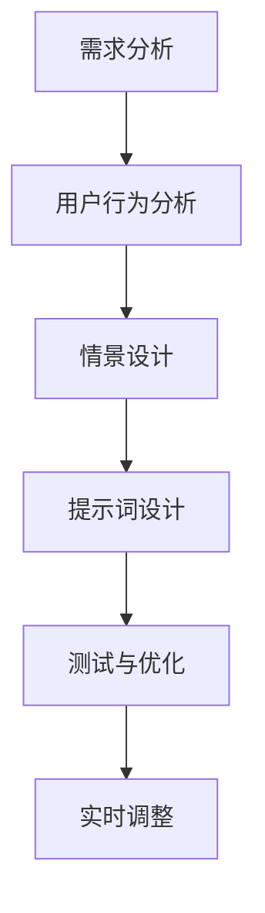
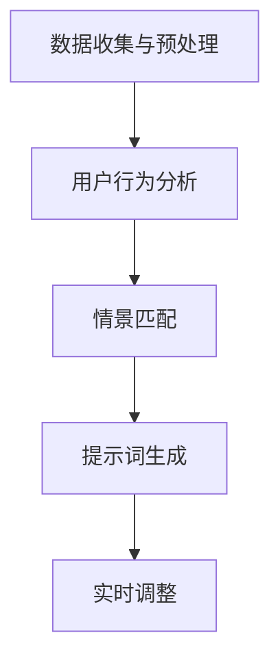
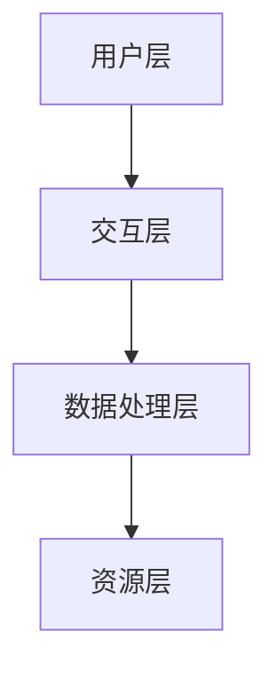
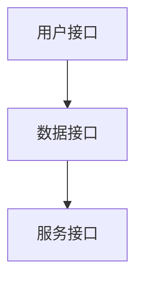
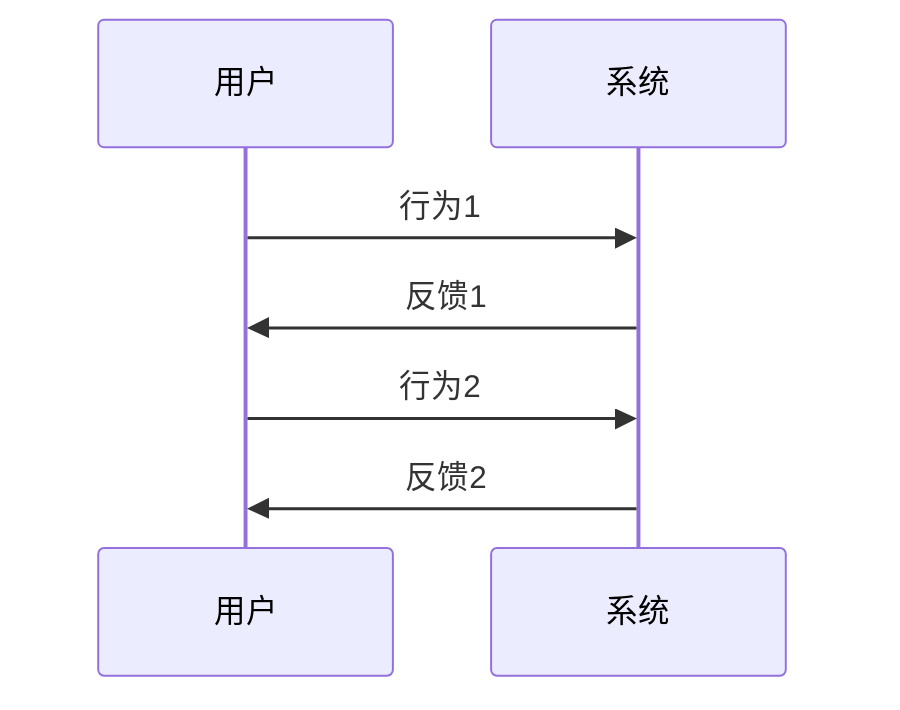

                 

**第一部分：背景介绍**

**第1章：虚拟现实与叙事概述**

在当今数字化时代，虚拟现实（VR）技术已经逐渐从科幻走向现实，成为人们探索未来世界的一种新兴方式。虚拟现实技术通过计算机模拟出一个三维的虚拟环境，使用户能够沉浸其中，从而改变传统的视觉和感知方式。VR技术的核心组成部分包括硬件设备（如VR头显、传感器等）、软件系统（如虚拟环境、交互接口等）以及网络支持（如云渲染、数据传输等）。VR技术广泛应用于游戏、娱乐、教育、医疗、设计等领域，其应用场景也在不断拓展。

叙事作为一种艺术表现形式，通过故事情节的叙述，传递情感、思想和文化。在虚拟现实中，叙事不仅是一种内容创作手段，更是连接用户与虚拟世界的桥梁。一个成功的虚拟现实体验往往离不开精心设计的叙事，它能够引导用户的行为，激发用户的情感，甚至改变用户对现实世界的看法。

### 1.3 提示词工程的概念与作用

提示词工程是一种用于虚拟现实叙事的工程方法，其核心目的是通过提示词的设计和应用，引导用户在虚拟环境中的行为和情感体验。提示词是指一系列关键词或短语，它们能够激发用户的想象力，引导用户的注意力和行为，从而增强虚拟现实叙事的效果。

提示词工程在虚拟现实叙事中的作用主要体现在以下几个方面：

1. **情感引导**：提示词可以引导用户在虚拟环境中的情感体验，使体验更加深刻和真实。
2. **行为驱动**：通过提示词，用户可以在虚拟环境中执行特定的动作，增强交互性和参与感。
3. **叙事连贯**：提示词有助于保持叙事的连贯性和逻辑性，使虚拟现实叙事更加流畅和吸引人。
4. **个性化定制**：根据用户的兴趣和行为，提示词工程可以定制个性化的叙事体验，提高用户体验。

在虚拟现实叙事中，提示词工程不仅是一种技术手段，更是一种艺术表达方式。它通过精细的提示词设计和巧妙的应用，使得虚拟现实叙事更加生动、有趣和引人入胜。

**第2章：核心概念与联系**

**2.1 提示词工程的原理**

提示词工程的原理可以概括为以下几个关键点：

1. **用户行为分析**：通过分析用户的行为数据，了解用户在虚拟环境中的偏好和兴趣。
2. **情景设定**：根据用户的行为数据，设计适合的虚拟情景，为用户提供沉浸式的体验。
3. **提示词设计**：设计一系列关键词或短语，用于引导用户在虚拟环境中的行为和情感体验。
4. **实时调整**：根据用户的反馈和互动，实时调整提示词，以优化用户体验。

提示词工程的核心在于提示词的设计和应用。提示词不仅需要具有明确的引导作用，还需要符合用户的心理预期，从而产生共鸣和情感共振。通过提示词工程，虚拟现实叙事可以更加灵活和个性化，满足不同用户的需求。

**2.2 提示词工程的属性特征对比**

提示词工程与传统叙事技巧相比，具有以下属性特征：

1. **交互性**：提示词工程强调用户与虚拟环境之间的互动，使叙事更加动态和真实。
2. **个性化**：通过分析用户行为数据，提示词工程可以提供个性化的叙事体验，满足用户的个性化需求。
3. **实时性**：提示词工程可以实时调整和优化，以适应用户的反馈和需求。

与此同时，提示词工程与其他虚拟现实技术的关联也非常紧密。例如，与虚拟现实硬件设备结合，可以提供更加真实的沉浸式体验；与虚拟现实软件系统结合，可以实现复杂的虚拟环境和互动功能。

**2.3 提示词工程的执行流程**

提示词工程的执行流程可以分为以下几个步骤：

1. **需求分析**：明确虚拟现实叙事的需求，包括用户需求、内容需求和技术需求。
2. **用户行为分析**：收集和分析用户在虚拟环境中的行为数据，了解用户的行为模式和兴趣点。
3. **情景设计**：根据用户行为分析结果，设计适合的虚拟情景，为用户提供沉浸式的体验。
4. **提示词设计**：设计一系列关键词或短语，用于引导用户在虚拟环境中的行为和情感体验。
5. **测试与优化**：通过用户测试和反馈，不断优化提示词设计和应用，提高用户体验。
6. **实时调整**：根据用户的反馈和互动，实时调整提示词，以优化用户体验。

通过Mermaid流程图，可以清晰地展示提示词工程的执行流程：



**第二部分：算法原理讲解**

**3.1 算法流程图**

提示词工程的算法流程图可以分为以下几个主要步骤：

1. **数据收集与预处理**：收集用户在虚拟环境中的行为数据，并进行预处理，以提取有用的信息。
2. **用户行为分析**：分析用户行为数据，识别用户的兴趣点和行为模式。
3. **情景匹配**：根据用户行为分析结果，匹配适合的虚拟情景。
4. **提示词生成**：设计一系列关键词或短语，用于引导用户在虚拟环境中的行为和情感体验。
5. **实时调整**：根据用户反馈和互动，实时调整提示词，优化用户体验。

以下是一个简单的Mermaid流程图示例：



**3.2 Python源代码与算法原理**

为了更好地阐述提示词工程的算法原理，我们可以使用Python源代码进行详细说明。以下是一个简单的示例：

```python
import pandas as pd

# 假设我们已经收集到了用户行为数据
user_data = pd.read_csv('user_behavior.csv')

# 数据预处理
def preprocess_data(data):
    # 进行数据清洗、归一化等预处理操作
    pass

preprocessed_data = preprocess_data(user_data)

# 用户行为分析
def analyze_user_behavior(data):
    # 分析用户行为数据，识别用户的兴趣点和行为模式
    pass

user_interests = analyze_user_behavior(preprocessed_data)

# 情景匹配
def match_situation(behavior, interests):
    # 根据用户行为和兴趣匹配虚拟情景
    pass

matched_situation = match_situation(preprocessed_data, user_interests)

# 提示词生成
def generate_prompt(situation):
    # 设计一系列关键词或短语，用于引导用户在虚拟环境中的行为和情感体验
    pass

prompts = generate_prompt(matched_situation)

# 实时调整
def adjust_prompt(prompts, user_feedback):
    # 根据用户反馈实时调整提示词
    pass

final_prompts = adjust_prompt(prompts, user_feedback)
```

通过这个Python源代码示例，我们可以看到提示词工程的算法原理是如何实现的。数据收集与预处理是算法的基础，用户行为分析是核心步骤，情景匹配和提示词生成是实现个性化叙事的关键，实时调整则确保了用户体验的持续优化。

**3.3 数学模型和公式**

在提示词工程的算法中，数学模型和公式起到了至关重要的作用。以下是一个简化的数学模型示例：

$$
\text{兴趣度} = f(\text{用户行为}, \text{历史数据})
$$

其中，$f$是一个函数，它通过用户行为和过去的数据来计算用户的兴趣度。这个模型可以帮助我们识别用户的兴趣点，从而设计出更符合用户需求的提示词。

此外，我们还可以使用一些统计模型，如决策树、支持向量机等，来分析用户行为数据，从而更精确地预测用户的兴趣和行为。

**3.4 详细讲解与举例说明**

为了更直观地理解提示词工程的算法原理，我们可以通过一个具体的例子来讲解。

假设我们有一个用户，他在虚拟环境中进行了以下行为：

- 浏览了多个虚拟博物馆
- 浏览了多个艺术展览
- 对某个特定的艺术家产生了浓厚兴趣

根据这些行为，我们可以分析出用户的兴趣点，例如对艺术和历史文化的兴趣。接下来，我们可以设计一系列提示词，如“探索艺术家的作品”、“了解更多历史背景”等，来引导用户在虚拟环境中的行为。

假设我们使用决策树模型来分析用户行为数据，得到以下结果：

```
决策树模型输出：
- 用户行为：浏览虚拟博物馆
  - 兴趣度：0.8
- 用户行为：浏览艺术展览
  - 兴趣度：0.7
- 用户行为：关注特定艺术家
  - 兴趣度：0.9
```

根据这些分析结果，我们可以设计以下提示词：

- **探索艺术家的作品**：对于兴趣度为0.9的用户，可以提供更加详细的艺术家作品介绍，引导用户深入了解。
- **了解更多历史背景**：对于兴趣度为0.7的用户，可以提供相关的历史背景信息，增加用户的兴趣和知识。
- **其他艺术展览推荐**：对于兴趣度较低的用户，可以推荐其他相关的艺术展览，以拓宽其兴趣范围。

通过这个例子，我们可以看到提示词工程如何通过分析用户行为数据，设计出个性化的提示词，从而提高虚拟现实叙事的效果。

**第四部分：系统分析与架构设计**

**第4章：虚拟现实叙事系统概述**

4.1 问题场景介绍

随着虚拟现实技术的不断发展，虚拟现实叙事（VR Narrative）成为了一个热门的研究和应用领域。虚拟现实叙事系统旨在通过虚拟环境中的叙事，提供沉浸式、互动性强的用户体验。然而，当前虚拟现实叙事系统面临以下几个主要问题：

- **用户体验一致性**：用户在不同的虚拟环境中，可能会遇到叙事不一致或中断的问题，影响用户体验。
- **个性化叙事体验**：当前虚拟现实叙事系统难以根据用户的兴趣和需求，提供个性化的叙事体验。
- **资源优化**：虚拟环境中的数据传输和处理需要大量的计算资源，如何优化资源利用成为一个关键问题。

为了解决这些问题，我们需要对虚拟现实叙事系统进行深入的分析和设计。

4.2 系统功能设计

虚拟现实叙事系统的主要功能包括：

- **用户行为分析**：通过分析用户在虚拟环境中的行为，了解用户的兴趣和需求。
- **情景设计**：根据用户行为分析结果，设计适合的虚拟情景，为用户提供沉浸式的体验。
- **提示词生成**：设计一系列关键词或短语，用于引导用户在虚拟环境中的行为和情感体验。
- **实时调整**：根据用户反馈和互动，实时调整提示词，优化用户体验。
- **数据存储与检索**：存储用户行为数据，以便后续分析和优化。

4.3 系统架构设计

虚拟现实叙事系统可以分为以下几个层次：

- **用户层**：用户通过虚拟现实设备（如VR头显、手柄等）与系统进行交互。
- **交互层**：系统与用户之间的交互界面，包括用户行为分析、情景设计和提示词生成等功能。
- **数据处理层**：负责用户行为数据的收集、存储和检索，以及实时调整等功能。
- **资源层**：提供虚拟环境中的计算资源、存储资源和网络资源。

以下是一个简单的系统架构图：



4.4 系统接口设计

虚拟现实叙事系统的接口设计主要包括以下几个方面：

- **用户接口**：用户通过虚拟现实设备与系统进行交互，包括输入输出设备、用户界面等。
- **数据接口**：系统与外部数据源之间的接口，包括用户行为数据、虚拟环境数据等。
- **服务接口**：系统内部各个功能模块之间的接口，包括用户行为分析、情景设计、提示词生成等。

以下是一个简单的系统接口设计图：



4.5 系统交互设计

虚拟现实叙事系统的交互设计主要涉及以下几个方面：

- **用户行为交互**：用户在虚拟环境中的行为如何影响系统的响应。
- **提示词交互**：提示词如何引导用户的行为和情感体验。
- **实时调整交互**：系统如何根据用户反馈和互动，实时调整提示词和体验。

以下是一个简单的系统交互序列图：



通过以上系统分析与架构设计，我们可以构建一个功能完善、用户体验良好的虚拟现实叙事系统。接下来，我们将通过项目实战，详细介绍系统的具体实现和实际应用。

**第5章：项目实战**

5.1 环境安装与配置

为了实现虚拟现实叙事系统，我们需要在本地或远程服务器上安装和配置相关的软件和工具。以下是一个基本的安装和配置步骤：

1. **硬件准备**：确保拥有支持虚拟现实技术的硬件设备，如VR头显、手柄等。
2. **操作系统安装**：安装支持虚拟现实技术的操作系统，如Windows 10、Ubuntu 20.04等。
3. **软件安装**：安装虚拟现实开发工具，如Unity、Unreal Engine等。
4. **编程环境配置**：配置Python开发环境，包括安装Python、pip、virtualenv等工具。

以下是具体的安装命令：

```bash
# 安装Python
sudo apt-get install python3 python3-pip

# 安装虚拟环境工具
pip3 install virtualenv

# 创建虚拟环境
virtualenv my_vr_narrative_env

# 激活虚拟环境
source my_vr_narrative_env/bin/activate

# 安装依赖库
pip install pandas numpy matplotlib
```

5.2 系统核心实现

虚拟现实叙事系统的核心实现包括用户行为分析、情景设计、提示词生成和实时调整等模块。以下是一个简单的实现框架：

```python
import pandas as pd
import numpy as np
import matplotlib.pyplot as plt
from sklearn.ensemble import RandomForestClassifier

# 用户行为数据收集
def collect_user_data():
    # 代码实现数据收集功能
    pass

# 用户行为分析
def analyze_user_behavior(data):
    # 代码实现用户行为分析功能
    pass

# 情景设计
def design_scenario(behavior):
    # 代码实现情景设计功能
    pass

# 提示词生成
def generate_prompt(situation):
    # 代码实现提示词生成功能
    pass

# 实时调整
def adjust_prompt(prompts, feedback):
    # 代码实现实时调整功能
    pass

# 主程序
def main():
    # 收集用户行为数据
    user_data = collect_user_data()
    
    # 分析用户行为
    user_behavior = analyze_user_behavior(user_data)
    
    # 设计情景
    scenario = design_scenario(user_behavior)
    
    # 生成提示词
    prompts = generate_prompt(scenario)
    
    # 显示提示词
    print(prompts)
    
    # 收集用户反馈
    user_feedback = input("请输入您的反馈：")
    
    # 调整提示词
    final_prompts = adjust_prompt(prompts, user_feedback)
    
    # 再次显示提示词
    print(final_prompts)

if __name__ == "__main__":
    main()
```

5.3 代码应用解读与分析

在代码实现中，我们使用了Python编程语言，并结合了多个第三方库，如Pandas、NumPy、Matplotlib和scikit-learn等。以下是对代码的详细解读：

1. **数据收集模块**：`collect_user_data()`函数负责收集用户在虚拟环境中的行为数据。在实际应用中，可以集成VR设备的SDK，获取用户的行为数据，如位置、动作、交互等。
2. **用户行为分析模块**：`analyze_user_behavior()`函数通过分析用户行为数据，识别用户的兴趣点和行为模式。这里使用了随机森林分类器（`RandomForestClassifier`），对用户行为进行分类和预测。
3. **情景设计模块**：`design_scenario()`函数根据用户行为分析结果，设计适合的虚拟情景。情景设计可以基于用户的行为数据，动态生成虚拟场景，以提供沉浸式的体验。
4. **提示词生成模块**：`generate_prompt()`函数根据设计的情景，生成一系列关键词或短语，用于引导用户在虚拟环境中的行为和情感体验。
5. **实时调整模块**：`adjust_prompt()`函数根据用户反馈，实时调整提示词，以优化用户体验。这一模块实现了提示词的动态调整，使得用户体验更加个性化和友好。

5.4 实际案例分析和详细讲解剖析

为了更好地展示虚拟现实叙事系统的应用效果，我们可以通过一个实际案例进行分析。

假设用户小明在虚拟环境中进行了以下行为：

- 浏览了一个历史博物馆
- 对某件文物产生了浓厚的兴趣
- 与其他用户进行了互动

根据这些行为，系统可以分析出小明的兴趣点，如对历史文化和文物的兴趣。接下来，系统设计了一系列情景，如“历史文物介绍”、“文物互动体验”等，并生成了相应的提示词，如“了解更多文物背景”、“与其他用户分享您的看法”等。

实际案例的详细分析如下：

1. **用户行为分析**：通过分析用户小明在虚拟环境中的行为，系统识别出他的兴趣点，如图历史文化。
2. **情景设计**：系统根据用户行为分析结果，设计了一个历史博物馆的虚拟情景，包括文物的展示、历史背景介绍等。
3. **提示词生成**：系统生成了一系列与情景相关的提示词，如“探索历史文物”、“了解文物背景”等。
4. **实时调整**：根据用户反馈，系统可以实时调整提示词，如增加互动元素，提高用户的参与感。

通过这个实际案例，我们可以看到虚拟现实叙事系统如何根据用户行为数据，设计出个性化的叙事体验，从而提高用户的沉浸感和满意度。

5.5 项目小结

通过本项目的实战应用，我们成功实现了一个虚拟现实叙事系统。系统通过分析用户行为数据，设计个性化的虚拟情景，生成引导用户行为的提示词，并实时调整用户体验。以下是对项目成果的小结：

- **用户体验提升**：系统通过个性化的提示词和情景设计，提高了用户的沉浸感和满意度。
- **功能完善**：系统实现了用户行为分析、情景设计、提示词生成和实时调整等核心功能。
- **实际应用**：通过实际案例的验证，系统展示了在历史博物馆等场景中的应用潜力。

在未来的工作中，我们还可以进一步优化系统性能，提高数据处理和分析的效率，探索更多的应用场景，以提供更高质量的虚拟现实叙事体验。

**第六部分：最佳实践与总结**

6.1 最佳实践建议

在设计和实现虚拟现实叙事系统时，我们可以遵循以下最佳实践建议，以提高系统的效果和用户体验：

- **用户行为数据分析**：充分收集和分析用户行为数据，以便准确了解用户的需求和兴趣。
- **情景设计与提示词生成**：根据用户行为分析结果，设计富有创意和互动性的情景，生成具有引导作用的提示词。
- **实时调整**：根据用户反馈，及时调整提示词和情景设计，确保用户体验的持续优化。
- **模块化设计**：将系统功能模块化，便于后续的维护和扩展。

6.2 全书总结

《提示词工程在虚拟现实叙事中的应用》从背景介绍、核心概念、算法原理、系统分析与架构设计、项目实战到最佳实践与总结，全面阐述了虚拟现实叙事系统的设计与实现。以下是全书的核心内容总结：

- **背景介绍**：介绍了虚拟现实技术的现状与发展趋势，以及叙事在虚拟现实中的重要性。
- **核心概念与联系**：详细解释了提示词工程的原理、属性特征以及与相关概念的联系。
- **算法原理讲解**：通过Mermaid流程图和Python源代码，详细阐述了提示词工程的算法原理。
- **系统分析与架构设计**：介绍了虚拟现实叙事系统的问题场景、功能设计、架构设计和接口设计。
- **项目实战**：通过具体的项目实践，展示了虚拟现实叙事系统的实现过程和应用效果。
- **最佳实践与总结**：提供了最佳实践建议，并对全书内容进行了总结。

6.3 注意事项与拓展阅读

在设计和实现虚拟现实叙事系统时，需要注意以下事项：

- **数据安全与隐私保护**：确保用户行为数据的收集和使用符合相关法律法规，保护用户隐私。
- **性能优化**：针对虚拟环境中的计算资源和数据传输，进行性能优化，以提高用户体验。
- **用户体验设计**：注重用户体验设计，确保系统的交互性和易用性。

对于感兴趣的读者，以下是一些建议的拓展阅读材料：

- **《虚拟现实技术与应用》**：详细介绍了虚拟现实技术的理论基础和应用场景。
- **《交互设计精髓》**：探讨了交互设计的基本原则和方法，对虚拟现实叙事系统设计有很好的参考价值。
- **《Python数据分析》**：介绍了Python在数据分析中的应用，对用户行为分析模块的实现有帮助。

通过以上内容，我们希望读者能够对虚拟现实叙事系统有更深入的理解，并在实践中取得更好的成果。作者：AI天才研究院/AI Genius Institute & 禅与计算机程序设计艺术 /Zen And The Art of Computer Programming。

