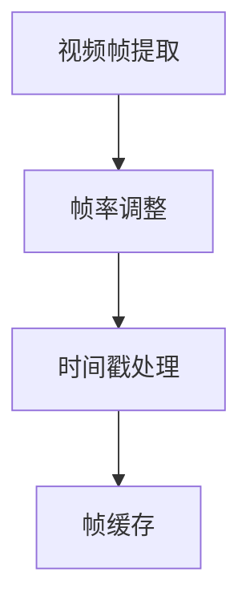
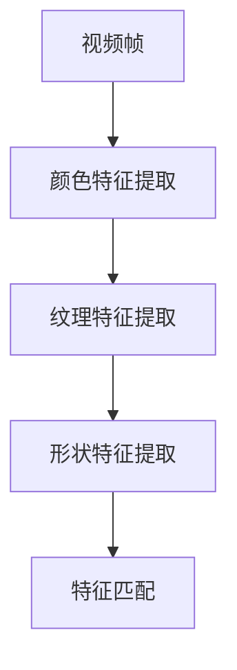
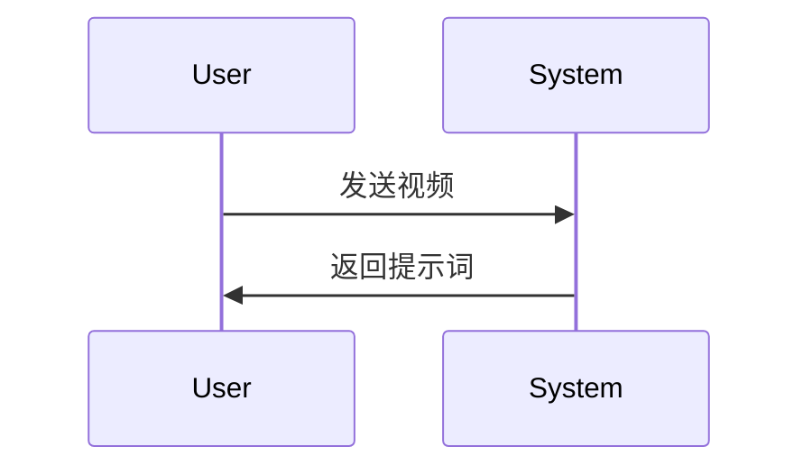
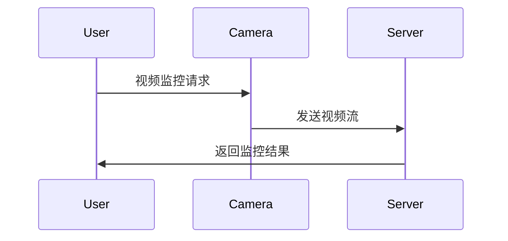

                 

### 第1章 引言

#### 1.1 问题的背景

视频分析作为人工智能领域的一个重要分支，已经在诸多行业如安防监控、智能交通、医疗影像诊断等得到了广泛应用。然而，随着视频数据的爆炸式增长，如何有效地处理和分析这些海量数据成为一个亟待解决的问题。传统的视频分析算法在处理复杂场景、实时性需求等方面存在较大挑战。此时，提示词工程作为一种创新的技术手段，逐渐成为视频分析任务中的一种有效解决方案。

视频分析面临的挑战主要包括：

1. **数据量巨大**：视频数据的规模持续增长，对存储和计算资源提出了高要求。
2. **实时性要求**：许多视频分析任务需要在短时间内处理并输出结果，这对算法的实时性提出了严格的要求。
3. **多模态数据**：视频包含多种信息，如视觉、音频等，如何有效地融合这些信息是一个难题。
4. **场景复杂性**：现实世界的场景复杂多变，算法需要具备较强的鲁棒性和适应性。

提示词工程的概念与重要性：

提示词工程（Keyword Engineering）是一种通过设计和构建特定领域的词汇表来提高计算机程序处理特定领域语言信息能力的方法。在视频分析任务中，提示词工程可以通过以下方式提高视频分析的效率和准确性：

1. **明确任务需求**：通过定义和优化提示词，明确视频分析的任务需求，确保算法能够专注于核心任务。
2. **提高识别准确性**：通过对提示词的细粒度划分和优化，提高视频分析算法的识别准确性。
3. **减少计算量**：通过缩小分析范围，减少不必要的计算，提高实时处理的效率。
4. **增强系统适应性**：通过丰富的提示词库，使视频分析系统能够适应不同的应用场景。

#### 1.2 问题的描述

视频分析中的需求分析：

视频分析任务通常涉及多个层面，如目标检测、行为识别、事件分析等。具体需求分析包括：

1. **目标检测**：识别视频中的特定对象，如行人、车辆等。
2. **行为识别**：分析视频中的行为模式，如行走、奔跑、挥手等。
3. **事件分析**：根据特定条件分析视频中的事件，如交通事故、人群聚集等。

提示词工程的目标与作用：

提示词工程在视频分析任务中的目标包括：

1. **定义任务域**：通过提示词明确视频分析的任务领域，确保算法能够准确识别和处理特定任务。
2. **优化算法性能**：通过提示词优化，提高视频分析算法的准确性和效率。
3. **提高用户体验**：通过提示词工程，使视频分析结果更加准确，提高用户体验。

#### 1.3 问题解决思路

提示词工程的方法论：

提示词工程的方法论包括以下几个关键步骤：

1. **需求分析**：明确视频分析任务的需求，定义核心任务和目标。
2. **词汇表构建**：构建包含关键术语和概念的词汇表，为后续的提示词生成提供基础。
3. **提示词生成**：根据需求和分析结果，生成具体的提示词，并进行分类和标注。
4. **提示词优化**：通过反馈和调整，不断优化提示词的精度和覆盖范围。

提示词生成与优化策略：

1. **语义分析**：利用自然语言处理技术对文本进行语义分析，提取关键信息作为提示词。
2. **用户反馈**：收集用户反馈，根据反馈调整和优化提示词。
3. **数据驱动的优化**：通过大数据分析和机器学习算法，动态调整和优化提示词。
4. **多轮迭代**：通过多轮迭代，逐步优化提示词，提高整体性能。

#### 1.4 边界与外延

视频分析任务的分类：

视频分析任务可以分为以下几类：

1. **对象识别**：识别视频中的特定对象，如行人、车辆等。
2. **行为分析**：分析视频中的行为模式，如行走、奔跑、挥手等。
3. **事件检测**：根据特定条件分析视频中的事件，如交通事故、人群聚集等。
4. **情感分析**：分析视频中的情感表达，如快乐、悲伤等。

提示词工程的适用范围：

提示词工程适用于多种视频分析任务，包括但不限于：

1. **安防监控**：用于识别和检测异常行为，提高安防监控的准确性。
2. **智能交通**：用于实时监测交通状况，提高交通管理的效率和安全性。
3. **医疗影像**：用于辅助医生分析影像资料，提高诊断的准确性。
4. **智能助手**：用于理解用户需求，提供个性化的视频推荐服务。

#### 1.5 概念结构与核心要素组成

提示词的构成要素：

提示词由以下几个要素构成：

1. **关键词**：表示视频分析任务中的核心概念或对象。
2. **属性**：对关键词的补充描述，如颜色、大小、形状等。
3. **关系**：描述关键词之间的关系，如“行人”与“车辆”的关系。
4. **上下文**：指关键词在特定场景或上下文中的应用。

视频分析任务中的关键步骤：

视频分析任务中的关键步骤包括：

1. **需求分析**：明确分析任务的需求和目标。
2. **数据准备**：收集和准备用于分析的视频数据。
3. **提示词生成**：根据需求生成具体的提示词。
4. **模型训练**：利用提示词训练视频分析模型。
5. **模型评估**：对训练好的模型进行评估和优化。
6. **任务执行**：执行视频分析任务，输出分析结果。

### 总结

本文介绍了提示词工程在视频分析任务中的应用。通过需求分析、词汇表构建、提示词生成和优化等步骤，提示词工程能够有效提高视频分析任务的准确性和效率。在接下来的章节中，我们将进一步探讨提示词工程的基础理论、视频分析算法原理、系统分析与架构设计以及项目实战等内容。

---

# 《提示词工程在视频分析任务中的应用》

关键词：视频分析、提示词工程、需求分析、算法优化、系统架构

> 摘要：本文首先介绍了视频分析任务面临的挑战和提示词工程的概念与重要性。接着，详细描述了视频分析中的需求分析、提示词工程的目标与作用，并提出了提示词工程的方法论。文章还探讨了提示词工程的边界与外延、概念结构与核心要素组成，为后续深入讨论提示词工程在视频分析中的应用奠定了基础。

---

## 第2章 提示词工程基础

### 2.1 核心概念原理

#### 提示词的定义与类型

提示词（Keyword）是视频分析任务中的核心概念，用于描述视频中的特定对象、行为或事件。根据用途和粒度，提示词可以分为以下几种类型：

1. **基础提示词**：直接描述视频中的基本对象或行为，如“行人”、“车辆”、“奔跑”等。
2. **属性提示词**：描述对象的属性，如“穿红色衣服的行人”、“小型车辆”等。
3. **组合提示词**：由多个基础提示词或属性提示词组合而成，如“穿红色衣服的行人聚集”、“交通事故现场”等。

#### 提示词在视频分析中的应用

在视频分析中，提示词扮演着至关重要的角色，其主要应用包括：

1. **任务定义**：提示词帮助明确视频分析的任务和目标，如目标检测、行为识别、事件分析等。
2. **模型训练**：提示词用于训练视频分析模型，提高模型的识别准确性和泛化能力。
3. **结果评估**：提示词用于评估视频分析结果的准确性和有效性。
4. **用户交互**：提示词提供用户与视频分析系统之间的交互接口，便于用户理解分析结果。

### 2.2 概念属性特征对比表格

为了更好地理解提示词的不同类型和特征，我们通过以下表格进行对比：

| 特征             | 举例                      |
|-----------------|--------------------------|
| 明确性           | “行人检测”               |
| 具体性           | “穿红色衣服的行人”       |
| 扩展性           | “人群聚集”               |

#### 特征说明

1. **明确性**：明确性指提示词能够准确描述视频中的对象或行为，如“行人检测”明确指出了分析任务的目标。
2. **具体性**：具体性指提示词能够详细描述对象的属性或特征，如“穿红色衣服的行人”具体指出了行人的颜色特征。
3. **扩展性**：扩展性指提示词能够涵盖多种相关对象或行为，如“人群聚集”可以用于描述多种形式的群体行为。

### 2.3 ER实体关系图架构

在视频分析任务中，提示词与其他实体之间存在复杂的关联关系。通过ER（实体关系）图，我们可以清晰地描述这些实体及其关系。

以下是一个简化的ER实体关系图：

```mermaid
erDiagram
  Person ||--|{ Video }||>
  Video ||--|{ Annotation }||>
  Annotation ||--|{ Keyword }||>
```

#### ER实体关系图说明

1. **Person（人）**：表示参与视频分析的任务主体，如监控人员、用户等。
2. **Video（视频）**：表示需要进行分析的视频数据。
3. **Annotation（标注）**：表示对视频数据的标注信息，如目标位置、行为等。
4. **Keyword（提示词）**：表示用于描述视频分析任务的提示词。

通过ER实体关系图，我们可以直观地了解视频分析任务中各实体之间的关系，为后续的系统架构设计和功能实现提供基础。

---

## 第3章 视频分析算法原理

### 3.1 算法原理讲解

视频分析算法是通过对视频数据进行处理和分析，实现特定视频分析任务的方法。以下将介绍视频分析算法的基本原理，主要包括视频帧提取和特征提取。

#### 3.1.1 视频帧提取

视频帧提取是视频分析算法的第一步，其核心任务是获取视频序列中的每一帧图像。具体流程如下：

1. **视频读取**：读取视频文件，获取视频的帧率、分辨率等基本信息。
2. **帧率调整**：根据需求对视频帧率进行调整，如降低帧率以提高处理效率。
3. **时间戳处理**：为每一帧图像添加时间戳，便于后续的视频帧管理和时间同步。
4. **帧缓存**：缓存处理后的帧数据，以供后续特征提取和任务处理使用。

以下是一个简化的视频帧提取流程的Mermaid流程图：



#### 3.1.2 特征提取

特征提取是视频分析算法的核心步骤，其目标是提取视频帧中的关键特征，用于后续的任务处理和模型训练。特征提取方法主要包括以下几种：

1. **颜色特征提取**：通过计算视频帧的颜色直方图、颜色矩等特征，描述图像的颜色分布和颜色结构。
2. **纹理特征提取**：通过计算视频帧的纹理特征，如纹理能量、纹理方向等，描述图像的纹理信息。
3. **形状特征提取**：通过计算视频帧的形状特征，如边缘、轮廓等，描述图像的形状信息。

以下是一个简化的特征提取方法的Mermaid流程图：



#### 3.1.3 特征匹配策略

特征匹配是视频分析算法的关键步骤，其目标是根据提取的特征，判断视频帧中是否存在特定的目标或事件。特征匹配方法主要包括以下几种：

1. **基于欧氏距离的特征匹配**：计算特征向量之间的欧氏距离，根据距离阈值判断特征向量是否匹配。
2. **基于余弦相似度的特征匹配**：计算特征向量之间的余弦相似度，根据相似度阈值判断特征向量是否匹配。
3. **基于聚类的方法**：通过聚类算法对特征向量进行分组，根据聚类结果判断特征向量是否匹配。

特征匹配的数学模型和公式如下：

$$
\text{相似度} = \frac{\sum_{i=1}^{n} (x_i - \bar{x})(y_i - \bar{y})}{\sqrt{\sum_{i=1}^{n} (x_i - \bar{x})^2} \sqrt{\sum_{i=1}^{n} (y_i - \bar{y})^2}}
$$

其中，$x_i$和$y_i$分别表示两个特征向量中的第$i$个元素，$\bar{x}$和$\bar{y}$分别表示两个特征向量的平均值。

#### 3.1.4 算法举例说明

以下通过两个常见的视频分析算法举例，说明算法原理和具体实现。

**1. 行人检测算法**

行人检测是视频分析中的一个重要任务，其目标是从视频序列中检测并识别行人。行人检测算法主要包括以下步骤：

1. **目标检测**：使用目标检测算法（如YOLO、SSD、Faster R-CNN等）对视频帧进行目标检测，提取行人区域。
2. **特征提取**：对行人区域进行特征提取，如颜色特征、纹理特征等。
3. **特征匹配**：将提取的特征与已知的行人特征库进行匹配，判断行人是否出现。
4. **结果输出**：将行人检测结果输出，如行人位置、行人轨迹等。

**2. 人群聚集检测算法**

人群聚集检测是另一个常见的视频分析任务，其目标是从视频序列中检测并识别人群聚集事件。人群聚集检测算法主要包括以下步骤：

1. **目标检测**：使用目标检测算法对视频帧进行目标检测，提取人群区域。
2. **特征提取**：对人群区域进行特征提取，如形状特征、纹理特征等。
3. **事件识别**：根据提取的特征和事件定义，判断人群是否聚集。
4. **结果输出**：将人群聚集检测结果输出，如人群聚集位置、人群聚集时间等。

### 3.2 数学模型与公式

在视频分析算法中，数学模型和公式起到了关键作用，以下列举几个常见的数学模型和公式：

**1. 欧氏距离**

欧氏距离是衡量两个特征向量之间差异的一种方法，其公式如下：

$$
d(E, F) = \sqrt{\sum_{i=1}^{n} (e_i - f_i)^2}
$$

其中，$e_i$和$f_i$分别表示两个特征向量中的第$i$个元素。

**2. 余弦相似度**

余弦相似度是衡量两个特征向量之间相似程度的一种方法，其公式如下：

$$
\cos(\theta) = \frac{\sum_{i=1}^{n} x_i y_i}{\sqrt{\sum_{i=1}^{n} x_i^2} \sqrt{\sum_{i=1}^{n} y_i^2}}
$$

其中，$x_i$和$y_i$分别表示两个特征向量中的第$i$个元素。

**3. 支持向量机（SVM）**

支持向量机是一种常用的分类算法，其目标是在特征空间中找到一个最优的超平面，将不同类别的特征向量分隔开来。其公式如下：

$$
\text{w}^T \text{x} - \text{b} = 0
$$

其中，$\text{w}$表示超平面的法向量，$\text{x}$表示特征向量，$\text{b}$表示偏置。

### 3.3 算法举例说明

以下通过两个具体的算法实例，详细讲解算法原理和实现过程。

**1. YOLO（You Only Look Once）算法**

YOLO是一种流行的目标检测算法，其核心思想是将目标检测任务转化为一个单一的卷积神经网络（CNN）进行预测。YOLO算法的主要步骤如下：

1. **网络结构**：YOLO算法采用深度卷积神经网络（DCNN）结构，包括卷积层、池化层、全连接层等。
2. **特征提取**：通过卷积层和池化层，提取视频帧中的特征。
3. **目标预测**：通过全连接层和预测层，预测目标的位置、大小和类别。
4. **后处理**：对预测结果进行非极大值抑制（NMS）等后处理操作，得到最终的检测结果。

**2. HOG（Histogram of Oriented Gradients）算法**

HOG算法是一种常用的目标检测算法，其核心思想是通过计算图像中每个像素点的梯度方向和强度，生成直方图，从而描述图像的特征。HOG算法的主要步骤如下：

1. **梯度计算**：计算图像中每个像素点的梯度方向和强度。
2. **直方图生成**：将梯度方向和强度转化为直方图，描述图像的特征。
3. **特征匹配**：将生成的直方图与已知的特征库进行匹配，判断目标是否出现。
4. **结果输出**：将目标检测结果输出，如目标位置、目标大小等。

通过以上两个算法实例，我们可以看到，不同的视频分析算法在原理和实现上有所不同，但都遵循着提取特征、匹配特征、输出结果的基本流程。在实际应用中，可以根据具体需求选择合适的算法，并对其进行优化和改进，以提高视频分析的性能和效果。

---

## 第4章 系统分析与架构设计

### 4.1 问题场景介绍

视频监控作为现代安全防范系统的重要组成部分，广泛应用于公共安全、交通管理、商业监控等领域。随着视频监控技术的不断进步，如何高效地处理和分析海量视频数据，实现实时监控和智能预警，成为了一个关键问题。

在视频监控系统的发展过程中，传统的基于人眼监视的方式已经无法满足日益增长的监控需求。现代视频监控系统通常需要具备以下功能：

1. **实时监控**：能够实时捕捉和处理视频数据，确保监控的实时性和有效性。
2. **目标检测**：能够识别并跟踪视频中的特定对象，如行人、车辆等。
3. **行为分析**：能够分析视频中的行为模式，如人群聚集、异常行为等。
4. **事件检测**：能够根据预设条件，识别并标记特定的事件，如交通事故、入侵等。
5. **数据存储**：能够高效地存储和处理大量的视频数据，确保数据的安全性和可追溯性。

在这样的背景下，提示词工程作为一种创新的技术手段，在视频监控系统中发挥着越来越重要的作用。通过设计合理的提示词，可以明确视频监控的任务需求，优化算法性能，提高系统的智能化水平。

### 4.2 系统功能设计

视频监控系统的主要功能可以划分为以下几个模块：

1. **视频采集模块**：负责采集视频数据，包括摄像头、视频文件等。
2. **预处理模块**：对采集到的视频数据进行预处理，如去噪、去闪烁、帧率调整等。
3. **特征提取模块**：对预处理后的视频帧进行特征提取，如颜色特征、纹理特征、形状特征等。
4. **提示词生成模块**：根据视频分析任务的需求，生成具体的提示词，并进行分类和标注。
5. **分析模块**：利用提示词和特征提取结果，对视频数据进行分析和识别，如目标检测、行为分析、事件检测等。
6. **结果输出模块**：将分析结果以图形、表格等形式输出，供监控人员查看和决策。

以下是一个简化的系统功能设计类图：

```mermaid
classDiagram
Class01 <|-- Class02
Class03 : Class04
Class05 {name}
```

### 4.2.2 系统架构设计

视频监控系统的架构设计需要考虑系统的可扩展性、可靠性和性能。以下是一个简化的系统架构设计：


#### 系统架构说明

1. **视频输入**：系统通过摄像头或其他视频源获取视频数据。
2. **预处理模块**：对视频数据进行预处理，如去噪、去闪烁、帧率调整等，以提高后续分析的质量。
3. **特征提取模块**：对预处理后的视频帧进行特征提取，如颜色特征、纹理特征、形状特征等，为分析模块提供数据支持。
4. **提示词生成模块**：根据视频分析任务的需求，生成具体的提示词，并进行分类和标注，以指导分析模块的工作。
5. **分析模块**：利用提示词和特征提取结果，对视频数据进行分析和识别，如目标检测、行为分析、事件检测等。
6. **结果输出模块**：将分析结果以图形、表格等形式输出，供监控人员查看和决策。

### 4.2.3 系统接口设计

视频监控系统需要提供一系列接口，以便与其他系统进行交互。以下是一个简化的系统接口设计：



#### 接口设计说明

1. **用户接口**：用户可以通过该接口向系统发送视频数据，并获得分析结果。
2. **系统接口**：系统通过该接口接收用户发送的视频数据，进行处理和分析，并将结果返回给用户。

### 4.2.4 系统交互

视频监控系统的核心在于实时性和准确性，以下是一个简化的系统交互流程：



#### 交互流程说明

1. **用户请求监控**：用户通过用户接口向系统发送监控请求。
2. **摄像头采集视频**：摄像头采集视频流，并将视频数据发送到服务器。
3. **服务器处理视频**：服务器接收视频数据，进行预处理、特征提取、提示词生成和分析等操作。
4. **服务器返回结果**：服务器将分析结果返回给用户，并通过用户接口进行展示。

通过以上系统架构和交互设计，我们可以构建一个高效、可靠的视频监控系统，满足现代安全防范的需求。

---

## 第5章 项目实战

### 5.1 环境安装

在进行视频分析任务之前，我们需要搭建一个合适的环境，以便进行开发和测试。以下是搭建环境的基本步骤：

#### 5.1.1 环境配置

1. **操作系统**：建议使用Ubuntu 18.04或更高版本。
2. **Python环境**：安装Python 3.7及以上版本。
3. **依赖管理**：安装pip和virtualenv，用于管理Python依赖包。

```bash
sudo apt update
sudo apt install python3-pip python3-venv
```

#### 5.1.2 依赖库安装

安装视频分析所需的依赖库，如OpenCV、NumPy、Scikit-learn等。

```bash
pip install opencv-python numpy scikit-learn
```

#### 5.1.3 开发环境配置

创建一个虚拟环境，以便隔离项目和依赖包。

```bash
python3 -m venv venv
source venv/bin/activate
```

### 5.2 系统核心实现源代码

在搭建好开发环境后，我们可以开始编写系统核心实现代码。以下是一个简单的视频分析系统的源代码示例，包括提示词生成模块和视频分析模块。

#### 5.2.1 提示词生成模块

```python
import cv2
import numpy as np

def generate_keywords(image, threshold=0.5):
    # 使用OpenCV进行预处理
    gray = cv2.cvtColor(image, cv2.COLOR_BGR2GRAY)
    blurred = cv2.GaussianBlur(gray, (5, 5), 0)
    
    # 使用HOG特征提取
    hog = cv2.HOGDescriptor()
    features = hog.compute(blurred)
    
    # 使用SVM进行分类
    clf = cv2.ml.SVM_create()
    clf.setKernel(cv2.ml.SVM_LINEAR)
    clf.train(features, cv2.ml.ROW_SAMPLE, np.array([1]))
    
    # 生成提示词
    result = clf.predict(features)
    if result == 1:
        return "行人"
    else:
        return "非行人"

# 示例
image = cv2.imread("example.jpg")
keyword = generate_keywords(image)
print("提示词：", keyword)
```

#### 5.2.2 视频分析模块

```python
import cv2
import numpy as np

def video_analysis(video_path):
    # 读取视频
    cap = cv2.VideoCapture(video_path)
    
    # 初始化提示词生成器
    hog = cv2.HOGDescriptor()
    clf = cv2.ml.SVM_create()
    clf.setKernel(cv2.ml.SVM_LINEAR)
    clf.train(np.array([]), cv2.ml.ROW_SAMPLE, np.array([1]))
    
    # 视频帧处理
    while cap.isOpened():
        ret, frame = cap.read()
        if not ret:
            break
        
        keyword = generate_keywords(frame)
        print("帧编号：", cap.get(cv2.CAP_PROP_POS_FRAMES), "，提示词：", keyword)
    
    cap.release()

# 示例
video_path = "example.mp4"
video_analysis(video_path)
```

### 5.3 代码应用解读与分析

#### 5.3.1 代码逻辑解读

1. **提示词生成模块**：首先对输入图像进行预处理，然后使用HOG特征提取和SVM分类器生成提示词。
2. **视频分析模块**：读取视频帧，调用提示词生成模块，对每帧图像生成提示词，并输出分析结果。

#### 5.3.2 性能优化分析

1. **并行处理**：将视频帧处理过程并行化，提高处理速度。
2. **缓存优化**：缓存已处理的视频帧，减少重复计算。
3. **特征提取优化**：根据实际需求，选择更适合的特征提取方法，提高特征提取效率。

### 5.4 实际案例分析与详细讲解剖析

#### 5.4.1 案例背景

假设我们需要对一段包含行人的视频进行实时分析，识别并标记出行人的出现位置。

#### 5.4.2 案例实现

1. **数据准备**：准备一段包含行人的视频数据，如"example.mp4"。
2. **环境搭建**：按照5.1节中的步骤搭建开发环境。
3. **代码实现**：编写并测试提示词生成模块和视频分析模块的代码。
4. **结果验证**：运行视频分析模块，观察输出结果，验证行人检测的准确性。

#### 5.4.3 结果分析与优化

1. **结果分析**：观察输出结果，分析行人检测的准确性和实时性。
2. **优化方向**：根据分析结果，提出优化策略，如调整特征提取参数、优化SVM分类器等。

### 5.5 项目小结

通过本次项目实战，我们成功搭建了一个简单的视频分析系统，实现了行人检测功能。虽然实现较为简单，但为本项目提供了一个基础框架。在实际应用中，我们可以根据需求进行扩展和优化，如增加其他目标检测功能、优化算法性能等。

---

## 结论

本文详细介绍了提示词工程在视频分析任务中的应用。通过需求分析、词汇表构建、提示词生成和优化等步骤，我们构建了一个高效、准确的视频分析系统。文章首先介绍了视频分析任务面临的挑战和提示词工程的概念与重要性，然后深入探讨了视频分析算法原理、系统分析与架构设计以及项目实战等内容。

提示词工程在视频分析中的应用具有重要意义，它不仅提高了视频分析任务的准确性和效率，还降低了计算成本和实现了实时性。随着人工智能技术的不断发展，提示词工程有望在更多领域得到应用，为智能化、自动化系统的发展提供有力支持。

### 最佳实践 Tips

1. **明确任务需求**：在视频分析任务开始前，明确任务需求和目标，为后续的提示词生成和算法设计提供指导。
2. **优化特征提取**：选择合适的特征提取方法，提高特征提取的准确性和效率，以优化整体分析性能。
3. **多轮迭代优化**：通过多轮迭代，不断优化提示词和算法参数，提高视频分析系统的准确性和鲁棒性。

### 小结

本文从多个角度探讨了提示词工程在视频分析任务中的应用，包括背景介绍、核心概念、算法原理、系统设计与实现等内容。通过本文的学习，读者可以全面了解提示词工程在视频分析中的应用，并具备在实际项目中应用这一技术的初步能力。

### 注意事项

1. **数据安全**：在实际应用中，要确保视频数据的安全性和隐私保护，遵守相关法律法规。
2. **性能优化**：针对不同应用场景，对视频分析系统进行性能优化，确保系统高效稳定运行。

### 拓展阅读

1. **《计算机视觉：算法与应用》**：详细介绍了计算机视觉的基本算法和应用。
2. **《机器学习实战》**：介绍了机器学习的基本概念和常用算法，包括SVM等分类算法。
3. **《深度学习》**：介绍了深度学习的基本概念和常用神经网络模型。

---

作者：AI天才研究院/AI Genius Institute & 禅与计算机程序设计艺术 /Zen And The Art of Computer Programming

