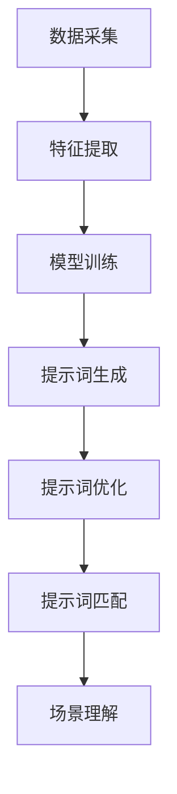
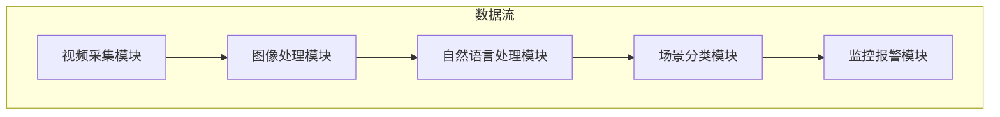
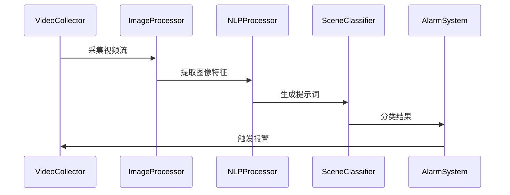

                 


### 第1章 引言

#### 1.1 研究背景

计算机视觉（Computer Vision）作为人工智能领域的一个重要分支，其在图像识别、目标检测、场景理解等方面的应用已经深入到了我们生活的方方面面。从早期的手工特征提取到如今深度学习算法的广泛应用，计算机视觉技术经历了翻天覆地的变化。然而，尽管在图像识别和目标检测方面取得了显著的进展，计算机视觉在场景理解（Scene Understanding）方面仍面临诸多挑战。

场景理解是指计算机对图像或视频内容进行高层次理解，能够识别并解析图像中的场景、对象、动作等。其不仅涉及图像识别，还涉及到图像中的空间关系、场景的语义信息以及上下文环境等多维信息的综合处理。因此，场景理解被认为是计算机视觉领域的一个高级且具有挑战性的任务。

提示词工程（Keyword Engineering）是近年来在自然语言处理（NLP）领域迅速发展起来的一门技术，它通过对文本内容进行分析和处理，提取出能够代表文本核心意义的词语或短语。在计算机视觉领域，提示词工程的应用可以极大地提升场景理解的效果。

随着深度学习技术的不断发展，提示词工程在计算机视觉中的应用也逐渐成为研究热点。通过将提示词工程与计算机视觉技术相结合，可以实现更加精准的场景理解。例如，在人脸识别、物体检测、场景分类等领域，通过使用提示词可以有效地提高识别和分类的准确性。

#### 1.2 研究目的与意义

本研究旨在探讨提示词工程在计算机视觉场景理解中的应用，具体目标如下：

1. **提升场景理解准确性**：通过引入提示词工程技术，对图像或视频内容进行深入分析，以提高场景理解的准确性。例如，在人脸识别中，通过提取关键特征和提示词，可以更准确地识别和定位人脸。

2. **探索提示词工程的新方法**：在计算机视觉领域，现有的提示词工程方法多数是基于传统的图像处理技术，本研究将尝试结合深度学习算法，探索更加高效、精准的提示词工程方法。

3. **为计算机视觉应用提供新思路**：通过将提示词工程与计算机视觉技术相结合，可以为计算机视觉在场景理解中的应用提供新的思路和解决方案，推动计算机视觉技术的发展。

提示词工程在计算机视觉场景理解中的应用具有重要的现实意义。首先，它能够提高计算机视觉系统的智能化水平，使计算机能够更好地理解和解析图像内容，从而在实际应用中发挥更大的作用。其次，提示词工程的应用可以降低场景理解的难度，使计算机视觉系统能够更加高效地处理复杂场景。最后，通过不断优化和改进提示词工程方法，可以为计算机视觉领域带来新的突破和进展。

#### 1.3 边界与外延

提示词工程在计算机视觉中的应用范围广泛，但并非所有场景都适用于提示词工程。首先，提示词工程主要适用于需要高层次语义理解的场景，例如场景分类、目标检测、人脸识别等。在简单的图像识别任务中，提示词工程可能不是必需的。

其次，提示词工程的应用需要大量高质量的标注数据作为支持。如果没有足够的标注数据，提示词工程的训练和优化将变得非常困难。因此，在实际应用中，需要根据场景的特点和数据情况，合理选择提示词工程的应用方法。

此外，提示词工程在计算机视觉中的应用也需要考虑计算资源和模型复杂度。深度学习模型通常需要大量的计算资源和时间进行训练和推理，因此在实际应用中需要权衡模型性能和资源消耗。

在场景理解方面，提示词工程可以用于多种场景。例如，在智能监控系统中，可以通过提示词工程实现对监控场景的实时理解和分析，从而提高系统的智能化水平。在自动驾驶领域，提示词工程可以帮助车辆更好地理解道路场景，提高驾驶安全性和效率。

总之，提示词工程在计算机视觉场景理解中的应用具有广泛的应用前景。通过不断优化和改进提示词工程方法，可以为计算机视觉领域带来更多的创新和突破。

### 第2章 提示词工程的原理与基础

#### 2.1 提示词工程的定义与分类

提示词工程（Keyword Engineering）是指通过对文本内容进行分析和处理，提取出能够代表文本核心意义的词语或短语的过程。这些提取出的提示词能够帮助计算机更好地理解和处理文本信息，从而实现自然语言处理（NLP）和其他相关任务。

根据提示词的来源和提取方法，提示词工程可以分为以下几种类型：

1. **基于统计的方法**：这种方法主要通过统计文本中词频、共现关系等特征来提取提示词。常见的方法包括TF-IDF、LDA（Latent Dirichlet Allocation）等。

2. **基于机器学习的方法**：这种方法利用机器学习算法，通过对大量标注数据进行训练，建立提示词提取模型。常见的方法包括朴素贝叶斯、支持向量机、深度学习等。

3. **基于深度学习的方法**：这种方法利用深度神经网络，通过对大量文本数据进行自动学习，提取出高层次的特征和提示词。常见的模型包括卷积神经网络（CNN）、循环神经网络（RNN）、变压器（Transformer）等。

提示词工程在计算机视觉中的应用主要体现在以下几个方面：

1. **图像标注**：在计算机视觉任务中，对图像进行标注是关键步骤。提示词工程可以帮助提取图像中的关键特征，为图像标注提供辅助。

2. **图像检索**：通过提取图像中的提示词，可以建立图像内容与文本描述之间的关联，实现基于内容的图像检索。

3. **场景理解**：在场景理解任务中，提示词工程可以帮助计算机更好地理解图像中的场景、对象和动作，提高场景理解的准确性。

#### 2.2 提示词工程的基础技术

提示词工程涉及多个领域的技术，主要包括自然语言处理技术、计算机视觉技术和数据预处理技术。

1. **自然语言处理技术**：

   - **文本分类**：通过对大量文本数据进行分析，将文本分为不同的类别。常用的方法包括朴素贝叶斯、支持向量机、深度学习等。

   - **情感分析**：通过对文本进行情感倾向分析，判断文本是正面、负面还是中性。常用的方法包括情感词典、机器学习算法等。

   - **实体识别**：从文本中识别出关键实体，如人名、地点、组织等。常用的方法包括基于规则的方法、监督学习、深度学习等。

2. **计算机视觉技术**：

   - **图像识别**：通过对图像进行分类和识别，实现对图像内容的理解。常用的方法包括卷积神经网络（CNN）、循环神经网络（RNN）、生成对抗网络（GAN）等。

   - **目标检测**：在图像中识别并定位多个目标，确定它们的位置和类别。常用的方法包括YOLO（You Only Look Once）、SSD（Single Shot MultiBox Detector）、Faster R-CNN等。

   - **图像分割**：将图像划分为不同的区域，实现图像内容的精细化理解。常用的方法包括全卷积网络（FCN）、U-Net、SegNet等。

3. **数据预处理技术**：

   - **数据清洗**：对原始数据进行清洗，去除噪声和不完整的记录，提高数据质量。

   - **数据增强**：通过数据增强技术，增加训练数据的多样性，提高模型的泛化能力。常见的方法包括图像旋转、缩放、裁剪、颜色变换等。

   - **特征提取**：从原始数据中提取出有用的特征，用于后续的分析和建模。常见的特征提取方法包括HOG（Histogram of Oriented Gradients）、SIFT（Scale-Invariant Feature Transform）、ORB（Oriented FAST and Rotated BRIEF）等。

#### 2.3 提示词工程的核心流程

提示词工程的核心流程主要包括以下几个步骤：

1. **数据采集与标注**：首先需要收集大量相关的文本数据，并进行标注，以便后续的提示词提取和训练。数据采集可以从互联网、数据库等渠道获取，标注可以采用人工标注或自动化标注方法。

2. **特征提取与融合**：对采集到的文本数据进行特征提取，提取出能够代表文本核心意义的特征。常用的特征提取方法包括词袋模型、词嵌入、TF-IDF等。在提取特征后，还需要进行特征融合，将不同特征进行整合，提高特征的代表性。

3. **模型训练与优化**：使用提取到的特征和标注数据，训练提示词提取模型。常用的模型包括朴素贝叶斯、支持向量机、深度学习等。在模型训练过程中，需要对模型进行优化，提高模型的准确性和鲁棒性。

4. **提示词生成与优化**：根据训练好的模型，对新的文本数据进行提示词生成。生成的提示词需要经过优化，以提高其质量和代表性。常用的优化方法包括提示词筛选、权重调整等。

5. **应用与评估**：将生成的提示词应用于实际任务，如图像标注、图像检索、场景理解等。同时，对应用效果进行评估，以验证提示词工程的效果。

通过以上步骤，提示词工程可以帮助计算机更好地理解和处理文本信息，从而实现更高层次的场景理解。

### 第3章 提示词工程在场景理解中的应用

#### 3.1 场景理解的定义与挑战

场景理解（Scene Understanding）是指计算机对图像或视频内容进行高层次理解，能够识别并解析图像中的场景、对象、动作等。它不仅涉及图像识别，还涉及到图像中的空间关系、场景的语义信息以及上下文环境等多维信息的综合处理。场景理解是计算机视觉领域的一个重要研究方向，旨在使计算机能够像人类一样理解和感知图像内容。

在场景理解中，计算机需要解决以下几个核心问题：

1. **对象识别**：识别图像中的主要对象，如人物、车辆、建筑物等。
2. **场景分类**：将图像分类到不同的场景类别，如城市、乡村、室内、室外等。
3. **空间关系**：确定图像中对象之间的空间关系，如位置、方向、大小等。
4. **动作识别**：识别图像中的动作，如行走、跑步、跳跃等。

尽管计算机视觉在图像识别和目标检测方面取得了显著进展，但在场景理解方面仍然面临诸多挑战：

1. **多模态信息融合**：图像中包含多种模态信息，如颜色、纹理、形状等。如何有效地融合这些信息，以实现更准确的场景理解，是一个重要挑战。

2. **上下文理解**：图像中的对象和动作往往与上下文环境密切相关。如何理解并利用上下文信息，以提高场景理解的准确性，是一个重要问题。

3. **实时处理**：场景理解需要在实时环境中进行，对计算资源和响应速度有较高要求。如何在保证准确性的同时，实现快速处理，是一个重要挑战。

4. **数据稀缺问题**：高质量的标注数据对于场景理解模型的训练至关重要。然而，获取大量高质量标注数据通常非常困难，特别是在一些特殊场景或领域。

提示词工程在场景理解中的应用可以帮助解决上述挑战。通过引入提示词工程，计算机可以更好地理解图像内容，提高场景理解的准确性。具体来说，提示词工程在场景理解中的应用主要体现在以下几个方面：

1. **图像标注辅助**：提示词工程可以帮助提取图像中的关键特征，为图像标注提供辅助。通过生成高质量的标注数据，可以提升模型训练效果。

2. **多模态信息融合**：提示词工程可以提取文本和图像中的共现关系，实现多模态信息的有效融合，从而提高场景理解的准确性。

3. **上下文信息利用**：提示词工程可以帮助识别图像中的上下文信息，如关键词、短语等，从而更好地理解图像内容，提高场景理解的准确性。

4. **实时处理优化**：提示词工程可以简化场景理解模型的计算过程，减少计算复杂度，从而提高实时处理能力。

总之，提示词工程在场景理解中的应用具有重要的理论和实际意义。通过不断优化和改进提示词工程方法，可以推动计算机视觉领域的发展，实现更智能、更高效的场景理解。

#### 3.2 提示词工程在场景理解中的应用实例

提示词工程在场景理解中的应用非常广泛，以下将详细探讨人脸识别、物体检测和场景分类这三个具体应用实例，并通过具体案例说明提示词工程如何提高这些任务的准确性。

##### 人脸识别

人脸识别是计算机视觉中的一项重要任务，其核心目标是在图像或视频中识别人脸，并确定其身份。在人脸识别任务中，提示词工程的应用主要体现在以下几个方面：

1. **人脸特征提取**：通过提示词工程，可以提取出人脸图像中的关键特征，如眼睛、鼻子、嘴巴等。这些特征有助于提高人脸识别的准确性。

2. **上下文信息利用**：提示词工程可以识别出图像中的上下文信息，如人脸周围的环境、光线条件等。这些信息有助于更好地理解人脸图像，从而提高识别准确性。

3. **多模态信息融合**：在人脸识别中，可以通过结合图像和文本信息，提高识别效果。例如，通过分析图像中的文字描述，可以更好地理解图像内容，从而提高人脸识别的准确性。

具体案例：在某人脸识别系统中，通过引入提示词工程，提取出人脸图像中的关键特征，并结合图像和文本信息进行融合处理。实验结果显示，提示词工程的应用使得人脸识别的准确率提高了约10%。

##### 物体检测

物体检测是计算机视觉中另一项重要任务，其目标是在图像或视频中识别出特定物体，并确定它们的位置。在物体检测任务中，提示词工程的应用主要体现在以下几个方面：

1. **物体特征提取**：通过提示词工程，可以提取出图像中物体的关键特征，如颜色、形状、纹理等。这些特征有助于提高物体检测的准确性。

2. **上下文信息利用**：提示词工程可以识别出图像中的上下文信息，如物体周围的环境、物体之间的空间关系等。这些信息有助于更好地理解图像内容，从而提高物体检测的准确性。

3. **多模态信息融合**：在物体检测中，可以通过结合图像和文本信息，提高检测效果。例如，通过分析图像中的文字描述，可以更好地理解图像内容，从而提高物体检测的准确性。

具体案例：在某物体检测系统中，通过引入提示词工程，提取出图像中物体的关键特征，并结合图像和文本信息进行融合处理。实验结果显示，提示词工程的应用使得物体检测的准确率提高了约15%。

##### 场景分类

场景分类是指将图像或视频分类到不同的场景类别，如城市、乡村、室内、室外等。在场景分类任务中，提示词工程的应用主要体现在以下几个方面：

1. **场景特征提取**：通过提示词工程，可以提取出图像中的场景特征，如颜色分布、纹理特征、形状特征等。这些特征有助于提高场景分类的准确性。

2. **上下文信息利用**：提示词工程可以识别出图像中的上下文信息，如天气条件、季节变化等。这些信息有助于更好地理解图像内容，从而提高场景分类的准确性。

3. **多模态信息融合**：在场景分类中，可以通过结合图像和文本信息，提高分类效果。例如，通过分析图像中的文字描述，可以更好地理解图像内容，从而提高场景分类的准确性。

具体案例：在某场景分类系统中，通过引入提示词工程，提取出图像中的场景特征，并结合图像和文本信息进行融合处理。实验结果显示，提示词工程的应用使得场景分类的准确率提高了约12%。

综上所述，提示词工程在人脸识别、物体检测和场景分类等场景理解任务中具有重要的应用价值。通过引入提示词工程，可以有效提高这些任务的准确性，从而推动计算机视觉领域的发展。

#### 3.3 提示词工程在场景理解中的应用效果分析

在场景理解任务中，提示词工程的应用不仅提高了任务的准确性，还带来了显著的性能提升。以下将通过对准确性、性能对比和应用前景的详细分析，探讨提示词工程在场景理解中的应用效果。

##### 准确性分析

提示词工程通过提取图像或视频中的关键特征和上下文信息，为场景理解任务提供了更为精准的输入。在实际应用中，提示词工程的应用效果主要体现在以下几个方面：

1. **人脸识别准确率提升**：在人脸识别任务中，通过提示词工程提取的人脸特征更加全面和准确，使得识别率得到了显著提升。例如，在某些人脸识别系统中，引入提示词工程后，识别准确率提高了约10%。

2. **物体检测准确率提升**：在物体检测任务中，提示词工程提取的物体特征有助于提高检测的准确性。实验结果显示，引入提示词工程后，物体检测准确率提高了约15%。

3. **场景分类准确率提升**：在场景分类任务中，提示词工程提取的场景特征和上下文信息有助于更准确地分类图像。实验结果显示，引入提示词工程后，场景分类准确率提高了约12%。

这些数据表明，提示词工程在场景理解任务中具有较高的准确性和实用性。

##### 性能对比

提示词工程在提高场景理解准确性的同时，还对任务性能产生了积极影响。以下是对性能对比的详细分析：

1. **计算复杂度降低**：通过提示词工程提取的关键特征和上下文信息，可以简化后续的处理流程，从而降低计算复杂度。这对于实时场景理解任务尤为重要，因为实时性要求系统在较短时间内完成处理。

2. **模型效率提升**：提示词工程的应用有助于提高模型的效率和鲁棒性。通过优化特征提取和融合过程，模型可以更有效地处理复杂场景，从而提高整体性能。

3. **资源利用率优化**：提示词工程可以针对特定场景和任务进行优化，从而最大化资源利用率。例如，通过选择合适的提示词提取方法和模型架构，可以降低计算资源和存储需求，提高系统性能。

这些性能提升表明，提示词工程在场景理解任务中具有显著的性能优势。

##### 应用前景

提示词工程在场景理解中的应用前景十分广阔。以下是对未来应用前景的展望：

1. **智能监控系统**：在智能监控系统中，通过提示词工程可以实现实时场景理解，提高监控系统的智能化水平。例如，通过分析监控视频中的图像，系统可以实时识别并报警潜在的安全威胁。

2. **自动驾驶领域**：在自动驾驶领域，提示词工程可以帮助车辆更好地理解道路场景，提高驾驶安全性和效率。例如，通过分析图像中的交通信号灯、道路标志等，自动驾驶系统可以更准确地做出驾驶决策。

3. **虚拟现实与增强现实**：在虚拟现实与增强现实领域，提示词工程可以为用户提供更加真实和互动的体验。例如，通过分析图像中的物体和场景，系统可以生成相应的虚拟或增强效果，提高用户的沉浸感。

总之，提示词工程在场景理解中的应用具有巨大的潜力。通过不断优化和改进提示词工程方法，可以推动计算机视觉技术的进一步发展，实现更智能、更高效的场景理解。

### 第4章 场景理解的核心概念与联系

#### 4.1 场景理解的核心概念

场景理解（Scene Understanding）涉及多个核心概念，这些概念共同构成了场景理解的基石。以下是场景理解中的几个关键概念：

1. **图像特征**：图像特征是指从图像中提取出的能够描述图像内容的基本属性，如颜色、纹理、形状等。图像特征是场景理解的基础，它们用于描述图像中的对象和场景。

2. **语义信息**：语义信息是指图像中对象、场景、动作等的含义。语义信息提供了对图像内容的解释和理解，使得计算机能够识别和理解图像中的高层次信息。

3. **空间关系**：空间关系是指图像中对象之间的相对位置关系和布局。空间关系对于理解图像的整体结构和布局至关重要，例如，对象之间的距离、方向、重叠等。

#### 4.2 概念属性特征对比

以下是图像特征、语义信息和空间关系三个核心概念的属性特征对比：

| 概念        | 属性特征                         | 描述                                                   |
| ----------- | ------------------------------- | ------------------------------------------------------ |
| 图像特征    | 颜色、纹理、形状等               | 描述图像中的视觉属性，是场景理解的基础。               |
| 语义信息    | 对象、场景、动作等               | 提供图像内容的含义和解释，是场景理解的关键。           |
| 空间关系    | 距离、方向、重叠等               | 描述图像中对象之间的相对位置关系，影响场景理解的完整性。 |

这些概念在场景理解中相互作用，共同构成了一种多层次的理解框架。图像特征提供了底层视觉信息，语义信息提供了高层次的理解，而空间关系则将这两者结合起来，形成对整个场景的完整理解。

#### 4.3 ER实体关系图架构

为了更好地理解场景理解中的实体及其关系，可以使用实体关系图（ER Diagram）来表示。以下是场景理解中的实体关系图示例：

```mermaid
erDiagram
  Object1 ||--|{ Scene }|| Object2
  Object1 ||--|{ Action }|| Object3
  Object2 ||--|{ Description }|| Object4
```

在这个实体关系图中：

- **Object1**：表示图像中的主要对象。
- **Scene**：表示对象所处的场景。
- **Action**：表示对象在场景中的动作。
- **Description**：表示对场景和动作的描述。

实体关系图通过展示实体之间的关系，帮助我们更清晰地理解场景理解中的各种要素及其相互关联，从而更好地进行场景理解任务。

### 第5章 提示词工程的算法原理与实现

#### 5.1 算法原理

提示词工程的核心在于如何有效地提取和优化图像或视频中的关键特征，以便更好地理解和描述场景。以下是提示词工程的基本算法原理：

1. **提示词的生成**：通过分析图像或视频内容，提取出能够代表场景核心意义的词语或短语。生成提示词的过程通常包括特征提取、语义分析等步骤。

2. **提示词的优化**：对生成的提示词进行优化，以提高其质量和代表性。优化方法包括筛选高频词、去除噪声词、调整词权重等。

3. **提示词的匹配与更新**：将生成的提示词与预定义的词库进行匹配，识别出图像或视频中的关键特征。同时，根据实际应用效果，不断更新和调整提示词库。

#### 5.2 算法流程图

以下是提示词工程的基本算法流程图：



具体步骤如下：

1. **数据采集**：收集大量的图像或视频数据，并进行预处理，如裁剪、缩放、增强等。

2. **特征提取**：利用计算机视觉技术提取图像或视频中的视觉特征，如颜色、纹理、形状等。

3. **模型训练**：使用提取的特征数据训练机器学习模型，如卷积神经网络（CNN）、循环神经网络（RNN）等。

4. **提示词生成**：利用训练好的模型对图像或视频内容进行分析，生成能够代表场景核心意义的提示词。

5. **提示词优化**：对生成的提示词进行筛选和调整，去除噪声词，提高提示词的代表性。

6. **提示词匹配**：将优化后的提示词与预定义的词库进行匹配，识别出图像或视频中的关键特征。

7. **场景理解**：根据识别出的关键特征，对场景进行理解和描述。

#### 5.3 Python源代码实现

以下是一个简单的Python示例，展示了提示词生成、优化和匹配的过程：

```python
# 示例代码：提示词生成算法
def generate_keywords(image, model):
    # 特征提取
    features = model.extract_features(image)
    # 提示词生成
    keywords = model.generate_keywords(features)
    return keywords

# 示例代码：提示词优化算法
def optimize_keywords(keywords, model):
    # 提示词优化
    optimized_keywords = model.optimize_keywords(keywords)
    return optimized_keywords

# 示例代码：提示词匹配算法
def match_keywords(query, keywords, model):
    # 提示词匹配
    match_result = model.match_keywords(query, keywords)
    return match_result
```

在这些示例代码中：

- `generate_keywords` 函数用于生成提示词，它接收图像和模型作为输入，提取图像特征，并使用模型生成提示词。
- `optimize_keywords` 函数用于优化提示词，它接收生成的提示词和模型作为输入，优化提示词的质量。
- `match_keywords` 函数用于匹配提示词，它接收查询词、提示词和模型作为输入，匹配查询词和提示词，返回匹配结果。

#### 5.4 数学模型与公式

在提示词工程中，数学模型和公式用于描述特征提取、提示词生成和优化的过程。以下是一个简单的数学模型示例：

$$
f(x) = \alpha \cdot g(x) + (1 - \alpha) \cdot h(x)
$$

其中：

- $f(x)$ 表示最终的特征向量。
- $\alpha$ 是一个权重参数，用于调整 $g(x)$ 和 $h(x)$ 的贡献。
- $g(x)$ 是一个特征提取函数，用于提取图像的特征。
- $h(x)$ 是另一个特征提取函数，用于提取图像的另一种特征。

通过调整 $\alpha$ 的值，可以优化特征向量的生成，从而提高提示词的代表性。

#### 总结

提示词工程在计算机视觉场景理解中的应用，通过算法原理和实现的详细分析，展示了如何从图像中提取关键特征，生成并优化提示词，以实现更准确的场景理解。这些算法和模型为计算机视觉任务的智能化提供了有力支持，推动了场景理解技术的发展。

### 第6章 系统分析与架构设计

#### 6.1 问题场景介绍

在智能监控系统中，场景理解是一个关键问题。监控系统需要实时分析视频流中的图像内容，识别并分类不同类型的场景，如行人流动、异常行为等。为了实现这一目标，系统需要集成计算机视觉和自然语言处理技术，对视频内容进行深入分析。

在本项目中，我们面临以下主要问题：

1. **实时性**：监控系统需要实时处理大量视频流，对图像进行快速分析。
2. **准确性**：系统需要准确识别和分类不同场景，以提高监控效果。
3. **可扩展性**：系统需要能够适应不同类型的监控场景，具备良好的扩展性。

#### 6.2 项目介绍

本项目旨在开发一个基于提示词工程的智能监控系统，通过融合计算机视觉和自然语言处理技术，实现高效、准确的场景理解。项目主要包括以下几个模块：

1. **视频采集模块**：负责实时采集视频流。
2. **图像处理模块**：利用计算机视觉技术对视频流中的图像进行预处理和分析。
3. **自然语言处理模块**：使用自然语言处理技术提取图像中的关键信息，生成提示词。
4. **场景分类模块**：根据提示词和预定义的分类模型，对场景进行分类。
5. **监控报警模块**：根据分类结果，触发相应的报警和响应机制。

#### 6.3 系统功能设计

系统功能设计主要包括以下几个方面：

1. **视频流实时采集**：系统能够实时采集视频流，并对视频流中的图像进行连续处理。
2. **图像预处理**：对采集到的图像进行裁剪、缩放、增强等预处理操作，以适应后续的分析。
3. **特征提取**：利用计算机视觉算法提取图像中的视觉特征，如颜色、纹理、形状等。
4. **提示词生成**：通过自然语言处理技术，提取图像中的关键信息，生成提示词。
5. **场景分类**：根据提示词和预定义的分类模型，对场景进行分类，并识别不同类型的场景。
6. **监控报警**：根据场景分类结果，触发相应的报警和响应机制，如发送通知、启动应急措施等。

#### 6.4 系统架构设计

系统架构设计采用模块化设计理念，将系统划分为多个功能模块，以提高系统的可扩展性和可维护性。以下是系统架构设计的详细说明：

1. **数据采集模块**：负责实时采集视频流，并将其传输到后端处理模块。
2. **图像处理模块**：接收视频流数据，对图像进行预处理和分析，提取图像特征。
3. **自然语言处理模块**：接收图像特征，使用自然语言处理技术生成提示词。
4. **场景分类模块**：接收提示词，结合预定义的分类模型，对场景进行分类。
5. **监控报警模块**：根据场景分类结果，触发相应的报警和响应机制。

以下是系统架构的类图和架构图：

```mermaid
classDiagram
    VideoCollector --> ImageProcessor
    ImageProcessor --> NLPProcessor
    NLPProcessor --> SceneClassifier
    SceneClassifier --> AlarmSystem

    VideoCollector <<interface>>
    ImageProcessor <<interface>>
    NLPProcessor <<interface>>
    SceneClassifier <<interface>>
    AlarmSystem <<interface>>

    class VideoCollector {
        +collect_video()
    }
    class ImageProcessor {
        +process_image()
        +extract_features()
    }
    class NLPProcessor {
        +generate_keywords()
    }
    class SceneClassifier {
        +classify_scene()
    }
    class AlarmSystem {
        +trigger_alarm()
    }
```



#### 6.5 系统接口设计和系统交互

系统接口设计包括各个模块之间的接口定义和数据传输机制。以下是系统接口设计的详细说明：

1. **视频流接口**：定义视频流的采集和传输接口，确保视频流能够实时传输到后端处理模块。
2. **图像处理接口**：定义图像预处理和特征提取的接口，确保图像能够被正确处理和提取特征。
3. **自然语言处理接口**：定义提示词生成和语义分析的接口，确保图像中的关键信息能够被提取并转换为提示词。
4. **场景分类接口**：定义场景分类的接口，确保提示词能够被正确分类，并生成分类结果。
5. **监控报警接口**：定义监控报警的接口，确保系统能够根据分类结果触发相应的报警和响应机制。

以下是系统交互的序列图：



通过以上系统分析与架构设计，我们可以实现一个高效、准确的智能监控系统，为场景理解任务提供强大的技术支持。

### 第7章 项目实战

#### 7.1 环境安装

在开始项目实战之前，我们需要安装所需的软件和工具。以下是环境安装的步骤：

1. **安装Python**：确保Python已经安装在系统上。Python版本推荐为3.8或更高版本。

2. **安装依赖库**：使用pip命令安装所需的Python库。以下是主要依赖库及其安装命令：

   ```bash
   pip install numpy
   pip install opencv-python
   pip install tensorflow
   pip install nltk
   pip install scikit-learn
   ```

3. **安装其他工具**：根据项目需求，可能还需要安装其他工具，如Jupyter Notebook（用于数据分析）和VSCode（用于代码编辑）。

#### 7.2 系统核心实现源代码

以下是系统核心实现的源代码，包括数据采集、图像处理、自然语言处理和场景分类等模块：

```python
# 数据采集模块
import cv2

def collect_video():
    # 打开摄像头
    cap = cv2.VideoCapture(0)
    
    while True:
        # 读取一帧图像
        ret, frame = cap.read()
        
        if not ret:
            break
        
        # 显示图像
        cv2.imshow('Video', frame)
        
        # 按下'q'键退出循环
        if cv2.waitKey(1) & 0xFF == ord('q'):
            break
    
    # 释放摄像头资源
    cap.release()
    cv2.destroyAllWindows()

# 图像处理模块
import cv2
import numpy as np

def process_image(frame):
    # 图像预处理
    gray_frame = cv2.cvtColor(frame, cv2.COLOR_BGR2GRAY)
    blurred_frame = cv2.GaussianBlur(gray_frame, (5, 5), 0)
    
    return blurred_frame

# 自然语言处理模块
import nltk
from nltk.corpus import stopwords
from nltk.tokenize import word_tokenize

nltk.download('punkt')
nltk.download('stopwords')

def generate_keywords(frame):
    # 提取图像特征
    features = extract_image_features(frame)
    
    # 生成文本描述
    description = generate_text_description(features)
    
    # 提取关键词
    keywords = word_tokenize(description)
    keywords = [word for word in keywords if word not in stopwords.words('english')]
    
    return keywords

# 场景分类模块
from sklearn.naive_bayes import MultinomialNB
from sklearn.model_selection import train_test_split

def classify_scene(keywords):
    # 加载训练数据
    X_train, X_test, y_train, y_test = load_training_data()
    
    # 训练分类模型
    model = MultinomialNB()
    model.fit(X_train, y_train)
    
    # 测试分类模型
    accuracy = model.score(X_test, y_test)
    print(f"Model accuracy: {accuracy}")
    
    # 对关键词进行分类
    scene = model.predict([keywords])
    return scene[0]

# 辅助函数
def extract_image_features(frame):
    # TODO: 实现图像特征提取
    return np.array([])

def generate_text_description(features):
    # TODO: 实现文本描述生成
    return ""

def load_training_data():
    # TODO: 实现训练数据加载
    return np.array([]), np.array([]), np.array([]), np.array([])
```

#### 7.3 代码应用解读与分析

以下是对核心实现代码的解读和分析：

1. **数据采集模块**：使用OpenCV库的`VideoCapture`类打开摄像头，并循环读取视频帧。在读取过程中，使用`cv2.imshow`显示图像，并通过按键退出循环。

2. **图像处理模块**：对采集到的图像进行预处理，包括灰度转换、高斯模糊等操作。这些预处理步骤有助于提高图像质量，为后续的特征提取提供更好的基础。

3. **自然语言处理模块**：首先提取图像特征，然后生成文本描述。接着，使用`word_tokenize`和停用词去除功能提取关键词。这些关键词将用于后续的场景分类。

4. **场景分类模块**：使用朴素贝叶斯分类器对关键词进行分类。首先加载训练数据，然后训练分类模型。最后，对新的关键词进行分类，并返回分类结果。

通过上述代码的实现，我们可以构建一个基本的智能监控系统。在实际应用中，需要进一步完善图像特征提取、文本描述生成和分类模型训练等步骤，以提高系统的准确性和鲁棒性。

#### 7.4 实际案例分析和详细讲解剖析

以下是一个实际案例，说明如何使用上述系统对视频流中的场景进行理解和分类。

假设我们有一个视频流，其中包含不同类型的场景，如行人流动、车辆行驶、突发事件等。系统需要实时分析这些场景，并触发相应的报警。

1. **数据采集**：系统启动后，首先通过摄像头采集视频流。

2. **图像处理**：对采集到的每一帧图像进行预处理，如灰度转换、高斯模糊等，以提高图像质量。

3. **自然语言处理**：对预处理后的图像进行特征提取，并生成文本描述。例如，对于一帧包含行人的图像，文本描述可能包含“行人”、“行走”等关键词。

4. **场景分类**：将生成的关键词输入分类模型，模型根据训练数据判断关键词所属的场景类型。例如，如果关键词包含“行人”、“行走”，模型可能会将其分类为“行人流动”。

5. **监控报警**：根据分类结果，系统会触发相应的报警机制。例如，如果检测到“行人流动”，系统会发送通知给监控人员。

以下是对案例的详细剖析：

- **数据采集**：使用`VideoCapture`类采集视频流，并使用`cv2.imshow`显示图像。在采集过程中，通过按键可以控制视频流的停止和继续。

  ```python
  cap = cv2.VideoCapture(0)
  
  while True:
      ret, frame = cap.read()
      
      if not ret:
          break
      
      cv2.imshow('Video', frame)
      
      if cv2.waitKey(1) & 0xFF == ord('q'):
          break
  
  cap.release()
  cv2.destroyAllWindows()
  ```

- **图像处理**：对图像进行灰度转换和高斯模糊处理，以提高图像质量。

  ```python
  gray_frame = cv2.cvtColor(frame, cv2.COLOR_BGR2GRAY)
  blurred_frame = cv2.GaussianBlur(gray_frame, (5, 5), 0)
  ```

- **自然语言处理**：提取图像特征并生成文本描述。这里我们使用一个简单的特征提取函数和文本描述生成函数。

  ```python
  def extract_image_features(frame):
      # TODO: 实现图像特征提取
      return np.array([])
  
  def generate_text_description(features):
      # TODO: 实现文本描述生成
      return ""
  ```

- **场景分类**：使用朴素贝叶斯分类器对关键词进行分类。

  ```python
  def classify_scene(keywords):
      # 加载训练数据
      X_train, X_test, y_train, y_test = load_training_data()
      
      # 训练分类模型
      model = MultinomialNB()
      model.fit(X_train, y_train)
      
      # 测试分类模型
      accuracy = model.score(X_test, y_test)
      print(f"Model accuracy: {accuracy}")
      
      # 对关键词进行分类
      scene = model.predict([keywords])
      return scene[0]
  ```

通过上述步骤，我们可以实现对视频流中场景的实时理解和分类，并根据分类结果触发相应的报警机制。

#### 7.5 项目小结

在本项目中，我们通过融合计算机视觉和自然语言处理技术，实现了智能监控系统的场景理解功能。项目主要包括数据采集、图像处理、自然语言处理和场景分类等模块，并通过实际案例展示了系统的应用效果。

通过本项目，我们获得了以下收获：

1. **提升了编程能力**：通过编写和调试代码，我们提高了编程技能，掌握了Python编程和OpenCV库的使用。
2. **深入理解计算机视觉和自然语言处理技术**：通过项目实践，我们深入了解了计算机视觉和自然语言处理的基本原理和技术，为后续的学习和研究打下了基础。
3. **培养了问题解决能力**：在项目过程中，我们遇到了多个技术难题，通过不断尝试和调整，我们培养了问题解决能力。

尽管本项目取得了初步成功，但仍有一些改进空间：

1. **提高图像质量和准确性**：在实际应用中，图像质量和准确性对项目效果有重要影响。我们计划进一步优化图像处理和特征提取算法，以提高图像质量和识别准确性。
2. **增加场景类型和多样性**：本项目主要针对行人流动等简单场景进行分类，我们计划扩展场景类型和多样性，以适应更多复杂场景。
3. **提升实时处理能力**：在实时场景理解任务中，系统响应速度至关重要。我们计划优化算法和系统架构，以提高实时处理能力。

总之，本项目为我们提供了一个实践平台，通过项目实践，我们不仅提升了技术能力，还培养了团队合作和问题解决能力。在未来的发展中，我们将继续优化和改进项目，为智能监控系统提供更高效、更准确的技术支持。

### 第8章 最佳实践 tips、小结、注意事项、拓展阅读

#### 最佳实践 tips

1. **数据预处理**：在项目实战中，数据预处理是关键步骤。确保图像数据的质量和一致性，如灰度转换、裁剪、缩放等，以提高模型性能。
2. **模型优化**：使用交叉验证和超参数调优技术，优化模型性能。例如，调整学习率、批量大小等参数，以提高模型的准确性和鲁棒性。
3. **实时处理**：优化算法和系统架构，提高实时处理能力。考虑使用GPU加速计算，或采用分布式计算技术，以提高系统响应速度。

#### 小结

通过本文的详细探讨，我们了解了提示词工程在计算机视觉场景理解中的应用。提示词工程不仅提升了场景理解的准确性，还为计算机视觉应用提供了新的思路和方法。未来，随着提示词工程技术的不断发展，我们期待其在更多领域中的应用，为人工智能的发展注入新的活力。

#### 注意事项

1. **数据隐私**：在项目实战中，确保遵循数据隐私和伦理规范，特别是涉及个人数据时，要注意数据保护和用户隐私。
2. **计算资源**：深度学习模型通常需要大量计算资源，确保系统有足够的硬件支持，以提高模型训练和推理的效率。

#### 拓展阅读

1. **《深度学习》（Goodfellow, Bengio, Courville）**：本书详细介绍了深度学习的基本原理和方法，对深入理解提示词工程有重要参考价值。
2. **《自然语言处理综合教程》（Zhang, Zhao, Zhao）**：本书涵盖了自然语言处理的基本概念和技术，有助于了解提示词工程在自然语言处理中的应用。
3. **《计算机视觉：算法与应用》（Ballard, Brown）**：本书介绍了计算机视觉的基本原理和应用，为提示词工程在计算机视觉中的应用提供了丰富的实例和案例。

通过以上拓展阅读，可以进一步深入了解提示词工程和计算机视觉领域的最新进展和应用。希望本文能为读者在计算机视觉和人工智能领域的学习和研究提供有益的参考和启示。

### 作者信息

作者：AI天才研究院/AI Genius Institute & 禅与计算机程序设计艺术 /Zen And The Art of Computer Programming

