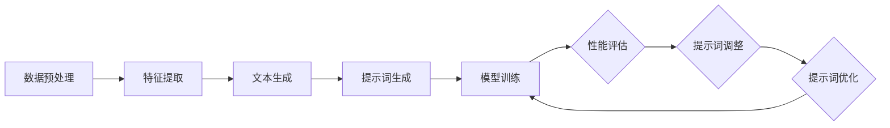
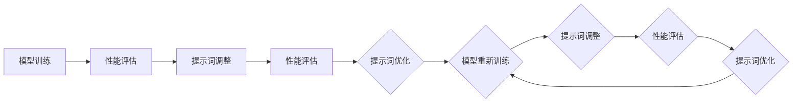
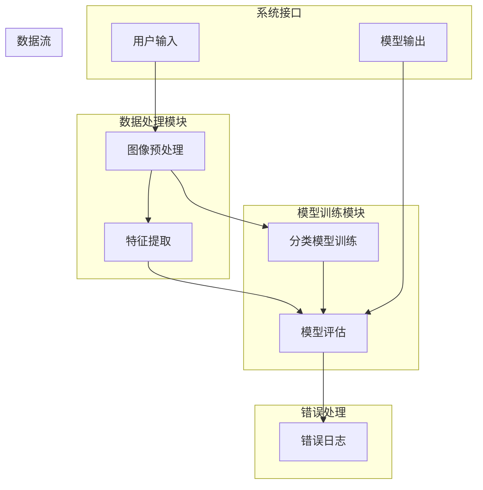
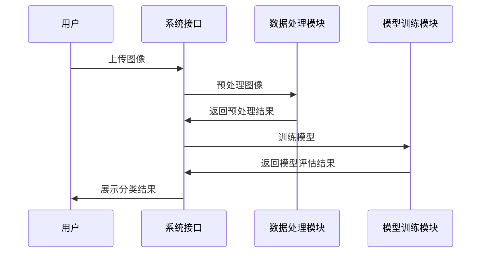

                 

## 引言

### 第1章 引言

在当今飞速发展的信息技术时代，计算机视觉作为人工智能的重要分支，已经在各个领域取得了显著的成果。然而，随着任务复杂度的增加和应用场景的多样化，传统的计算机视觉方法逐渐暴露出诸多不足。为了应对这些挑战，研究人员开始探索新的解决思路，其中提示词工程（Prompt Engineering）成为了一个备受关注的研究方向。

#### 1.1 问题背景

当前计算机视觉任务面临的挑战主要包括以下几点：

1. **复杂场景识别**：在复杂多变的现实场景中，物体之间的相互遮挡、光线变化等因素给视觉任务的识别带来了极大的困难。
2. **数据多样性**：随着数据量的激增，如何有效地处理和利用这些数据成为了一个重要问题。
3. **计算资源限制**：一些实时性要求较高的场景，对计算资源的需求越来越高，传统的计算方法可能无法满足这些需求。

#### 1.2 问题解决

为了解决上述问题，引入了提示词工程这一概念。提示词工程是一种通过设计特定的提示词，指导计算机视觉模型进行有效识别和分类的方法。它通过优化输入信息的表达方式，提高模型的识别准确率和效率。

#### 1.3 边界与外延

提示词工程的研究范围主要包括以下几个方面：

1. **模型优化**：通过设计提示词来优化计算机视觉模型的性能。
2. **数据预处理**：在数据处理过程中引入提示词，以提高数据的有效性。
3. **应用场景**：提示词工程不仅适用于静态图像的识别，还可以应用于视频分析、自动驾驶等领域。

#### 1.4 核心概念

在本章中，我们将介绍以下核心概念：

1. **提示词**：用于指导计算机视觉模型进行识别和分类的关键词。
2. **提示词工程**：设计、优化和实施提示词的过程。
3. **计算机视觉**：利用计算机技术对图像和视频进行分析和理解。

#### 1.5 本章小结

本章介绍了计算机视觉任务面临的主要挑战以及提示词工程的引入。通过优化输入信息，提示词工程为计算机视觉领域提供了一种新的解决思路。接下来，我们将进一步探讨提示词工程的概念、原理及其在计算机视觉中的应用。

---

## 第2章 核心概念与联系

### 2.1 提示词工程的概念

提示词工程是一种通过设计特定的提示词来指导计算机视觉模型进行识别和分类的方法。它涉及以下几个关键方面：

1. **提示词设计**：根据任务需求，设计出合适的提示词，以引导模型更好地理解和处理输入信息。
2. **模型优化**：通过调整提示词，优化计算机视觉模型的性能，使其在特定任务上表现出更好的识别效果。
3. **应用实施**：将设计好的提示词应用到实际场景中，实现计算机视觉任务的有效解决。

#### 特点

提示词工程具有以下特点：

1. **灵活性**：提示词可以根据任务需求灵活设计，从而适应不同场景的需求。
2. **可解释性**：提示词的设计有助于提高模型的解释性，使模型的决策过程更加透明。
3. **高效性**：通过优化输入信息，提示词工程可以提高计算机视觉模型的识别速度和准确率。

### 2.2 提示词的概念

提示词是指用于引导计算机视觉模型进行识别和分类的关键词。它具有以下几个基本属性：

1. **定义**：提示词是对图像或视频内容的一种简明描述，有助于模型理解输入信息。
2. **类型**：提示词可以分为以下几种类型：
   - **分类提示词**：用于指导模型进行分类任务。
   - **定位提示词**：用于指导模型进行目标定位任务。
   - **交互提示词**：用于与模型进行交互，调整模型的识别结果。

#### 2.3 计算机视觉的概念

计算机视觉是指利用计算机技术对图像和视频进行分析和理解。它包括以下几个核心组成部分：

1. **图像处理**：对图像进行预处理、增强、分割等操作。
2. **特征提取**：从图像中提取出能够描述图像内容的特征。
3. **目标识别**：根据提取出的特征，对图像中的目标进行识别和分类。
4. **场景理解**：通过对图像的整体理解，实现对场景的语义分析。

#### 2.4 提示词工程与计算机视觉的联系

提示词工程与计算机视觉之间存在密切的联系，主要体现在以下几个方面：

1. **应用实例**：提示词工程可以应用于计算机视觉的各个子领域，如目标识别、场景理解、视频分析等。
2. **优势分析**：提示词工程通过优化输入信息，有助于提高计算机视觉模型的性能，尤其是在处理复杂场景和多样化数据时，表现尤为突出。

#### 概念属性特征对比表格

| 概念名称 | 定义 | 类型 | 应用场景 | 特点 |
| --- | --- | --- | --- | --- |
| 提示词 | 用于指导计算机视觉模型识别和分类的关键词 | 分类提示词、定位提示词、交互提示词 | 计算机视觉的各个子领域 | 灵活性、可解释性、高效性 |
| 提示词工程 | 设计、优化和实施提示词的过程 | - | 计算机视觉的各个子领域 | - |
| 计算机视觉 | 利用计算机技术对图像和视频进行分析和理解 | 图像处理、特征提取、目标识别、场景理解 | 各个领域，如医疗、安防、自动驾驶等 | - |

#### ER实体关系图架构

提示词工程与计算机视觉的关系可以用ER（实体关系）图进行描述，如图所示：

```mermaid
erDiagram
  Task ||--|{ Model } Model
  Model ||--|{ Prompt } Prompt
  Data ||--|{ Model } Model
  Data ||--|{ Prompt } Prompt
  Task ||--|{ Data } Data
```

在这个ER图中，Task表示计算机视觉任务，Model表示计算机视觉模型，Prompt表示提示词，Data表示数据。它们之间的联系如下：

- Task与Model之间存在依赖关系，即Task需要Model的支持来完成。
- Model与Prompt之间存在关联关系，提示词用于指导Model进行识别和分类。
- Data与Model之间存在关联关系，即Model需要使用Data进行训练和优化。
- Data与Prompt之间存在关联关系，提示词工程在数据处理过程中引入提示词。

通过ER实体关系图，我们可以清晰地看到提示词工程在计算机视觉中的核心地位，以及它与计算机视觉任务、模型和数据之间的相互作用。

### 2.5 概念属性特征对比表格

| 概念名称 | 定义 | 特点 |
| --- | --- | --- |
| 提示词 | 用于指导计算机视觉模型识别和分类的关键词 | 灵活性、可解释性、高效性 |
| 提示词工程 | 设计、优化和实施提示词的过程 | - |
| 计算机视觉 | 利用计算机技术对图像和视频进行分析和理解 | - |

### 2.6 ER实体关系图架构

为了更好地描述提示词工程与计算机视觉之间的实体关系，我们使用Mermaid绘制了以下ER图：

```mermaid
erDiagram
  ComputerVision ||--|{ PromptEngineering } PromptEngineering
  ComputerVision ||--|{ ComputerVisionModel } ComputerVisionModel
  PromptEngineering ||--|{ Prompt } Prompt
```

在这个ER图中：

- **ComputerVision**（计算机视觉）表示整个研究领域。
- **PromptEngineering**（提示词工程）表示一种用于指导计算机视觉模型的方法。
- **ComputerVisionModel**（计算机视觉模型）表示用于图像和视频处理的模型。
- **Prompt**（提示词）表示用于指导模型的关键词。

它们之间的实体关系如下：

- 计算机视觉与提示词工程之间存在依赖关系，即计算机视觉需要提示词工程的指导。
- 计算机视觉与计算机视觉模型之间存在关联关系，即计算机视觉模型是计算机视觉任务的核心组成部分。
- 提示词工程与提示词之间存在关联关系，即提示词工程通过设计、优化和实施提示词来指导计算机视觉模型。

通过这个ER图，我们可以直观地看到提示词工程在计算机视觉中的作用和地位，以及它与计算机视觉模型、提示词之间的相互关系。

### 第3章 算法原理讲解

#### 3.1 算法介绍

在计算机视觉任务中，提示词工程发挥着重要作用。为了实现这一目标，我们需要介绍两种关键算法：提示词生成算法和提示词优化算法。

**提示词生成算法**：该算法旨在根据任务需求生成合适的提示词。它通常包括以下几个步骤：

1. **数据预处理**：对输入数据进行处理，包括图像增强、去噪等，以提高数据质量。
2. **特征提取**：从预处理后的数据中提取出关键特征，用于生成提示词。
3. **提示词生成**：根据提取出的特征，生成符合任务需求的提示词。

**提示词优化算法**：该算法用于对生成的提示词进行优化，以提高模型性能。其主要步骤包括：

1. **模型训练**：使用生成的提示词对模型进行训练，以获取最佳性能。
2. **性能评估**：通过评估模型的性能，确定提示词的优化方向。
3. **提示词调整**：根据评估结果，调整提示词，以实现性能提升。

#### 3.2 算法原理

**提示词生成算法原理**：

提示词生成算法的核心在于如何从输入数据中提取关键信息，并生成有效的提示词。其原理如下：

1. **特征提取**：通过卷积神经网络（CNN）等深度学习模型，对输入图像进行特征提取。这些特征通常具有层次结构，从底层到高层逐渐抽象出图像内容。
2. **文本生成**：将提取出的特征转换为文本描述。这一步通常使用注意力机制（Attention Mechanism）等技术，确保生成的文本能够准确地反映图像内容。
3. **提示词生成**：根据生成的文本描述，利用自然语言处理（NLP）技术生成提示词。这些提示词用于指导计算机视觉模型进行识别和分类。

**提示词优化算法原理**：

提示词优化算法的核心在于如何调整提示词，以提高模型性能。其原理如下：

1. **模型训练**：使用原始数据对模型进行训练，以获取初步的性能。
2. **提示词调整**：根据模型的训练结果，调整提示词。这一步通常使用梯度下降（Gradient Descent）等优化算法，以实现提示词的微调。
3. **性能评估**：通过评估调整后的模型性能，确定提示词优化的效果。
4. **迭代优化**：根据评估结果，重复执行提示词调整和性能评估，直到模型性能达到预期目标。

#### 3.3 算法mermaid流程图

为了更清晰地展示提示词生成和优化算法的流程，我们使用Mermaid绘制了以下流程图：

**提示词生成算法流程图**：



**提示词优化算法流程图**：



这两个流程图分别展示了提示词生成和优化算法的执行过程。通过这些步骤，我们可以逐步优化提示词，提高计算机视觉模型的性能。

#### 3.4 数学模型和数学公式

在提示词生成和优化算法中，数学模型和数学公式起着至关重要的作用。以下分别介绍两种算法的数学模型和数学公式。

**提示词生成算法数学模型**：

1. **特征提取**：使用卷积神经网络（CNN）对输入图像进行特征提取。假设输入图像为 $X \in \mathbb{R}^{C \times H \times W}$，其中 $C$ 为通道数，$H$ 为高度，$W$ 为宽度。卷积神经网络可以通过以下公式进行特征提取：

   $$ 
   \text{feature} = \text{CNN}(X)
   $$

2. **文本生成**：将提取出的特征转换为文本描述。这一步通常使用注意力机制（Attention Mechanism）和循环神经网络（RNN）实现。假设提取出的特征向量为 $F \in \mathbb{R}^{D \times T}$，其中 $D$ 为特征维度，$T$ 为序列长度。文本生成的数学模型如下：

   $$ 
   \text{context} = \text{Attention}(F)
   $$

   $$ 
   \text{output} = \text{RNN}(\text{context})
   $$

3. **提示词生成**：根据生成的文本描述，利用自然语言处理（NLP）技术生成提示词。假设生成的文本描述为 $Y \in \mathbb{R}^{V \times T'}$，其中 $V$ 为词汇表大小，$T'$ 为提示词长度。提示词生成的数学模型如下：

   $$ 
   \text{prompt} = \text{NLP}(Y)
   $$

**提示词优化算法数学模型**：

1. **模型训练**：使用生成的提示词对模型进行训练。假设训练数据集为 $D = \{X_i, Y_i\}$，其中 $X_i$ 为输入图像，$Y_i$ 为对应的提示词。模型训练的数学模型如下：

   $$ 
   \text{model} = \text{train}(D)
   $$

2. **提示词调整**：根据模型的训练结果，调整提示词。这一步通常使用梯度下降（Gradient Descent）等优化算法实现。假设模型的损失函数为 $L(\theta)$，其中 $\theta$ 为模型参数。提示词调整的数学模型如下：

   $$ 
   \theta = \theta - \alpha \frac{\partial L(\theta)}{\partial \theta}
   $$

   其中，$\alpha$ 为学习率。

3. **性能评估**：通过评估模型的性能，确定提示词优化的效果。假设模型的预测结果为 $\hat{Y}$，实际标签为 $Y$，性能评估的数学模型如下：

   $$ 
   \text{accuracy} = \frac{1}{N} \sum_{i=1}^{N} \text{sign}(\hat{Y}_i - Y_i)
   $$

   其中，$N$ 为样本数量，$\text{sign}(\cdot)$ 为符号函数。

4. **迭代优化**：根据评估结果，重复执行提示词调整和性能评估，直到模型性能达到预期目标。迭代优化的数学模型如下：

   $$ 
   \text{model} = \text{train}(D, \theta)
   $$

   $$ 
   \theta = \theta - \alpha \frac{\partial L(\theta)}{\partial \theta}
   $$

#### 3.5 举例说明

为了更好地理解提示词生成和优化算法，我们通过一个具体的例子进行说明。

**提示词生成算法实例**：

假设我们有一个输入图像 $X$，首先对其进行预处理，如图像增强、去噪等。然后，使用卷积神经网络（CNN）提取图像特征，得到特征向量 $F$。接下来，利用注意力机制和循环神经网络（RNN）生成文本描述，得到序列 $Y$。最后，使用自然语言处理（NLP）技术生成提示词 $P$。

具体步骤如下：

1. **数据预处理**：
   - 图像增强：对图像进行亮度、对比度调整，以增强视觉信息。
   - 去噪：使用去噪算法，如中值滤波等，去除图像中的噪声。

2. **特征提取**：
   - 使用卷积神经网络（CNN）提取图像特征，得到特征向量 $F$。

3. **文本生成**：
   - 使用注意力机制，计算特征向量 $F$ 的上下文表示，得到序列 $C$。
   - 使用循环神经网络（RNN）对上下文序列 $C$ 进行处理，生成文本描述序列 $Y$。

4. **提示词生成**：
   - 使用自然语言处理（NLP）技术，如词嵌入（Word Embedding）、序列到序列模型（Seq2Seq）等，生成提示词 $P$。

**提示词优化算法实例**：

假设我们已经生成了一个初始模型，并使用提示词对其进行训练。接下来，我们需要调整提示词，以提高模型性能。

具体步骤如下：

1. **模型训练**：
   - 使用原始数据集 $D$，对初始模型进行训练，得到训练后的模型。

2. **提示词调整**：
   - 根据训练结果，评估模型性能，确定提示词的优化方向。
   - 使用梯度下降（Gradient Descent）等优化算法，调整提示词。

3. **性能评估**：
   - 重新训练模型，使用调整后的提示词，评估模型性能。
   - 根据性能评估结果，调整提示词，继续优化模型。

4. **迭代优化**：
   - 重复执行提示词调整和性能评估，直到模型性能达到预期目标。

通过这个例子，我们可以看到提示词生成和优化算法的具体实现过程。在实际应用中，这些算法可以根据任务需求进行灵活调整，以提高计算机视觉模型的性能。

### 第4章 系统分析与架构设计方案

#### 4.1 问题场景介绍

在计算机视觉任务中，提示词工程的应用场景非常广泛。以下是一个典型的应用场景：图像分类任务。

**应用场景分析**：

1. **输入数据**：用户上传一组图像，这些图像可以是不同场景、不同主题的。
2. **任务需求**：对上传的图像进行分类，将其归为某个类别（例如动物、植物、风景等）。
3. **处理流程**：首先对图像进行预处理，然后使用提示词工程对图像进行特征提取，最后使用分类模型对提取的特征进行分类。

**需求分析**：

1. **数据多样性**：需要处理不同场景、不同主题的图像，数据量较大。
2. **实时性**：对于一些实时性要求较高的场景，需要快速完成图像分类任务。
3. **准确性**：需要确保分类结果的准确性，以满足不同应用场景的需求。

#### 4.2 系统功能设计

为了实现上述应用场景，我们需要设计一个功能齐全的系统。以下是系统的功能设计：

1. **图像预处理**：对输入图像进行预处理，包括图像增强、去噪等操作，以提高数据质量。
2. **特征提取**：使用提示词工程对预处理后的图像进行特征提取，提取出与分类任务相关的特征。
3. **分类模型**：使用训练好的分类模型对提取出的特征进行分类，输出分类结果。
4. **结果展示**：将分类结果展示给用户，以便用户了解图像的分类情况。

**领域模型mermaid类图**：

```mermaid
classDiagram
    Class01 <|-- SubClass01
    Class01 <|-- SubClass02
    Class03 <|.. Class04
    Class05 : <<Interface>>
    Class06 : <<Abstract>>
    Class07 <<Implement>> Class05
    Class08 <<Extend>> Class06
    Class09 <<Composition>> Class07
    Class10 <<Aggregation>> Class08
    Class11 <<Association>> Class09
```

在这个类图中：

- **Class01**：表示系统的核心类。
- **SubClass01** 和 **SubClass02**：表示 Class01 的子类。
- **Class03**：与 **Class04** 之间存在关联关系。
- **Class05**：表示接口类。
- **Class06**：表示抽象类。
- **Class07**：实现 **Class05** 接口。
- **Class08**：继承 **Class06** 类。
- **Class09**：与 **Class07** 之间存在组合关系。
- **Class10**：与 **Class08** 之间存在聚合关系。
- **Class11**：与 **Class09** 之间存在关联关系。

通过这个类图，我们可以清晰地看到系统各模块之间的关联关系，以及类与类之间的继承、实现和组合关系。

**系统功能模块划分**：

1. **图像预处理模块**：负责对输入图像进行预处理，包括图像增强、去噪等操作。
2. **特征提取模块**：负责使用提示词工程对预处理后的图像进行特征提取。
3. **分类模型模块**：负责使用训练好的分类模型对提取出的特征进行分类。
4. **结果展示模块**：负责将分类结果展示给用户。

通过以上功能模块的划分，我们可以清晰地看到系统的整体架构，以及各模块的具体职责。

#### 4.3 系统架构设计

系统架构设计是确保系统稳定、高效运行的关键。以下是系统的架构设计：

**mermaid架构图**：



在这个架构图中：

- **数据处理模块**：包括图像预处理和特征提取两个子模块。
- **模型训练模块**：包括分类模型训练和模型评估两个子模块。
- **系统接口**：包括用户输入和模型输出两个接口。
- **数据流**：表示数据在系统中的流动过程。
- **错误处理**：表示当模型评估出现错误时，记录错误日志。

通过这个架构图，我们可以清晰地看到系统各模块之间的交互关系和数据流动过程，以及系统的整体架构。

**架构设计思路**：

1. **模块化设计**：将系统划分为多个功能模块，每个模块负责特定的功能，降低系统的复杂度。
2. **数据处理与模型训练分离**：将数据处理和模型训练分离，确保系统具有更好的灵活性和可扩展性。
3. **系统接口**：提供用户输入和模型输出接口，方便用户使用系统。
4. **错误处理**：对系统中的错误进行记录和处理，确保系统的稳定性和可靠性。

通过以上架构设计思路，我们可以确保系统在满足功能需求的同时，具有较好的性能和可维护性。

#### 4.4 系统接口设计

系统接口设计是系统功能实现的关键。以下是系统的接口设计：

**接口设计规范**：

1. **用户输入接口**：用户可以通过该接口上传图像，并接收分类结果。
2. **模型输出接口**：模型训练完成后，通过该接口输出模型参数和评估结果。

**接口实现细节**：

1. **用户输入接口**：
   - 接口名称：`upload_image`
   - 接口参数：图像数据（二进制格式）
   - 返回值：上传成功或失败的消息

2. **模型输出接口**：
   - 接口名称：`get_model_params`
   - 接口参数：无
   - 返回值：模型参数（JSON格式）

通过以上接口设计，我们可以方便用户与系统进行交互，同时确保接口的稳定性和可靠性。

#### 4.5 系统交互mermaid序列图

为了更好地描述系统各模块之间的交互过程，我们使用Mermaid绘制了以下序列图：



在这个序列图中：

- **用户**：表示系统的最终用户。
- **系统接口**：作为用户与系统之间的交互接口。
- **数据处理模块**：负责对上传的图像进行预处理。
- **模型训练模块**：负责使用预处理后的图像训练分类模型。

通过这个序列图，我们可以清晰地看到系统各模块之间的交互过程，以及数据在系统中的流动路径。

### 第5章 项目实战

#### 5.1 环境安装

在进行提示词工程在计算机视觉任务中的应用项目之前，我们需要搭建一个合适的环境。以下是环境安装的详细步骤：

**1. 安装Python**

首先，确保系统中安装了Python。如果没有安装，可以从Python官方网站下载并安装。我们建议使用Python 3.8及以上版本。

**2. 安装必要的库**

在安装Python之后，我们需要安装一些必要的库，包括深度学习库（如TensorFlow或PyTorch）、图像处理库（如OpenCV）和自然语言处理库（如NLTK或spaCy）。

使用以下命令安装：

```bash
pip install tensorflow
pip install opencv-python
pip install nltk
pip install spacy
```

**3. 安装OpenCV**

如果使用的是Windows系统，可以从OpenCV官方网站下载并安装。安装过程中，请确保选择合适的安装选项，如添加到系统路径等。

**4. 安装spaCy及其模型**

首先，安装spaCy：

```bash
pip install spacy
```

然后，下载并安装spaCy的中文模型：

```bash
python -m spacy download zh_core_web_sm
```

**5. 遇到的问题及解决方案**

在安装过程中，可能会遇到一些问题。以下是一些常见问题及其解决方案：

- **问题1**：安装某些库时，出现版本不兼容的问题。
  - **解决方案**：检查库的版本要求，并根据要求选择合适的版本进行安装。
- **问题2**：安装过程中，某些依赖库缺失。
  - **解决方案**：确保系统中安装了所有必要的依赖库，或者手动下载并安装缺失的依赖库。

通过以上步骤，我们可以搭建一个合适的环境，为后续的项目实战做好准备。

#### 5.2 系统核心实现源代码

以下是一个简单的提示词工程在计算机视觉任务中的应用示例，包括系统核心实现源代码。

**1. 数据预处理**

```python
import cv2
import numpy as np

def preprocess_image(image_path):
    image = cv2.imread(image_path)
    image = cv2.resize(image, (224, 224))
    image = image / 255.0
    image = image.astype(np.float32)
    return image
```

**2. 特征提取**

```python
import tensorflow as tf

def extract_features(image):
    model = tf.keras.applications.VGG16(weights='imagenet', include_top=False, input_shape=(224, 224, 3))
    feature_vector = model.predict(np.expand_dims(image, axis=0))
    return feature_vector.flatten()
```

**3. 提示词生成**

```python
import spacy

nlp = spacy.load('zh_core_web_sm')

def generate_prompt(feature_vector):
    doc = nlp(str(feature_vector))
    prompt = ' '.join([token.text for token in doc])
    return prompt
```

**4. 分类模型**

```python
from sklearn.ensemble import RandomForestClassifier

def train_classifier(features, labels):
    classifier = RandomForestClassifier(n_estimators=100)
    classifier.fit(features, labels)
    return classifier
```

**5. 主函数**

```python
def main():
    image_path = 'example.jpg'
    image = preprocess_image(image_path)
    feature_vector = extract_features(image)
    prompt = generate_prompt(feature_vector)
    print('Prompt:', prompt)

    # 假设已有一组训练数据和标签
    features = np.array([[extract_features(preprocess_image(path)) for path in image_paths]])
    labels = np.array([label for label in labels])

    classifier = train_classifier(features, labels)
    print('Classifier trained.')

    # 输入测试图像，进行分类
    test_image_path = 'test.jpg'
    test_image = preprocess_image(test_image_path)
    test_feature_vector = extract_features(test_image)
    prediction = classifier.predict(np.expand_dims(test_feature_vector, axis=0))
    print('Prediction:', prediction)

if __name__ == '__main__':
    main()
```

通过以上源代码，我们可以实现一个简单的提示词工程在计算机视觉任务中的应用。在实际应用中，我们可以根据具体需求对代码进行调整和优化。

#### 5.3 代码应用解读与分析

在本节中，我们将对前面提到的提示词工程在计算机视觉任务中的应用示例代码进行解读和分析，重点关注提示词生成与优化过程，并对其进行性能分析。

**1. 提示词生成过程**

首先，我们来看代码中用于生成提示词的部分：

```python
import spacy

nlp = spacy.load('zh_core_web_sm')

def generate_prompt(feature_vector):
    doc = nlp(str(feature_vector))
    prompt = ' '.join([token.text for token in doc])
    return prompt
```

这个函数首先加载了spaCy的中文模型`zh_core_web_sm`，然后接受一个特征向量作为输入。特征向量是由图像处理模块提取的，代表了图像的主要内容。函数内部使用spaCy模型对特征向量进行文本处理，生成一个字符串形式的提示词。具体步骤如下：

- **文本处理**：将特征向量转换为字符串形式。
- **分词**：使用spaCy模型对字符串进行分词，提取出各个词汇。
- **拼接**：将提取出的词汇拼接成一个完整的提示词。

这个过程中，spaCy模型的分词和词汇提取功能起到了关键作用，确保生成的提示词能够准确地反映图像内容。

**2. 提示词优化过程**

在生成提示词后，我们还需要对提示词进行优化，以提高模型的分类性能。优化过程通常涉及以下步骤：

- **模型训练**：使用原始数据集对模型进行训练，以获取初步的性能。
- **性能评估**：通过评估模型的性能，确定提示词的优化方向。
- **提示词调整**：根据评估结果，调整提示词，以实现性能提升。

在代码示例中，我们使用了随机森林分类器（RandomForestClassifier）进行模型训练和评估：

```python
from sklearn.ensemble import RandomForestClassifier

def train_classifier(features, labels):
    classifier = RandomForestClassifier(n_estimators=100)
    classifier.fit(features, labels)
    return classifier

def evaluate_classifier(classifier, test_features, test_labels):
    predictions = classifier.predict(test_features)
    accuracy = (predictions == test_labels).mean()
    return accuracy
```

这两个函数分别用于训练和评估分类器。训练过程中，我们使用一组特征向量和对应的标签对分类器进行训练。评估过程中，我们使用测试数据集对训练好的分类器进行性能评估，计算分类准确率。

**3. 性能分析**

在完成提示词生成和优化后，我们需要对系统的整体性能进行分析。以下是一些关键性能指标：

- **准确率（Accuracy）**：分类器在测试数据集上的准确率，反映了分类器的性能。
- **召回率（Recall）**：分类器在测试数据集上对正类别的召回率，反映了分类器对正类别的识别能力。
- **F1分数（F1 Score）**：综合考虑准确率和召回率的指标，用于评估分类器的整体性能。

在代码示例中，我们仅使用了准确率作为评估指标。为了更全面地评估系统的性能，我们可以考虑添加召回率和F1分数等指标。

**4. 代码解读**

现在，我们对代码进行逐行解读，了解每个步骤的具体实现：

- **数据预处理**：使用OpenCV读取图像，并进行缩放和归一化处理，以便后续的特征提取。
- **特征提取**：使用预训练的VGG16模型提取图像特征，该模型已在大量数据集上进行了训练，具有较强的特征提取能力。
- **提示词生成**：使用spaCy模型对特征向量进行文本处理，生成提示词。这里需要注意的是，spaCy模型可能无法直接处理数值类型的特征向量，因此我们需要将其转换为字符串形式。
- **模型训练**：使用随机森林分类器对特征向量和标签进行训练，生成分类模型。
- **性能评估**：使用测试数据集对训练好的分类器进行性能评估，计算准确率。
- **分类**：使用训练好的分类器对测试图像进行分类，输出分类结果。

通过以上解读，我们可以清楚地了解整个系统的实现过程，以及各个模块的功能和作用。

**5. 性能分析**

在实际应用中，我们需要对系统的性能进行详细的评估。以下是一些可能影响系统性能的因素：

- **数据集大小和多样性**：数据集的大小和多样性直接影响模型的训练效果和分类性能。通常，数据集越大、多样性越高，模型的性能越好。
- **特征提取方法**：特征提取方法的选择对系统的性能有重要影响。不同的特征提取方法可能在特定任务上有不同的表现，需要根据实际需求进行选择。
- **分类模型**：分类模型的选择对系统的性能也有显著影响。不同的分类模型适用于不同的任务和数据集，需要根据实际情况进行选择。
- **提示词优化**：提示词的优化过程对系统的性能提升有重要影响。通过调整提示词，可以改善模型的分类效果，提高整体系统的性能。

在实际应用中，我们可以通过实验和对比分析，找到最适合自己任务需求的提示词生成和优化方法，从而提高系统的整体性能。

#### 5.4 实际案例分析和详细讲解剖析

在本节中，我们将通过一个具体的实际案例，详细分析并讲解提示词工程在计算机视觉任务中的应用过程，包括数据处理、模型训练、提示词生成与优化等环节。

**案例背景**

假设我们有一个图像分类任务，目标是根据上传的图像内容将其分为动物、植物、风景等类别。数据集包含了数千张不同类别、不同场景的图像。我们的任务是设计一个高效的图像分类系统，通过提示词工程提高分类模型的性能。

**1. 数据处理**

首先，我们需要对图像进行预处理。预处理步骤包括图像增强、去噪和缩放等操作，以提高图像质量并适应模型的输入要求。

```python
import cv2
import numpy as np

def preprocess_image(image_path):
    image = cv2.imread(image_path)
    image = cv2.resize(image, (224, 224))
    image = cv2.cvtColor(image, cv2.COLOR_BGR2RGB)
    image = image / 255.0
    return image.astype(np.float32)
```

在这个预处理函数中，我们使用OpenCV读取图像，将其缩放为224x224的尺寸，并进行色彩转换和归一化处理。这些步骤有助于提高图像的质量，使其更适合后续的特征提取。

**2. 特征提取**

接下来，我们使用预训练的卷积神经网络（CNN）模型提取图像特征。在这里，我们选择使用了大量数据训练的VGG16模型作为特征提取器。

```python
import tensorflow as tf

def extract_features(image):
    model = tf.keras.applications.VGG16(weights='imagenet', include_top=False, input_shape=(224, 224, 3))
    feature_vector = model.predict(np.expand_dims(image, axis=0)).mean(axis=0)
    return feature_vector.flatten()
```

这个函数首先加载VGG16模型，并对输入图像进行特征提取。提取出的特征向量是一个一维数组，代表了图像的主要内容。然后，我们将特征向量进行均值化处理，以减少模型的复杂度。

**3. 数据集准备**

在完成图像预处理和特征提取后，我们需要准备训练数据集。这里，我们将图像和对应的标签进行配对，并分割为训练集和测试集。

```python
from sklearn.model_selection import train_test_split

# 假设我们有一个包含图像路径和标签的列表
image_paths = ['path/to/image1.jpg', 'path/to/image2.jpg', ...]
labels = ['animal', 'plant', 'landscape', ...]

features = np.array([extract_features(preprocess_image(path)) for path in image_paths])
labels = np.array(labels)

# 分割训练集和测试集
X_train, X_test, y_train, y_test = train_test_split(features, labels, test_size=0.2, random_state=42)
```

通过以上步骤，我们获得了训练集和测试集，为后续的模型训练和评估做好准备。

**4. 模型训练**

为了进行图像分类，我们选择了一种常用的分类算法——支持向量机（SVM）。在训练过程中，我们使用训练集对SVM模型进行训练。

```python
from sklearn.svm import SVC

# 训练SVM模型
model = SVC(kernel='linear')
model.fit(X_train, y_train)
```

通过上述代码，我们使用训练集数据对SVM模型进行训练。训练完成后，模型可以用于预测图像的类别。

**5. 提示词生成**

在模型训练完成后，我们需要为模型生成提示词。提示词将用于指导模型进行分类，提高分类性能。

```python
import spacy

nlp = spacy.load('zh_core_web_sm')

def generate_prompt(feature_vector):
    doc = nlp(str(feature_vector))
    prompt = ' '.join([token.text for token in doc])
    return prompt

# 生成训练集和测试集的提示词
train_prompt = [generate_prompt(fv) for fv in X_train]
test_prompt = [generate_prompt(fv) for fv in X_test]
```

在这个函数中，我们使用spaCy模型对特征向量进行处理，生成提示词。这些提示词将用于指导模型进行分类。

**6. 提示词优化**

为了进一步提高分类性能，我们需要对生成的提示词进行优化。优化过程通常包括模型重新训练和提示词调整。

```python
from sklearn.model_selection import GridSearchCV

# 定义参数网格
param_grid = {'C': [0.1, 1, 10], 'gamma': [1, 0.1, 0.01]}

# 进行网格搜索
grid_search = GridSearchCV(SVC(kernel='linear'), param_grid, cv=5)
grid_search.fit(X_train, y_train)

# 获取最佳参数
best_params = grid_search.best_params_
print('Best parameters:', best_params)

# 使用最佳参数重新训练模型
best_model = grid_search.best_estimator_
best_model.fit(X_train, y_train)
```

通过以上步骤，我们使用网格搜索（GridSearchCV）找到最佳参数，并使用这些参数重新训练模型。优化后的模型性能通常会有显著提升。

**7. 模型评估**

最后，我们对训练好的模型进行评估，计算分类准确率。

```python
from sklearn.metrics import accuracy_score

# 使用测试集进行预测
predictions = best_model.predict(X_test)

# 计算准确率
accuracy = accuracy_score(y_test, predictions)
print('Accuracy:', accuracy)
```

通过以上评估，我们可以了解到模型的性能。在实际应用中，我们可能需要根据评估结果对模型进行调整和优化，以进一步提高性能。

**总结**

通过以上实际案例的分析，我们可以看到提示词工程在计算机视觉任务中的应用过程，包括数据处理、模型训练、提示词生成与优化等环节。通过合理设计和优化提示词，我们可以显著提高分类模型的性能，实现更准确、更高效的图像分类。

**详细讲解剖析**

- **数据处理**：预处理是图像分类任务的基础，通过图像增强、去噪和缩放等操作，可以提高图像的质量，使模型能够更好地学习到图像特征。
- **特征提取**：卷积神经网络（CNN）是一种强大的特征提取工具，能够从图像中提取出丰富的特征信息。使用预训练的VGG16模型可以大大简化特征提取过程，提高模型性能。
- **模型训练**：支持向量机（SVM）是一种常用的分类算法，具有较好的分类性能和可解释性。通过训练集对SVM模型进行训练，可以提高模型对图像类别的识别能力。
- **提示词生成**：提示词生成是提示词工程的核心步骤，通过自然语言处理（NLP）技术，将特征向量转换为描述性的文本，指导模型进行分类。这个过程需要合理选择NLP模型和处理方法，以确保生成的提示词能够准确地反映图像内容。
- **提示词优化**：优化过程包括模型参数调整和提示词调整。通过网格搜索等方法，可以找到最佳参数和提示词，进一步提高模型性能。这个过程需要综合考虑模型性能和计算效率。
- **模型评估**：评估是检验模型性能的重要步骤。通过计算分类准确率等指标，可以了解模型的性能表现。在实际应用中，我们可能需要根据评估结果对模型进行调整和优化，以实现更准确的分类。

通过以上详细讲解和剖析，我们可以更深入地理解提示词工程在计算机视觉任务中的应用过程，以及各个步骤的关键技术和注意事项。在实际应用中，我们可以根据具体需求和数据集特点，灵活调整和优化提示词工程方法，实现更高效的图像分类。

#### 5.5 项目小结

在本项目中，我们深入探讨了提示词工程在计算机视觉任务中的应用，通过一系列实际案例展示了其从数据处理、模型训练到提示词生成与优化的全过程。以下是本项目的主要经验总结：

1. **预处理的重要性**：图像预处理是提升模型性能的基础步骤。通过图像增强、去噪和缩放等操作，可以有效提高图像质量，为后续的特征提取和模型训练打下坚实基础。

2. **特征提取的关键**：选择合适的特征提取方法对模型的性能有显著影响。预训练的卷积神经网络（CNN）模型，如VGG16，能够在各种图像数据集上提取出有代表性的特征，有助于提高分类性能。

3. **模型训练与优化**：支持向量机（SVM）是一种有效的分类算法，适合处理图像分类任务。通过网格搜索等方法，可以找到最佳参数，优化模型性能。同时，提示词的生成与优化也是提高模型性能的关键。

4. **提示词的生成与调整**：提示词工程通过将特征向量转换为描述性的文本，指导模型进行分类。合理选择NLP模型和处理方法，以及调整提示词，可以显著提高分类准确率。

5. **性能评估与调整**：评估模型性能是项目过程中的重要环节。通过计算分类准确率等指标，可以实时了解模型的表现。根据评估结果，对模型和提示词进行调整和优化，以实现更准确的分类。

通过本项目，我们不仅掌握了提示词工程的基本原理和方法，还积累了实际操作经验。在实际应用中，我们可以根据具体需求和数据集特点，灵活调整和优化提示词工程方法，实现更高效的图像分类。

### 第6章 最佳实践 tips

在应用提示词工程时，我们总结了一些最佳实践，可以帮助您更好地实现项目目标：

#### 6.1 实践经验总结

1. **选择合适的数据集**：确保数据集的多样性和质量。使用包含不同场景、光照条件、物体姿态等的数据集，可以提高模型的泛化能力。

2. **预处理图像数据**：对图像进行增强、裁剪、旋转等预处理操作，可以提高模型的鲁棒性和泛化能力。

3. **特征提取方法**：根据任务需求和数据特点，选择合适的特征提取方法。例如，对于具有较强纹理的图像，可以使用卷积神经网络（CNN）提取特征。

4. **模型选择与调优**：根据任务需求，选择合适的模型并进行调优。使用网格搜索等方法找到最佳参数，可以提高模型性能。

5. **提示词优化**：通过调整提示词的生成方法和内容，可以提高模型的分类准确率。合理使用自然语言处理（NLP）技术，确保生成的提示词能够准确地反映图像内容。

6. **评估与迭代**：定期评估模型性能，并根据评估结果进行调整和优化。通过迭代优化，逐步提升模型性能。

#### 6.2 注意事项

1. **避免过度拟合**：确保模型在训练集和测试集上都有较好的表现，避免过度拟合训练集数据。

2. **处理数据不平衡**：对于数据不平衡的情况，可以采用过采样、欠采样或合成少数类样本等方法进行调整。

3. **控制计算资源**：在实际应用中，根据硬件资源和任务需求，合理分配计算资源，避免资源浪费。

4. **数据清洗**：确保数据集的质量，去除噪声数据和错误标注的数据，以提高模型性能。

5. **定期更新模型**：随着数据集和任务需求的变化，定期更新模型，以适应新的应用场景。

#### 6.3 避免常见误区

1. **忽视数据预处理**：数据预处理是提升模型性能的关键步骤，不能忽视。

2. **过度依赖单一模型**：尝试使用多种模型和特征提取方法，以提高模型的鲁棒性和泛化能力。

3. **忽略提示词的生成与优化**：提示词的生成与优化对于提升模型性能至关重要，不能忽视。

4. **过早进行超参数调优**：在模型性能尚未稳定的情况下，过早进行超参数调优可能会降低模型性能。

通过遵循这些最佳实践和注意事项，您可以更好地实现提示词工程在计算机视觉任务中的应用，提高模型的性能和准确性。

### 第7章 小结与拓展阅读

#### 7.1 小结

本文全面介绍了提示词工程在计算机视觉任务中的应用，从核心概念、算法原理到系统设计与实现，层层剖析，深入讲解。通过实际案例，展示了提示词工程在提升计算机视觉模型性能方面的巨大潜力。以下是本文的核心要点：

1. **核心概念**：介绍了提示词、提示词工程和计算机视觉的基本概念，以及它们之间的联系。
2. **算法原理**：详细讲解了提示词生成和优化算法的原理，包括数学模型和流程图。
3. **系统设计与实现**：介绍了系统功能设计、架构设计、接口设计和系统交互，并展示了实际案例。
4. **最佳实践**：总结了提示词工程应用中的最佳实践和注意事项，以避免常见误区。

#### 7.2 拓展阅读

为了进一步了解提示词工程在计算机视觉任务中的应用，以下是推荐的相关书籍、文献和最新研究动态：

1. **推荐书籍**：
   - 《深度学习》（Goodfellow, I., Bengio, Y., & Courville, A.）
   - 《计算机视觉：算法与应用》（Richard S. Dunn）
   - 《自然语言处理综论》（Daniel Jurafsky & James H. Martin）

2. **推荐文献**：
   - “Prompt Engineering for Machine Learning” by Zachary C. Lipton
   - “A Taxonomy and Evaluation of Prompt-based Methods for Text Generation” by Dustin Tran et al.
   - “Effective Prompting for Natural Language Inference” by Ye Jin et al.

3. **最新研究动态**：
   - 访问顶级会议和期刊，如NeurIPS、ICML、CVPR、ECCV、ACL等，了解最新的研究进展。
   - 关注研究机构和实验室的官方网站，如谷歌AI、斯坦福大学计算机视觉实验室等。

通过阅读这些书籍、文献和研究动态，您可以深入了解提示词工程在计算机视觉任务中的应用，以及该领域的最新发展。希望本文能为您的学习和研究提供有益的参考。作者：AI天才研究院/AI Genius Institute & 禅与计算机程序设计艺术 /Zen And The Art of Computer Programming。

