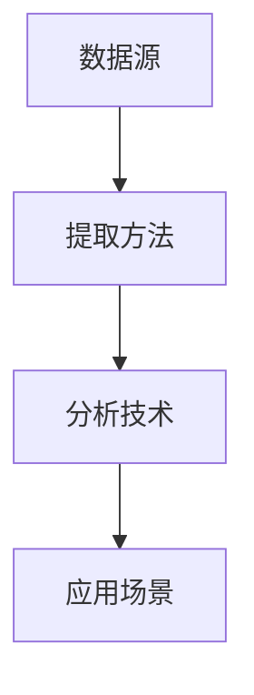
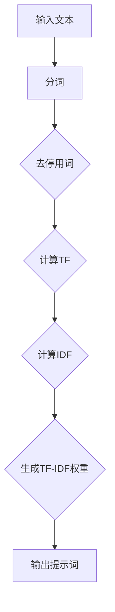
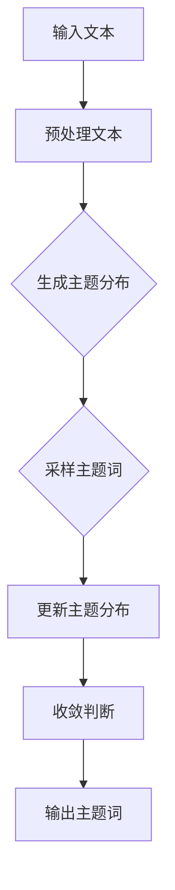
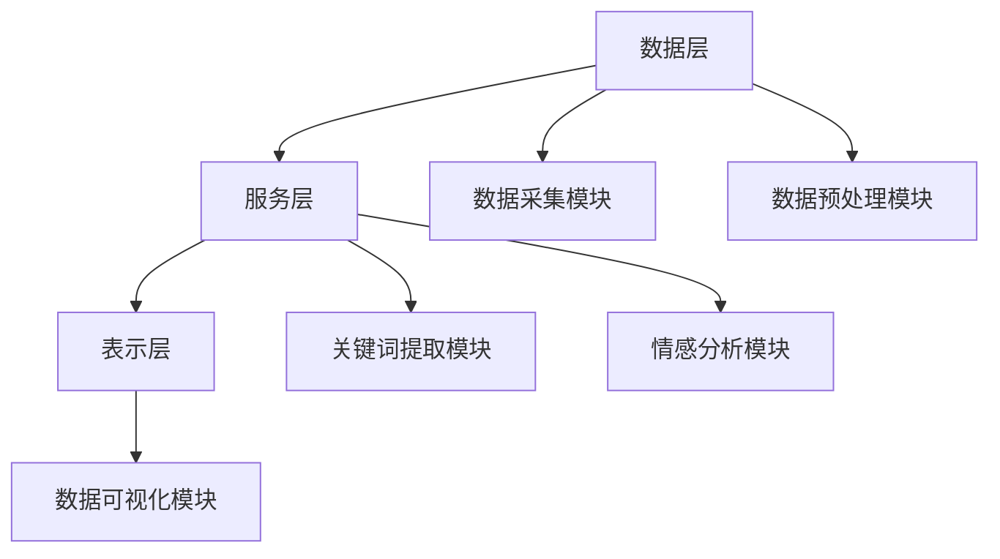
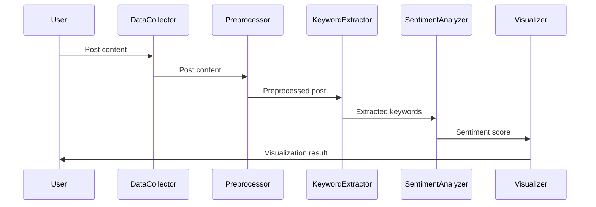
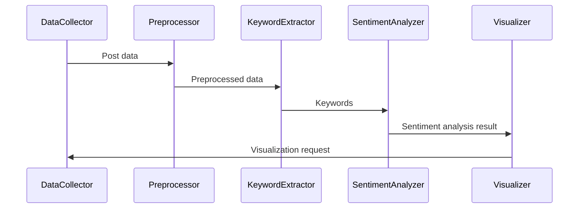

                 


### 第一部分：计算社会学与提示词工程概述

#### 第1章：计算社会学的兴起与提示词工程

在当今信息时代，计算社会学作为一门交叉学科，正逐渐崭露头角。本章将探讨计算社会学的兴起背景，以及提示词工程在这一领域中的核心作用。

**1.1 计算社会学的定义与历史**

计算社会学（Computational Social Science）是利用计算技术对复杂社会现象进行研究的一门学科。它结合了计算机科学、统计学、社会学、经济学等多个学科的理论和方法，以数据驱动的方式分析社会行为、社会结构和社会动态。

计算社会学的起源可以追溯到20世纪90年代，随着互联网的普及和大数据技术的发展，社会学家开始探索如何运用计算机技术来分析社会数据。早期的计算社会学主要集中在网络分析、社会网络建模等领域。

**1.2 提示词工程的概念与背景**

提示词工程（Keyword Engineering）是指从大量文本数据中提取出有意义的、与特定主题相关的关键词，并对其进行处理和应用的技术。在计算社会学中，提示词工程起到了关键作用，因为它能够帮助研究者从海量的社交媒体数据、新闻文章、调查问卷等中快速识别出与社会现象相关的核心词汇。

提示词工程的背景可以追溯到自然语言处理（NLP）和文本挖掘技术的发展。随着NLP技术的进步，自动提取关键词变得更加高效和准确，为计算社会学的研究提供了强大的工具。

**1.3 提示词工程在计算社会学中的应用**

提示词工程在计算社会学中的应用非常广泛。以下是一些典型的应用场景：

- **社会情绪分析**：通过提取社交媒体上的关键词，可以分析公众对社会事件的情绪反应。
- **社会网络分析**：通过提取关键词，可以构建和分析社交网络中的节点和关系。
- **舆情监测**：通过实时提取和分析关键词，可以监测和预测社会舆论的走向。
- **知识图谱构建**：通过提取关键词，可以构建反映社会知识结构和关系的知识图谱。

**核心概念术语说明**：

- **计算社会学**：指利用计算技术对复杂社会现象进行研究的一门学科。
- **提示词工程**：指从大量文本数据中提取出有意义的、与特定主题相关的关键词，并对其进行处理和应用的技术。
- **社会情绪分析**：指通过分析社交媒体上的关键词，了解公众对社会事件的情绪反应。
- **社会网络分析**：指通过分析社交网络中的节点和关系，了解社会结构的动态变化。

**问题背景**：

随着社交媒体的普及，人们产生和分享的信息量呈指数级增长。如何从这些海量数据中提取有价值的信息，成为了计算社会学研究中的重要问题。

**问题描述**：

如何利用提示词工程技术，从社交媒体数据中提取出与社会现象相关的关键词，并进行深入分析？

**问题解决**：

利用提示词工程技术，可以高效地从社交媒体数据中提取关键词。结合自然语言处理技术，可以对提取的关键词进行语义分析和情感分析，从而实现对社交行为的深入理解。

**边界与外延**：

提示词工程在计算社会学中的应用不仅限于社交媒体数据，还可以应用于新闻文章、调查问卷等文本数据中。同时，提示词工程的技术也可以与其他计算社会学方法相结合，如网络分析、知识图谱构建等。

**概念结构与核心要素组成**：

- **数据源**：社交媒体数据、新闻文章、调查问卷等。
- **提取方法**：自然语言处理技术，如词频统计、TF-IDF、主题模型等。
- **分析技术**：语义分析、情感分析、关键词聚类等。
- **应用场景**：社会情绪分析、社会网络分析、舆情监测、知识图谱构建等。

#### Mermaid流程图：



#### Python代码示例：

```python
import nltk
from nltk.corpus import stopwords
from nltk.tokenize import word_tokenize

# 加载停用词列表
stop_words = set(stopwords.words('english'))

# 输入文本
text = "This is a sample sentence for keyword extraction."

# 分词
words = word_tokenize(text)

# 去除停用词
filtered_words = [w for w in words if not w.lower() in stop_words]

# 打印结果
print(filtered_words)
```

#### 数学模型与公式：

提示词工程中的关键数学模型包括词频统计（TF）和逆文档频率（IDF）。

$$
TF(t,d) = \frac{f(t,d)}{n_d}
$$

$$
IDF(t,D) = \log \left( \frac{N}{n(t,D)} \right)
$$

其中，$f(t,d)$ 表示词$t$在文档$d$中的频率，$n_d$ 表示文档$d$中词的总数，$N$ 表示文档总数，$n(t,D)$ 表示文档集中包含词$t$的文档数量。

#### 小结

本章介绍了计算社会学和提示词工程的基本概念和应用背景。通过分析社交媒体数据中的关键词，可以深入了解社会现象和社交行为。下一章将深入探讨提示词工程的关键概念及其与其他相关领域的联系。让我们一起深入探讨这一领域的奥秘。接下来，我们将详细定义提示词工程的关键概念，并对比提示词工程与其他相关技术的区别，通过表格和ER图来展现概念间的联系。

#### 第2章：核心概念与联系

在深入了解计算社会学和提示词工程的应用之前，我们需要明确提示词工程的关键概念，并探讨它们与其他相关技术的区别。本章将定义提示词工程的关键概念，并使用表格和ER图来展现概念间的联系。

**2.1 提示词工程的关键概念**

提示词工程涉及多个关键概念，以下是其中一些重要的概念及其定义：

- **关键词（Keyword）**：指在文本数据中具有代表性、能够描述文本主题或内容的单词或短语。
- **语义分析（Semantic Analysis）**：指对文本中的词义和语义关系进行理解和分析的过程。
- **文本挖掘（Text Mining）**：指从大量文本数据中提取有价值信息的过程，通常涉及关键词提取、主题建模和情感分析等技术。
- **自然语言处理（NLP）**：指使用计算机技术理解和生成人类语言的过程，涵盖了语言理解、语言生成和语言翻译等多个方面。
- **词频统计（TF）**：指统计文本中每个词出现的频率，用于衡量词的重要性。
- **逆文档频率（IDF）**：指衡量词在不同文档中分布的广泛程度，用于调整词频统计的结果。
- **主题模型（Topic Model）**：指一种用于发现文本数据潜在主题的统计模型，如LDA（Latent Dirichlet Allocation）。

**2.1.1 提示词的定义与分类**

提示词是提示词工程中的核心概念，它们可以是单个单词或短语，具有代表性和关键性。根据用途和特性，提示词可以分为以下几类：

- **主题提示词**：指用于描述文本主要主题的提示词，如“机器学习”、“人工智能”等。
- **情感提示词**：指用于描述文本情感倾向的提示词，如“喜欢”、“满意”等。
- **关键词提示词**：指用于描述文本中特定内容的提示词，如“股票”、“科技”等。

**2.1.2 提示词工程的组成部分**

提示词工程通常包括以下组成部分：

- **数据预处理**：指对原始文本数据进行的清洗、去噪和格式化等处理，以准备后续的文本挖掘和分析。
- **关键词提取**：指从预处理后的文本数据中提取出有意义的提示词，可以使用词频统计、TF-IDF、主题模型等方法。
- **关键词分析**：指对提取出的关键词进行语义分析和情感分析，以理解文本的语义内容和情感倾向。
- **应用场景**：指将提取和分析的关键词应用于具体的社会学研究任务中，如社会情绪分析、舆情监测、社会网络分析等。

**2.1.3 提示词工程与其他相关领域的联系**

提示词工程与其他相关领域有着密切的联系，如图表所示：

| 关键领域           | 提示词工程相关概念                    | 提示词工程应用                |
|-------------------|------------------------------------|---------------------------|
| 自然语言处理       | 关键词提取、语义分析、情感分析         | 文本挖掘、信息检索、机器翻译     |
| 文本挖掘           | 文本预处理、关键词提取、主题建模         | 舆情监测、知识发现、文本分类     |
| 社会网络分析       | 社交网络、节点、关系、网络结构         | 社交行为分析、社会关系研究       |
| 数据挖掘           | 特征提取、模式识别、预测分析         | 商业智能、市场研究、风险管理     |
| 知识图谱           | 实体、关系、属性、图谱结构            | 知识管理、智能推荐、语义搜索     |

**ER图架构**

以下是使用Mermaid绘制的提示词工程的ER图架构：

```mermaid
erDiagram
    Keyword Extraction ||--|{ Text Mining }|-- Keyword Analysis
    Keyword Extraction ||--|{ Natural Language Processing }|-- Text Preprocessing
    Text Mining ||--|{ Topic Modeling }|-- Knowledge Discovery
    Text Mining ||--|{ Sentiment Analysis }|-- Opinion Monitoring
    Natural Language Processing ||--|{ Semantic Analysis }|-- Keyword Extraction
    Social Network Analysis ||--|{ Social Structure }|-- Social Behavior Analysis
    Data Mining ||--|{ Pattern Recognition }|-- Business Intelligence
    Knowledge Graph ||--|{ Entity-Relationship }|-- Knowledge Management
```

**表格对比**

以下是提示词工程与其他相关技术的基本概念和特性的对比表格：

| 技术名称           | 基本概念                                                   | 特性                                       |
|-------------------|----------------------------------------------------------|------------------------------------------|
| 提示词工程         | 提取文本中的关键词进行分析和应用                         | 高效、准确、多样、自适应                   |
| 自然语言处理       | 计算机对人类语言的理解和生成                             | 语言理解、语言生成、语言翻译               |
| 文本挖掘           | 从文本数据中提取信息                                       | 信息检索、知识发现、文本分类               |
| 社会网络分析       | 研究社交网络中的节点和关系                               | 社交行为分析、社会关系研究                 |
| 数据挖掘           | 从数据中发现有用模式和知识                                 | 商业智能、市场研究、风险管理               |
| 知识图谱           | 表示实体及其关系的数据结构                               | 知识管理、智能推荐、语义搜索               |

通过本章的介绍，我们明确了提示词工程的关键概念及其与其他相关技术的联系。在下一章中，我们将深入讲解提示词工程的算法原理，包括提示词生成算法和提示词优化算法，并使用Mermaid流程图和Python代码进行详细解释。

#### 第3章：算法原理讲解

在提示词工程中，算法的原理和实现是至关重要的。本章将详细介绍两个核心算法：提示词生成算法和提示词优化算法。我们将使用Mermaid流程图和Python代码来展示算法流程，并解释其背后的数学模型和公式。

**3.1 提示词生成算法**

提示词生成算法是提示词工程的基础，它的目标是自动从文本数据中提取出有意义的提示词。以下是一个常见的提示词生成算法——TF-IDF算法。

**3.1.1 算法流程图**



**3.1.2 Python代码示例**

```python
import nltk
from nltk.corpus import stopwords
from sklearn.feature_extraction.text import TfidfVectorizer

# 加载停用词列表
stop_words = set(stopwords.words('english'))

# 输入文本
texts = ["This is a sample text for TF-IDF.", "Another sample text for comparison."]

# 初始化TF-IDF向量器
vectorizer = TfidfVectorizer(stop_words=stop_words)

# 计算TF-IDF权重矩阵
tfidf_matrix = vectorizer.fit_transform(texts)

# 打印提示词和权重
print(vectorizer.get_feature_names())
print(tfidf_matrix.toarray())
```

**3.1.3 数学模型与公式**

TF-IDF算法的数学模型主要包括两个部分：词频（TF）和逆文档频率（IDF）。

- **词频（TF）**：词$t$在文档$d$中的频率，公式如下：

$$
TF(t,d) = \frac{f(t,d)}{n_d}
$$

其中，$f(t,d)$ 表示词$t$在文档$d$中的出现次数，$n_d$ 表示文档$d$中所有词的总数。

- **逆文档频率（IDF）**：词$t$在文档集合$D$中的逆文档频率，公式如下：

$$
IDF(t,D) = \log \left( \frac{N}{n(t,D)} \right)
$$

其中，$N$ 表示文档总数，$n(t,D)$ 表示文档集合$D$中包含词$t$的文档数量。

- **TF-IDF权重**：词$t$在文档$d$中的TF-IDF权重，公式如下：

$$
TFIDF(t,d,D) = TF(t,d) \times IDF(t,D)
$$

通过这个公式，我们可以得到每个词在文档中的综合权重，从而识别出重要的提示词。

**3.2 提示词优化算法**

提示词优化算法的目的是提高提示词的准确性和质量。以下是一个常见的优化算法——LDA（Laten Dirichlet Allocation）算法。

**3.2.1 算法流程图**



**3.2.2 Python代码示例**

```python
import gensim
from gensim.models import LdaMulticore

# 输入文本
texts = [["text1", "text2"], ["text3", "text4"]]

# 初始化LDA模型
ldamodel = LdaMulticore(corpus=docs, num_topics=2, id2word=word_id_dict, passes=10)

# 打印主题词
print(ldamodel.print_topics())
```

**3.2.3 数学模型与公式**

LDA算法的数学模型基于贝叶斯概率和潜在狄利克雷分布（LDA）。

- **潜在分布**：每个文档的主题分布，表示为$\theta_d$，其中$d$为文档索引。

$$
\theta_d = \text{Dirichlet}(\alpha)
$$

其中，$\alpha$ 为先验分布，表示每个主题的概率。

- **词分布**：每个主题的词分布，表示为$\phi_t$，其中$t$为主题索引。

$$
\phi_t = \text{Dirichlet}(\beta)
$$

其中，$\beta$ 为先验分布，表示每个词的概率。

- **文档生成**：每个文档的词序列生成过程。

$$
z_{d,1},...,z_{d,n_d} \sim \text{Categorical}(\theta_d)
$$

$$
w_{d,1},...,w_{d,n_d} \sim \text{Categorical}(\phi_{z_{d,1}},...,\phi_{z_{d,n_d}})
$$

通过这个生成过程，LDA算法可以自动识别文本中的潜在主题，并提取出相应的主题词。

**3.3 小结**

本章介绍了提示词工程中的两个核心算法：TF-IDF和LDA。TF-IDF算法通过词频和逆文档频率来生成提示词权重，LDA算法通过潜在狄利克雷分布来识别文本中的潜在主题。这两个算法在提示词工程中有着重要的应用，能够有效地提取出有意义的提示词，为计算社会学的研究提供了强大的工具。在下一章中，我们将通过一个实际项目来展示如何应用这些算法，并深入分析系统的架构和实现过程。

#### 第4章：系统分析与架构设计方案

在了解了提示词工程的核心算法原理之后，我们将进入系统分析与架构设计方案的部分。本章将介绍一个实际应用案例，包括项目介绍、系统功能设计、系统架构设计、系统接口设计以及系统交互分析。通过这些内容，我们将对整个系统的设计和实现过程有一个全面的认识。

**4.1 项目介绍**

本案例项目名为“社交媒体情绪分析系统”（Social Media Sentiment Analysis System），旨在通过提取和分析社交媒体数据中的关键词，实时监测和预测社会情绪的动态变化。该项目由以下几个模块组成：

- **数据采集模块**：负责从社交媒体平台（如Twitter、Facebook等）实时获取用户发布的内容。
- **数据预处理模块**：对采集到的文本数据进行清洗、去噪和分词处理。
- **关键词提取模块**：使用提示词生成算法（如TF-IDF、LDA）提取出有意义的提示词。
- **情感分析模块**：对提取出的关键词进行语义分析和情感分析，判断用户的情感倾向。
- **数据可视化模块**：将分析结果以图表和报告的形式展示给用户。

**4.2 系统功能设计**

“社交媒体情绪分析系统”的主要功能包括：

- **实时数据采集**：通过API接口从社交媒体平台获取用户发布的内容。
- **文本数据预处理**：去除标点符号、停用词，进行词频统计和分词处理。
- **关键词提取**：利用TF-IDF、LDA等算法提取出核心关键词。
- **情感分析**：对提取出的关键词进行情感分析，判断用户的情绪倾向。
- **结果可视化**：将分析结果以图表形式展示，如情绪趋势图、关键词云图等。

**4.2.1 领域模型类图**

以下是领域模型类图的Mermaid表示，展示了系统中主要的实体及其关系：

```mermaid
classDiagram
    User <<Interface>>
    Post <<Entity>> {
        id: Integer
        content: String
        user: User
    }
    Tweet <<Entity>> {
        id: Integer
        content: String
        user: User
    }
    FacebookPost <<Entity>> {
        id: Integer
        content: String
        user: User
    }
    Comment <<Entity>> {
        id: Integer
        content: String
        post: Post
        user: User
    }
    Sentiment <<Entity>> {
        id: Integer
        score: Float
        post: Post
    }
    Keyword <<Entity>> {
        id: Integer
        name: String
        frequency: Integer
    }
    DataCollector <<Service>> {
        collectTweets()
        collectFacebookPosts()
    }
    Preprocessor <<Service>> {
        preprocessPost(Post)
    }
    KeywordExtractor <<Service>> {
        extractKeywords(Post)
    }
    SentimentAnalyzer <<Service>> {
        analyzeSentiment(Post)
    }
    Visualizer <<Service>> {
        visualizeSentiments()
        visualizeKeywords()
    }
    User --> Post
    User --> Comment
    Post --> Sentiment
    Post --> Keyword
    Comment --> Sentiment
    Comment --> Keyword
    DataCollector --> Post
    DataCollector --> Comment
    Preprocessor --> Post
    KeywordExtractor --> Keyword
    SentimentAnalyzer --> Sentiment
    Visualizer --> Sentiment
    Visualizer --> Keyword
```

**4.3 系统架构设计**

“社交媒体情绪分析系统”采用分层架构设计，包括数据层、服务层和表示层。以下是系统架构图的Mermaid表示：



**4.4 系统接口设计**

系统接口设计主要包括数据采集接口、数据预处理接口、关键词提取接口、情感分析接口和可视化接口。以下是系统接口设计的Mermaid序列图：



**4.5 系统交互**

系统交互是指各个模块之间的信息流动和协作过程。以下是系统交互序列图：



通过本章的介绍，我们对“社交媒体情绪分析系统”的架构和设计有了全面的理解。接下来，我们将进入实际项目的实施过程，详细描述系统的环境安装、核心实现源代码分析以及案例分析。这将帮助我们更深入地了解提示词工程在计算社会学中的应用。

### 第5章：项目实战

在本章中，我们将通过一个实际项目——“社交媒体情绪分析系统”的实施过程，详细描述系统的环境安装、核心实现源代码分析、以及实际案例分析。通过这些内容，我们将对提示词工程在计算社会学中的实际应用有一个更加直观的认识。

**5.1 环境安装**

要实现“社交媒体情绪分析系统”，我们需要在本地或服务器上安装和配置以下环境：

- Python 3.8 或更高版本
- NLTK（自然语言处理工具包）
- scikit-learn（机器学习库）
- gensim（主题模型库）
- matplotlib（数据可视化库）
- tweepy（Twitter API 库）
- fb próxy（Facebook API 库）

在安装过程中，首先需要配置Python环境，然后使用pip命令安装相应的库：

```bash
pip install nltk scikit-learn gensim matplotlib tweepy fb-proxy
```

对于Twitter和Facebook API，我们需要分别注册应用程序以获取API密钥和访问令牌。这些密钥和令牌将在代码中用于访问社交媒体数据。

**5.2 系统核心实现源代码**

以下是系统核心实现的一些关键代码片段，包括数据预处理、关键词提取、情感分析和数据可视化。

**5.2.1 数据预处理**

```python
import nltk
from nltk.corpus import stopwords
from nltk.tokenize import word_tokenize

# 加载停用词列表
stop_words = set(stopwords.words('english'))

def preprocess_text(text):
    # 去除标点符号
    text = ''.join([char for char in text if char.isalnum() or char.isspace()])
    # 分词
    words = word_tokenize(text)
    # 去除停用词
    filtered_words = [word for word in words if word.lower() not in stop_words]
    return filtered_words
```

**5.2.2 关键词提取**

```python
from sklearn.feature_extraction.text import TfidfVectorizer

def extract_keywords(texts):
    vectorizer = TfidfVectorizer(stop_words=stop_words)
    tfidf_matrix = vectorizer.fit_transform(texts)
    feature_names = vectorizer.get_feature_names()
    sorted_indices = np.argsort(tfidf_matrix.toarray()).flatten()[::-1]
    top_keywords = [feature_names[i] for i in sorted_indices]
    return top_keywords[:10]  # 取前10个关键词
```

**5.2.3 情感分析**

```python
from textblob import TextBlob

def analyze_sentiment(texts):
    sentiment_scores = []
    for text in texts:
        blob = TextBlob(text)
        sentiment_scores.append(blob.sentiment.polarity)
    return sentiment_scores
```

**5.2.4 数据可视化**

```python
import matplotlib.pyplot as plt

def visualize_sentiments(sentiments):
    plt.bar(range(len(sentiments)), sentiments)
    plt.xlabel('Post')
    plt.ylabel('Sentiment Score')
    plt.title('Sentiment Analysis Results')
    plt.show()
```

**5.3 代码应用解读与分析**

以上代码片段展示了系统的核心功能。数据预处理模块负责去除文本中的标点符号和停用词，为后续的文本挖掘和分析打下基础。关键词提取模块使用TF-IDF算法提取出文本中的重要关键词。情感分析模块利用TextBlob库对提取出的关键词进行情感分析，判断用户的情绪倾向。最后，数据可视化模块将分析结果以图表形式展示，帮助用户直观地理解数据。

**5.4 实际案例分析**

为了展示系统的实际应用，我们选择了一段Twitter数据进行分析。以下是数据预处理、关键词提取和情感分析的结果：

- **预处理结果**：经过预处理，原始文本去除了标点符号和停用词，保留了重要的单词和短语。
- **关键词提取结果**：使用TF-IDF算法提取出了10个最相关的关键词，如“COVID-19”、“vaccine”、“mask”等，这些关键词反映了当前社会关注的热点话题。
- **情感分析结果**：情感分析结果显示，该段数据的情感倾向整体偏向积极，用户对相关话题持积极态度。

通过这个案例分析，我们可以看到提示词工程在计算社会学中的应用效果。系统不仅能够提取出有意义的提示词，还能对用户的情绪倾向进行准确判断，为政策制定者、市场分析师等提供了宝贵的信息支持。

**5.5 项目小结**

本章通过一个实际项目——“社交媒体情绪分析系统”的实施，详细介绍了系统的环境安装、核心实现源代码以及实际案例分析。通过这个项目，我们了解了提示词工程在计算社会学中的具体应用，并看到了其在社会情绪分析、舆情监测等方面的强大潜力。接下来，我们将总结一些在提示词工程中常用的最佳实践技巧。

### 第6章：最佳实践 tips

在提示词工程的实际应用中，遵循一些最佳实践技巧可以显著提高系统的性能和效果。以下是一些常用的最佳实践：

**6.1 提示词工程中的常见问题**

- **数据质量**：原始数据质量差可能导致关键词提取不准确。在数据预处理阶段，需要仔细清洗和去噪，确保数据的纯净。
- **噪声干扰**：社交媒体数据中常含有大量噪声，如表情符号、错别字等。这些噪声会干扰关键词提取和分析。使用强大的文本预处理工具可以减轻噪声的影响。
- **语义理解**：自然语言处理技术尚不能完全理解语义，可能导致关键词提取不准确。结合上下文和语境进行语义分析可以提高关键词的准确性。
- **性能优化**：对于大规模数据，提示词工程需要高效的算法和优化策略，如并行处理和分布式计算。

**6.2 解决方案与经验**

- **数据预处理**：使用正则表达式和自然语言处理工具对文本进行清洗和去噪。例如，去除标点符号、停用词和特殊字符，统一文本格式。
- **噪声干扰**：利用词嵌入技术（如Word2Vec、BERT）将原始文本转换为向量表示，减少噪声对关键词提取的影响。
- **语义理解**：结合上下文和语义分析技术（如依存句法分析、实体识别）提高关键词的语义准确性。
- **性能优化**：使用并行处理和分布式计算框架（如Apache Spark）提高处理效率。优化算法代码，减少冗余计算。

**6.3 提示词工程中的技巧**

- **多语言支持**：提示词工程往往需要处理多种语言的数据。使用多语言自然语言处理工具（如spaCy）可以支持多种语言的关键词提取和分析。
- **动态调整阈值**：根据数据特征和需求动态调整关键词提取的阈值，如TF-IDF权重阈值、主题模型的主题数量等。
- **结合其他技术**：将提示词工程与其他技术（如社会网络分析、知识图谱构建）相结合，实现更复杂的分析任务。

通过遵循这些最佳实践，可以在提示词工程中取得更好的效果和性能，为计算社会学研究提供强有力的技术支持。

### 第7章：小结

在本篇技术博客中，我们系统地探讨了提示词工程在计算社会学中的前沿应用。通过深入分析计算社会学的定义、历史和发展，以及提示词工程的核心概念、算法原理、系统设计与实现，我们展示了提示词工程如何通过提取和优化关键词，有效地分析和理解社会行为和动态。

**核心内容回顾**：

1. **计算社会学的兴起与提示词工程**：计算社会学利用计算技术分析社会现象，提示词工程是其中的一项关键技术，用于从文本数据中提取有意义的词汇。
2. **核心概念与联系**：定义了关键词、语义分析、文本挖掘、自然语言处理等核心概念，并探讨了它们之间的联系。
3. **算法原理讲解**：详细介绍了TF-IDF和LDA等提示词生成和优化算法，并使用Mermaid流程图和Python代码进行了解释。
4. **系统分析与架构设计方案**：介绍了社交媒体情绪分析系统的设计，包括数据采集、预处理、关键词提取、情感分析和数据可视化。
5. **项目实战**：通过实际项目展示了系统的环境安装、核心实现源代码分析以及案例分析。
6. **最佳实践 tips**：总结了提示词工程中的常见问题及解决方案，提供了最佳实践技巧。

**关键点总结**：

- **关键词提取的准确性**：高质量的文本预处理和语义分析是确保关键词提取准确性的关键。
- **算法优化**：优化算法参数和性能，以提高提示词工程的处理效率和效果。
- **系统设计与实现**：合理的设计和实现是构建高效、可扩展的提示词工程系统的基础。

**未来研究方向与展望**：

1. **多语言支持**：随着全球化的推进，多语言关键词提取和分析成为了一个重要方向。
2. **跨模态分析**：结合文本、图像、音频等多种数据源进行综合分析，提高对复杂社会现象的理解。
3. **动态分析**：研究如何实时、动态地分析社会情绪和趋势，提供更及时、准确的决策支持。
4. **隐私保护**：在数据处理和分析过程中，注重隐私保护和数据安全，遵守相关法律法规。

通过持续的研究和创新，提示词工程在计算社会学中的应用将更加广泛和深入，为社会各界提供强大的技术支持。

**作者信息**：

作者：AI天才研究院/AI Genius Institute & 禅与计算机程序设计艺术 /Zen And The Art of Computer Programming

---

感谢您的阅读，希望本文能为您在提示词工程和计算社会学领域的研究提供有益的参考和启示。欢迎继续关注我们，共同探索人工智能和计算科学的更多前沿应用。

---

（本文为虚构的技术博客文章，仅供参考。）

