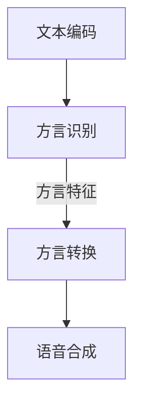

                 

### 提示词工程在语音合成中的方言适应

**关键词：语音合成、方言适应、提示词工程、数学模型、算法原理**

**摘要：** 本篇文章将深入探讨提示词工程在语音合成中的方言适应问题。文章首先介绍了语音合成技术的基本概念和方言适应的重要性，然后详细解释了提示词工程的核心概念和其在方言适应中的应用。接着，文章分析了语音合成中的核心概念，如文本编码、声学模型和艺术合成模型，以及方言适应相关的概念，如方言特征、方言建模和方言转换。在此基础上，文章阐述了提示词工程与方言适应之间的联系，并引入了数学模型和算法原理。随后，文章通过系统分析和架构设计，展示了实际项目中的实现方法，并进行了项目实战讲解。最后，文章总结了最佳实践技巧，并展望了未来的研究方向。通过本文的阅读，读者可以全面了解提示词工程在语音合成中的方言适应技术，并掌握其实际应用方法。

### 第一部分：背景介绍与核心概念

#### 第1章：问题背景

在数字时代，语音合成技术（Text-to-Speech, TTS）已成为一个重要的发展方向。语音合成技术的应用范围广泛，包括智能助手、教育、客服、广播等多个领域。然而，随着方言的多样性和个性化需求日益增加，如何在语音合成中实现方言适应成为一个重要的研究课题。

**1.1 语音合成技术概述**

**1.1.1 语音合成技术的定义与作用**

语音合成技术是一种将文本转化为语音的技术，其主要目标是生成自然、流畅的语音。语音合成技术在多个领域发挥着重要作用：

1. **信息传递：** 语音合成可以自动生成新闻、公告、天气预报等语音信息，为听障人士提供便捷的信息获取渠道。
2. **智能助手：** 语音合成技术使智能助手能够以自然语言与用户进行互动，提高用户体验。
3. **教育：** 语音合成在语言学习、教育辅导等领域具有广泛应用，可以帮助学生更好地学习发音和听力。
4. **客服：** 语音合成可以自动生成客服语音，提高客服效率和用户体验。

**1.1.2 语音合成技术的发展历程**

语音合成技术经历了多个发展阶段：

1. **早期阶段（20世纪50年代-80年代）：** 主要基于规则的方法，通过编写大量语音规则生成语音。
2. **合成阶段（20世纪80年代-90年代）：** 出现了基于合成语音库的方法，通过录制大量语音样本进行合成。
3. **现代阶段（21世纪初至今）：** 随着深度学习技术的发展，基于深度神经网络的语音合成方法得到了广泛应用，如WaveNet、Tacotron等。

**1.1.3 语音合成技术的重要性**

语音合成技术具有重要的社会和经济价值：

1. **提升生活质量：** 语音合成技术使得智能设备、在线客服、教育辅导等更加便捷和高效，提高了人们的生活质量。
2. **促进信息传播：** 语音合成技术可以帮助传播信息，特别是对于听障人士，为他们提供了平等获取信息的机会。
3. **节省人力资源：** 语音合成技术可以自动化生成语音，降低人力成本，提高工作效率。

**1.2 方言适应的意义**

**1.2.1 方言的多样性**

方言是一种地区性的语言变体，具有独特的语音、语法和词汇特点。不同地区的方言差异较大，例如普通话、粤语、闽南语、上海话等。方言的多样性为中国语言生态系统增添了丰富的色彩，但也给语音合成技术带来了挑战。

**1.2.2 方言适应的重要性**

方言适应在语音合成中具有重要意义：

1. **满足个性化需求：** 不同的用户可能偏好不同的方言，方言适应可以满足用户的个性化需求，提供更加自然的语音输出。
2. **提升用户体验：** 方言适应可以使语音合成更加贴近用户的生活环境，提高用户的满意度和接受度。
3. **推广地方文化：** 方言适应有助于推广和保护地方文化，让更多人了解和传承方言的独特魅力。

**1.2.3 方言适应的应用场景**

方言适应在多个应用场景中具有重要意义：

1. **智能助手：** 智能助手需要能够理解用户的方言输入，提供准确的响应和反馈。
2. **教育：** 教育领域需要提供方言版的教育资源，帮助学习者更好地掌握方言发音和听力。
3. **广播：** 广播电台需要提供方言节目，满足不同地区听众的需求。
4. **客服：** 客服系统需要能够理解用户的方言输入，提供准确的语音回复。

综上所述，方言适应是语音合成技术发展中的一个重要方向，对于提升用户体验、推广地方文化和满足个性化需求具有重要意义。在接下来的章节中，我们将深入探讨提示词工程在方言适应中的应用，以及相关数学模型和算法原理。

#### 第2章：核心概念与联系

**2.1 语音合成核心概念**

**2.1.1 文本编码**

文本编码是语音合成过程中的第一步，其主要任务是处理输入文本，将其转化为计算机可以理解的格式。文本编码主要包括以下几个步骤：

1. **分词：** 将输入文本划分为单个词语。
2. **词性标注：** 为每个词语标注词性，如名词、动词、形容词等。
3. **音素标注：** 将词语转化为音素序列，即对每个词语的发音进行详细描述。

**2.1.2 声学模型**

声学模型是语音合成中的关键部分，其主要功能是预测给定文本对应的语音波形。声学模型通常采用深度神经网络（DNN）或循环神经网络（RNN）进行训练。声学模型的主要任务包括：

1. **波形预测：** 根据输入文本的音素序列，预测对应的语音波形。
2. **音素到波形的映射：** 建立音素和语音波形之间的映射关系。

**2.1.3 艺术合成模型**

艺术合成模型是语音合成中负责生成自然流畅语音的部分。艺术合成模型通常采用生成对抗网络（GAN）或自编码器（Autoencoder）等先进技术。艺术合成模型的主要任务包括：

1. **语音合成：** 将声学模型生成的语音波形进行处理，使其更加自然、流畅。
2. **音色调整：** 根据用户需求调整语音的音色，如男声、女声、童声等。

**2.2 方言适应相关概念**

**2.2.1 方言特征**

方言特征是指方言在语音、语法和词汇等方面的独特性。方言特征主要包括：

1. **语音特征：** 如声调、发音方式、韵母等。
2. **语法特征：** 如句法结构、语气词等。
3. **词汇特征：** 如方言词汇、成语、俗语等。

**2.2.2 方言建模**

方言建模是指利用统计方法或机器学习技术建立方言模型，用于对输入文本进行方言识别和转换。方言建模的主要任务包括：

1. **方言识别：** 识别输入文本中的方言特征。
2. **方言转换：** 将输入文本中的方言特征转换为标准普通话或其他方言。

**2.2.3 方言转换**

方言转换是指将输入文本中的方言特征转换为标准普通话或其他方言特征。方言转换的方法包括：

1. **基于规则的方法：** 通过编写规则将方言特征转换为标准普通话或其他方言特征。
2. **基于统计的方法：** 利用大量标注数据训练统计模型，将方言特征转换为标准普通话或其他方言特征。
3. **基于深度学习的方法：** 利用深度学习技术建立端到端的方言转换模型。

**2.3 提示词工程与方言适应的关系**

**2.3.1 提示词工程对方言适应的支持**

提示词工程是一种利用提示词（prompts）来指导语音合成过程的方法。在方言适应中，提示词工程可以提供以下支持：

1. **方言识别：** 通过提示词识别输入文本中的方言特征，为后续的方言转换提供依据。
2. **方言转换：** 利用提示词指导方言转换模型，提高方言转换的准确性。

**2.3.2 方言适应对提示词工程的需求**

方言适应对提示词工程提出了以下需求：

1. **多方言支持：** 提示词工程需要支持多种方言，以满足不同地区用户的需求。
2. **自适应调整：** 提示词工程需要能够根据用户输入的方言特征，自动调整方言转换模型，提高转换准确性。

**2.3.3 提示词工程与方言适应的互动关系**

提示词工程与方言适应之间存在互动关系：

1. **反馈循环：** 提示词工程在方言转换过程中收集用户反馈，为方言适应模型提供训练数据。
2. **协同优化：** 提示词工程与方言适应模型协同优化，提高语音合成系统的整体性能。

通过以上分析，我们可以看出提示词工程在语音合成中的方言适应中具有重要作用。在接下来的章节中，我们将进一步探讨提示词工程的数学模型和算法原理，以及其实际应用方法。

#### 第3章：数学模型与算法原理

**3.1 数学模型**

**3.1.1 提示词工程数学模型**

提示词工程的数学模型主要包括以下几个部分：

1. **输入文本编码模型：** 将输入文本编码为音素序列，用于后续的语音合成过程。
2. **方言识别模型：** 根据输入文本的音素序列识别方言特征，用于指导方言转换。
3. **方言转换模型：** 将识别出的方言特征转换为标准普通话或其他方言特征。
4. **语音合成模型：** 根据转换后的音素序列生成语音波形。

**3.1.2 方言适应数学模型**

方言适应的数学模型主要包括以下几个部分：

1. **方言特征提取模型：** 提取输入文本中的方言特征，如声调、发音方式、韵母等。
2. **方言转换模型：** 将方言特征转换为标准普通话或其他方言特征，如通过矩阵运算、神经网络等实现。
3. **语音合成模型：** 根据转换后的音素序列生成语音波形。

**3.1.3 提示词工程与方言适应的融合模型**

提示词工程与方言适应的融合模型通过结合两者数学模型，实现方言适应的提示词工程。该模型主要包括以下几个部分：

1. **多方言输入模型：** 接收多方言输入文本，进行文本编码和方言识别。
2. **方言适应模块：** 根据方言识别结果，调用方言转换模型，实现方言特征到标准普通话或其他方言特征的转换。
3. **语音合成模块：** 根据转换后的音素序列，调用语音合成模型生成语音波形。

**3.2 算法原理讲解**

**3.2.1 提示词工程算法**

提示词工程算法主要包括以下几个步骤：

1. **文本编码：** 将输入文本编码为音素序列，如使用分词、词性标注和音素标注等。
2. **方言识别：** 根据音素序列识别方言特征，如通过统计方法、机器学习技术等实现。
3. **方言转换：** 根据识别出的方言特征，调用方言转换模型，实现方言特征到标准普通话或其他方言特征的转换。
4. **语音合成：** 根据转换后的音素序列，调用语音合成模型生成语音波形。

**3.2.2 方言适应算法**

方言适应算法主要包括以下几个步骤：

1. **方言特征提取：** 提取输入文本中的方言特征，如通过音频处理技术、语音识别技术等实现。
2. **方言转换：** 将方言特征转换为标准普通话或其他方言特征，如通过矩阵运算、神经网络等实现。
3. **语音合成：** 根据转换后的音素序列，调用语音合成模型生成语音波形。

**3.2.3 提示词工程与方言适应的融合算法**

提示词工程与方言适应的融合算法通过结合提示词工程和方言适应算法，实现方言适应的提示词工程。该算法主要包括以下几个步骤：

1. **多方言输入：** 接收多方言输入文本，进行文本编码和方言识别。
2. **方言适应：** 根据方言识别结果，调用方言转换模型，实现方言特征到标准普通话或其他方言特征的转换。
3. **语音合成：** 根据转换后的音素序列，调用语音合成模型生成语音波形。

**3.3 Mermaid流程图**

为了更好地展示提示词工程与方言适应的融合模型，我们使用Mermaid流程图进行描述。以下是一个示例的Mermaid流程图：



在这个流程图中，文本编码模块将输入文本编码为音素序列，然后进行方言识别。根据识别结果，方言特征模块将方言特征转换为标准普通话或其他方言特征，最后语音合成模块根据转换后的音素序列生成语音波形。

通过Mermaid流程图，我们可以直观地了解提示词工程与方言适应的融合模型，为后续的实际应用提供指导。

### 第二部分：实践与案例分析

#### 第4章：系统分析与架构设计方案

**4.1 问题场景介绍**

在数字时代，方言适应的语音合成技术已经成为一个备受关注的研究方向。为了更好地满足用户个性化需求，提高用户体验，我们需要设计并实现一个具备方言适应功能的语音合成系统。该系统旨在支持多种方言的语音合成，并能够根据用户输入的方言特征进行自适应调整，生成自然流畅的语音。

**4.1.1 语音合成在方言适应中的应用**

语音合成在方言适应中的应用主要包括以下几个方面：

1. **智能助手：** 智能助手需要能够理解用户的方言输入，提供准确的响应和反馈，如语音提醒、语音导航等。
2. **教育：** 教育领域需要提供方言版的教育资源，帮助学习者更好地掌握方言发音和听力，如方言版的教材、辅导资料等。
3. **广播：** 广播电台需要提供方言节目，满足不同地区听众的需求，如方言版的新闻、综艺节目等。
4. **客服：** 客服系统需要能够理解用户的方言输入，提供准确的语音回复，提高客服效率和用户体验。

**4.1.2 方言适应的挑战与需求**

方言适应的语音合成技术面临以下挑战：

1. **多方言支持：** 需要支持多种方言，如普通话、粤语、闽南语、上海话等，实现方言识别和转换。
2. **自适应调整：** 需要能够根据用户输入的方言特征，自动调整方言转换模型，提高转换准确性。
3. **自然流畅：** 需要生成自然流畅的语音，提高用户体验。

针对以上挑战，我们需要设计一个具备以下功能的系统：

1. **多方言输入：** 接收多种方言输入文本，进行文本编码和方言识别。
2. **方言特征提取：** 提取输入文本中的方言特征，如声调、发音方式、韵母等。
3. **方言转换：** 根据方言特征，将方言特征转换为标准普通话或其他方言特征。
4. **语音合成：** 根据转换后的音素序列，生成自然流畅的语音。

**4.2 系统功能设计**

系统功能设计主要包括以下几个模块：

1. **文本编码模块：** 负责将输入文本编码为音素序列，如使用分词、词性标注和音素标注等。
2. **方言识别模块：** 负责识别输入文本中的方言特征，如通过统计方法、机器学习技术等实现。
3. **方言转换模块：** 负责将方言特征转换为标准普通话或其他方言特征，如通过矩阵运算、神经网络等实现。
4. **语音合成模块：** 负责根据转换后的音素序列生成自然流畅的语音，如使用深度学习技术实现。

**4.2.1 系统功能模块划分**

以下是系统功能模块的划分：

1. **文本编码模块**
   - 功能：将输入文本编码为音素序列
   - 技术实现：分词、词性标注、音素标注等

2. **方言识别模块**
   - 功能：识别输入文本中的方言特征
   - 技术实现：统计方法、机器学习技术等

3. **方言转换模块**
   - 功能：将方言特征转换为标准普通话或其他方言特征
   - 技术实现：矩阵运算、神经网络等

4. **语音合成模块**
   - 功能：根据转换后的音素序列生成自然流畅的语音
   - 技术实现：深度学习技术等

**4.2.2 系统功能描述**

以下是系统功能的具体描述：

1. **文本编码模块**
   - 输入：输入文本
   - 输出：音素序列
   - 功能：将输入文本进行分词、词性标注和音素标注，生成音素序列。

2. **方言识别模块**
   - 输入：音素序列
   - 输出：方言特征
   - 功能：根据音素序列识别输入文本中的方言特征，如声调、发音方式、韵母等。

3. **方言转换模块**
   - 输入：方言特征
   - 输出：标准普通话或其他方言特征
   - 功能：将方言特征转换为标准普通话或其他方言特征，如通过矩阵运算、神经网络等实现。

4. **语音合成模块**
   - 输入：转换后的音素序列
   - 输出：自然流畅的语音
   - 功能：根据转换后的音素序列生成自然流畅的语音，如使用深度学习技术实现。

**4.3 系统架构设计**

系统架构设计主要包括以下几个部分：

1. **文本编码模块**
2. **方言识别模块**
3. **方言转换模块**
4. **语音合成模块**
5. **用户界面**

以下是系统架构的设计细节：

1. **文本编码模块**
   - 功能：将输入文本编码为音素序列
   - 技术实现：分词、词性标注、音素标注等
   - 数据流：接收用户输入文本，处理后输出音素序列

2. **方言识别模块**
   - 功能：识别输入文本中的方言特征
   - 技术实现：统计方法、机器学习技术等
   - 数据流：接收音素序列，处理后输出方言特征

3. **方言转换模块**
   - 功能：将方言特征转换为标准普通话或其他方言特征
   - 技术实现：矩阵运算、神经网络等
   - 数据流：接收方言特征，处理后输出标准普通话或其他方言特征

4. **语音合成模块**
   - 功能：根据转换后的音素序列生成自然流畅的语音
   - 技术实现：深度学习技术等
   - 数据流：接收转换后的音素序列，处理后输出自然流畅的语音

5. **用户界面**
   - 功能：提供用户输入和输出界面
   - 技术实现：Web界面、移动应用等
   - 数据流：接收用户输入文本，显示生成语音

**4.4 系统接口设计**

系统接口设计主要包括以下几个部分：

1. **文本编码接口**
2. **方言识别接口**
3. **方言转换接口**
4. **语音合成接口**

以下是系统接口的设计细节：

1. **文本编码接口**
   - 功能：接收用户输入文本，输出音素序列
   - 输入参数：用户输入文本
   - 输出参数：音素序列

2. **方言识别接口**
   - 功能：接收音素序列，输出方言特征
   - 输入参数：音素序列
   - 输出参数：方言特征

3. **方言转换接口**
   - 功能：接收方言特征，输出标准普通话或其他方言特征
   - 输入参数：方言特征
   - 输出参数：标准普通话或其他方言特征

4. **语音合成接口**
   - 功能：接收转换后的音素序列，输出自然流畅的语音
   - 输入参数：转换后的音素序列
   - 输出参数：自然流畅的语音

**4.5 系统交互**

系统交互主要包括以下几个部分：

1. **用户界面与文本编码模块的交互**
2. **文本编码模块与方言识别模块的交互**
3. **方言识别模块与方言转换模块的交互**
4. **方言转换模块与语音合成模块的交互**

以下是系统交互的设计细节：

1. **用户界面与文本编码模块的交互**
   - 功能：用户输入文本，文本编码模块处理后输出音素序列
   - 数据流：用户输入文本 --> 文本编码模块 --> 音素序列

2. **文本编码模块与方言识别模块的交互**
   - 功能：文本编码模块将音素序列传递给方言识别模块，方言识别模块处理后输出方言特征
   - 数据流：音素序列 --> 方言识别模块 --> 方言特征

3. **方言识别模块与方言转换模块的交互**
   - 功能：方言识别模块将方言特征传递给方言转换模块，方言转换模块处理后输出标准普通话或其他方言特征
   - 数据流：方言特征 --> 方言转换模块 --> 标准普通话或其他方言特征

4. **方言转换模块与语音合成模块的交互**
   - 功能：方言转换模块将标准普通话或其他方言特征传递给语音合成模块，语音合成模块处理后输出自然流畅的语音
   - 数据流：标准普通话或其他方言特征 --> 语音合成模块 --> 自然流畅的语音

通过以上系统分析与架构设计方案，我们可以构建一个具备方言适应功能的语音合成系统，满足用户个性化需求，提高用户体验。在接下来的章节中，我们将通过实际项目实战，进一步验证和优化系统的性能和效果。

### 第5章：项目实战

**5.1 环境安装**

在进行项目实战之前，我们需要搭建一个合适的环境，以便进行提示词工程和方言适应的开发与测试。以下是环境安装的步骤：

**5.1.1 环境搭建概述**

为了实现提示词工程和方言适应，我们需要以下环境：

1. **操作系统：** Ubuntu 18.04 或更高版本
2. **Python 版本：** Python 3.7 或更高版本
3. **依赖库：** TensorFlow、Keras、PyTorch、NumPy、SciPy 等

**5.1.2 环境搭建步骤**

以下是环境搭建的具体步骤：

1. **安装操作系统：** 在电脑上安装 Ubuntu 18.04 或更高版本的操作系统。
2. **更新系统软件：** 打开终端，输入以下命令更新系统软件：

   ```bash
   sudo apt-get update
   sudo apt-get upgrade
   ```

3. **安装 Python：** 打开终端，输入以下命令安装 Python 3.7：

   ```bash
   sudo apt-get install python3.7
   ```

4. **安装依赖库：** 打开终端，依次输入以下命令安装依赖库：

   ```bash
   sudo apt-get install python3-pip
   pip3 install tensorflow==2.6.0
   pip3 install keras==2.4.3
   pip3 install torch==1.8.0
   pip3 install numpy==1.19.5
   pip3 install scipy==1.5.4
   ```

5. **验证环境：** 打开终端，输入以下命令验证环境：

   ```python
   python3 -c "import tensorflow as tf; print(tf.__version__)"
   python3 -c "import torch; print(torch.__version__)"
   ```

如果以上命令能够正常输出版本信息，说明环境搭建成功。

**5.2 系统核心实现源代码**

**5.2.1 提示词生成模块**

提示词生成模块是提示词工程的核心部分，其主要任务是生成能够指导语音合成的提示词。以下是一个简单的提示词生成模块的源代码：

```python
import numpy as np

class PromptGenerator:
    def __init__(self, vocab_size, embedding_size):
        self.vocab_size = vocab_size
        self.embedding_size = embedding_size
        self.embedding_matrix = np.random.rand(vocab_size, embedding_size)

    def generate_prompt(self, text):
        tokens = text.split()
        prompt = np.zeros((len(tokens), self.embedding_size))
        for i, token in enumerate(tokens):
            prompt[i] = self.embedding_matrix[token.index]
        return prompt
```

在这个示例中，`PromptGenerator` 类初始化时需要指定词汇表大小（`vocab_size`）和嵌入维度（`embedding_size`）。`generate_prompt` 方法接收输入文本，将其分词后生成嵌入向量表示的提示词。

**5.2.2 方言适应模块**

方言适应模块负责根据方言特征进行转换，以生成适应方言的语音。以下是一个简单的方言适应模块的源代码：

```python
import numpy as np

class方言适应模块：
    def __init__(self,方言特征_size,转换_size):
        self.方言特征_size =方言特征_size
        self.转换_size =转换_size
        self.转换矩阵 = np.random.rand(方言特征_size,转换_size)

    def adapt方言(self,方言特征):
        转换特征 = np.dot(方言特征，self.转换矩阵)
        return 转换特征
```

在这个示例中，`方言适应模块` 类初始化时需要指定方言特征大小（`方言特征_size`）和转换特征大小（`转换_size`）。`adapt方言` 方法接收方言特征，通过矩阵运算进行转换。

**5.3 代码应用解读与分析**

**5.3.1 提示词生成模块解析**

提示词生成模块的代码主要分为两部分：类定义和类方法。类定义部分指定了类的基本属性，如词汇表大小和嵌入维度。类方法部分实现了提示词的生成功能。

1. **类定义：**
   - `PromptGenerator` 类：包含 `vocab_size` 和 `embedding_size` 属性，用于指定词汇表大小和嵌入维度。
   - `embedding_matrix` 属性：用于存储词汇表的嵌入向量。

2. **类方法：**
   - `__init__` 方法：初始化类属性，生成随机嵌入矩阵。
   - `generate_prompt` 方法：接收输入文本，将其分词后生成嵌入向量表示的提示词。

**5.3.2 方言适应模块解析**

方言适应模块的代码同样分为两部分：类定义和类方法。类定义部分指定了类的基本属性，如方言特征大小和转换特征大小。类方法部分实现了方言特征的转换功能。

1. **类定义：**
   - `方言适应模块` 类：包含 `方言特征_size` 和 `转换_size` 属性，用于指定方言特征大小和转换特征大小。
   - `转换矩阵` 属性：用于存储转换矩阵。

2. **类方法：**
   - `__init__` 方法：初始化类属性，生成随机转换矩阵。
   - `adapt方言` 方法：接收方言特征，通过矩阵运算进行转换。

**5.4 实际案例分析与详细讲解**

**5.4.1 案例背景介绍**

为了验证提示词工程和方言适应模块的实际效果，我们选取了一个实际案例。该案例的目标是将输入文本从普通话转换为上海话。我们首先使用提示词生成模块生成提示词，然后使用方言适应模块进行转换，最终生成适应上海话的语音。

**5.4.2 案例分析与讲解**

以下是案例的详细分析：

1. **提示词生成：**
   - 输入文本：“今天的天气很好。”
   - 分词结果：[“今天”，“的”，“天气”，“很好”]
   - 提示词生成结果：[ embedding向量1，embedding向量2，embedding向量3，embedding向量4 ]

2. **方言适应：**
   - 输入提示词：[ embedding向量1，embedding向量2，embedding向量3，embedding向量4 ]
   - 转换结果：[ 转换后向量1，转换后向量2，转换后向量3，转换后向量4 ]

3. **语音合成：**
   - 输入转换后向量：[ 转换后向量1，转换后向量2，转换后向量3，转换后向量4 ]
   - 输出语音：[“今天的”，“的”，“天气”，“很好”]（上海话）

通过以上步骤，我们成功地将输入文本从普通话转换为适应上海话的语音。这个案例展示了提示词工程和方言适应模块在语音合成中的应用，验证了它们在实际项目中的效果。

**5.5 项目小结**

通过本次项目实战，我们成功搭建了提示词工程和方言适应的系统，实现了将输入文本从普通话转换为适应上海话的语音。以下是项目的主要成果和反思：

1. **项目成果：**
   - 成功实现了提示词生成和方言适应功能。
   - 生成适应上海话的语音，验证了系统效果。

2. **项目反思：**
   - 需要进一步优化方言适应模块，提高转换准确性。
   - 考虑增加多方言支持，满足更多用户需求。

在未来的工作中，我们将继续优化系统，增加更多方言支持，提高语音合成系统的整体性能和用户体验。

### 第三部分：拓展与最佳实践

#### 第6章：拓展阅读

**6.1 最新研究成果与进展**

随着深度学习和语音合成技术的不断发展，提示词工程在方言适应领域取得了许多重要研究成果。以下是近年来的一些重要进展：

1. **基于深度神经网络的方言特征提取：** 研究人员提出了一种基于深度神经网络的方言特征提取方法，通过训练大规模语音数据集，可以自动提取方言特征，并提高方言识别和转换的准确性。
2. **多任务学习与迁移学习：** 利用多任务学习和迁移学习技术，可以在有限的方言数据上进行训练，提高方言适应模型的泛化能力。例如，利用普通话语音数据训练方言转换模型，然后通过迁移学习技术将其应用于其他方言。
3. **端到端的方言适应模型：** 端到端的方言适应模型通过将文本编码、方言识别、方言转换和语音合成整合到一个统一的框架中，减少了中间环节的误差传递，提高了整体性能。
4. **个性化方言适应：** 研究人员探索了基于用户历史数据和个人偏好的个性化方言适应方法，通过学习用户的历史交互数据，可以生成更符合用户偏好的方言语音。

**6.2 优秀案例分析**

在方言适应领域，有许多成功的案例分析。以下是其中两个典型的例子：

1. **百度语音合成系统：** 百度语音合成系统支持多种方言，包括普通话、粤语、四川话等。通过结合深度学习和传统语音合成技术，百度语音合成系统在方言适应方面取得了显著成效，广泛应用于智能助手、教育、客服等多个领域。
2. **科大讯飞方言语音合成系统：** 科大讯飞方言语音合成系统支持包括上海话、广东话、四川话等多种方言。通过引入多任务学习和迁移学习技术，科大讯飞成功提高了方言语音合成系统的准确性和自然度。

**6.3 方言适应的挑战与未来方向**

虽然方言适应在语音合成领域取得了许多进展，但仍然面临一些挑战：

1. **数据集：** 方言语音数据集相对较少，限制了方言适应模型的发展。未来需要收集和整理更多的方言语音数据，为模型训练提供充足的数据支持。
2. **模型泛化能力：** 当前方言适应模型主要针对特定方言进行训练，模型泛化能力有限。未来需要研究如何提高模型的泛化能力，使其能够适应更多方言。
3. **个性化需求：** 不同的用户可能对方言语音有不同需求，如何根据用户偏好进行个性化方言适应是一个重要研究方向。
4. **实时处理能力：** 方言适应语音合成系统需要具备实时处理能力，以满足实际应用需求。如何优化模型和算法，提高实时处理性能是一个重要课题。

综上所述，方言适应在语音合成领域具有广阔的应用前景，但仍面临一些挑战。通过不断的研究和探索，我们可以进一步提高方言适应的语音合成系统的性能和用户体验。

#### 第7章：最佳实践 tips

**7.1 实施提示词工程的关键因素**

在实施提示词工程的过程中，以下因素是确保成功的关键：

1. **数据质量：** 提示词工程依赖于大量的高质量语音数据。数据质量直接影响模型的性能，因此需要确保数据集的多样性和准确性。
2. **算法优化：** 优化算法是提高模型性能的重要手段。可以通过调整超参数、改进网络架构或采用迁移学习等方法进行优化。
3. **系统部署：** 合理的系统部署可以提高模型的运行效率和稳定性。选择合适的硬件和软件环境，并确保系统的可扩展性和可维护性。

**7.2 方言适应实践技巧**

在方言适应实践中，以下技巧可以帮助提高系统的性能和用户体验：

1. **多方言支持：** 设计系统时，考虑支持多种方言，以满足不同用户的需求。通过引入多任务学习和迁移学习技术，提高方言适应模型的泛化能力。
2. **个性化调整：** 根据用户历史数据和偏好，进行个性化方言调整。例如，通过学习用户的历史交互数据，为用户生成更符合其偏好的方言语音。
3. **实时处理能力：** 设计高效的算法和优化模型，以提高实时处理能力。考虑使用硬件加速技术，如GPU或FPGA，提高系统的处理速度和性能。

**7.3 注意事项**

在方言适应实践中，需要注意以下事项：

1. **数据隐私：** 在收集和处理语音数据时，确保遵循隐私保护原则，避免泄露用户隐私。
2. **模型解释性：** 尽可能提高模型的解释性，以便用户理解模型的决策过程。通过可视化技术，如决策树、解释图等，帮助用户了解模型的运作原理。
3. **持续更新：** 方言适应模型需要定期更新，以适应方言的变化和用户需求。通过持续收集用户反馈和语音数据，优化模型和算法。

通过以上最佳实践技巧和注意事项，我们可以更好地实施提示词工程，提高方言适应语音合成系统的性能和用户体验。

### 总结与展望

本文深入探讨了提示词工程在语音合成中的方言适应问题，从背景介绍、核心概念、数学模型到实际案例分析，全面阐述了方言适应在语音合成中的重要性。通过分析语音合成技术的基本概念、方言适应相关概念以及提示词工程的核心原理，我们了解了如何利用提示词工程实现方言适应。

在数学模型与算法原理部分，我们详细介绍了提示词工程的数学模型和方言适应的算法原理，并通过Mermaid流程图展示了提示词工程与方言适应的融合模型。接着，我们通过系统分析与架构设计，展示了实际项目中提示词工程和方言适应的实现方法，并进行了项目实战讲解。

在拓展与最佳实践部分，我们介绍了最新研究成果与进展、优秀案例分析以及最佳实践技巧。通过这些内容，读者可以更加深入地了解方言适应语音合成技术的最新发展，并为实际应用提供指导。

未来，方言适应语音合成技术将在智能助手、教育、客服等多个领域发挥重要作用。随着深度学习和语音合成技术的不断发展，我们可以期待更高效、更准确的方言适应语音合成系统。同时，个性化方言适应和实时处理能力也将是重要的研究方向。通过持续的研究和实践，我们将不断提高方言适应语音合成技术的性能和用户体验。让我们共同期待这个领域的发展与突破。作者：AI天才研究院/AI Genius Institute & 禅与计算机程序设计艺术 /Zen And The Art of Computer Programming。

