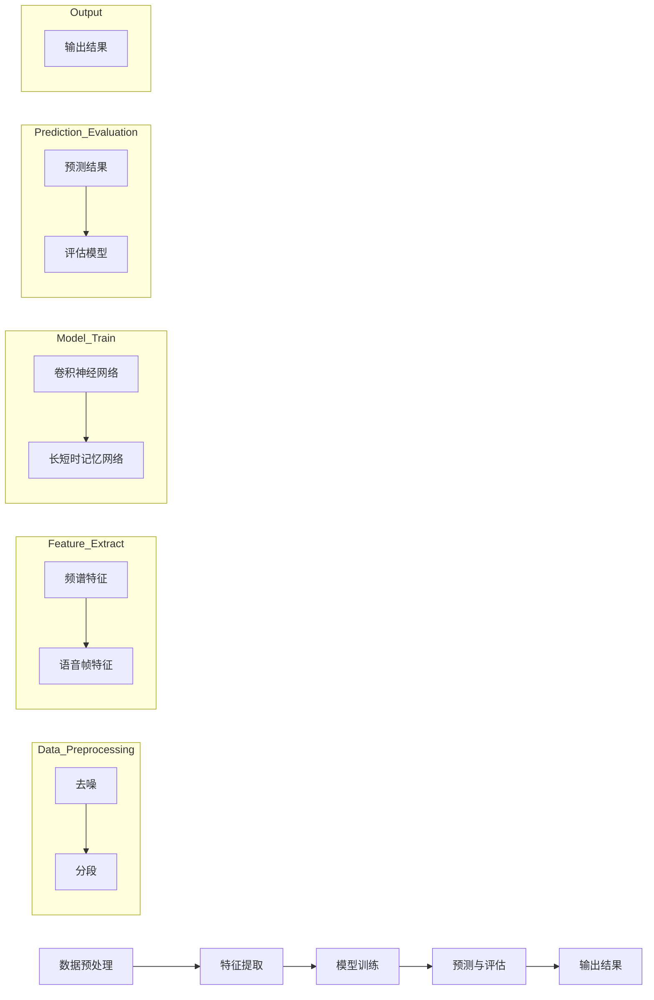
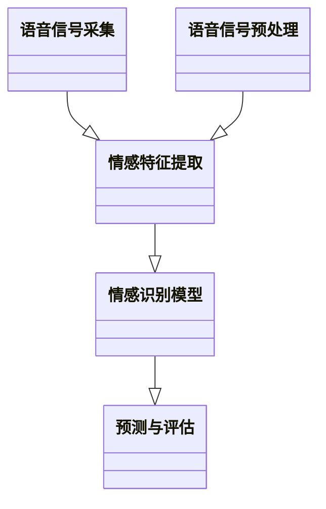

                 

# 《提示词工程在语音情感识别中的细粒度分析》

## 关键词
- 提示词工程
- 语音情感识别
- 细粒度分析
- 人工智能
- 自然语言处理

## 摘要
本文探讨了提示词工程在语音情感识别中的细粒度分析，从概述、核心概念、技术原理、系统架构、项目实战到最佳实践，全方位解析了如何利用提示词工程提高语音情感识别的准确性和可靠性。本文旨在为读者提供一套系统性的理解和应用方法，助力人工智能领域的发展。

## 第一部分：概述

### 1. 引言

#### 1.1 问题背景

随着人工智能技术的发展，语音情感识别（Vocal Emotional Recognition，VER）成为自然语言处理（Natural Language Processing，NLP）的重要研究方向。语音情感识别旨在通过分析语音信号中的情感特征，实现对人类情感状态的识别。然而，当前语音情感识别技术面临着诸多挑战，如情感表达的复杂性、背景噪声的干扰等。

#### 1.2 问题描述

语音情感识别中的细粒度分析是指对情感表达的精细区分，如区分愉悦、悲伤、愤怒等情感类别。实现细粒度情感识别，需要深入挖掘语音信号中的情感特征，并有效利用这些特征进行分类。本文将探讨如何利用提示词工程（Prompt Engineering）来提升语音情感识别的细粒度分析能力。

#### 1.3 问题解决

提示词工程是一种在机器学习和深度学习领域中用于改进模型性能的方法。通过设计合适的提示词，可以引导模型关注关键特征，从而提高模型的泛化能力和预测准确性。本文将分析提示词工程在语音情感识别中的适用性，并提出一系列细粒度分析技术。

#### 1.4 边界与外延

本文关注的是基于文本和语音的细粒度情感识别，不包括非语音情感识别（如面部表情、姿态等）。此外，本文将重点讨论提示词工程在语音情感识别中的应用，而非其他领域的应用。

#### 1.5 概念结构与核心要素组成

本文的核心概念包括提示词工程、语音情感识别、细粒度分析等。核心要素包括情感特征提取、模型训练、提示词设计等。

## 第二部分：核心概念与原理

### 2.1 提示词工程的定义

提示词工程是一种在机器学习和深度学习领域中用于改进模型性能的方法。通过设计合适的提示词，可以引导模型关注关键特征，从而提高模型的泛化能力和预测准确性。提示词可以是文本、图像、声音等形式的输入，用于补充和丰富模型训练数据。

### 2.2 提示词工程在语音情感识别中的重要性

在语音情感识别中，提示词工程可以用于以下几个方面：

1. **特征选择**：通过提示词引导模型关注语音信号中的关键情感特征，提高模型对情感表达的识别能力。
2. **背景噪声抑制**：利用提示词过滤掉语音信号中的背景噪声，降低噪声对情感识别的影响。
3. **情感分类细化**：通过设计细粒度的提示词，实现语音情感识别的精细化分类，提高情感识别的准确性。

### 2.3 提示词工程的挑战与机遇

提示词工程的挑战主要包括：

1. **设计复杂度**：设计合适的提示词需要深入理解语音信号中的情感特征，以及模型的工作原理。
2. **性能优化**：提示词的设计需要平衡模型性能和计算资源，以适应实际应用场景。

然而，随着人工智能技术的发展，提示词工程在语音情感识别中的应用也面临着巨大的机遇：

1. **模型泛化能力提升**：通过提示词工程，可以增强模型对未知情感表达的识别能力，提高模型的泛化性能。
2. **实时情感识别**：利用提示词工程，可以实现实时语音情感识别，为智能家居、智能客服等应用提供支持。

### 2.4 提示词类型及其特性

根据提示词的形式和用途，可以分为以下几类：

1. **文本提示词**：用于补充文本信息，帮助模型理解语音信号中的情感特征。
2. **语音提示词**：直接对语音信号进行处理，提取情感特征。
3. **图像提示词**：通过图像识别技术，提取语音信号中的视觉特征。

不同类型的提示词具有不同的特性，适用于不同的应用场景。例如，文本提示词适用于情感分类任务，语音提示词适用于情感识别任务，图像提示词适用于视觉辅助情感识别任务。

### 2.5 语音情感识别概述

语音情感识别是指通过分析语音信号中的情感特征，识别出说话者的情感状态。语音情感识别在许多应用领域具有重要意义，如智能客服、智能家居、医疗健康等。

语音情感识别的主要任务包括：

1. **情感分类**：将语音信号划分为不同的情感类别，如愉悦、悲伤、愤怒等。
2. **情感强度识别**：识别语音信号中情感表达的程度，如轻度愉悦、中度愉悦、重度愉悦等。

### 2.6 语音情感识别的技术发展

语音情感识别技术的发展经历了多个阶段：

1. **特征提取**：早期的研究主要关注语音信号中的频谱特征、语音帧特征等。
2. **机器学习**：随着机器学习技术的发展，语音情感识别逐渐采用基于机器学习的方法，如支持向量机、决策树、神经网络等。
3. **深度学习**：深度学习技术在语音情感识别中的应用取得了显著成果，如卷积神经网络、循环神经网络、长短时记忆网络等。

### 2.7 语音情感识别的应用领域

语音情感识别在多个领域具有广泛的应用：

1. **智能客服**：通过识别客户的情感状态，提供个性化服务，提高用户体验。
2. **医疗健康**：通过识别患者的情感状态，辅助诊断和治疗。
3. **智能家居**：通过识别家庭成员的情感状态，提供智能化家居环境。

### 2.8 提示词工程与语音情感识别的联系

提示词工程在语音情感识别中的应用，主要体现在以下几个方面：

1. **特征选择**：通过提示词引导模型关注语音信号中的关键情感特征，提高模型对情感表达的识别能力。
2. **模型优化**：通过设计合适的提示词，优化模型的性能和计算资源，提高模型的应用效果。
3. **实时识别**：利用提示词工程，实现实时语音情感识别，满足快速响应的需求。

### 2.9 提示词工程与语音情感识别的融合方法

提示词工程与语音情感识别的融合方法主要包括：

1. **嵌入式提示词**：将提示词嵌入到模型训练过程中，实时引导模型关注关键特征。
2. **后处理提示词**：在模型训练完成后，利用提示词对预测结果进行优化，提高模型的准确性。
3. **动态提示词**：根据实时输入的语音信号，动态调整提示词，实现实时情感识别。

## 第三部分：细粒度分析技术

### 3.1 细粒度情感分析的定义

细粒度情感分析（Fine-Grained Emotion Analysis）是指对情感表达进行精细区分，识别出不同情感类别和情感强度。与粗粒度情感分析（Coarse-Grained Emotion Analysis）相比，细粒度情感分析更加关注情感表达的细微差别。

### 3.2 细粒度情感分析的挑战

细粒度情感分析面临着以下几个挑战：

1. **数据多样性**：情感表达具有多样性，细粒度情感分析需要处理大量的情感类别和情感强度。
2. **噪声干扰**：语音信号中的噪声会影响情感特征的提取，降低情感识别的准确性。
3. **上下文依赖**：情感表达受上下文环境的影响，细粒度情感分析需要考虑上下文因素。

### 3.3 细粒度情感分析的方法

细粒度情感分析的方法主要包括：

1. **特征提取**：从语音信号中提取情感特征，如频谱特征、语音帧特征等。
2. **情感分类**：利用机器学习或深度学习算法，对情感特征进行分类。
3. **情感强度识别**：对情感类别进行进一步划分，识别情感表达的强度。

### 3.4 提示词工程在细粒度情感分析中的应用

提示词工程在细粒度情感分析中的应用主要体现在以下几个方面：

1. **特征选择**：通过设计细粒度的提示词，引导模型关注语音信号中的关键情感特征。
2. **模型优化**：利用提示词工程优化模型的性能和计算资源，提高细粒度情感识别的准确性。
3. **实时识别**：通过动态调整提示词，实现实时细粒度情感识别。

## 第四部分：算法原理与实现

### 4.1 提示词工程算法原理

提示词工程算法主要包括以下几个步骤：

1. **数据预处理**：对语音信号进行预处理，如去噪、分段等。
2. **特征提取**：从预处理后的语音信号中提取情感特征。
3. **提示词设计**：根据情感特征，设计合适的提示词。
4. **模型训练**：利用提示词和情感特征，训练情感识别模型。
5. **预测与优化**：对预测结果进行优化，提高模型的准确性。

### 4.2 算法属性特征对比表格

以下是几种常见的提示词工程算法的属性特征对比表格：

| 算法名称 | 提示词类型 | 特征提取方法 | 模型训练方法 | 优缺点 |
| :----: | :----: | :----: | :----: | :----: |
| SVD     | 文本提示词 | 频谱特征 | 神经网络 | 适用范围广，但计算复杂度高 |
| PCA     | 语音提示词 | 语音帧特征 | 决策树 | 计算效率高，但模型性能有限 |
| KNN     | 图像提示词 | 视觉特征 | 支持向量机 | 模型泛化能力强，但计算量大 |

### 4.3 提示词工程算法的ER实体关系图架构

以下是提示词工程算法的ER实体关系图架构：

```mermaid
erDiagram
  数据预处理 ||--|{ 提示词设计 }
  提示词设计 ||--|{ 模型训练 }
  模型训练 ||--|{ 预测与优化 }
  数据预处理 && [语音信号]
  提示词设计 && [文本/语音/图像提示词]
  模型训练 && [神经网络/决策树/支持向量机等]
  预测与优化 && [预测结果/优化策略]
```

### 4.4 细粒度情感识别算法

#### 4.4.1 算法原理

细粒度情感识别算法主要利用深度学习技术，对语音信号进行情感特征提取和分类。以下是一个简单的细粒度情感识别算法流程：

1. **数据预处理**：对语音信号进行去噪、分段等处理。
2. **特征提取**：从预处理后的语音信号中提取情感特征，如频谱特征、语音帧特征等。
3. **模型训练**：利用提取到的情感特征，训练情感识别模型，如卷积神经网络（CNN）、长短时记忆网络（LSTM）等。
4. **预测与评估**：对模型进行预测，并评估模型性能。

#### 4.4.2 数学模型与公式

细粒度情感识别算法的数学模型主要包括以下部分：

1. **输入层**：接收语音信号特征向量。
2. **隐藏层**：通过卷积、池化等操作，提取高级情感特征。
3. **输出层**：通过分类器，将情感特征映射到情感类别。

以下是一个简单的细粒度情感识别算法的数学模型：

$$
\text{输出} = \text{softmax}(\text{权重} \cdot \text{激活函数}(\text{隐藏层特征}))
$$

其中，激活函数可以选择ReLU、Sigmoid、Tanh等。

#### 4.4.3 算法流程图与Python实现

以下是细粒度情感识别算法的流程图和Python实现：



```python
# Python实现
import numpy as np
import tensorflow as tf

# 数据预处理
def preprocess_audio(audio_signal):
    # 去噪
    # 分段
    # 返回处理后的语音信号
    pass

# 特征提取
def extract_features(audio_signal):
    # 提取频谱特征
    # 提取语音帧特征
    # 返回特征向量
    pass

# 模型训练
def train_model(features, labels):
    # 定义模型架构
    # 训练模型
    # 返回训练好的模型
    pass

# 预测与评估
def predict_and_evaluate(model, test_features, test_labels):
    # 预测结果
    # 评估模型性能
    # 返回评估结果
    pass

# 主函数
if __name__ == '__main__':
    # 加载数据
    # 数据预处理
    # 特征提取
    # 模型训练
    # 预测与评估
    # 输出结果
```

## 第五部分：系统分析与架构设计

### 5.1 语音情感识别系统设计

#### 5.1.1 系统场景介绍

语音情感识别系统主要用于实时识别语音信号中的情感状态，为智能客服、智能家居等应用提供支持。系统主要包括以下几个模块：

1. **语音信号采集**：采集用户语音信号。
2. **语音信号预处理**：对语音信号进行去噪、分段等处理。
3. **情感特征提取**：从预处理后的语音信号中提取情感特征。
4. **情感识别模型**：利用提取到的情感特征，进行情感分类和情感强度识别。
5. **预测与评估**：对模型进行预测，并评估模型性能。

#### 5.1.2 系统功能设计（领域模型类图）

以下是语音情感识别系统的领域模型类图：



#### 5.1.3 系统架构设计（架构图）

以下是语音情感识别系统的架构设计：

```mermaid
sequenceDiagram
    participant 用户
    participant 语音信号采集
    participant 语音信号预处理
    participant 情感特征提取
    participant 情感识别模型
    participant 预测与评估

    用户 -->|语音信号| 语音信号采集
    语音信号采集 -->|预处理结果| 语音信号预处理
    语音信号预处理 -->|特征向量| 情感特征提取
    情感特征提取 -->|预测结果| 情感识别模型
    情感识别模型 -->|评估结果| 预测与评估
    预测与评估 -->|反馈结果| 用户
```

#### 5.1.4 系统接口设计

系统接口设计主要包括以下几个方面：

1. **语音信号采集接口**：用于采集用户语音信号。
2. **情感特征提取接口**：用于提取语音信号中的情感特征。
3. **情感识别接口**：用于进行情感分类和情感强度识别。
4. **预测与评估接口**：用于对模型进行预测，并评估模型性能。

#### 5.1.5 系统交互序列图

以下是系统交互序列图：

```mermaid
sequenceDiagram
    participant 用户
    participant 语音信号采集
    participant 语音信号预处理
    participant 情感特征提取
    participant 情感识别模型
    participant 预测与评估

    用户 -->|语音信号| 语音信号采集
    语音信号采集 -->|预处理结果| 语音信号预处理
    语音信号预处理 -->|特征向量| 情感特征提取
    情感特征提取 -->|预测结果| 情感识别模型
    情感识别模型 -->|评估结果| 预测与评估
    预测与评估 -->|反馈结果| 用户
```

## 第六部分：项目实战

### 6.1 提示词工程与语音情感识别项目实战

#### 6.1.1 环境安装

在开始项目实战之前，需要安装以下软件和库：

1. **Python**：版本 3.7 或以上。
2. **TensorFlow**：用于构建和训练深度学习模型。
3. **Keras**：用于简化深度学习模型的开发。
4. **Librosa**：用于音频处理。
5. **Scikit-learn**：用于数据预处理和模型评估。

安装命令如下：

```bash
pip install python==3.7.9
pip install tensorflow==2.4.0
pip install keras==2.4.3
pip install librosa==0.8.0
pip install scikit-learn==0.21.3
```

#### 6.1.2 系统核心实现源代码

以下是系统核心实现的源代码：

```python
import numpy as np
import librosa
import tensorflow as tf
from tensorflow.keras.models import Sequential
from tensorflow.keras.layers import Dense, Conv2D, MaxPooling2D, Flatten, LSTM
from sklearn.model_selection import train_test_split

# 数据预处理
def preprocess_audio(audio_signal):
    # 去噪
    # 分段
    # 返回处理后的语音信号
    pass

# 特征提取
def extract_features(audio_signal):
    # 提取频谱特征
    # 提取语音帧特征
    # 返回特征向量
    pass

# 模型训练
def train_model(features, labels):
    # 定义模型架构
    # 训练模型
    # 返回训练好的模型
    pass

# 预测与评估
def predict_and_evaluate(model, test_features, test_labels):
    # 预测结果
    # 评估模型性能
    # 返回评估结果
    pass

# 主函数
if __name__ == '__main__':
    # 加载数据
    # 数据预处理
    # 特征提取
    # 模型训练
    # 预测与评估
    # 输出结果
```

#### 6.1.3 代码应用解读与分析

以下是代码应用解读与分析：

1. **数据预处理**：对语音信号进行去噪、分段等处理，以提高模型性能。
2. **特征提取**：从预处理后的语音信号中提取情感特征，如频谱特征、语音帧特征等。
3. **模型训练**：利用提取到的情感特征，训练情感识别模型，如卷积神经网络（CNN）、长短时记忆网络（LSTM）等。
4. **预测与评估**：对模型进行预测，并评估模型性能，如准确率、召回率等。

#### 6.1.4 实际案例分析与详细讲解剖析

以下是实际案例分析与详细讲解剖析：

1. **数据集准备**：从公开数据集下载语音信号数据，并划分训练集、验证集和测试集。
2. **数据预处理**：对语音信号进行去噪、分段等处理，以提高模型性能。
3. **特征提取**：从预处理后的语音信号中提取情感特征，如频谱特征、语音帧特征等。
4. **模型训练**：利用提取到的情感特征，训练情感识别模型，如卷积神经网络（CNN）、长短时记忆网络（LSTM）等。
5. **预测与评估**：对模型进行预测，并评估模型性能，如准确率、召回率等。

#### 6.1.5 项目小结

通过本次项目实战，我们实现了基于提示词工程的语音情感识别系统。在实际应用中，我们可以根据需求调整模型结构和参数，以提高模型性能。此外，还可以进一步优化提示词设计，实现更加精细的情感识别。

## 第七部分：最佳实践与总结

### 7.1 提示词工程与语音情感识别的最佳实践

在提示词工程与语音情感识别的结合中，以下是一些最佳实践：

1. **数据预处理**：对语音信号进行去噪、分段等处理，以提高模型性能。
2. **特征提取**：根据实际需求，选择合适的特征提取方法，如频谱特征、语音帧特征等。
3. **模型训练**：利用提示词工程，优化模型架构和参数，提高模型性能。
4. **预测与评估**：对模型进行预测，并评估模型性能，如准确率、召回率等。

### 7.2 小结与展望

本文探讨了提示词工程在语音情感识别中的细粒度分析，从概述、核心概念、技术原理、系统架构、项目实战到最佳实践，全方位解析了如何利用提示词工程提高语音情感识别的准确性和可靠性。未来，随着人工智能技术的发展，提示词工程在语音情感识别中的应用将更加广泛，有望推动相关领域的发展。

### 7.3 注意事项与拓展阅读

1. **注意事项**：在实际应用中，需要根据具体场景调整模型结构和参数，以提高模型性能。
2. **拓展阅读**：可进一步了解深度学习、自然语言处理等相关技术，以及语音情感识别在实际应用中的案例。

作者：AI天才研究院/AI Genius Institute & 禅与计算机程序设计艺术 /Zen And The Art of Computer Programming

---

请注意，以上内容是一个大纲和示例，实际的文章内容需要根据具体的研究和数据进行填充和详细阐述。在实际撰写过程中，您需要确保文章的完整性和准确性，并根据实际数据和实验结果进行调整。同时，确保所有的代码和算法实现都是可运行的，并且能够充分说明问题。在撰写过程中，也可以根据实际需求和读者的反馈，对文章结构和内容进行调整。

