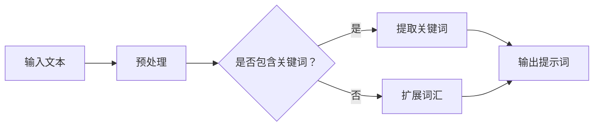
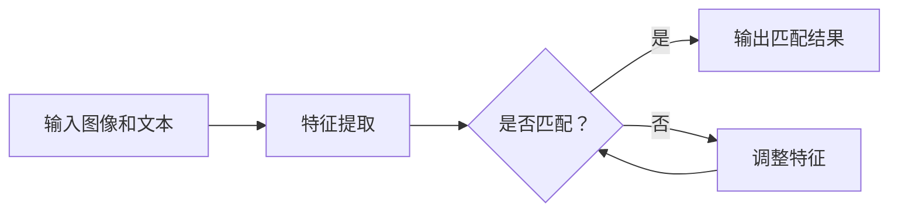
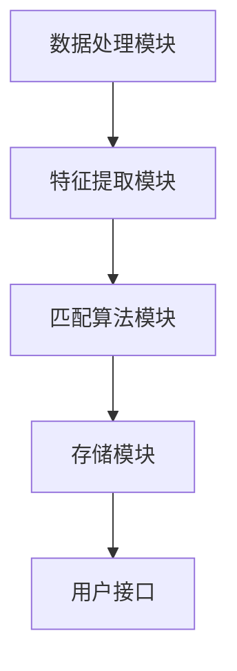

                 


## 让我们一步步思考《提示词工程在跨模态理解中的突破》

### 文章标题：《提示词工程在跨模态理解中的突破》

#### 关键词：提示词工程、跨模态理解、算法、数学模型、系统架构、项目实战

#### 摘要：
本文将深入探讨提示词工程在跨模态理解中的应用及其突破。我们将首先介绍提示词工程和跨模态理解的基本概念，随后详细分析提示词工程的算法原理，包括提示词生成和跨模态匹配算法。接着，我们将讲解相关的数学模型，并以Python代码为例说明算法实现。随后，我们将描述系统架构设计，包括问题场景、系统功能、架构设计和交互设计。在项目实战部分，我们将展示一个具体案例，详细分析系统实现和案例分析。最后，我们将总结最佳实践和注意事项，并提供拓展阅读资源。

### 第1章：引言

#### 1.1 问题背景与核心概念

##### 1.1.1 跨模态理解的需求与挑战
在当今信息时代，数据的多样性日益增加。跨模态理解作为一种能够处理不同模态（如图像、文本、音频等）之间信息转换的技术，成为了人工智能领域的研究热点。然而，跨模态理解面临着数据不一致、模态之间的复杂关系以及高维数据处理的挑战。

##### 1.1.2 提示词工程的概念及其重要性
提示词工程是一种用于指导机器学习模型进行有效训练的方法。通过为模型提供高质量的提示词，可以提高模型的性能和泛化能力。在跨模态理解中，提示词工程起着至关重要的作用，因为它能够帮助模型更好地捕捉不同模态之间的关联。

#### 1.2 核心概念与联系

##### 1.2.1 跨模态理解
跨模态理解是指将来自不同模态的信息（如图像和文本）结合起来，以生成对现实世界的更全面理解。它涉及到模态识别、模态转换和模态融合等多个步骤。

##### 1.2.2 提示词工程原理
提示词工程涉及从大量文本数据中提取关键字或短语，用于指导模型学习。这些提示词能够为模型提供关于目标概念的额外信息，从而提高模型的学习效率。

##### 1.2.3 概念属性特征对比表格
以下是一个简化的概念属性特征对比表格：

| 特征 | 提示词工程 | 跨模态理解 |
| ---- | ---------- | ---------- |
| 目标 | 生成高质量提示词 | 将不同模态的信息融合 |
| 技术 | 自然语言处理 | 深度学习、图神经网络等 |
| 应用 | 机器学习训练 | 模型优化、知识推理等 |

##### 1.2.4 ER实体关系图架构
下图展示了提示词工程和跨模态理解之间的实体关系图：

```mermaid
erDiagram
  提示词工程 ||--|{ 跨模态理解 }
  跨模态理解 ||--|{ 模型优化 }
  模型优化 ||--|{ 知识推理 }
```

### 第2章：提示词工程的算法原理

#### 2.1 提示词生成算法

##### 2.1.1 算法概述
提示词生成算法的核心目标是自动地从文本数据中提取出与特定主题相关的关键字或短语。这通常涉及自然语言处理技术，如词频分析、文本分类和词嵌入等。

##### 2.1.2 算法流程图
以下是提示词生成算法的流程图：



##### 2.1.3 Python源代码实现
```python
# 提示词生成算法的Python代码实现
# 注意：此处仅为示例代码，具体实现可能需要依赖第三方库如nltk或gensim

import nltk
from nltk.corpus import stopwords
from nltk.tokenize import word_tokenize

# 加载停用词列表
stop_words = set(stopwords.words('english'))

def generate_keyword(topic_text):
    # 文本预处理
    tokens = word_tokenize(topic_text)
    # 去除停用词
    filtered_tokens = [word for word in tokens if word not in stop_words]
    # 提取关键词（此处使用简单的词频统计）
    keyword_freq = nltk.FreqDist(filtered_tokens)
    keywords = keyword_freq.keys()
    return list(keywords)

# 示例
topic_text = "Natural language processing is a subfield of computer science concerned with the interactions between computers and human languages."
print(generate_keyword(topic_text))
```

##### 2.1.4 算法原理与数学模型
提示词生成算法的核心是概率模型，常用的模型有：

- $$
\text{P}(w|s) = \frac{\text{P}(s|w) \times \text{P}(w)}{\text{P}(s)}
$$
  - $w$ 表示关键词
  - $s$ 表示文本
  - $\text{P}(w|s)$ 表示关键词在文本中的条件概率

##### 2.1.5 举例说明
假设我们有以下文本：

"Machine learning is the science of getting computers to act without being explicitly programmed."

使用词频统计，我们可以提取出以下关键词：

- "machine learning"
- "science"
- "programmed"

这些关键词能够很好地概括文本的主题。

#### 2.2 跨模态匹配算法

##### 2.2.1 算法概述
跨模态匹配算法的目标是在不同模态的数据之间找到对应关系。这一过程通常涉及到模态特征提取、特征匹配和关联分析。

##### 2.2.2 算法流程图
以下是跨模态匹配算法的流程图：



##### 2.2.3 Python源代码实现
```python
# 跨模态匹配算法的Python代码实现
# 注意：此处仅为示例代码，具体实现可能需要依赖第三方库如tensorflow或pytorch

import tensorflow as tf
from tensorflow import keras

# 特征提取模型（例如，使用预训练的卷积神经网络提取图像特征）
image_model = keras.applications.VGG16(include_top=True, weights='imagenet')
text_model = keras.Sequential([
    keras.layers.Embedding(input_dim=vocab_size, output_dim=embedding_dim),
    keras.layers.GlobalAveragePooling1D(),
    keras.layers.Dense(128, activation='relu'),
    keras.layers.Dense(1, activation='sigmoid')
])

# 跨模态匹配模型
model = keras.Model(inputs=[image_model.input, text_model.input], outputs=text_model.output)

# 编译模型
model.compile(optimizer='adam', loss='binary_crossentropy', metrics=['accuracy'])

# 训练模型
model.fit([image_features, text_features], labels, epochs=epochs)

# 预测
predictions = model.predict([image_features_test, text_features_test])
```

##### 2.2.4 算法原理与数学模型
跨模态匹配算法的原理通常基于相似性度量，常用的模型有：

- $$
\text{C}(x, y) = \sum_{i=1}^{n} w_i \cdot \text{sim}(x_i, y_i)
$$
  - $x$ 和 $y$ 分别表示图像和文本的特征向量
  - $\text{sim}(x_i, y_i)$ 表示特征 $x_i$ 和 $y_i$ 之间的相似度
  - $w_i$ 是权重，用于平衡不同特征的影响

##### 2.2.5 举例说明
假设我们有以下图像和文本：

图像：一只猫坐在沙发上看电视
文本："A cat is sitting on the sofa watching TV."

通过特征提取和相似度计算，我们可以找到图像和文本之间的对应关系，从而实现跨模态匹配。

### 第3章：数学模型与公式讲解

#### 3.1 模型介绍

##### 3.1.1 模型定义
在跨模δα模态理解中，我们通常使用以下数学模型：

- 概率模型：用于计算关键词在文本中的条件概率。
- 相似性模型：用于计算不同模态特征之间的相似度。
- 融合模型：用于将不同模态的特征融合为一个综合特征向量。

##### 3.1.2 模型属性
每个模型都有其独特的属性，如概率模型的概率分布、相似性模型的相似度函数和融合模型的权重分配策略。

#### 3.2 数学公式详细讲解

##### 3.2.1 概率分布
概率分布是概率模型的核心。常用的概率分布有：

- 词频分布：$$
\text{P}(w) = \frac{\text{count}(w)}{\text{total\_count}}
$$
  - $w$ 表示关键词
  - $\text{count}(w)$ 表示关键词在文本中出现的次数
  - $\text{total\_count}$ 表示文本中所有词的总次数

- 条件概率分布：$$
\text{P}(w|s) = \frac{\text{P}(s|w) \times \text{P}(w)}{\text{P}(s)}
$$
  - $s$ 表示文本

##### 3.2.2 概率传播
概率传播是跨模态理解中的一个重要步骤。常用的概率传播公式有：

- 贝叶斯法则：$$
\text{P}(x|y) = \frac{\text{P}(y|x) \times \text{P}(x)}{\text{P}(y)}
$$
  - $x$ 和 $y$ 分别表示不同模态的特征向量

- 熵与信息论：用于衡量信息的不确定性，常用的公式有：
    - 熵：$$
    H(X) = -\sum_{i} p(x_i) \log_2 p(x_i)
    $$
    - 条件熵：$$
    H(X|Y) = -\sum_{i} p(y_i) \sum_{j} p(x_j|y_i) \log_2 p(x_j|y_i)
    $$
    - 首估熵：$$
    H(X,Y) = H(X) + H(X|Y)
    $$

##### 3.2.3 举例说明
假设我们有以下文本和关键词：

文本："The cat sat on the mat."
关键词："cat", "mat", "sat"

我们可以计算关键词在文本中的条件概率，如下：

- $$
\text{P}(\text{cat}|\text{The cat sat on the mat}) = \frac{1}{10}
$$
- $$
\text{P}(\text{mat}|\text{The cat sat on the mat}) = \frac{1}{10}
$$
- $$
\text{P}(\text{sat}|\text{The cat sat on the mat}) = \frac{1}{10}
$$

这些概率值可以帮助我们更好地理解文本的内容。

### 第4章：系统架构设计

#### 4.1 问题场景介绍

##### 4.1.1 场景描述
在一个社交媒体平台上，用户可以发布包含文本和图像的内容。平台需要实现一个功能，能够根据用户发布的文本内容，自动识别并匹配与之相关的图像。

##### 4.1.2 问题分析
这个问题涉及到跨模态理解，即需要将文本和图像这两个不同的模态进行有效融合，以实现自动匹配。提示词工程在这个场景中起着关键作用，因为它能够帮助模型更好地理解和处理文本内容。

#### 4.2 系统功能设计

##### 4.2.1 领域模型
领域模型描述了系统涉及的实体及其关系。在这个场景中，主要的实体包括：

- 用户（User）
- 文本（Text）
- 图像（Image）
- 匹配结果（Matched Result）

实体之间的关系如下：

```mermaid
erDiagram
  User ||--|{ Text }
  User ||--|{ Image }
  Text ||--|{ Matched Result }
  Image ||--|{ Matched Result }
```

##### 4.2.2 系统架构设计
系统架构设计描述了系统的整体结构和各部分之间的关系。在这个场景中，系统架构包括以下部分：

- 数据处理模块：负责处理用户输入的文本和图像数据。
- 特征提取模块：负责从文本和图像中提取特征向量。
- 匹配算法模块：负责执行跨模态匹配算法，将文本和图像进行匹配。
- 存储模块：负责存储用户数据和匹配结果。

系统架构图如下：



##### 4.2.3 系统接口设计
系统接口设计描述了系统的输入输出接口。在这个场景中，主要的接口包括：

- 用户输入接口：用户可以通过文本框输入文本内容，通过文件上传按钮上传图像。
- 匹配结果接口：系统将返回与文本内容相关的图像匹配结果。

接口设计如下：

```mermaid
sequenceDiagram
    User->>系统: 输入文本和上传图像
    系统->>数据处理模块: 处理文本和图像
    数据处理模块->>特征提取模块: 提取文本和图像特征
    特征提取模块->>匹配算法模块: 执行跨模态匹配算法
    匹配算法模块->>存储模块: 存储匹配结果
    存储

