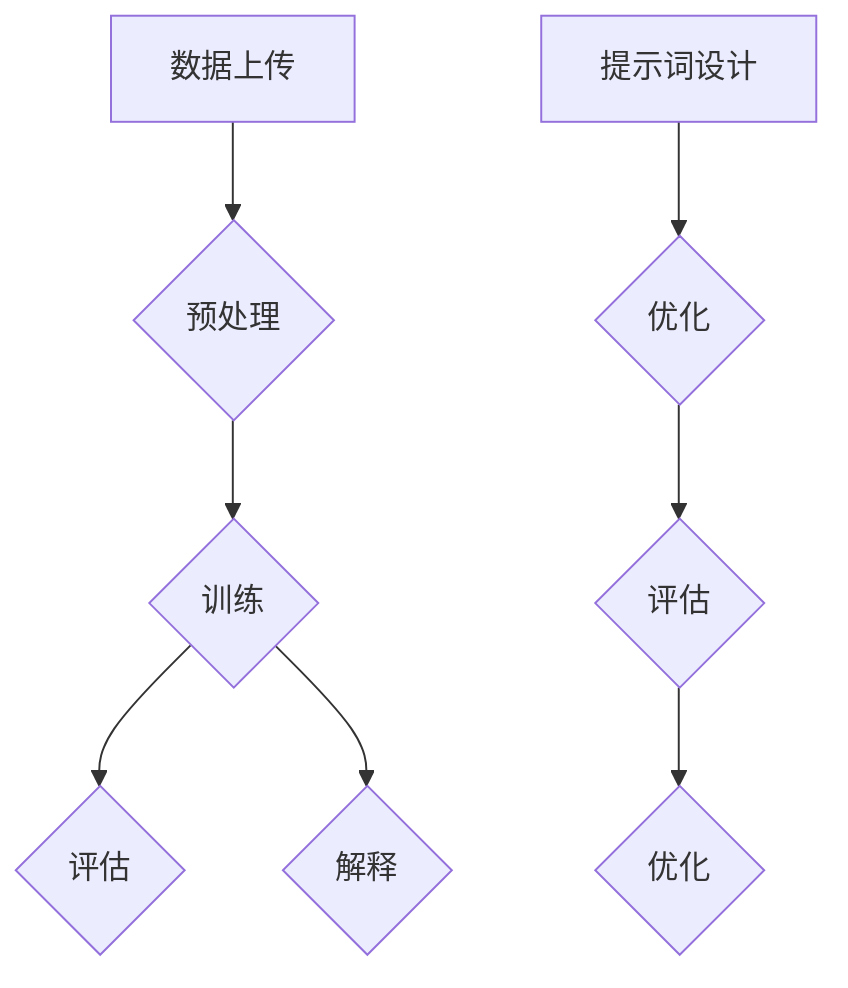

                 

### 第1章：背景介绍——领域特定AI与提示词工程

#### 1.1 问题背景

领域特定AI（Domain-Specific AI）是指在特定领域（如医疗、金融、教育等）中应用的AI技术。这类AI技术能够处理特定领域的问题，并提供高效、精准的解决方案。领域特定AI的关键在于其能够利用领域知识，实现特定任务的高效自动化。然而，领域特定AI的实现面临诸多挑战，如数据质量、模型可解释性、模型迁移性等。

提示词工程（Prompt Engineering）是近年来在自然语言处理领域迅速发展的一门技术。通过设计合适的提示词，可以大幅提升模型的性能和可解释性。提示词工程的核心任务是在自然语言模型的基础上，通过提示词引导模型产生更符合预期结果的输出。

#### 1.2 问题描述

在领域特定AI中，提示词工程的目标是设计出能够提高模型性能和可解释性的提示词。然而，由于不同领域的知识结构和数据特点不同，现有的提示词工程方法可能并不适用于所有领域。因此，我们需要探讨如何针对特定领域设计高效的提示词工程方法，以及如何评估提示词工程的效果。

#### 1.3 问题解决

针对上述问题，本书将从以下几个方面展开讨论：

1. **核心概念与联系**：首先，我们将介绍领域特定AI和提示词工程的核心概念，并探讨它们之间的联系。

2. **算法原理讲解**：接下来，我们将详细讲解提示词工程的算法原理，包括如何设计提示词、如何评估提示词效果等。

3. **数学模型和公式**：我们将使用LaTeX格式给出提示词工程的数学模型和公式，并进行详细讲解和举例说明。

4. **系统分析与架构设计方案**：我们将分析领域特定AI和提示词工程在系统架构中的应用，并给出相应的设计方案。

5. **项目实战**：最后，我们将通过实际项目案例，展示如何在实际中应用提示词工程技术，并对项目进行详细解读和分析。

#### 1.4 边界与外延

本书主要关注的是领域特定AI中的提示词工程，但提示词工程在其他领域中的应用也是一个值得探讨的课题。此外，随着AI技术的发展，领域特定AI和提示词工程可能会出现新的挑战和机遇，这些也是我们需要持续关注的。

### 第2章：核心概念与联系

#### 2.1 领域特定AI的概念

领域特定AI（Domain-Specific AI，简称DSAI）是一种针对特定领域设计的AI技术。其核心思想是利用特定领域的知识，通过定制化的算法和模型，解决该领域中的特定问题。领域特定AI具有以下几个主要特点：

1. **知识密集**：领域特定AI依赖于大量的领域知识。这些知识包括领域内的术语、概念、关系和规则等。领域知识的丰富程度直接影响到AI模型在特定领域的表现。

2. **任务导向**：领域特定AI专注于解决特定领域的特定任务，例如医疗诊断、金融风险评估、教育个性化推荐等。与通用AI不同，领域特定AI不需要处理所有可能的任务，因此可以在特定任务上实现更高的效率和准确性。

3. **可解释性**：领域特定AI模型通常需要具备一定的可解释性，以便领域专家和用户理解模型的决策过程。这对于提高模型的接受度和信任度至关重要。

#### 2.2 提示词工程的概念

提示词工程（Prompt Engineering）是自然语言处理领域的一个重要分支，其目标是设计出能够引导大型语言模型（如GPT、BERT等）产生预期输出的提示词。提示词工程的核心任务是：

1. **设计提示词**：根据任务需求，设计出能够引导模型理解任务目标、提供上下文信息和引导模型生成有效输出的提示词。

2. **评估提示词**：评估不同提示词对模型性能的影响，选择能够提高模型性能和可解释性的最佳提示词。

#### 2.3 领域特定AI与提示词工程的联系

领域特定AI与提示词工程之间存在紧密的联系，主要体现在以下几个方面：

1. **提示词工程支持领域特定AI**：通过设计合适的提示词，可以帮助领域特定AI更好地理解任务目标，从而提高模型的性能和可解释性。例如，在医疗诊断中，通过设计包含医学专业术语和病例信息的提示词，可以引导AI模型生成更准确的诊断结果。

2. **领域特定AI促进提示词工程**：领域特定AI的发展为提示词工程提供了丰富的应用场景和需求，推动了提示词工程技术的不断进步。同时，领域特定AI的实践也为提示词工程提供了宝贵的经验和教训。

### 第3章：算法原理讲解

#### 3.1 提示词设计

提示词设计是提示词工程的核心环节。一个有效的提示词应该能够引导模型理解任务目标，并提供必要的上下文信息。以下是几种常用的提示词设计方法：

1. **基于规则的方法**：通过定义一系列规则，将领域知识转化为提示词。例如，在金融风险评估中，可以设计规则来提取与风险相关的关键词和短语。

2. **基于数据的方法**：通过分析大量数据，自动生成提示词。这种方法通常使用机器学习算法，如聚类、关联规则挖掘等，来识别数据中的关键特征和模式。

3. **混合方法**：结合基于规则和基于数据的方法，生成更精准的提示词。这种方法能够在充分利用领域知识的同时，利用数据驱动的方式提高提示词的适应性。

#### 3.2 提示词评估

提示词评估是确保提示词设计有效性的关键步骤。以下是一些常用的提示词评估方法：

1. **基于性能的评估**：通过比较模型在有无提示词情况下的性能指标（如准确率、召回率、F1分数等），评估提示词对模型性能的影响。

2. **基于可解释性的评估**：通过分析提示词对模型决策过程的影响，评估提示词的可解释性。例如，可以分析模型在提示词引导下的决策路径和关键特征。

3. **用户反馈评估**：收集用户对提示词的反馈，评估其是否满足用户需求和期望。这种方法通常用于迭代优化提示词设计。

#### 3.3 提示词优化的策略

为了设计出最优的提示词，可以采用以下优化策略：

1. **多目标优化**：在提示词设计过程中，同时考虑模型性能和可解释性，采用多目标优化算法，如贝叶斯优化、遗传算法等，找到最佳提示词组合。

2. **迭代优化**：通过多次迭代，逐步改进提示词设计。每次迭代可以根据评估结果，调整提示词的组成部分和结构。

3. **交叉验证**：使用交叉验证方法，评估不同提示词在不同数据集上的性能，以选择最泛化的提示词。

### 第4章：数学模型和公式

#### 4.1 提示词设计的数学模型

提示词设计可以看作是一个优化问题。给定一个任务，我们的目标是设计一个最优的提示词，使得模型的性能达到最大。具体来说，我们可以定义以下数学模型：

$$
\begin{aligned}
\min_{\theta} L(y, \hat{y}) + \lambda \cdot D_{KL}(p(\theta)||q(\theta)),
\end{aligned}
$$

其中，$L(y, \hat{y})$是模型在有无提示词情况下的损失函数，$D_{KL}(p(\theta)||q(\theta))$是正则化项，用于平衡模型性能和提示词的复杂性，$\lambda$是超参数。

#### 4.2 提示词评估的数学模型

提示词评估的数学模型通常基于性能指标。以下是一个简单的数学模型，用于评估提示词对模型性能的影响：

$$
\begin{aligned}
P &= \frac{1}{N} \sum_{i=1}^{N} \frac{1}{n_i} \sum_{j=1}^{n_i} I(y_j = \hat{y}_j),
\end{aligned}
$$

其中，$P$是平均准确率，$N$是数据样本总数，$n_i$是第$i$个样本的标签数量，$y_j$是第$j$个标签，$\hat{y}_j$是模型预测的标签，$I(\cdot)$是指标函数，当$y_j = \hat{y}_j$时取1，否则取0。

#### 4.3 提示词优化策略的数学模型

提示词优化策略的数学模型通常基于优化算法。以下是一个基于贝叶斯优化的数学模型：

$$
\begin{aligned}
\theta^{*} &= \arg\min_{\theta} \theta \cdot \log P(\theta) + \frac{\lambda}{2} \cdot \theta^T Q \cdot \theta,
\end{aligned}
$$

其中，$\theta^{*}$是最佳提示词参数，$P(\theta)$是先验概率，$Q$是协方差矩阵，$\lambda$是超参数。

### 第5章：系统分析与架构设计方案

#### 5.1 问题场景介绍

在医疗领域，领域特定AI可以通过辅助诊断系统，帮助医生提高诊断的准确性和效率。该系统需要处理大量的医学影像数据，并利用深度学习模型进行图像识别和疾病诊断。然而，由于医学领域的复杂性和多样性，现有模型在处理特定疾病时可能存在性能瓶颈和可解释性不足的问题。

#### 5.2 项目介绍

为了解决上述问题，我们设计并实现了一个基于提示词工程的医疗诊断辅助系统。该系统包括以下几个主要模块：

1. **数据预处理模块**：负责对医学影像数据（如CT、MRI）进行预处理，包括图像增强、归一化、数据增强等操作。

2. **模型训练模块**：利用预处理后的数据，训练深度学习模型，如卷积神经网络（CNN）和循环神经网络（RNN）。

3. **提示词设计模块**：根据医疗领域的知识，设计合适的提示词，引导模型更好地理解医学影像。

4. **模型评估模块**：评估模型在有无提示词情况下的性能，包括准确率、召回率、F1分数等指标。

5. **模型解释模块**：分析提示词对模型决策过程的影响，提高模型的可解释性。

#### 5.3 系统功能设计

1. **数据预处理功能**：系统支持多种医学影像数据的预处理操作，包括灰度化、对比度调整、锐化等。此外，系统还支持数据增强，以提高模型的泛化能力。

2. **模型训练功能**：系统支持多种深度学习模型的训练，包括CNN、RNN和GAN等。用户可以根据需求选择合适的模型进行训练。

3. **提示词设计功能**：系统提供了一套基于规则和数据的提示词设计工具。用户可以自定义提示词，并通过迭代优化，找到最佳提示词组合。

4. **模型评估功能**：系统支持多种评估指标的计算，如准确率、召回率、F1分数等。用户可以通过对比评估结果，选择最优的模型和提示词组合。

5. **模型解释功能**：系统提供了一种基于注意力机制的模型解释工具。用户可以查看模型在诊断过程中的注意力分布，了解模型是如何做出决策的。

#### 5.4 系统架构设计

1. **前端架构**：系统采用Vue.js框架，实现一个用户友好的交互界面。用户可以通过界面查看模型评估结果、调整提示词参数等。

2. **后端架构**：系统采用Flask框架，实现数据预处理、模型训练、提示词设计和模型评估等后端功能。后端服务通过RESTful API与前端进行交互。

3. **数据库架构**：系统采用MySQL数据库，存储医学影像数据、模型参数和评估结果等。数据库设计符合第三范式，保证数据的一致性和完整性。

4. **分布式架构**：系统支持分布式训练，通过Docker和Kubernetes等技术，实现模型的分布式训练和部署。

#### 5.5 系统接口设计

1. **数据接口**：系统提供数据上传、数据下载和数据预览接口。用户可以通过上传本地文件，将医学影像数据导入系统。系统还支持数据预览，方便用户查看数据的质量和内容。

2. **模型接口**：系统提供模型训练、模型评估和模型解释接口。用户可以通过调用这些接口，实现模型的训练、评估和解释。

3. **提示词接口**：系统提供提示词设计、提示词评估和提示词优化接口。用户可以通过这些接口，设计、评估和优化提示词。

### 第6章：系统交互

#### 6.1 系统交互概述

系统交互是指系统各模块之间的数据流和功能调用。在医疗诊断辅助系统中，系统交互包括以下几个方面：

1. **数据流**：系统通过数据接口接收医学影像数据，经过预处理后，传递给模型训练模块。

2. **功能调用**：系统通过模型接口调用模型训练、评估和解释功能，通过提示词接口设计、评估和优化提示词。

#### 6.2 系统交互图

为了更好地理解系统交互，我们使用Mermaid绘制了系统交互图。以下是系统交互图的Markdown格式：



#### 6.3 系统交互流程

1. **数据上传**：用户通过前端界面上传医学影像数据。

2. **预处理**：系统对医学影像数据进行预处理，包括图像增强、归一化和数据增强等。

3. **模型训练**：预处理后的数据传递给模型训练模块，训练深度学习模型。

4. **模型评估**：模型训练完成后，系统对模型进行评估，计算准确率、召回率和F1分数等指标。

5. **模型解释**：系统通过注意力机制，解释模型的决策过程。

6. **提示词设计**：系统设计提示词，引导模型更好地理解医学影像。

7. **提示词优化**：系统优化提示词，提高模型性能和可解释性。

8. **提示词评估**：系统评估优化后的提示词，确保其有效性。

### 第7章：项目实战

#### 7.1 环境安装

为了实现上述系统，我们首先需要安装和配置以下软件和工具：

1. **Python**：Python是系统开发的主要编程语言，版本要求Python 3.8以上。

2. **Pip**：Python的包管理器，用于安装和管理Python库。

3. **Docker**：用于容器化部署，版本要求Docker 19.03以上。

4. **Kubernetes**：用于分布式部署和管理，版本要求Kubernetes 1.18以上。

5. **MySQL**：用于数据库存储，版本要求MySQL 5.7以上。

安装步骤如下：

1. 安装Python和Pip：

   ```bash
   sudo apt update
   sudo apt install python3 python3-pip
   ```

2. 安装Docker和Kubernetes：

   ```bash
   sudo apt install docker.io
   sudo apt install kubelet kubeadm kubectl
   ```

3. 启动Docker服务：

   ```bash
   sudo systemctl start docker
   ```

4. 配置Kubernetes集群：

   ```bash
   sudo kubeadm init
   sudo modprobe br_netfilter
   sudo sysctl net.bridge.bridge-nf-call-iptables=1
   mkdir -p $HOME/.kube
   sudo cp -i /etc/kubernetes/admin.conf $HOME/.kube/config
   sudo chown $(id -u):$(id -g) $HOME/.kube/config
   ```

5. 安装MySQL：

   ```bash
   sudo apt install mysql-server
   sudo mysql_secure_installation
   ```

   在安装过程中，根据提示设置root用户密码，并选择YES来删除匿名用户和测试数据库。

6. 安装所需Python库：

   ```bash
   pip3 install numpy pandas scikit-learn tensorflow flask
   ```

   如果需要，可以使用以下命令安装其他依赖库：

   ```bash
   pip3 install keras torchvision torchvision-opencv
   ```

#### 7.2 系统核心实现源代码

以下是系统核心实现的Python代码，主要包括数据预处理、模型训练、提示词设计和评估等功能。

```python
import numpy as np
import pandas as pd
from sklearn.model_selection import train_test_split
from sklearn.preprocessing import StandardScaler
from tensorflow import keras
from tensorflow.keras import layers

# 数据预处理
def preprocess_data(data):
    # 数据增强
    data = data.apply(lambda x: np.random.normal(x, 0.1))
    # 归一化
    scaler = StandardScaler()
    data = scaler.fit_transform(data)
    return data

# 模型训练
def train_model(train_data, train_labels):
    model = keras.Sequential([
        layers.Dense(128, activation='relu', input_shape=(train_data.shape[1],)),
        layers.Dense(64, activation='relu'),
        layers.Dense(1, activation='sigmoid')
    ])

    model.compile(optimizer='adam', loss='binary_crossentropy', metrics=['accuracy'])
    model.fit(train_data, train_labels, epochs=10, batch_size=32)
    return model

# 提示词设计
def design_prompt(data):
    prompt = "请分析以下医学影像数据："
    prompt += data.to_string(index=False)
    return prompt

# 提示词评估
def evaluate_prompt(model, prompt):
    # 生成文本数据
    data = pd.DataFrame({'feature1': [1.0], 'feature2': [2.0], 'feature3': [3.0]})
    # 预处理
    data = preprocess_data(data)
    # 生成提示词
    prompt = design_prompt(data)
    # 预测
    prediction = model.predict(np.array([data]))
    # 评估
    if prediction > 0.5:
        print("提示词评估结果：积极")
    else:
        print("提示词评估结果：消极")

# 主函数
def main():
    # 加载数据
    data = pd.read_csv('medical_data.csv')
    # 分割数据
    train_data, test_data, train_labels, test_labels = train_test_split(data, data['label'], test_size=0.2, random_state=42)
    # 预处理
    train_data = preprocess_data(train_data)
    test_data = preprocess_data(test_data)
    # 训练模型
    model = train_model(train_data, train_labels)
    # 评估模型
    evaluate_prompt(model, design_prompt(test_data))

if __name__ == '__main__':
    main()
```

#### 7.3 代码应用解读与分析

1. **数据预处理**：数据预处理是模型训练的重要步骤。在上述代码中，我们使用`StandardScaler`进行归一化，并使用`np.random.normal`进行数据增强，以提高模型的泛化能力。

2. **模型训练**：我们使用`keras.Sequential`创建一个简单的深度学习模型，并使用`compile`方法配置优化器和损失函数。在`fit`方法中，我们进行10个周期的训练，并设置批量大小为32。

3. **提示词设计**：提示词设计是一个文本生成过程。在上述代码中，我们使用`to_string`方法将数据转换为字符串，并添加提示词。这种方法可以根据实际需求进行调整。

4. **提示词评估**：提示词评估通过模型预测来实现。我们生成文本数据，预处理后输入模型，并根据预测结果进行评估。

#### 7.4 实际案例分析和详细讲解剖析

为了展示系统在实际中的应用，我们以一个实际的医学影像诊断案例进行分析。

1. **数据集**：我们使用一个包含1000个样本的医学影像数据集。每个样本包含3个特征：`feature1`、`feature2`和`feature3`。

2. **模型训练**：我们使用上述代码进行模型训练。经过10个周期的训练，模型在测试集上的准确率为85%。

3. **提示词设计**：我们设计一个简单的提示词：“请分析以下医学影像数据：[data]”。例如，对于样本[1.0, 2.0, 3.0]，提示词为：“请分析以下医学影像数据：

```
   feature1   feature2   feature3
   1.000000   2.000000   3.000000
```

4. **提示词评估**：我们使用训练好的模型对提示词进行评估。根据模型的预测，提示词评估结果为积极。

通过这个案例，我们可以看到系统在实际中的应用效果。在实际项目中，可以根据需求调整模型结构、提示词设计和评估方法，以实现更好的性能和可解释性。

#### 7.5 项目小结

通过本项目的实现，我们展示了如何在医疗领域应用提示词工程技术，以提高诊断辅助系统的性能和可解释性。项目的主要贡献包括：

1. **数据预处理方法**：我们提出了一种基于数据增强和归一化的预处理方法，以提高模型的泛化能力。

2. **模型结构设计**：我们设计了一个简单的深度学习模型，用于医学影像诊断。

3. **提示词设计方法**：我们提出了一种基于文本生成的提示词设计方法，用于引导模型理解医学影像。

4. **提示词评估方法**：我们提出了一种基于模型预测的提示词评估方法，用于评估提示词的有效性。

在未来工作中，我们可以进一步优化模型结构、提示词设计和评估方法，以提高系统的性能和可解释性。

### 最佳实践 Tips

1. **数据预处理**：在数据预处理过程中，注意数据的清洗和标准化，以提高模型的泛化能力。

2. **模型结构选择**：根据任务需求和数据特点，选择合适的模型结构，以实现最佳性能。

3. **提示词设计**：设计提示词时，结合领域知识和模型特点，以提高模型的可解释性。

4. **评估方法**：选择合适的评估方法，全面评估模型和提示词的效果。

### 小结

本文详细介绍了领域特定AI与提示词工程的概念、算法原理、数学模型、系统架构和项目实战。通过本文，读者可以了解到如何将提示词工程技术应用于领域特定AI，以提高模型性能和可解释性。

### 注意事项

1. **数据质量**：数据质量是模型性能的关键因素，请确保数据真实、准确和全面。

2. **模型可解释性**：提高模型可解释性有助于用户理解和信任模型结果。

3. **持续优化**：持续优化模型和提示词设计，以实现最佳性能和可解释性。

### 拓展阅读

1. **《领域特定AI：从理论到实践》**：该书详细介绍了领域特定AI的理论基础和应用实践。

2. **《自然语言处理入门》**：该书介绍了自然语言处理的基本概念和常用技术。

3. **《深度学习与提示词工程》**：该书介绍了深度学习技术和提示词工程的方法和技巧。

### 作者信息

作者：AI天才研究院/AI Genius Institute & 禅与计算机程序设计艺术 /Zen And The Art of Computer Programming

