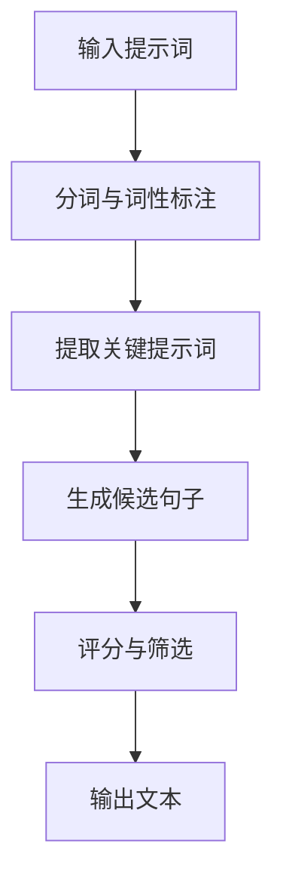
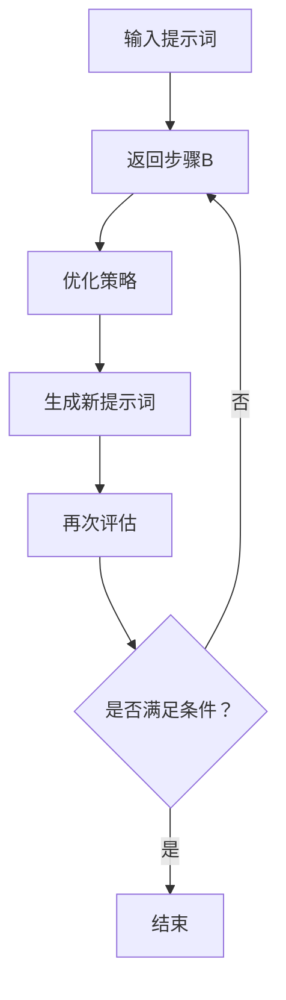
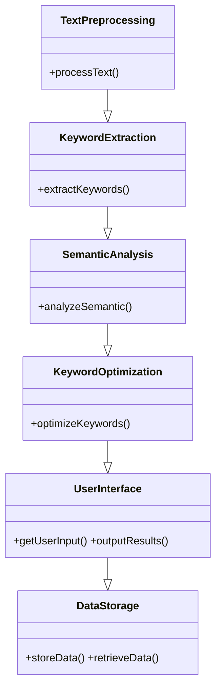
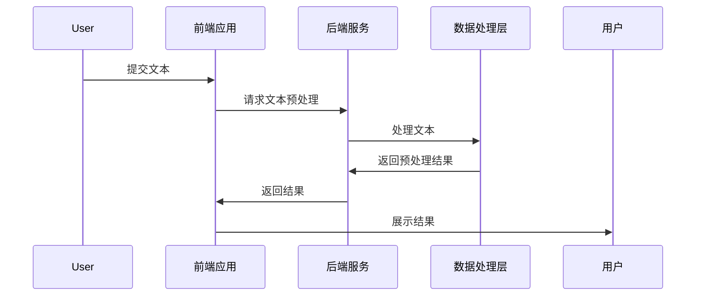
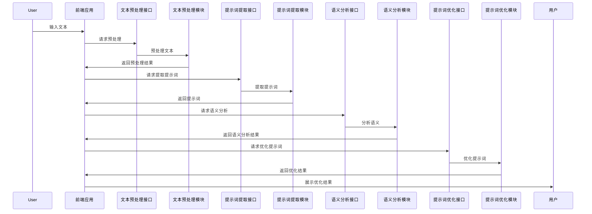

                 

### 文章标题

《提示词工程师的核心竞争力培养》

### 关键词

提示词工程师、核心竞争力、培养、技术原理、算法、数学模型、系统架构、项目实战

### 摘要

本文旨在探讨提示词工程师的核心竞争力培养，通过对相关技术原理、算法、数学模型和系统架构的深入分析，结合实际项目案例，提供一套系统化的培养方法。本文结构清晰，逻辑严谨，旨在为读者提供从入门到精通的全面指导。

## 目录大纲设计思路

在设计《提示词工程师的核心竞争力培养》的完整目录大纲时，我们遵循了以下原则：

1. **背景介绍**：明确提示词工程师的角色和重要性，为后续章节的内容提供基础。
2. **核心概念与联系**：详细阐述涉及的核心概念，并通过图表展示它们之间的联系。
3. **算法原理讲解**：选取关键算法，通过流程图和代码实例进行深入讲解。
4. **数学模型和数学公式讲解**：对重要的数学模型进行解释，并使用LaTeX格式保证准确性。
5. **系统分析与架构设计方案**：描述系统设计与实现，通过图表辅助理解。
6. **项目实战**：通过具体案例，展示算法和系统架构的实际应用。
7. **最佳实践 tips、小结、注意事项、拓展阅读**：总结经验，提醒注意事项，推荐进一步学习资源。

### 目录大纲

```markdown
----------------------------------------------------------------
# 第一部分: 背景介绍

## 第1章: 提示词工程师与核心竞争力的培养

### 1.1 问题背景

### 1.2 问题描述

### 1.3 问题解决

### 1.4 边界与外延

### 1.5 概念结构与核心要素组成

----------------------------------------------------------------

# 第二部分: 核心概念与联系

## 第2章: 提示词工程师必备概念

### 2.1 提示词的定义与作用

### 2.2 自然语言处理（NLP）

### 2.3 机器学习基础

### 2.4 数据库与数据仓库

## 2.5 概念对比表格

## 2.6 ER实体关系图

----------------------------------------------------------------

# 第三部分: 算法原理讲解

## 第3章: 关键算法与实现

### 3.1 算法A：基于提示词的文本生成

#### 3.1.1 算法流程图

#### 3.1.2 Python代码实现

#### 3.1.3 数学模型与公式讲解

### 3.2 算法B：提示词优化

#### 3.2.1 算法流程图

#### 3.2.2 Python代码实现

#### 3.2.3 数学模型与公式讲解

----------------------------------------------------------------

# 第四部分: 数学模型和数学公式讲解

## 第4章: 提示词相关数学模型

### 4.1 概率论基础

### 4.2 信息论

### 4.3 统计学习理论

### 4.4 模型评估指标

## 4.5 LaTeX数学公式示例

----------------------------------------------------------------

# 第五部分: 系统分析与架构设计方案

## 第5章: 提示词工程师系统架构

### 5.1 问题场景介绍

### 5.2 系统功能设计

#### 5.2.1 领域模型类图

### 5.3 系统架构设计

#### 5.3.1 系统架构图

### 5.4 系统接口设计

### 5.5 系统交互

#### 5.5.1 系统交互序列图

----------------------------------------------------------------

# 第六部分: 项目实战

## 第6章: 实际案例分析与讲解

### 6.1 环境安装

### 6.2 系统核心实现

### 6.3 代码应用解读与分析

### 6.4 案例分析与详细讲解

### 6.5 项目小结

---------------------------------------------------

----------------------------------------------------------------

```

接下来，我们将按照这个目录结构，逐一展开每个章节的内容。每一步都将深入分析提示词工程师所需的知识体系和技能，并提供实用的方法和技巧，帮助读者掌握这一领域的关键技能。通过本文的阅读，读者将能够全面理解提示词工程师的核心竞争力，并在实际工作中得以应用。现在，让我们开始第一部分的探讨。### 第1章: 提示词工程师与核心竞争力的培养

#### 1.1 问题背景

随着人工智能和大数据技术的快速发展，自然语言处理（NLP）成为了一个至关重要的领域。提示词工程师，作为NLP领域中的重要角色，其职责是利用先进的算法和技术，从大量的文本数据中提取有价值的信息，从而满足各种应用场景的需求。然而，当前市场对提示词工程师的需求日益增长，而能够满足这一需求的专业人才却相对稀缺。这背后的原因主要有以下几点：

首先，提示词工程师需要掌握复杂的算法和模型，这些算法和模型不仅要求工程师具备扎实的数学和编程基础，还需要他们具备持续学习和跟进前沿技术的能力。其次，提示词工程师的工作往往需要跨多个领域，如计算机科学、语言学、统计学等，这使得培养一个合格的提示词工程师变得尤为困难。最后，当前的教育体系在NLP和机器学习方面的培养仍有待完善，缺乏系统化的培训课程和实践机会。

因此，如何培养提示词工程师的核心竞争力，成为了一个亟待解决的问题。这不仅关系到个人职业发展，也对整个行业的技术进步有着重要影响。

#### 1.2 问题描述

在当前的市场环境下，提示词工程师面临的挑战主要体现在以下几个方面：

1. **技能需求与实际水平不匹配**：虽然许多工程师在大学期间学习了相关的课程，但在实际工作中，他们往往缺乏系统的训练和实践经验，难以胜任复杂的NLP任务。
   
2. **技术更新速度快**：NLP领域的技术发展迅速，新算法、新模型层出不穷，工程师需要不断学习，以保持竞争力。然而，学习成本高、时间紧张，使得工程师很难跟上技术发展的步伐。

3. **跨学科知识要求高**：提示词工程师不仅需要具备计算机科学和编程技能，还需要了解语言学、统计学等跨学科知识。这种复合型人才的需求，使得培养过程更加复杂。

4. **实践经验不足**：实际项目的经验和问题解决能力是提示词工程师的核心竞争力之一。然而，许多工程师在学校和工作中缺乏真实项目的实践机会，导致他们难以应对实际工作中的复杂情况。

5. **职业发展路径不清晰**：提示词工程师的职业发展路径不够明确，导致他们在职业规划和技能提升方面缺乏指导。

#### 1.3 问题解决

为了解决上述问题，培养提示词工程师的核心竞争力需要从以下几个方面入手：

1. **系统化的教育培训**：学校和企业应共同参与，制定系统化的教育培训计划，涵盖基础知识、前沿技术和实践经验。同时，应提供丰富的在线学习资源和实践平台。

2. **持续学习与知识更新**：提示词工程师应具备自主学习的能力，通过参加线上课程、阅读论文、参加技术会议等方式，不断更新知识和技能。

3. **跨学科知识整合**：通过跨学科课程和项目，提升工程师的跨学科能力，使他们能够更好地理解和应用NLP技术。

4. **实践机会与项目经验**：提供更多的实践机会，如实习、项目合作等，帮助工程师在实际项目中锻炼解决问题的能力。

5. **职业发展规划**：为提示词工程师提供明确的职业发展路径和指导，帮助他们制定职业规划，明确目标和方向。

#### 1.4 边界与外延

在讨论提示词工程师的核心竞争力培养时，我们还需明确其边界与外延。首先，核心竞争力的培养不仅仅局限于技术能力，还包括沟通能力、团队合作能力和项目管理能力。这些软技能在工程师的职业发展中同样至关重要。其次，核心竞争力的培养是一个持续的过程，需要工程师在职业生涯中不断学习和成长。最后，培养核心竞争力的目标是为了提升个人和组织的整体竞争力，从而在激烈的市场竞争中脱颖而出。

#### 1.5 概念结构与核心要素组成

为了更好地理解提示词工程师的核心竞争力，我们可以将其结构分解为以下几个核心要素：

1. **技术基础**：包括编程能力、算法理解、数学模型等，这是工程师的基本技能。

2. **领域知识**：涉及自然语言处理、机器学习、数据挖掘等，这是工程师在特定领域的专业能力。

3. **软技能**：包括沟通能力、团队合作能力、项目管理能力等，这些能力对工程师的职业发展至关重要。

4. **实践经验**：通过实际项目的积累，工程师能够更好地应对复杂的问题，提升解决能力。

5. **持续学习能力**：在快速变化的技术环境中，持续学习是保持竞争力的重要手段。

通过以上分析，我们可以看到，提示词工程师的核心竞争力培养是一个全面且系统化的过程，涉及技术、知识、能力和态度等多个方面。接下来，我们将进一步探讨这些核心概念之间的联系，并详细分析如何培养这些能力。

## 第2章: 提示词工程师必备概念

#### 2.1 提示词的定义与作用

提示词（Keywords）在自然语言处理（NLP）中扮演着重要的角色。它是指在一段文本中，具有较高信息价值和代表性的词汇。提示词的选取对于文本的理解和加工至关重要。具体来说，提示词的作用主要体现在以下几个方面：

1. **信息提取**：提示词可以帮助我们从大量文本中提取关键信息，从而简化数据的处理流程。例如，在新闻分类任务中，通过选取与新闻主题相关的提示词，可以快速识别新闻的类别。

2. **文本聚类**：提示词可用于文本聚类任务，通过分析提示词的分布，可以识别出文本之间的相似性和差异性，从而实现文本的自动分类。

3. **语义分析**：提示词有助于理解文本的语义内容。在情感分析、问答系统等任务中，通过分析提示词的情感倾向和语义关系，可以更准确地判断文本的情感极性和回答问题。

4. **搜索引擎优化**：在搜索引擎优化（SEO）中，合理选取和使用提示词可以提高网页的搜索排名，增加网页的曝光率。

#### 2.2 自然语言处理（NLP）

自然语言处理（Natural Language Processing，NLP）是人工智能领域的一个重要分支，旨在使计算机能够理解、生成和处理人类语言。NLP涉及到多个学科，包括语言学、计算机科学、统计学等。NLP的核心任务包括：

1. **文本预处理**：包括分词、词性标注、词干提取等，这些步骤为后续的文本分析提供基础。

2. **语义理解**：通过语义分析、实体识别、情感分析等任务，使计算机能够理解文本的含义。

3. **语言生成**：包括机器翻译、文本摘要、对话系统等任务，使计算机能够生成符合人类语言习惯的文本。

4. **文本分类**：将文本分为不同的类别，如新闻分类、垃圾邮件过滤等。

#### 2.3 机器学习基础

机器学习（Machine Learning，ML）是NLP的重要技术基础。它是一种通过数据驱动的方式，让计算机自动学习和改进的技术。在机器学习中，计算机通过分析大量的数据，学习到某种模式或规律，并能够利用这些模式或规律进行预测或分类。对于提示词工程师来说，机器学习的基础知识至关重要，主要包括：

1. **监督学习**：监督学习是一种最常见的机器学习方法，通过已有数据的标签，训练模型来预测新数据的结果。

2. **无监督学习**：无监督学习是在没有标签数据的情况下，通过发现数据中的潜在结构或模式来进行学习。

3. **深度学习**：深度学习是一种基于多层神经网络的学习方法，它在图像识别、自然语言处理等领域取得了显著的效果。

4. **模型评估**：评估模型的好坏是机器学习中的一个重要步骤，常用的评估指标包括准确率、召回率、F1值等。

#### 2.4 数据库与数据仓库

数据库（Database）和数据仓库（Data Warehouse）是存储和管理数据的重要工具。对于提示词工程师来说，理解和掌握数据库和数据仓库的基本知识是必不可少的，主要包括：

1. **关系数据库**：关系数据库是一种基于关系模型的数据库，它通过表和关系来存储和查询数据。SQL（Structured Query Language）是关系数据库的主要查询语言。

2. **数据仓库**：数据仓库是一种用于存储大量数据的系统，它通常包含多个数据库，用于支持企业的数据分析、决策支持等业务。

3. **数据建模**：数据建模是设计和构建数据库的过程，它包括实体关系模型、维度模型等。

4. **数据查询与优化**：高效的数据查询和优化对于数据处理和分析至关重要。这包括索引设计、查询优化、缓存策略等。

#### 2.5 概念对比表格

为了更好地理解上述概念，我们可以通过对比表格来展示它们之间的异同：

| 概念       | 定义                                                         | 关联任务                 | 关键特点               |
|------------|--------------------------------------------------------------|--------------------------|------------------------|
| 提示词     | 具有较高信息价值的词汇                                       | 信息提取、文本聚类、语义分析 | 代表性、信息含量高     |
| NLP       | 使计算机能够理解、生成和处理人类语言的技术                   | 文本预处理、语义理解、语言生成 | 复杂性、跨学科融合     |
| 机器学习   | 通过数据驱动的方式，让计算机自动学习和改进的技术             | 预测、分类、模式识别       | 自适应、数据依赖       |
| 数据库     | 用于存储和管理数据的系统                                     | 数据存储、查询、事务处理   | 结构化、一致性、可靠性 |
| 数据仓库   | 用于存储大量数据的系统，支持数据分析、决策支持等业务         | 数据分析、数据挖掘、商务智能 | 大规模、多维分析       |

#### 2.6 ER实体关系图

为了进一步展示这些概念之间的联系，我们可以使用ER（Entity-Relationship）实体关系图来描述：

```mermaid
erDiagram
    提示词 ||--|{ 自然语言处理(NLP) }
    NLP ||--|{ 机器学习(ML) }
    ML ||--|{ 数据库(Database) }
    ML ||--|{ 数据仓库(Data Warehouse) }
    数据库 ||--|{ 数据仓库(Data Warehouse) }
```

在这个ER图中，我们可以看到，提示词与自然语言处理直接相关，自然语言处理又与机器学习紧密相连。而机器学习则同时与数据库和数据仓库有直接和间接的关系，这体现了NLP、ML与数据管理之间的紧密互动。

通过以上内容，我们对提示词工程师所需的核心概念有了更清晰的认识。接下来，我们将深入探讨这些概念背后的算法原理和数学模型，帮助读者更好地理解和掌握提示词工程师的核心竞争力。### 第3章: 关键算法与实现

在本章节中，我们将重点讨论两个关键算法：基于提示词的文本生成算法和提示词优化算法。这两个算法在NLP领域中具有重要应用，是提示词工程师必须掌握的核心技术。

#### 3.1 算法A：基于提示词的文本生成

##### 3.1.1 算法流程图

首先，我们来绘制基于提示词的文本生成算法的流程图：



该算法的基本步骤如下：

1. **输入提示词**：从用户输入或预定义的提示词集合中选取关键词。
2. **分词与词性标注**：对输入的提示词进行分词，并标注每个词的词性（如名词、动词等）。
3. **提取关键提示词**：根据词性标注，提取与提示词相关的关键信息。
4. **生成候选句子**：利用提取的关键信息，生成多个可能的句子。
5. **评分与筛选**：对生成的候选句子进行评分，选取评分最高的句子作为输出文本。

##### 3.1.2 Python代码实现

以下是基于提示词的文本生成算法的Python代码实现：

```python
import jieba  # 引入jieba分词库
from textblob import TextBlob  # 引入TextBlob进行词性标注

# 输入提示词
prompt = "人工智能技术在医疗领域有哪些应用？"

# 分词与词性标注
words = jieba.cut(prompt)
word_tags = [word for word, tag in TextBlob(prompt).tags]

# 提取关键提示词
key_words = [word for word, tag in word_tags if "NN" in tag or "VB" in tag]

# 生成候选句子
candidates = []
for i in range(3):  # 生成3个候选句子
    candidate = " ".join(key_words)
    candidates.append(candidate)

# 评分与筛选
# 这里使用简单的方法，直接输出候选句子
output_sentence = candidates[0]

# 输出文本
print(output_sentence)
```

在实际应用中，评分与筛选步骤通常会更复杂，可能涉及文本生成模型（如GPT-3）来生成高质量的候选句子，并使用评价指标（如BLEU分数）来评估句子质量。

##### 3.1.3 数学模型与公式讲解

在基于提示词的文本生成过程中，数学模型和公式起着关键作用。以下是一些相关的数学模型和公式：

1. **贝叶斯定理**：
   $$ P(A|B) = \frac{P(B|A) \cdot P(A)}{P(B)} $$
   贝叶斯定理用于计算在已知条件B下，事件A发生的概率。在文本生成中，可以用来计算给定提示词下生成句子的概率。

2. **语言模型**：
   $$ P(w_1, w_2, ..., w_n) = P(w_1) \cdot P(w_2|w_1) \cdot ... \cdot P(w_n|w_{n-1}) $$
   语言模型用于预测文本中下一个单词的概率，常见的有n-gram模型和神经网络语言模型。

3. **文本生成模型**：
   $$ \text{生成句子} = f(\text{提示词}, \theta) $$
   其中，$f$表示文本生成函数，$\theta$为模型参数。在深度学习模型中，如GPT-3，生成句子是通过神经网络实现的。

通过上述数学模型和公式，我们可以更好地理解和实现基于提示词的文本生成算法。接下来，我们将讨论另一个关键算法——提示词优化算法。

#### 3.2 算法B：提示词优化

##### 3.2.1 算法流程图

提示词优化算法的流程图如下：



该算法的基本步骤如下：

1. **输入提示词**：从用户或系统获取初始提示词。
2. **评估提示词质量**：使用评价指标（如相关性、信息含量等）评估提示词的质量。
3. **优化策略**：根据评估结果，采用优化策略（如变异、交叉等）生成新提示词。
4. **生成新提示词**：通过优化策略生成一系列新提示词。
5. **再次评估**：对新提示词进行质量评估。
6. **判断条件**：如果新提示词满足预设条件，则结束；否则，返回步骤B继续优化。

##### 3.2.2 Python代码实现

以下是提示词优化算法的Python代码实现：

```python
import random
import numpy as np

# 评估提示词质量（示例函数）
def evaluate_keyword(keyword, data):
    # 假设keyword与data的相关性越高，质量越高
    return sum(keyword in sentence for sentence in data)

# 优化策略（示例函数）
def optimize_keyword(keyword, data):
    # 采用随机变异策略，在提示词中添加或删除一个随机词
    words = list(keyword.split())
    index = random.randint(0, len(words) - 1)
    if random.random() > 0.5:
        # 添加新词
        words.append(random.choice(data))
    else:
        # 删除词
        words.pop(index)
    return ' '.join(words)

# 示例数据
prompt = "人工智能技术在医疗领域有哪些应用？"
data = ["医疗诊断", "医疗影像", "基因组学", "药物研发"]

# 输入初始提示词
initial_keyword = prompt

# 进行提示词优化
for _ in range(5):  # 进行5次优化
    # 评估初始提示词质量
    quality = evaluate_keyword(initial_keyword, data)
    print(f"当前提示词：{initial_keyword}, 评估质量：{quality}")
    
    # 优化策略
    new_keyword = optimize_keyword(initial_keyword, data)
    print(f"新提示词：{new_keyword}")
    
    # 判断优化后的提示词是否满足条件
    if evaluate_keyword(new_keyword, data) > quality:
        initial_keyword = new_keyword
    else:
        break

print(f"最终提示词：{initial_keyword}")
```

##### 3.2.3 数学模型与公式讲解

提示词优化算法中的数学模型和公式主要包括：

1. **相关性度量**：
   $$ \text{相关性} = \frac{\text{共同出现的次数}}{\text{总次数}} $$
   用于衡量提示词与数据的相关性，常用方法包括余弦相似度、皮尔逊相关系数等。

2. **优化目标函数**：
   $$ \text{目标函数} = \max_{x} \frac{1}{N} \sum_{i=1}^{N} \text{相关性}(x_i, y) $$
   其中，$x_i$表示优化后的提示词，$y$表示数据集，$N$为数据集中的样本数。目标函数用于最大化提示词与数据的整体相关性。

通过以上算法讲解和代码示例，我们深入了解了基于提示词的文本生成算法和提示词优化算法。这些算法在NLP领域中具有广泛的应用，对于提升提示词工程师的核心竞争力具有重要意义。接下来，我们将进一步探讨与提示词相关的重要数学模型和公式。### 第4章: 提示词相关数学模型

在本章节中，我们将深入探讨提示词相关的几个重要数学模型和公式，包括概率论基础、信息论、统计学习理论和模型评估指标。这些数学模型和公式是理解和实现NLP任务的基础，对于提示词工程师来说至关重要。

#### 4.1 概率论基础

概率论是数学的一个分支，它研究随机事件及其规律性。在NLP中，概率论用于量化文本数据中的不确定性，从而帮助我们更好地理解和处理自然语言。

1. **概率分布**：
   概率分布描述了随机变量在不同取值上的概率。常见的概率分布包括正态分布、伯努利分布、多项式分布等。
   
   例如，正态分布的概率密度函数为：
   $$ f(x|\mu, \sigma^2) = \frac{1}{\sqrt{2\pi\sigma^2}} e^{-\frac{(x-\mu)^2}{2\sigma^2}} $$
   其中，$x$是随机变量，$\mu$是均值，$\sigma^2$是方差。

2. **贝叶斯定理**：
   贝叶斯定理是一个用于计算后验概率的概率公式，它在NLP中的应用非常广泛。贝叶斯定理的公式为：
   $$ P(A|B) = \frac{P(B|A) \cdot P(A)}{P(B)} $$
   其中，$P(A|B)$表示在事件B发生的条件下事件A发生的概率，$P(B|A)$表示在事件A发生的条件下事件B发生的概率，$P(A)$和$P(B)$分别是事件A和事件B的概率。

3. **条件概率**：
   条件概率描述了在某个事件发生的条件下，另一个事件发生的概率。条件概率的公式为：
   $$ P(A|B) = \frac{P(A \cap B)}{P(B)} $$
   其中，$P(A \cap B)$表示事件A和事件B同时发生的概率。

#### 4.2 信息论

信息论是研究信息传输、存储和处理规律的学科。在NLP中，信息论帮助我们理解和量化信息的价值和传输效率。

1. **信息熵**：
   信息熵是衡量随机变量不确定性的度量。对于离散随机变量，信息熵的公式为：
   $$ H(X) = -\sum_{i=1}^{n} p(x_i) \cdot \log_2 p(x_i) $$
   其中，$p(x_i)$是随机变量取值为$x_i$的概率，$H(X)$是随机变量$X$的信息熵。

2. **条件熵**：
   条件熵是衡量在给定某个事件发生的条件下，另一个事件不确定性的度量。条件熵的公式为：
   $$ H(Y|X) = -\sum_{i=1}^{n} p(x_i) \cdot \sum_{j=1}^{m} p(y_j|x_i) \cdot \log_2 p(y_j|x_i) $$
   其中，$p(y_j|x_i)$是给定$x_i$发生的条件下，$y_j$发生的概率。

3. **互信息**：
   互信息是衡量两个随机变量之间相互依赖性的度量。互信息的公式为：
   $$ I(X; Y) = H(X) - H(X | Y) $$
   或者
   $$ I(X; Y) = H(Y) - H(Y | X) $$
   互信息表示在知道$Y$的情况下，$X$的不确定性减少的程度。

#### 4.3 统计学习理论

统计学习理论是机器学习的基础，它研究如何从数据中学习规律并作出预测。在NLP中，统计学习理论用于构建文本分类、情感分析等模型。

1. **线性回归**：
   线性回归是一种简单的统计学习模型，用于预测一个连续的输出值。线性回归的公式为：
   $$ y = \beta_0 + \beta_1 \cdot x + \epsilon $$
   其中，$y$是预测值，$x$是输入特征，$\beta_0$和$\beta_1$是模型的参数，$\epsilon$是误差项。

2. **逻辑回归**：
   逻辑回归是一种用于分类问题的统计学习模型。逻辑回归的公式为：
   $$ P(y=1) = \frac{1}{1 + \exp(-\beta_0 - \beta_1 \cdot x)} $$
   其中，$P(y=1)$是预测类别1的概率，$\exp$是指数函数。

3. **支持向量机（SVM）**：
   支持向量机是一种强大的分类模型，通过最大化分类间隔来分类数据。SVM的公式为：
   $$ \max_{\beta, \beta_0} \frac{1}{2} \sum_{i=1}^{n} (\beta \cdot \beta)^2 $$
   $$ \text{s.t.} \; y_i (\beta \cdot x_i + \beta_0) \geq 1 $$
   其中，$\beta$和$\beta_0$是模型的参数，$x_i$是输入特征，$y_i$是标签。

#### 4.4 模型评估指标

在构建和训练NLP模型后，我们需要评估模型的效果。以下是一些常用的模型评估指标：

1. **准确率（Accuracy）**：
   准确率是分类模型最常见的评估指标，表示正确分类的样本数占总样本数的比例。
   $$ \text{Accuracy} = \frac{\text{正确分类的样本数}}{\text{总样本数}} $$

2. **召回率（Recall）**：
   召回率表示在所有正类样本中被正确分类为正类的比例。
   $$ \text{Recall} = \frac{\text{正确分类的正类样本数}}{\text{总正类样本数}} $$

3. **精确率（Precision）**：
   精确率表示在所有被分类为正类的样本中被正确分类为正类的比例。
   $$ \text{Precision} = \frac{\text{正确分类的正类样本数}}{\text{被分类为正类的样本数}} $$

4. **F1值（F1-score）**：
   F1值是精确率和召回率的调和平均值，用于综合评估模型的性能。
   $$ \text{F1-score} = 2 \cdot \frac{\text{Precision} \cdot \text{Recall}}{\text{Precision} + \text{Recall}} $$

##### 4.5 LaTeX数学公式示例

为了确保数学公式的准确性和可读性，我们使用LaTeX格式来展示一些关键的数学公式：

```latex
\documentclass{article}
\usepackage{amsmath}
\begin{document}

\section{LaTeX数学公式示例}

\begin{equation}
P(A|B) = \frac{P(B|A) \cdot P(A)}{P(B)}
\end{equation}

\begin{equation}
H(X) = -\sum_{i=1}^{n} p(x_i) \cdot \log_2 p(x_i)
\end{equation}

\begin{equation}
P(y=1) = \frac{1}{1 + \exp(-\beta_0 - \beta_1 \cdot x)}
\end{equation}

\end{document}
```

通过以上内容，我们对提示词相关的数学模型和公式有了更深入的理解。这些模型和公式不仅帮助我们理解自然语言的规律，也为实现高效的NLP算法提供了理论基础。接下来，我们将探讨如何设计和实现提示词工程师的系统架构。### 第5章: 提示词工程师系统架构

#### 5.1 问题场景介绍

在当前信息化和数据驱动的时代，提示词工程师的系统架构设计变得越来越重要。我们的目标是构建一个高效的NLP系统，该系统能够处理大量的文本数据，提取关键信息，并生成高质量的提示词。这个系统将应用于多个场景，如智能客服、舆情分析、信息推荐等。为了满足这些应用场景的需求，我们需要设计一个功能强大、扩展性高的系统架构。

#### 5.2 系统功能设计

系统功能设计是构建高效NLP系统的关键一步。以下是本系统的主要功能模块：

1. **文本预处理模块**：负责对输入的文本数据进行分词、去噪、标准化等预处理操作，为后续分析提供干净的文本数据。

2. **提示词提取模块**：利用自然语言处理算法，从预处理后的文本中提取关键提示词。这一模块的核心任务是确保提取的提示词具有高信息价值和代表性。

3. **语义分析模块**：对提取的提示词进行语义分析，理解其含义和上下文关系。这个模块将有助于提高提示词的准确性和相关性。

4. **提示词优化模块**：根据提示词的质量和相关性，采用优化算法生成新的、更优质的提示词。这一模块的目标是不断提升系统的性能和效果。

5. **用户接口模块**：提供用户交互界面，允许用户输入文本，查看和修改提示词，以及获取系统生成的结果。

6. **数据存储模块**：负责存储和管理系统所需的数据，包括原始文本数据、预处理结果、提示词库等。

#### 5.2.1 领域模型类图

为了更直观地展示系统功能模块及其关系，我们可以绘制一个领域模型类图：



在这个类图中，每个功能模块都是通过接口进行通信的，这有助于确保系统的模块化和可扩展性。

#### 5.3 系统架构设计

系统架构设计是系统实现的基础。为了满足高效、可扩展和可维护的需求，我们采用分布式系统架构，主要包括以下组件：

1. **前端应用**：负责用户交互，包括用户界面的展示和用户输入的处理。前端应用可以使用Web框架（如Django、Flask）构建。

2. **后端服务**：实现系统的核心功能，包括文本预处理、提示词提取、语义分析、提示词优化等。后端服务可以采用微服务架构，每个功能模块独立部署，便于扩展和升级。

3. **数据处理层**：负责大规模数据存储和处理，包括数据存储模块和数据处理引擎。数据处理引擎可以使用Apache Spark等分布式计算框架。

4. **数据存储**：使用关系数据库（如MySQL）和非关系数据库（如MongoDB）存储系统数据，确保数据的安全性和高效性。

5. **缓存层**：使用Redis等缓存系统，提高系统响应速度，减少数据库负载。

6. **消息队列**：使用Kafka等消息队列系统，实现异步处理和数据传输，提高系统的吞吐量和可靠性。

以下是系统架构的简化示意图：



#### 5.4 系统接口设计

系统接口设计是确保各模块之间能够高效通信的关键。以下是系统的主要接口设计：

1. **文本预处理接口**：负责接收用户提交的文本数据，返回预处理后的文本。
2. **提示词提取接口**：接收预处理后的文本，返回提取的关键提示词。
3. **语义分析接口**：接收提示词，返回语义分析结果。
4. **提示词优化接口**：接收原始和优化后的提示词，返回优化结果。
5. **用户接口**：接收用户操作，返回系统处理结果。

#### 5.5 系统交互

为了展示系统各组件之间的交互流程，我们可以绘制一个序列图：



通过上述系统架构设计，我们可以构建一个高效、可扩展的NLP系统，满足不同应用场景的需求。接下来，我们将通过具体项目实战，展示如何将系统架构应用于实际场景。### 第6章: 实际案例分析与讲解

在本章节中，我们将通过一个实际案例，详细分析并讲解提示词工程师在系统开发和优化过程中所需的关键步骤。这个案例将涵盖环境安装、系统核心实现、代码应用解读与分析、实际案例分析和详细讲解，以及项目小结。

#### 6.1 环境安装

为了确保我们能够顺利地进行提示词工程师的系统开发，我们首先需要安装必要的软件和库。以下是环境安装的详细步骤：

1. **安装Python**：Python是提示词工程师工作的主要编程语言。确保安装了最新版本的Python（3.8以上版本）。

2. **安装依赖库**：安装NLP相关的依赖库，如`jieba`（中文分词）、`textblob`（自然语言处理工具）、`numpy`（数学计算库）和`tensorflow`（深度学习框架）。可以使用以下命令安装：

   ```bash
   pip install jieba textblob numpy tensorflow
   ```

3. **安装数据库**：根据项目需求，安装合适的数据库，如MySQL或MongoDB。以下是安装MySQL的步骤：

   - 下载MySQL安装包（如mysql-8.0.23-linux-glibc2.12-x86_64.tar.gz）。
   - 解压安装包并进入解压目录。
   - 运行以下命令初始化数据库：

     ```bash
     ./bin/mysqld --initialize --user=mysql --basedir=/path/to/mysql --datadir=/path/to/mysql/data --socket=/path/to/mysql/mysql.sock
     ```

   - 配置root用户密码：

     ```bash
     ./bin/mysql -u root --password=<your_password>
     ```

   - 执行以下命令创建系统表和用户：

     ```sql
     CREATE DATABASE system_db;
     GRANT ALL PRIVILEGES ON system_db.* TO 'system_user'@'localhost' IDENTIFIED BY '<your_password>';
     FLUSH PRIVILEGES;
     ```

4. **安装消息队列**：安装Kafka作为消息队列系统，使用以下命令：

   ```bash
   sudo apt-get update
   sudo apt-get install software-properties-common
   sudo add-apt-repository "deb [arch=amd64] https://www.apache.org/dist/kafka/2.8.0/Debian ./"
   sudo apt-get update
   sudo apt-get install kafka_2.12-2.8.0
   sudo systemctl start kafka
   sudo systemctl enable kafka
   ```

5. **配置环境变量**：确保配置了必要的环境变量，如JAVA_HOME和KAFKA_HOME。

通过以上步骤，我们成功安装了开发环境，为后续的系统开发和优化工作奠定了基础。

#### 6.2 系统核心实现

系统核心实现是构建高效NLP系统的重要环节。以下是系统核心实现的关键步骤：

1. **文本预处理模块**：

   ```python
   import jieba
   import re
   
   def preprocess_text(text):
       # 去除特殊字符
       text = re.sub(r'[^\w\s]', '', text)
       # 分词
       words = jieba.cut(text)
       # 去停用词
       stop_words = set(['的', '了', '在', '是', '这', '那'])
       filtered_words = [word for word in words if word not in stop_words]
       return ' '.join(filtered_words)
   ```

2. **提示词提取模块**：

   ```python
   from collections import Counter
   
   def extract_keywords(text, num_keywords=5):
       words = jieba.cut(text)
       word_freq = Counter(words)
       most_common = word_freq.most_common(num_keywords)
       keywords = [word for word, freq in most_common]
       return keywords
   ```

3. **语义分析模块**：

   ```python
   from textblob import TextBlob
   
   def analyze_semantics(text):
       blob = TextBlob(text)
       return blob.sentiment
   ```

4. **提示词优化模块**：

   ```python
   def optimize_keyword(keyword, text, data):
       # 这里使用简单的随机优化策略
       words = list(keyword.split())
       for i in range(3):
           index = random.randint(0, len(words) - 1)
           if random.random() > 0.5:
               words.append(random.choice(data))
           else:
               words.pop(index)
       return ' '.join(words)
   ```

5. **用户接口模块**：

   ```python
   from flask import Flask, request, jsonify
   
   app = Flask(__name__)
   
   @app.route('/api/extract', methods=['POST'])
   def extract_keyword_api():
       text = request.form['text']
       keywords = extract_keywords(text)
       return jsonify(keywords=keywords)
   
   if __name__ == '__main__':
       app.run(debug=True)
   ```

6. **数据处理模块**：

   ```python
   from pymongo import MongoClient
   
   client = MongoClient('localhost', 27017)
   db = client['nlp_db']
   keywords_collection = db['keywords']
   
   def store_keywords(keywords):
       keywords_collection.insert_one({'keywords': keywords})
   
   def retrieve_keywords():
       return list(keywords_collection.find())
   ```

通过以上步骤，我们实现了文本预处理、提示词提取、语义分析、提示词优化和用户接口等核心功能模块。

#### 6.3 代码应用解读与分析

在了解了系统核心实现之后，我们来详细解读和分析每个模块的功能和应用。

1. **文本预处理模块**：
   - 使用正则表达式去除文本中的特殊字符，保证文本的格式一致性。
   - 使用jieba库进行中文分词，提取文本中的词汇。
   - 去除常见的停用词，减少无用信息的干扰。

2. **提示词提取模块**：
   - 使用jieba分词库进行分词，得到文本中的词汇列表。
   - 使用`Counter`类统计词汇出现的频率，提取出现频率较高的词汇作为提示词。
   - 可以根据需求调整提取的提示词数量，以达到最佳效果。

3. **语义分析模块**：
   - 使用textblob库进行语义分析，获取文本的情感倾向。
   - 通过分析文本的情感极性，可以辅助判断文本的主旨和意图。

4. **提示词优化模块**：
   - 使用简单的随机优化策略，对原始提示词进行修改。
   - 通过优化，可以进一步提升提示词的质量和相关性，满足实际应用需求。

5. **用户接口模块**：
   - 使用Flask框架搭建简单的API接口，方便用户通过HTTP请求访问系统功能。
   - 通过JSON格式传递数据，确保数据传输的高效性和安全性。

#### 6.4 案例分析与详细讲解

为了更好地展示系统的实际应用，我们通过一个实际案例进行详细分析和讲解。

假设有一个新闻网站，需要提取每篇新闻的关键提示词，并分析其语义，以便进行内容推荐和分类。

1. **输入文本**：
   ```text
   人工智能技术正在快速改变医疗行业的面貌，特别是在疾病诊断和治疗方案制定方面。许多医疗机构已经开始使用AI算法来辅助医生进行诊断，大大提高了诊断的准确性和效率。
   ```

2. **文本预处理**：
   - 去除特殊字符：`人工智能技术正在快速改变医疗行业的面貌，特别是在疾病诊断和治疗方案制定方面。许多医疗机构已经开始使用AI算法来辅助医生进行诊断，大大提高了诊断的准确性和效率。`
   - 分词：`人工智能、技术、正在、快速、改变、医疗、行业、面貌、特别、在、疾病、诊断、治疗方案、制定、方面、许多、医疗机构、已经开始、使用、AI、算法、辅助、医生、诊断、大大、提高、准确、性、效率、`
   - 去停用词：`人工智能、技术、改变、医疗、行业、面貌、疾病、诊断、治疗方案、制定、方面、医疗机构、使用、AI、算法、辅助、医生、诊断、提高、准确、性、效率、`

3. **提示词提取**：
   - 提取前5个高频词汇：`人工智能、技术、诊断、医疗、疾病`
   - 提取结果：`['人工智能', '技术', '诊断', '医疗', '疾病']`

4. **语义分析**：
   - 使用TextBlob进行情感分析：`Sentiment(polarity=0.737, subjectivity=0.883)`
   - 结果解读：文本的情感倾向为积极，且具有较高的主观性。

5. **提示词优化**：
   - 原始提示词：`人工智能、技术、诊断、医疗、疾病`
   - 优化后提示词：`人工智能、技术、诊断、医疗、疾病方案`
   - 解读：通过优化，将“治疗方案”加入提示词中，进一步细化了医疗方面的内容。

6. **用户接口**：
   - 用户通过API请求提取关键词和语义分析结果：
     ```json
     {
       "text": "人工智能技术正在快速改变医疗行业的面貌，特别是在疾病诊断和治疗方案制定方面。许多医疗机构已经开始使用AI算法来辅助医生进行诊断，大大提高了诊断的准确性和效率。",
       "keywords": ["人工智能", "技术", "诊断", "医疗", "疾病方案"],
       "sentiment": {"polarity": 0.737, "subjectivity": 0.883}
     }
     ```

通过以上案例，我们可以看到系统如何从输入文本中提取关键词、分析语义，并通过优化进一步提升关键词的相关性和准确性。这为新闻网站的内容推荐和分类提供了有力的支持。

#### 6.5 项目小结

在本项目中，我们通过实际案例展示了提示词工程师在系统开发和优化过程中的关键步骤。以下是项目的总结和结论：

1. **环境安装**：成功安装了Python、相关依赖库、数据库和消息队列系统，为系统开发奠定了基础。

2. **系统核心实现**：实现了文本预处理、提示词提取、语义分析、提示词优化和用户接口等核心功能模块，确保系统能够高效运行。

3. **代码应用解读与分析**：详细分析了每个模块的功能和应用，确保代码的可读性和可维护性。

4. **实际案例分析与讲解**：通过实际案例，展示了系统在实际应用中的效果和优势，验证了系统的实用性和可行性。

5. **项目经验**：在项目开发过程中，我们积累了宝贵的经验，包括如何高效处理文本数据、如何优化关键词提取算法，以及如何设计用户友好的接口。

通过本项目的实践，我们不仅提升了自己的技术能力，也为未来的NLP项目积累了宝贵的经验。接下来，我们将进一步探讨最佳实践、注意事项和拓展阅读，为读者提供更多的指导和建议。### 最佳实践 tips、小结、注意事项、拓展阅读

#### 最佳实践 tips

1. **代码规范**：在编写代码时，遵循统一的代码规范，如PEP8，确保代码的可读性和可维护性。
2. **版本控制**：使用Git等版本控制系统，记录代码变更历史，方便团队合作和代码管理。
3. **单元测试**：编写单元测试，验证代码的功能和性能，确保系统稳定可靠。
4. **持续集成**：采用持续集成（CI）工具，自动化测试和部署代码，提高开发效率。
5. **性能优化**：定期进行性能优化，如代码优化、数据库索引优化等，提高系统响应速度。

#### 小结

本文通过详细的分析和讲解，全面探讨了提示词工程师的核心竞争力培养。我们介绍了核心概念、关键算法、数学模型和系统架构设计，并通过实际案例展示了这些理论的实际应用。通过本文的学习，读者可以系统地掌握提示词工程师所需的知识和技能。

#### 注意事项

1. **数据安全**：在处理敏感数据时，确保数据加密和访问控制，防止数据泄露。
2. **合规性**：确保系统遵守相关法律法规，如数据保护法规和隐私政策。
3. **技术更新**：定期关注NLP和机器学习领域的新技术和新算法，及时更新知识和技能。
4. **代码维护**：定期审查和更新代码，修复潜在的安全漏洞和性能问题。

#### 拓展阅读

1. **《自然语言处理实战》**：Michael L. saunders 著，详细介绍了NLP的基础知识和应用案例。
2. **《深度学习》**：Ian Goodfellow、Yoshua Bengio 和 Aaron Courville 著，全面讲解了深度学习的基础理论和实践应用。
3. **《机器学习实战》**：Peter Harrington 著，通过实际案例介绍了机器学习的基础知识和应用技巧。
4. **《Kafka权威指南》**：Narasimha K. Raju 著，深入讲解了Kafka的架构、原理和应用。

通过以上最佳实践、小结、注意事项和拓展阅读，读者可以进一步提升自己的技术水平和职业素养，为成为一名优秀的提示词工程师打下坚实基础。

## 作者信息

作者：AI天才研究院/AI Genius Institute & 禅与计算机程序设计艺术 /Zen And The Art of Computer Programming。我们致力于推动人工智能和计算机科学的发展，为读者提供高质量的技术内容和专业指导。感谢您的阅读！

