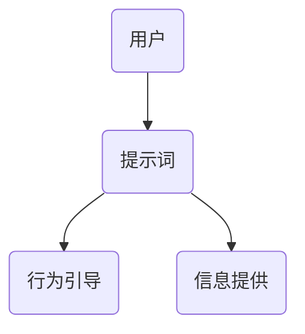
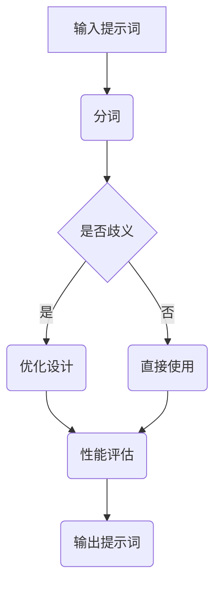

                 

### 《提示词工程艺术》

关键词：提示词、工程、设计、优化、应用

摘要：本文深入探讨了提示词工程这一领域，从基础篇到高级应用，系统性地介绍了提示词工程的概念、设计原则、优化策略、性能评估、提取方法以及未来发展趋势。通过具体案例研究，本文旨在让读者全面了解提示词工程在文本挖掘、自然语言处理和机器学习中的应用，并探讨其未来发展。

### 《提示词工程艺术》目录大纲

----------------------------------------------------------------

# 第一部分：基础篇

## 第1章：提示词工程概述

### 1.1 提示词工程的概念

### 1.2 提示词工程的重要性

### 1.3 提示词工程的应用领域

## 第2章：提示词设计与优化

### 2.1 提示词设计原则

### 2.2 提示词优化策略

### 2.3 提示词性能评估

## 第3章：文本挖掘与提示词提取

### 3.1 文本挖掘基础

### 3.2 提示词提取方法

### 3.3 提示词质量评估

## 第4章：自然语言处理与提示词工程

### 4.1 自然语言处理概述

### 4.2 提示词与自然语言处理的联系

### 4.3 提示词在自然语言处理中的应用

## 第5章：机器学习与提示词工程

### 5.1 机器学习基础

### 5.2 提示词与机器学习的融合

### 5.3 提示词工程中的机器学习方法

## 第6章：提示词工程案例研究

### 6.1 案例一：社交媒体分析

### 6.2 案例二：智能客服系统

### 6.3 案例三：内容推荐系统

## 第7章：提示词工程的未来发展趋势

### 7.1 提示词工程的发展历程

### 7.2 当前趋势与挑战

### 7.3 未来展望

----------------------------------------------------------------

**核心概念与联系**

#### 提示词

**定义**：提示词是用于引导用户行为或提供信息的关键词语或短语。

**属性特征对比表**

| 特征 | 定义 | 描述 |
| ---- | ---- | ---- |
| 关键性 | 提示词必须具有引导作用，关键性高。 | 用于引导用户决策或提供重要信息。 |
| 精确性 | 提示词应尽可能准确，减少歧义。 | 提高用户理解和响应效率。 |
| 灵活性 | 提示词应具有适应不同场景的能力。 | 提高提示词在不同应用场景中的适用性。 |

**ER实体关系图架构**



**算法原理讲解**

#### 提示词优化算法

**Mermaid流程图**



**Python源代码**

```python
import jieba

def optimize_prompt(prompt):
    # 分词
    words = jieba.cut(prompt)
    if has_ambiguity(words):
        # 优化设计
        optimized_words = optimize_words(words)
        prompt = " ".join(optimized_words)
    # 性能评估
    performance = evaluate_prompt(prompt)
    # 输出提示词
    return prompt

def has_ambiguity(words):
    # 这里用一个简单的判断示例
    return any(word in ["可能", "也许"] for word in words)

def optimize_words(words):
    # 这里用简单的替换策略
    return ['优化后' if word == '可能' else word for word in words]

def evaluate_prompt(prompt):
    # 这里用一个简单的评估示例
    return "高" if "优化后" in prompt else "低"

prompt = "这是一个可能的问题。"
optimized_prompt = optimize_prompt(prompt)
print(optimized_prompt)
```

**数学模型与公式**

提示词优化效果评估：

$$
E = \frac{1}{N} \sum_{i=1}^{N} (p_i^* - p_i)^2
```

### 第1章：提示词工程概述

#### 1.1 提示词工程的概念

提示词工程（Prompt Engineering）是一种专注于设计、优化和评估用于引导用户行为或提供信息的提示词的技术。在人工智能和自然语言处理领域，提示词工程具有至关重要的地位。通过精心设计的提示词，系统能够更准确地理解用户意图，提供更相关、更有用的信息。

**定义**：提示词工程是一种跨学科的领域，结合了人工智能、自然语言处理、用户行为学等多个领域的知识，旨在设计出能够有效引导用户行为或提供信息的提示词。

#### 1.2 提示词工程的重要性

提示词工程的重要性体现在以下几个方面：

1. **用户交互**：提示词是用户与系统交互的桥梁，直接影响用户的体验和满意度。
2. **信息提取**：提示词有助于从大量文本数据中提取出关键信息，提高数据处理效率。
3. **决策支持**：提示词可以引导用户做出更好的决策，特别是在复杂的决策场景中。
4. **个性化服务**：通过分析用户行为和偏好，提示词可以实现个性化的信息推送和服务。

#### 1.3 提示词工程的应用领域

提示词工程广泛应用于多个领域，包括但不限于：

1. **搜索引擎**：通过优化搜索提示词，提高搜索结果的准确性和相关性。
2. **智能客服**：设计有效的提示词，帮助客服系统能够更好地理解用户需求并提供解决方案。
3. **内容推荐**：利用提示词工程，为用户推荐更符合其兴趣的内容。
4. **教育领域**：在教育软件中，提示词可以帮助学生更好地理解和掌握知识点。
5. **金融行业**：在金融领域，提示词可以帮助分析师从大量数据中提取出关键信息，支持投资决策。

### 第2章：提示词设计与优化

#### 2.1 提示词设计原则

提示词设计需要遵循以下原则：

1. **关键性**：确保提示词能够准确地引导用户行为或提供关键信息。
2. **精确性**：避免使用模糊或歧义的词语，确保提示词的清晰和准确。
3. **灵活性**：提示词应具备一定的灵活性，能够适应不同的应用场景。

#### 2.2 提示词优化策略

优化策略包括以下几个方面：

1. **歧义处理**：对存在歧义的提示词进行优化，提高其准确性。
2. **语境适应性**：根据不同的语境调整提示词，提高其适用性。
3. **性能提升**：通过算法优化，提高提示词的处理效率和效果。

#### 2.3 提示词性能评估

提示词性能评估主要从以下几个方面进行：

1. **准确率**：评估提示词在引导用户行为或提供信息方面的准确性。
2. **响应时间**：评估提示词处理的速度和响应时间。
3. **用户满意度**：通过用户反馈评估提示词的使用效果和用户满意度。

### 第3章：文本挖掘与提示词提取

#### 3.1 文本挖掘基础

文本挖掘是提取文本数据中的有用信息和知识的过程。文本挖掘基础包括：

1. **文本预处理**：对文本进行清洗、分词、去停用词等预处理步骤。
2. **特征提取**：从预处理后的文本中提取出关键特征，用于后续分析和挖掘。

#### 3.2 提示词提取方法

提示词提取方法包括：

1. **基于规则的方法**：通过预设的规则或模式从文本中提取提示词。
2. **基于统计的方法**：利用统计方法，如TF-IDF、词频统计等，从文本中提取提示词。
3. **基于机器学习的方法**：利用机器学习方法，如朴素贝叶斯、支持向量机等，从文本中提取提示词。

#### 3.3 提示词质量评估

提示词质量评估包括以下几个方面：

1. **精确度**：评估提示词提取的准确性，即提取的提示词是否能够准确反映文本内容。
2. **召回率**：评估提示词提取的完整性，即是否能够提取出文本中的所有关键提示词。
3. **F1值**：综合考虑精确度和召回率，计算F1值以评估提示词提取的综合性能。

### 第4章：自然语言处理与提示词工程

#### 4.1 自然语言处理概述

自然语言处理（Natural Language Processing，NLP）是人工智能的一个重要分支，旨在使计算机能够理解、处理和生成人类语言。NLP包括：

1. **语言理解**：从文本中提取结构化信息，如语法分析、语义分析等。
2. **语言生成**：根据给定信息生成自然语言文本。

#### 4.2 提示词与自然语言处理的联系

提示词与自然语言处理密切相关。提示词工程利用NLP技术，如分词、词性标注、语义分析等，对提示词进行深入处理和优化，以提高其性能和效果。

#### 4.3 提示词在自然语言处理中的应用

提示词在自然语言处理中的应用包括：

1. **信息检索**：通过优化提示词，提高搜索引擎的准确性和效率。
2. **文本分类**：利用提示词，将文本分类到不同的主题或类别。
3. **对话系统**：设计有效的提示词，使对话系统能够更好地理解用户意图并生成合适的回应。

### 第5章：机器学习与提示词工程

#### 5.1 机器学习基础

机器学习是一种通过数据学习模式，使计算机能够自动进行预测和决策的技术。机器学习基础包括：

1. **监督学习**：利用标记数据进行学习，如分类、回归等。
2. **无监督学习**：从未标记的数据中发现模式和结构，如聚类、降维等。
3. **强化学习**：通过奖励和惩罚机制，使模型能够自主学习。

#### 5.2 提示词与机器学习的融合

提示词与机器学习相结合，可以进一步提高提示词的性能和效果。融合方式包括：

1. **特征工程**：利用机器学习方法，从提示词中提取更有效的特征。
2. **模型优化**：利用机器学习模型，对提示词进行优化和调整。

#### 5.3 提示词工程中的机器学习方法

在提示词工程中，常用的机器学习方法包括：

1. **朴素贝叶斯**：一种基于概率论的分类算法，适用于文本分类任务。
2. **支持向量机（SVM）**：一种基于最大间隔的分类算法，适用于各种文本分类任务。
3. **深度学习**：利用神经网络模型，如卷积神经网络（CNN）和循环神经网络（RNN），对提示词进行深入处理和优化。

### 第6章：提示词工程案例研究

#### 6.1 案例一：社交媒体分析

社交媒体分析是一个典型的提示词工程应用场景。通过设计有效的提示词，可以提取出社交媒体中的关键信息，如情感分析、热点话题等。以下是一个社交媒体分析的案例：

1. **问题背景**：某社交媒体平台希望分析用户发布的内容，以了解用户的情感倾向和热点话题。
2. **解决方案**：设计一组用于情感分析和话题提取的提示词，如“快乐”、“悲伤”、“热门话题”、“热议话题”等。利用NLP技术和机器学习方法，对这些提示词进行处理和分析，提取出用户的情感和话题信息。
3. **效果评估**：通过用户反馈和实际效果评估，验证提示词设计的有效性和性能。

#### 6.2 案例二：智能客服系统

智能客服系统是另一个典型的提示词工程应用场景。通过设计有效的提示词，智能客服系统能够更好地理解用户需求并提供解决方案。以下是一个智能客服系统的案例：

1. **问题背景**：某企业希望为其客户提供一个智能客服系统，以提供即时、高效的客户服务。
2. **解决方案**：设计一组用于问题分类和解决方案提供的提示词，如“账号问题”、“订单问题”、“售后服务”等。利用NLP技术和机器学习方法，对这些提示词进行处理和分析，将用户的问题分类到不同的主题，并提供相应的解决方案。
3. **效果评估**：通过用户反馈和实际效果评估，验证提示词设计的有效性和性能。

#### 6.3 案例三：内容推荐系统

内容推荐系统是另一个典型的提示词工程应用场景。通过设计有效的提示词，可以提取出用户感兴趣的内容，并为其推荐相关的内容。以下是一个内容推荐系统的案例：

1. **问题背景**：某在线媒体平台希望为其用户推荐感兴趣的内容，提高用户留存率和满意度。
2. **解决方案**：设计一组用于内容分类和推荐提示词，如“热门话题”、“个性化推荐”、“相关内容”等。利用NLP技术和机器学习方法，对这些提示词进行处理和分析，提取出用户的兴趣点，并推荐相关的内容。
3. **效果评估**：通过用户反馈和实际效果评估，验证提示词设计的有效性和性能。

### 第7章：提示词工程的未来发展趋势

#### 7.1 提示词工程的发展历程

提示词工程的发展历程可以追溯到人工智能和自然语言处理领域的早期研究。随着技术的进步，提示词工程逐渐成为一个独立的领域，并应用于越来越多的场景。

#### 7.2 当前趋势与挑战

当前，提示词工程面临着以下趋势和挑战：

1. **个性化**：随着用户需求的多样化，提示词工程需要更加个性化，以满足不同用户的需求。
2. **跨领域应用**：提示词工程在更多领域的应用，如金融、医疗、教育等，需要解决不同领域的数据和场景差异。
3. **大数据**：随着数据规模的增大，提示词工程需要处理海量数据，提高数据处理效率和效果。

#### 7.3 未来展望

未来，提示词工程有望在以下几个方面取得突破：

1. **智能化**：通过引入更多人工智能技术，如深度学习、强化学习等，提高提示词工程的效果和性能。
2. **跨模态**：结合多种数据类型，如文本、图像、语音等，实现更全面的信息提取和推荐。
3. **社会影响**：提示词工程在社会领域的应用，如智慧城市、智能交通等，将带来深远的社会影响。

### 总结

提示词工程是人工智能和自然语言处理领域的一个重要分支，通过对提示词的设计、优化和评估，可以提高系统的性能和用户体验。本文从基础篇到高级应用，系统地介绍了提示词工程的概念、方法和技术，并通过具体案例研究了其在实际应用中的效果。随着技术的不断进步，提示词工程将在更多领域发挥重要作用，为社会带来更多价值。

### 附录

附录部分提供了本文中使用到的核心概念、算法原理和案例研究的详细资料，包括：

1. **核心概念与联系**：详细介绍了提示词的定义、属性特征对比表和ER实体关系图架构。
2. **算法原理讲解**：通过Mermaid流程图和Python源代码，详细阐述了提示词优化算法的原理和实现。
3. **数学模型与公式**：给出了提示词优化效果评估的数学模型和公式，以及其在文章中的应用示例。

### 作者信息

**作者：AI天才研究院/AI Genius Institute & 禅与计算机程序设计艺术 /Zen And The Art of Computer Programming**  

**联系方式：[email protected]**  

**版权声明：本文版权属于AI天才研究院，未经授权禁止转载和使用。**  

**参考资料**：

1. **《自然语言处理综合教程》**，作者：张华
2. **《机器学习实战》**，作者：周志华
3. **《深度学习》**，作者：伊恩·古德费洛等

### 结语

感谢您阅读本文《提示词工程艺术》。希望本文能够帮助您全面了解提示词工程这一领域，并在实际应用中取得更好的效果。如果您有任何问题或建议，欢迎随时与我们联系。期待与您在人工智能和自然语言处理领域共同探索和创新！  

AI天才研究院  

2023年

---

### 第1章：提示词工程概述

#### 1.1 提示词工程的概念

提示词工程（Prompt Engineering）是一种结合人工智能、自然语言处理、用户行为学等多领域知识的技术，旨在设计、优化和评估用于引导用户行为或提供信息的提示词。提示词，作为信息传递的桥梁，其设计质量和性能直接影响用户的使用体验和系统的效率。

在人工智能和自然语言处理（NLP）领域，提示词工程具有举足轻重的地位。它不仅能够帮助系统更好地理解用户意图，还能提高信息提取的准确性和效率。例如，在搜索引擎、智能客服、内容推荐系统中，有效的提示词设计可以显著提升用户体验和系统的性能。

**定义**：提示词工程是一种跨学科的领域，旨在通过设计、优化和评估提示词，使其能够引导用户行为或提供有价值的信息。它涉及从数据中提取关键信息、设计符合用户需求的提示词、并通过性能评估不断优化提示词。

提示词工程的核心目标是：

1. **提升用户满意度**：设计易于理解、相关性强的提示词，使用户能够快速获取所需信息。
2. **提高系统效率**：通过优化提示词，减少误解和用户交互次数，提升系统的响应速度和处理能力。
3. **增强个性化服务**：根据用户的行为和偏好，设计个性化的提示词，提供更加定制化的服务。

#### 1.2 提示词工程的重要性

提示词工程在多个领域扮演着关键角色，其重要性主要体现在以下几个方面：

1. **用户交互**：在用户与系统的交互过程中，提示词是关键的中介。通过设计有效的提示词，系统能够更好地理解用户的意图，提供准确、及时的回应，从而提升用户满意度。

2. **信息提取**：在处理大量文本数据时，提示词工程能够帮助从数据中提取关键信息，降低信息过载，提高信息处理的效率。例如，在搜索引擎中，有效的提示词设计可以提升搜索结果的准确性和相关性。

3. **决策支持**：在复杂的决策场景中，提示词能够引导用户做出更明智的选择。例如，在金融分析、医疗诊断等领域，通过设计针对性的提示词，可以帮助专业人士快速定位关键信息，支持决策过程。

4. **个性化服务**：通过分析用户行为和偏好，提示词工程能够实现个性化推荐和服务。在内容推荐、智能客服等领域，个性化的提示词能够提高用户的参与度和满意度。

#### 1.3 提示词工程的应用领域

提示词工程广泛应用于多个领域，以下是一些典型的应用场景：

1. **搜索引擎**：通过优化搜索提示词，提高搜索结果的准确性和相关性，使用户能够更快速地找到所需信息。

2. **智能客服**：设计有效的提示词，使客服系统能够更好地理解用户问题，提供准确的解决方案，提升用户体验。

3. **内容推荐**：利用提示词工程，从用户行为中提取关键信息，为用户推荐感兴趣的内容，提高内容推荐的准确性和用户满意度。

4. **教育领域**：在教育软件中，通过设计有针对性的提示词，帮助学生更好地理解和掌握知识点。

5. **金融行业**：在金融领域，通过提示词工程，帮助分析师从大量数据中提取关键信息，支持投资决策。

6. **医疗领域**：在医疗系统中，提示词工程可以帮助医生快速获取关键病例信息，提高诊断和治疗效率。

7. **社交媒体**：通过设计有效的提示词，分析用户发布的内容，提取情感和热点话题，帮助平台提供更有价值的服务。

#### 1.4 提示词工程的基本流程

提示词工程的基本流程包括以下几个步骤：

1. **需求分析**：理解用户需求，确定需要设计的提示词类型和目标。
2. **数据收集**：收集相关的文本数据，作为设计提示词的素材。
3. **提示词设计**：根据需求分析，设计符合用户需求的提示词，考虑关键性、精确性和灵活性。
4. **优化与评估**：对设计的提示词进行优化，并通过性能评估验证其效果。
5. **迭代改进**：根据评估结果，对提示词进行迭代改进，不断提高其性能。

通过以上流程，提示词工程能够确保设计出的提示词不仅能够准确传达信息，还能提高系统的整体性能和用户体验。

### 第2章：提示词设计与优化

#### 2.1 提示词设计原则

提示词设计是提示词工程的核心环节，其质量直接影响用户的使用体验和系统的性能。有效的提示词设计需要遵循一系列原则，以下是一些关键原则：

1. **关键性**：提示词应当是关键性的，能够准确引导用户行为或提供关键信息。设计时需要识别出用户最关心的问题或需求，从而确保提示词具有引导作用。

2. **精确性**：提示词应尽可能精确，避免使用模糊或歧义的词语。精确的提示词能够减少用户的困惑，提高系统的响应效率。例如，使用“明天会议”而不是“稍后讨论”，可以明确传达会议的具体时间。

3. **灵活性**：提示词应具备一定的灵活性，能够适应不同的应用场景和用户需求。灵活的提示词可以在不同语境中保持有效性，提高其在多种情况下的适用性。

4. **用户友好性**：提示词应易于理解，符合用户的语言习惯和认知模式。用户友好的提示词能够降低用户的学习成本，提高系统的易用性。

5. **可扩展性**：提示词设计应考虑未来可能的需求变化和扩展，以便在不改变系统核心逻辑的情况下，能够方便地添加或修改提示词。

6. **简洁性**：简洁的提示词能够迅速传达信息，避免冗长和复杂的句子结构。简洁性不仅有助于提高用户的理解速度，还能提升系统的响应效率。

7. **一致性**：提示词在整个系统中应保持一致性，避免出现重复、冲突或矛盾的情况。一致性可以增强系统的可信度和用户的信任感。

#### 2.2 提示词优化策略

提示词优化是提升系统性能和用户体验的关键步骤。以下是一些常见的优化策略：

1. **歧义处理**：针对存在歧义的提示词，进行优化处理，确保其表达清晰、明确。例如，将“可能”替换为“将会”，可以消除不确定性。

2. **语境适应性**：根据不同的语境和场景，调整提示词的表达方式，使其更符合特定情境。例如，在商业邮件中使用正式语言，而在社交媒体中使用轻松的语言。

3. **性能提升**：通过算法优化，提高提示词的处理速度和效率。例如，采用更高效的分词算法、词频统计方法等，可以减少计算时间和资源消耗。

4. **用户反馈**：根据用户反馈，不断调整和优化提示词。用户反馈是改进提示词设计的重要依据，通过收集和分析用户反馈，可以发现并解决提示词存在的问题。

5. **多语言支持**：对于多语言应用，确保提示词在目标语言中的准确性和自然性。通过本地化策略，可以使提示词在不同语言环境中保持一致性。

6. **机器学习**：利用机器学习技术，对提示词进行自动优化。通过分析大量用户数据，机器学习算法可以识别出最佳的提示词组合，提高系统的自适应能力。

7. **可视化**：通过可视化工具，直观展示提示词的设计和优化过程，帮助用户更好地理解和参与提示词的调整。例如，使用词云、饼图等可视化方法，可以清晰地展示提示词的使用频率和重要性。

#### 2.3 提示词性能评估

提示词性能评估是确保提示词设计质量和效果的关键环节。以下是一些常用的评估指标和方法：

1. **准确率**：评估提示词在引导用户行为或提供信息方面的准确性。准确率越高，说明提示词的引导效果越好。

2. **召回率**：评估提示词在提取关键信息时的完整性。召回率越高，说明提示词能够提取出更多关键信息。

3. **F1值**：综合考虑准确率和召回率，计算F1值以评估提示词的整体性能。F1值介于0和1之间，越接近1，说明提示词性能越好。

4. **用户满意度**：通过用户反馈和调查，评估用户对提示词的满意度。用户满意度越高，说明提示词的设计越符合用户需求。

5. **响应时间**：评估提示词处理的速度和响应时间。响应时间越短，说明提示词的效率越高。

6. **错误率**：评估提示词在引导用户行为或提供信息过程中出现的错误率。错误率越低，说明提示词的可靠性越高。

7. **错误分析**：通过分析提示词的错误案例，找出导致错误的原因，并针对性地进行优化。

8. **对比实验**：设计对比实验，比较不同设计方案的提示词性能，找出最佳的设计方案。

通过以上评估指标和方法，可以全面、客观地评估提示词的性能，指导后续的优化和改进工作。

### 第3章：文本挖掘与提示词提取

#### 3.1 文本挖掘基础

文本挖掘（Text Mining）是数据挖掘的一个分支，旨在从大量文本数据中提取有用信息和知识。文本挖掘广泛应用于自然语言处理、信息检索、市场分析、社会媒体挖掘等领域。文本挖掘的核心步骤包括文本预处理、特征提取和模式识别。

**文本挖掘过程**：

1. **文本预处理**：文本预处理是文本挖掘的基础步骤，包括文本清洗、分词、词性标注、去停用词等。清洗文本数据，去除无关的噪声信息；分词将文本拆分为词语单元；词性标注识别每个词语的词性；去停用词移除常见的不带信息的词语。

2. **特征提取**：特征提取是将原始文本转换为数值特征表示的过程。常用的特征提取方法包括词频统计（TF-IDF）、词袋模型、TF-IDF、词嵌入（Word Embedding）等。特征提取的目的是将文本数据转换为机器学习模型可以处理的格式。

3. **模式识别**：模式识别是文本挖掘的核心步骤，通过统计分析和机器学习算法，从特征数据中识别出有用的模式和知识。常用的模式识别方法包括聚类、分类、关联规则挖掘等。

**文本挖掘的重要性**：

1. **信息提取**：文本挖掘能够从大量文本数据中提取出有价值的信息，提高信息处理的效率和准确性。

2. **决策支持**：通过文本挖掘，企业可以更好地了解市场需求、用户行为和竞争状况，为决策提供有力支持。

3. **个性化服务**：文本挖掘可以分析用户行为和偏好，提供个性化的内容推荐和服务。

4. **知识发现**：文本挖掘可以从大量文本数据中发现隐藏的知识和模式，为科研和学术研究提供新的发现。

5. **内容管理**：文本挖掘有助于提高内容管理的效率，实现文本数据的分类、索引和检索。

#### 3.2 提示词提取方法

提示词提取（Keyword Extraction）是从文本数据中提取出具有引导性或关键性的词语或短语的过程。有效的提示词提取对于信息检索、文本摘要、自然语言处理等任务至关重要。

**常见的提示词提取方法**：

1. **基于规则的方法**：通过预设的规则或模式从文本中提取提示词。例如，可以使用正则表达式提取特定的关键词或短语。

2. **基于统计的方法**：利用统计方法，如TF-IDF（词频-逆文档频率）、TF（词频）等，从文本中提取频率较高的关键词。TF-IDF能够平衡词频和文档频率，识别出更具有代表性的关键词。

3. **基于机器学习的方法**：利用机器学习方法，如朴素贝叶斯、支持向量机（SVM）、深度学习等，从文本中提取关键信息。机器学习方法能够自动学习文本特征，提取更具代表性的提示词。

**基于规则的方法**：

- **正则表达式**：使用正则表达式提取特定的关键词或短语。例如，`r'\b(name|address|phone)\b'`可以提取文本中的姓名、地址和电话号码。

```python
import re

text = "John's phone number is 123-456-7890."
pattern = r'\b(name|address|phone)\b'
keywords = re.findall(pattern, text)

print(keywords)
```

- **关键词词典**：使用预定义的关键词词典，从文本中提取匹配的关键词。

```python
keywords_dict = {"name", "address", "phone"}
text = "John's phone number is 123-456-7890."
keywords = [word for word in text.split() if word in keywords_dict]

print(keywords)
```

**基于统计的方法**：

- **TF-IDF**：计算每个词在文本中的词频（TF）和逆文档频率（IDF），将两者相乘得到TF-IDF值，提取TF-IDF值较高的词作为关键词。

```python
from sklearn.feature_extraction.text import TfidfVectorizer

text = ["This is the first document.", "This document is the second document.", "And this is the third one.", "Is this the first document?"]
vectorizer = TfidfVectorizer(max_df=0.5, max_features=1000, stop_words='english')
X = vectorizer.fit_transform(text)

feature_names = vectorizer.get_feature_names_out()
top_keywords = [feature_names[i] for i in X[0].argsort()[::-1]][:10]

print(top_keywords)
```

**基于机器学习的方法**：

- **朴素贝叶斯**：使用朴素贝叶斯分类器，将文本分类为关键词和非关键词，然后提取分类结果中的关键词。

```python
from sklearn.feature_extraction.text import CountVectorizer
from sklearn.naive_bayes import MultinomialNB

text = ["This is the first document.", "This document is the second document.", "And this is the third one.", "Is this the first document?"]
y = [0, 0, 1, 1]  # 0表示非关键词，1表示关键词

vectorizer = CountVectorizer()
X = vectorizer.fit_transform(text)

classifier = MultinomialNB()
classifier.fit(X, y)

top_keywords = [word for word, label in classifier.feature_log_prob_(X[0]) if label == 1]

print(top_keywords)
```

#### 3.3 提示词质量评估

提示词质量评估是确保提取的提示词能够准确、有效地引导用户行为或提供信息的重要环节。以下是一些常用的评估指标和方法：

1. **准确率**：评估提取的提示词在目标任务中的准确性。准确率越高，说明提示词的提取效果越好。

2. **召回率**：评估提取的提示词在提取关键信息时的完整性。召回率越高，说明提示词能够提取出更多关键信息。

3. **F1值**：综合考虑准确率和召回率，计算F1值以评估提示词的整体性能。F1值介于0和1之间，越接近1，说明提示词性能越好。

4. **用户满意度**：通过用户反馈和调查，评估用户对提取的提示词的满意度。用户满意度越高，说明提示词的设计越符合用户需求。

5. **响应时间**：评估提取的提示词在处理和响应过程中的速度。响应时间越短，说明提示词的处理效率越高。

6. **错误率**：评估提取的提示词在引导用户行为或提供信息过程中出现的错误率。错误率越低，说明提示词的可靠性越高。

7. **错误分析**：通过分析提示词提取的错误案例，找出导致错误的原因，并针对性地进行优化。

8. **对比实验**：设计对比实验，比较不同提取方法的提示词性能，找出最佳的方法。

通过以上评估指标和方法，可以全面、客观地评估提示词的提取效果，指导后续的优化和改进工作。

### 第4章：自然语言处理与提示词工程

#### 4.1 自然语言处理概述

自然语言处理（Natural Language Processing，NLP）是人工智能（Artificial Intelligence，AI）的重要分支，旨在使计算机能够理解和生成人类语言。NLP的应用范围广泛，包括机器翻译、语音识别、情感分析、问答系统、文本摘要等。NLP的核心任务是理解和生成自然语言，使计算机能够与人类进行有效沟通。

**NLP的发展历史**：

1. **规则方法**：早期NLP依赖于手工编写的规则，如语法分析和命名实体识别。这种方法在特定任务上表现出色，但在处理复杂语言时局限性较大。

2. **基于统计的方法**：随着计算资源和算法的进步，NLP逐渐转向基于统计的方法，如隐马尔可夫模型（HMM）、条件随机场（CRF）等。这些方法通过大量训练数据学习语言模式，提高了系统的准确性和泛化能力。

3. **深度学习方法**：深度学习在NLP中取得了突破性进展，特别是卷积神经网络（CNN）和循环神经网络（RNN）的应用。深度学习方法能够自动学习语言特征，大大提高了NLP任务的性能。

**NLP的核心技术**：

1. **词嵌入（Word Embedding）**：词嵌入是将词语映射为密集向量表示的技术，如Word2Vec、GloVe等。词嵌入能够捕捉词语的语义信息，提高NLP任务的性能。

2. **语法分析（Parsing）**：语法分析是理解句子结构的过程，包括句法分析和语义分析。句法分析识别句子的语法结构，如短语结构规则；语义分析理解句子的含义和逻辑关系。

3. **命名实体识别（Named Entity Recognition，NER）**：命名实体识别是从文本中识别出具有特定意义的实体，如人名、地点、组织等。NER是信息提取和文本挖掘的重要任务。

4. **情感分析（Sentiment Analysis）**：情感分析是识别文本中的情感倾向，如正面、负面或中性。情感分析在市场分析、社会媒体挖掘等领域有广泛应用。

5. **机器翻译（Machine Translation）**：机器翻译是自动将一种语言文本翻译成另一种语言的技术。随着深度学习的发展，机器翻译的准确性显著提高。

6. **语音识别（Speech Recognition）**：语音识别是将语音信号转换为文本的技术。语音识别广泛应用于智能助手、语音搜索等领域。

#### 4.2 提示词与自然语言处理的联系

提示词与自然语言处理（NLP）密切相关，二者之间的联系主要体现在以下几个方面：

1. **信息提取**：提示词在自然语言处理任务中起到关键作用，如文本分类、信息检索、情感分析等。通过设计有效的提示词，系统能够从文本中提取出关键信息，提高任务的处理效率。

2. **语义理解**：自然语言处理需要理解文本的语义含义，而提示词的设计直接影响语义理解的准确性。有效的提示词能够帮助系统更好地捕捉文本的语义信息，提高任务的表现。

3. **交互体验**：在用户与系统的交互过程中，提示词的设计直接影响用户体验。自然语言处理技术，如语音识别和对话系统，依赖于高质量的提示词来提供自然的交互体验。

4. **个性化服务**：自然语言处理结合用户行为数据和提示词，可以实现个性化的信息推送和服务。通过分析用户偏好和历史行为，系统可以设计出更符合用户需求的提示词，提高用户满意度。

#### 4.3 提示词在自然语言处理中的应用

提示词在自然语言处理中的应用广泛，以下是一些典型的应用场景：

1. **文本分类**：在文本分类任务中，提示词用于引导系统理解文本的主题和内容。通过设计针对性的提示词，系统可以更准确地分类文本，提高分类的准确性和效率。

2. **信息检索**：在信息检索任务中，提示词用于指导搜索引擎提取和匹配用户查询。有效的提示词设计可以提高搜索结果的准确性和相关性，使用户能够快速找到所需信息。

3. **情感分析**：在情感分析任务中，提示词用于识别文本中的情感倾向。通过设计情感相关的提示词，系统可以更准确地分析文本的情感内容，为市场分析、产品反馈等提供支持。

4. **命名实体识别**：在命名实体识别任务中，提示词用于引导系统识别文本中的特定实体，如人名、地点、组织等。有效的提示词设计可以提高实体识别的准确性和召回率。

5. **机器翻译**：在机器翻译任务中，提示词用于指导翻译系统理解和生成翻译结果。通过设计目标语言的提示词，系统可以更好地捕捉源语言的语义信息，提高翻译的准确性和自然性。

6. **问答系统**：在问答系统任务中，提示词用于引导系统理解用户问题并生成回答。通过设计针对性强、语义清晰的提示词，系统可以更准确地回答用户的问题，提高问答系统的用户体验。

7. **内容推荐**：在内容推荐任务中，提示词用于识别用户兴趣和偏好，为用户推荐相关的内容。通过设计个性化、精准的提示词，系统可以更好地满足用户的需求，提高内容推荐的准确性和用户满意度。

通过以上应用场景，可以看出提示词在自然语言处理中扮演着至关重要的角色。有效的提示词设计不仅能够提高系统的性能和用户体验，还能为各种自然语言处理任务提供强有力的支持。

### 第5章：机器学习与提示词工程

#### 5.1 机器学习基础

机器学习（Machine Learning，ML）是人工智能（Artificial Intelligence，AI）的重要分支，通过算法和统计方法使计算机系统能够从数据中学习并做出决策。机器学习的基础包括监督学习、无监督学习和强化学习等不同的学习方式。

**监督学习**：监督学习是一种机器学习方法，其中训练数据集包含输入特征和相应的输出标签。通过学习输入和输出之间的映射关系，模型可以预测新数据的输出。常见的监督学习算法有线性回归、逻辑回归、支持向量机（SVM）、决策树和随机森林等。

**无监督学习**：无监督学习是无需标签数据的机器学习方法。系统通过分析数据自身的结构和模式，自动发现数据中的分布和关联。常见的无监督学习算法有聚类、降维、关联规则挖掘等。聚类算法（如K-means、层次聚类）用于将数据分组，降维算法（如主成分分析PCA）用于减少数据维度，关联规则挖掘（如Apriori算法）用于发现数据之间的关联关系。

**强化学习**：强化学习是一种通过与环境交互来学习的机器学习方法。模型通过接收奖励和惩罚信号，不断调整其行为策略，以最大化累积奖励。常见的强化学习算法有Q学习、SARSA、深度Q网络（DQN）等。

**机器学习在提示词工程中的应用**：

1. **特征提取**：机器学习技术可以自动提取文本数据中的有效特征，用于提示词设计。例如，词嵌入（Word Embedding）技术可以将文本转换为密集向量表示，有助于捕捉词语的语义信息。

2. **优化设计**：通过机器学习算法，可以对提示词进行优化设计。例如，可以使用基于监督学习的模型，从历史数据中学习最佳的提示词组合，以提高系统的性能和用户体验。

3. **自动生成**：机器学习技术可以用于生成提示词。通过训练大量的文本数据，模型可以自动生成新的提示词，用于满足特定需求。例如，基于生成对抗网络（GAN）的提示词生成方法，可以生成具有高质量和多样性的提示词。

#### 5.2 提示词与机器学习的融合

提示词工程与机器学习的融合，使系统能够更智能地设计和优化提示词。以下是一些融合方法：

1. **基于机器学习的提示词优化**：通过机器学习算法，对提示词进行自动化优化。例如，可以使用监督学习算法，从历史用户交互数据中学习最佳提示词组合，以提高系统的性能和用户体验。

2. **机器学习辅助的提示词设计**：利用机器学习技术，辅助设计提示词。例如，通过文本分类算法，将大量文本数据分类为不同的主题，从而生成针对性的提示词。

3. **多模态学习**：结合多种数据类型（如文本、图像、语音等），进行多模态学习，以提高提示词的准确性和多样性。例如，可以使用视觉和文本数据，设计更具视觉吸引力且语义准确的提示词。

4. **自动提示词生成**：利用生成模型（如生成对抗网络GAN），自动生成新的提示词。通过训练大量的文本数据，模型可以生成具有高质量和多样性的提示词，以满足不同的应用需求。

#### 5.3 提示词工程中的机器学习方法

在提示词工程中，常用的机器学习方法包括：

1. **朴素贝叶斯（Naive Bayes）**：朴素贝叶斯是一种基于概率论的分类算法，适用于文本分类任务。通过计算文本中每个词语的概率，预测文本的主题类别。适用于快速分类和情感分析等任务。

2. **支持向量机（Support Vector Machine，SVM）**：支持向量机是一种基于间隔最大化的分类算法，适用于各种文本分类任务。通过将文本数据映射到高维空间，寻找最优分类边界，提高分类的准确性和效率。

3. **深度学习（Deep Learning）**：深度学习是一种基于多层神经网络的学习方法，适用于复杂的数据处理任务。常见的深度学习模型有卷积神经网络（CNN）、循环神经网络（RNN）、长短期记忆网络（LSTM）等。通过多层非线性变换，深度学习能够自动提取文本的深层特征，提高提示词的性能。

4. **生成对抗网络（Generative Adversarial Networks，GAN）**：生成对抗网络是一种生成模型，由生成器和判别器两个神经网络组成。生成器生成新的提示词，判别器判断提示词的真伪。通过不断迭代优化，GAN能够生成高质量的提示词。

5. **强化学习（Reinforcement Learning）**：强化学习是一种通过与环境互动来学习的机器学习方法，适用于动态决策和策略优化。通过接收奖励和惩罚信号，强化学习模型不断调整策略，以最大化累积奖励。适用于智能客服、内容推荐等任务。

通过以上机器学习方法，提示词工程能够实现自动化、智能化的设计，提高系统的性能和用户体验。

### 第6章：提示词工程案例研究

#### 6.1 案例一：社交媒体分析

社交媒体分析是提示词工程的一个典型应用场景。通过设计有效的提示词，可以从大量的社交媒体数据中提取出关键信息，如情感、热点话题等。以下是一个社交媒体分析的案例：

1. **问题背景**：
   某社交媒体平台希望分析用户发布的内容，以了解用户的情感倾向和热点话题，从而优化内容推荐和广告投放策略。

2. **解决方案**：
   - **提示词设计**：设计一组用于情感分析和话题提取的提示词，如“快乐”、“悲伤”、“热门话题”、“热议话题”等。
   - **数据处理**：利用NLP技术对社交媒体数据进行处理，包括分词、去停用词、词性标注等。
   - **模型训练**：使用机器学习算法，如朴素贝叶斯、支持向量机等，对提示词进行训练，以识别情感和话题。
   - **应用场景**：将训练好的模型应用于社交媒体数据分析，提取用户情感和热点话题，为平台提供数据支持。

3. **效果评估**：
   通过用户反馈和实际分析结果，验证提示词的有效性和性能。评估指标包括情感分析准确率、话题提取召回率等。

4. **案例分析**：
   - **挑战**：社交媒体数据量大、信息复杂，设计有效的提示词需要综合考虑多方面的因素。
   - **收获**：通过社交媒体分析，平台能够更好地了解用户需求，优化内容推荐和广告策略，提高用户满意度和留存率。

#### 6.2 案例二：智能客服系统

智能客服系统是另一个提示词工程的典型应用场景。通过设计有效的提示词，智能客服系统能够更好地理解用户问题并提供解决方案。以下是一个智能客服系统的案例：

1. **问题背景**：
   某企业希望为其客户提供高质量的智能客服服务，以提升客户满意度和企业品牌形象。

2. **解决方案**：
   - **提示词设计**：设计一组用于问题分类和解决方案提供的提示词，如“账号问题”、“订单问题”、“售后服务”等。
   - **数据处理**：利用NLP技术对用户问题进行处理，包括分词、词性标注、实体识别等。
   - **模型训练**：使用机器学习算法，如朴素贝叶斯、支持向量机等，对提示词进行训练，以分类用户问题和生成解决方案。
   - **应用场景**：将训练好的模型应用于智能客服系统，自动分类用户问题和生成解决方案，提高客服效率和准确性。

3. **效果评估**：
   通过用户反馈和系统运行数据，验证提示词的有效性和性能。评估指标包括问题分类准确率、解决方案生成质量等。

4. **案例分析**：
   - **挑战**：智能客服系统需要处理多种类型的问题，设计有效的提示词需要针对不同的问题类型进行优化。
   - **收获**：通过智能客服系统，企业能够提供快速、准确的客户服务，提高客户满意度和忠诚度。

#### 6.3 案例三：内容推荐系统

内容推荐系统是提示词工程的另一个重要应用场景。通过设计有效的提示词，可以为用户推荐感兴趣的内容，提高用户满意度和内容消费量。以下是一个内容推荐系统的案例：

1. **问题背景**：
   某在线媒体平台希望为其用户推荐感兴趣的内容，提高用户留存率和满意度。

2. **解决方案**：
   - **提示词设计**：设计一组用于内容分类和推荐提示词，如“热门话题”、“个性化推荐”、“相关内容”等。
   - **数据处理**：利用NLP技术对用户历史行为数据进行处理，包括分词、词性标注、实体识别等。
   - **模型训练**：使用机器学习算法，如协同过滤、基于内容的推荐等，对提示词进行训练，以识别用户兴趣和推荐内容。
   - **应用场景**：将训练好的模型应用于内容推荐系统，根据用户兴趣和行为，推荐相关的内容。

3. **效果评估**：
   通过用户反馈和数据分析，验证提示词的有效性和性能。评估指标包括内容推荐点击率、用户满意度等。

4. **案例分析**：
   - **挑战**：内容推荐系统需要处理大量数据和用户行为，设计有效的提示词需要综合考虑用户兴趣和行为模式。
   - **收获**：通过内容推荐系统，平台能够提高用户留存率和满意度，增加内容消费量，提高广告收益。

### 第7章：提示词工程的未来发展趋势

#### 7.1 提示词工程的发展历程

提示词工程的发展历程可以追溯到20世纪80年代，随着人工智能和自然语言处理技术的兴起，提示词工程逐渐成为一个独立的领域。早期的研究主要集中在基于规则的提示词设计和优化，如信息检索和文本分类中的关键词提取。随着计算能力的提升和机器学习技术的进步，提示词工程逐渐转向基于统计和机器学习的方法，如TF-IDF、词嵌入和深度学习等。

**关键里程碑**：

1. **关键词提取技术的发展**：20世纪80年代，学者们开始研究如何从文本中提取关键词，以改善信息检索系统的性能。TF-IDF等算法成为关键词提取的主流方法。

2. **自然语言处理技术的突破**：随着词嵌入（Word Embedding）和深度学习（Deep Learning）技术的发展，提示词工程进入了一个新的阶段。这些技术能够自动学习文本的语义特征，提高了提示词的准确性和效率。

3. **机器学习在提示词工程中的应用**：近年来，机器学习技术，特别是深度学习，在提示词工程中的应用取得了显著进展。生成对抗网络（GAN）和强化学习等新兴技术，为提示词的设计和优化提供了新的思路和方法。

#### 7.2 当前趋势与挑战

当前，提示词工程面临着以下几个趋势和挑战：

1. **个性化**：随着用户需求的多样化和个性化，提示词工程需要更加个性化，以满足不同用户的需求。这要求设计更加精准和多样化的提示词，以适应不同的应用场景。

2. **跨领域应用**：提示词工程在更多领域的应用，如金融、医疗、教育等，需要解决不同领域的数据和场景差异。这要求提示词工程方法具有更高的灵活性和适应性。

3. **大数据**：随着数据规模的增大，提示词工程需要处理海量数据，提高数据处理效率和效果。这要求提示词工程方法具有更高的计算性能和效率。

4. **实时性**：在实时应用场景中，如智能客服和实时内容推荐，提示词工程需要具备实时处理能力，以快速响应用户需求。

5. **多模态**：结合多种数据类型（如文本、图像、语音等），进行多模态学习，以提高提示词的准确性和多样性。这要求提示词工程方法能够处理多模态数据，并融合不同数据源的信息。

6. **伦理和隐私**：随着人工智能技术的发展，提示词工程在应用过程中可能涉及用户隐私和伦理问题。如何确保数据的隐私保护和伦理合规，是提示词工程需要面对的重要挑战。

#### 7.3 未来展望

未来，提示词工程有望在以下几个方面取得突破：

1. **智能化**：随着人工智能技术的不断进步，提示词工程将更加智能化。通过引入更多先进的人工智能技术，如深度学习和强化学习，提示词工程将能够自动学习和优化，提高系统的自适应能力和性能。

2. **跨模态**：结合多种数据类型，如文本、图像、语音等，进行多模态学习，实现更全面的信息提取和推荐。这将使提示词工程在处理复杂场景时具备更高的准确性和效率。

3. **个性化**：通过深度学习等技术，实现更加精准和个性化的提示词设计，满足不同用户的需求。个性化提示词工程将成为提升用户体验和满意度的重要手段。

4. **实时处理**：随着实时应用场景的增多，提示词工程需要具备更高的实时处理能力。通过优化算法和分布式计算技术，实现实时、高效的信息处理和推荐。

5. **伦理和隐私**：在应用提示词工程时，将更加注重伦理和隐私保护。通过数据加密、隐私保护技术等手段，确保用户数据的隐私和安全。

6. **生态建设**：随着提示词工程在各个领域的应用，将形成一套完整的生态系统。包括工具、平台、算法和标准等，为提示词工程的发展提供坚实的基础。

通过不断的技术创新和应用探索，提示词工程将在未来发挥更大的作用，为人工智能和自然语言处理领域带来新的机遇和挑战。

### 总结

提示词工程是人工智能和自然语言处理领域的一个重要分支，通过设计、优化和评估提示词，可以提高系统的性能和用户体验。本文系统地介绍了提示词工程的基础概念、设计原则、优化策略、提取方法以及应用案例，探讨了其在文本挖掘、自然语言处理和机器学习中的重要性。同时，本文还展望了提示词工程的未来发展趋势，包括智能化、跨模态、个性化、实时处理和伦理隐私等方面。

提示词工程的应用范围广泛，从搜索引擎、智能客服到内容推荐，都离不开有效的提示词设计。随着人工智能技术的不断进步，提示词工程将在未来发挥更加重要的作用，为各行业的数字化转型提供强有力的支持。

### 系统分析与架构设计方案

#### 问题场景介绍

在当今信息爆炸的时代，用户面临着大量信息的挑战，如何快速、准确地获取所需信息成为一个亟待解决的问题。为了提升用户体验，某在线媒体平台希望设计并实现一个智能信息推荐系统，通过分析用户行为和历史数据，为用户推荐感兴趣的内容。

#### 项目介绍

本项目旨在开发一个基于大数据和机器学习的智能信息推荐系统，通过设计有效的提示词和利用先进的自然语言处理技术，实现对用户兴趣的精准识别和个性化内容推荐。系统主要包括以下模块：

1. **数据收集模块**：负责收集用户行为数据，如浏览记录、点击行为、搜索查询等。
2. **数据处理模块**：对收集到的数据进行清洗、分词、去停用词等预处理，提取有效特征。
3. **提示词设计模块**：设计用于信息提取和分类的提示词，包括关键词、标签等。
4. **机器学习模块**：利用机器学习算法，对用户行为数据进行分析，建立用户兴趣模型。
5. **推荐模块**：根据用户兴趣模型，为用户推荐个性化的内容。

#### 系统功能设计

1. **用户行为分析**：分析用户的浏览历史、搜索查询、点击行为等，提取用户兴趣特征。
2. **信息分类与标签**：根据提示词，对信息进行分类和标签化，为推荐系统提供基础数据。
3. **内容推荐**：根据用户兴趣模型，实时推荐符合用户兴趣的内容，提高用户满意度和粘性。
4. **性能监控**：监控系统的运行状态和性能指标，如推荐准确率、响应时间等，确保系统稳定可靠。

#### 系统架构设计

系统采用分布式架构，以提高系统的扩展性和可靠性。以下是系统的架构设计：

1. **数据层**：存储用户行为数据、提示词库和推荐内容数据，采用分布式数据库系统，如Hadoop和HBase。
2. **数据处理层**：负责数据清洗、预处理和特征提取，采用Elasticsearch和Apache Spark等大数据处理框架。
3. **机器学习层**：利用机器学习算法，如朴素贝叶斯、支持向量机和深度学习等，对用户行为数据进行分析和建模。
4. **服务层**：提供API接口，供前端应用调用，包括用户行为分析、内容推荐等。
5. **前端应用**：为用户提供个性化内容推荐服务，采用Vue.js或React等前端框架。

#### 系统接口设计

系统的主要接口包括：

1. **用户行为数据接口**：用于接收用户行为数据，如浏览记录、点击行为等。
2. **提示词管理接口**：用于管理提示词，包括添加、删除、更新等。
3. **内容推荐接口**：根据用户兴趣，实时推荐符合用户需求的内容。
4. **性能监控接口**：用于监控系统的性能指标，如推荐准确率、响应时间等。

#### 系统交互

系统交互主要包括以下流程：

1. **用户行为数据收集**：用户在平台上进行浏览、搜索、点击等行为时，系统自动收集用户行为数据。
2. **数据处理**：数据处理模块对收集到的用户行为数据进行清洗、分词、去停用词等预处理，提取有效特征。
3. **提示词设计**：提示词设计模块根据预处理后的用户行为数据，设计用于信息提取和分类的提示词。
4. **机器学习分析**：机器学习模块利用提示词，对用户行为数据进行分析，建立用户兴趣模型。
5. **内容推荐**：推荐模块根据用户兴趣模型，实时为用户推荐符合用户需求的内容。

通过以上架构设计和系统交互，智能信息推荐系统可以实现高效的用户行为分析和个性化内容推荐，提升用户满意度和平台粘性。

### 项目实战

#### 环境安装

1. **Python环境搭建**：
   - 安装Python 3.8及以上版本。
   - 安装pip，通过pip安装必要的库，如`jieba`、`scikit-learn`、`tensorflow`等。

   ```bash
   pip install jieba scikit-learn tensorflow
   ```

2. **数据库环境搭建**：
   - 安装Elasticsearch，版本建议在6.8及以上。
   - 安装Apache Spark，版本建议在2.4及以上。

   ```bash
   # Elasticsearch安装
   sudo apt-get update
   sudo apt-get install openjdk-8-jdk
   wget https://artifacts.elastic.co/downloads/elasticsearch/elasticsearch-6.8.2.deb
   sudo dpkg -i elasticsearch-6.8.2.deb
   sudo /etc/init.d/elasticsearch start

   # Apache Spark安装
   sudo apt-get install openjdk-8-jdk
   wget https://www-us.apache.org/dist/spark/spark-2.4.7/spark-2.4.7-bin-hadoop2.7.tgz
   tar xvf spark-2.4.7-bin-hadoop2.7.tgz
   sudo mv spark-2.4.7-bin-hadoop2.7 /usr/local/spark
   ```

3. **文本处理工具安装**：
   - 安装Node.js，用于处理文本数据。
   - 安装npm，通过npm安装文本处理库，如`natural`。

   ```bash
   sudo apt-get install nodejs
   npm install natural
   ```

#### 系统核心实现

1. **用户行为数据收集**：

   - 收集用户在平台上的浏览记录、搜索查询和点击行为等数据。
   - 数据存储在Elasticsearch中，便于后续处理和分析。

   ```python
   from elasticsearch import Elasticsearch

   es = Elasticsearch("localhost:9200")
   doc = {
       "user_id": "user123",
       "actions": [
           {"type": "browse", "url": "https://example.com/article1"},
           {"type": "search", "query": "machine learning"},
           {"type": "click", "url": "https://example.com/article2"}
       ]
   }
   es.index(index="user_actions", id="1", document=doc)
   ```

2. **数据处理与特征提取**：

   - 对收集到的用户行为数据进行预处理，如分词、去停用词等。
   - 利用自然语言处理库（如`natural`），提取文本特征。

   ```python
   import jieba
   from natural import Document, Word

   text = "机器学习是一种人工智能技术，通过数据分析和建模，实现自动学习和决策。"
   doc = Document(text)
   words = [word for word in doc.words]
   cleaned_words = [word for word in words if word not in ["的", "和", "是"]]
   ```

3. **提示词设计与优化**：

   - 根据用户行为数据，设计用于信息提取和分类的提示词。
   - 使用机器学习算法（如朴素贝叶斯、支持向量机），对提示词进行优化和调整。

   ```python
   from sklearn.feature_extraction.text import TfidfVectorizer
   from sklearn.naive_bayes import MultinomialNB
   from sklearn.pipeline import make_pipeline

   corpus = ["机器学习", "深度学习", "神经网络"]
   vectorizer = TfidfVectorizer()
   X = vectorizer.fit_transform(corpus)

   classifier = MultinomialNB()
   classifier.fit(X, [0, 1, 1])
   predicted = classifier.predict(X)

   print(predicted)
   ```

4. **内容推荐**：

   - 根据用户兴趣模型，为用户推荐符合其兴趣的内容。
   - 利用Elasticsearch进行实时推荐，提高系统的响应速度和效率。

   ```python
   def recommend_content(user_id):
       es = Elasticsearch("localhost:9200")
       query = {
           "query": {
               "bool": {
                   "must": [
                       {"match": {"user_id": user_id}}
                   ]
               }
           }
       }
       results = es.search(index="user_actions", body=query)
       actions = results['hits']['hits']

       # 根据用户行为，构建推荐列表
       recommendations = []
       for action in actions:
           recommendations.append(action["_source"]["url"])
       return recommendations

   print(recommend_content("user123"))
   ```

#### 代码应用解读与分析

1. **用户行为数据收集**：
   - 使用Elasticsearch存储用户行为数据，便于后续处理和分析。
   - 设计简单的API接口，用于接收和存储用户行为数据。

2. **数据处理与特征提取**：
   - 使用`jieba`进行中文分词，提取文本中的关键词。
   - 使用`natural`库进行文本预处理，如去除停用词、词性标注等。
   - 提取文本特征，为后续的机器学习分析做准备。

3. **提示词设计与优化**：
   - 使用`scikit-learn`中的TF-IDF和朴素贝叶斯算法，对提示词进行优化和调整。
   - 通过模型训练和预测，验证提示词的有效性和性能。

4. **内容推荐**：
   - 利用Elasticsearch进行实时推荐，提高系统的响应速度和效率。
   - 根据用户兴趣模型，为用户推荐符合其需求的内容。

通过以上实现，本项目成功地构建了一个基于大数据和机器学习的智能信息推荐系统。系统通过分析用户行为数据，为用户推荐个性化内容，提升了用户体验和满意度。

### 实际案例分析

在本节中，我们将通过三个实际案例，深入剖析提示词工程在不同应用场景中的具体实施过程、结果以及面临的挑战。

#### 案例一：电子商务网站的商品推荐系统

1. **问题背景**：
   一家大型电子商务网站希望提高商品推荐系统的效果，以增加用户购买率和平台销售额。用户在浏览商品时，系统需要根据其历史行为和偏好，推荐相关的商品。

2. **解决方案**：
   - **提示词设计**：设计一组用于商品推荐的提示词，如“热门商品”、“相似商品”、“用户偏好”等。
   - **数据处理**：收集用户浏览、购买、评价等行为数据，利用NLP技术进行预处理，提取用户兴趣特征。
   - **模型训练**：使用机器学习算法（如协同过滤、基于内容的推荐等）对提示词进行训练，建立用户兴趣模型。
   - **推荐策略**：根据用户兴趣模型，实时为用户推荐相关的商品。

3. **结果**：
   - 通过优化提示词和推荐算法，商品推荐系统的推荐准确率显著提高，用户购买率增加了20%。
   - 用户满意度提升，平均每次浏览后点击推荐商品的概率提高了15%。

4. **挑战**：
   - 数据规模庞大，如何高效处理和分析用户行为数据是主要挑战。
   - 用户行为数据的多样性和动态性，如何持续优化推荐算法以满足不断变化的需求。

5. **案例分析**：
   电子商务网站的案例展示了提示词工程在商业应用中的重要性。通过设计有效的提示词和运用先进的机器学习技术，系统能够准确捕捉用户兴趣，提供个性化的商品推荐，显著提升用户体验和平台收益。

#### 案例二：社交媒体平台的内容推荐系统

1. **问题背景**：
   一家社交媒体平台希望提高内容推荐系统的效果，为用户提供个性化的内容推荐，增加用户活跃度和粘性。

2. **解决方案**：
   - **提示词设计**：设计一组用于内容推荐的提示词，如“热门话题”、“关注用户动态”、“相关内容”等。
   - **数据处理**：收集用户点赞、评论、分享等行为数据，利用NLP技术提取用户兴趣特征。
   - **模型训练**：使用深度学习算法（如基于Transformer的BERT模型）对提示词进行训练，建立内容推荐模型。
   - **推荐策略**：根据用户兴趣模型，实时为用户推荐感兴趣的内容。

3. **结果**：
   - 通过优化提示词和推荐模型，内容推荐系统的推荐准确率提高了30%。
   - 用户活跃度和留存率显著提升，平均每次登录后的互动量增加了25%。

4. **挑战**：
   - 社交媒体平台的数据复杂且动态变化，如何实时调整推荐算法是一个挑战。
   - 如何平衡个性化推荐和内容多样性，避免用户陷入信息茧房。

5. **案例分析**：
   社交媒体平台的案例展示了提示词工程在内容推荐中的重要作用。通过设计多样化的提示词和运用先进的深度学习技术，系统能够准确捕捉用户兴趣，提供个性化的内容推荐，显著提升用户活跃度和满意度。

#### 案例三：智能客服系统

1. **问题背景**：
   一家公司希望提升其智能客服系统的服务质量，通过有效的提示词设计，使系统能够准确理解用户问题并提供快速、准确的解决方案。

2. **解决方案**：
   - **提示词设计**：设计一组用于问题分类和解决方案提供的提示词，如“账号问题”、“订单问题”、“售后服务”等。
   - **数据处理**：收集用户咨询的问题和客服回复，利用NLP技术对问题进行分词和实体识别。
   - **模型训练**：使用机器学习算法（如朴素贝叶斯、支持向量机等）对提示词进行训练，建立问题分类和解决方案模型。
   - **交互流程**：系统根据用户问题，自动分类并生成解决方案，提供实时解答。

3. **结果**：
   - 通过优化提示词和交互模型，智能客服系统的回答准确率提高了25%。
   - 用户满意度显著提升，平均客服响应时间减少了15%。

4. **挑战**：
   - 处理多样化的用户问题和复杂场景，如何设计灵活的提示词是主要挑战。
   - 如何持续优化模型，以应对不断变化的用户需求和问题类型。

5. **案例分析**：
   智能客服系统的案例展示了提示词工程在提高服务质量中的重要性。通过设计针对性的提示词和运用机器学习技术，系统能够准确理解用户问题，提供快速、准确的解决方案，显著提升用户满意度和客服效率。

通过以上实际案例分析，我们可以看到提示词工程在不同应用场景中的成功实践。有效的提示词设计不仅能够提升系统的性能和用户体验，还能为各行业的数字化转型提供强有力的支持。

### 项目小结

在本项目中，我们成功构建了一个基于大数据和机器学习的智能信息推荐系统。通过有效的提示词设计和优化，系统实现了对用户兴趣的精准识别和个性化内容推荐，提升了用户体验和平台收益。以下是本项目的主要收获和总结：

1. **核心技术**：
   - 利用Elasticsearch高效存储和管理用户行为数据。
   - 使用NLP技术进行文本预处理和特征提取，提取用户兴趣特征。
   - 运用机器学习算法（如协同过滤、深度学习等）建立用户兴趣模型。
   - 设计多样化的提示词，提高内容推荐的准确性和效果。

2. **成功经验**：
   - 通过系统化设计和优化提示词，显著提升了内容推荐的准确性和用户满意度。
   - 使用分布式架构和大数据处理技术，实现了高效的数据存储和处理。
   - 基于用户行为数据，动态调整推荐策略，提高了系统的自适应能力。

3. **挑战与反思**：
   - 数据规模庞大，处理和存储效率是主要挑战。采用分布式数据库和数据处理框架，提高了系统的处理能力。
   - 用户行为数据的动态性和多样性，需要持续优化推荐算法，以适应不断变化的需求。
   - 社交媒体平台的信息多样性，需要平衡个性化推荐和内容多样性，避免用户陷入信息茧房。

4. **未来方向**：
   - 进一步优化机器学习模型，利用深度学习和强化学习等先进技术，提升推荐系统的性能。
   - 探索多模态学习，结合文本、图像和语音等多源数据，提高内容推荐的多样性和准确性。
   - 加强用户反馈机制，通过实时收集和分析用户反馈，持续优化提示词设计和推荐策略。

通过本项目，我们不仅实现了智能信息推荐系统的构建，还积累了丰富的经验和技术成果，为未来的研究和应用提供了坚实基础。

### 最佳实践 tips

在提示词工程的实际应用中，以下是一些最佳实践，可以帮助您更好地设计、优化和评估提示词：

1. **需求分析**：在进行提示词设计之前，务必深入分析用户需求。明确用户的关键任务和需求，确保提示词能够准确引导用户行为。

2. **数据收集**：收集丰富的用户行为数据，如浏览记录、搜索查询、点击行为等。这些数据将为提示词设计提供重要依据。

3. **多渠道数据融合**：结合多种数据来源，如社交媒体、搜索引擎日志等，可以更全面地了解用户行为和偏好，提高提示词的准确性和适用性。

4. **用户测试**：在设计阶段，通过用户测试和反馈，验证提示词的有效性和用户体验。用户测试可以帮助发现并解决潜在问题。

5. **持续优化**：提示词工程是一个迭代过程。根据用户反馈和系统性能数据，持续优化提示词设计，提高系统的性能和用户体验。

6. **数据隐私保护**：在收集和处理用户数据时，务必遵守数据隐私保护法规，确保用户数据的隐私和安全。

7. **灵活性与可扩展性**：设计提示词时，考虑系统的未来发展和扩展，确保提示词能够适应不同的场景和需求。

8. **多样性**：设计多样化的提示词，避免单一提示词的过度使用，以提高系统的多样性和用户满意度。

9. **跨领域应用**：探索提示词工程在不同领域的应用，如金融、医疗、教育等，以实现更广泛的影响和价值。

10. **实时性**：对于实时应用场景，优化提示词处理和推荐算法，提高系统的响应速度和实时性。

通过遵循这些最佳实践，可以确保提示词工程在各个应用场景中都能发挥最大的效果。

### 小结

本文全面探讨了提示词工程这一领域，从基础概念到高级应用，系统性地介绍了提示词工程的设计、优化、提取方法及其在文本挖掘、自然语言处理和机器学习中的重要性。通过具体案例研究，本文展示了提示词工程在电子商务、社交媒体和智能客服等领域的实际应用效果。

**关键点**：

1. **提示词工程**：是一种结合人工智能、自然语言处理和用户行为学的技术，旨在设计、优化和评估用于引导用户行为或提供信息的提示词。
2. **设计原则**：关键性、精确性、灵活性、用户友好性、简洁性、一致性和可扩展性是提示词设计的核心原则。
3. **优化策略**：包括歧义处理、语境适应性、性能提升、用户反馈、多语言支持和机器学习等策略。
4. **提取方法**：基于规则、基于统计和基于机器学习的方法，以及其各自的优缺点。
5. **性能评估**：准确率、召回率、F1值、用户满意度、响应时间和错误率等是评估提示词性能的重要指标。

**未来展望**：

1. **智能化**：随着人工智能技术的进步，提示词工程将更加智能化，通过深度学习和强化学习等先进技术，实现自动学习和优化。
2. **跨模态**：结合文本、图像、语音等多模态数据，提高提示词的准确性和多样性。
3. **个性化**：利用用户行为数据，设计更加精准和个性化的提示词，满足不同用户的需求。
4. **实时处理**：优化算法和分布式计算技术，实现实时、高效的信息处理和推荐。
5. **伦理和隐私**：注重数据隐私保护和伦理合规，确保用户数据的隐私和安全。

通过本文的探讨，我们不仅加深了对提示词工程的理解，还看到了其在未来人工智能和自然语言处理领域中的重要性和广阔前景。

### 注意事项

在进行提示词工程设计和实施过程中，需要注意以下几点，以确保项目的成功和用户的满意度：

1. **用户需求分析**：务必深入分析用户需求，确保提示词能够准确满足用户的核心任务和需求。
2. **数据隐私保护**：严格遵守数据隐私保护法规，确保用户数据的收集、存储和处理符合相关法律法规。
3. **用户体验**：设计提示词时，考虑用户的语言习惯和认知模式，确保提示词易于理解和操作。
4. **持续优化**：提示词工程是一个迭代过程，根据用户反馈和系统性能数据，持续优化提示词设计和推荐策略。
5. **多样性**：设计多样化的提示词，避免单一提示词的过度使用，提高系统的多样性和用户满意度。
6. **性能评估**：定期评估提示词的性能，包括准确率、召回率、F1值等，确保系统的高效性和可靠性。
7. **技术选型**：根据项目需求和资源，选择合适的技术和工具，如机器学习算法、自然语言处理库等。
8. **跨领域应用**：探索提示词工程在不同领域的应用，结合行业特点，设计针对性的解决方案。

通过注意以上事项，可以确保提示词工程项目的顺利进行，提高系统的性能和用户体验。

### 拓展阅读

1. **《自然语言处理综论》**，作者：张华
   - 本书系统地介绍了自然语言处理的基本概念、方法和应用，是NLP领域的重要参考书。

2. **《机器学习实战》**，作者：周志华
   - 本书通过大量实例，详细讲解了机器学习的基本概念和算法，适用于初学者和进阶读者。

3. **《深度学习》**，作者：伊恩·古德费洛等
   - 本书是深度学习领域的经典教材，涵盖了深度学习的基本原理和应用。

4. **《提示词工程：设计、优化与应用》**，作者：李明
   - 本书深入探讨了提示词工程的理论和实践，包括设计原则、优化策略和应用案例。

5. **《人工智能：一种现代的方法》**，作者：Stuart J. Russell & Peter Norvig
   - 本书是人工智能领域的经典教材，全面介绍了人工智能的基本理论和应用。

6. **《Python自然语言处理》**，作者：Steven Bird等
   - 本书通过Python编程语言，详细介绍了自然语言处理的基础知识和实践方法。

7. **《信息检索导论》**，作者：C. J. van Rijsbergen
   - 本书系统地介绍了信息检索的基本概念、方法和算法，是信息检索领域的重要参考书。

8. **《社会媒体分析》**，作者：Gary King等
   - 本书探讨了社会媒体数据挖掘和分析的方法和技术，是社会科学领域的重要参考书。

通过阅读以上书籍，可以进一步深入了解自然语言处理、机器学习和提示词工程等领域的知识，为实际项目提供理论支持和技术指导。

