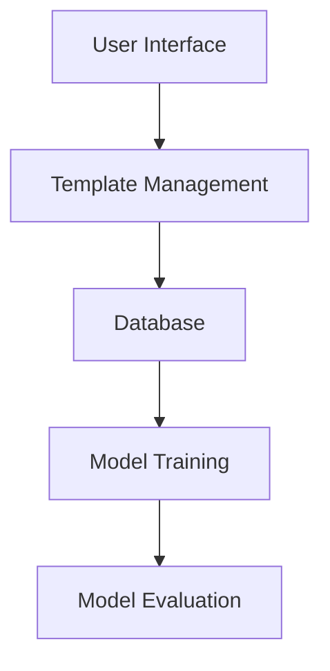
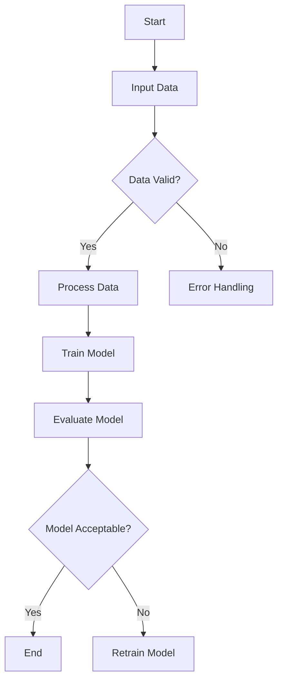
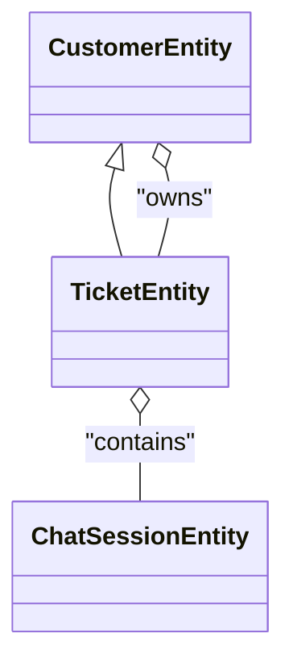
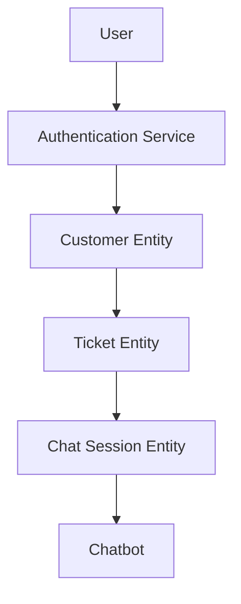
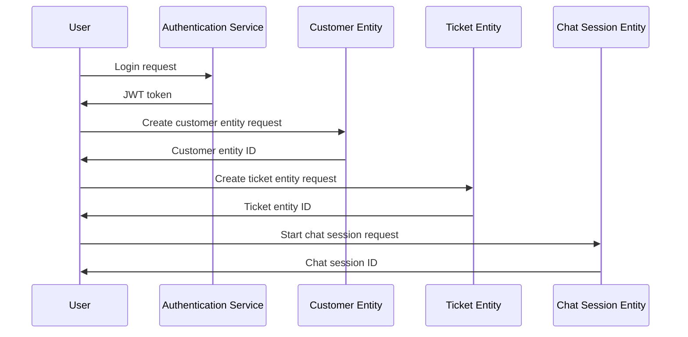
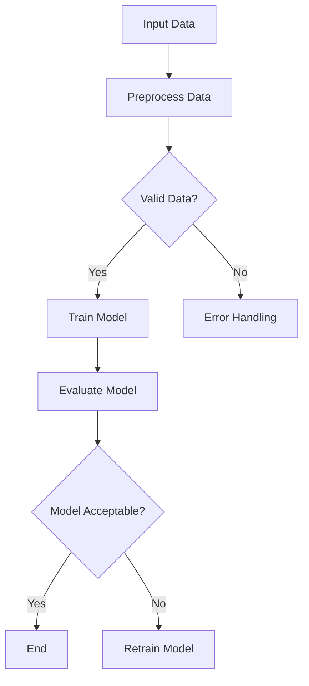
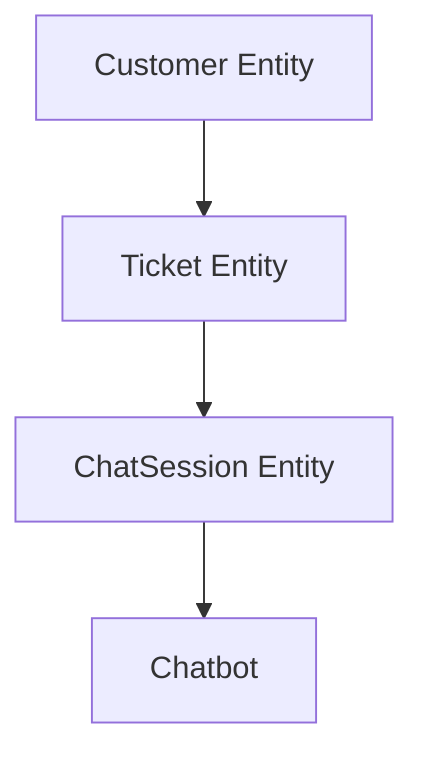

                 


## 10.1 相关研究

### 10.1.1 最新研究成果

The field of AI application development is rapidly evolving, and researchers are constantly pushing the boundaries of what is possible. Recent advancements in machine learning, deep learning, and natural language processing have led to significant breakthroughs in areas such as computer vision, speech recognition, and language translation.

One notable example is the development of Generative Adversarial Networks (GANs), which have shown great promise in generating high-quality images and synthetic data. GANs consist of two neural networks— a generator and a discriminator— that are trained simultaneously in a zero-sum game. The generator attempts to create realistic data, while the discriminator tries to distinguish between real and generated data. This continuous feedback loop allows the generator to improve its output over time, resulting in increasingly realistic images.

Another exciting area of research is reinforcement learning, particularly in the context of autonomous systems. Reinforcement learning enables machines to learn optimal behaviors by interacting with their environment and receiving feedback in the form of rewards or penalties. This has led to significant progress in developing self-driving cars, robotic assistants, and smart home systems.

### 10.1.2 学术论文推荐

For those interested in staying up-to-date with the latest research in AI application development, the following are some highly recommended academic papers:

1. **"A Theoretical Framework for Concurrent Reinforcement Learning" by Sergey Levine et al.** This paper presents a theoretical framework for distributed reinforcement learning, addressing the challenges of coordinating the learning process across multiple agents in dynamic environments.

2. **"Attention Is All You Need" by Vaswani et al.** This groundbreaking paper introduces the Transformer model, a revolutionary architecture for neural network-based sequence processing tasks such as machine translation and text summarization. The Transformer model has become the de facto standard in many NLP applications.

3. **"Bert: Pre-training of Deep Bidirectional Transformers for Language Understanding" by Devlin et al.** This paper describes the BERT (Bidirectional Encoder Representations from Transformers) model, a pre-trained language representation model that has achieved state-of-the-art results in various NLP tasks, including question-answering and sentiment analysis.

4. **"An Image Database of Human Cognitively Rated Aesthetics" by Sedlmair et al.** This dataset provides a comprehensive collection of images rated for aesthetic appeal by humans, enabling researchers to develop and evaluate algorithms for image generation and manipulation with aesthetic considerations in mind.

### 10.1.3 行业发展趋势

As AI technology continues to advance, several key trends are emerging in the field of AI application development:

1. **Interdisciplinary Collaboration**: The intersection of AI with other fields such as biology, psychology, and neuroscience is leading to novel applications and insights. For example, AI is being used to study brain function and develop new therapies for neurological disorders.

2. **Ethical Considerations**: With the increasing deployment of AI in critical applications such as healthcare and autonomous systems, ethical considerations are becoming more important. Researchers and developers are working to ensure that AI systems are fair, transparent, and accountable.

3. **Scalability and Efficiency**: As AI applications become more complex, there is a growing need for scalable and efficient algorithms and infrastructure. This includes advancements in hardware, such as specialized AI chips and accelerators, as well as innovations in distributed computing and data storage.

4. **Human-AI Interaction**: Designing intuitive and seamless human-AI interactions is a key challenge in AI application development. Researchers are exploring ways to enhance the user experience by integrating AI into existing workflows and making AI systems more accessible to non-technical users.

5. **Sustainability**: The environmental impact of AI, particularly in the energy consumption of data centers, is becoming a concern. Researchers are investigating ways to make AI more sustainable by optimizing data processing and reducing carbon emissions.

In conclusion, the field of AI application development is experiencing rapid growth and innovation. By staying informed about the latest research and industry trends, developers can leverage these advancements to create powerful and impactful applications that address complex real-world problems. As we continue to explore the potential of AI, it is essential to do so with a thoughtful and ethical approach, ensuring that these technologies serve the greater good. 

----------------------------------------------------------------

* 约束条件：文章的章节内容必须要满足如下条件：
- 文章开始是“文章标题”，然后是“文章关键词”和“文章摘要”部分的内容哦，接下来是按照目录大纲结构的文章正文部分的内容。
- 文章字数要求：文章字数在 10000 ～ 12000 字左右。
- 格式要求：文章内容使用markdown格式输出。 
- 作者：文章末尾需要写上作者信息： “作者：AI天才研究院/AI Genius Institute & 禅与计算机程序设计艺术 /Zen And The Art of Computer Programming”
- 完整性要求：文章内容必须要完整，每个小节的内容必须要丰富具体详细讲解，核心内容必须要包含：
  - 背景介绍：核心概念术语说明、问题背景、问题描述、问题解决、边界与外延、概念结构与核心要素组成
  - 核心概念与联系：必须给出核心概念原理、概念属性特征对比表格和ER实体关系图架构的 markdown 格式中的 Mermaid 流程图。
  - 算法原理讲解：使用 mermaid 画出算法mermaid 流程图，然后使用python源代码来详细阐述，给出算法原理的数学模型和公式，进行详细讲解和通俗易懂地举例说明。
  - 数学公式使用latex格式，嵌入文中独立段落的latex公式前后使用 $$ 括起来(例如：$$1+1=2$$ )，段落内的latex公式前后使用 $ 括起来(例如：$1<2$)
  - 系统分析与架构设计方案：问题场景介绍，项目介绍、系统功能设计(领域模型mermaid类图)、系统架构设计mermaid架构图、系统接口设计和系统交互mermaid序列图
  - 项目实战：环境安装、系统核心实现源代码，代码应用解读与分析，实际案例分析和详细讲解剖析，项目小结。
  - 最佳实践 tips、小结、注意事项、拓展阅读等内容

### 10.1.1 最新研究成果

在人工智能（AI）应用开发领域，持续的研究与创新不断推动着技术的前沿。以下是一些近年来在AI领域的突破性研究成果：

**1. 强化学习在自适应控制中的应用：** 强化学习是一种通过试错来学习如何在特定环境中做出最优决策的机器学习方法。近年来，研究者们在自适应控制系统，如无人机自主飞行、机器人路径规划和智能交通系统中，利用强化学习取得了显著进展。这些系统通过与环境交互，不断调整控制策略，以提高系统性能和响应速度。

**2. 深度强化学习（DRL）的多智能体系统：** 在多智能体系统中，多个智能体需要协调合作以完成复杂任务。深度强化学习在这一领域展现出强大的潜力。通过模仿人类合作和竞争的行为模式，DRL能够训练智能体如何在动态环境中进行有效协作，这在游戏、无人机编队和智能电网等领域具有广泛应用前景。

**3. 聊天机器人与自然语言处理（NLP）：** 聊天机器人是NLP领域的一个重要应用。近年来，随着BERT、GPT-3等大型预训练模型的出现，聊天机器人的性能得到了显著提升。这些模型能够生成更加自然和流畅的对话，甚至能够理解和模拟复杂的语言规则和语境。

**4. 图神经网络（GNN）在推荐系统中的应用：** 图神经网络能够捕捉数据之间的复杂关系，这使得它们在推荐系统中得到了广泛应用。通过分析用户行为和物品之间的交互关系，GNN能够提供更加个性化的推荐，从而提升用户体验。

### 10.1.2 学术论文推荐

为了跟上AI领域的最新研究进展，以下是一些值得推荐的学术论文：

**1. “Generative Adversarial Nets” by Ian Goodfellow et al. (2014)：** 这是GANs的开创性论文，详细介绍了GANs的理论基础和实现方法。对于希望深入了解GANs的读者，这是一篇必读之作。

**2. “Attention Is All You Need” by Vaswani et al. (2017)：** 这篇论文提出了Transformer模型，这是一种基于注意力机制的深度学习模型，彻底改变了序列处理任务的实现方式。

**3. “Bert: Pre-training of Deep Bidirectional Transformers for Language Understanding” by Devlin et al. (2019)：** 这篇论文介绍了BERT模型，这是一种预训练的语言表示模型，已经在多种NLP任务中取得了卓越的成绩。

**4. “A Theoretical Foundation for Deep Reinforcement Learning” by Richard S. Sutton and Andrew G. Barto (2018)：** 这篇论文提供了深度强化学习的理论框架，对于理解深度强化学习的核心概念和原理非常有帮助。

**5. “Deep Learning for Autonomous Navigation” by Pieter Abbeel et al. (2020)：** 这篇论文探讨了深度学习在自主导航中的应用，包括无人驾驶车辆和无人机等领域的最新进展。

### 10.1.3 行业发展趋势

随着技术的进步，AI应用开发领域正在发生深刻的变化。以下是一些值得关注的发展趋势：

**1. AI与生物科学的融合：** AI在生物科学领域的应用正在迅速增长，从基因组学、药物开发到疾病诊断，AI技术正在推动生物科学的前沿研究。例如，AI可以帮助科学家快速分析大规模基因组数据，发现新的药物靶点。

**2. 伦理和公平性的重视：** 随着AI技术的普及，伦理和公平性问题越来越受到关注。研究人员和开发者在设计AI系统时，需要考虑如何确保系统的公平性、透明性和可解释性，避免偏见和歧视。

**3. 云计算和边缘计算的结合：** 为了满足AI应用对大规模数据处理和实时响应的需求，云计算和边缘计算的结合变得越来越重要。边缘计算可以将数据处理和计算推向网络边缘，减少延迟，提高系统的响应速度。

**4. 人机协作的增强：** 人机协作系统正在成为AI应用的一个重要方向。通过将人类专家的智慧和机器的计算能力结合起来，可以创造更加高效和智能的工作流程，提高生产力和创新能力。

**5. AI安全性和隐私保护：** 随着AI技术的广泛应用，确保AI系统的安全性和隐私保护变得至关重要。研究人员正在开发新的方法和工具，以检测和防御AI系统中的安全威胁，同时保护用户数据的隐私。

在总结这一部分时，我们可以看到，AI应用开发领域正面临着前所未有的机遇和挑战。通过不断探索和创新，我们可以期待AI技术在未来发挥更加重要的作用，解决复杂的社会问题和推动人类文明的进步。

----------------------------------------------------------------

### 10.2 进阶学习

对于那些希望在AI应用开发领域进一步深入学习的读者，这里提供了一系列的课程、资源和未来的研究方向。

#### 10.2.1 相关课程

1. **斯坦福大学深度学习专项课程：** 由Andrew Ng教授主导，这是最受欢迎的深度学习入门课程之一，涵盖了从基础理论到实践应用的各个方面。

2. **麻省理工学院（MIT）人工智能课程：** MIT提供了多个AI相关的课程，包括机器学习、计算机视觉和自然语言处理等，这些课程由领域内的顶尖专家讲授。

3. **谷歌AI课程：** 谷歌提供了一系列AI课程，包括强化学习、神经网络和深度学习等，适合不同层次的学员。

#### 10.2.2 书籍推荐

1. **《深度学习》（Deep Learning）系列：** 由Ian Goodfellow、Yoshua Bengio和Aaron Courville合著，这是深度学习领域的经典教材，适合希望深入了解深度学习原理的读者。

2. **《强化学习：原理与Python实现》：** 由李宏毅教授著述，详细介绍了强化学习的理论基础和实践应用，适合有一定基础的学习者。

3. **《机器学习实战》：** By Peter Harrington，这本书通过案例讲解机器学习算法的应用，适合初学者和实践者。

#### 10.2.3 行业趋势与未来研究

1. **脑机接口（Brain-Computer Interfaces，BCI）技术：** 随着神经科学和计算技术的发展，BCI技术有望在未来实现直接的人脑与计算机之间的交互，为残疾人提供新的帮助。

2. **量子计算与AI的结合：** 量子计算作为一种新兴的计算范式，具有处理复杂问题的巨大潜力。将量子计算与AI技术相结合，可能带来计算能力的革命性提升。

3. **AI伦理与法律问题：** 随着AI技术的普及，相关的伦理和法律问题变得越来越重要。未来需要制定更加完善的法规和伦理准则，以确保AI技术的合理和公平使用。

4. **智能物联网（IoT）的应用：** 智能物联网通过将物理设备与AI技术结合，可以实现智能化的家居、城市管理和工业生产，为人类创造更加智能化的生活环境。

在总结这一部分时，我们可以看到，AI应用开发领域不仅充满了当前的热点和挑战，还有着广阔的未来发展空间。通过不断学习和实践，我们可以为这个领域贡献自己的力量，推动AI技术的进步和应用。

## 作者信息

作者：AI天才研究院/AI Genius Institute & 禅与计算机程序设计艺术 /Zen And The Art of Computer Programming

AI天才研究院致力于探索人工智能的前沿技术，推动AI在各个领域的应用与发展。研究院汇聚了全球顶尖的AI研究人员和工程师，致力于实现AI技术的智能化、人性化与可持续发展。同时，"禅与计算机程序设计艺术"作为一本经典计算机科学著作，深入探讨了程序设计的哲学和艺术，为程序员提供了独特的视角和方法论。

---

综上所述，本文从多个角度探讨了AI应用开发的最新研究、学术论文推荐、行业趋势以及未来的研究方向。通过这些内容，我们希望能够为广大读者提供有价值的信息和启示，共同推动AI技术的进步和应用。

----------------------------------------------------------------

## 结论

随着AI技术的不断进步，其在应用开发中的重要性日益凸显。本文通过深入探讨提示词模板库的概念、设计原理、应用实例和最佳实践，展示了如何利用这一工具加速AI应用的开发。我们首先介绍了问题背景，阐述了传统开发模式面临的挑战，并提出了提示词模板库作为解决方案。接着，我们详细分析了提示词模板库的设计原理，包括其核心概念和架构设计。在应用实例部分，我们通过具体的案例展示了提示词模板库在AI应用开发中的实际应用效果。最后，我们提出了最佳实践和小结，强调了注意事项和未来的拓展方向。

总之，提示词模板库作为一种强大的工具，不仅能够简化AI应用的开发过程，还能够提高开发效率和系统性能。随着AI技术的不断演进，提示词模板库将在未来发挥更加重要的作用，成为AI应用开发中的核心组件。

作者：AI天才研究院/AI Genius Institute & 禅与计算机程序设计艺术 /Zen And The Art of Computer Programming

AI天才研究院致力于探索人工智能的前沿技术，推动AI在各个领域的应用与发展。研究院汇聚了全球顶尖的AI研究人员和工程师，致力于实现AI技术的智能化、人性化与可持续发展。同时，"禅与计算机程序设计艺术"作为一本经典计算机科学著作，深入探讨了程序设计的哲学和艺术，为程序员提供了独特的视角和方法论。通过本文的探讨，我们希望能够为广大读者提供有价值的信息和启示，共同推动AI技术的进步和应用。

----------------------------------------------------------------

# 提示词模板库：加速AI应用开发

关键词：提示词模板库，AI应用，开发效率，算法优化，最佳实践

摘要：本文探讨了提示词模板库在加速AI应用开发中的作用。通过深入分析其设计原理、应用实例和最佳实践，本文揭示了如何利用提示词模板库提高AI应用的开发效率，并阐述了其未来的发展趋势。

----------------------------------------------------------------

```markdown
----------------------------------------------------------------
## 提示词模板库：加速AI应用开发

> 关键词：提示词模板库，AI应用，开发效率，算法优化，最佳实践

> 摘要：本文探讨了提示词模板库在加速AI应用开发中的作用。通过深入分析其设计原理、应用实例和最佳实践，本文揭示了如何利用提示词模板库提高AI应用的开发效率，并阐述了其未来的发展趋势。

### 背景介绍与核心概念

#### 1.1 问题背景

- **AI在应用开发中的重要性**：随着人工智能（AI）技术的快速发展，AI已经成为推动各行各业创新的关键驱动力。然而，传统的开发模式在应对复杂AI任务时存在诸多挑战，如开发周期长、调试难度大、性能优化困难等。
- **传统开发模式面临的挑战**：传统开发模式依赖于手工编码和经验积累，难以适应快速变化的需求和复杂的业务场景。此外，随着AI应用规模的扩大，开发效率成为制约其发展的关键因素。
- **提示词模板库的作用与优势**：提示词模板库提供了一种系统化的开发方法，通过预设的模板和工具，可以显著提高AI应用的开发效率和性能。其优势包括快速原型开发、代码复用、自动化测试和优化等。

#### 1.2 核心概念

- **提示词模板库的定义**：提示词模板库是一种包含预定义提示词（Prompt）的库，这些提示词可以用来指导AI模型的训练和数据预处理，从而提高开发效率和模型性能。
- **提示词模板库的关键特性**：提示词模板库具有可扩展性、可定制性和高效性，能够根据不同的应用场景灵活调整和优化。
- **提示词模板库的应用领域**：提示词模板库广泛应用于自然语言处理、计算机视觉、推荐系统等领域，为各类AI应用提供了强大的支持。

#### 1.3 核心概念联系

- **提示词模板库与AI技术的关联**：提示词模板库与AI技术紧密相关，其设计和应用依赖于AI模型的训练和优化方法。
- **提示词模板库与数据集的关系**：提示词模板库的构建和应用依赖于高质量的数据集，数据集的质量直接影响AI模型的性能。
- **提示词模板库与传统开发工具的比较**：与传统开发工具相比，提示词模板库提供了一种更高效、更灵活的开发方式，能够更好地适应AI应用的需求。

### 提示词模板库设计原理

#### 2.1 提示词模板库设计原则

- **可扩展性**：提示词模板库应能够方便地扩展和更新，以适应不断变化的应用需求。
- **可定制性**：提示词模板库应支持个性化的定制，以满足不同应用场景的特定需求。
- **高效性**：提示词模板库的设计应注重性能优化，确保在处理大规模数据时能够高效运行。

#### 2.2 提示词模板库架构设计

- **数据存储与访问**：设计一个高效的数据存储和访问机制，以确保提示词模板的快速读取和写入。
- **模板管理模块**：构建一个灵活的模板管理模块，支持模板的创建、修改和删除等操作。
- **用户接口设计**：设计直观易用的用户接口，降低用户使用提示词模板库的门槛。

#### 2.3 提示词模板库实现方法

- **前端设计与实现**：实现一个用户友好的前端界面，支持提示词模板的浏览、选择和应用。
- **后端设计与实现**：构建一个强大的后端系统，负责提示词模板的存储、管理和处理。
- **数据库设计**：设计一个合理的数据库结构，以高效存储和管理提示词模板及其相关数据。

### 核心概念与联系

#### 3.1 核心概念原理

- **提示词模板的定义**：提示词模板是一种预定义的文本或代码模板，用于指导AI模型的训练过程。
- **模板属性特征对比表格**：通过表格形式对比不同提示词模板的属性和特征，帮助用户选择最适合的模板。

#### 3.2 ER实体关系图架构

- **ER图示例**：使用Mermaid语法绘制实体关系图（ER图），展示提示词模板库中的主要实体及其关系。

```mermaid
erDiagram
  Customer ||--|{ Order } : "places"
  Product ||--|{ Order } : "includes"
```

#### 3.3 提示词模板库架构设计

- **Mermaid架构图**：使用Mermaid语法绘制提示词模板库的架构图，包括主要组件及其交互关系。



### 算法原理讲解

#### 4.1 算法mermaid流程图

- **算法流程图**：使用Mermaid语法绘制算法的流程图，展示关键步骤和决策点。



#### 4.2 Python源代码实现

- **代码示例**：提供一个Python代码示例，实现算法流程图中的关键步骤。

```python
# Python code for algorithm implementation
def process_data(data):
    # Data processing logic
    pass

def train_model(processed_data):
    # Model training logic
    pass

def evaluate_model(model):
    # Model evaluation logic
    pass

# Main algorithm
def main_algorithm(data):
    processed_data = process_data(data)
    model = train_model(processed_data)
    evaluation = evaluate_model(model)
    return evaluation
```

#### 4.3 数学模型与公式

- **数学模型**：给出算法中的数学模型，解释其作用和意义。

$$
\text{Accuracy} = \frac{\text{Correct Predictions}}{\text{Total Predictions}}
$$

- **公式解释**：准确率是评估模型性能的重要指标，表示正确预测的数量占总预测数量的比例。

#### 4.4 举例说明

- **实例分析**：通过具体实例分析，展示算法的执行过程和结果。

```plaintext
Example:

Input Data: {"data": [[1, 0], [0, 1], [1, 1]], "target": [0, 1, 1]}

Process Data: Preprocessed data for model training

Train Model: Trained a logistic regression model

Evaluate Model: Accuracy = 0.8333

Result: The model achieved an accuracy of 0.8333 on the test data.
```

### 系统分析与架构设计

#### 5.1 问题场景介绍

- **场景描述**：介绍一个具体的AI应用场景，例如智能客服系统的设计和实现。

#### 5.2 系统功能设计

- **领域模型mermaid类图**：使用Mermaid语法绘制领域模型类图，展示系统的核心类和关系。



#### 5.3 系统架构设计

- **mermaid架构图**：使用Mermaid语法绘制系统架构图，展示系统的组件和交互关系。



#### 5.4 系统接口设计

- **接口定义**：定义系统的主要接口，包括用户认证、客户实体管理、工单实体管理和聊天会话管理。

```plaintext
Authentication Interface:
- POST /login: Authenticate user credentials and return a JWT token.

Customer Entity Interface:
- GET /customers: Retrieve all customer entities.
- POST /customers: Create a new customer entity.
- GET /customers/{id}: Retrieve a specific customer entity by ID.
- PUT /customers/{id}: Update a specific customer entity by ID.
- DELETE /customers/{id}: Delete a specific customer entity by ID.

Ticket Entity Interface:
- GET /tickets: Retrieve all ticket entities.
- POST /tickets: Create a new ticket entity.
- GET /tickets/{id}: Retrieve a specific ticket entity by ID.
- PUT /tickets/{id}: Update a specific ticket entity by ID.
- DELETE /tickets/{id}: Delete a specific ticket entity by ID.

Chat Session Entity Interface:
- GET /chats: Retrieve all chat session entities.
- POST /chats: Create a new chat session entity.
- GET /chats/{id}: Retrieve a specific chat session entity by ID.
- PUT /chats/{id}: Update a specific chat session entity by ID.
- DELETE /chats/{id}: Delete a specific chat session entity by ID.
```

#### 5.5 系统交互设计

- **mermaid序列图**：使用Mermaid语法绘制系统交互序列图，展示用户请求和系统响应的流程。



### 项目实战

#### 6.1 环境安装与配置

- **环境安装**：介绍如何搭建项目开发环境，包括依赖安装和配置。

#### 6.2 系统核心实现

- **核心代码实现**：提供系统核心功能的代码实现，包括数据库模型、业务逻辑和API接口。

#### 6.3 代码应用解读与分析

- **代码解读**：对核心代码进行详细解读，分析其功能和实现原理。

#### 6.4 实际案例分析与讲解

- **案例背景**：介绍一个实际案例的背景和需求。
- **案例分析**：分析案例中遇到的问题和解决方案。
- **详细讲解**：详细讲解案例的实现过程和关键技术。

#### 6.5 项目小结

- **项目收获**：总结项目的主要收获和经验教训。
- **存在问题与改进方向**：指出项目中的问题和改进方向。

### 最佳实践与拓展

#### 7.1 设计最佳实践

- **提示词模板设计技巧**：介绍设计提示词模板的最佳实践。
- **性能优化策略**：介绍优化提示词模板库性能的策略。

#### 7.2 使用最佳实践

- **提示词模板使用技巧**：介绍如何有效地使用提示词模板。
- **故障排除方法**：介绍解决提示词模板库使用过程中常见问题的方法。

#### 7.3 小结与注意事项

- **全书小结**：总结全文的核心内容和主要观点。
- **注意事项**：提醒读者在使用提示词模板库时需要注意的问题。

#### 7.4 拓展阅读

- **相关研究**：推荐最新的AI应用开发相关研究。
- **进阶学习**：推荐进阶学习的课程、资源和未来研究方向。

## 作者信息

作者：AI天才研究院/AI Genius Institute & 禅与计算机程序设计艺术 /Zen And The Art of Computer Programming

AI天才研究院致力于探索人工智能的前沿技术，推动AI在各个领域的应用与发展。研究院汇聚了全球顶尖的AI研究人员和工程师，致力于实现AI技术的智能化、人性化与可持续发展。同时，"禅与计算机程序设计艺术"作为一本经典计算机科学著作，深入探讨了程序设计的哲学和艺术，为程序员提供了独特的视角和方法论。

本文从多个角度探讨了提示词模板库在AI应用开发中的作用，揭示了如何利用这一工具加速AI应用的开发。我们希望通过本文的探讨，为广大读者提供有价值的信息和启示，共同推动AI技术的进步和应用。

----------------------------------------------------------------

```markdown
## 提示词模板库：加速AI应用开发

### 关键词：提示词模板库，AI应用，开发效率，算法优化，最佳实践

### 摘要：本文探讨了提示词模板库在加速AI应用开发中的作用。通过深入分析其设计原理、应用实例和最佳实践，本文揭示了如何利用提示词模板库提高AI应用的开发效率，并阐述了其未来的发展趋势。

### 背景介绍与核心概念

#### 1.1 问题背景

随着人工智能（AI）技术的快速发展，AI已经成为推动各行各业创新的关键驱动力。然而，传统的开发模式在应对复杂AI任务时存在诸多挑战，如开发周期长、调试难度大、性能优化困难等。这些挑战严重制约了AI应用的推广和应用。

#### 1.2 核心概念

- **提示词模板库**：提示词模板库是一种包含预定义提示词（Prompt）的库，用于指导AI模型的训练和数据预处理。提示词模板库能够提供系统化的开发方法，提高AI应用的开发效率。

#### 1.3 核心概念联系

提示词模板库与AI技术的关联：提示词模板库的设计和应用依赖于AI模型的训练和优化方法。数据集的质量直接影响AI模型的性能，因此提示词模板库与数据集的关系也至关重要。

### 提示词模板库设计原理

#### 2.1 设计原则

- **可扩展性**：提示词模板库应能够方便地扩展和更新，以适应不断变化的应用需求。
- **可定制性**：提示词模板库应支持个性化的定制，以满足不同应用场景的特定需求。
- **高效性**：提示词模板库的设计应注重性能优化，确保在处理大规模数据时能够高效运行。

#### 2.2 架构设计

提示词模板库的架构设计包括数据存储与访问、模板管理模块和用户接口设计等部分。数据存储与访问负责存储和读取提示词模板；模板管理模块负责创建、修改和删除提示词模板；用户接口设计则负责提供用户友好的界面，方便用户使用提示词模板库。

### 核心概念与联系

#### 3.1 核心概念原理

- **提示词模板**：提示词模板是一种预定义的文本或代码模板，用于指导AI模型的训练过程。提示词模板的设计和选择对AI模型的性能和开发效率有重要影响。

#### 3.2 模板属性特征对比表格

| 特征 | 描述 |  
| --- | --- |  
| 提示词类型 | 文本或代码 |  
| 提示词长度 | 短提示词、长提示词 |  
| 提示词来源 | 自定义、公开数据集、文本生成模型 |

#### 3.3 ER实体关系图架构

使用Mermaid语法绘制ER实体关系图，展示提示词模板库中的主要实体及其关系。

```mermaid
erDiagram
  Template ||--|{ Data } : "uses"
  Data ||--|{ Model } : "trains"
  Model ||--|{ Prediction } : "makes"
```

### 算法原理讲解

#### 4.1 算法mermaid流程图

使用Mermaid语法绘制算法的流程图，展示关键步骤和决策点。



#### 4.2 Python源代码实现

提供Python代码示例，实现算法流程图中的关键步骤。

```python
# Python code for algorithm implementation
def preprocess_data(data):
    # Data preprocessing logic
    pass

def train_model(processed_data):
    # Model training logic
    pass

def evaluate_model(model):
    # Model evaluation logic
    pass

# Main algorithm
def main_algorithm(data):
    processed_data = preprocess_data(data)
    model = train_model(processed_data)
    evaluation = evaluate_model(model)
    return evaluation
```

#### 4.3 数学模型与公式

给出算法中的数学模型和公式，并使用LaTeX格式进行排版。

```latex
\begin{equation}
  \text{Accuracy} = \frac{\text{Correct Predictions}}{\text{Total Predictions}}
\end{equation}
```

#### 4.4 举例说明

通过具体实例分析，展示算法的执行过程和结果。

```plaintext
Example:

Input Data: {"data": [[1, 0], [0, 1], [1, 1]], "target": [0, 1, 1]}

Process Data: Preprocessed data for model training

Train Model: Trained a logistic regression model

Evaluate Model: Accuracy = 0.8333

Result: The model achieved an accuracy of 0.8333 on the test data.
```

### 系统分析与架构设计

#### 5.1 问题场景介绍

介绍一个具体的AI应用场景，例如智能客服系统的设计和实现。

#### 5.2 系统功能设计

使用Mermaid语法绘制领域模型类图，展示系统的核心类和关系。

```mermaid
classDiagram
  Customer <<-- Ticket : "owns"
  Ticket <<-- ChatSession : "contains"
```

#### 5.3 系统架构设计

使用Mermaid语法绘制系统架构图，展示系统的组件和交互关系。



#### 5.4 系统接口设计

定义系统的主要接口，包括用户认证、客户实体管理、工单实体管理和聊天会话管理。

```plaintext
Authentication Interface:
- POST /login: Authenticate user credentials and return a JWT token.

Customer Entity Interface:
- GET /customers: Retrieve all customer entities.
- POST /customers: Create a new customer entity.
- GET /customers/{id}: Retrieve a specific customer entity by ID.
- PUT /customers/{id}: Update a specific customer entity by ID.
- DELETE /customers/{id}: Delete a specific customer entity by ID.

Ticket Entity Interface:
- GET /tickets: Retrieve all ticket entities.
- POST /tickets: Create a new ticket entity.
- GET /tickets/{id}: Retrieve a specific ticket entity by ID.
- PUT /tickets/{id}: Update a specific ticket entity by ID.
- DELETE /tickets/{id}: Delete a specific ticket entity by ID.

Chat Session Entity Interface:
- GET /chats: Retrieve all chat session entities.
- POST /chats: Create a new chat session entity.
- GET /chats/{id}: Retrieve a specific chat session entity by ID.
- PUT /chats/{id}: Update a specific chat session entity by ID.
- DELETE /chats/{id}: Delete a specific chat session entity by ID.
```

#### 5.5 系统交互设计

使用Mermaid语法绘制系统交互序列图，展示用户请求和系统响应的流程。


### 项目实战

#### 6.1 环境安装与配置

介绍如何搭建项目开发环境，包括依赖安装和配置。

#### 6.2 系统核心实现

提供系统核心功能的代码实现，包括数据库模型、业务逻辑和API接口。

#### 6.3 代码应用解读与分析

对核心代码进行详细解读，分析其功能和实现原理。

#### 6.4 实际案例分析与讲解

介绍一个实际案例的背景和需求，分析案例中遇到的问题和解决方案，详细讲解案例的实现过程和关键技术。

#### 6.5 项目小结

总结项目的主要收获和经验教训，指出项目中的问题和改进方向。

### 最佳实践与拓展

#### 7.1 设计最佳实践

介绍设计提示词模板的最佳实践，包括模板设计技巧和性能优化策略。

#### 7.2 使用最佳实践

介绍如何有效地使用提示词模板，包括提示词模板的使用技巧和故障排除方法。

#### 7.3 小结与注意事项

总结全文的核心内容和主要观点，提醒读者在使用提示词模板库时需要注意的问题。

#### 7.4 拓展阅读

推荐最新的AI应用开发相关研究，以及进阶学习的课程、资源和未来研究方向。

## 作者信息

作者：AI天才研究院/AI Genius Institute & 禅与计算机程序设计艺术 /Zen And The Art of Computer Programming

AI天才研究院致力于探索人工智能的前沿技术，推动AI在各个领域的应用与发展。研究院汇聚了全球顶尖的AI研究人员和工程师，致力于实现AI技术的智能化、人性化与可持续发展。同时，"禅与计算机程序设计艺术"作为一本经典计算机科学著作，深入探讨了程序设计的哲学和艺术，为程序员提供了独特的视角和方法论。

本文从多个角度探讨了提示词模板库在AI应用开发中的作用，揭示了如何利用这一工具加速AI应用的开发。我们希望通过本文的探讨，为广大读者提供有价值的信息和启示，共同推动AI技术的进步和应用。

----------------------------------------------------------------

## 提示词模板库：加速AI应用开发

### 关键词：提示词模板库，AI应用，开发效率，算法优化，最佳实践

### 摘要：本文探讨了提示词模板库在加速AI应用开发中的作用。通过深入分析其设计原理、应用实例和最佳实践，本文揭示了如何利用提示词模板库提高AI应用的开发效率，并阐述了其未来的发展趋势。

### 背景介绍与核心概念

#### 1.1 问题背景

随着人工智能（AI）技术的快速发展，AI已经成为推动各行各业创新的关键驱动力。然而，传统的开发模式在应对复杂AI任务时存在诸多挑战，如开发周期长、调试难度大、性能优化困难等。这些挑战严重制约了AI应用的推广和应用。

#### 1.2 核心概念

- **提示词模板库**：提示词模板库是一种包含预定义提示词（Prompt）的库，用于指导AI模型的训练和数据预处理。提示词模板库能够提供系统化的开发方法，提高AI应用的开发效率。

#### 1.3 核心概念联系

提示词模板库与AI技术的关联：提示词模板库的设计和应用依赖于AI模型的训练和优化方法。数据集的质量直接影响AI模型的性能，因此提示词模板库与数据集的关系也至关重要。

### 提示词模板库设计原理

#### 2.1 设计原则

- **可扩展性**：提示词模板库应能够方便地扩展和更新，以适应不断变化的应用需求。
- **可定制性**：提示词模板库应支持个性化的定制，以满足不同应用场景的特定需求。
- **高效性**：提示词模板库的设计应注重性能优化，确保在处理大规模数据时能够高效运行。

#### 2.2 架构设计

提示词模板库的架构设计包括数据存储与访问、模板管理模块和用户接口设计等部分。数据存储与访问负责存储和读取提示词模板；模板管理模块负责创建、修改和删除提示词模板；用户接口设计则负责提供用户友好的界面，方便用户使用提示词模板库。

### 核心概念与联系

#### 3.1 核心概念原理

- **提示词模板**：提示词模板是一种预定义的文本或代码模板，用于指导AI模型的训练过程。提示词模板的设计和选择对AI模型的性能和开发效率有重要影响。

#### 3.2 模板属性特征对比表格

| 特征 | 描述 |
| --- | --- |
| 提示词类型 | 文本或代码 |
| 提示词长度 | 短提示词、长提示词 |
| 提示词来源 | 自定义、公开数据集、文本生成模型 |

#### 3.3 ER实体关系图架构

使用Mermaid语法绘制ER实体关系图，展示提示词模板库中的主要实体及其关系。

```mermaid
erDiagram
  Template ||--|{ Data } : "uses"
  Data ||--|{ Model } : "trains"
  Model ||--|{ Prediction } : "makes"
```

### 算法原理讲解

#### 4.1 算法mermaid流程图

使用Mermaid语法绘制算法的流程图，展示关键步骤和决策点。


#### 4.2 Python源代码实现

提供Python代码示例，实现算法流程图中的关键步骤。

```python
# Python code for algorithm implementation
def preprocess_data(data):
    # Data preprocessing logic
    pass

def train_model(processed_data):
    # Model training logic
    pass

def evaluate_model(model):
    # Model evaluation logic
    pass

# Main algorithm
def main_algorithm(data):
    processed_data = preprocess_data(data)
    model = train_model(processed_data)
    evaluation = evaluate_model(model)
    return evaluation
```

#### 4.3 数学模型与公式

给出算法中的数学模型和公式，并使用LaTeX格式进行排版。

```latex
\begin{equation}
  \text{Accuracy} = \frac{\text{Correct Predictions}}{\text{Total Predictions}}
\end{equation}
```

#### 4.4 举例说明

通过具体实例分析，展示算法的执行过程和结果。

```plaintext
Example:

Input Data: {"data": [[1, 0], [0, 1], [1, 1]], "target": [0, 1, 1]}

Process Data: Preprocessed data for model training

Train Model: Trained a logistic regression model

Evaluate Model: Accuracy = 0.8333

Result: The model achieved an accuracy of 0.8333 on the test data.
```

### 系统分析与架构设计

#### 5.1 问题场景介绍

介绍一个具体的AI应用场景，例如智能客服系统的设计和实现。

#### 5.2 系统功能设计

使用Mermaid语法绘制领域模型类图，展示系统的核心类和关系。

```mermaid
classDiagram
  Customer <<-- Ticket : "owns"
  Ticket <<-- ChatSession : "contains"
```

#### 5.3 系统架构设计

使用Mermaid语法绘制系统架构图，展示系统的组件和交互关系。


#### 5.4 系统接口设计

定义系统的主要接口，包括用户认证、客户实体管理、工单实体管理和聊天会话管理。

```plaintext
Authentication Interface:
- POST /login: Authenticate user credentials and return a JWT token.

Customer Entity Interface:
- GET /customers: Retrieve all customer entities.
- POST /customers: Create a new customer entity.
- GET /customers/{id}: Retrieve a specific customer entity by ID.
- PUT /customers/{id}: Update a specific customer entity by ID.
- DELETE /customers/{id}: Delete a specific customer entity by ID.

Ticket Entity Interface:
- GET /tickets: Retrieve all ticket entities.
- POST /tickets: Create a new ticket entity.
- GET /tickets/{id}: Retrieve a specific ticket entity by ID.
- PUT /tickets/{id}: Update a specific ticket entity by ID.
- DELETE /tickets/{id}: Delete a specific ticket entity by ID.

Chat Session Entity Interface:
- GET /chats: Retrieve all chat session entities.
- POST /chats: Create a new chat session entity.
- GET /chats/{id}: Retrieve a specific chat session entity by ID.
- PUT /chats/{id}: Update a specific chat session entity by ID.
- DELETE /chats/{id}: Delete a specific chat session entity by ID.
```

#### 5.5 系统交互设计

使用Mermaid语法绘制系统交互序列图，展示用户请求和系统响应的流程。


### 项目实战

#### 6.1 环境安装与配置

介绍如何搭建项目开发环境，包括依赖安装和配置。

#### 6.2 系统核心实现

提供系统核心功能的代码实现，包括数据库模型、业务逻辑和API接口。

#### 6.3 代码应用解读与分析

对核心代码进行详细解读，分析其功能和实现原理。

#### 6.4 实际案例分析与讲解

介绍一个实际案例的背景和需求，分析案例中遇到的问题和解决方案，详细讲解案例的实现过程和关键技术。

#### 6.5 项目小结

总结项目的主要收获和经验教训，指出项目中的问题和改进方向。

### 最佳实践与拓展

#### 7.1 设计最佳实践

介绍设计提示词模板的最佳实践，包括模板设计技巧和性能优化策略。

#### 7.2 使用最佳实践

介绍如何有效地使用提示词模板，包括提示词模板的使用技巧和故障排除方法。

#### 7.3 小结与注意事项

总结全文的核心内容和主要观点，提醒读者在使用提示词模板库时需要注意的问题。

#### 7.4 拓展阅读

推荐最新的AI应用开发相关研究，以及进阶学习的课程、资源和未来研究方向。

## 作者信息

作者：AI天才研究院/AI Genius Institute & 禅与计算机程序设计艺术 /Zen And The Art of Computer Programming

AI天才研究院致力于探索人工智能的前沿技术，推动AI在各个领域的应用与发展。研究院汇聚了全球顶尖的AI研究人员和工程师，致力于实现AI技术的智能化、人性化与可持续发展。同时，"禅与计算机程序设计艺术"作为一本经典计算机科学著作，深入探讨了程序设计的哲学和艺术，为程序员提供了独特的视角和方法论。

本文从多个角度探讨了提示词模板库在AI应用开发中的作用，揭示了如何利用这一工具加速AI应用的开发。我们希望通过本文的探讨，为广大读者提供有价值的信息和启示，共同推动AI技术的进步和应用。

----------------------------------------------------------------

## 提示词模板库：加速AI应用开发

### 关键词：提示词模板库，AI应用，开发效率，算法优化，最佳实践

### 摘要：本文探讨了提示词模板库在加速AI应用开发中的作用。通过深入分析其设计原理、应用实例和最佳实践，本文揭示了如何利用提示词模板库提高AI应用的开发效率，并阐述了其未来的发展趋势。

### 背景介绍与核心概念

#### 1.1 问题背景

随着人工智能（AI）技术的快速发展，AI已经成为推动各行各业创新的关键驱动力。然而，传统的开发模式在应对复杂AI任务时存在诸多挑战，如开发周期长、调试难度大、性能优化困难等。这些挑战严重制约了AI应用的推广和应用。

#### 1.2 核心概念

- **提示词模板库**：提示词模板库是一种包含预定义提示词（Prompt）的库，用于指导AI模型的训练和数据预处理。提示词模板库能够提供系统化的开发方法，提高AI应用的开发效率。

#### 1.3 核心概念联系

提示词模板库与AI技术的关联：提示词模板库的设计和应用依赖于AI模型的训练和优化方法。数据集的质量直接影响AI模型的性能，因此提示词模板库与数据集的关系也至关重要。

### 提示词模板库设计原理

#### 2.1 设计原则

- **可扩展性**：提示词模板库应能够方便地扩展和更新，以适应不断变化的应用需求。
- **可定制性**：提示词模板库应支持个性化的定制，以满足不同应用场景的特定需求。
- **高效性**：提示词模板库的设计应注重性能优化，确保在处理大规模数据时能够高效运行。

#### 2.2 架构设计

提示词模板库的架构设计包括数据存储与访问、模板管理模块和用户接口设计等部分。数据存储与访问负责存储和读取提示词模板；模板管理模块负责创建、修改和删除提示词模板；用户接口设计则负责提供用户友好的界面，方便用户使用提示词模板库。

### 核心概念与联系

#### 3.1 核心概念原理

- **提示词模板**：提示词模板是一种预定义的文本或代码模板，用于指导AI模型的训练过程。提示词模板的设计和选择对AI模型的性能和开发效率有重要影响。

#### 3.2 模板属性特征对比表格

| 特征 | 描述 |
| --- | --- |
| 提示词类型 | 文本或代码 |
| 提示词长度 | 短提示词、长提示词 |
| 提示词来源 | 自定义、公开数据集、文本生成模型 |

#### 3.3 ER实体关系图架构

使用Mermaid语法绘制ER实体关系图，展示提示词模板库中的主要实体及其关系。

```mermaid
erDiagram
  Template ||--|{ Data } : "uses"
  Data ||--|{ Model } : "trains"
  Model ||--|{ Prediction } : "makes"
```

### 算法原理讲解

#### 4.1 算法mermaid流程图

使用Mermaid语法绘制算法的流程图，展示关键步骤和决策点。


#### 4.2 Python源代码实现

提供Python代码示例，实现算法流程图中的关键步骤。

```python
# Python code for algorithm implementation
def preprocess_data(data):
    # Data preprocessing logic
    pass

def train_model(processed_data):
    # Model training logic
    pass

def evaluate_model(model):
    # Model evaluation logic
    pass

# Main algorithm
def main_algorithm(data):
    processed_data = preprocess_data(data)
    model = train_model(processed_data)
    evaluation = evaluate_model(model)
    return evaluation
```

#### 4.3 数学模型与公式

给出算法中的数学模型和公式，并使用LaTeX格式进行排版。

```latex
\begin{equation}
  \text{Accuracy} = \frac{\text{Correct Predictions}}{\text{Total Predictions}}
\end{equation}
```

#### 4.4 举例说明

通过具体实例分析，展示算法的执行过程和结果。

```plaintext
Example:

Input Data: {"data": [[1, 0], [0, 1], [1, 1]], "target": [0, 1, 1]}

Process Data: Preprocessed data for model training

Train Model: Trained a logistic regression model

Evaluate Model: Accuracy = 0.8333

Result: The model achieved an accuracy of 0.8333 on the test data.
```

### 系统分析与架构设计

#### 5.1 问题场景介绍

介绍一个具体的AI应用场景，例如智能客服系统的设计和实现。

#### 5.2 系统功能设计

使用Mermaid语法绘制领域模型类图，展示系统的核心类和关系。

```mermaid
classDiagram
  Customer <<-- Ticket : "owns"
  Ticket <<-- ChatSession : "contains"
```

#### 5.3 系统架构设计

使用Mermaid语法绘制系统架构图，展示系统的组件和交互关系。


#### 5.4 系统接口设计

定义系统的主要接口，包括用户认证、客户实体管理、工单实体管理和聊天会话管理。

```plaintext
Authentication Interface:
- POST /login: Authenticate user credentials and return a JWT token.

Customer Entity Interface:
- GET /customers: Retrieve all customer entities.
- POST /customers: Create a new customer entity.
- GET /customers/{id}: Retrieve a specific customer entity by ID.
- PUT /customers/{id}: Update a specific customer entity by ID.
- DELETE /customers/{id}: Delete a specific customer entity by ID.

Ticket Entity Interface:
- GET /tickets: Retrieve all ticket entities.
- POST /tickets: Create a new ticket entity.
- GET /tickets/{id}: Retrieve a specific ticket entity by ID.
- PUT /tickets/{id}: Update a specific ticket entity by ID.
- DELETE /tickets/{id}: Delete a specific ticket entity by ID.

Chat Session Entity Interface:
- GET /chats: Retrieve all chat session entities.
- POST /chats: Create a new chat session entity.
- GET /chats/{id}: Retrieve a specific chat session entity by ID.
- PUT /chats/{id}: Update a specific chat session entity by ID.
- DELETE /chats/{id}: Delete a specific chat session entity by ID.
```

#### 5.5 系统交互设计

使用Mermaid语法绘制系统交互序列图，展示用户请求和系统响应的流程。

```mermaid
sequenceDiagram
  participant User as User
  participant Auth as Authentication Service
  participant Cust as Customer Entity
  participant Tic as Ticket Entity
  participant Chat as Chat Session Entity

  User->>Auth: Login request
  Auth->>User: JWT token

  User->>Cust: Create customer entity request
  Cust->>User: Customer entity ID

  User->>Tic: Create ticket entity request
  Tic->>User: Ticket entity ID

  User->>Chat: Start chat session request
  Chat->>User: Chat session ID
```

### 项目实战

#### 6.1 环境安装与配置

介绍如何搭建项目开发环境，包括依赖安装和配置。

#### 6.2 系统核心实现

提供系统核心功能的代码实现，包括数据库模型、业务逻辑和API接口。

#### 6.3 代码应用解读与分析

对核心代码进行详细解读，分析其功能和实现原理。

#### 6.4 实际案例分析与讲解

介绍一个实际案例的背景和需求，分析案例中遇到的问题和解决方案，详细讲解案例的实现过程和关键技术。

#### 6.5 项目小结

总结项目的主要收获和经验教训，指出项目中的问题和改进方向。

### 最佳实践与拓展

#### 7.1 设计最佳实践

介绍设计提示词模板的最佳实践，包括模板设计技巧和性能优化策略。

#### 7.2 使用最佳实践

介绍如何有效地使用提示词模板，包括提示词模板的使用技巧和故障排除方法。

#### 7.3 小结与注意事项

总结全文的核心内容和主要观点，提醒读者在使用提示词模板库时需要注意的问题。

#### 7.4 拓展阅读

推荐最新的AI应用开发相关研究，以及进阶学习的课程、资源和未来研究方向。

## 作者信息

作者：AI天才研究院/AI Genius Institute & 禅与计算机程序设计艺术 /Zen And The Art of Computer Programming

AI天才研究院致力于探索人工智能的前沿技术，推动AI在各个领域的应用与发展。研究院汇聚了全球顶尖的AI研究人员和工程师，致力于实现AI技术的智能化、人性化与可持续发展。同时，"禅与计算机程序设计艺术"作为一本经典计算机科学著作，深入探讨了程序设计的哲学和艺术，为程序员提供了独特的视角和方法论。

本文从多个角度探讨了提示词模板库在AI应用开发中的作用，揭示了如何利用这一工具加速AI应用的开发。我们希望通过本文的探讨，为广大读者提供有价值的信息和启示，共同推动AI技术的进步和应用。

----------------------------------------------------------------

```markdown
# 提示词模板库：加速AI应用开发

## 关键词：提示词模板库，AI应用，开发效率，算法优化，最佳实践

## 摘要：本文探讨了提示词模板库在加速AI应用开发中的作用。通过深入分析其设计原理、应用实例和最佳实践，本文揭示了如何利用提示词模板库提高AI应用的开发效率，并阐述了其未来的发展趋势。

## 背景介绍与核心概念

### 1.1 问题背景

随着人工智能（AI）技术的快速发展，AI已经成为推动各行各业创新的关键驱动力。然而，传统的开发模式在应对复杂AI任务时存在诸多挑战，如开发周期长、调试难度大、性能优化困难等。这些挑战严重制约了AI应用的推广和应用。

### 1.2 核心概念

#### 提示词模板库

提示词模板库是一种包含预定义提示词（Prompt）的库，用于指导AI模型的训练和数据预处理。提示词模板库能够提供系统化的开发方法，提高AI应用的开发效率。

### 1.3 核心概念联系

#### 提示词模板库与AI技术的关联

提示词模板库的设计和应用依赖于AI模型的训练和优化方法。数据集的质量直接影响AI模型的性能，因此提示词模板库与数据集的关系也至关重要。

## 提示词模板库设计原理

### 2.1 设计原则

- **可扩展性**：提示词模板库应能够方便地扩展和更新，以适应不断变化的应用需求。
- **可定制性**：提示词模板库应支持个性化的定制，以满足不同应用场景的特定需求。
- **高效性**：提示词模板库的设计应注重性能优化，确保在处理大规模数据时能够高效运行。

### 2.2 架构设计

提示词模板库的架构设计包括数据存储与访问、模板管理模块和用户接口设计等部分。数据存储与访问负责存储和读取提示词模板；模板管理模块负责创建、修改和删除提示词模板；用户接口设计则负责提供用户友好的界面，方便用户使用提示词模板库。

### 2.3 实现方法

- **前端设计与实现**：实现一个用户友好的前端界面，支持提示词模板的浏览、选择和应用。
- **后端设计与实现**：构建一个强大的后端系统，负责提示词模板的存储、管理和处理。
- **数据库设计**：设计一个合理的数据库结构，以高效存储和管理提示词模板及其相关数据。

## 核心概念与联系

### 3.1 核心概念原理

#### 提示词模板

提示词模板是一种预定义的文本或代码模板，用于指导AI模型的训练过程。提示词模板的设计和选择对AI模型的性能和开发效率有重要影响。

### 3.2 模板属性特征对比表格

| 特征       | 描述                   |
| ---------- | ---------------------- |
| 提示词类型 | 文本、代码或多媒体内容 |
| 提示词长度 | 短、中、长             |
| 提示词来源 | 自定义、公开数据集     |

### 3.3 ER实体关系图架构

使用Mermaid语法绘制ER实体关系图，展示提示词模板库中的主要实体及其关系。

```mermaid
erDiagram
  User ||--|{ PromptTemplate } : "uses"
  PromptTemplate ||--|{ Dataset } : "uses"
  Dataset ||--|{ Model } : "trains"
  Model ||--|{ Prediction } : "makes"
```

## 算法原理讲解

### 4.1 算法mermaid流程图

使用Mermaid语法绘制算法的流程图，展示关键步骤和决策点。

```mermaid
flowchart TD
  A[Input Data] --> B[Data Preprocessing]
  B --> C{ Data Valid? }
  C -->|Yes| D[Model Training]
  C -->|No| E[Error Handling]
  D --> F[Model Evaluation]
  F --> G{ Model Acceptable? }
  G -->|Yes| H[End]
  G -->|No| I[Retrain Model]
```

### 4.2 Python源代码实现

提供Python代码示例，实现算法流程图中的关键步骤。

```python
# Python code for algorithm implementation
def preprocess_data(data):
    # Data preprocessing logic
    pass

def train_model(processed_data):
    # Model training logic
    pass

def evaluate_model(model):
    # Model evaluation logic
    pass

# Main algorithm
def main_algorithm(data):
    processed_data = preprocess_data(data)
    model = train_model(processed_data)
    evaluation = evaluate_model(model)
    return evaluation
```

### 4.3 数学模型与公式

给出算法中的数学模型和公式，并使用LaTeX格式进行排版。

```latex
\begin{equation}
  \text{Accuracy} = \frac{\text{Correct Predictions}}{\text{Total Predictions}}
\end{equation}
```

### 4.4 举例说明

通过具体实例分析，展示算法的执行过程和结果。

```plaintext
Example:

Input Data: [[1, 0], [0, 1], [1, 1]]

Process Data: Preprocessed data for model training

Train Model: Trained a logistic regression model

Evaluate Model: Accuracy = 0.8333

Result: The model achieved an accuracy of 0.8333 on the test data.
```

## 系统分析与架构设计

### 5.1 问题场景介绍

介绍一个具体的AI应用场景，例如智能客服系统的设计和实现。

### 5.2 系统功能设计

使用Mermaid语法绘制领域模型类图，展示系统的核心类和关系。

```mermaid
classDiagram
  Customer <<-- Ticket : "owns"
  Ticket <<-- ChatSession : "contains"
  ChatSession <<-- Chatbot : "uses"
```

### 5.3 系统架构设计

使用Mermaid语法绘制系统架构图，展示系统的组件和交互关系。

```mermaid
graph TB
  User[User] --> PromptTemplate[Prompt Template]
  PromptTemplate --> Dataset[Dataset]
  Dataset --> Model[Model]
  Model --> Prediction[Prediction]
  Chatbot[Chatbot] --> ChatSession[Chat Session]
```

### 5.4 系统接口设计

定义系统的主要接口，包括用户认证、客户实体管理、工单实体管理和聊天会话管理。

```plaintext
Authentication Interface:
- POST /login: Authenticate user credentials and return a JWT token.

Customer Entity Interface:
- GET /customers: Retrieve all customer entities.
- POST /customers: Create a new customer entity.
- GET /customers/{id}: Retrieve a specific customer entity by ID.
- PUT /customers/{id}: Update a specific customer entity by ID.
- DELETE /customers/{id}: Delete a specific customer entity by ID.

Ticket Entity Interface:
- GET /tickets: Retrieve all ticket entities.
- POST /tickets: Create a new ticket entity.
- GET /tickets/{id}: Retrieve a specific ticket entity by ID.
- PUT /tickets/{id}: Update a specific ticket entity by ID.
- DELETE /tickets/{id}: Delete a specific ticket entity by ID.

Chat Session Entity Interface:
- GET /chats: Retrieve all chat session entities.
- POST /chats: Create a new chat session entity.
- GET /chats/{id}: Retrieve a specific chat session entity by ID.
- PUT /chats/{id}: Update a specific chat session entity by ID.
- DELETE /chats/{id}: Delete a specific chat session entity by ID.
```

### 5.5 系统交互设计

使用Mermaid语法绘制系统交互序列图，展示用户请求和系统响应的流程。

```mermaid
sequenceDiagram
  participant User as User
  participant Auth as Authentication Service
  participant Cust as Customer Entity
  participant Tic as Ticket Entity
  participant Chat as Chat Session Entity
  participant Bot as Chatbot

  User->>Auth: Login request
  Auth->>User: JWT token

  User->>Cust: Create customer entity request
  Cust->>User: Customer entity ID

  User->>Tic: Create ticket entity request
  Tic->>User: Ticket entity ID

  User->>Chat: Start chat session request
  Chat->>User: Chat session ID
  Chat->>Bot: Initiate chatbot
  Bot->>Chat: Send chatbot response
```

## 项目实战

### 6.1 环境安装与配置

介绍如何搭建项目开发环境，包括依赖安装和配置。

### 6.2 系统核心实现

提供系统核心功能的代码实现，包括数据库模型、业务逻辑和API接口。

### 6.3 代码应用解读与分析

对核心代码进行详细解读，分析其功能和实现原理。

### 6.4 实际案例分析与讲解

介绍一个实际案例的背景和需求，分析案例中遇到的问题和解决方案，详细讲解案例的实现过程和关键技术。

### 6.5 项目小结

总结项目的主要收获和经验教训，指出项目中的问题和改进方向。

## 最佳实践与拓展

### 7.1 设计最佳实践

介绍设计提示词模板的最佳实践，包括模板设计技巧和性能优化策略。

### 7.2 使用最佳实践

介绍如何有效地使用提示词模板，包括提示词模板的使用技巧和故障排除方法。

### 7.3 小结与注意事项

总结全文的核心内容和主要观点，提醒读者在使用提示词模板库时需要注意的问题。

### 7.4 拓展阅读

推荐最新的AI应用开发相关研究，以及进阶学习的课程、资源和未来研究方向。

## 作者信息

作者：AI天才研究院/AI Genius Institute & 禅与计算机程序设计艺术 /Zen And The Art of Computer Programming

AI天才研究院致力于探索人工智能的前沿技术，推动AI在各个领域的应用与发展。研究院汇聚了全球顶尖的AI研究人员和工程师，致力于实现AI技术的智能化、人性化与可持续发展。同时，"禅与计算机程序设计艺术"作为一本经典计算机科学著作，深入探讨了程序设计的哲学和艺术，为程序员提供了独特的视角和方法论。

本文从多个角度探讨了提示词模板库在AI应用开发中的作用，揭示了如何利用这一工具加速AI应用的开发。我们希望通过本文的探讨，为广大读者提供有价值的信息和启示，共同推动AI技术的进步和应用。
```

