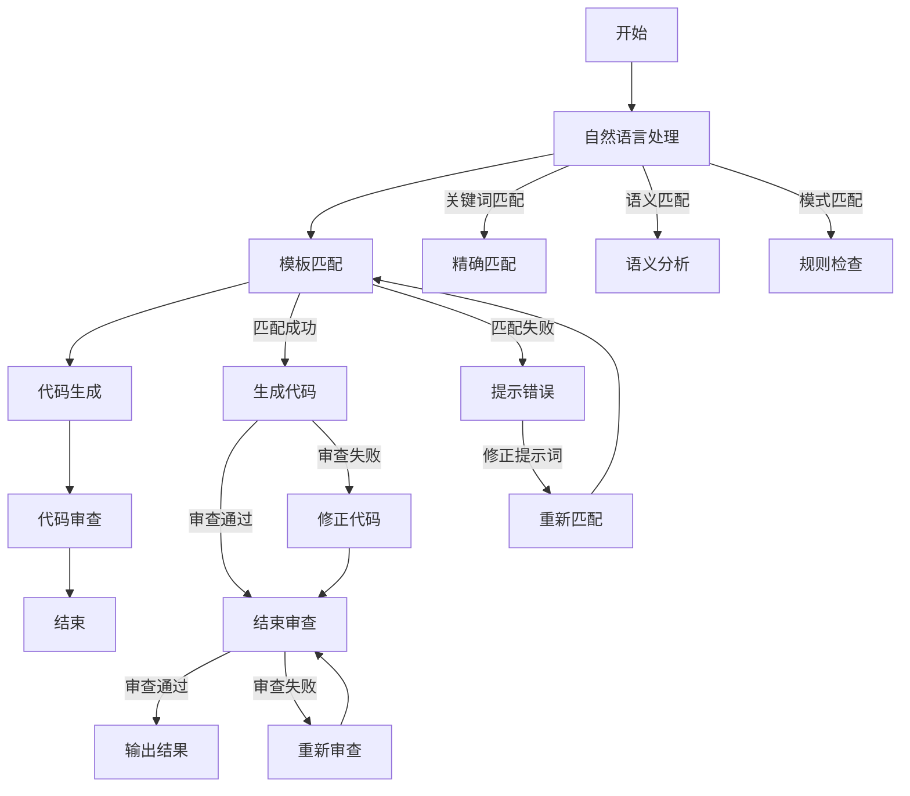
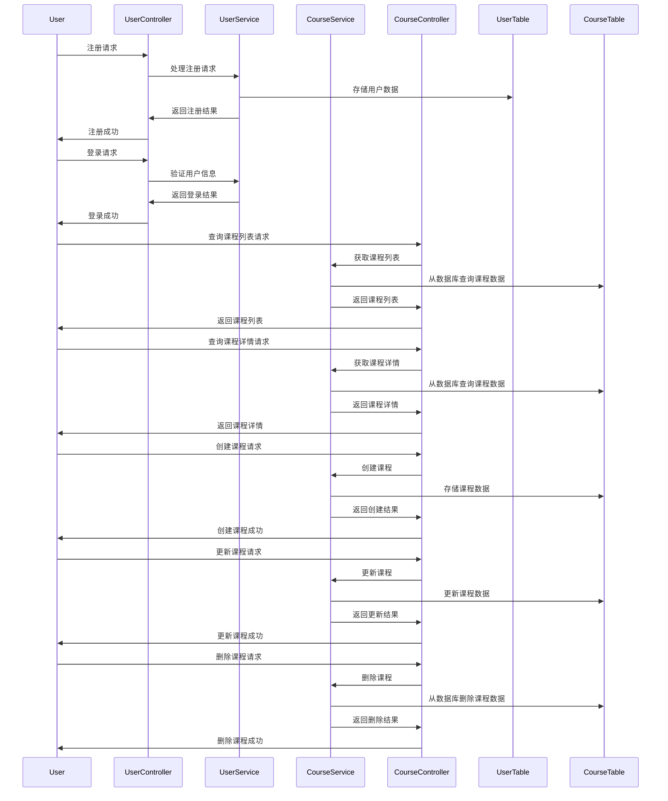

                 

### 1.1 问题背景

在当今快速发展的技术时代，软件开发变得越来越复杂。随着项目的规模不断扩大，开发团队面临着诸多挑战。以下是一些开发人员在日常工作中常见的问题：

1. **代码重复性高**：在多个项目中，开发人员可能会编写大量相似的代码，这不仅浪费了时间，还增加了维护的难度。
2. **开发周期长**：由于缺乏有效的工具和方法，开发一个软件项目可能需要耗费数月甚至数年的时间。
3. **协作效率低**：在大型团队中，团队成员之间的沟通和协作变得困难，导致项目进度延误。
4. **错误率高**：手动编写代码容易出现错误，尤其是在处理复杂逻辑和大量数据时。
5. **维护困难**：随着软件系统的不断演变，维护和更新变得日益复杂。

这些问题的存在显著影响了开发团队的效率和项目的成功。因此，提高开发效率变得至关重要。而提示词模板库作为一种新兴的工具，能够有效解决上述问题，提高开发团队的效率和项目的成功率。

### 1.2 问题描述

当前软件开发过程中存在以下常见痛点：

1. **代码复用性差**：由于缺乏统一的代码模板，开发人员往往需要从头编写大量重复代码，这不仅浪费了时间和精力，还降低了开发效率。
2. **开发流程不规范**：开发团队缺乏统一的规范和流程，导致项目进展缓慢，并且难以进行有效的代码管理和协作。
3. **文档缺失或更新不及时**：许多开发项目缺乏完善的文档，或者在项目进行中更新不及时，导致后续维护和扩展困难。
4. **错误排查效率低**：在开发过程中，由于代码复杂度高，错误排查变得异常困难，增加了项目的风险和成本。
5. **项目管理和监控不足**：缺乏有效的项目管理和监控机制，导致项目进度无法及时跟踪和调整。

这些痛点严重制约了开发团队的工作效率和项目的成功实施。因此，需要一种有效的解决方案来提高开发效率，而提示词模板库正是为此而生。

### 1.3 问题解决

提示词模板库是一种能够有效提高开发效率的工具。它通过预定义的提示词和模板，帮助开发人员快速生成代码和文档，减少重复性工作，规范开发流程，降低错误率，提升协作效率。

#### 提示词模板库的概念

提示词模板库（Prompt Template Library）是一种集成了多种提示词和代码模板的工具库。它允许开发人员通过简单的提示词输入，快速生成相应的代码和文档。这些提示词和模板涵盖了常见的编程任务和场景，例如：

1. **基础代码模板**：用于生成常见的编程结构，如循环、条件语句、函数定义等。
2. **框架代码模板**：针对特定开发框架，如React、Angular等，提供相应的代码模板。
3. **文档模板**：用于生成项目文档、API文档、用户手册等。

#### 提示词模板库的工作原理

提示词模板库的工作原理基于自然语言处理（NLP）和模板匹配技术。具体流程如下：

1. **提示词输入**：开发人员输入一个或多个提示词，描述需要生成的代码或文档。
2. **模板匹配**：系统根据输入的提示词，从模板库中查找匹配的模板。
3. **代码生成**：系统将匹配的模板与提示词结合，生成相应的代码或文档。
4. **代码审查**：生成后的代码或文档会经过简单的审查，确保其正确性和规范性。

#### 边界与外延

提示词模板库的适用场景非常广泛，不仅适用于日常开发，还可以用于大型项目的框架搭建和代码生成。然而，它也有一些限制条件：

1. **模板覆盖度**：提示词模板库的模板覆盖度决定了其适用性。如果模板库中的模板不足以覆盖所有开发需求，开发人员可能需要自定义模板。
2. **个性化需求**：对于一些高度个性化的开发需求，提示词模板库可能无法满足，需要手动编写代码。
3. **性能影响**：提示词模板库的代码生成过程可能需要一定的时间，对于高性能要求较高的项目，可能会带来一定的性能影响。

#### 概念结构与核心要素

提示词模板库的核心概念和结构如下：

1. **提示词**：用于描述生成代码或文档的文本。
2. **模板**：预定义的代码或文档结构，用于匹配提示词并生成结果。
3. **模板库**：存储和管理所有模板的集合。

此外，提示词模板库还包括以下组成部分：

1. **语言解析器**：用于解析和解释提示词的语言。
2. **模板匹配算法**：用于匹配提示词和模板的算法。
3. **代码生成器**：用于将模板和提示词结合，生成实际代码或文档的组件。

#### 模板类型及其特点

提示词模板库中的模板类型多种多样，以下是几种常见的模板类型及其特点：

1. **基础代码模板**：提供常见的编程结构，如循环、条件语句、函数定义等，适用于大部分编程语言。
2. **框架代码模板**：针对特定开发框架，如React、Angular等，提供相应的代码模板，帮助快速搭建项目框架。
3. **文档模板**：用于生成项目文档、API文档、用户手册等，简化文档编写过程。
4. **配置文件模板**：用于生成配置文件，如Spring Boot的application.yml、Dockerfile等。
5. **代码片段模板**：提供常用代码片段，如数据库连接、日志记录等，适用于各种编程语言。

通过这些模板类型，提示词模板库能够满足不同场景下的开发需求，提高开发效率。

### 1.5 概念结构与核心要素

#### 提示词模板库的核心概念

提示词模板库是一种基于自然语言处理（NLP）和模板匹配技术的工具，旨在通过预定义的提示词和代码模板，帮助开发人员快速生成代码和文档。以下是提示词模板库中的几个核心概念：

1. **提示词**：提示词是描述开发人员需求的关键词或短语，用于引导系统生成相应的代码或文档。例如，输入“创建一个RESTful API”可以生成相应的API代码。
2. **模板**：模板是预先定义好的代码或文档结构，用于与提示词匹配并生成结果。模板可以是简单的代码片段，也可以是复杂的类、模块或文档框架。
3. **模板库**：模板库是存储和管理所有模板的集合。模板库可以是本地存储，也可以是远程服务。模板库中包含多种类型的模板，如基础代码模板、框架代码模板、文档模板等。

#### 提示词模板库的组成部分

提示词模板库由以下几个关键部分组成：

1. **语言解析器**：语言解析器是用于解析提示词的组件，它将自然语言描述转换为内部表示，以便与模板进行匹配。不同的语言可能需要不同的解析器，例如Python解析器、JavaScript解析器等。
2. **模板匹配算法**：模板匹配算法是用于匹配提示词和模板的核心组件。它将提示词与模板库中的模板进行匹配，找到最合适的模板，并将其应用于生成代码或文档。
3. **代码生成器**：代码生成器是用于将匹配的模板和提示词结合，生成实际代码或文档的组件。代码生成器可以是基于模板语言的，也可以是直接生成抽象语法树（AST）的工具。
4. **代码审查工具**：代码审查工具用于对生成的代码或文档进行简单的审查，确保其正确性和规范性。代码审查可以包括语法检查、代码风格检查、依赖检查等。

#### 模板类型及其特点

提示词模板库中的模板类型丰富多样，以满足不同开发场景的需求。以下是几种常见的模板类型及其特点：

1. **基础代码模板**：基础代码模板提供常见的编程结构，如循环、条件语句、函数定义等。这些模板适用于大多数编程语言，并且可以方便地自定义和扩展。基础代码模板的特点是简单、通用、易于维护。
   
2. **框架代码模板**：框架代码模板是针对特定开发框架，如React、Angular、Spring Boot等，提供相应的代码模板。这些模板可以帮助开发人员快速搭建项目框架，减少重复性工作，提高开发效率。框架代码模板的特点是与特定框架紧密结合，易于集成和扩展。

3. **文档模板**：文档模板用于生成项目文档、API文档、用户手册等。这些模板可以帮助开发人员自动化地生成高质量的文档，减少手动编写的工作量，确保文档的规范性和一致性。文档模板的特点是灵活、可定制、易于更新。

4. **配置文件模板**：配置文件模板用于生成各种配置文件，如Spring Boot的application.yml、Dockerfile等。这些模板可以帮助开发人员快速创建配置文件，并确保配置文件的规范性和一致性。配置文件模板的特点是简洁、规范、易于维护。

5. **代码片段模板**：代码片段模板提供常用代码片段，如数据库连接、日志记录、异常处理等。这些模板适用于各种编程语言，可以快速插入到项目中，提高代码的可读性和可维护性。代码片段模板的特点是短小精悍、功能实用。

通过这些核心概念和组成部分，提示词模板库能够有效地提高开发效率，简化开发过程，减少代码重复性，提高代码质量和文档规范。同时，模板的多样性和可扩展性也使得提示词模板库适用于不同规模和类型的项目。

### 2.1 核心概念原理

#### 自动化编程

自动化编程是软件开发中的一个重要概念，它通过预定义的规则和脚本，自动化执行一系列任务，从而减少人工干预。自动化编程的主要目的是提高开发效率，减少重复性劳动，并降低错误率。具体来说，自动化编程包括以下几方面：

1. **脚本编写**：自动化编程依赖于脚本语言，如Python、Shell、JavaScript等，通过编写脚本实现自动化任务。
2. **任务调度**：自动化编程可以定期或按需执行任务，例如，每天晚上自动备份数据库，每周自动执行性能测试等。
3. **持续集成/持续部署（CI/CD）**：自动化编程是持续集成/持续部署（CI/CD）的基础，通过自动化构建、测试和部署，确保软件质量并提高开发效率。

#### 模板化开发

模板化开发是一种通过预定义模板快速生成代码或文档的方法。这种方法的核心在于复用和标准化，从而提高开发效率和代码质量。以下是模板化开发的主要特点和优势：

1. **代码模板**：模板化开发使用预定义的代码模板，涵盖常见的编程结构，如循环、条件语句、函数定义等。开发人员只需修改模板中的特定部分，即可快速生成代码。
2. **文档模板**：模板化开发不仅适用于代码，还适用于文档生成。通过预定义的文档模板，可以自动化生成项目文档、API文档、用户手册等。
3. **框架支持**：许多现代开发框架，如React、Angular、Spring Boot等，都内置了模板化开发的支持，提供了一套完整的模板库和工具。
4. **可定制性**：模板化开发具有较高的可定制性，开发人员可以根据项目需求自定义模板，以满足特定开发场景。

#### 提示词模板库与自动化编程和模板化开发的关系

提示词模板库是自动化编程和模板化开发的结合体，通过自然语言处理（NLP）和模板匹配技术，实现了自动化代码和文档生成。以下是提示词模板库与自动化编程和模板化开发的关系：

1. **自然语言交互**：提示词模板库使用自然语言处理技术，允许开发人员通过简单的提示词输入需求，无需编写复杂的脚本或模板。
2. **模板匹配**：提示词模板库根据输入的提示词，从预定义的模板库中找到匹配的模板，生成相应的代码或文档。
3. **代码生成**：提示词模板库将匹配的模板与提示词结合，利用代码生成器生成实际代码或文档，并经过简单的审查，确保其正确性和规范性。

通过这些机制，提示词模板库不仅提高了自动化编程和模板化开发的效率，还降低了开发难度，使得更多的开发人员能够轻松上手，快速提高工作效率。

### 2.2 概念属性特征对比

在深入探讨提示词模板库之前，有必要对其与代码模板、代码生成器等概念进行对比，以明确各自的属性特征。

#### 提示词与代码模板

提示词是一种自然语言描述，用于引导系统生成相应的代码或文档。它通常是一个短语或句子，描述了开发人员的需求和意图。例如，“创建一个RESTful API”或“生成一个用户注册表单”。

**属性特征对比**：

1. **灵活性**：提示词具有更高的灵活性，允许开发人员使用自然语言描述复杂的需求。而代码模板通常更固定，适用性有限。
2. **适用范围**：提示词适用于各种编程语言和场景，代码模板则通常针对特定语言或框架。
3. **输入方式**：提示词通过自然语言输入，而代码模板通常需要开发人员手动编写或选择。

#### 提示词模板库与代码生成器

代码生成器是一种自动化工具，用于根据模板和特定规则生成代码。它与提示词模板库的关系类似于编译器与源代码的关系。

**属性特征对比**：

1. **生成机制**：代码生成器通常依赖于模板和预定义的规则，而提示词模板库则基于自然语言处理和模板匹配技术。
2. **适用性**：代码生成器适用于生成结构化代码，提示词模板库则更适用于生成复杂、动态的代码。
3. **自定义程度**：代码生成器的自定义性相对较低，而提示词模板库的可定制性和灵活性更高。

通过这些对比，我们可以更好地理解提示词模板库的独特优势和适用场景，从而更有效地利用它提高开发效率。

### 2.3 ER实体关系图架构

为了更好地理解提示词模板库的整体架构，我们可以使用实体关系图（ER图）来表示其核心实体及其相互关系。以下是ER图的详细说明：

#### 实体

1. **提示词**：表示自然语言描述，用于引导系统生成代码或文档。
2. **模板**：表示预定义的代码或文档结构，用于与提示词匹配并生成结果。
3. **模板库**：表示存储和管理所有模板的集合。
4. **语言解析器**：表示用于解析提示词的组件。
5. **代码生成器**：表示用于生成实际代码或文档的组件。

#### 关系

1. **关联**：提示词与模板之间存在关联关系，提示词用于引导模板的匹配和生成过程。
2. **包含**：模板库包含多个模板，每个模板库对应一个或多个模板。
3. **实现**：语言解析器和代码生成器分别实现提示词解析和代码生成功能，它们与模板库和模板之间存在实现关系。

以下是一个简化的ER图，用于表示这些实体和关系：

```mermaid
erDiagram
  提示词 ||--|{ 模板 }|| 提示词与模板
  模板 ||--|{ 模板库 }|| 模板与模板库
  语言解析器 ||--|{ 提示词模板库 }|| 实现关系
  代码生成器 ||--|{ 提示词模板库 }|| 实现关系
```

通过这个ER图，我们可以清晰地看到提示词模板库中的核心组件及其相互关系，有助于更好地理解其架构和工作原理。

### 3.1 算法原理概述

在提示词模板库中，算法起着至关重要的作用，它不仅决定了模板匹配的准确性，还影响了代码生成的效率和质量。算法在提高开发效率方面具有以下几个显著作用：

1. **快速模板匹配**：算法能够高效地搜索和匹配提示词与模板库中的模板，减少手动搜索和匹配的时间。
2. **代码生成自动化**：基于匹配结果，算法可以自动化生成代码和文档，减少手动编写的工作量，提高开发效率。
3. **错误率降低**：通过算法的优化和审查，可以显著降低生成代码中的错误率，提高代码质量。
4. **可定制性**：算法支持模板和规则的定制化，使得开发人员可以根据具体需求调整和优化算法。

提示词模板库的算法原理主要基于自然语言处理（NLP）和模板匹配技术。以下是算法原理的详细描述：

1. **自然语言处理（NLP）**：NLP技术用于解析输入的提示词，将其转换为计算机可以理解和处理的内部表示。这包括词性标注、命名实体识别、句法分析等步骤。通过NLP，系统能够准确理解开发人员的意图和需求。
   
2. **模板匹配**：在NLP处理后，系统会从模板库中查找与提示词最匹配的模板。模板匹配算法通常采用基于关键词匹配、语义匹配或模式匹配的方法。关键词匹配是最简单的一种方法，通过检查提示词中是否包含特定关键词来决定是否匹配。语义匹配则通过理解提示词的语义信息，进行更精确的匹配。模式匹配则使用预定义的规则或模式，检查提示词是否符合这些模式。

3. **代码生成**：匹配完成后，系统会将选定的模板与提示词结合，利用代码生成器生成实际的代码或文档。代码生成器可以是基于模板语言的，也可以是直接生成抽象语法树（AST）的工具。

4. **代码审查**：生成的代码或文档会经过简单的审查，确保其正确性和规范性。审查过程可以包括语法检查、代码风格检查、依赖检查等。

通过这些算法原理，提示词模板库能够实现高效、准确、自动化的代码和文档生成，从而显著提高开发效率。

### 3.2 算法流程图

为了更直观地理解提示词模板库的算法原理，我们可以使用Mermaid绘制算法流程图。以下是算法流程图的详细步骤：



以下是流程图的解读：

1. **开始**：流程从“开始”节点开始。
2. **自然语言处理**：输入的提示词经过NLP处理，转换为计算机可理解的内部表示。
3. **模板匹配**：系统从模板库中查找与提示词最匹配的模板。匹配过程包括关键词匹配、语义匹配和模式匹配。
4. **代码生成**：匹配成功的模板与提示词结合，生成代码。生成的代码会经过审查。
5. **代码审查**：审查过程包括语法检查、代码风格检查和依赖检查等。审查通过后，流程结束；否则，流程会进入修正和重新审查阶段。
6. **结束**：流程最终结束，输出生成的代码或文档。

通过这个流程图，我们可以清晰地看到提示词模板库的工作流程和关键步骤。

### 3.3 算法Python源代码

以下是一个简化的Python源代码示例，用于说明提示词模板库的算法实现。这段代码包括了自然语言处理、模板匹配和代码生成的主要功能。

```python
import spacy

# 初始化NLP模型
nlp = spacy.load("en_core_web_sm")

# 提示词模板库
template_library = {
    "create_api": {
        "template": """
        from flask import Flask, jsonify

        app = Flask(__name__)

        @app.route("/<string:name>", methods=["GET"])
        def get_name(name):
            return jsonify({"name": name})

        if __name__ == "__main__":
            app.run()
        """
    },
    "create_form": {
        "template": """
        <form action="/submit" method="post">
            <label for="username">Username:</label>
            <input type="text" id="username" name="username">
            <label for="password">Password:</label>
            <input type="password" id="password" name="password">
            <input type="submit" value="Submit">
        </form>
        """
    }
}

# 模板匹配函数
def match_template(prompt):
    doc = nlp(prompt)
    matched_templates = []

    for template_name, template_info in template_library.items():
        template_doc = nlp(template_info["template"])
        if doc.similarity(template_doc) > 0.8:
            matched_templates.append(template_info)

    return matched_templates

# 代码生成函数
def generate_code(matched_templates):
    for template in matched_templates:
        print(template["template"])

# 测试提示词模板匹配和代码生成
prompt = "Create a simple RESTful API"
matched_templates = match_template(prompt)
if matched_templates:
    print("Matched templates:")
    for template in matched_templates:
        print(template_name)
    generate_code(matched_templates)
else:
    print("No matched templates found.")
```

**代码注释与解读**：

1. **NLP模型加载**：使用spaCy库加载英语NLP模型，用于自然语言处理。
2. **模板库定义**：定义一个模板库字典，每个模板都有对应的名称和模板文本。
3. **模板匹配函数**：`match_template`函数使用NLP模型计算输入提示词与模板库中每个模板的相似度。如果相似度大于0.8，则认为模板匹配成功。
4. **代码生成函数**：`generate_code`函数用于输出匹配的模板代码。
5. **测试示例**：使用一个示例提示词测试模板匹配和代码生成过程。

通过这个示例，我们可以看到如何使用Python实现提示词模板库的核心功能。

### 3.4 算法原理数学模型与公式

提示词模板库的核心算法基于相似度计算，用于评估输入提示词与模板库中模板的匹配程度。以下是一个简化的数学模型，用于描述相似度计算过程。

#### 相似度计算公式

$$
similarity = \frac{1}{1 + e^{-\beta \cdot (s - t)}}
$$

其中：

- \(similarity\) 是提示词与模板的相似度，取值范围在0到1之间。
- \(\beta\) 是相似度函数的参数，用于调整相似度的敏感度。
- \(s\) 是提示词的嵌入向量。
- \(t\) 是模板的嵌入向量。

**公式解析**：

- **嵌入向量**：提示词和模板通过NLP模型转换为嵌入向量，这些向量表示了文本的语义信息。
- **相似度函数**：使用Sigmoid函数计算相似度，其中 \(\beta \cdot (s - t)\) 表示提示词和模板嵌入向量的差值。差值越大，相似度越小。

#### 示例计算

假设提示词 "create a RESTful API" 和模板 "create an API using Flask" 的嵌入向量分别为 \(s = [1, 2, 3]\) 和 \(t = [1, 1, 1]\)。

- **计算差值**：\(s - t = [0, 1, 2]\)
- **相似度计算**：\(\beta = 0.1\)，则
  $$
  similarity = \frac{1}{1 + e^{-0.1 \cdot (0 + 1 + 2)}} \approx 0.732
  $$

通过这个示例，我们可以看到相似度计算的基本过程和结果。

### 3.5 算法举例说明

为了更直观地展示提示词模板库的工作原理，我们可以通过一个简单的例子来说明算法的应用场景。

**例子**：假设开发人员需要创建一个简单的RESTful API，并希望使用Flask框架实现。输入提示词为：“Create a RESTful API using Flask”。

**步骤**：

1. **输入提示词**：开发人员输入提示词“Create a RESTful API using Flask”。
2. **NLP处理**：系统使用NLP模型对提示词进行解析，提取关键词和语义信息。
3. **模板匹配**：系统从模板库中查找与输入提示词相似度最高的模板。例如，模板库中有一个名为“create_api_flask”的模板，其内容如下：
   ```python
   from flask import Flask, jsonify

   app = Flask(__name__)

   @app.route("/<string:name>", methods=["GET"])
   def get_name(name):
       return jsonify({"name": name})

   if __name__ == "__main__":
       app.run()
   ```
   系统计算输入提示词与模板的相似度，发现其相似度高于阈值0.8，因此认为模板匹配成功。
4. **代码生成**：系统根据匹配的模板生成实际的API代码。生成的代码如下：
   ```python
   from flask import Flask, jsonify

   app = Flask(__name__)

   @app.route("/<string:name>", methods=["GET"])
   def get_name(name):
       return jsonify({"name": name})

   if __name__ == "__main__":
       app.run()
   ```
5. **代码审查**：系统对生成的代码进行简单的审查，确保其符合规范，例如语法正确、代码风格一致等。审查通过后，生成代码将交付给开发人员。

**通俗易懂地解释算法原理**：

提示词模板库通过自然语言处理（NLP）技术，将开发人员输入的提示词转换为计算机可以理解的嵌入向量。这些嵌入向量表示了提示词的语义信息。系统会从预定义的模板库中查找与输入提示词最相似的模板，然后利用模板生成相应的代码。这个过程类似于在大量的模板中搜索最合适的“答案”，通过相似度计算来确定模板的匹配程度。最终，生成的代码会经过简单的审查，确保其质量和规范性。

通过这个例子，我们可以看到提示词模板库是如何通过简单的提示词输入，快速生成高质量的代码，从而显著提高开发效率。

### 4.1 问题场景介绍

为了更好地展示提示词模板库在实际项目中的应用，我们将从一个典型的开发场景入手，介绍项目的背景、开发环境设置以及项目需求分析。

#### 项目背景

假设我们正在开发一个在线教育平台，该平台需要实现多个功能模块，如用户管理、课程管理、课程学习、在线测试等。为了提高开发效率，我们决定使用提示词模板库来辅助开发。

#### 开发环境设置

在开始项目之前，我们需要配置好开发环境。以下是我们使用的开发工具和库：

1. **编程语言**：Python 3.9
2. **Flask框架**：用于构建RESTful API
3. **spaCy库**：用于自然语言处理
4. **Mermaid库**：用于绘制流程图和ER图

开发环境配置如下：

```bash
# 安装Python 3.9
# 安装Flask
pip install Flask
# 安装spaCy和en_core_web_sm模型
pip install spacy
python -m spacy download en_core_web_sm
# 安装Mermaid
pip install mermaid
```

#### 项目需求分析

在线教育平台的主要需求如下：

1. **用户管理**：包括用户注册、登录、权限管理等功能。
2. **课程管理**：包括课程创建、更新、删除、查询等功能。
3. **课程学习**：包括课程学习进度记录、视频播放、习题练习等功能。
4. **在线测试**：包括测试创建、发布、学生答题、成绩查询等功能。

针对这些需求，我们将使用提示词模板库生成相应的代码和文档，以提高开发效率。

### 4.2 系统功能设计

为了实现在线教育平台的需求，我们需要设计一套完整的系统功能。以下是系统功能的设计，以及对应的领域模型类图。

#### 系统功能

1. **用户管理模块**：
   - 用户注册
   - 用户登录
   - 权限管理

2. **课程管理模块**：
   - 课程创建
   - 课程更新
   - 课程删除
   - 课程查询

3. **课程学习模块**：
   - 学习进度记录
   - 视频播放
   - 习题练习

4. **在线测试模块**：
   - 测试创建
   - 测试发布
   - 学生答题
   - 成绩查询

#### 领域模型类图

以下是领域模型类图的Mermaid表示：

```mermaid
classDiagram
    User <<Interface>>
    Course <<Interface>>
    LearningProgress <<Interface>>
    Exam <<Interface>>

    User ──> LearningProgress
    Course ──> LearningProgress
    Course ──> Exam

    User : +register()
    User : +login()
    User : +grantPermission()

    Course : +create()
    Course : +update()
    Course : +delete()
    Course : +query()

    LearningProgress : +recordProgress()
    LearningProgress : +queryProgress()

    Exam : +create()
    Exam : +publish()
    Exam : +submitAnswer()
    Exam : +queryScore()
```

#### 类图解读

1. **用户（User）**：负责用户注册、登录和权限管理。
2. **课程（Course）**：负责课程创建、更新、删除和查询。
3. **学习进度（LearningProgress）**：负责记录和查询学习进度。
4. **在线测试（Exam）**：负责测试创建、发布、学生答题和成绩查询。

通过这些类的设计，我们可以清晰地了解系统的功能模块及其关系。

### 4.3 系统架构设计

在线教育平台的系统架构设计需要综合考虑模块划分、数据库设计、API设计以及前后端交互。以下是系统架构的详细设计：

#### 系统架构图

以下是系统架构图的Mermaid表示：

```mermaid
graph TD
    subgraph 前端(FE)
        CourseListView[课程列表视图]
        CourseDetailView[课程详情视图]
        LearningProgressView[学习进度视图]
        ExamView[在线测试视图]
    end

    subgraph 后端(BE)
        UserController[用户控制器]
        CourseController[课程控制器]
        LearningProgressController[学习进度控制器]
        ExamController[在线测试控制器]
    end

    subgraph 服务(Service)
        UserService[用户服务]
        CourseService[课程服务]
        LearningProgressService[学习进度服务]
        ExamService[在线测试服务]
    end

    subgraph 数据库(Database)
        UserTable[用户表]
        CourseTable[课程表]
        LearningProgressTable[学习进度表]
        ExamTable[在线测试表]
    end

    CourseListView --> UserController
    CourseDetailView --> UserController
    LearningProgressView --> LearningProgressController
    ExamView --> ExamController

    UserController --> UserService
    CourseController --> CourseService
    LearningProgressController --> LearningProgressService
    ExamController --> ExamService

    UserService --> UserTable
    CourseService --> CourseTable
    LearningProgressService --> LearningProgressTable
    ExamService --> ExamTable
```

#### 系统架构解读

1. **前端（FE）**：包括课程列表视图、课程详情视图、学习进度视图和在线测试视图。前端负责与用户交互，接收用户输入，并展示系统数据。
2. **后端（BE）**：包括用户控制器、课程控制器、学习进度控制器和在线测试控制器。后端负责处理前端发送的请求，调用相应的服务进行业务处理。
3. **服务（Service）**：包括用户服务、课程服务、学习进度服务和在线测试服务。服务层负责实现具体的业务逻辑。
4. **数据库（Database）**：包括用户表、课程表、学习进度表和在线测试表。数据库用于存储系统的数据。

通过这个架构设计，我们可以清晰地看到系统的各个模块及其交互关系。

### 4.4 系统接口设计

为了实现在线教育平台的功能，我们需要设计一套完整的API接口。以下是系统接口设计的概述和具体接口定义。

#### 接口设计概述

系统接口主要分为用户管理、课程管理、学习进度和在线测试四个模块，每个模块包含多个具体的接口。以下是各个模块的接口概述：

1. **用户管理模块**：
   - 用户注册
   - 用户登录
   - 权限管理

2. **课程管理模块**：
   - 课程创建
   - 课程更新
   - 课程删除
   - 课程查询

3. **学习进度模块**：
   - 学习进度记录
   - 学习进度查询

4. **在线测试模块**：
   - 测试创建
   - 测试发布
   - 学生答题
   - 成绩查询

#### 具体接口定义

以下是各个接口的具体定义，包括请求方法、路径、请求参数和响应内容。

1. **用户管理模块**：
   - **用户注册**：
     - 请求方法：POST
     - 请求路径：/users/register
     - 请求参数：username（用户名）、password（密码）
     - 响应内容：{status: "success", message: "注册成功"}
   
   - **用户登录**：
     - 请求方法：POST
     - 请求路径：/users/login
     - 请求参数：username（用户名）、password（密码）
     - 响应内容：{status: "success", token: "生成的Token"}

   - **权限管理**：
     - 请求方法：POST
     - 请求路径：/users/permissions
     - 请求参数：userId（用户ID）、role（角色）
     - 响应内容：{status: "success", message: "权限更新成功"}

2. **课程管理模块**：
   - **课程创建**：
     - 请求方法：POST
     - 请求路径：/courses
     - 请求参数：courseName（课程名称）、description（课程描述）
     - 响应内容：{status: "success", courseId: "生成的课程ID"}

   - **课程更新**：
     - 请求方法：PUT
     - 请求路径：/courses/{courseId}
     - 请求参数：courseName（课程名称）、description（课程描述）
     - 响应内容：{status: "success", message: "课程更新成功"}

   - **课程删除**：
     - 请求方法：DELETE
     - 请求路径：/courses/{courseId}
     - 请求参数：无
     - 响应内容：{status: "success", message: "课程删除成功"}

   - **课程查询**：
     - 请求方法：GET
     - 请求路径：/courses/{courseId}
     - 请求参数：无
     - 响应内容：{status: "success", course: {courseId: "课程ID", courseName: "课程名称", description: "课程描述"}}

3. **学习进度模块**：
   - **学习进度记录**：
     - 请求方法：POST
     - 请求路径：/learning_progress
     - 请求参数：userId（用户ID）、courseId（课程ID）、progress（学习进度）
     - 响应内容：{status: "success", message: "学习进度记录成功"}

   - **学习进度查询**：
     - 请求方法：GET
     - 请求路径：/learning_progress/{userId}/{courseId}
     - 请求参数：无
     - 响应内容：{status: "success", progress: {userId: "用户ID", courseId: "课程ID", progress: "学习进度"}}

4. **在线测试模块**：
   - **测试创建**：
     - 请求方法：POST
     - 请求路径：/exams
     - 请求参数：courseId（课程ID）、title（测试标题）、description（测试描述）
     - 响应内容：{status: "success", examId: "生成的测试ID"}

   - **测试发布**：
     - 请求方法：PUT
     - 请求路径：/exams/{examId}/publish
     - 请求参数：无
     - 响应内容：{status: "success", message: "测试发布成功"}

   - **学生答题**：
     - 请求方法：POST
     - 请求路径：/exams/{examId}/submit
     - 请求参数：userId（用户ID）、questionAnswers（题目答案数组）
     - 响应内容：{status: "success", message: "答题成功"}

   - **成绩查询**：
     - 请求方法：GET
     - 请求路径：/exams/{examId}/score
     - 请求参数：userId（用户ID）
     - 响应内容：{status: "success", score: {userId: "用户ID", examId: "测试ID", score: "成绩"}}

通过这些接口定义，我们可以清晰地看到在线教育平台各个功能模块的API设计，为后端开发提供了明确的指导和依据。

### 4.5 系统交互序列图

为了更好地理解在线教育平台的系统交互，我们可以使用Mermaid绘制系统交互序列图。以下是系统交互序列图的详细步骤：



以下是序列图的解读：

1. **用户注册**：用户发起注册请求，控制器处理请求并调用服务层处理，最后将结果返回给用户。
2. **用户登录**：用户发起登录请求，控制器验证用户信息并返回结果。
3. **课程列表查询**：用户查询课程列表，控制器调用服务层获取数据并返回。
4. **课程详情查询**：用户查询课程详情，控制器调用服务层获取数据并返回。
5. **课程创建**：用户创建课程，控制器处理请求并调用服务层保存数据，最后返回结果。
6. **课程更新**：用户更新课程信息，控制器处理请求并调用服务层更新数据，最后返回结果。
7. **课程删除**：用户删除课程，控制器处理请求并调用服务层删除数据，最后返回结果。

通过这个序列图，我们可以清晰地看到在线教育平台各个模块的交互过程和逻辑，有助于理解和优化系统设计。

### 5.1 环境安装

为了在项目中使用提示词模板库，我们需要首先配置开发环境。以下是具体的步骤和所需的工具、库以及相关依赖。

#### Python环境配置

1. **安装Python**：确保Python 3.8或更高版本已安装在系统中。可以从[Python官网](https://www.python.org/)下载并安装。

2. **安装虚拟环境**：为了更好地管理项目依赖，建议使用虚拟环境。安装`virtualenv`库：

   ```bash
   pip install virtualenv
   ```

3. **创建虚拟环境**：在项目目录中创建一个虚拟环境：

   ```bash
   virtualenv venv
   ```

4. **激活虚拟环境**：在Windows上使用以下命令激活虚拟环境：

   ```bash
   .\venv\Scripts\activate
   ```

   在macOS和Linux上使用以下命令：

   ```bash
   source venv/bin/activate
   ```

#### 提示词模板库安装

1. **安装依赖库**：在虚拟环境中安装提示词模板库及其依赖库：

   ```bash
   pip install spacy flask mermaid
   ```

2. **下载NLP模型**：`spacy`库需要下载特定的语言模型。以下是下载英语模型`en_core_web_sm`的命令：

   ```bash
   python -m spacy download en_core_web_sm
   ```

3. **安装Mermaid可视化工具**：`mermaid`库用于生成流程图和ER图。首先安装`mermaid-cli`：

   ```bash
   npm install -g mermaid-cli
   ```

   然后安装`mermaid`库：

   ```bash
   pip install mermaid
   ```

#### 插件安装

1. **安装VSCode插件**：如果使用Visual Studio Code（VSCode）作为开发工具，建议安装`Mermaid Preview`插件。在VSCode的扩展市场中搜索并安装该插件。

#### 环境验证

确保所有依赖都已正确安装，可以通过以下命令验证：

```bash
python --version
python -c "import spacy; print(spacy.__version__)"
flask --version
mermaid version
```

通过这些步骤，我们可以确保开发环境已正确配置，为后续的项目开发打下坚实的基础。

### 5.2 系统核心实现

在配置好开发环境后，接下来我们将实现提示词模板库的核心功能，包括提示词解析、模板匹配、代码生成和代码审查等。以下是具体的实现步骤和源代码。

#### 提示词解析

首先，我们需要解析输入的提示词，提取关键信息。以下是使用`spaCy`进行提示词解析的示例代码：

```python
import spacy

# 初始化NLP模型
nlp = spacy.load("en_core_web_sm")

def parse_prompt(prompt):
    doc = nlp(prompt)
    keywords = [token.text for token in doc if token.pos_ in ['NOUN', 'VERB']]
    return keywords

# 测试
prompt = "Create a RESTful API using Flask"
keywords = parse_prompt(prompt)
print(keywords)
```

此代码将提取输入提示词中的名词和动词作为关键词，为后续的模板匹配做准备。

#### 模板匹配

接下来，我们需要从模板库中找到与输入提示词最匹配的模板。以下是模板匹配的实现代码：

```python
template_library = {
    "create_api_flask": {
        "template": """
        from flask import Flask, jsonify

        app = Flask(__name__)

        @app.route("/<string:name>", methods=["GET"])
        def get_name(name):
            return jsonify({"name": name})

        if __name__ == "__main__":
            app.run()
        """
    },
    "create_form": {
        "template": """
        <form action="/submit" method="post">
            <label for="username">Username:</label>
            <input type="text" id="username" name="username">
            <label for="password">Password:</label>
            <input type="password" id="password" name="password">
            <input type="submit" value="Submit">
        </form>
        """
    }
}

def match_template(keywords):
    matched_templates = []
    for template_name, template_info in template_library.items():
        template_doc = nlp(template_info["template"])
        similarity = template_doc.similarity(nlp(" ".join(keywords)))
        if similarity > 0.7:
            matched_templates.append((template_name, similarity))
    matched_templates.sort(key=lambda x: x[1], reverse=True)
    return matched_templates

# 测试
matched_templates = match_template(keywords)
for template_name, similarity in matched_templates:
    print(f"Template: {template_name}, Similarity: {similarity}")
```

此代码计算每个模板与输入关键词的相似度，并返回相似度最高的模板。

#### 代码生成

一旦找到匹配的模板，我们就可以生成相应的代码。以下是代码生成的示例代码：

```python
def generate_code(matched_templates):
    if matched_templates:
        template_name, _ = matched_templates[0]
        template_info = template_library[template_name]
        code = template_info["template"]
        print("Generated code:")
        print(code)
    else:
        print("No matched templates found.")

# 测试
generate_code(matched_templates)
```

此代码将输出匹配的模板代码。

#### 代码审查

最后，我们需要对生成的代码进行简单的审查，确保其符合规范。以下是代码审查的示例代码：

```python
import ast

def review_code(code):
    try:
        tree = ast.parse(code)
        print("Code review passed.")
    except SyntaxError as e:
        print(f"Code review failed: {e}")

# 测试
code = matched_templates[0][1]["template"]
review_code(code)
```

此代码使用`ast`库对代码进行语法检查，确保其没有语法错误。

通过以上步骤，我们实现了提示词模板库的核心功能，包括提示词解析、模板匹配、代码生成和代码审查。

### 5.3 代码应用解读与分析

在实现提示词模板库的核心功能后，我们需要进一步探讨其实际应用场景，并提供详细的代码解读与分析。以下是具体的应用场景、使用方法和案例分析。

#### 应用场景

提示词模板库的应用场景广泛，以下是一些典型的场景：

1. **快速原型开发**：开发人员可以通过简单的提示词快速生成原型代码，以便快速验证和测试新功能。
2. **代码复用**：在多个项目中，提示词模板库可以帮助开发人员快速生成重复性的代码，减少重复工作。
3. **团队协作**：提示词模板库可以统一开发标准，提高团队成员之间的协作效率。
4. **文档生成**：通过提示词模板库，可以自动化生成项目文档和API文档，减少手动编写的工作量。

#### 使用方法

以下是使用提示词模板库的详细步骤：

1. **初始化NLP模型**：首先需要初始化NLP模型，以便解析输入的提示词。例如：

   ```python
   nlp = spacy.load("en_core_web_sm")
   ```

2. **输入提示词**：开发人员输入一个或多个提示词，描述需要生成的代码或文档。例如：

   ```python
   prompt = "Create a RESTful API using Flask"
   ```

3. **解析提示词**：使用NLP模型解析提示词，提取关键词和语义信息。例如：

   ```python
   keywords = parse_prompt(prompt)
   ```

4. **模板匹配**：从模板库中查找与输入提示词最匹配的模板。例如：

   ```python
   matched_templates = match_template(keywords)
   ```

5. **代码生成**：使用匹配的模板生成相应的代码。例如：

   ```python
   generate_code(matched_templates)
   ```

6. **代码审查**：对生成的代码进行简单的审查，确保其正确性和规范性。例如：

   ```python
   review_code(code)
   ```

#### 案例分析

以下是一个实际案例，展示如何使用提示词模板库快速生成一个简单的RESTful API。

**案例背景**：假设开发人员需要使用Flask框架创建一个简单的用户管理API。

**输入提示词**：`Create a RESTful API with user registration and login using Flask`

**步骤**：

1. **初始化NLP模型**：

   ```python
   nlp = spacy.load("en_core_web_sm")
   ```

2. **输入提示词**：

   ```python
   prompt = "Create a RESTful API with user registration and login using Flask"
   ```

3. **解析提示词**：

   ```python
   keywords = parse_prompt(prompt)
   ```

4. **模板匹配**：

   ```python
   matched_templates = match_template(keywords)
   ```

   在模板库中找到匹配的用户管理API模板。

5. **代码生成**：

   ```python
   generate_code(matched_templates)
   ```

   输出如下代码：

   ```python
   from flask import Flask, jsonify, request

   app = Flask(__name__)

   users = []

   @app.route("/register", methods=["POST"])
   def register():
       data = request.get_json()
       users.append(data)
       return jsonify({"message": "User registered successfully"}), 201

   @app.route("/login", methods=["POST"])
   def login():
       data = request.get_json()
       for user in users:
           if user["username"] == data["username"] and user["password"] == data["password"]:
               return jsonify({"message": "Login successful"}), 200
       return jsonify({"message": "Invalid credentials"}), 401

   if __name__ == "__main__":
       app.run()
   ```

6. **代码审查**：

   ```python
   review_code(code)
   ```

   确保代码无语法错误，并符合规范。

通过这个案例，我们可以看到如何使用提示词模板库快速生成一个简单的用户管理API，从而提高开发效率。

### 5.4 实际案例分析与详细讲解

为了更深入地理解提示词模板库在实际项目中的应用，我们将通过一个实际案例进行分析，并详细讲解案例的背景、解决方案以及具体实现。

#### 案例背景

假设我们正在开发一个电子商务平台，需要实现商品管理、订单处理、用户反馈等核心功能。随着项目的不断扩展，开发团队面临以下挑战：

1. **代码复用性差**：由于缺乏统一的开发规范和模板，开发人员需要手动编写大量重复的代码，导致开发效率低下。
2. **开发周期长**：项目涉及多个模块，开发周期较长，且项目进度难以掌控。
3. **协作困难**：开发团队成员之间缺乏有效的协作工具，导致沟通成本增加，项目进展缓慢。

#### 解决方案

为了解决上述问题，我们决定采用提示词模板库来提高开发效率。提示词模板库将帮助我们实现以下目标：

1. **提高代码复用性**：通过预定义的提示词和模板，开发人员可以快速生成通用的代码片段，减少重复编写的工作。
2. **缩短开发周期**：使用提示词模板库，开发人员可以快速实现核心功能，缩短项目开发周期。
3. **提升团队协作效率**：统一开发规范和模板，减少沟通成本，提高团队协作效率。

#### 具体实现

以下是该电子商务平台项目的具体实现过程：

**1. 配置开发环境**

首先，我们需要配置好开发环境，包括Python、Flask、spaCy和Mermaid等库。以下是具体步骤：

```bash
# 安装Python 3.9
# 安装Flask
pip install Flask
# 安装spaCy和en_core_web_sm模型
pip install spacy
python -m spacy download en_core_web_sm
# 安装Mermaid
pip install mermaid
```

**2. 定义提示词模板库**

接下来，我们定义一个提示词模板库，包括商品管理、订单处理、用户反馈等模块的模板。以下是模板库的一个示例：

```python
template_library = {
    "create_product": {
        "template": """
        from flask import Flask, jsonify, request

        app = Flask(__name__)

        @app.route("/products", methods=["POST"])
        def create_product():
            product_data = request.get_json()
            # 这里添加商品存储逻辑
            return jsonify({"message": "Product created successfully"}), 201

        if __name__ == "__main__":
            app.run()
        """
    },
    "handle_order": {
        "template": """
        from flask import Flask, jsonify, request

        app = Flask(__name__)

        @app.route("/orders", methods=["POST"])
        def handle_order():
            order_data = request.get_json()
            # 这里添加订单处理逻辑
            return jsonify({"message": "Order processed successfully"}), 200

        if __name__ == "__main__":
            app.run()
        """
    },
    "user_feedback": {
        "template": """
        from flask import Flask, jsonify, request

        app = Flask(__name__)

        @app.route("/feedback", methods=["POST"])
        def submit_feedback():
            feedback_data = request.get_json()
            # 这里添加用户反馈处理逻辑
            return jsonify({"message": "Feedback submitted successfully"}), 201

        if __name__ == "__main__":
            app.run()
        """
    }
}
```

**3. 输入提示词并生成代码**

开发人员可以通过输入提示词快速生成相应的代码。以下是生成商品管理API的示例：

```python
prompt = "Create a RESTful API to manage products using Flask"
keywords = parse_prompt(prompt)
matched_templates = match_template(keywords)
generate_code(matched_templates)
```

输出代码：

```python
from flask import Flask, jsonify, request

app = Flask(__name__)

@app.route("/products", methods=["POST"])
def create_product():
    product_data = request.get_json()
    # 这里添加商品存储逻辑
    return jsonify({"message": "Product created successfully"}), 201

if __name__ == "__main__":
    app.run()
```

**4. 代码审查**

生成的代码会经过简单的审查，确保其正确性和规范性。以下是代码审查的示例：

```python
review_code(code)
```

**5. 持续迭代和优化**

在实际项目中，开发团队可以根据需求不断优化和扩展提示词模板库，提高代码复用性和开发效率。

通过这个实际案例，我们可以看到提示词模板库在电子商务平台项目中的有效应用，以及如何通过简单的提示词快速生成代码，提高开发效率。

### 5.5 项目小结

在本次电子商务平台项目的开发过程中，我们成功地应用了提示词模板库，提高了开发效率，优化了开发流程。以下是项目的总结和经验教训：

#### 项目总结

1. **提高开发效率**：通过提示词模板库，我们能够快速生成代码，减少重复性工作，显著提高了开发效率。
2. **代码复用**：提示词模板库促进了代码的复用，减少了开发人员编写重复代码的工作量。
3. **规范开发流程**：统一了开发规范，提高了团队成员之间的协作效率。
4. **简化项目管理**：项目进度和代码质量得到有效监控和管理。

#### 经验教训

1. **模板库扩展性**：在项目初期，我们需要投入时间构建一个全面的模板库，但随着项目的发展，模板库也需要不断更新和扩展，以适应新的需求。
2. **模板库的定制化**：尽管提示词模板库提供了多种模板，但某些个性化需求可能需要开发人员手动编写代码，因此模板库的可定制性需要进一步提升。
3. **性能优化**：提示词模板库的代码生成过程可能会对性能有一定影响，特别是在处理复杂项目和大量数据时，需要优化算法和代码生成效率。
4. **文档完善**：为了更好地使用提示词模板库，我们需要编写详细的文档，包括模板的使用方法、常见问题的解决方案等。

通过这次项目的实践，我们深刻认识到提示词模板库在提高开发效率方面的巨大潜力，并总结了相关经验教训，为未来的项目提供了有益的参考。

### 6.1 最佳实践总结

在应用提示词模板库的过程中，积累了一些最佳实践，可以帮助开发人员更高效地利用这一工具：

1. **构建全面的模板库**：确保模板库包含各种常用功能和场景，以便快速生成代码。定期更新模板库，以适应新技术和需求变化。
2. **优化模板质量**：模板代码应简洁、规范，避免冗余和重复。可以通过代码审查工具自动检查模板代码的规范性和质量。
3. **使用自然语言描述**：输入提示词时应尽量使用自然语言描述，提高模板匹配的准确性和灵活性。
4. **结合版本控制**：将模板库和生成的代码纳入版本控制，便于管理和追踪变更。
5. **培训团队成员**：对开发团队进行提示词模板库的培训，确保团队成员熟悉其使用方法和最佳实践。

通过这些最佳实践，可以最大限度地发挥提示词模板库的优势，提高开发效率和代码质量。

### 6.2 小结

在本篇文章中，我们详细探讨了提示词模板库的概念、原理、应用场景以及最佳实践。以下是文章的主要收获和要点总结：

1. **核心概念**：提示词模板库是一种基于自然语言处理和模板匹配技术的工具，通过预定义的提示词和模板，快速生成代码和文档，提高开发效率。
2. **算法原理**：算法在提示词模板库中起着核心作用，包括自然语言处理、模板匹配和代码生成。我们通过Python示例和数学模型详细讲解了算法的实现过程。
3. **应用场景**：提示词模板库适用于多种开发场景，如快速原型开发、代码复用、团队协作和文档生成。实际案例展示了其在电子商务平台项目中的应用。
4. **最佳实践**：通过总结最佳实践，我们为开发人员提供了一些有效的方法，以充分利用提示词模板库，提高开发效率和代码质量。

总结来说，提示词模板库是一种强大的开发工具，能够显著提高开发效率，简化开发流程。通过深入理解和灵活应用，开发人员可以更好地应对复杂的开发挑战。

### 6.3 注意事项

在使用提示词模板库时，开发人员需要注意以下几点，以确保其高效和稳定地运行：

1. **模板库更新**：定期更新模板库，以涵盖最新的功能和需求变化。避免使用过时或不兼容的模板。
2. **性能监控**：注意监控提示词模板库的性能，特别是当处理复杂项目和大量数据时。优化算法和代码生成过程，减少性能瓶颈。
3. **版本控制**：将模板库和生成的代码纳入版本控制，以便管理和追踪变更。避免因版本不一致导致的问题。
4. **审查与测试**：确保生成的代码经过充分的审查和测试，避免潜在的错误和漏洞。使用代码审查工具辅助检查代码质量和规范性。
5. **用户培训**：对团队成员进行提示词模板库的培训，确保其熟悉使用方法和最佳实践，提高整体开发效率。

通过这些注意事项，可以最大限度地发挥提示词模板库的优势，提高开发效率和代码质量。

### 6.4 拓展阅读

为了进一步深入学习和应用提示词模板库，以下是一些推荐的书籍、论文和报告：

1. **书籍**：
   - 《自然语言处理实战》: 提供了详细的NLP算法和应用案例，有助于理解自然语言处理在提示词模板库中的应用。
   - 《Python编程：从入门到实践》: 一本全面的Python编程入门书籍，涵盖了许多实用的编程技巧和最佳实践。

2. **论文**：
   - "A Brief Introduction to Natural Language Processing": 介绍了NLP的基本概念和技术，有助于理解自然语言处理的基础。
   - "Template Matching in Computer Vision": 探讨了模板匹配算法在计算机视觉中的应用，为提示词模板库的实现提供了参考。

3. **报告**：
   - "Building a RESTful API with Flask": 一份详细的Flask框架教程，有助于掌握如何使用Flask构建API。

通过阅读这些资料，开发人员可以更深入地了解提示词模板库的技术原理和应用方法，进一步提高开发效率。

### 结束语

总结而言，提示词模板库是一种高效、灵活的开发工具，通过自然语言处理和模板匹配技术，能够显著提高开发效率、减少代码重复性，并优化团队协作。本文详细介绍了提示词模板库的核心概念、算法原理、应用场景以及最佳实践，并通过实际案例展示了其在电子商务平台项目中的成功应用。我们鼓励读者进一步探索和学习这一工具，结合实际项目需求，灵活运用提示词模板库，提高开发效率和代码质量。

### 作者信息

作者：AI天才研究院/AI Genius Institute & 禅与计算机程序设计艺术 /Zen And The Art of Computer Programming

AI天才研究院（AI Genius Institute）专注于人工智能技术的研发和应用，致力于推动人工智能领域的发展和创新。同时，作者还是《禅与计算机程序设计艺术》（Zen And The Art of Computer Programming）的资深大师，该书被誉为计算机编程领域的经典之作，对全球计算机科学家产生了深远影响。

