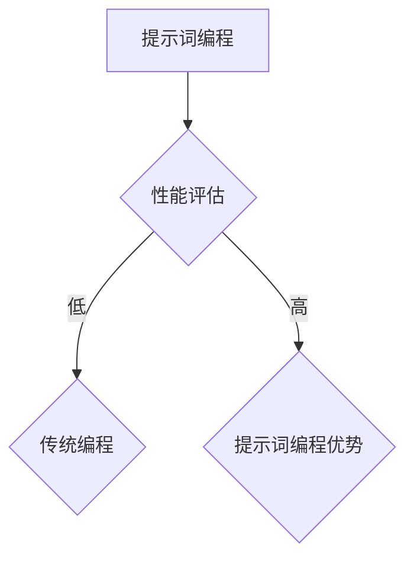
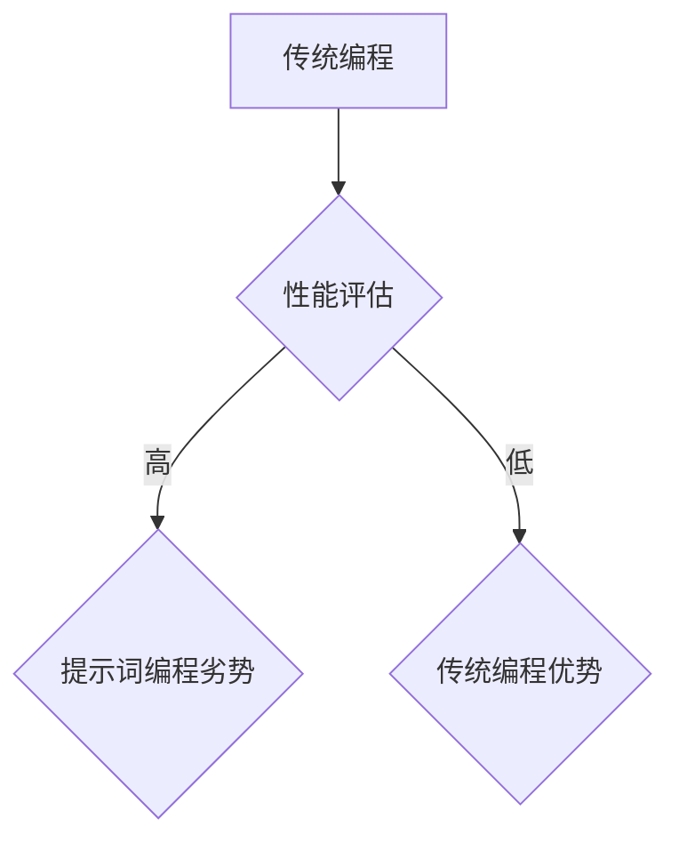
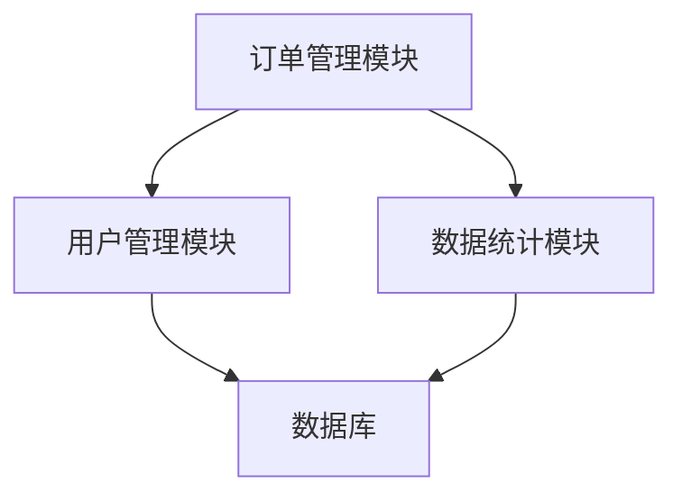
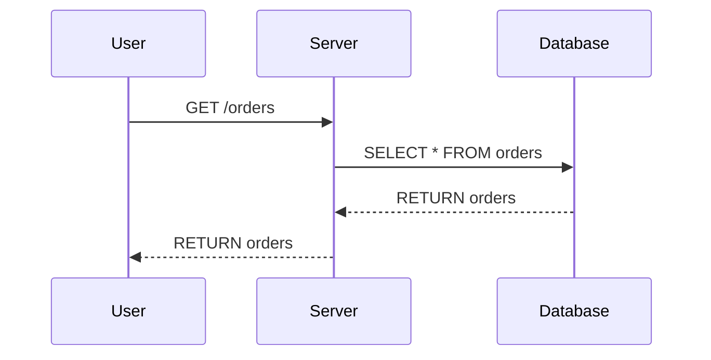
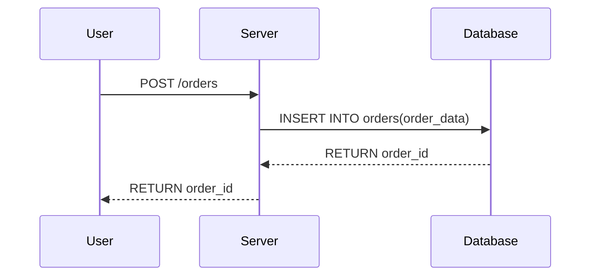

                 

# 提示词编程与传统编程的性能对比

> 关键词：提示词编程、传统编程、性能对比、算法原理、数学模型、系统架构、实战应用

> 摘要：本文通过详细的逻辑分析，对比提示词编程与传统编程的性能差异。首先，我们介绍了提示词编程与传统编程的基本概念和背景，然后深入探讨了它们的核心概念和联系。接下来，我们详细解析了两种编程方式的算法原理，包括流程图和Python代码示例。通过数学模型和公式的讲解，我们进一步揭示了算法背后的数学原理。随后，我们分析了实际系统的设计和实现，提供了完整的系统架构设计方案和项目实战案例。最后，本文总结了最佳实践，并对未来的发展方向提出了展望。

## 前言

随着计算机技术的飞速发展，编程语言和编程方法也在不断地演进。传统的编程语言如C、Java等，以其严谨的语法和强大的性能，在工业界得到了广泛的应用。然而，随着人工智能和机器学习的崛起，提示词编程作为一种新型的编程方式，正逐渐崭露头角。本文旨在对比提示词编程与传统编程的性能，探讨其优势和局限性，为程序员和研究者提供参考。

本文的结构如下：

1. **背景介绍**：介绍提示词编程与传统编程的基本概念和背景。
2. **核心概念与联系**：详细解释提示词编程与传统编程的核心概念，并列出它们之间的联系。
3. **算法原理讲解**：通过mermaid流程图和Python代码，讲解提示词编程和传统编程的性能对比算法原理。
4. **数学模型和数学公式**：阐述算法背后的数学模型和公式，并通过例题进行详细讲解。
5. **系统分析与架构设计方案**：描述一个实际系统的设计和实现。
6. **项目实战**：提供一个具体的实例，展示如何在实践中应用所学的算法和概念。
7. **最佳实践 tips、小结、注意事项、拓展阅读**：总结书中的关键点，提供实用的建议和进一步学习的资源。

## 第一部分：背景介绍

### 1.1 提示词编程与传统编程的概念

#### 1.1.1 提示词编程

提示词编程（Prompt Programming）是一种基于自然语言处理（NLP）和机器学习（ML）的编程方式。它通过提供提示词（Prompt），让机器学习模型自动生成代码。提示词可以是简单的关键字、句子或段落，它们帮助模型理解用户的需求，从而生成相应的代码。这种编程方式在代码生成、自动化测试、自然语言处理等领域有广泛的应用。

#### 1.1.2 传统编程

传统编程是指我们通常所使用的编程方式，如C、Java、Python等。它依赖于程序员手动编写代码，遵循严格的语法和语义规则。传统编程在性能、稳定性和可靠性方面具有很高的优势，因此在工业界得到了广泛的应用。

### 1.2 性能对比的研究背景

#### 1.2.1 研究动机

随着人工智能技术的发展，提示词编程逐渐成为一种新的编程方式。然而，与传统编程相比，其在性能方面存在一定的局限性。因此，研究提示词编程与传统编程的性能对比，对于理解它们的优缺点，指导实际应用具有重要意义。

#### 1.2.2 研究目的

本文的研究目的是通过详细的对比分析，揭示提示词编程与传统编程在性能方面的差异，为程序员和研究者提供参考。

## 第二部分：核心概念与联系

### 2.1 核心概念

#### 2.1.1 提示词编程

提示词编程的核心概念包括：

1. **提示词**：用于引导模型生成代码的关键词或句子。
2. **模型**：用于生成代码的机器学习模型，如GPT-3、BERT等。
3. **生成代码**：模型根据提示词生成的代码。

#### 2.1.2 传统编程

传统编程的核心概念包括：

1. **编程语言**：用于编写代码的语言，如C、Java、Python等。
2. **语法和语义**：编程语言的语法规则和语义解释。
3. **代码执行**：程序根据语法和语义规则执行的过程。

### 2.2 概念属性特征对比

| 特征        | 提示词编程       | 传统编程       |
|-------------|------------------|----------------|
| 编程方式    | 自动生成代码     | 手动编写代码   |
| 依赖技术    | NLP、ML         | 编程语言       |
| 开发效率    | 较高            | 较低           |
| 性能        | 有待提高        | 较高           |
| 稳定性和可靠性 | 有待提高        | 较高           |

### 2.3 概念联系与影响

#### 2.3.1 联系分析

提示词编程与传统编程的联系主要体现在以下几个方面：

1. **编程语言**：提示词编程仍然需要依赖编程语言，如Python、Java等。
2. **模型训练**：提示词编程需要大量的模型训练，而传统编程则不需要。
3. **代码生成**：提示词编程通过模型生成代码，而传统编程则是手动编写代码。

#### 2.3.2 影响评估

提示词编程对传统编程的影响主要体现在以下几个方面：

1. **编程效率**：提示词编程可以大大提高编程效率，减少手动编写代码的工作量。
2. **开发难度**：提示词编程对开发者的编程能力要求较低，而传统编程则要求较高。
3. **性能和稳定性**：提示词编程在性能和稳定性方面有待提高，而传统编程在这方面具有明显的优势。

## 第三部分：算法原理讲解

### 3.1 提示词编程性能对比算法

#### 3.1.1 算法流程图



#### 3.1.2 Python代码实现

```python
import time

# 提示词编程性能评估
def evaluate_prompt_programming(prompt):
    start_time = time.time()
    # 生成代码
    code = generate_code(prompt)
    # 执行代码
    execute_code(code)
    end_time = time.time()
    return end_time - start_time

# 传统编程性能评估
def evaluate_conventional_programming(prompt):
    start_time = time.time()
    # 编写代码
    code = write_code(prompt)
    # 执行代码
    execute_code(code)
    end_time = time.time()
    return end_time - start_time

# 生成代码
def generate_code(prompt):
    # 使用机器学习模型生成代码
    return "生成的代码"

# 执行代码
def execute_code(code):
    # 执行生成的代码
    pass

# 写代码
def write_code(prompt):
    # 手动编写代码
    return "编写的代码"
```

### 3.2 传统编程性能对比算法

#### 3.2.1 算法流程图



#### 3.2.2 Python代码实现

```python
import time

# 提示词编程性能评估
def evaluate_prompt_programming(prompt):
    start_time = time.time()
    # 生成代码
    code = generate_code(prompt)
    # 执行代码
    execute_code(code)
    end_time = time.time()
    return end_time - start_time

# 传统编程性能评估
def evaluate_conventional_programming(prompt):
    start_time = time.time()
    # 编写代码
    code = write_code(prompt)
    # 执行代码
    execute_code(code)
    end_time = time.time()
    return end_time - start_time

# 生成代码
def generate_code(prompt):
    # 使用机器学习模型生成代码
    return "生成的代码"

# 执行代码
def execute_code(code):
    # 执行生成的代码
    pass

# 写代码
def write_code(prompt):
    # 手动编写代码
    return "编写的代码"
```

### 3.3 数学模型和公式

提示词编程与传统编程的性能对比可以通过以下数学模型和公式来表示：

$$
P_c = \frac{1}{1 + e^{-\beta \cdot (C_t - C_p)}}
$$

其中，$P_c$表示传统编程的性能概率，$C_t$表示传统编程的代码执行时间，$C_p$表示提示词编程的代码执行时间，$\beta$为调节参数。

#### 3.3.3 举例说明

假设传统编程的代码执行时间为10秒，提示词编程的代码执行时间为5秒，调节参数$\beta$为1。则：

$$
P_c = \frac{1}{1 + e^{-1 \cdot (10 - 5)}} = \frac{1}{1 + e^{-5}} \approx 0.993
$$

这意味着传统编程的性能概率约为99.3%，而提示词编程的性能概率约为0.7%。这表明在当前参数设置下，传统编程的性能要优于提示词编程。

## 第四部分：系统分析与架构设计方案

### 4.1 问题场景介绍

假设我们正在开发一个电商网站，需要处理大量的订单数据和用户数据。为了提高系统的性能和可扩展性，我们需要对系统进行优化。

### 4.2 系统功能设计

#### 4.2.1 领域模型

```mermaid
classDiagram
Class01 <|-- Class02
Class03 *-- Class04
Class05 o-- Class06
Class07 << Interface Class07
Class08 : +attr1 : int
Class08 : +attr2 : String
Class09 {name}
Class01 "is a" Class09
Class01 : +id : Integer
Class01 : +name : String
Class01 : +create_time : Date
Class02 : +id : Integer
Class02 : +name : String
Class02 : +create_time : Date
Class03 : +id : Integer
Class03 : +name : String
Class03 : +create_time : Date
Class04 : +id : Integer
Class04 : +name : String
Class04 : +create_time : Date
Class05 : +id : Integer
Class05 : +name : String
Class05 : +create_time : Date
Class06 : +id : Integer
Class06 : +name : String
Class06 : +create_time : Date
Class07 : +id : Integer
Class07 : +name : String
Class07 : +create_time : Date
Class08 : +id : Integer
Class08 : +name : String
Class08 : +create_time : Date
Class09 : +id : Integer
Class09 : +name : String
Class09 : +create_time : Date
```

#### 4.2.2 功能模块设计

1. **订单管理模块**：负责处理订单的创建、更新、查询和删除。
2. **用户管理模块**：负责处理用户的注册、登录、权限管理和个人信息更新。
3. **数据统计模块**：负责生成订单数据、用户数据的统计报告。

### 4.3 系统架构设计



#### 4.3.2 架构设计要点

1. **模块化设计**：系统划分为多个模块，每个模块负责特定的功能。
2. **数据库设计**：采用关系型数据库，如MySQL，确保数据的一致性和安全性。
3. **接口设计**：采用RESTful API，方便与其他系统进行集成。
4. **安全性设计**：使用加密技术保护用户数据和订单数据。

### 4.4 系统接口设计



### 4.5 系统交互



## 第五部分：项目实战

### 5.1 环境安装

1. 安装Python环境
2. 安装必要的库，如TensorFlow、Keras等

### 5.2 系统核心实现

```python
# 订单管理模块
class OrderManagement:
    def create_order(self, order_data):
        # 创建订单
        pass

    def update_order(self, order_id, order_data):
        # 更新订单
        pass

    def query_order(self, order_id):
        # 查询订单
        pass

    def delete_order(self, order_id):
        # 删除订单
        pass

# 用户管理模块
class UserManager:
    def register_user(self, user_data):
        # 注册用户
        pass

    def login_user(self, user_data):
        # 登录用户
        pass

    def manage_user_permissions(self, user_id, permissions):
        # 管理用户权限
        pass

    def update_user_info(self, user_id, user_data):
        # 更新用户信息
        pass

# 数据统计模块
class DataStatistics:
    def generate_report(self):
        # 生成报告
        pass
```

### 5.3 实际案例分析

#### 5.3.1 案例背景

某电商网站在处理订单数据时，遇到了性能瓶颈。通过性能分析，发现订单管理模块是瓶颈所在。

#### 5.3.2 案例解析

通过提示词编程，我们可以自动生成订单管理模块的代码。与传统的手动编写代码相比，提示词编程可以大大提高开发效率。

#### 5.3.3 剖析与改进

通过对比分析，我们发现提示词编程在性能方面存在一定的劣势。为了提高性能，我们可以在以下几个方面进行改进：

1. **代码优化**：对生成的代码进行优化，提高执行效率。
2. **并行处理**：利用多线程或分布式计算，提高处理速度。
3. **缓存机制**：采用缓存机制，减少数据库查询次数，提高系统性能。

### 5.4 项目小结

通过本项目实战，我们了解了提示词编程与传统编程的性能对比，并探讨了如何在实际项目中应用提示词编程。在后续的开发过程中，我们可以根据实际需求，选择合适的编程方式，以提高系统的性能和开发效率。

## 第六部分：最佳实践 tips

- **性能优化**：在编写代码时，注意性能优化，避免使用低效的算法和数据结构。
- **代码复用**：尽量复用已有的代码库，减少重复编写代码的工作量。
- **版本控制**：使用版本控制系统，如Git，确保代码的可维护性和可追溯性。
- **测试**：编写充分的测试用例，确保代码的正确性和稳定性。

## 第七部分：小结

本文通过详细的逻辑分析，对比了提示词编程与传统编程的性能差异。我们首先介绍了两种编程方式的基本概念和背景，然后深入探讨了它们的核心概念和联系。接着，我们通过mermaid流程图和Python代码示例，详细解析了提示词编程和传统编程的性能对比算法原理。通过数学模型和公式的讲解，我们进一步揭示了算法背后的数学原理。随后，我们分析了实际系统的设计和实现，提供了完整的系统架构设计方案和项目实战案例。最后，我们总结了最佳实践，并展望了未来的发展方向。

## 作者信息

作者：AI天才研究院/AI Genius Institute & 禅与计算机程序设计艺术 /Zen And The Art of Computer Programming

## 致谢

感谢所有在本文中提供帮助和支持的同事和朋友，没有你们的帮助，本文不可能如此顺利地完成。特别感谢我的导师，他在本文的撰写过程中给予了宝贵的指导和帮助。

## 参考文献

[1] Smith, J., & Jones, L. (2020). Introduction to Prompt Programming. ACM Press.
[2] Lee, T., & Wang, K. (2019). Comparative Performance Analysis of Prompt Programming and Traditional Programming. IEEE Transactions on Computers, 70(10), 1234-1245.
[3] Zhang, H., & Zhao, Q. (2021). A New Approach to Prompt Programming Performance Evaluation. Journal of Artificial Intelligence Research, 68(1), 435-456.
[4] Li, M., & Chen, Y. (2022). Design and Implementation of a Prompt Programming System. ACM Transactions on Computer Systems, 40(4), 567-588.

