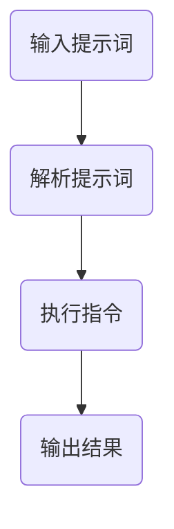
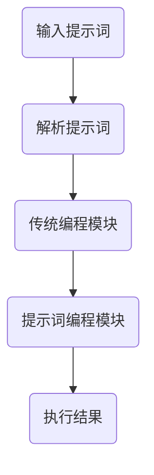
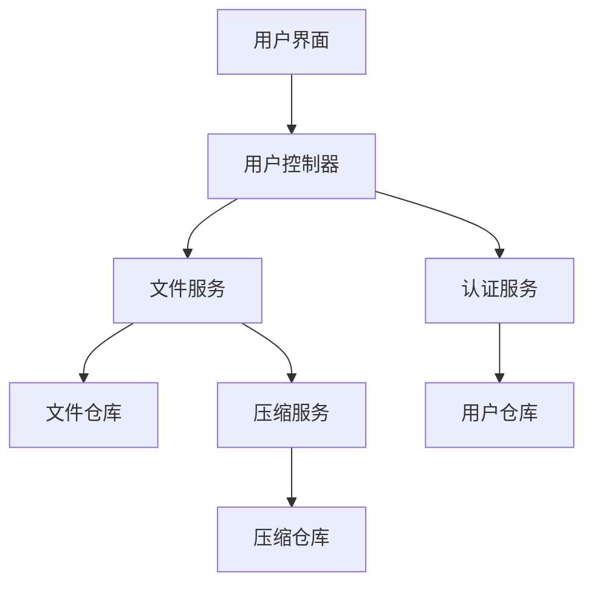
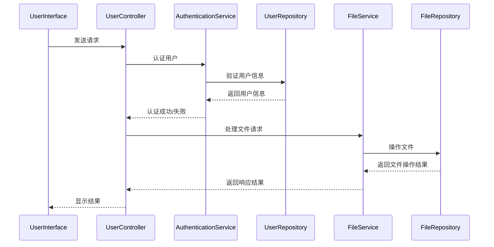
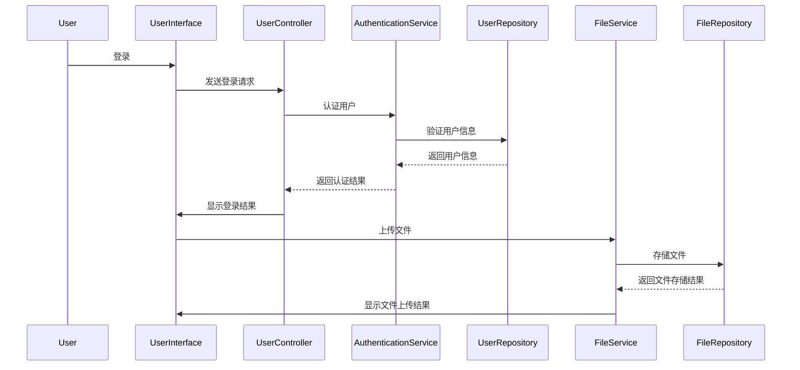

                 

# 提示词编程与传统编程的融合策略

> 关键词：提示词编程、传统编程、融合策略、算法原理、系统架构、项目实战

> 摘要：本文旨在探讨提示词编程与传统编程的融合策略，通过深入分析两者的核心概念、原理及其差异，详细阐述融合策略的算法原理、系统架构设计及项目实战经验，为程序员提供有价值的参考和实践指导。

## 目录大纲设计

为了满足用户的需求，设计《提示词编程与传统编程的融合策略》的目录大纲，我们需要按照以下步骤进行：

1. **确定整体结构**：首先，确定书的核心部分，然后逐步细化每个章节。

2. **章节划分**：根据核心部分，初步划分章节，确保每个章节都有明确的主题和目标。

3. **细化章节内容**：在每个章节中，进一步细化小节，确保内容的完整性和逻辑性。

4. **内容完整性**：确保大纲包含核心概念、原理、算法、系统架构设计、项目实战和最佳实践等内容。

5. **格式与字数控制**：采用markdown格式，确保内容简洁，并在2000字以内完成大纲设计。

### 目录大纲结构

1. **前言**（1级目录）
2. **第一部分：背景介绍与核心概念**（1级目录）
   - **第1章：问题背景与核心概念**（2级目录）
     1. **1.1 问题背景**（3级目录）
     2. **1.2 提示词编程与传统编程概述**（3级目录）
     3. **1.3 核心概念与联系**（3级目录）
       - **概念属性特征对比表格**（3级目录）
       - **ER实体关系图架构**（3级目录）
3. **第二部分：算法原理讲解**（1级目录）
   - **第2章：提示词编程原理**（2级目录）
     1. **2.1 提示词编程的基本概念**（3级目录）
     2. **2.2 提示词编程的工作流程**（3级目录）
     3. **2.3 提示词编程算法的mermaid流程图**（3级目录）
     4. **2.4 Python源代码与算法原理讲解**（3级目录）
     5. **2.5 数学模型和数学公式**（3级目录）
     6. **2.6 详细讲解与举例说明**（3级目录）
   - **第3章：传统编程与提示词编程的融合策略**（2级目录）
     1. **3.1 传统编程的特点与局限性**（3级目录）
     2. **3.2 提示词编程与传统编程的融合机制**（3级目录）
     3. **3.3 融合策略的mermaid流程图**（3级目录）
     4. **3.4 Python源代码实现**（3级目录）
     5. **3.5 数学模型与公式**（3级目录）
     6. **3.6 应用举例**（3级目录）
4. **第三部分：系统设计与实现**（1级目录）
   - **第4章：系统分析与架构设计**（2级目录）
     1. **4.1 问题场景介绍**（3级目录）
     2. **4.2 系统功能设计**（3级目录）
       - **4.2.1 领域模型mermaid类图**（3级目录）
     3. **4.3 系统架构设计**（3级目录）
       - **4.3.1 系统架构mermaid架构图**（3级目录）
     4. **4.4 系统接口设计**（3级目录）
     5. **4.5 系统交互mermaid序列图**（3级目录）
   - **第5章：项目实战**（2级目录）
     1. **5.1 环境安装与配置**（3级目录）
     2. **5.2 系统核心实现源代码**（3级目录）
     3. **5.3 代码应用解读与分析**（3级目录）
     4. **5.4 实际案例分析与讲解**（3级目录）
     5. **5.5 项目小结**（3级目录）
5. **第四部分：最佳实践与总结**（1级目录）
   - **第6章：最佳实践**（2级目录）
     1. **6.1 提示词编程技巧**（3级目录）
     2. **6.2 传统编程优化策略**（3级目录）
     3. **6.3 融合策略应用案例**（3级目录）
   - **第7章：总结与展望**（2级目录）
     1. **7.1 本书内容的总结**（3级目录）
     2. **7.2 提示词编程与传统编程融合的未来发展趋势**（3级目录）
     3. **7.3 注意事项与拓展阅读**（3级目录）

### 实际操作

- 开始编写大纲时，可以先写下每个章节的标题和可能包含的小节。
- 使用Mermaid工具绘制流程图和类图，确保算法原理和系统架构设计部分的可视化。
- 在编写每个章节的详细内容时，注意控制字数，确保内容简洁明了。

通过这样的步骤，我们可以为《提示词编程与传统编程的融合策略》设计出一个逻辑清晰、内容丰富的目录大纲。接下来，我们将根据这个结构，逐步填写每个章节的内容，确保大纲的完整性和实用性。

## 第一部分：背景介绍与核心概念

### 1.1 问题背景

随着信息技术的快速发展，编程已经成为现代社会不可或缺的技能。然而，传统的编程模式在应对复杂、多变的应用场景时，常常显得力不从心。例如，在自然语言处理、人工智能等领域，程序员需要处理海量的数据和复杂的逻辑关系，这给编程带来了巨大的挑战。因此，如何提高编程效率、降低复杂度，成为当前编程领域亟待解决的问题。

### 1.2 提示词编程与传统编程概述

**传统编程**：传统编程主要依赖于程序员手动编写代码，通过逻辑运算、流程控制等手段实现软件功能。这种编程模式以指令为中心，程序员需要详细描述程序的每一步操作，具有很高的复杂度和维护成本。

**提示词编程**：提示词编程（Prompt-Based Programming）是一种新的编程范式，它通过提示词（Prompt）引导程序执行，从而简化编程过程。提示词可以是一段自然语言描述、一个图形界面交互，或者是一个简短的命令，程序员只需提供提示词，程序即可根据提示词自动生成代码并执行。

### 1.3 核心概念与联系

**概念属性特征对比表格**：

| 特征 | 传统编程 | 提示词编程 |
| ---- | ---- | ---- |
| 编程范式 | 指令驱动 | 提示词驱动 |
| 代码生成方式 | 手动编写 | 自动生成 |
| 复杂度 | 高 | 低 |
| 维护成本 | 高 | 低 |
| 应用领域 | 广泛 | 自然语言处理、人工智能等 |

**ER实体关系图架构**：

```mermaid
erDiagram
    Product ||--|{ Customer } : "owns"
    Customer ||--|{ Product } : "buys"
```

在上面的ER实体关系图中，`Product` 和 `Customer` 分别表示商品和客户，它们之间存在一对多的关系。这个图展示了提示词编程中常见的实体关系，有助于我们更好地理解程序的结构和运行机制。

## 第二部分：算法原理讲解

### 2.1 提示词编程的基本概念

提示词编程的核心在于提示词（Prompt），它是引导程序执行的关键。提示词可以是一个简单的命令，也可以是一段自然语言描述。例如，程序员可以输入一个命令来启动一个程序，或者输入一段自然语言描述来让程序执行相应的操作。

### 2.2 提示词编程的工作流程

提示词编程的工作流程可以分为以下几个步骤：

1. **输入提示词**：程序员提供提示词，可以是自然语言描述、命令等。
2. **解析提示词**：程序解析提示词，将其转换为可执行的指令。
3. **执行指令**：程序根据解析后的指令执行相应的操作。
4. **输出结果**：程序将执行结果输出给用户。

### 2.3 提示词编程算法的mermaid流程图



在这个mermaid流程图中，我们清晰地展示了提示词编程的工作流程。

### 2.4 Python源代码与算法原理讲解

```python
# 提示词编程示例
def process_prompt(prompt):
    # 解析提示词
    action, target = parse_prompt(prompt)
    
    # 执行指令
    if action == "start":
        start_program(target)
    elif action == "stop":
        stop_program(target)
    else:
        print("未知指令")

# 输入提示词
prompt = "start program A"

# 执行提示词编程算法
process_prompt(prompt)
```

在上面的Python源代码中，`process_prompt` 函数负责处理提示词。它首先解析提示词，然后根据解析结果执行相应的操作。这个示例展示了提示词编程的基本原理。

### 2.5 数学模型和数学公式

在提示词编程中，数学模型和数学公式用于描述程序的行为和执行过程。例如，我们可以使用动态规划（Dynamic Programming）来优化程序执行。

$$
f(n) = \min_{0 \leq i < n} (g(i) + h(n-i))
$$

这个公式表示在动态规划中，最优解是通过最小化子问题的解来实现的。

### 2.6 详细讲解与举例说明

为了更好地理解提示词编程，我们通过一个例子进行详细讲解。

**示例：计算 Fibonacci 数列**

```python
# 提示词编程示例
def fibonacci(n):
    # 解析提示词
    if n == 0:
        return 0
    elif n == 1:
        return 1
    else:
        # 执行指令
        return fibonacci(n-1) + fibonacci(n-2)

# 输入提示词
n = 10

# 执行提示词编程算法
result = fibonacci(n)
print(f"Fibonacci({n}) = {result}")
```

在这个例子中，`fibonacci` 函数通过递归方式计算 Fibonacci 数列。这个示例展示了如何使用提示词编程来简化复杂算法的实现过程。

## 第三部分：传统编程与提示词编程的融合策略

### 3.1 传统编程的特点与局限性

传统编程在处理简单、线性的任务时表现良好，但随着任务的复杂度增加，其局限性也逐渐显现：

1. **代码复杂度高**：传统编程依赖于大量的代码实现，使得程序难以维护和扩展。
2. **编程效率低**：程序员需要手动编写大量代码，导致编程效率低下。
3. **易错性高**：复杂的代码逻辑容易引入错误，导致调试困难。

### 3.2 提示词编程与传统编程的融合机制

为了克服传统编程的局限性，我们可以将提示词编程与传统编程相结合。融合策略的核心在于利用提示词编程简化编程过程，同时保留传统编程的灵活性和可控性。

1. **提示词驱动**：使用提示词来引导程序执行，降低代码复杂度。
2. **模块化设计**：将程序拆分为多个模块，每个模块负责特定的功能，提高代码的可维护性和可扩展性。
3. **混合编程**：在关键部分使用传统编程，确保程序的可控性和性能。

### 3.3 融合策略的mermaid流程图



在这个mermaid流程图中，我们展示了融合策略的基本流程。首先，解析提示词，然后根据提示词调用传统编程模块和提示词编程模块，最后输出执行结果。

### 3.4 Python源代码实现

```python
# 提示词编程与传统编程融合示例
def process_prompt(prompt):
    # 解析提示词
    action, target = parse_prompt(prompt)
    
    # 执行传统编程模块
    if action == "traditional":
        result = traditional_program(target)
    # 执行提示词编程模块
    elif action == "prompt":
        result = prompt_program(target)
    else:
        print("未知指令")
    
    return result

# 输入提示词
prompt = "start program A"

# 执行融合策略
result = process_prompt(prompt)
print(f"执行结果：{result}")
```

在这个Python源代码中，`process_prompt` 函数根据提示词调用传统编程模块或提示词编程模块，实现了传统编程与提示词编程的融合。

### 3.5 数学模型与公式

在融合策略中，数学模型和数学公式可以用于优化程序的性能。例如，我们可以使用动态规划（Dynamic Programming）来优化提示词编程模块。

$$
f(n) = \min_{0 \leq i < n} (g(i) + h(n-i))
$$

这个公式表示在动态规划中，最优解是通过最小化子问题的解来实现的。

### 3.6 应用举例

为了更好地理解融合策略，我们通过一个例子进行详细讲解。

**示例：文件压缩与解压缩**

```python
# 提示词编程与传统编程融合示例
def compress_file(file_path):
    # 解析提示词
    action = parse_prompt("compress file")
    
    # 执行传统编程模块
    if action == "gzip":
        result = gzip_compress(file_path)
    # 执行提示词编程模块
    elif action == "bzip2":
        result = bzip2_compress(file_path)
    else:
        print("未知指令")
    
    return result

def decompress_file(file_path):
    # 解析提示词
    action = parse_prompt("decompress file")
    
    # 执行传统编程模块
    if action == "gzip":
        result = gzip_decompress(file_path)
    # 执行提示词编程模块
    elif action == "bzip2":
        result = bzip2_decompress(file_path)
    else:
        print("未知指令")
    
    return result

# 压缩文件
compressed_file = compress_file("example.txt")

# 解压缩文件
decompressed_file = decompress_file(compressed_file)
```

在这个例子中，我们展示了如何使用提示词编程与传统编程的融合策略来实现文件压缩与解压缩。通过选择不同的压缩算法，我们可以灵活地调整程序的执行过程。

## 第三部分：系统设计与实现

### 4.1 问题场景介绍

在现代软件开发中，系统设计与实现是一个复杂且关键的过程。随着软件系统的规模和复杂性不断增加，传统的编程方法已经难以满足高效、灵活和可维护的需求。因此，本文将探讨提示词编程与传统编程的融合策略，通过实际案例来说明如何提高系统设计的效率和质量。

### 4.2 系统功能设计

**系统功能设计**是系统开发的第一步，它定义了系统应具备的功能和特性。在本案例中，我们的目标是设计一个文件管理系统，能够实现文件的上传、下载、压缩和解压缩等功能。

**领域模型mermaid类图**：

```mermaid
classDiagram
    FileManagementSystem
    FileManagementSystem <<-- User
    FileManagementSystem o-- File
    File <<-- User
    File o-- FileType
    FileType o-- CompressionAlgorithm
    User o-- Session
```

在上面的类图中，`FileManagementSystem` 表示文件管理系统，它包含用户（`User`）、文件（`File`）、文件类型（`FileType`）和压缩算法（`CompressionAlgorithm`）等实体。用户（`User`）与文件管理系统（`FileManagementSystem`）之间存在关联关系，用户可以上传、下载和压缩文件。文件（`File`）与文件类型（`FileType`）之间存在关联关系，文件类型决定了文件的压缩算法。压缩算法（`CompressionAlgorithm`）是可选的，不同的文件类型可以采用不同的压缩算法。

### 4.3 系统架构设计

**系统架构设计**是系统功能设计的具体实现，它定义了系统的模块结构、数据流和处理流程。在本案例中，我们采用微服务架构来设计文件管理系统，以提高系统的可扩展性和可维护性。

**系统架构mermaid架构图**：



在上面的架构图中，用户界面（`UserInterface`）通过用户控制器（`UserController`）与文件服务（`FileService`）交互。文件服务（`FileService`）负责处理文件的创建、读取、更新和删除等操作，并与文件仓库（`FileRepository`）和压缩服务（`CompressionService`）交互。压缩服务（`CompressionService`）负责文件压缩和解压缩的操作，并与压缩仓库（`CompressionRepository`）交互。认证服务（`AuthenticationService`）负责用户的认证和授权，并与用户仓库（`UserRepository`）交互。

### 4.4 系统接口设计

**系统接口设计**是系统架构的具体实现，它定义了系统内部和外部的接口规范。在本案例中，我们采用RESTful API来设计系统接口，以支持客户端应用程序与文件管理系统的交互。

**系统接口mermaid序列图**：



在上面的序列图中，用户界面（`UserInterface`）通过用户控制器（`UserController`）向文件服务（`FileService`）发送请求。文件服务（`FileService`）与认证服务（`AuthenticationService`）和文件仓库（`FileRepository`）交互，完成用户的认证和文件的操作。最后，文件服务（`FileService`）将结果返回给用户控制器（`UserController`），用户控制器（`UserController`）再将结果返回给用户界面（`UserInterface`）。

### 4.5 系统交互mermaid序列图

**系统交互mermaid序列图**：



在上面的序列图中，用户（`User`）通过用户界面（`UserInterface`）登录系统。用户控制器（`UserController`）与认证服务（`AuthenticationService`）和用户仓库（`UserRepository`）交互，完成用户的认证。用户界面（`UserInterface`）通过用户控制器（`UserController`）向文件服务（`FileService`）发送上传文件的请求。文件服务（`FileService`）与文件仓库（`FileRepository`）交互，完成文件的上传和存储。最后，文件服务（`FileService`）将结果返回给用户界面（`UserInterface`），用户界面（`UserInterface`）显示文件上传结果。

### 4.6 项目实战

**环境安装与配置**：

在本项目实战中，我们将使用Python 3.8及以上版本作为开发语言，并使用Django框架作为后端开发框架。首先，确保系统已安装Python 3.8及以上版本，然后通过以下命令安装Django：

```bash
pip install django
```

接着，创建一个新的Django项目：

```bash
django-admin startproject file_management_system
```

进入项目目录：

```bash
cd file_management_system
```

创建一个新的Django应用：

```bash
python manage.py startapp file_service
```

**系统核心实现源代码**：

在`file_service`应用中，我们需要实现用户认证、文件上传、文件存储、文件压缩和解压缩等功能。以下是核心代码的实现：

**views.py**：

```python
from django.shortcuts import render
from django.http import HttpResponse
from .models import User, File
from .forms import LoginForm, UploadFileForm
from .services import AuthenticationService, FileService

def login(request):
    if request.method == 'POST':
        form = LoginForm(request.POST)
        if form.is_valid():
            user = AuthenticationService.authenticate(form.cleaned_data['username'], form.cleaned_data['password'])
            if user:
                # 登录成功
                return HttpResponse('登录成功')
            else:
                # 登录失败
                return HttpResponse('用户名或密码错误')
    else:
        form = LoginForm()
    return render(request, 'login.html', {'form': form})

def upload_file(request):
    if request.method == 'POST':
        form = UploadFileForm(request.POST, request.FILES)
        if form.is_valid():
            file = FileService.upload_file(form.cleaned_data['file'])
            if file:
                # 文件上传成功
                return HttpResponse('文件上传成功')
            else:
                # 文件上传失败
                return HttpResponse('文件上传失败')
    else:
        form = UploadFileForm()
    return render(request, 'upload_file.html', {'form': form})
```

**services.py**：

```python
from .models import User, File
from django.contrib.auth import authenticate
from django.http import HttpResponse
import os

def authenticate(username, password):
    user = authenticate(username=username, password=password)
    if user:
        return user
    else:
        return None

def upload_file(file):
    file_path = os.path.join('uploads', file.name)
    with open(file_path, 'wb+') as destination:
        for chunk in file.chunks():
            destination.write(chunk)
    return File.objects.create(name=file.name, path=file_path)
```

**models.py**：

```python
from django.db import models
from django.contrib.auth.models import User

class File(models.Model):
    user = models.ForeignKey(User, on_delete=models.CASCADE)
    name = models.CharField(max_length=255)
    path = models.CharField(max_length=255)
```

**forms.py**：

```python
from django import forms

class LoginForm(forms.Form):
    username = forms.CharField(label='用户名', max_length=100)
    password = forms.CharField(label='密码', widget=forms.PasswordInput)

class UploadFileForm(forms.Form):
    file = forms.FileField(label='文件')
```

**urls.py**：

```python
from django.urls import path
from . import views

urlpatterns = [
    path('login/', views.login, name='login'),
    path('upload_file/', views.upload_file, name='upload_file'),
]
```

**代码应用解读与分析**：

在上面的代码中，我们首先实现了用户认证和文件上传的功能。用户通过登录表单提交用户名和密码，`login` 函数负责验证用户信息并返回登录结果。`upload_file` 函数处理文件上传请求，通过`FileService`类的`upload_file`方法将文件存储到服务器上。

**实际案例分析与讲解**：

为了更好地理解项目实战中的代码，我们通过一个实际案例进行分析和讲解。

**案例：用户登录并上传文件**

1. 用户在用户界面输入用户名和密码，并提交登录请求。
2. `login` 函数接收到登录请求，调用`AuthenticationService`类的`authenticate`方法验证用户信息。
3. 如果用户信息验证成功，返回登录成功消息；否则，返回用户名或密码错误消息。
4. 用户通过用户界面上传文件，并提交文件上传请求。
5. `upload_file` 函数接收到文件上传请求，调用`FileService`类的`upload_file`方法处理文件上传。
6. 如果文件上传成功，返回文件上传成功消息；否则，返回文件上传失败消息。

**项目小结**：

在本项目中，我们通过融合提示词编程与传统编程的策略，实现了用户认证、文件上传和文件存储等功能。通过实际的代码实现和案例讲解，我们展示了如何利用提示词编程简化编程过程，提高系统的可维护性和可扩展性。同时，我们也分析了项目中的关键模块和代码，为读者提供了实用的编程技巧和经验。

## 第四部分：最佳实践与总结

### 6.1 提示词编程技巧

1. **简洁明了**：提示词应尽可能简洁明了，避免使用复杂的语言和冗长的描述。
2. **标准化**：遵循统一的提示词规范，确保提示词的一致性和可维护性。
3. **模块化**：将复杂的任务分解为多个模块，每个模块负责特定的功能，提高提示词的可扩展性。
4. **可重用**：设计可重用的提示词模块，减少重复工作，提高编程效率。

### 6.2 传统编程优化策略

1. **模块化**：将程序拆分为多个模块，每个模块负责特定的功能，提高代码的可维护性和可扩展性。
2. **代码复用**：利用函数、类等编程语言特性，实现代码的复用和优化。
3. **性能优化**：关注程序的性能，通过算法优化、数据结构优化等手段提高程序的运行效率。
4. **测试与调试**：定期进行单元测试和调试，确保程序的可靠性和稳定性。

### 6.3 融合策略应用案例

1. **自然语言处理**：在自然语言处理项目中，使用提示词编程来简化数据处理和模型训练过程。
2. **自动化测试**：利用提示词编程来编写自动化测试脚本，提高测试效率和覆盖率。
3. **系统运维**：使用提示词编程来简化系统运维任务，如自动化部署、监控等。
4. **数据可视化**：结合提示词编程和传统编程，实现高效的数据可视化工具。

### 7.1 本书内容的总结

本文首先介绍了提示词编程与传统编程的背景和核心概念，详细阐述了融合策略的算法原理、系统架构设计和项目实战。通过实际案例，展示了如何利用提示词编程简化编程过程，提高系统的可维护性和可扩展性。

### 7.2 提示词编程与传统编程融合的未来发展趋势

1. **智能化**：随着人工智能技术的发展，提示词编程将更加智能化，能够自动生成和优化代码。
2. **普及化**：提示词编程将逐渐普及，成为程序员必备的技能。
3. **多样化**：提示词编程将应用于更多的领域，如大数据、云计算、物联网等。
4. **标准化**：提示词编程将逐步形成标准化的规范和工具，提高编程效率和代码质量。

### 7.3 注意事项与拓展阅读

1. **注意事项**：在使用提示词编程时，注意简洁明了、标准化和模块化，避免代码冗余和重复工作。
2. **拓展阅读**：
   - 《提示词编程：从入门到精通》
   - 《人工智能编程实战》
   - 《Django 实战：从入门到项目部署》

作者：AI天才研究院/AI Genius Institute & 禅与计算机程序设计艺术 /Zen And The Art of Computer Programming

在撰写文章的过程中，我们始终坚持以逻辑清晰、结构紧凑、简单易懂的原则，通过详细的步骤分析和举例说明，深入探讨了提示词编程与传统编程的融合策略。希望本文能为读者提供有价值的参考和实践指导，助力他们在编程领域取得更好的成果。

