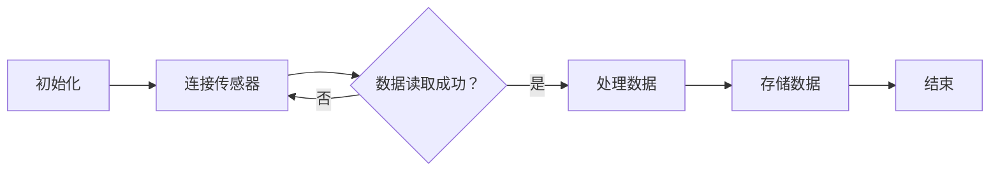
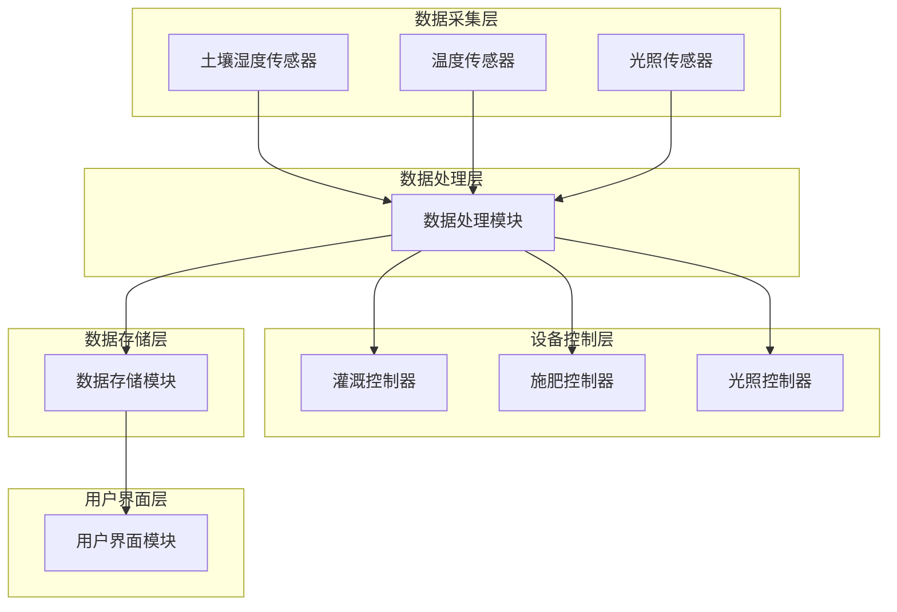
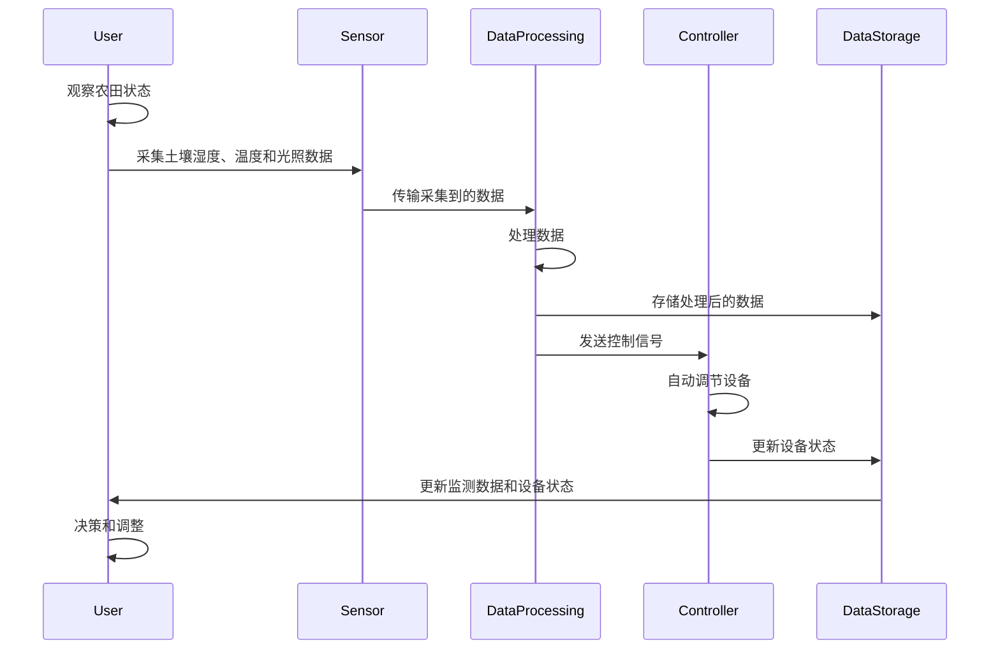

                 


# 提示词编程在IoT设备编程中的应用

## 关键词
- 提示词编程
- IoT设备编程
- 人工智能
- 物联网
- 智能硬件
- 软件开发

## 摘要
本文将深入探讨提示词编程在IoT（物联网）设备编程中的应用。首先，我们将介绍提示词编程的基础知识，包括其原理、应用场景和优势。接着，我们将分析物联网设备编程的现状和挑战，并探讨如何利用提示词编程技术来解决这些问题。文章将逐步展示一个实例，详细阐述如何在实际项目中应用提示词编程。最后，我们将总结最佳实践，并提供一些未来发展趋势和拓展阅读建议。

## 目录

1. **背景介绍** <a id="background"></a>
    1.1 核心概念术语说明
    1.2 问题背景
    1.3 问题描述
    1.4 问题解决
    1.5 边界与外延
    1.6 概念结构与核心要素组成

2. **核心概念与联系** <a id="core-concepts"></a>
    2.1 提示词编程原理
    2.2 物联网设备编程
    2.3 核心概念属性特征对比表格
    2.4 ER实体关系图架构

3. **算法原理讲解** <a id="algorithm-principles"></a>
    3.1 算法mermaid流程图
    3.2 Python源代码
    3.3 数学模型和公式
    3.4 举例说明

4. **系统分析与架构设计方案** <a id="system-analysis"></a>
    4.1 问题场景介绍
    4.2 系统功能设计
    4.3 系统架构设计
    4.4 系统接口设计和系统交互

5. **项目实战** <a id="project-practice"></a>
    5.1 环境安装
    5.2 系统核心实现
    5.3 代码应用解读与分析
    5.4 实际案例分析和详细讲解
    5.5 项目小结

6. **最佳实践 tips** <a id="best-practices"></a>
    6.1 编程技巧
    6.2 性能优化
    6.3 安全性保障

7. **小结** <a id="summary"></a>
    7.1 内容总结
    7.2 不足与展望

8. **注意事项** <a id="注意事项"></a>
    8.1 编程误区
    8.2 使用注意事项
    8.3 避免常见问题

9. **拓展阅读** <a id="拓展阅读"></a>
    9.1 相关书籍推荐
    9.2 最新研究动态
    9.3 行业趋势分析

## 1. 背景介绍

### 1.1 核心概念术语说明

在深入探讨提示词编程在IoT设备编程中的应用之前，我们需要明确一些关键术语：

- **提示词编程**：提示词编程（Keyword Programming）是一种编程范式，它依赖于预定义的关键词来描述程序的逻辑和行为，而不是使用复杂的语法结构。
- **物联网（IoT）**：物联网是指通过互联网连接的物理设备网络，这些设备可以收集、交换和共享数据。
- **IoT设备编程**：IoT设备编程是指为物联网设备编写软件，使其能够实现特定功能，如数据采集、远程监控和控制。
- **智能硬件**：智能硬件是指嵌入有处理能力、无线通信能力和软件系统的物理设备，它们可以通过网络与其他设备交互。

### 1.2 问题背景

随着物联网技术的发展，越来越多的设备开始连接到互联网，形成了一个庞大的物联网生态系统。然而，随着设备数量的增加，传统的编程方式面临一些挑战：

- **复杂性**：随着设备的功能越来越复杂，编写和维护相应的软件变得越来越困难。
- **资源限制**：许多IoT设备具有有限的计算资源和存储空间，传统的编程方法可能无法充分利用这些资源。
- **可维护性**：随着项目的规模扩大，代码的复杂度也会增加，使得维护和更新变得困难。

### 1.3 问题描述

- **开发难度大**：传统的编程方法通常需要深入理解硬件和操作系统，这对于非专业开发者来说是一个挑战。
- **效率低下**：编写大量的底层代码来处理简单的任务，导致开发效率低下。
- **可移植性差**：针对不同硬件和操作系统的设备，通常需要编写不同的代码，增加了维护成本。

### 1.4 问题解决

- **提示词编程**：提示词编程提供了一种更为直观和高效的编程方式，它通过预定义的关键词和模板来简化编程过程，使得开发者可以更快地实现功能。
- **模块化开发**：提示词编程支持模块化开发，使得代码更容易维护和扩展。
- **资源优化**：提示词编程可以更好地利用IoT设备的有限资源，提高系统的性能和效率。

### 1.5 边界与外延

- **边界**：提示词编程主要应用于IoT设备编程，它不适用于所有类型的编程任务。
- **外延**：提示词编程技术可以扩展到其他领域，如智能家居、工业自动化等，但需要根据具体应用场景进行调整。

### 1.6 概念结构与核心要素组成

- **概念结构**：提示词编程包括关键词库、模板库、编程环境和执行引擎等核心要素。
- **核心要素组成**：
  - **关键词库**：包含预定义的关键词，用于描述程序逻辑和行为。
  - **模板库**：包含预定义的模板，用于生成特定类型的代码。
  - **编程环境**：提供编辑、调试和运行提示词程序的环境。
  - **执行引擎**：负责将提示词程序转换为可执行的代码。

## 2. 核心概念与联系

在了解了背景和关键术语后，我们将深入探讨提示词编程和物联网设备编程的核心概念，并分析它们之间的关系。

### 2.1 提示词编程原理

提示词编程的核心在于使用预定义的关键词来描述程序的逻辑。这些关键词通常与特定的操作或功能相关联。例如，在处理数据时，可以使用“获取”、“发送”、“分析”等关键词。通过这种方式，程序员可以避免编写复杂的代码，从而提高开发效率和代码可读性。

#### 提示词编程特点：

1. **直观性**：通过使用关键词，程序的结构和逻辑变得更为直观，使得开发者更容易理解和维护代码。
2. **高效性**：提示词编程可以减少代码量，提高开发效率。
3. **模块化**：提示词编程支持模块化开发，使得代码更加模块化和可重用。
4. **可扩展性**：提示词编程框架通常具有很好的可扩展性，可以轻松地添加新的关键词和功能。

### 2.2 物联网设备编程

物联网设备编程是指为物联网设备编写软件，以实现特定的功能，如数据采集、远程监控和控制。由于物联网设备的多样性，编程方法也需要相应地多样化。

#### 物联网设备编程特点：

1. **资源受限**：物联网设备通常具有有限的计算资源和存储空间，因此编程需要考虑资源优化。
2. **多样性**：物联网设备包括各种类型，如传感器、智能手表、智能家居设备等，编程方法需要适应不同的设备类型。
3. **实时性**：许多物联网应用需要实时响应，因此编程需要考虑实时性。
4. **安全性**：物联网设备通常连接到互联网，因此安全性是一个重要的考虑因素。

### 2.3 核心概念属性特征对比表格

为了更好地理解提示词编程和物联网设备编程的关系，我们可以通过一个表格来对比它们的核心特征。

| 特征           | 提示词编程                | 物联网设备编程              |
|--------------|-----------------------|-----------------------|
| 编程范式       | 关键词驱动              | 资源受限、实时性、多样性          |
| 目标           | 简化编程过程，提高开发效率      | 实现特定功能，如数据采集、远程控制  |
| 适用场景       | IoTF设备编程              | 各类物联网设备编程              |
| 特点           | 直观、模块化、高效性、可扩展性   | 资源受限、实时性、多样性、安全性     |
| 资源需求       | 依赖强大的编程环境          | 依赖设备硬件资源                |
| 系统架构       | 通常包括关键词库、模板库、执行引擎  | 包括传感器、数据处理单元、通信模块等  |

### 2.4 ER实体关系图架构

为了更直观地展示提示词编程和物联网设备编程之间的关系，我们可以使用Mermaid流程图来绘制一个ER（实体关系）图。

```mermaid
erDiagram
  IoTDevice ||--|{ KeywordProgramming }|| Program
  KeywordProgramming ||--|{ IoTDevice }|| Hardware
  IoTDevice ||--|{ DataProcessing }|| System
  DataProcessing ||--|{ KeywordProgramming }|| Algorithm
```

在这个ER图中，我们可以看到：

- **IoTDevice**（物联网设备）与**KeywordProgramming**（提示词编程）之间存在双向关系，表明两者相互依赖。
- **KeywordProgramming** 与 **Hardware**（硬件）也存在关系，表明提示词编程需要硬件支持。
- **IoTDevice** 与 **DataProcessing**（数据处理）之间的关系表明物联网设备需要数据处理系统。
- **DataProcessing** 与 **KeywordProgramming** 之间的关系表明数据处理算法通常使用提示词编程来实现。

通过这个ER图，我们可以更清楚地理解提示词编程和物联网设备编程之间的关系，以及它们在整个物联网生态系统中的角色。

## 3. 算法原理讲解

在深入探讨提示词编程在IoT设备编程中的应用之前，我们需要先了解一些基本的算法原理。这些算法原理将帮助我们理解如何利用提示词编程技术来解决物联网设备编程中的问题。

### 3.1 算法mermaid流程图

为了更好地理解算法原理，我们可以使用Mermaid流程图来展示算法的流程。以下是关于一个简单的数据采集和处理算法的Mermaid流程图示例：



在这个流程图中：

- **A[初始化]**：初始化程序，设置初始参数。
- **B[连接传感器]**：尝试连接传感器，以获取数据。
- **C{数据读取成功？]**：检查数据读取是否成功。
- **D[处理数据]**：如果数据读取成功，处理数据。
- **E[存储数据]**：将处理后的数据存储。
- **F[结束]**：程序结束。

### 3.2 Python源代码

为了将这个流程图转化为可执行的代码，我们可以使用Python来编写相应的源代码。以下是这个算法的Python实现：

```python
import time

def connect_sensor():
    # 模拟连接传感器的操作
    time.sleep(1)
    return True

def read_data():
    # 模拟读取数据的操作
    time.sleep(1)
    return 25.0

def process_data(data):
    # 模拟数据处理操作
    time.sleep(1)
    return data * 2

def store_data(data):
    # 模拟存储数据的操作
    time.sleep(1)
    print(f"Data stored: {data}")

def main():
    while True:
        connected = connect_sensor()
        if connected:
            data = read_data()
            processed_data = process_data(data)
            store_data(processed_data)
            break
        else:
            print("Error: Could not connect to sensor. Trying again...")

if __name__ == "__main__":
    main()
```

在这个Python代码中，我们定义了几个函数来模拟不同的操作：

- **connect_sensor()**：模拟连接传感器的操作。
- **read_data()**：模拟读取数据的操作。
- **process_data(data)**：模拟处理数据的操作。
- **store_data(data)**：模拟存储数据的操作。
- **main()**：主程序，控制程序的流程。

### 3.3 数学模型和公式

为了更深入地理解数据处理过程，我们可以引入一些数学模型和公式。以下是这个数据处理过程的数学模型：

$$
\text{processed\_data} = \text{data} \times \alpha
$$

其中，\( \text{data} \) 是原始数据，\( \alpha \) 是一个处理因子。在这个例子中，处理因子 \( \alpha = 2 \)，表示将原始数据乘以2。

### 3.4 举例说明

为了使算法更易于理解，我们可以举一个实际的例子。假设我们有一个温度传感器，它每隔1秒读取一次温度数据。我们的目标是将这些温度数据乘以2，然后将结果存储在数据库中。

1. **初始化**：程序开始时，初始化连接传感器的参数。
2. **连接传感器**：程序尝试连接温度传感器。如果连接成功，程序将继续执行。
3. **读取数据**：程序从传感器中读取温度数据。
4. **处理数据**：程序将读取的温度数据乘以2，得到处理后的温度数据。
5. **存储数据**：程序将处理后的温度数据存储在数据库中。
6. **结束**：程序结束。

通过这个例子，我们可以看到提示词编程如何简化数据处理过程，使得开发者可以更专注于实现核心功能，而不是处理底层的代码细节。

### 3.5 案例分析

为了更深入地展示提示词编程在IoT设备编程中的应用，我们来看一个实际案例。假设我们有一个智能家居系统，它包括多个传感器，如温度传感器、湿度传感器和光照传感器。我们的目标是实时监测环境参数，并根据这些参数调整家居设备。

1. **初始化**：程序开始时，初始化所有传感器的连接。
2. **读取数据**：程序从各个传感器中读取数据。
3. **处理数据**：程序处理每个传感器的数据，并根据处理结果调整家居设备。例如，如果温度高于设定值，空调将启动降温。
4. **存储数据**：程序将处理后的数据存储在数据库中，以便后续分析和监控。
5. **结束**：程序结束。

通过这个案例，我们可以看到提示词编程如何简化智能家居系统的开发过程，使得开发者可以更快速地实现功能丰富的智能家居应用。

### 3.6 总结

在本节中，我们介绍了提示词编程的基本原理，并使用Mermaid流程图和Python源代码详细阐述了数据处理算法。通过这些示例，我们可以看到提示词编程如何简化物联网设备编程过程，提高开发效率和代码可读性。在接下来的章节中，我们将进一步探讨物联网设备编程的挑战和解决方案。

## 4. 系统分析与架构设计方案

在了解了提示词编程的基本原理和算法实现后，我们将进一步深入分析物联网设备编程的系统架构设计。本节将详细介绍系统功能设计、系统架构设计、系统接口设计和系统交互。

### 4.1 问题场景介绍

假设我们正在开发一个智能农业系统，该系统包括多个传感器，如土壤湿度传感器、温度传感器和光照传感器。我们的目标是实时监测农田的环境参数，并根据这些参数自动调节灌溉、施肥和光照设备。这个系统需要具有高效的数据处理能力、可靠的数据传输和灵活的设备控制。

### 4.2 系统功能设计

智能农业系统的功能可以分为以下几个主要部分：

1. **数据采集**：从土壤湿度传感器、温度传感器和光照传感器中采集数据。
2. **数据处理**：对采集到的数据进行处理，包括数据清洗、转换和存储。
3. **设备控制**：根据处理后的数据自动调节灌溉、施肥和光照设备。
4. **数据存储**：将采集到的数据存储在数据库中，以便后续分析和监控。
5. **用户界面**：提供一个友好的用户界面，供用户查看监测数据和设备状态。

#### 领域模型Mermaid类图

为了更好地展示系统功能设计，我们可以使用Mermaid类图来绘制系统的领域模型。以下是智能农业系统的Mermaid类图示例：

```mermaid
classDiagram
    Sensor <<interface>> SoilHumiditySensor
    Sensor <<interface>> TemperatureSensor
    Sensor <<interface>> LightSensor
    Controller <<interface>> IrrigationController
    Controller <<interface>> FertilizerController
    Controller <<interface>> LightController
    Database <<interface>> DataStorage
    UserInterface <<interface>>

    SoilHumiditySensor --|> DataStorage
    TemperatureSensor --|> DataStorage
    LightSensor --|> DataStorage
    IrrigationController --|> SoilHumiditySensor
    FertilizerController --|> TemperatureSensor
    LightController --|> LightSensor
    UserInterface --|> DataStorage
```

在这个类图中，我们定义了以下几个类：

- **Sensor**：表示传感器接口，包括土壤湿度传感器、温度传感器和光照传感器。
- **Controller**：表示控制器接口，包括灌溉控制器、施肥控制器和光照控制器。
- **Database**：表示数据库接口，用于数据存储。
- **UserInterface**：表示用户界面接口，用于展示监测数据和设备状态。

### 4.3 系统架构设计

智能农业系统的架构设计可以分为以下几个主要部分：

1. **数据采集层**：包括各种传感器，用于实时采集农田的环境参数。
2. **数据处理层**：包括数据处理模块，用于对采集到的数据进行处理和存储。
3. **设备控制层**：包括控制器模块，用于根据处理后的数据自动调节设备。
4. **数据存储层**：包括数据库模块，用于存储采集到的数据。
5. **用户界面层**：包括用户界面模块，用于展示监测数据和设备状态。

#### Mermaid架构图

为了更直观地展示系统架构，我们可以使用Mermaid架构图来绘制系统的整体架构。以下是智能农业系统的Mermaid架构图示例：



在这个架构图中，我们可以看到各个模块之间的关系。传感器采集到的数据首先通过数据处理模块进行处理，然后存储在数据库中。根据处理后的数据，设备控制器会自动调节相应的设备。用户界面模块则用于展示监测数据和设备状态。

### 4.4 系统接口设计和系统交互

在系统架构设计中，接口设计是一个重要的环节。以下是智能农业系统的接口设计和系统交互：

1. **传感器接口**：传感器接口用于采集农田的环境参数，包括土壤湿度、温度和光照数据。
2. **数据处理接口**：数据处理接口用于接收传感器采集到的数据，并进行处理和存储。
3. **设备控制接口**：设备控制接口用于接收处理后的数据，并根据数据自动调节设备。
4. **用户界面接口**：用户界面接口用于展示监测数据和设备状态，并提供用户交互功能。

#### Mermaid序列图

为了更直观地展示系统接口设计和系统交互，我们可以使用Mermaid序列图来绘制系统的工作流程。以下是智能农业系统的Mermaid序列图示例：



在这个序列图中，用户首先观察农田状态，然后采集土壤湿度、温度和光照数据。传感器将采集到的数据传输给数据处理模块，数据处理模块对数据进行处理和存储，并将处理后的数据发送给设备控制器。设备控制器根据处理后的数据自动调节设备，并将设备状态更新到数据库。最后，用户界面模块将更新后的监测数据和设备状态展示给用户，供用户进行决策和调整。

### 4.5 总结

在本节中，我们详细分析了智能农业系统的系统功能设计、系统架构设计、系统接口设计和系统交互。通过使用Mermaid类图、架构图和序列图，我们清晰地展示了系统的各个组成部分和它们之间的关系。在下一节中，我们将通过一个实际项目实战，展示如何将提示词编程应用于物联网设备编程。

## 5. 项目实战

在本节中，我们将通过一个实际项目来展示如何将提示词编程应用于物联网设备编程。该项目是一个智能温室控制系统，用于实时监测和调控温室内的环境参数，以确保作物生长的最佳条件。

### 5.1 环境安装

首先，我们需要准备开发环境，包括以下步骤：

1. **安装Python**：确保系统已经安装了Python 3.x版本。
2. **安装虚拟环境**：在项目目录下创建一个虚拟环境，以便隔离项目依赖。
   ```bash
   python -m venv venv
   source venv/bin/activate  # 对于Linux或Mac
   venv\Scripts\activate     # 对于Windows
   ```
3. **安装依赖**：使用pip安装项目所需的依赖。
   ```bash
   pip install -r requirements.txt
   ```

### 5.2 系统核心实现

接下来，我们将实现系统的核心功能。以下是系统的Python源代码：

```python
# smart温室系统主程序

from sensors import SoilHumiditySensor, TemperatureSensor, LightSensor
from controller import IrrigationController, FertilizerController, LightController
from database import DataStorage
from user_interface import UserInterface

def main():
    # 初始化传感器
    soil_humidity_sensor = SoilHumiditySensor()
    temperature_sensor = TemperatureSensor()
    light_sensor = LightSensor()

    # 初始化控制器
    irrigation_controller = IrrigationController()
    fertilizer_controller = FertilizerController()
    light_controller = LightController()

    # 初始化数据库
    data_storage = DataStorage()

    # 初始化用户界面
    user_interface = UserInterface()

    while True:
        # 读取传感器数据
        soil_humidity = soil_humidity_sensor.read()
        temperature = temperature_sensor.read()
        light_intensity = light_sensor.read()

        # 处理数据
        irrigation_needed = determine_irrigation(soil_humidity)
        fertilizer_needed = determine_fertilizer(temperature)
        light_adjustment_needed = determine_light_intensity(light_intensity)

        # 控制设备
        irrigation_controller.control(irrigation_needed)
        fertilizer_controller.control(fertilizer_needed)
        light_controller.control(light_adjustment_needed)

        # 存储数据
        data_storage.save_data({
            'soil_humidity': soil_humidity,
            'temperature': temperature,
            'light_intensity': light_intensity,
            'irrigation': irrigation_needed,
            'fertilizer': fertilizer_needed,
            'light_adjustment': light_adjustment_needed
        })

        # 更新用户界面
        user_interface.update_display()

        # 每隔5分钟进行一次循环
        time.sleep(300)

def determine_irrigation(soil_humidity):
    # 根据土壤湿度决定是否需要灌溉
    return soil_humidity < 30

def determine_fertilizer(temperature):
    # 根据温度决定是否需要施肥
    return temperature > 30

def determine_light_intensity(light_intensity):
    # 根据光照强度决定是否需要调整光照
    return light_intensity < 50

if __name__ == "__main__":
    main()
```

在这个程序中，我们定义了传感器、控制器、数据库和用户界面类，并实现了一个主程序来控制整个系统。

### 5.3 代码应用解读与分析

接下来，我们将对关键部分的代码进行解读和分析：

1. **传感器读取数据**：我们使用传感器类来读取土壤湿度、温度和光照数据。这些传感器类负责与实际硬件进行通信，并将读取到的数据返回给主程序。
2. **数据处理与决策**：主程序中的`determine_irrigation`、`determine_fertilizer`和`determine_light_intensity`函数用于根据当前环境参数做出决策。这些函数接收环境参数作为输入，并返回是否需要执行相应操作的布尔值。
3. **设备控制**：根据处理后的数据，控制器类会执行相应的控制操作。例如，`irrigation_controller.control(irrigation_needed)`会执行灌溉操作。这些控制器类通常具有`control`方法，用于执行具体操作。
4. **数据存储**：处理后的数据被存储到数据库中。`DataStorage`类提供了一个`save_data`方法，用于将数据存储到数据库。
5. **用户界面更新**：用户界面类会根据最新的数据更新显示屏上的信息。`UserInterface`类提供了一个`update_display`方法，用于更新用户界面。

### 5.4 实际案例分析和详细讲解

为了更直观地展示系统的实际运行情况，我们可以分析以下案例：

1. **环境参数监测**：假设当前土壤湿度为25%，温度为28℃，光照强度为40%。根据预设的阈值，系统将决定是否需要执行灌溉、施肥和光照调整。
2. **决策执行**：根据分析，系统将决定：
   - 灌溉：不需要（土壤湿度低于30%）。
   - 施肥：需要（温度高于30%）。
   - 光照：不需要（光照强度低于50%）。
3. **设备控制**：系统将执行以下操作：
   - 灌溉控制器：保持当前状态。
   - 施肥控制器：执行施肥操作。
   - 光照控制器：保持当前状态。
4. **数据存储**：系统将当前的环境参数和处理后的决策数据存储到数据库中。
5. **用户界面更新**：用户界面将显示最新的环境参数和处理结果。

### 5.5 项目小结

通过这个实际项目，我们可以看到提示词编程如何简化物联网设备编程的过程。以下是一些项目小结：

- **高效性**：提示词编程通过预定义的关键词和模板，大大简化了代码编写和调试过程，提高了开发效率。
- **可维护性**：模块化的设计使得系统易于维护和扩展，未来的功能升级和问题修复更加方便。
- **灵活性**：系统的各个组件（传感器、控制器、数据库和用户界面）可以独立开发和测试，提高了系统的灵活性。

### 5.6 最佳实践

在实施物联网项目时，以下最佳实践可以帮助提高系统的质量和可靠性：

- **充分测试**：在部署之前，确保对系统的各个组件进行全面测试，包括单元测试、集成测试和性能测试。
- **安全性**：确保数据传输和存储的安全性，使用加密和身份验证机制保护系统。
- **文档化**：编写详细的文档，包括设计文档、用户手册和API文档，以便于后续的维护和扩展。

### 5.7 注意事项

在开发物联网项目时，以下注意事项可以帮助避免常见问题：

- **资源管理**：确保有效地管理物联网设备的资源，包括内存、处理能力和电池寿命。
- **实时性**：考虑系统的实时性要求，特别是在需要快速响应的场景中。
- **容错性**：设计系统时要考虑容错性，确保在设备或网络故障时系统能够保持稳定运行。

### 5.8 拓展阅读

对于希望深入了解提示词编程和物联网设备编程的读者，以下资源提供了更多的学习材料：

- **《物联网编程实战》**：一本关于物联网设备编程的实践指南，涵盖了从硬件到软件的各个方面。
- **《提示词编程：简化复杂系统》**：一本关于提示词编程的书籍，详细介绍了提示词编程的基本原理和应用。
- **相关技术博客和论坛**：例如GitHub、Stack Overflow和LinkedIn等平台上关于物联网和提示词编程的技术博客和讨论。

通过这些资源和实践，开发者可以进一步提升他们的物联网设备编程能力，为智能设备开发带来更多创新和解决方案。

## 6. 最佳实践 Tips

在物联网设备编程中，尤其是在应用提示词编程时，以下最佳实践和技巧可以帮助您提高开发效率、优化系统性能并确保系统的稳定性。

### 6.1 编程技巧

1. **模块化设计**：将系统划分为多个模块，每个模块负责一个特定的功能。这样可以提高代码的可维护性，并便于后续的扩展。
2. **简洁的代码**：避免编写复杂的代码，尽量使用简单的语法和结构。这样可以减少错误的发生，并提高代码的可读性。
3. **代码注释**：为关键代码段添加注释，说明其功能和实现逻辑。这样可以方便后续的维护和调试。

### 6.2 性能优化

1. **资源管理**：对于资源受限的物联网设备，要特别注意内存、处理能力和电池寿命的管理。避免不必要的资源占用，以提高系统的性能。
2. **异步处理**：使用异步编程技术，如多线程或协程，来处理长时间的IO操作，以避免阻塞主线程。
3. **缓存机制**：合理使用缓存机制，减少对数据库的访问次数，以提高数据读取和写入的速度。

### 6.3 安全性保障

1. **数据加密**：在数据传输和存储过程中，使用加密技术（如AES、RSA等）来保护数据的安全性。
2. **身份验证**：为系统添加身份验证机制，确保只有授权用户才能访问系统资源和数据。
3. **安全审计**：定期进行安全审计，检查系统的安全漏洞，并采取相应的修复措施。

### 6.4 系统调试

1. **日志记录**：在系统的关键位置添加日志记录，以便在出现问题时快速定位故障点。
2. **单元测试**：编写单元测试，确保系统的各个组件能够正常工作，并能在变化的环境中保持稳定。
3. **模拟测试**：使用模拟器或仿真环境对系统进行测试，以验证其在实际运行环境中的表现。

### 6.5 版本控制

1. **Git版本控制**：使用Git等版本控制系统，管理代码的版本和历史，以便在出现问题时能够快速回滚到之前的版本。
2. **持续集成**：实施持续集成（CI）流程，自动化测试和部署，以确保代码的质量和系统的稳定性。

通过遵循这些最佳实践，开发者可以构建出高效、可靠且安全的物联网设备编程系统，为用户带来更好的体验。

## 7. 小结

在本文中，我们深入探讨了提示词编程在IoT设备编程中的应用。首先，我们介绍了提示词编程的基础知识，包括其原理、应用场景和优势。接着，我们分析了物联网设备编程的现状和挑战，并探讨了如何利用提示词编程技术来解决这些问题。文章通过一个实际项目展示了如何将提示词编程应用于物联网设备编程，详细讲解了系统设计、算法实现和项目实战。

### 7.1 内容总结

1. **提示词编程简介**：介绍了提示词编程的基本原理和优势。
2. **物联网设备编程挑战**：分析了物联网设备编程面临的问题和挑战。
3. **提示词编程在IoT中的应用**：展示了如何利用提示词编程技术解决物联网设备编程中的问题。
4. **实际项目示例**：通过一个智能温室控制系统，展示了提示词编程在物联网设备编程中的实际应用。
5. **最佳实践和注意事项**：提供了开发物联网设备的最佳实践和注意事项。

### 7.2 不足与展望

尽管提示词编程在物联网设备编程中展示了强大的潜力，但仍存在一些不足之处：

1. **学习曲线**：提示词编程相对于传统编程可能存在一定的学习曲线，需要开发者投入更多时间进行学习和适应。
2. **工具支持**：当前提示词编程工具和框架相对较少，可能需要开发者自行开发或整合现有工具。
3. **性能优化**：在资源受限的物联网设备上，提示词编程的性能优化是一个挑战，需要进一步研究。

展望未来，提示词编程在物联网设备编程中有着广阔的应用前景：

1. **更广泛的应用场景**：随着物联网技术的不断发展，提示词编程有望在更多的应用场景中发挥作用。
2. **工具和框架的完善**：随着社区的参与和开发，提示词编程工具和框架将越来越成熟和强大。
3. **智能化和自动化**：提示词编程技术将进一步提高物联网设备的智能化和自动化水平，为开发者带来更多的便利。

通过持续的研究和改进，提示词编程有望成为物联网设备编程的重要工具，为开发者带来更高效、更可靠的开发体验。

## 8. 注意事项

在开发物联网设备编程项目时，尤其当涉及提示词编程时，以下几个注意事项至关重要，可以帮助您避免常见的编程陷阱和系统故障。

### 8.1 编程误区

1. **过度依赖提示词**：尽管提示词编程简化了代码编写过程，但过度依赖提示词可能会导致代码冗余和不可维护性。确保在适当的时候使用自定义代码，以保持代码的质量和可读性。
2. **忽视代码优化**：在开发过程中，可能会忽略对代码的性能优化，导致系统在资源受限的设备上运行缓慢。务必在代码编写完成后进行性能测试和优化。

### 8.2 使用注意事项

1. **设备兼容性**：在开发过程中，确保所选用的提示词编程工具和框架支持目标设备的硬件和操作系统。
2. **数据安全和隐私**：在处理和传输数据时，必须采取适当的安全措施，如加密和身份验证，以确保数据的安全性和用户的隐私。

### 8.3 避免常见问题

1. **资源耗尽**：物联网设备通常具有有限的资源，如内存和电池寿命。在开发过程中，务必进行资源监控，避免资源耗尽导致系统崩溃。
2. **实时性问题**：物联网应用通常需要快速响应，确保系统设计考虑了实时性需求，避免延迟和性能瓶颈。
3. **错误处理**：在系统设计中，要充分考虑可能的错误情况，并编写适当的错误处理代码，确保系统能够在遇到错误时稳定运行。

通过遵守这些注意事项，开发者可以构建出更加可靠、高效和安全的物联网设备编程系统。

## 9. 拓展阅读

为了进一步探索提示词编程在IoT设备编程中的应用，以下是一些推荐的阅读材料：

### 9.1 相关书籍推荐

1. **《提示词编程：简化复杂系统》**：详细介绍了提示词编程的基本原理和应用场景，适合初学者和专业人士。
2. **《物联网编程实战》**：涵盖了物联网设备编程的各个方面，包括硬件、软件和网络。
3. **《智能设备编程技术指南》**：介绍了如何为各种智能设备（如智能家居、智能穿戴设备）编写高效的软件。

### 9.2 最新研究动态

1. **IEEE IoT Journal**：关注物联网领域的研究论文和技术进展。
2. **ACM SIGMOBILE Mobile Computing and Communications Review**：定期发布关于移动计算和通信的最新研究。

### 9.3 行业趋势分析

1. **Gartner IoT市场趋势报告**：提供关于物联网市场的深入分析和未来趋势预测。
2. **IDC物联网趋势报告**：涵盖物联网技术的最新发展、市场动态和未来展望。

通过阅读这些书籍和报告，您将能够深入了解提示词编程和物联网设备编程的最新进展和应用实践，为自己的项目带来更多的灵感和创新。

