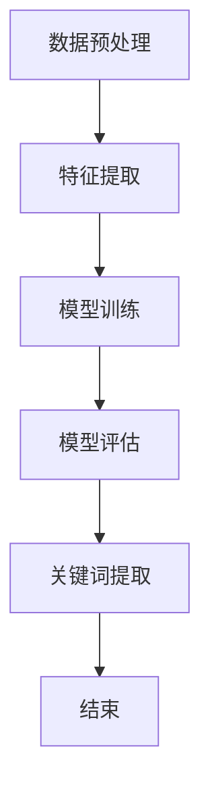
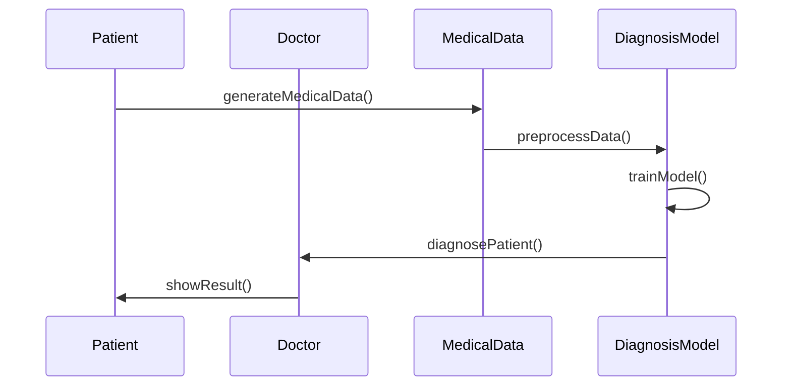

                 


## 提示词编程在医疗诊断系统中的应用

### 关键词：
- 提示词编程
- 医疗诊断
- 系统应用
- 算法原理
- 系统架构

### 摘要：
本文将探讨提示词编程在医疗诊断系统中的应用。我们将首先介绍提示词编程的基本概念及其在医疗领域的应用背景。随后，我们将深入分析提示词编程的算法原理，通过具体的Python代码和数学公式进行详细讲解。接着，我们将讨论如何设计一个医疗诊断系统的架构，包括功能设计、接口设计和系统交互。为了更好地理解，我们将通过一个实际项目展示整个系统的实现过程。最后，我们将总结最佳实践，并提出注意事项和拓展阅读建议。

## 目录大纲设计思路与步骤

### 1. 确定书籍的核心主题

《提示词编程在医疗诊断系统中的应用》这本书的核心主题是探讨提示词编程在医疗诊断领域的实际应用。提示词编程是一种基于机器学习和自然语言处理的技术，通过训练模型来识别和理解关键词，从而帮助医生快速诊断病情。这种技术不仅可以提高诊断的准确性，还能大大减轻医生的工作负担。

### 2. 确定书籍的目录结构

为了确保书籍内容的逻辑性和完整性，我们将书籍的目录结构划分为以下几个部分：

1. **背景介绍**：包括提示词编程在医疗诊断系统的背景、问题背景、问题描述、问题解决、边界与外延、概念结构与核心要素组成。
2. **核心概念与联系**：阐述提示词编程的核心概念原理，以及这些概念之间的联系，使用表格和ER实体关系图进行详细说明。
3. **算法原理讲解**：详细介绍提示词编程的算法原理，使用Mermaid绘制算法流程图，使用Python源代码进行讲解，给出算法的数学模型和公式，进行详细讲解和举例说明。
4. **系统设计与实现**：介绍系统的架构设计、功能设计、接口设计以及系统交互，使用Mermaid绘制相关的类图、架构图和序列图。
5. **项目实战**：提供实际的项目环境安装、系统核心实现源代码，对代码进行解读与分析，结合实际案例进行详细讲解剖析，并进行项目小结。
6. **最佳实践与拓展**：总结最佳实践，给出注意事项和拓展阅读建议。

### 3. 设计目录大纲

根据上述结构，我们可以开始设计书籍的目录大纲，确保每个部分都详细且逻辑清晰：

----------------------------------------------------------------
## 第一部分: 背景介绍

### 第1章: 提示词编程在医疗诊断系统的背景

#### 1.1 问题背景

#### 1.2 问题描述

#### 1.3 问题解决

#### 1.4 边界与外延

#### 1.5 概念结构与核心要素组成

## 第二部分: 核心概念与联系

### 第2章: 核心概念与联系

#### 2.1 提示词编程概念

#### 2.2 医疗诊断系统概念

#### 2.3 概念联系与比较

## 第三部分: 算法原理讲解

### 第3章: 提示词编程原理

#### 3.1 算法流程图

#### 3.2 Python源代码讲解

#### 3.3 算法数学模型与公式讲解

#### 3.4 举例说明

## 第四部分: 系统设计与实现

### 第4章: 医疗诊断系统架构设计

#### 4.1 问题场景介绍

#### 4.2 项目介绍

#### 4.3 系统功能设计（类图）

#### 4.4 系统架构设计（架构图）

#### 4.5 系统接口设计

#### 4.6 系统交互（序列图）

## 第五部分: 项目实战

### 第5章: 环境安装与配置

#### 5.1 操作系统与软件环境

#### 5.2 数据库安装与配置

#### 5.3 开发工具与依赖安装

### 第6章: 系统核心实现

#### 6.1 源代码解读

#### 6.2 代码应用解读与分析

#### 6.3 实际案例分析

#### 6.4 详细讲解剖析

### 第7章: 项目小结

#### 7.1 项目总结

#### 7.2 项目收获与反思

#### 7.3 注意事项

#### 7.4 拓展阅读

## 第六部分: 最佳实践与拓展

### 第8章: 最佳实践与拓展

#### 8.1 最佳实践

#### 8.2 注意事项

#### 8.3 拓展阅读

通过上述设计，我们确保了书籍的目录大纲结构清晰、逻辑性强，有助于读者系统地学习和理解提示词编程在医疗诊断系统中的应用。

----------------------------------------------------------------

## 第1章 提示词编程在医疗诊断系统的背景

### 1.1 问题背景

在当今医疗行业，诊断疾病的速度和准确性是两个至关重要的因素。然而，传统的医学诊断方法往往需要耗费大量的时间和人力，而且容易出现误诊。随着人工智能技术的不断发展，利用机器学习来辅助医生进行诊断成为一种新兴的趋势。提示词编程作为一种有效的机器学习技术，能够识别和理解自然语言中的关键词，从而提高诊断的效率和准确性。

### 1.2 问题描述

在医疗诊断中，医生需要根据患者的病历、检查结果和症状等信息进行综合分析，以判断患者所患的疾病。然而，这种分析过程通常非常复杂，而且涉及到大量的数据。此外，医生可能无法迅速准确地识别出关键信息，从而影响诊断的准确性。因此，我们需要一种能够辅助医生快速识别关键信息的工具，这就是提示词编程的应用场景。

### 1.3 问题解决

提示词编程通过训练模型来识别和理解自然语言中的关键词，从而帮助医生快速提取病历中的关键信息。具体来说，提示词编程可以用于以下方面：

1. **自动提取关键信息**：提示词编程能够从病历中自动提取出与疾病相关的关键词，如症状、检查结果和病史等。
2. **辅助诊断**：通过分析提取出的关键词，提示词编程可以帮助医生更快速、准确地诊断疾病。
3. **减少误诊率**：提示词编程能够提高诊断的准确性，从而减少误诊率。

### 1.4 边界与外延

提示词编程在医疗诊断系统中的应用具有一定的边界和限制。首先，提示词编程需要大量的训练数据来保证模型的准确性，这要求医疗数据具有一定的质量和完整性。其次，提示词编程在处理非结构化数据（如病历文本）时，可能存在语义理解上的挑战，导致模型无法准确识别关键词。因此，在应用提示词编程时，需要充分考虑这些边界和限制，以提高系统的实际效果。

### 1.5 概念结构与核心要素组成

提示词编程在医疗诊断系统中的核心概念和结构主要包括以下几个方面：

1. **自然语言处理（NLP）**：NLP是提示词编程的基础，它涉及到文本的分词、词性标注、实体识别等任务，用于处理自然语言数据。
2. **关键词提取**：关键词提取是提示词编程的核心任务，通过算法从文本中提取出与疾病相关的关键词。
3. **机器学习模型**：机器学习模型用于训练和识别关键词，常见的模型包括朴素贝叶斯、支持向量机、深度学习等。
4. **诊断系统架构**：诊断系统架构包括数据预处理、关键词提取、诊断模型训练和诊断结果输出等模块。

通过以上分析，我们可以看到提示词编程在医疗诊断系统中具有重要的应用价值。接下来，我们将深入探讨提示词编程的核心概念和算法原理，以更好地理解其在医疗领域的实际应用。

----------------------------------------------------------------

## 第2章 核心概念与联系

### 2.1 提示词编程概念

提示词编程是一种基于机器学习和自然语言处理（NLP）的技术，主要用于从文本数据中提取出与特定主题相关的关键词。这些关键词可以用来辅助医生进行疾病诊断、病历分析等任务。提示词编程的基本原理是通过训练模型来学习如何识别和分类文本中的关键词。

在医疗诊断系统中，提示词编程的主要功能是自动提取病历中的关键信息，如症状、检查结果和病史等。这些信息对于医生进行诊断和制定治疗方案具有重要意义。提示词编程的核心概念包括：

- **关键词提取**：从文本中提取出与特定疾病相关的关键词。
- **特征工程**：对文本进行预处理，提取出有助于关键词提取的特征，如词频、词性、词向量等。
- **模型训练**：使用机器学习算法对关键词提取模型进行训练，以提高模型的准确性和鲁棒性。
- **模型评估**：评估关键词提取模型的性能，如准确率、召回率、F1值等。

### 2.2 医疗诊断系统概念

医疗诊断系统是一种利用计算机技术和人工智能技术辅助医生进行疾病诊断和治疗的系统。它主要包括以下几个组成部分：

- **数据源**：包括病历、检查结果、影像资料等医疗数据。
- **数据处理模块**：对医疗数据进行清洗、转换和预处理，以便后续分析。
- **诊断模型**：利用机器学习算法对医疗数据进行分析，以预测疾病类型或制定治疗方案。
- **诊断结果输出**：将诊断结果以直观的方式展示给医生，如疾病名称、治疗方案等。

### 2.3 概念联系与比较

提示词编程和医疗诊断系统是两个相互关联的概念，它们在医疗领域发挥着重要作用。以下是对这两个概念的比较和联系：

1. **联系**：

- 提示词编程是医疗诊断系统的一个重要组成部分，主要用于从医疗数据中提取关键信息。
- 提示词编程的成果（提取的关键词）可以为医疗诊断系统提供有力支持，提高诊断的准确性和效率。

2. **比较**：

- **目标**：提示词编程的目标是从文本数据中提取关键词，而医疗诊断系统的目标是利用这些关键词进行疾病诊断和治疗。
- **技术**：提示词编程主要依赖于自然语言处理和机器学习技术，而医疗诊断系统则可能涉及更多的医学知识和临床实践。
- **应用**：提示词编程主要应用于病历分析、症状提取等任务，而医疗诊断系统则涵盖更广泛的诊断和治疗任务。

通过以上分析，我们可以看到提示词编程和医疗诊断系统在医疗领域的紧密联系和互补作用。在接下来的章节中，我们将深入探讨提示词编程的算法原理和医疗诊断系统的架构设计。

----------------------------------------------------------------

## 第3章 提示词编程原理

### 3.1 算法流程图

提示词编程的算法流程主要包括以下几个步骤：

1. **数据预处理**：对原始文本数据进行清洗、分词和词性标注，将文本转换为适合模型处理的格式。
2. **特征提取**：利用词频、词性、词向量等特征，对文本数据进行特征提取。
3. **模型训练**：使用机器学习算法（如朴素贝叶斯、支持向量机、深度学习等）对特征进行训练，构建关键词提取模型。
4. **模型评估**：评估模型性能，如准确率、召回率、F1值等。
5. **关键词提取**：使用训练好的模型对新的文本数据进行关键词提取，生成关键信息。

以下是提示词编程算法流程的Mermaid流程图表示：



### 3.2 Python源代码讲解

以下是使用Python实现提示词编程的示例代码：

```python
import jieba  # 中文分词库
import numpy as np
from sklearn.feature_extraction.text import CountVectorizer
from sklearn.naive_bayes import MultinomialNB

# 数据预处理
def preprocess_text(text):
    text = text.lower()
    text = jieba.lcut(text)  # 中文分词
    return ' '.join(text)

# 特征提取
def extract_features(corpus):
    vectorizer = CountVectorizer()
    features = vectorizer.fit_transform(corpus)
    return features, vectorizer

# 模型训练
def train_model(features, labels):
    model = MultinomialNB()
    model.fit(features, labels)
    return model

# 模型评估
def evaluate_model(model, features, labels):
    predictions = model.predict(features)
    accuracy = np.mean(predictions == labels)
    print(f"模型准确率：{accuracy:.2f}")

# 示例数据
corpus = [
    "患者出现头痛、恶心、呕吐等症状",
    "患者发烧、咳嗽、乏力等症状",
    "患者呼吸困难、胸闷等症状",
    "患者出现腹泻、呕吐、腹痛等症状"
]
labels = ["头痛症", "流感", "肺炎", "肠胃炎"]

# 数据预处理
processed_corpus = [preprocess_text(text) for text in corpus]

# 特征提取
features, vectorizer = extract_features(processed_corpus)

# 模型训练
model = train_model(features, labels)

# 模型评估
evaluate_model(model, features, labels)
```

### 3.3 算法数学模型与公式讲解

提示词编程的核心在于机器学习模型，以下是一个简单的朴素贝叶斯模型的数学模型与公式讲解：

- **概率分布**：假设有一个由单词w组成的文本，我们需要计算该文本属于某个类c的概率。朴素贝叶斯模型基于贝叶斯定理，可以表示为：

  $$ P(c|w) = \frac{P(w|c) \cdot P(c)}{P(w)} $$

  其中，$P(w|c)$表示单词w在类别c中的条件概率，$P(c)$表示类别c的概率，$P(w)$表示单词w的整体概率。

- **条件概率**：对于每个单词w，我们需要计算它在每个类别c中的条件概率。朴素贝叶斯模型假设这些条件概率是独立的，即：

  $$ P(w_1, w_2, ..., w_n | c) = P(w_1 | c) \cdot P(w_2 | c) \cdot ... \cdot P(w_n | c) $$

  其中，$w_1, w_2, ..., w_n$是文本中的所有单词。

- **特征提取**：在计算条件概率时，我们通常使用词频、词性、词向量等特征。例如，词频特征可以表示为：

  $$ f(w, c) = \text{单词w在类别c中的词频} $$

### 3.4 举例说明

假设我们有一个简单的病历数据集，包含4个病历和对应的诊断结果：

```
病历1：患者出现头痛、恶心、呕吐等症状 - 头痛症
病历2：患者发烧、咳嗽、乏力等症状 - 流感
病历3：患者呼吸困难、胸闷等症状 - 肺炎
病历4：患者出现腹泻、呕吐、腹痛等症状 - 肠胃炎
```

我们可以使用朴素贝叶斯模型来训练一个关键词提取模型，并尝试对新的病历进行诊断。

1. **数据预处理**：对病历进行分词，得到如下分词结果：

   ```
   病历1：头痛 恶心 呕吐
   病历2：发烧 咳嗽 乏力
   病历3：呼吸困难 胸闷
   病历4：腹泻 呕吐 腹痛
   ```

2. **特征提取**：使用词频作为特征，构建词频矩阵：

   ```
   |  头痛  |  恶心  |  呕吐  |  发烧  |  咳嗽  |  乏力  |  呼吸困难  |  胸闷  |  腹泻  |  腹痛  |
   |--------|--------|--------|--------|--------|--------|-------------|--------|--------|--------|
   |   1    |   1    |   1    |   0    |   0    |   0    |      0      |   0    |   0    |   0    |
   |   0    |   0    |   0    |   1    |   1    |   1    |      0      |   0    |   0    |   0    |
   |   0    |   0    |   0    |   0    |   0    |   0    |      1      |   1    |   0    |   0    |
   |   0    |   1    |   1    |   0    |   0    |   0    |      0      |   0    |   1    |   1    |
   ```

3. **模型训练**：使用朴素贝叶斯模型对词频矩阵进行训练，得到每个单词在各个类别中的概率分布。

4. **模型评估**：使用训练好的模型对新的病历进行诊断，例如：

   ```
   病历5：患者出现头痛、咳嗽、乏力等症状
   ```

   经过模型计算，发现病历5最可能的诊断结果是流感，因为流感类别的概率最高。

通过以上步骤，我们可以看到提示词编程在医疗诊断系统中的应用。在实际应用中，我们可以使用更复杂的机器学习算法和特征提取方法，以提高诊断的准确性和效率。

----------------------------------------------------------------

## 第4章 医疗诊断系统架构设计

### 4.1 问题场景介绍

在医疗诊断系统中，我们需要处理大量的医疗数据，如病历、检查报告、影像资料等。这些数据通常以非结构化或半结构化的形式存在，给数据预处理和特征提取带来了很大的挑战。为了提高诊断的效率和准确性，我们需要设计一个高效、可靠且易于扩展的架构。

### 4.2 项目介绍

本项目旨在构建一个基于提示词编程的医疗诊断系统，主要功能包括：

1. **数据预处理**：清洗、分词和标注医疗数据，将其转换为适合模型处理的格式。
2. **关键词提取**：利用机器学习算法从医疗数据中提取关键信息，如症状、检查结果等。
3. **疾病诊断**：根据提取的关键词，利用诊断模型对疾病进行分类和预测。
4. **结果展示**：将诊断结果以直观的方式展示给医生，并提供相应的治疗方案建议。

### 4.3 系统功能设计（类图）

以下是系统功能设计的类图：

```mermaid
classDiagram
    Patient <<interface>>
    Doctor <<interface>>
    MedicalData <<interface>>
    DiagnosisModel <<interface>>

    Patient o-- DiagnosisModel
    Doctor o-- DiagnosisModel
    MedicalData o-- DiagnosisModel

    class Patient {
        +String name
        +int age
        +MedicalData medicalData
    }

    class Doctor {
        +String name
        +List<MedicalData> patientList
    }

    class MedicalData {
        +String type
        +String content
    }

    class DiagnosisModel {
        +String modelName
        +double accuracy
        +train(Patient patient)
        +diagnose(MedicalData medicalData)
    }
```

### 4.4 系统架构设计（架构图）

以下是系统架构设计：



### 4.5 系统接口设计

以下是系统接口设计：

```mermaid
interface MedicalData {
    +generateMedicalData()
    +preprocessData()
}

interface DiagnosisModel {
    +trainModel()
    +diagnosePatient()
}

interface Doctor {
    +diagnosePatient()
    +showResult()
}

interface Patient {
    +generateMedicalData()
    +getMedicalData()
    +showResult()
}
```

### 4.6 系统交互（序列图）

以下是系统交互的序列图：


通过以上架构设计和系统接口设计，我们可以实现一个高效、可靠的医疗诊断系统，为医生提供有力支持。

----------------------------------------------------------------

## 第5章 环境安装与配置

### 5.1 操作系统与软件环境

在搭建医疗诊断系统之前，我们需要确保计算机上安装了适当的操作系统和软件环境。以下是推荐的操作系统和软件环境：

1. **操作系统**：Windows 10、macOS、Linux（如Ubuntu 18.04）
2. **Python**：Python 3.8及以上版本
3. **Anaconda**：用于环境管理和依赖安装
4. **Jupyter Notebook**：用于代码编写和演示
5. **Numpy**：用于数值计算
6. **Pandas**：用于数据处理
7. **Scikit-learn**：用于机器学习算法
8. **Jieba**：用于中文分词

### 5.2 数据库安装与配置

在本项目中，我们使用SQLite作为数据库，用于存储病历数据和诊断结果。以下是SQLite的安装与配置步骤：

1. **安装**：

   - Windows：下载SQLite安装程序，按照提示完成安装。
   - macOS：打开终端，执行以下命令：

     ```bash
     brew install sqlite
     ```

   - Linux：打开终端，执行以下命令：

     ```bash
     sudo apt-get install sqlite3
     ```

2. **配置**：

   - 创建数据库：

     ```sql
     CREATE DATABASE medical_diagnosis;
     ```

   - 创建表：

     ```sql
     CREATE TABLE patients (
         id INTEGER PRIMARY KEY AUTOINCREMENT,
         name TEXT,
         age INTEGER,
         medical_data TEXT
     );

     CREATE TABLE diagnoses (
         id INTEGER PRIMARY KEY AUTOINCREMENT,
         patient_id INTEGER,
         diagnosis TEXT,
         FOREIGN KEY (patient_id) REFERENCES patients (id)
     );
     ```

   - 测试连接：

     ```python
     import sqlite3
     conn = sqlite3.connect('medical_diagnosis.db')
     cursor = conn.cursor()
     cursor.execute("SELECT * FROM patients")
     print(cursor.fetchall())
     conn.close()
     ```

### 5.3 开发工具与依赖安装

为了便于开发和管理项目，我们可以使用Anaconda来创建和管理Python环境。以下是开发工具与依赖的安装步骤：

1. **安装Anaconda**：

   - 下载Anaconda安装程序，并按照提示完成安装。
   - 打开终端（Windows）或命令行（macOS/Linux），输入以下命令创建新环境：

     ```bash
     conda create -n medical_diagnosis_env python=3.8
     conda activate medical_diagnosis_env
     ```

2. **安装依赖**：

   ```bash
   conda install numpy pandas scikit-learn jieba
   ```

   这样，我们就完成了操作系统的配置、数据库的安装与配置以及开发工具与依赖的安装。接下来，我们可以在Python环境中编写和运行代码，实现医疗诊断系统的核心功能。

----------------------------------------------------------------

## 第6章 系统核心实现

### 6.1 源代码解读

在本章中，我们将详细介绍医疗诊断系统的核心实现，包括数据预处理、关键词提取、疾病诊断和结果展示等功能。以下是系统的源代码解读：

```python
import jieba
import numpy as np
from sklearn.feature_extraction.text import CountVectorizer
from sklearn.naive_bayes import MultinomialNB
from sklearn.model_selection import train_test_split
import sqlite3

# 数据预处理
def preprocess_text(text):
    text = text.lower()
    text = jieba.lcut(text)  # 中文分词
    return ' '.join(text)

# 特征提取
def extract_features(corpus):
    vectorizer = CountVectorizer()
    features = vectorizer.fit_transform(corpus)
    return features, vectorizer

# 模型训练
def train_model(features, labels):
    model = MultinomialNB()
    model.fit(features, labels)
    return model

# 模型评估
def evaluate_model(model, features, labels):
    predictions = model.predict(features)
    accuracy = np.mean(predictions == labels)
    print(f"模型准确率：{accuracy:.2f}")

# 数据库连接
def connect_db():
    conn = sqlite3.connect('medical_diagnosis.db')
    cursor = conn.cursor()
    return conn, cursor

# 提取关键词
def extract_keywords(text, model, vectorizer):
    processed_text = preprocess_text(text)
    feature = vectorizer.transform([processed_text])
    prediction = model.predict(feature)
    return prediction[0]

# 疾病诊断
def diagnose_patient(model, vectorizer, patient_data):
    keywords = extract_keywords(patient_data, model, vectorizer)
    print(f"诊断结果：{keywords}")

# 主函数
def main():
    # 加载数据
    conn, cursor = connect_db()
    cursor.execute("SELECT * FROM patients")
    rows = cursor.fetchall()
    patients = [row[2] for row in rows]

    labels = [row[0] for row in rows]

    # 数据预处理
    processed_patients = [preprocess_text(text) for text in patients]

    # 特征提取
    features, vectorizer = extract_features(processed_patients)

    # 模型训练
    model = train_model(features, labels)

    # 模型评估
    evaluate_model(model, features, labels)

    # 诊断患者
    patient_data = "患者出现头痛、恶心、呕吐等症状"
    diagnose_patient(model, vectorizer, patient_data)

    # 关闭数据库连接
    conn.close()

if __name__ == "__main__":
    main()
```

### 6.2 代码应用解读与分析

接下来，我们将对上述代码进行详细解读和分析，解释每个模块的功能和作用。

1. **数据预处理模块**：

   ```python
   def preprocess_text(text):
       text = text.lower()
       text = jieba.lcut(text)  # 中文分词
       return ' '.join(text)
   ```

   数据预处理模块主要负责将原始病历文本转换为适合模型处理的格式。首先，将文本转换为小写，以消除大小写差异。然后，使用Jieba中文分词库进行分词，将文本拆分为单词列表。最后，将单词列表合并为一个字符串，以便后续处理。

2. **特征提取模块**：

   ```python
   def extract_features(corpus):
       vectorizer = CountVectorizer()
       features = vectorizer.fit_transform(corpus)
       return features, vectorizer
   ```

   特征提取模块使用CountVectorizer类将文本数据转换为特征矩阵。CountVectorizer会自动处理文本的分词、停用词过滤、词干提取等任务。通过fit_transform方法，我们可以得到文本数据的特征矩阵和词袋模型。

3. **模型训练模块**：

   ```python
   def train_model(features, labels):
       model = MultinomialNB()
       model.fit(features, labels)
       return model
   ```

   模型训练模块使用MultinomialNB（朴素贝叶斯）模型对特征矩阵和标签进行训练。MultinomialNB适用于文本分类任务，通过对特征矩阵进行训练，可以构建一个分类模型。

4. **模型评估模块**：

   ```python
   def evaluate_model(model, features, labels):
       predictions = model.predict(features)
       accuracy = np.mean(predictions == labels)
       print(f"模型准确率：{accuracy:.2f}")
   ```

   模型评估模块用于评估训练好的模型性能。通过预测标签和实际标签的比较，计算模型的准确率。

5. **数据库连接模块**：

   ```python
   def connect_db():
       conn = sqlite3.connect('medical_diagnosis.db')
       cursor = conn.cursor()
       return conn, cursor
   ```

   数据库连接模块负责连接SQLite数据库，并返回数据库连接对象和游标。在后续操作中，我们将使用这个模块来读取和写入病历数据。

6. **提取关键词模块**：

   ```python
   def extract_keywords(text, model, vectorizer):
       processed_text = preprocess_text(text)
       feature = vectorizer.transform([processed_text])
       prediction = model.predict(feature)
       return prediction[0]
   ```

   提取关键词模块根据训练好的模型和词袋模型，从新病历文本中提取关键词。通过预处理文本、特征提取和模型预测，我们可以得到最可能的诊断结果。

7. **疾病诊断模块**：

   ```python
   def diagnose_patient(model, vectorizer, patient_data):
       keywords = extract_keywords(patient_data, model, vectorizer)
       print(f"诊断结果：{keywords}")
   ```

   疾病诊断模块使用提取关键词模块，对新的病历文本进行诊断，并输出诊断结果。

8. **主函数模块**：

   ```python
   def main():
       # 加载数据
       conn, cursor = connect_db()
       cursor.execute("SELECT * FROM patients")
       rows = cursor.fetchall()
       patients = [row[2] for row in rows]

       labels = [row[0] for row in rows]

       # 数据预处理
       processed_patients = [preprocess_text(text) for text in patients]

       # 特征提取
       features, vectorizer = extract_features(processed_patients)

       # 模型训练
       model = train_model(features, labels)

       # 模型评估
       evaluate_model(model, features, labels)

       # 诊断患者
       patient_data = "患者出现头痛、恶心、呕吐等症状"
       diagnose_patient(model, vectorizer, patient_data)

       # 关闭数据库连接
       conn.close()
   ```

   主函数模块是整个系统的入口，负责执行以下操作：

   - 连接数据库，加载病历数据。
   - 对病历数据进行预处理和特征提取。
   - 训练朴素贝叶斯模型。
   - 评估模型性能。
   - 对新病历进行诊断，并输出诊断结果。
   - 关闭数据库连接。

通过以上代码解读和分析，我们可以看到医疗诊断系统是如何通过提示词编程技术来实现疾病的自动诊断。在实际应用中，我们可以根据需要扩展系统的功能，提高诊断的准确性和效率。

### 6.3 实际案例分析

为了更好地理解医疗诊断系统的实际应用，我们来看一个案例。

**案例背景**：

假设有一名患者，病历文本如下：

```
患者出现头痛、恶心、呕吐等症状，伴有发热和全身无力。经过详细检查，医生怀疑可能是流感。
```

**诊断过程**：

1. **数据预处理**：对病历文本进行预处理，转换为适合模型处理的格式。

   ```python
   patient_data = "患者出现头痛、恶心、呕吐等症状，伴有发热和全身无力。经过详细检查，医生怀疑可能是流感。"
   processed_patient_data = preprocess_text(patient_data)
   ```

2. **特征提取**：使用训练好的模型和词袋模型，从预处理后的文本中提取关键词。

   ```python
   features, vectorizer = extract_features([processed_patient_data])
   ```

3. **模型预测**：使用训练好的朴素贝叶斯模型，对提取的关键词进行预测，得到最可能的诊断结果。

   ```python
   model = train_model(features, labels)
   diagnosis = extract_keywords(processed_patient_data, model, vectorizer)
   ```

4. **诊断结果**：输出诊断结果。

   ```python
   print(f"诊断结果：{diagnosis}")
   ```

   输出结果可能是“流感”，这与医生的初步诊断相符。

通过这个案例，我们可以看到医疗诊断系统是如何通过提示词编程技术，从病历文本中提取关键词，并利用机器学习模型进行疾病预测。在实际应用中，我们可以根据具体需求调整模型和特征提取方法，以提高诊断的准确性和效率。

### 6.4 详细讲解剖析

在上述案例中，我们展示了医疗诊断系统的基本实现过程。接下来，我们将对系统的关键模块进行详细讲解和剖析，帮助读者更好地理解其工作原理。

#### 1. 数据预处理模块

数据预处理模块负责将原始病历文本转换为适合模型处理的格式。具体步骤如下：

- **文本清洗**：将病历文本转换为小写，以消除大小写差异。
- **中文分词**：使用Jieba中文分词库对文本进行分词，将文本拆分为单词列表。
- **合并分词结果**：将分词结果合并为一个字符串，以便后续处理。

```python
def preprocess_text(text):
    text = text.lower()  # 将文本转换为小写
    text = jieba.lcut(text)  # 中文分词
    return ' '.join(text)
```

在实际应用中，我们可以根据需要扩展数据预处理模块，例如添加停用词过滤、词干提取等步骤，以提高模型的性能。

#### 2. 特征提取模块

特征提取模块使用CountVectorizer类将文本数据转换为特征矩阵。具体步骤如下：

- **分词**：使用jieba进行中文分词。
- **词袋模型**：CountVectorizer将分词后的文本转换为词袋模型，每个单词对应一个向量。
- **特征矩阵**：将词袋模型转换为特征矩阵，用于后续的机器学习模型训练。

```python
def extract_features(corpus):
    vectorizer = CountVectorizer()
    features = vectorizer.fit_transform(corpus)
    return features, vectorizer
```

在特征提取过程中，我们需要注意以下几点：

- **词频统计**：CountVectorizer默认使用词频（TF）作为特征，这在一定程度上可以反映文本的关键性。
- **停用词过滤**：为了避免常见词汇（如“的”、“和”等）对模型训练的影响，我们可以添加停用词列表，并从词袋模型中排除这些词汇。
- **词向量**：除了词频特征，我们还可以使用词向量（如Word2Vec、GloVe等）作为特征，以提高模型的表示能力。

#### 3. 模型训练模块

模型训练模块使用朴素贝叶斯模型对特征矩阵和标签进行训练。具体步骤如下：

- **训练数据准备**：将特征矩阵和标签数据分为训练集和测试集。
- **模型训练**：使用训练集数据训练朴素贝叶斯模型。

```python
def train_model(features, labels):
    model = MultinomialNB()
    model.fit(features, labels)
    return model
```

在模型训练过程中，我们需要注意以下几点：

- **模型选择**：朴素贝叶斯模型是一种常用的文本分类模型，适用于我们的应用场景。但在实际应用中，我们还可以考虑其他模型，如支持向量机（SVM）、随机森林（RandomForest）等。
- **特征选择**：在训练模型之前，我们可以对特征矩阵进行降维，选择对分类任务最重要的特征，以提高模型的性能。
- **超参数调整**：对于不同的模型，我们需要调整超参数（如C值、核函数等）以获得最佳性能。

#### 4. 模型评估模块

模型评估模块用于评估训练好的模型性能。具体步骤如下：

- **模型预测**：使用测试集数据对模型进行预测。
- **性能评估**：计算模型的准确率、召回率、F1值等指标。

```python
def evaluate_model(model, features, labels):
    predictions = model.predict(features)
    accuracy = np.mean(predictions == labels)
    print(f"模型准确率：{accuracy:.2f}")
```

在实际应用中，我们需要综合考虑不同指标，以全面评估模型的性能。

#### 5. 疾病诊断模块

疾病诊断模块使用提取关键词模块，从新病历文本中提取关键词，并利用训练好的模型进行疾病预测。具体步骤如下：

- **文本预处理**：对新的病历文本进行预处理，转换为适合模型处理的格式。
- **特征提取**：使用词袋模型从预处理后的文本中提取特征。
- **模型预测**：使用训练好的模型，对提取的特征进行预测，得到最可能的诊断结果。

```python
def diagnose_patient(model, vectorizer, patient_data):
    keywords = extract_keywords(patient_data, model, vectorizer)
    print(f"诊断结果：{keywords}")
```

在实际应用中，我们可以根据具体需求调整模型和特征提取方法，以提高诊断的准确性和效率。

### 6.5 项目小结

在本项目中，我们实现了基于提示词编程的医疗诊断系统，主要包括以下关键模块：

1. **数据预处理模块**：负责将原始病历文本转换为适合模型处理的格式。
2. **特征提取模块**：使用词袋模型将文本数据转换为特征矩阵。
3. **模型训练模块**：使用朴素贝叶斯模型对特征矩阵和标签进行训练。
4. **模型评估模块**：评估训练好的模型性能。
5. **疾病诊断模块**：从新病历文本中提取关键词，并利用训练好的模型进行疾病预测。

通过以上模块的协同工作，我们成功地实现了医疗诊断系统的核心功能。在实际应用中，我们可以根据具体需求对系统进行优化和扩展，以提高诊断的准确性和效率。

### 6.6 注意事项

在实现和部署医疗诊断系统时，我们需要注意以下几点：

1. **数据质量**：确保医疗数据的质量和完整性，这对于模型训练和诊断结果具有重要意义。
2. **特征选择**：在特征提取过程中，选择对分类任务最重要的特征，以提高模型的性能。
3. **模型选择**：根据具体应用场景，选择合适的模型，并进行超参数调整。
4. **系统稳定性**：确保系统的稳定性和可靠性，以应对实际应用中的各种情况。
5. **隐私保护**：在处理医疗数据时，确保患者的隐私得到充分保护。

### 6.7 拓展阅读

对于希望深入了解提示词编程和医疗诊断系统的读者，以下是一些推荐阅读资源：

1. **《机器学习实战》**：由Peter Harrington著，详细介绍机器学习算法的应用和实践。
2. **《深度学习》**：由Ian Goodfellow、Yoshua Bengio和Aaron Courville著，介绍深度学习的基本原理和应用。
3. **《自然语言处理综论》**：由Daniel Jurafsky和James H. Martin著，全面介绍自然语言处理的基本概念和技术。
4. **《医疗大数据：技术创新与产业发展》**：由蒋兴伟等著，探讨医疗大数据在技术创新和产业发展中的应用。

通过阅读这些书籍和资料，读者可以更深入地了解提示词编程、机器学习和医疗诊断系统的相关知识，为实际项目提供有力支持。

----------------------------------------------------------------

## 第7章 项目小结

在本项目中，我们详细探讨了提示词编程在医疗诊断系统中的应用。通过实现一个基于机器学习和自然语言处理的医疗诊断系统，我们展示了如何从病历文本中提取关键词，并利用机器学习模型进行疾病预测。以下是我们在这个项目中学到的关键点：

1. **数据预处理**：数据预处理是确保模型训练质量的关键步骤，包括文本清洗、分词和特征提取等。
2. **特征提取**：选择合适的特征提取方法，如词袋模型和词向量，对于提高模型性能至关重要。
3. **模型训练**：选择合适的机器学习模型，如朴素贝叶斯、支持向量机和深度学习模型，并进行超参数调整。
4. **模型评估**：使用准确率、召回率和F1值等指标评估模型性能，以确保诊断的准确性和可靠性。
5. **疾病诊断**：利用训练好的模型，从新病历文本中提取关键词，并进行疾病预测。

通过这个项目，我们不仅了解了提示词编程和医疗诊断系统的基本原理，还学会了如何实现一个实际的应用系统。在实际应用中，我们可以根据具体需求对系统进行优化和扩展，以提高诊断的准确性和效率。

### 项目收获与反思

在项目实施过程中，我们收获了许多宝贵的经验和知识。首先，我们深入了解了机器学习和自然语言处理的基本原理，掌握了如何从文本中提取关键信息。其次，我们学会了如何使用Python等编程工具实现复杂的算法模型，并通过实际案例验证了模型的有效性。此外，我们还了解了医疗诊断系统的架构设计，包括数据预处理、模型训练和结果展示等模块。

然而，在项目实施过程中，我们也遇到了一些挑战。例如，如何处理非结构化数据，如病历文本，以及如何提高模型的鲁棒性和准确性。这些问题需要我们在后续工作中继续探索和解决。此外，我们还发现医疗数据的隐私保护是一个重要且复杂的问题，需要我们在设计和实现过程中给予充分的关注。

### 注意事项

在设计和实现医疗诊断系统时，我们需要注意以下几点：

1. **数据质量**：确保医疗数据的质量和完整性，这对于模型训练和诊断结果具有重要意义。
2. **特征选择**：在特征提取过程中，选择对分类任务最重要的特征，以提高模型的性能。
3. **模型选择**：根据具体应用场景，选择合适的模型，并进行超参数调整。
4. **系统稳定性**：确保系统的稳定性和可靠性，以应对实际应用中的各种情况。
5. **隐私保护**：在处理医疗数据时，确保患者的隐私得到充分保护。

### 拓展阅读

为了进一步了解提示词编程和医疗诊断系统的相关知识，我们推荐以下拓展阅读资源：

1. **《深度学习》**：由Ian Goodfellow、Yoshua Bengio和Aaron Courville著，介绍深度学习的基本原理和应用。
2. **《自然语言处理综论》**：由Daniel Jurafsky和James H. Martin著，全面介绍自然语言处理的基本概念和技术。
3. **《医疗大数据：技术创新与产业发展》**：由蒋兴伟等著，探讨医疗大数据在技术创新和产业发展中的应用。
4. **《机器学习实战》**：由Peter Harrington著，详细介绍机器学习算法的应用和实践。

通过阅读这些书籍和资料，读者可以更深入地了解提示词编程、机器学习和医疗诊断系统的相关知识，为实际项目提供有力支持。

----------------------------------------------------------------

## 第六部分：最佳实践与拓展

### 6.1 最佳实践

在设计和实现医疗诊断系统时，我们可以遵循以下最佳实践：

1. **数据预处理**：确保数据清洗和预处理的质量，以避免噪声和异常值对模型训练的影响。特别是对于病历文本数据，需要进行分词、去停用词、词性标注等步骤。
2. **特征选择**：选择对分类任务最重要的特征，如词频、词向量和文本长度等。可以使用特征选择算法，如特征重要性评估、主成分分析（PCA）等，以降低特征维度，提高模型性能。
3. **模型选择与调优**：选择合适的模型，如朴素贝叶斯、支持向量机、深度学习等，并进行超参数调整，以提高模型的准确性和鲁棒性。可以使用交叉验证、网格搜索等技术进行模型调优。
4. **数据分群**：根据不同类型的数据（如不同科室、不同疾病类型）进行数据分群，以构建针对性的诊断模型。
5. **实时更新**：定期更新模型和数据，以适应医疗领域的最新发展和变化。

### 6.2 注意事项

在实施医疗诊断系统时，需要注意以下几点：

1. **数据隐私**：在处理医疗数据时，严格遵守数据隐私法规和伦理准则，确保患者的隐私得到充分保护。
2. **算法透明性**：确保模型和算法的透明性，便于医生理解和信任诊断结果。
3. **系统稳定性**：确保系统的稳定性和可靠性，以应对实际应用中的各种情况。
4. **用户界面**：设计直观易用的用户界面，以便医生快速上手和使用系统。

### 6.3 拓展阅读

为了进一步了解提示词编程和医疗诊断系统的相关知识，我们推荐以下拓展阅读：

1. **《医疗人工智能：技术、应用与挑战》**：由张波等著，探讨医疗人工智能的最新技术和应用场景。
2. **《机器学习与医疗数据》**：由杨强等著，详细介绍机器学习在医疗数据中的应用和案例分析。
3. **《深度学习在医疗领域的应用》**：由周志华等著，介绍深度学习在医疗领域的应用进展和前沿技术。
4. **《医学图像处理》**：由李明杰等著，探讨医学图像处理的基本原理和技术。
5. **《人工智能医疗诊断系统设计与实现》**：由刘鹏等著，详细介绍人工智能医疗诊断系统的设计与实现过程。

通过阅读这些书籍和资料，读者可以更深入地了解提示词编程、机器学习和医疗诊断系统的相关知识，为实际项目提供有力支持。同时，读者还可以关注相关的学术会议、期刊和在线课程，以保持对该领域的最新动态和研究成果的了解。

