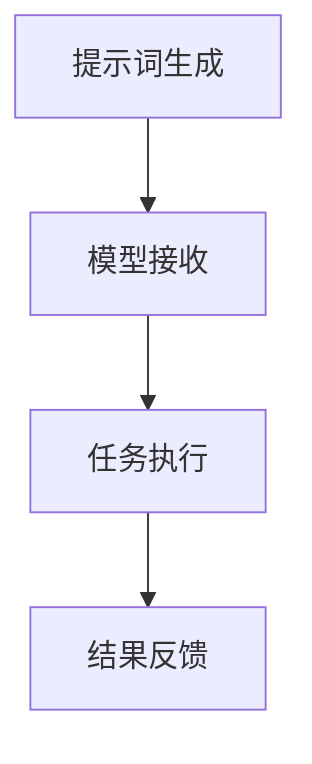

                 


## 第1章：背景介绍

### 1.1 问题背景

在当今数字化时代，各行各业都在积极探索如何利用人工智能技术提升工作效率和业务水平。其中，提示词编程作为一种新兴的技术，引起了广泛关注。提示词编程（Prompt Programming）是指利用提示词（prompts）来指导人工智能模型进行决策和任务执行的技术。这一概念最早出现在自然语言处理（NLP）领域，随着技术的发展，它已经逐渐渗透到多个行业，如金融、医疗、零售等。

### 1.2 问题描述

提示词编程在各行业的应用现状如何？它如何影响行业的发展和业务流程的优化？为了回答这些问题，我们需要深入探讨提示词编程的核心概念、算法原理以及其在不同行业中的应用案例。

### 1.3 问题解决

本文将从以下几个方面进行探讨：

1. **背景介绍**：介绍提示词编程的概念及其在各行业的应用背景。
2. **核心概念与联系**：详细解释提示词编程的核心概念，并对比其与传统编程的差异。
3. **算法原理讲解**：讲解提示词编程的算法原理，包括流程图、数学模型和具体实例。
4. **各行业应用案例**：分析提示词编程在金融、医疗、零售等行业的应用案例。
5. **最佳实践与未来展望**：总结最佳实践，并对未来发展趋势进行展望。

### 1.4 边界与外延

本文的研究边界主要集中在提示词编程在行业应用中的技术实现和业务影响。外延部分将探讨这一技术在更广泛领域的潜在应用。

### 1.5 概念结构与核心要素组成

为了更好地理解提示词编程，我们可以从以下几个方面进行概念结构的分析：

1. **提示词**：触发模型执行特定任务的关键词语或短语。
2. **模型**：如神经网络、生成对抗网络等，用于处理和响应提示词。
3. **任务**：由提示词定义的具体操作或决策。
4. **数据集**：用于训练和验证模型的原始数据。
5. **评估指标**：用于衡量模型性能的评价标准。

接下来，我们将深入探讨这些核心要素的组成和应用。

---

## 第2章：核心概念与联系

### 2.1 提示词编程定义

提示词编程是一种利用提示词来指导人工智能模型执行任务的方法。在这个框架下，提示词是模型的输入，而模型则是任务的执行者。这种方法的核心在于将人类语言（提示词）转换为机器可执行的操作。

### 2.2 提示词编程特点

提示词编程具有以下几个显著特点：

1. **高度灵活性**：提示词可以根据任务需求灵活调整，使模型能够适应多种不同的场景。
2. **自然语言交互**：通过自然语言与模型进行交互，降低了编程难度，使得非技术人员也能参与编程过程。
3. **任务导向**：提示词编程强调任务的明确性，使模型能够专注于执行特定任务。

### 2.3 与传统编程对比

与传统的编程方法相比，提示词编程具有以下优势：

1. **开发效率**：提示词编程减少了代码编写的工作量，提高了开发效率。
2. **易用性**：自然语言交互使得提示词编程更容易被非技术人员理解和应用。
3. **可扩展性**：通过调整提示词，可以轻松扩展模型的功能。

### 2.4 提示词编程的领域模型

在提示词编程中，领域模型是一个关键概念。它定义了模型的工作范围和功能，包括：

1. **实体**：如用户、产品、交易等，是领域模型的基本组成单位。
2. **关系**：实体之间的关系，如用户购买产品等。
3. **服务**：模型提供的功能操作，如查询用户信息、推荐产品等。

### 2.5 提示词编程的ER实体关系图

为了更直观地理解提示词编程的领域模型，我们可以使用ER（Entity-Relationship）实体关系图进行描述。以下是金融行业的ER实体关系图示例：

```mermaid
erDiagram
  User ..|> Order : "makes"
  User ..|> Payment : "makes"
  Order ..|> Product : "contains"
  Product ..|> Category : "falls under"
  Payment ..|> Order : "for"
```

在这个图中，用户与订单和支付之间存在关系，订单包含产品，产品属于特定类别。

---

在接下来的章节中，我们将深入探讨提示词编程的算法原理，并通过具体案例展示其在不同行业中的应用。让我们一起走进这个充满创新和机遇的技术领域。

---

## 第3章：算法原理讲解

### 3.1 算法原理概述

提示词编程的核心在于如何通过提示词引导人工智能模型进行任务执行。这一过程可以分为以下几个步骤：

1. **提示词生成**：根据任务需求生成相应的提示词。
2. **模型接收**：人工智能模型接收提示词，并对其进行解析。
3. **任务执行**：模型根据提示词执行具体的任务操作。
4. **结果反馈**：模型将执行结果返回，供用户或后续任务使用。

### 3.2 算法流程图

下面是提示词编程的算法流程图：



在这个流程图中，A表示提示词生成，B表示模型接收提示词，C表示任务执行，D表示结果反馈。

### 3.3 Python代码实现

为了更直观地理解算法原理，我们来看一个简单的Python代码实现：

```python
def execute_prompt(prompt):
    # 假设这是一个简单的任务：返回提示词的长度
    return len(prompt)

# 生成提示词
prompt = "购买一本人工智能领域的书籍"

# 执行任务
result = execute_prompt(prompt)

# 输出结果
print(f"执行结果：{result}")
```

在这个代码中，`execute_prompt`函数根据提示词执行任务，即计算提示词的长度。

### 3.4 算法数学模型与公式

在提示词编程中，我们可以使用一些基本的数学模型来描述算法原理。以下是几个常见的数学模型和公式：

1. **字符串长度计算**：

   $$\text{length}(x) = \sum_{i=1}^{n} \text{char}_i$$

   其中，$x$表示字符串，$n$表示字符串的长度，$\text{char}_i$表示第$i$个字符。

2. **逻辑判断**：

   $$\text{if-else}:\text{if } P \text{ then } Q \text{ else } R$$

   其中，$P$、$Q$和$R$分别表示条件、结果和替代结果。

### 3.5 举例说明

#### 3.5.1 实例1

假设我们需要执行一个任务：根据用户输入的年龄判断是否成年。

```python
def is_adult(age):
    if age >= 18:
        return "成年"
    else:
        return "未成年"

# 用户输入年龄
user_age = input("请输入您的年龄：")

# 判断并输出结果
print(is_adult(user_age))
```

在这个实例中，我们通过简单的if-else逻辑判断用户的年龄，并返回相应的结果。

#### 3.5.2 实例2

假设我们需要根据用户输入的订单信息生成订单号。

```python
import time

def generate_order_id(order_details):
    timestamp = int(time.time())
    return f"{timestamp}_{hash(order_details)}"

# 用户输入订单信息
order_info = input("请输入订单详细信息：")

# 生成订单号
order_id = generate_order_id(order_info)

# 输出订单号
print(f"订单号：{order_id}")
```

在这个实例中，我们利用时间戳和订单信息的哈希值生成唯一的订单号。

通过这些实例，我们可以看到提示词编程如何通过简单的代码实现复杂的业务逻辑。

---

在下一章节，我们将深入探讨提示词编程在金融行业的应用，分析其在智能投顾和量化交易中的具体实现。让我们一起探索这一领域的创新与实践。

---

## 第4章：提示词编程在金融行业的应用

### 4.1 金融行业背景

金融行业是提示词编程的重要应用领域之一。随着金融科技的快速发展，金融机构正越来越多地采用人工智能技术来提升业务效率和决策质量。提示词编程作为一种灵活、高效的技术手段，在金融领域有着广泛的应用前景。

### 4.2 应用案例1：智能投顾

智能投顾（Robo-Advisor）是金融行业中的一个重要应用场景。它利用人工智能技术，为用户提供个性化的投资建议和服务。提示词编程在这一场景中的应用主要体现在以下几个方面：

#### 4.2.1 系统功能设计

智能投顾系统的主要功能包括：

1. **用户资料收集**：收集用户的基本信息、财务状况、风险偏好等。
2. **投资组合推荐**：根据用户资料和当前市场状况，推荐合适的投资组合。
3. **风险提示**：对用户的投资组合进行风险评估，并给出风险提示。
4. **交易执行**：根据用户指令执行相应的交易操作。

#### 4.2.2 系统架构设计

智能投顾系统的架构设计可以分为以下几个层次：

1. **前端界面**：用于用户与系统的交互，包括用户注册、登录、个人信息管理等。
2. **后端服务器**：负责处理用户请求，包括数据存储、业务逻辑处理、投资建议生成等。
3. **数据库**：存储用户资料、市场数据、交易记录等。

#### 4.2.3 系统接口设计

智能投顾系统需要设计多个接口，包括：

1. **用户接口**：用于用户注册、登录、查询投资组合等。
2. **市场接口**：用于获取市场数据，包括股票、基金、债券等。
3. **交易接口**：用于执行交易操作，包括买入、卖出、转账等。

### 4.3 应用案例2：量化交易

量化交易（Quantitative Trading）是金融行业中的另一个重要应用场景。它利用数学模型和统计方法，通过计算机程序自动化执行交易决策。提示词编程在量化交易中的应用主要体现在以下几个方面：

#### 4.3.1 系统功能设计

量化交易系统的主要功能包括：

1. **数据获取**：获取股票、基金、债券等市场数据。
2. **策略开发**：根据市场数据开发交易策略。
3. **交易执行**：根据策略执行交易操作。
4. **风险控制**：对交易过程进行风险控制。

#### 4.3.2 系统架构设计

量化交易系统的架构设计可以分为以下几个层次：

1. **数据层**：包括数据源、数据清洗、数据存储等。
2. **算法层**：包括策略开发、模型训练、模型评估等。
3. **交易层**：包括交易执行、风险控制、资金管理等。

#### 4.3.3 系统接口设计

量化交易系统需要设计多个接口，包括：

1. **数据接口**：用于获取市场数据。
2. **算法接口**：用于开发、训练和评估交易策略。
3. **交易接口**：用于执行交易操作。

通过以上两个案例，我们可以看到提示词编程在金融行业中的应用是如何具体实现的。接下来，我们将探讨提示词编程在医疗行业的应用，分析其在智能诊断和健康管理中的创新与实践。

---

## 第5章：提示词编程在医疗行业的应用

### 5.1 医疗行业背景

医疗行业是信息技术和人工智能技术深度融合的重要领域之一。随着医疗数据的不断积累和人工智能技术的快速发展，提示词编程在医疗行业的应用前景愈发广阔。医疗行业的复杂性和多样性决定了提示词编程在其中的重要性，它能够帮助医生和医疗工作者更高效地处理医疗数据，提供精准的诊断和治疗方案。

### 5.2 应用案例1：智能诊断

智能诊断是医疗行业中一个关键的应用场景，它利用人工智能技术，特别是提示词编程，实现自动化诊断。以下为智能诊断系统的设计与实现：

#### 5.2.1 系统功能设计

智能诊断系统的主要功能包括：

1. **症状输入**：用户输入或上传症状信息。
2. **诊断推理**：系统根据输入的症状信息，利用提示词编程进行诊断推理。
3. **诊断建议**：系统根据诊断推理结果，给出诊断建议。
4. **反馈与修正**：用户可以对诊断建议进行反馈，系统据此修正诊断结果。

#### 5.2.2 系统架构设计

智能诊断系统的架构设计可以分为以下几个层次：

1. **数据层**：包括症状数据、疾病数据、医学知识库等。
2. **算法层**：包括诊断算法、提示词生成器、推理引擎等。
3. **应用层**：包括用户界面、诊断建议界面等。

#### 5.2.3 系统接口设计

智能诊断系统需要设计多个接口，包括：

1. **症状输入接口**：用于用户输入症状信息。
2. **诊断推理接口**：用于系统进行诊断推理。
3. **诊断建议接口**：用于返回诊断建议。
4. **反馈修正接口**：用于用户反馈诊断结果。

### 5.3 应用案例2：健康管理

健康管理是医疗行业的另一个重要应用场景，它利用提示词编程帮助用户更好地管理自己的健康状况。以下为健康管理系统的设计与实现：

#### 5.3.1 系统功能设计

健康管理系统的主要功能包括：

1. **健康数据采集**：采集用户的生活习惯、体检数据等。
2. **健康评估**：根据采集的健康数据，利用提示词编程进行健康评估。
3. **健康建议**：系统根据健康评估结果，给出个性化的健康建议。
4. **行为干预**：系统根据用户反馈和行为数据，进行健康行为干预。

#### 5.3.2 系统架构设计

健康管理系统的架构设计可以分为以下几个层次：

1. **数据层**：包括健康数据、用户行为数据等。
2. **算法层**：包括健康评估算法、提示词生成器等。
3. **应用层**：包括用户界面、健康建议界面等。

#### 5.3.3 系统接口设计

健康管理系统需要设计多个接口，包括：

1. **数据采集接口**：用于采集用户健康数据。
2. **健康评估接口**：用于系统进行健康评估。
3. **健康建议接口**：用于返回健康建议。
4. **行为干预接口**：用于用户行为干预。

通过以上两个案例，我们可以看到提示词编程在医疗行业的具体应用如何为医疗工作者和患者带来便利和效益。接下来，我们将探讨提示词编程在零售行业的应用，分析其在智能推荐系统和库存管理系统中的实现。

---

## 第6章：提示词编程在零售行业的应用

### 6.1 零售行业背景

零售行业是人工智能技术的重要应用领域之一。随着电子商务的蓬勃发展，零售企业越来越依赖人工智能技术来提升用户体验、优化库存管理和精准营销。提示词编程作为一种灵活高效的技术手段，在零售行业的多个应用场景中展现出了巨大的潜力。

### 6.2 应用案例1：智能推荐系统

智能推荐系统是零售行业中的一个关键应用场景，它利用人工智能技术，根据用户的历史行为和偏好，为其推荐可能感兴趣的商品。以下为智能推荐系统的设计与实现：

#### 6.2.1 系统功能设计

智能推荐系统的主要功能包括：

1. **用户行为数据收集**：收集用户浏览、购买、评价等行为数据。
2. **推荐算法**：根据用户行为数据，利用提示词编程生成推荐算法。
3. **推荐结果展示**：系统将推荐结果展示给用户。
4. **用户反馈**：用户对推荐结果进行反馈，系统据此优化推荐算法。

#### 6.2.2 系统架构设计

智能推荐系统的架构设计可以分为以下几个层次：

1. **数据层**：包括用户行为数据、商品数据、推荐算法参数等。
2. **算法层**：包括协同过滤、基于内容的推荐、深度学习等。
3. **应用层**：包括用户界面、推荐结果展示界面等。

#### 6.2.3 系统接口设计

智能推荐系统需要设计多个接口，包括：

1. **数据收集接口**：用于收集用户行为数据。
2. **推荐算法接口**：用于生成推荐算法。
3. **推荐结果接口**：用于返回推荐结果。
4. **用户反馈接口**：用于用户对推荐结果的反馈。

### 6.3 应用案例2：库存管理系统

库存管理系统是零售行业的另一个重要应用场景，它利用人工智能技术，优化库存管理，减少库存成本，提高商品周转率。以下为库存管理系统的设计与实现：

#### 6.3.1 系统功能设计

库存管理系统的主要功能包括：

1. **库存数据采集**：采集库存数量、商品进出库记录等数据。
2. **库存优化算法**：根据库存数据，利用提示词编程生成库存优化算法。
3. **库存预警**：系统根据库存优化算法，对即将缺货或库存过多的商品进行预警。
4. **库存调整**：根据库存预警，进行相应的库存调整。

#### 6.3.2 系统架构设计

库存管理系统的架构设计可以分为以下几个层次：

1. **数据层**：包括库存数据、商品数据、库存优化算法参数等。
2. **算法层**：包括库存预测、库存优化、供应链管理等。
3. **应用层**：包括用户界面、库存预警界面等。

#### 6.3.3 系统接口设计

库存管理系统需要设计多个接口，包括：

1. **数据采集接口**：用于收集库存数据。
2. **库存优化接口**：用于生成库存优化算法。
3. **库存预警接口**：用于返回库存预警信息。
4. **库存调整接口**：用于执行库存调整操作。

通过智能推荐系统和库存管理系统的具体应用案例，我们可以看到提示词编程在零售行业如何提升企业的运营效率和用户体验。接下来，我们将探讨提示词编程在其他行业的应用，分析其在教育行业和物流行业中的实现。

---

## 第7章：提示词编程在其他行业的应用

### 7.1 其他行业背景

除了金融、医疗、零售行业，提示词编程在许多其他行业也有着广泛的应用。这些行业包括但不限于教育、物流、制造、能源等。随着人工智能技术的不断进步，提示词编程正逐渐成为各行业数字化转型的重要工具。

### 7.2 应用案例1：教育行业

教育行业是人工智能技术的重要应用领域之一。提示词编程在教育行业的应用主要体现在智能教学系统和在线教育平台中。以下为教育行业智能教学系统的设计与实现：

#### 7.2.1 系统功能设计

智能教学系统的主要功能包括：

1. **学生数据收集**：收集学生的学习进度、成绩、行为等数据。
2. **智能辅导**：系统根据学生数据，利用提示词编程提供个性化的辅导建议。
3. **资源推荐**：系统根据学生的学习需求和进度，推荐相应的学习资源。
4. **作业批改**：系统自动批改作业，并提供即时反馈。

#### 7.2.2 系统架构设计

智能教学系统的架构设计可以分为以下几个层次：

1. **数据层**：包括学生数据、课程数据、教学资源数据等。
2. **算法层**：包括个性化辅导算法、资源推荐算法等。
3. **应用层**：包括教学界面、辅导界面、作业界面等。

#### 7.2.3 系统接口设计

智能教学系统需要设计多个接口，包括：

1. **数据收集接口**：用于收集学生数据。
2. **辅导接口**：用于生成个性化辅导建议。
3. **资源推荐接口**：用于推荐学习资源。
4. **作业批改接口**：用于自动批改作业。

### 7.3 应用案例2：物流行业

物流行业是人工智能技术的另一个重要应用领域。提示词编程在物流行业的应用主要体现在智能配送系统和物流调度系统中。以下为物流行业智能配送系统的设计与实现：

#### 7.3.1 系统功能设计

智能配送系统的主要功能包括：

1. **订单处理**：接收并处理物流订单。
2. **路径规划**：根据订单信息，利用提示词编程规划最优配送路径。
3. **实时监控**：实时监控配送过程，包括配送状态、位置信息等。
4. **异常处理**：在配送过程中，系统自动处理异常情况。

#### 7.3.2 系统架构设计

智能配送系统的架构设计可以分为以下几个层次：

1. **数据层**：包括订单数据、配送数据、实时监控数据等。
2. **算法层**：包括路径规划算法、实时监控算法等。
3. **应用层**：包括订单处理界面、配送监控界面等。

#### 7.3.3 系统接口设计

智能配送系统需要设计多个接口，包括：

1. **订单处理接口**：用于接收和处理物流订单。
2. **路径规划接口**：用于规划最优配送路径。
3. **实时监控接口**：用于实时监控配送状态。
4. **异常处理接口**：用于处理配送过程中的异常情况。

通过教育行业和物流行业的应用案例，我们可以看到提示词编程如何在不同行业中发挥重要作用，提升行业效率和用户体验。接下来，我们将总结最佳实践，并对未来发展趋势进行展望。

---

## 第8章：最佳实践与未来展望

### 8.1 最佳实践 Tips

在提示词编程的应用过程中，以下是一些最佳实践建议：

1. **数据质量**：确保输入数据的质量，数据的质量直接影响模型的性能。
2. **任务明确**：明确任务目标，避免模型执行无关操作。
3. **模型优化**：定期优化模型，提升模型的准确性和效率。
4. **用户反馈**：收集用户反馈，不断优化提示词和算法。

### 8.2 小结

本文通过对提示词编程在各行业应用案例的深入分析，展示了其在金融、医疗、零售、教育、物流等领域的广泛应用。提示词编程通过灵活、高效的自然语言交互，显著提升了行业的运营效率和用户体验。

### 8.3 注意事项

在使用提示词编程时，需要注意以下几点：

1. **隐私保护**：确保用户数据的安全和隐私。
2. **模型解释性**：提高模型的解释性，便于用户理解。
3. **风险评估**：对模型的决策进行风险评估，防止出现重大错误。

### 8.4 拓展阅读

对于希望深入了解提示词编程的读者，以下资源可以提供更多有价值的信息：

1. 《自然语言处理实战》
2. 《人工智能应用案例分析》
3. 提示词编程相关的学术论文和技术博客

---

## 作者信息

作者：AI天才研究院/AI Genius Institute & 禅与计算机程序设计艺术 /Zen And The Art of Computer Programming

---

以上就是本文的完整内容。通过本文，我们希望读者能够对提示词编程在各行业的应用有更深入的理解，并能够在实际工作中运用这些先进技术，推动行业的创新与发展。

