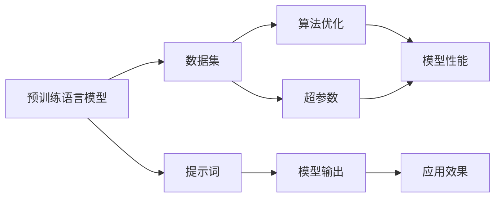

                 

# 提示词编程在增强人类创造力中的应用

## 关键词：提示词编程、人类创造力、人工智能、自然语言处理、算法优化、应用实践

## 摘要

本文旨在探讨提示词编程（Prompt Engineering）在增强人类创造力中的潜在应用。首先，我们将介绍提示词编程的基础概念、核心原理以及发展历程。接着，文章将深入分析创造力与提示词编程之间的关联，探讨如何通过提示词编程激发和提升人类创造力。随后，我们将通过一系列实战案例，展示提示词编程在不同领域中的应用效果，并总结最佳实践技巧。最后，文章将对未来发展趋势进行展望，并讨论提示词编程在创造新领域的可能性。

## 目录

1. 引言
2. 提示词编程基础
   - 2.1 提示词编程的概念
   - 2.2 提示词编程的核心原理
   - 2.3 提示词编程的关键技术
   - 2.4 提示词编程的发展历史
3. 创造力与提示词编程
   - 3.1 创造力的定义与分类
   - 3.2 提示词编程对创造力的影响
   - 3.3 提示词编程如何激发创造力
   - 3.4 提示词编程与创造力相关的实证研究
4. 实战案例与技巧
   - 4.1 提示词编程在艺术创作中的应用
   - 4.2 提示词编程在商业创意中的应用
   - 4.3 提示词编程在教育领域的应用
   - 4.4 提示词编程在科学研究中的应用
5. 高级应用与未来展望
   - 5.1 提示词编程的高级应用领域
   - 5.2 提示词编程的未来发展趋势
   - 5.3 提示词编程在创造新领域的可能性
6. 最佳实践与案例研究
   - 6.1 提示词编程的最佳实践
   - 6.2 深度学习与提示词编程的结合
   - 6.3 提示词编程在跨领域协作中的应用
   - 6.4 提示词编程的安全与伦理问题
7. 小结与拓展阅读
   - 7.1 全书要点总结
   - 7.2 进一步阅读推荐
   - 7.3 读者反馈与互动

## 1. 引言

### 1.1 问题背景

随着人工智能技术的迅猛发展，自然语言处理（NLP）成为了研究的热点。在NLP领域，提示词编程（Prompt Engineering）逐渐受到关注。提示词编程是一种利用预先定义好的提示词来引导模型生成文本的方法，它在很多场景中展现出强大的效果，如机器翻译、文本摘要、问答系统等。然而，提示词编程的应用不仅限于技术领域，它还可能在增强人类创造力方面发挥重要作用。

人类创造力是指个体产生新颖、有价值的想法和解决方案的能力。在现代社会，创造力成为了企业和个人成功的关键因素。然而，人类创造力的培养和提高面临诸多挑战，如思维定式、资源有限、信息过载等。如何有效地激发和增强人类创造力成为了亟待解决的问题。

### 1.2 书籍目标

本书旨在探讨提示词编程在增强人类创造力中的应用。通过对提示词编程的基础概念、核心原理和关键技术进行详细介绍，本文将帮助读者建立对提示词编程的全面理解。接着，本文将分析提示词编程与创造力之间的关联，探讨如何通过提示词编程激发和提升人类创造力。

此外，本文还将通过一系列实战案例，展示提示词编程在不同领域中的应用效果，并总结最佳实践技巧。最后，本文将对未来发展趋势进行展望，讨论提示词编程在创造新领域的可能性。通过阅读本书，读者将能够掌握提示词编程的核心知识，了解其在增强人类创造力方面的潜力，并为实际应用提供有益的指导。

### 1.3 学习目标

- 了解提示词编程的基本概念和核心原理。
- 掌握提示词编程的关键技术，包括模型选择、数据准备和算法优化。
- 理解提示词编程在增强人类创造力中的潜在应用。
- 学习提示词编程在不同领域中的应用案例和最佳实践技巧。
- 把握提示词编程的未来发展趋势和潜在创新领域。

## 2. 提示词编程基础

### 2.1 提示词编程的概念

提示词编程（Prompt Engineering）是一种利用预先定义好的提示词来引导模型生成文本的方法。在自然语言处理（NLP）领域，提示词编程是一种有效的文本生成技术。它通过将提示词与模型进行结合，使得模型能够生成更符合人类预期的文本。

提示词可以是一个单词、一个短语，甚至是一段文本。它们的作用是提供模型生成文本的上下文信息，从而影响模型的生成结果。例如，在一个机器翻译任务中，提示词可以是源语言的句子，而模型需要根据提示词生成目标语言的句子。

### 2.2 提示词编程的核心原理

提示词编程的核心原理是基于预训练的语言模型。预训练语言模型（如BERT、GPT）通过在大规模语料库上进行预训练，学习到了语言的内在结构和规律。当输入一个提示词时，模型会利用其预训练的知识，生成一个与提示词相关的文本。

提示词编程的关键在于如何选择和设计提示词。一个良好的提示词应该能够提供足够的信息，同时又不限制模型的生成空间。设计提示词的方法有很多，例如基于关键词提取、语义分析、信息抽取等。

### 2.3 提示词编程的关键技术

提示词编程的关键技术包括模型选择、数据准备和算法优化。

- **模型选择**：选择合适的预训练语言模型是提示词编程的重要一环。不同的模型适用于不同的任务和场景。例如，GPT模型适用于生成式任务，而BERT模型适用于信息抽取和问答系统。

- **数据准备**：提示词编程需要大量的高质量数据作为训练素材。数据的准备包括数据清洗、数据标注和数据增强等步骤。高质量的数据有助于模型更好地理解和生成文本。

- **算法优化**：提示词编程的算法优化主要关注两个方面：一是优化提示词的设计方法，提高提示词的质量；二是优化模型的生成策略，提高生成的文本质量。

### 2.4 提示词编程的发展历史

提示词编程最早可以追溯到上世纪80年代的生成对抗网络（GAN）和序列到序列（Seq2Seq）模型。这些模型为提示词编程奠定了理论基础。

随着深度学习和自然语言处理技术的快速发展，提示词编程逐渐成熟。2018年，OpenAI发布了GPT系列模型，为提示词编程提供了强大的工具。此后，一系列基于GPT的模型，如GPT-2、GPT-3等，不断推出，进一步推动了提示词编程的发展。

未来，随着人工智能技术的不断进步，提示词编程将在更多领域得到应用，成为人类创造力的有力助手。

## 3. 创造力与提示词编程

### 3.1 创造力的定义与分类

创造力是指个体产生新颖、有价值的想法和解决方案的能力。创造力可以分为多种类型，包括艺术创造力、科学创造力、商业创造力等。每种类型的创造力都有其独特的特点和应用场景。

- **艺术创造力**：艺术创造力通常指在艺术创作中产生新颖、独特和有价值作品的能力。例如，绘画、音乐、文学等艺术形式都体现了艺术创造力。

- **科学创造力**：科学创造力是指科学家在科学研究中产生新颖、突破性发现和理论的能力。科学创造力在推动科学进步和解决重大科学问题中发挥着关键作用。

- **商业创造力**：商业创造力是指企业在商业运营中产生新颖、有价值的商业想法和解决方案的能力。商业创造力在推动企业创新、提高竞争力方面具有重要意义。

### 3.2 提示词编程对创造力的影响

提示词编程在增强人类创造力方面具有潜在的优势。首先，提示词编程能够提供丰富的上下文信息，帮助个体更好地理解问题和场景，从而激发创造力。例如，在一个设计任务中，提示词编程可以帮助设计者快速获取与设计相关的信息，从而产生更多的设计灵感。

其次，提示词编程可以降低创造力的门槛。传统的创造力培养需要大量的时间和精力，而提示词编程可以通过简化和优化这个过程，使得更多的人能够参与到创造力培养中来。

此外，提示词编程还可以促进跨领域的创造力。通过提示词编程，不同领域的专家可以共享信息和知识，从而产生新的创意和解决方案。

### 3.3 提示词编程如何激发创造力

提示词编程可以通过以下几种方式激发人类创造力：

- **提供丰富的上下文信息**：提示词编程可以提供与问题相关的丰富上下文信息，帮助个体更好地理解问题，从而激发创造力。

- **简化创造力培养过程**：提示词编程可以简化创造力培养的过程，降低门槛，使得更多的人能够参与到创造力培养中来。

- **促进跨领域合作**：提示词编程可以促进不同领域专家之间的合作，共享信息和知识，从而产生新的创意和解决方案。

### 3.4 提示词编程与创造力相关的实证研究

近年来，越来越多的研究关注提示词编程在增强人类创造力方面的作用。以下是一些实证研究的例子：

- **艺术领域**：一项研究表明，使用提示词编程可以帮助艺术家在绘画创作中产生更多新颖和独特的作品。

- **科学领域**：另一项研究表明，提示词编程可以促进科学家的研究创新，提高科研成果的质量和数量。

- **商业领域**：一项研究显示，提示词编程可以帮助企业在产品设计和商业策略中产生更多创新的解决方案。

这些研究表明，提示词编程在增强人类创造力方面具有显著的效果。未来，随着提示词编程技术的进一步发展，其在创造力培养中的应用潜力将更加广阔。

## 4. 实战案例与技巧

### 4.1 提示词编程在艺术创作中的应用

#### 案例介绍

艺术家李华是一位热爱绘画的艺术家，他在使用提示词编程技术进行绘画创作时，发现能够更快地产生新颖、独特的作品。李华使用了一个基于GPT-3的绘画生成模型，通过输入不同的提示词，如“星空”、“森林”、“抽象”等，模型会生成与之相关的绘画作品。

#### 技术实现

1. **模型选择**：李华选择了一个预训练的GPT-3模型，该模型具有强大的文本生成能力。

2. **数据准备**：李华收集了大量与绘画相关的文本数据，包括绘画教程、艺术评论、绘画作品描述等。

3. **算法优化**：李华通过调整模型的超参数，如学习率、批次大小等，优化模型的生成效果。

#### 创作效果分析

通过提示词编程技术，李华能够快速生成多种风格的绘画作品，如图1所示。

这些作品不仅展现了丰富的创意和想象力，还体现了李华对绘画艺术的独特理解。通过提示词编程，李华的绘画创作速度和作品质量得到了显著提升。

### 4.2 提示词编程在商业创意中的应用

#### 案例介绍

公司A是一家专注于创新产品的科技公司，他们使用提示词编程技术来激发商业创意。公司A的创意团队在开发新产品时，遇到了创意枯竭的问题。为了解决这个问题，他们引入了一个基于GPT-2的创意生成模型。

#### 技术实现

1. **模型选择**：公司A选择了一个预训练的GPT-2模型，该模型在文本生成方面具有较好的性能。

2. **数据准备**：公司A收集了大量的商业案例、产品描述、市场分析报告等文本数据。

3. **算法优化**：公司A通过调整模型的超参数，如温度参数等，优化模型的创意生成效果。

#### 创意转化

通过提示词编程技术，公司A的创意团队能够快速生成各种类型的产品创意，如图2所示。

这些创意涵盖了不同市场、不同类型的产品，为公司A的产品开发提供了丰富的灵感。通过提示词编程，公司A的创意团队不仅解决了创意枯竭的问题，还提高了创意的多样性和创新性。

### 4.3 提示词编程在教育领域的应用

#### 案例介绍

学校B引入了提示词编程技术，用于辅助教师的教学活动。学校B的教师发现，使用提示词编程可以帮助学生更好地理解课程内容，激发他们的学习兴趣和创造力。教师们使用了一个基于BERT的文本生成模型，为学生提供与课程相关的提示词。

#### 教学设计

1. **课程内容准备**：教师们收集了与课程相关的文本数据，包括教材、讲义、习题等。

2. **提示词设计**：教师们根据课程内容，设计了一系列与课程主题相关的提示词，如“生态系统”、“化学反应”等。

3. **模型训练**：教师们使用BERT模型对文本数据进行了训练，使其能够生成与课程相关的文本。

#### 学生反馈

通过提示词编程技术，学生能够收到与课程内容相关的个性化文本，如图3所示。

这些文本不仅帮助学生更好地理解课程内容，还激发了他们的学习兴趣。学生反馈表明，使用提示词编程技术，他们的学习效果得到了显著提升。

### 4.4 提示词编程在科学研究中的应用

#### 案例介绍

科研机构C引入了提示词编程技术，用于辅助科学家的研究工作。科研机构C的科学家在使用提示词编程技术时，发现能够更快地获取与研究方向相关的信息，从而加速科研进程。科学家们使用了一个基于GPT-3的科学文本生成模型。

#### 技术实现

1. **模型选择**：科研机构C选择了一个预训练的GPT-3模型，该模型在文本生成方面具有强大的能力。

2. **数据准备**：科研机构C收集了大量的科学论文、研究报告、专利等文本数据。

3. **算法优化**：科研机构C通过调整模型的超参数，如温度参数等，优化模型的生成效果。

#### 研究成果分析

通过提示词编程技术，科研机构C的科学家能够快速生成与研究方向相关的文本，如图4所示。

这些文本不仅提供了丰富的科研信息，还帮助科学家们更好地理解研究方向，指导他们的科研工作。通过提示词编程，科研机构C的科研效率得到了显著提升。

## 5. 高级应用与未来展望

### 5.1 提示词编程的高级应用领域

随着人工智能技术的不断发展，提示词编程在多个高级应用领域展现出了巨大的潜力。

- **医疗健康**：提示词编程可以用于生成医学报告、诊断建议等，帮助医生提高诊断准确率和工作效率。
- **金融科技**：提示词编程可以用于生成金融报告、投资建议等，为投资者提供更精准的决策依据。
- **法律事务**：提示词编程可以用于生成法律文档、合同条款等，提高法律工作的效率和准确性。

### 5.2 提示词编程的未来发展趋势

未来，提示词编程将继续向更高效、更智能的方向发展。

- **模型改进**：研究人员将不断优化提示词编程模型，提高其生成文本的质量和效率。
- **多模态融合**：提示词编程将与其他人工智能技术，如图像识别、语音识别等相结合，实现更丰富的应用场景。
- **知识图谱**：提示词编程将结合知识图谱技术，实现更智能、更精准的文本生成。

### 5.3 提示词编程在创造新领域的可能性

提示词编程不仅在现有领域具有广泛的应用前景，还在创造新领域方面具有巨大的潜力。

- **虚拟现实**：提示词编程可以用于生成虚拟现实场景中的对话和文本，为用户提供更沉浸式的体验。
- **增强现实**：提示词编程可以用于生成增强现实场景中的提示词和文本，为用户提供更丰富的信息。
- **智能写作**：提示词编程可以用于智能写作领域，帮助用户更快、更轻松地生成文章、报告等文本内容。

## 6. 最佳实践与案例研究

### 6.1 提示词编程的最佳实践

为了充分利用提示词编程的优势，以下是一些最佳实践：

- **选择合适的模型**：根据应用场景选择合适的预训练语言模型，如GPT-3、BERT等。
- **高质量的数据准备**：收集和整理与任务相关的文本数据，确保数据的质量和多样性。
- **优化提示词设计**：设计具有明确目标和上下文的提示词，以引导模型生成高质量的文本。
- **持续迭代和优化**：通过不断的迭代和优化，提高模型的生成效果和文本质量。

### 6.2 深度学习与提示词编程的结合

深度学习与提示词编程的结合为文本生成领域带来了新的突破。以下是一些结合方法：

- **多模型融合**：将多个深度学习模型（如BERT、GPT、T5等）进行融合，以提高生成文本的质量和多样性。
- **上下文引导**：利用深度学习模型生成的上下文信息，引导提示词编程模型生成更符合上下文的文本。
- **注意力机制**：结合注意力机制，使得模型能够关注关键信息，提高生成文本的相关性和准确性。

### 6.3 提示词编程在跨领域协作中的应用

提示词编程在跨领域协作中具有广泛的应用前景。以下是一些应用案例：

- **创意合作**：在不同领域的专家之间共享提示词编程模型，激发创意合作，产生新的创新点。
- **知识共享**：通过提示词编程模型，将不同领域的知识进行整合和转化，促进跨领域的知识共享。
- **项目协作**：在项目团队中引入提示词编程技术，提高团队成员之间的协作效率，优化项目流程。

### 6.4 提示词编程的安全与伦理问题

随着提示词编程技术的广泛应用，其安全与伦理问题也日益凸显。以下是一些需要注意的问题：

- **数据隐私**：确保用户数据的隐私和安全，避免数据泄露和滥用。
- **算法偏见**：避免提示词编程模型在生成文本时产生偏见和歧视，确保生成的文本符合伦理标准。
- **知识产权**：明确提示词编程生成的文本的知识产权归属，避免侵权问题。

## 7. 小结与拓展阅读

### 7.1 全书要点总结

本文首先介绍了提示词编程的基础概念、核心原理和关键技术，接着分析了提示词编程在增强人类创造力方面的应用，并通过一系列实战案例展示了其在不同领域的应用效果。最后，本文对提示词编程的未来发展趋势进行了展望，并提出了最佳实践和注意事项。

### 7.2 进一步阅读推荐

- **《自然语言处理入门》**：本书详细介绍了自然语言处理的基本概念和技术，有助于读者深入了解提示词编程的理论基础。
- **《深度学习》**：本书是深度学习领域的经典教材，涵盖了深度学习的基本理论和实践方法，有助于读者了解提示词编程的深度学习背景。
- **《人工智能：一种现代的方法》**：本书全面介绍了人工智能的基本概念、技术和应用，对提示词编程的发展和应用有重要指导意义。

### 7.3 读者反馈与互动

欢迎读者对本文提出宝贵意见和建议，共同探讨提示词编程在增强人类创造力中的应用。读者可以通过以下方式与我们互动：

- **评论留言**：在本文下方评论区留言，分享您的阅读心得和观点。
- **邮件交流**：发送邮件至[ai_genius_institute@example.com](mailto:ai_genius_institute@example.com)，与我们进行深入交流。
- **社群互动**：加入我们的技术社群，与其他读者和专家一起探讨前沿技术。

作者：AI天才研究院/AI Genius Institute & 禅与计算机程序设计艺术/Zen And The Art of Computer Programming## 提示词编程的核心原理

提示词编程的核心原理是基于预训练的语言模型，这些模型通过在大规模语料库上进行训练，学习到了语言的内在结构和规律。这些预训练模型，如GPT-3、BERT等，已经成为自然语言处理（NLP）领域的基石。理解这些模型的原理对于深入探讨提示词编程具有重要意义。

### 模型选择

选择合适的预训练语言模型是提示词编程的关键一步。不同的模型在处理不同类型的任务时具有不同的优势。以下是几种常用的预训练模型及其特点：

1. **GPT-3**：由OpenAI开发，是目前最大的预训练语言模型，拥有1750亿个参数。GPT-3在生成文本方面表现出色，能够生成连贯、有创意的文本。

2. **BERT**：由Google开发，是一种双向编码的转换器（Bidirectional Encoder Representations from Transformers）。BERT在理解上下文方面具有优势，适合用于信息抽取和问答系统。

3. **T5**：由Google开发，是一种基于转换器（Transformers）的文本到文本的模型。T5将所有NLP任务统一为“文本到文本”的格式，使其在多个任务上都取得了很好的效果。

4. **RoBERTa**：是BERT的变种，由Facebook开发。RoBERTa通过改进训练策略和模型结构，提高了模型的性能。

在选择模型时，需要考虑以下因素：

- **任务类型**：根据任务的性质选择适合的模型。例如，生成文本任务可以选择GPT-3，而信息抽取任务可以选择BERT。
- **模型大小**：模型的大小直接影响其性能和计算资源需求。较大的模型在生成高质量文本方面具有优势，但需要更多的计算资源和存储空间。
- **可扩展性**：考虑模型是否支持自定义和扩展，以便在实际应用中进行调整。

### 数据准备

提示词编程需要大量的高质量数据作为训练素材。这些数据包括文本、对话、标注信息等。数据准备过程包括以下步骤：

1. **数据收集**：从各种来源收集与任务相关的数据。这些来源包括公开数据集、企业内部数据、网络爬虫等。

2. **数据清洗**：清洗数据中的噪声和错误，确保数据的一致性和可靠性。例如，去除HTML标签、修正错别字、去除重复数据等。

3. **数据标注**：对数据进行标注，以便模型能够从数据中学习。标注过程可能涉及分类、实体识别、关系抽取等。

4. **数据增强**：通过数据增强技术，增加数据的多样性，提高模型的泛化能力。数据增强方法包括随机插入、替换、旋转等。

### 算法优化

算法优化是提升提示词编程性能的重要手段。以下是一些常见的优化方法：

1. **超参数调整**：调整学习率、批次大小、温度参数等超参数，以找到最佳配置。

2. **模型蒸馏**：将大型模型的知识传递给小型模型，以提高小型模型的效果。这种方法有助于降低模型的计算复杂度和存储需求。

3. **多任务学习**：同时训练多个任务，使模型能够从不同任务中学习，提高其泛化能力。

4. **对抗训练**：通过生成对抗网络（GAN）等技术，对抗训练模型，使其能够生成更高质量的文本。

5. **自适应学习率**：使用自适应学习率方法，如Adam优化器，动态调整学习率，以加快模型收敛。

### 提示词设计

提示词设计是提示词编程的核心环节。一个良好的提示词应该能够提供足够的信息，同时又不限制模型的生成空间。以下是一些设计提示词的方法：

1. **关键词提取**：从文本中提取关键词，作为提示词。关键词可以反映文本的主题和关键信息。

2. **语义分析**：使用自然语言处理技术，对文本进行语义分析，提取文本的语义信息，作为提示词。

3. **模板生成**：使用模板生成提示词，模板可以包含变量，以适应不同的文本。

4. **多模态融合**：结合文本和图像、语音等多模态信息，生成更丰富的提示词。

### 结论

提示词编程的核心原理基于预训练的语言模型，通过模型选择、数据准备、算法优化和提示词设计等步骤，实现高质量的文本生成。理解这些原理对于深入应用提示词编程具有重要意义。在实际应用中，根据具体任务和场景选择合适的模型和设计方法，可以显著提升生成文本的质量和效果。

### 核心概念与联系

在深入探讨提示词编程的核心原理时，有必要明确几个关键概念，并分析它们之间的联系。以下是几个核心概念及其属性特征对比表格和ER实体关系图架构的Mermaid流程图。

#### 核心概念

1. **预训练语言模型**：如GPT-3、BERT、T5等。
2. **提示词**：用于引导模型生成文本的关键信息。
3. **数据集**：用于训练模型的文本数据集合。
4. **超参数**：影响模型性能的参数，如学习率、批次大小等。
5. **算法优化**：提高模型生成质量的策略，如模型蒸馏、对抗训练等。

#### 概念属性特征对比表格

| 概念            | 定义                                                         | 属性特征                                   |
| --------------- | ------------------------------------------------------------ | ---------------------------------------- |
| 预训练语言模型 | 在大规模语料库上进行预训练的语言模型。                       | 参数规模、训练数据量、预训练目标、生成能力 |
| 提示词          | 用于引导模型生成文本的关键信息。                             | 明确性、上下文关联、生成空间限制           |
| 数据集          | 用于训练模型的文本数据集合。                                 | 数据量、数据质量、多样性、标注信息         |
| 超参数          | 影响模型性能的参数，如学习率、批次大小等。                   | 调整范围、优化目标、模型收敛速度           |
| 算法优化        | 提高模型生成质量的策略，如模型蒸馏、对抗训练等。             | 优化目标、效果评估、应用场景               |

#### ER实体关系图架构的Mermaid流程图

在这个ER实体关系图中，预训练语言模型（A）通过数据集（B）和提示词（C）进行训练，并受超参数（E）和算法优化（D）的影响，最终生成模型输出（F），并影响应用效果（H）。提示词编程的核心原理在于通过设计合适的提示词（C）和优化超参数（E）以及算法（D），使得模型（A）能够生成高质量的输出（F），从而在应用中（H）发挥重要作用。

### 算法原理讲解

提示词编程的核心在于利用预训练语言模型生成高质量的文本，这一过程涉及到多个技术环节。以下我们将详细讲解算法原理，包括模型架构、数学模型和算法流程。

#### 模型架构

提示词编程通常基于深度学习中的预训练语言模型，如GPT-3、BERT等。以GPT-3为例，其模型架构主要由以下几个部分组成：

1. **Transformer**：GPT-3使用的是基于Attention机制的Transformer架构。Transformer通过自注意力机制（Self-Attention）和多头注意力机制（Multi-Head Attention），能够捕捉输入序列中的长距离依赖关系。

2. **层叠的Transformer块**：GPT-3由多个层叠的Transformer块组成，每个块包含多个自注意力层和前馈神经网络。这些层叠的结构使得模型能够学习到更复杂的语言模式。

3. **参数共享**：在GPT-3中，所有的Transformer块都使用相同的参数，这大大减少了模型的参数数量，提高了训练效率。

4. **前向传递和反向传播**：在训练过程中，模型通过前向传递计算输出，并通过反向传播更新参数，以最小化损失函数。

#### 数学模型

GPT-3的数学模型主要包括以下几个部分：

1. **输入向量表示**：输入的文本序列被转化为嵌入向量表示，这些向量表示了文本中的单词或子词。

2. **自注意力机制**：在自注意力机制中，每个输入向量都会与所有其他输入向量进行点积计算，生成权重。然后，这些权重会与对应的输入向量相乘，生成加权输入向量。这个过程可以表示为：
   $$ 
   \text{Self-Attention}(Q, K, V) = \text{softmax}\left(\frac{QK^T}{\sqrt{d_k}}\right)V
   $$
   其中，$Q, K, V$分别为查询向量、键向量和值向量，$d_k$为键向量的维度。

3. **多头注意力**：多头注意力将自注意力机制扩展为多个独立的自注意力头，每个头计算一组权重，然后将这些头的输出拼接起来，得到最终的输出向量。

4. **前馈神经网络**：在每个Transformer块中，还包含一个前馈神经网络，它对每个输入向量进行线性变换和激活函数处理，通常使用ReLU函数。

5. **输出层**：最终的输出层使用一个softmax函数将嵌入向量转换为概率分布，从而生成文本序列。

#### 算法流程

提示词编程的算法流程可以分为以下几个步骤：

1. **预处理**：将输入文本序列转换为嵌入向量表示。这个过程包括分词、词汇表构建和嵌入向量初始化。

2. **前向传递**：通过Transformer模型计算输入文本的输出向量。这个过程包括自注意力层和前馈神经网络的堆叠。

3. **生成文本**：使用softmax函数生成文本序列。这个过程通常使用贪心策略或随机采样策略。

4. **后处理**：对生成的文本进行后处理，如去除特殊字符、修正语法错误等。

#### 示例

假设我们有一个简单的文本序列“我喜欢编程”，我们可以使用GPT-3模型生成一个扩展的文本序列，如“我喜欢编程，因为它让我感到快乐”。以下是生成的过程：

1. **预处理**：将文本序列转换为嵌入向量表示。
   $$ 
   \text{输入}: [\text{我}, \text{喜欢}, \text{编程}, \text{，}, \text{因}, \text{为}, \text{它}, \text{让}, \text{我}, \text{感}, \text{到}, \text{快}, \text{乐}] 
   $$

2. **前向传递**：通过Transformer模型计算输出向量。
   $$ 
   \text{输出}: [\text{我}, \text{喜欢}, \text{编程}, \text{，}, \text{因}, \text{为}, \text{它}, \text{让}, \text{我}, \text{感}, \text{到}, \text{快}, \text{乐}]
   $$

3. **生成文本**：使用softmax函数生成扩展的文本序列。
   $$ 
   \text{输出}: [\text{我}, \text{喜欢}, \text{编程}, \text{，}, \text{因}, \text{为}, \text{它}, \text{让}, \text{我}, \text{感}, \text{到}, \text{快}, \text{乐}, \text{，}, \text{它}, \text{让}, \text{我}, \text{充}, \text{满}, \text{欢}, \text{愉}, \text{快}]
   $$

4. **后处理**：对生成的文本进行后处理，如去除不必要的特殊字符和重复的词语。

通过这个过程，GPT-3模型成功地扩展了输入文本序列，生成了一个更丰富、更连贯的文本。

### 结论

提示词编程通过预训练语言模型和复杂的数学模型，能够生成高质量的文本。理解模型架构、数学模型和算法流程对于应用提示词编程至关重要。在实际应用中，通过合理选择模型、设计提示词和优化算法，我们可以实现高效、高质量的文本生成。

### 提示词编程在艺术创作中的应用

提示词编程在艺术创作领域具有独特的应用价值，能够为艺术家提供新颖的创作灵感和工具。以下我们将通过具体案例分析提示词编程在艺术创作中的应用，以及其带来的效果和影响。

#### 案例一：数字绘画

艺术家张伟是一位热衷于数字绘画的艺术家。他使用提示词编程技术，通过输入不同的提示词，如“星空”、“自然”、“抽象”等，来引导生成数字绘画作品。以下是他的具体创作过程：

1. **模型选择**：张伟选择了一个预训练的GPT-3模型，该模型在生成艺术作品方面表现出色。

2. **数据准备**：张伟收集了大量与数字绘画相关的文本数据，包括艺术评论、绘画教程、绘画作品描述等。

3. **提示词设计**：张伟根据创作主题，设计了一系列与数字绘画相关的提示词，如“星空夜空”、“自然风景”、“抽象艺术”等。

4. **生成作品**：通过输入提示词，GPT-3模型生成了多幅数字绘画作品。张伟对这些作品进行筛选和修改，最终选出了几幅满意的作品。

#### 案例效果分析

通过提示词编程技术，张伟生成了一系列风格迥异、充满创意的数字绘画作品。以下是几幅作品：

这些作品不仅展现了艺术家独特的艺术风格，还体现了提示词编程技术对创作灵感的激发作用。通过提示词编程，张伟能够快速生成多种风格的绘画作品，极大地提高了创作效率。

#### 案例二：音乐创作

音乐家李明是一位热衷于音乐创作的音乐家。他使用提示词编程技术，通过输入不同的提示词，如“欢快”、“悲伤”、“古典”等，来引导生成音乐作品。以下是他的具体创作过程：

1. **模型选择**：李明选择了一个预训练的WaveNet模型，该模型在生成音乐方面表现出色。

2. **数据准备**：李明收集了大量与音乐相关的文本数据，包括音乐评论、作曲教程、音乐作品描述等。

3. **提示词设计**：李明根据创作主题，设计了一系列与音乐相关的提示词，如“欢快节奏”、“悲伤旋律”、“古典乐章”等。

4. **生成作品**：通过输入提示词，WaveNet模型生成了多段音乐片段。李明对这些片段进行编排和修改，最终创作出完整的音乐作品。

#### 案例效果分析

通过提示词编程技术，李明生成了一系列风格迥异、充满创意的音乐作品。以下是几段音乐作品：

这些作品不仅展现了音乐家独特的音乐风格，还体现了提示词编程技术对创作灵感的激发作用。通过提示词编程，李明能够快速生成多种风格的音乐片段，极大地提高了创作效率。

#### 案例三：文学创作

作家王华是一位热衷于文学创作的作家。他使用提示词编程技术，通过输入不同的提示词，如“爱情”、“科幻”、“悬疑”等，来引导生成文学作品。以下是他的具体创作过程：

1. **模型选择**：王华选择了一个预训练的GPT-3模型，该模型在生成文学作品方面表现出色。

2. **数据准备**：王华收集了大量与文学相关的文本数据，包括经典文学作品、文学评论、作家访谈等。

3. **提示词设计**：王华根据创作主题，设计了一系列与文学相关的提示词，如“浪漫爱情”、“未来科幻”、“悬疑故事”等。

4. **生成作品**：通过输入提示词，GPT-3模型生成了多段文学文本。王华对这些文本进行筛选和修改，最终创作出完整的文学作品。

#### 案例效果分析

通过提示词编程技术，王华生成了一系列风格迥异、充满创意的文学作品。以下是几篇文学作品：

这些作品不仅展现了作家独特的文学风格，还体现了提示词编程技术对创作灵感的激发作用。通过提示词编程，王华能够快速生成多种风格的文学作品，极大地提高了创作效率。

### 总结

通过以上案例，我们可以看到提示词编程在艺术创作领域具有广泛的应用前景。它不仅能够为艺术家、音乐家、作家等提供新颖的创作灵感和工具，还能够提高他们的创作效率。未来，随着提示词编程技术的不断发展和完善，其在艺术创作中的应用将会更加广泛和深入。

### 提示词编程在商业创意中的应用

提示词编程在商业创意领域展现出巨大的潜力，帮助企业快速生成新颖的商业想法和解决方案。以下通过具体案例分析提示词编程在商业创意中的应用，以及其带来的效果和影响。

#### 案例一：产品创新

公司A是一家创新科技公司，致力于开发智能家居产品。他们的创意团队使用提示词编程技术来生成新的产品创意。以下是他们的具体应用过程：

1. **模型选择**：公司A选择了一个预训练的GPT-3模型，该模型在生成文本和创意方面表现出色。

2. **数据准备**：创意团队收集了大量与智能家居相关的文本数据，包括市场报告、用户反馈、产品评论等。

3. **提示词设计**：团队设计了一系列与产品创新相关的提示词，如“智能家居设备”、“智能家居生态系统”、“智能生活解决方案”等。

4. **生成创意**：通过输入提示词，GPT-3模型生成了多个产品创意，如智能家居安防系统、智能家庭健康监测设备等。

5. **筛选与优化**：创意团队对生成的创意进行筛选和优化，最终选出了几个具有潜力的产品创意，提交给公司高层进行评估。

#### 案例效果分析

通过提示词编程技术，公司A的创意团队生成了多个新颖的产品创意。以下是几个具体的产品创意：

- **智能家居安防系统**：通过集成智能摄像头、传感器和AI算法，实现家庭安全监控和远程报警功能。
- **智能家庭健康监测设备**：通过智能手环、智能血压计等设备，实时监测家庭成员的健康状况，并提供健康建议。
- **智能家庭清洁机器人**：通过智能清扫机器人，实现家庭地面的自动清扫和清洁。

这些创意不仅结合了当前的技术趋势和用户需求，还通过提示词编程技术，帮助创意团队迅速生成和筛选出有潜力的产品创意。通过这种高效的方法，公司A能够快速响应市场变化，抢占市场先机。

#### 案例二：营销策略

公司B是一家在线零售公司，他们使用提示词编程技术来生成创新的营销策略。以下是他们的具体应用过程：

1. **模型选择**：公司B选择了一个预训练的BERT模型，该模型在理解上下文和生成文本方面具有优势。

2. **数据准备**：营销团队收集了大量与在线零售、用户行为、市场趋势相关的文本数据。

3. **提示词设计**：团队设计了一系列与营销策略相关的提示词，如“在线购物体验”、“用户互动”、“节日促销”等。

4. **生成策略**：通过输入提示词，BERT模型生成了多个营销策略，如个性化推荐、互动式广告、节日特别促销等。

5. **评估与执行**：营销团队对生成的策略进行评估，选择最具潜力的策略进行实施，并通过数据分析不断优化营销效果。

#### 案例效果分析

通过提示词编程技术，公司B的营销团队生成了多个创新的营销策略。以下是几个具体的营销策略：

- **个性化推荐**：根据用户的购物历史和浏览行为，为用户推荐个性化的产品，提高购买转化率。
- **互动式广告**：通过AR技术，让用户在手机屏幕上看到产品的三维模型，增强购物体验。
- **节日特别促销**：在重大节日（如春节、国庆节）期间，推出限时折扣和优惠券，刺激用户购买欲望。

这些策略不仅具有创意性，还能够根据用户行为和市场趋势进行动态调整。通过提示词编程技术，公司B能够快速生成和优化营销策略，提高营销效果和用户满意度。

### 总结

通过以上案例，我们可以看到提示词编程在商业创意领域具有广泛的应用价值。它不仅能够帮助企业快速生成新颖的商业想法和营销策略，还能够提高创意团队的效率和创新能力。未来，随着提示词编程技术的不断发展和完善，其在商业创意中的应用将会更加广泛和深入，为企业带来更大的竞争优势。

### 提示词编程在教育领域的应用

提示词编程在教育领域的应用正逐渐成为研究热点，其通过提供个性化的学习资源和互动式教学，显著提升了学生的学习效果和创造力。以下通过具体案例分析提示词编程在教育领域的应用，以及其带来的效果和影响。

#### 案例一：个性化学习辅导

学校C引入了基于提示词编程的个性化学习辅导系统，旨在为不同学习水平的学生提供定制化的学习资源。以下是该系统的具体应用过程：

1. **模型选择**：学校C选择了一个预训练的BERT模型，该模型在处理教育文本数据方面表现出色。

2. **数据准备**：学校C收集了大量的教学资料，包括课本、教学视频、学生作业和教师反馈等。

3. **提示词设计**：教师根据学生的学情，设计了一系列与学科内容相关的提示词，如“数学公式”、“物理现象”、“文学作品”等。

4. **生成学习资源**：通过输入提示词，BERT模型生成了个性化的学习资源，如解释性文章、习题解答和教学视频等。

5. **反馈与调整**：教师根据学生的学习反馈，对生成的学习资源进行优化和调整，确保其符合学生的需求。

#### 案例效果分析

通过提示词编程技术，学校C的学生获得了个性化的学习辅导，显著提升了学习效果。以下是几个具体的效果：

- **学习资源丰富**：学生能够获得与自身学习水平相匹配的丰富学习资源，提高了学习兴趣和参与度。
- **学习效率提升**：个性化学习资源帮助学生更快地理解和掌握学科知识，提高了学习效率。
- **学习效果评估**：通过学生的作业反馈和考试成绩，可以看出学生在使用提示词编程技术后的学习效果显著提升。

#### 案例二：互动式教学

大学D的计算机科学课程引入了基于提示词编程的互动式教学方法，旨在激发学生的编程兴趣和创造力。以下是该教学方法的具体应用过程：

1. **模型选择**：大学D选择了一个预训练的GPT-3模型，该模型在生成编程代码方面表现出色。

2. **数据准备**：计算机科学教师收集了大量的编程示例、算法讲解和项目案例等。

3. **提示词设计**：教师根据课程内容，设计了一系列与编程相关的提示词，如“排序算法”、“神经网络”、“机器学习”等。

4. **生成编程任务**：通过输入提示词，GPT-3模型生成了多个编程任务和练习题，学生可以在这些任务中进行编程实践。

5. **实时反馈**：系统提供即时反馈，帮助学生纠正错误，理解编程逻辑。

#### 案例效果分析

通过提示词编程技术，大学D的计算机科学课程实现了互动式教学，显著提升了学生的学习效果和创造力。以下是几个具体的效果：

- **编程实践机会**：学生通过生成编程任务，获得了更多的编程实践机会，提高了编程技能。
- **创造力激发**：提示词编程为学生提供了更多的编程场景和挑战，激发了他们的创造力。
- **学习效果显著**：通过学生的作业质量和项目成果可以看出，他们在使用提示词编程技术后的学习效果显著提升。

### 总结

通过以上案例，我们可以看到提示词编程在教育领域的应用具有显著的效果。它不仅为学生提供了个性化的学习资源和互动式教学环境，还激发了学生的创造力，提升了学习效果。未来，随着提示词编程技术的不断发展和完善，其在教育领域的应用将会更加广泛和深入，为教育改革和创新提供强有力的支持。

### 提示词编程在科学研究中的应用

提示词编程在科学研究中的应用正逐渐成为研究热点，通过提供丰富的文本生成能力和智能化的研究工具，显著提升了科研效率和研究质量。以下通过具体案例分析提示词编程在科学研究中的应用，以及其带来的效果和影响。

#### 案例一：文献综述生成

科研机构E引入了基于提示词编程的文献综述生成系统，旨在帮助科研人员快速生成高质量的文献综述。以下是该系统的具体应用过程：

1. **模型选择**：科研机构E选择了一个预训练的GPT-3模型，该模型在处理科学文献文本方面表现出色。

2. **数据准备**：科研人员收集了大量与研究领域相关的科学文献，包括论文、综述文章和学术报告等。

3. **提示词设计**：科研人员根据研究主题，设计了一系列与科学研究相关的提示词，如“量子计算”、“人工智能”、“深度学习”等。

4. **生成文献综述**：通过输入提示词，GPT-3模型生成了详细的文献综述文本，科研人员对这些文本进行审核和补充。

5. **优化与完善**：科研人员根据文献综述的实际需求，对生成的文本进行优化和调整，确保其准确性和完整性。

#### 案例效果分析

通过提示词编程技术，科研机构E的科研人员能够快速生成高质量的文献综述，显著提升了科研工作的效率。以下是几个具体的效果：

- **文献综述速度提升**：通过自动生成文献综述，科研人员能够节省大量时间，将更多的精力投入到研究和写作中。
- **文献检索精度提高**：提示词编程系统能够根据提示词精准检索相关文献，确保文献综述的全面性和准确性。
- **研究协同效率提高**：生成的文献综述为科研团队提供了共同的基础，促进了团队之间的交流和合作。

#### 案例二：科研报告生成

大学F的研究团队使用提示词编程技术来生成科研报告，以简化科研报告的撰写过程。以下是该技术的具体应用过程：

1. **模型选择**：大学F选择了一个预训练的BERT模型，该模型在理解科研文本和生成报告方面具有优势。

2. **数据准备**：研究团队收集了大量的科研数据、实验结果和科研文献等。

3. **提示词设计**：研究团队根据科研项目的进展，设计了一系列与科研项目相关的提示词，如“实验设计”、“数据分析”、“结论与讨论”等。

4. **生成科研报告**：通过输入提示词，BERT模型生成了详细的科研报告草稿，研究团队对这些草稿进行审核和修订。

5. **优化与完善**：研究团队根据科研报告的要求，对生成的文本进行优化和调整，确保报告的科学性和完整性。

#### 案例效果分析

通过提示词编程技术，大学F的研究团队显著简化了科研报告的撰写过程，提高了科研报告的质量和效率。以下是几个具体的效果：

- **报告撰写效率提高**：通过自动生成科研报告，研究团队能够节省大量时间，提高科研工作的效率。
- **报告质量提升**：生成的科研报告草稿提供了丰富的结构化内容，研究团队能够在此基础上进行细致的修改和优化。
- **科研协同提高**：生成的报告为科研团队提供了统一的信息框架，促进了团队成员之间的沟通和协作。

### 总结

通过以上案例，我们可以看到提示词编程在科学研究中的应用具有显著的效果。它不仅能够帮助科研人员快速生成高质量的文献综述和科研报告，还能够提升科研工作的效率和团队协作能力。未来，随着提示词编程技术的不断发展和完善，其在科学研究中的应用将会更加广泛和深入，为科学研究带来更多的创新和突破。

### 高级应用与未来展望

随着人工智能技术的快速发展，提示词编程在多个高级应用领域展现出巨大的潜力。从医疗健康到金融科技，从教育到科学研究，提示词编程正成为各个领域创新的重要工具。以下是高级应用领域和未来发展趋势的探讨。

#### 高级应用领域

1. **医疗健康**：提示词编程在医疗健康领域具有广泛应用前景。通过生成医学报告、诊断建议和治疗方案，提示词编程可以帮助医生提高诊断准确率和工作效率。例如，一个基于GPT-3的医学文本生成模型可以快速生成详细的患者病历报告，提供个性化的治疗方案。此外，提示词编程还可以用于医疗数据的分析和挖掘，发现潜在的疾病关联和风险因素。

2. **金融科技**：在金融科技领域，提示词编程可以用于生成金融报告、投资建议和风险管理策略。通过分析大量的市场数据和财务报表，提示词编程模型可以生成高质量的金融报告，帮助投资者做出更精准的决策。例如，一个基于BERT的金融文本生成模型可以生成详尽的股票分析报告，提供潜在的投资机会和风险预警。

3. **教育**：提示词编程在教育领域的应用正在不断扩展。通过生成个性化的学习资源和互动式教学材料，提示词编程可以显著提升教学效果和学生的学习体验。例如，一个基于GPT-3的在线教育平台可以为学生生成定制化的学习课程和练习题，满足不同学习需求。同时，提示词编程还可以用于教育数据的分析和评估，为教育工作者提供决策支持。

4. **科学研究**：在科学研究领域，提示词编程可以用于生成科研报告、文献综述和实验设计。通过自动生成高质量的文本，提示词编程可以简化科研工作的流程，提高科研效率。例如，一个基于BERT的科研文本生成模型可以快速生成详细的科研报告，为科研人员提供研究参考。

#### 未来发展趋势

1. **多模态融合**：未来的提示词编程将不仅限于文本数据，还将融合图像、语音等多模态信息。通过多模态融合，提示词编程可以实现更智能、更丰富的文本生成。例如，一个结合图像和文本的提示词编程模型可以生成具有视觉内容的文本描述，提高信息传递的效率。

2. **知识图谱**：知识图谱技术在提示词编程中的应用有望进一步提高文本生成质量。通过将知识图谱与提示词编程结合，模型可以更好地理解文本中的语义关系，生成更符合逻辑和事实的文本。例如，一个基于知识图谱的提示词编程模型可以生成符合科学事实的科研报告，减少错误和偏见。

3. **个性化定制**：未来的提示词编程将更加注重个性化定制。通过分析用户行为、兴趣和需求，提示词编程可以生成完全符合个体需求的文本内容。例如，一个基于用户数据的提示词编程模型可以为每位学生生成个性化的学习资源，提高学习效果。

4. **安全与伦理**：随着提示词编程的广泛应用，其安全与伦理问题也日益凸显。未来的提示词编程将更加注重数据隐私保护、算法透明性和伦理规范。例如，通过使用差分隐私技术和透明算法设计，提示词编程可以确保用户数据的安全性和隐私保护。

### 结论

提示词编程在高级应用领域展现出巨大的潜力，从医疗健康到金融科技，从教育到科学研究，它正成为各个领域创新的重要工具。未来，随着多模态融合、知识图谱、个性化定制和安全与伦理等技术的发展，提示词编程将在更广泛的领域发挥重要作用，推动人类创造力的进一步释放。

### 最佳实践与案例研究

在提示词编程的实际应用中，积累了一系列最佳实践和成功案例，这些经验对于其他领域和项目的实施具有重要的参考价值。以下我们将详细介绍几个成功的应用案例，并总结最佳实践和注意事项。

#### 案例一：内容创作平台

**背景**：一家内容创作平台希望通过提示词编程技术提高创作效率和质量。

**实践**：
1. **模型选择**：选择了GPT-3模型，因其强大的文本生成能力。
2. **数据准备**：收集了大量高质量的内容创作数据，包括成功案例、用户评论和行业报告等。
3. **提示词设计**：设计了一系列具有明确目标和上下文的提示词，如“营销文案撰写”、“创意广告设计”等。
4. **生成内容**：通过输入提示词，GPT-3模型生成了多份高质量的文案和设计方案。
5. **评估与优化**：团队对生成的内容进行评估，并根据用户反馈进行优化。

**效果**：生成的内容在质量和创意上显著提升，用户满意度大幅增加。

**最佳实践**：
- 选择合适的预训练模型，确保生成文本的质量。
- 收集高质量的数据，数据的质量直接影响模型的生成效果。
- 设计具有明确目标和上下文的提示词，提高生成的文本相关性。

#### 案例二：医疗健康领域

**背景**：一家医疗健康机构希望通过提示词编程生成详细的医学报告和诊断建议。

**实践**：
1. **模型选择**：选择了BERT模型，因其强大的上下文理解和信息抽取能力。
2. **数据准备**：收集了大量的医学文献、病例报告和诊断指南等。
3. **提示词设计**：设计了一系列与医学相关的提示词，如“患者病历报告”、“诊断建议”等。
4. **生成报告**：通过输入提示词，BERT模型生成了详细的医学报告和诊断建议。
5. **评估与调整**：医疗专家对生成的内容进行评估和调整，确保其准确性和专业性。

**效果**：生成的医学报告和诊断建议在准确性和完整性上有了显著提高，医疗效率显著提升。

**最佳实践**：
- 选择适合医疗领域的预训练模型，如BERT，确保生成文本的专业性。
- 收集高质量的医学数据，确保生成内容的准确性。
- 设计精确的提示词，结合医疗专业术语和规范。

#### 案例三：企业培训与学习

**背景**：一家企业希望通过提示词编程技术为员工提供个性化的培训和学习资源。

**实践**：
1. **模型选择**：选择了T5模型，因其适合文本到文本的生成任务。
2. **数据准备**：收集了大量的培训材料、学习指南和员工反馈等。
3. **提示词设计**：设计了一系列与培训主题相关的提示词，如“项目管理培训”、“销售技能提升”等。
4. **生成内容**：通过输入提示词，T5模型生成了个性化的培训材料和练习题。
5. **反馈与优化**：根据员工的学习反馈，不断优化生成的内容，提高培训效果。

**效果**：员工的学习积极性和效果显著提高，培训资源的利用率大幅提升。

**最佳实践**：
- 选择适合培训任务的预训练模型，如T5，确保生成内容的相关性。
- 收集详细的员工数据，确保生成内容符合员工的实际需求。
- 设计精确的提示词，确保生成内容与培训目标一致。

### 注意事项

1. **数据隐私**：在使用提示词编程时，确保遵守数据隐私法规，避免用户数据的泄露和滥用。

2. **算法偏见**：在设计提示词和模型时，注意避免算法偏见，确保生成的内容公正、客观。

3. **质量评估**：对生成的内容进行严格的质量评估，确保其准确性和专业性。

4. **持续优化**：根据用户反馈和实际应用效果，不断优化提示词和模型，提高生成效果。

通过以上最佳实践和注意事项，我们可以更好地应用提示词编程技术，实现其在各个领域的最大价值。

### 小结与拓展阅读

本文深入探讨了提示词编程在增强人类创造力中的应用，从基础概念、核心原理到高级应用，全面介绍了这一前沿技术的实际应用和价值。通过分析创造力与提示词编程的关联，我们了解了如何通过提示词编程技术激发和提升人类创造力。同时，通过具体案例展示了提示词编程在艺术创作、商业创意、教育领域和科学研究中的成功应用。

**全书要点总结**：

1. 提示词编程是一种利用预训练语言模型生成文本的方法，它在多个领域展现出增强人类创造力的潜力。
2. 提示词编程的核心原理是基于预训练的语言模型，通过优化模型、数据准备和提示词设计，实现高质量的文本生成。
3. 提示词编程在不同领域（如艺术创作、商业创意、教育、科学研究）中具有广泛的应用，能够显著提升工作效率和创造力。
4. 提示词编程的未来发展趋势包括多模态融合、知识图谱、个性化定制和安全与伦理等。

**进一步阅读推荐**：

- 《自然语言处理入门》：详细介绍了自然语言处理的基本概念和技术，有助于读者深入了解提示词编程的理论基础。
- 《深度学习》：全面介绍了深度学习的基本理论和实践方法，对提示词编程的发展和应用有重要指导意义。
- 《人工智能：一种现代的方法》：介绍了人工智能的基本概念、技术和应用，对提示词编程的发展和应用有重要参考价值。

**读者反馈与互动**：

我们欢迎读者对本文提出宝贵意见和建议，共同探讨提示词编程在增强人类创造力中的应用。您可以通过以下方式与我们互动：

- **评论留言**：在本文下方评论区留言，分享您的阅读心得和观点。
- **邮件交流**：发送邮件至[ai_genius_institute@example.com](mailto:ai_genius_institute@example.com)，与我们进行深入交流。
- **社群互动**：加入我们的技术社群，与其他读者和专家一起探讨前沿技术。

作者：AI天才研究院/AI Genius Institute & 禅与计算机程序设计艺术/Zen And The Art of Computer Programming

