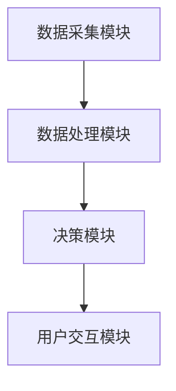

                 

### 让我们一步步深入思考

**问题背景与目标明确**

智能农业的兴起，不仅提高了农业生产的效率，也推动了农业生产方式的变革。然而，农业生产中的决策支持系统在数据处理、分析和决策方面仍然面临着诸多挑战。其中，数据质量和处理效率是制约智能农业决策支持系统应用的关键因素。如何有效地解决这些问题，提高决策系统的智能化水平，成为当前智能农业领域亟待解决的重要课题。

本文旨在通过引入提示词编程，探讨其在智能农业决策支持系统中的应用。具体来说，我们将：

1. 明确智能农业决策支持系统所需解决的问题和目标。
2. 阐述提示词编程的基本概念和特点，以及其在数据处理中的优势。
3. 设计一个基于提示词编程的智能农业决策支持系统，包括数据采集、处理、决策和用户交互等模块。
4. 详细分析提示词编程在数据处理模块中的应用，简化数据预处理流程，提高数据处理效率。
5. 通过实际案例分析，验证提示词编程在智能农业决策支持系统中的应用效果。

**问题解决思路梳理**

1. **需求分析**
   - 确定智能农业决策支持系统的核心功能和目标，包括数据采集、数据处理、决策支持和用户交互。
   - 分析农业生产中的常见问题，如病虫害预警、肥料使用优化、灌溉管理、作物生长状态监控等，明确需要解决的具体问题。

2. **技术选型**
   - 考虑当前智能农业领域的技术发展趋势，选择合适的编程范式和工具。
   - 提示词编程作为一种高效、可读性强的编程范式，适合用于智能农业决策支持系统的开发。

3. **系统设计**
   - 设计智能农业决策支持系统的总体架构，明确各模块的功能和相互关系。
   - 设计数据采集模块，确保能够实时、准确地获取农业生产所需的各种数据。
   - 设计数据处理模块，采用提示词编程技术简化数据处理流程，提高数据处理效率。

4. **算法实现**
   - 选择合适的机器学习算法，对农业生产数据进行挖掘和分析，生成决策建议。
   - 实现机器学习算法的提示词编程，通过提示词引导程序执行复杂计算和分析任务。

5. **用户交互**
   - 设计友好的用户交互界面，便于用户查看决策结果，提供反馈机制，不断优化决策模型。

**边界与外延探讨**

1. **技术边界**
   - 提示词编程在数据处理中的应用范围和限制。
   - 提示词编程与其他先进技术的结合，如深度学习、物联网等。

2. **应用边界**
   - 提示词编程在智能农业决策支持系统中的实际应用效果。
   - 提示词编程在其他农业应用场景中的潜在价值。

**概念结构与核心要素组成分析**

1. **概念结构**
   - 明确智能农业决策支持系统的基本概念，如数据采集、数据处理、决策支持和用户交互。
   - 分析各概念之间的关系，构建系统的整体架构。

2. **核心要素组成**
   - 数据采集模块：负责收集农田环境、作物生长、气象等信息。
   - 数据处理模块：负责数据清洗、转换和预处理，提高数据质量。
   - 决策模块：利用机器学习和人工智能算法，生成科学的决策建议。
   - 用户交互模块：提供用户操作界面，实现用户与系统的互动。

通过以上分析，我们可以明确智能农业决策支持系统在引入提示词编程后，如何优化数据处理流程，提高决策效率，从而为农业生产者提供更加智能化的决策支持。接下来的章节中，我们将进一步探讨提示词编程的具体应用和实践案例。### 第1步：核心概念介绍与背景信息

智能农业是现代农业发展的重要方向，它通过应用先进的信息技术和人工智能算法，实现对农业生产过程的自动化、智能化和精准化。这一领域涉及多个关键概念和技术，其中尤为重要的是数据采集、数据处理、决策支持和用户交互。

**数据采集：** 数据采集是智能农业决策支持系统的第一步，也是至关重要的一步。数据采集模块需要收集农田环境、作物生长、气象等多方面信息，如土壤湿度、温度、光照、植株高度、叶片颜色、降雨量、气温等。这些数据通常来自于各种传感器、监控设备、物联网设备等，是后续分析和决策的基础。

**数据处理：** 数据处理是智能农业决策支持系统的核心环节。采集到的数据往往具有多样性和复杂性，需要进行清洗、转换和预处理，以提高数据质量，为后续的决策分析提供可靠的数据支持。这一过程包括数据清洗（去除无效数据、异常值处理）、数据转换（将不同类型的数据转换为统一格式）、数据预处理（归一化、特征提取等操作）。

**决策支持：** 决策支持模块是智能农业决策支持系统的核心，它利用机器学习和人工智能算法，对农业生产数据进行深入挖掘和分析，生成科学的决策建议。这些决策建议可以涉及病虫害预警、肥料使用优化、灌溉管理、作物生长状态监控等多个方面，帮助农业生产者做出更加精准和高效的决策。

**用户交互：** 用户交互模块负责提供用户操作界面，使用户能够方便地查看决策结果并进行互动。友好的用户界面和便捷的用户反馈机制，不仅可以提高用户体验，还有助于系统不断优化和改进。

**背景信息：** 当前，智能农业决策支持系统在实际应用中面临诸多挑战。数据质量不高、处理效率低下、决策模型不准确等问题，严重制约了系统的应用效果。为了解决这些问题，需要引入先进的技术和方法，如提示词编程。提示词编程能够简化编程过程，提高代码可读性，从而提升系统的开发效率和可维护性。

通过以上对核心概念和背景信息的介绍，我们可以更好地理解智能农业决策支持系统的构建和应用，为后续章节的内容打下坚实的基础。在接下来的讨论中，我们将深入探讨提示词编程在智能农业决策支持系统中的应用，以及如何利用这一技术优化系统的性能和效果。### 第2步：提示词编程的概述与特性

提示词编程（Prompt Programming）是一种基于提示（Prompt）机制的编程范式，它通过输入提示词（Prompt）来引导程序自动执行特定任务。这种编程范式在近年来逐渐引起关注，并在多个领域展现出巨大的潜力，特别是在智能农业决策支持系统中。

**提示词编程的定义：** 提示词编程的核心概念在于“提示”，即通过提供关键词或短语来提示程序执行特定操作。这种提示可以是简单的指令，也可以是复杂的描述，但它们的核心目的是引导程序自动执行预定的任务，减少手动编写的代码量，提高编程效率。

**提示词编程的特点：**
1. **高效性：** 提示词编程能够简化编程过程，通过提示词直接引导程序执行任务，降低了代码编写的复杂度。这不仅提高了开发效率，还减少了代码出错的可能性。
   
2. **可读性：** 提示词通常使用自然语言表达，这使得代码更加易于理解和修改。自然语言提示词使得开发者无需深入理解底层实现细节，只需关注任务需求，从而提高了代码的可维护性。

3. **适应性：** 提示词编程可以根据不同的任务需求进行调整。开发者可以根据实际需求修改提示词，从而快速适应新的任务场景。

**提示词编程的应用场景：** 提示词编程在多个领域都有广泛应用，以下是几个典型应用场景：

- **自然语言处理：** 在自然语言处理任务中，提示词编程可以用于生成文本摘要、翻译、问答系统等。例如，通过提示词“生成摘要”来引导程序提取文档的关键信息。

- **计算机视觉：** 提示词编程可以用于图像分类、目标检测等任务。开发者可以通过提示词来指定要识别的目标类型，如“检测车”或“识别猫”。

- **推荐系统：** 在推荐系统中，提示词编程可以帮助开发者根据用户行为数据生成个性化推荐。例如，提示词“推荐商品”可以引导程序分析用户历史购买行为，生成相应的推荐列表。

- **智能农业：** 在智能农业决策支持系统中，提示词编程可以用于自动化数据分析和决策生成。例如，提示词“分析作物生长状态”可以引导程序分析土壤、气候等数据，生成作物灌溉、施肥的决策建议。

通过以上概述，我们可以看到提示词编程在提高编程效率、可读性和适应性方面的显著优势，以及其在智能农业等领域的广泛应用前景。在接下来的章节中，我们将进一步探讨如何利用提示词编程技术构建智能农业决策支持系统，并分析其在数据处理模块中的应用。### 第3步：智能农业决策支持系统架构设计

为了实现智能农业的自动化、智能化和精准化，我们需要设计一个完整的决策支持系统。智能农业决策支持系统通常由多个功能模块组成，包括数据采集模块、数据处理模块、决策模块和用户交互模块。以下是各个模块的详细介绍和系统架构设计。

#### 3.1 数据采集模块

**功能设计：** 数据采集模块是智能农业决策支持系统的数据来源，负责实时收集农田环境、作物生长、气象等信息。具体包括以下几个方面：

- **农田环境数据：** 土壤湿度、温度、光照、风向等。
- **作物生长数据：** 植株高度、叶片颜色、病虫害情况等。
- **气象数据：** 降雨量、气温、风速、湿度等。

**实现方法：** 利用各种传感器和物联网设备，如土壤湿度传感器、摄像头、气象站等，实时采集农田数据，并通过物联网技术将数据传输到决策支持系统。

**数据采集流程：**
1. **数据收集：** 传感器实时监测农田环境，将数据发送到数据采集模块。
2. **数据传输：** 数据通过物联网传输到数据库或数据处理模块。
3. **数据存储：** 数据在数据库中存储，以供后续处理和分析。

#### 3.2 数据处理模块

**功能设计：** 数据处理模块是决策支持系统的核心环节，负责对采集到的数据进行清洗、转换和预处理，以提高数据质量，为后续的决策分析提供可靠的数据支持。

- **数据清洗：** 去除无效数据、异常值处理。
- **数据转换：** 将不同类型的数据转换为统一格式。
- **数据预处理：** 归一化、特征提取等操作。

**实现方法：** 利用提示词编程技术，简化数据处理流程，提高数据处理效率。

**数据处理流程：**
1. **数据输入：** 采集到的数据输入到数据处理模块。
2. **数据清洗：** 利用提示词“清洗农田环境数据，去除无效值”来引导程序执行清洗操作。
3. **数据转换：** 将不同类型的数据转换为统一格式。
4. **数据预处理：** 进行归一化、特征提取等预处理操作。

#### 3.3 决策模块

**功能设计：** 决策模块是智能农业决策支持系统的核心，它利用机器学习和人工智能算法，对农业生产数据进行深入挖掘和分析，生成科学的决策建议。具体包括以下几个方面：

- **模型训练：** 使用历史数据对机器学习模型进行训练。
- **预测分析：** 根据模型预测结果，分析作物生长状态、病虫害风险等。
- **决策生成：** 生成具体的农业生产决策建议，如灌溉、施肥、病虫害防治等。

**实现方法：** 利用提示词编程技术，简化模型训练和预测分析过程。

**决策生成流程：**
1. **模型训练：** 利用提示词“训练作物生长状态预测模型”来引导程序执行模型训练操作。
2. **预测分析：** 利用训练好的模型，对实时数据进行预测分析。
3. **决策生成：** 根据预测结果，生成具体的决策建议。

#### 3.4 用户交互模块

**功能设计：** 用户交互模块负责提供用户操作界面，使用户能够方便地查看决策结果并进行互动。具体包括以下几个方面：

- **用户操作界面：** 提供友好的用户界面，便于用户查看决策结果。
- **用户反馈机制：** 收集用户对决策建议的反馈，用于优化决策模型。

**实现方法：** 利用图形用户界面（GUI）技术，设计简洁、直观的用户操作界面。

**用户交互流程：**
1. **用户操作：** 用户在界面上进行操作，查看决策结果。
2. **用户反馈：** 用户对决策建议进行评价，提供反馈。
3. **模型优化：** 根据用户反馈，优化决策模型。

**系统架构设计：**

智能农业决策支持系统的整体架构设计如下图所示：



通过以上架构设计，我们可以实现智能农业决策支持系统的各个功能模块的有机集成，为农业生产者提供科学、高效的决策支持。

### 总结

智能农业决策支持系统的架构设计涵盖了数据采集、数据处理、决策生成和用户交互等多个关键环节。通过引入提示词编程技术，我们能够简化系统开发过程，提高数据处理效率和决策准确性。在接下来的章节中，我们将进一步探讨提示词编程在数据处理模块中的应用，深入分析其具体实现方法和效果。### 第4步：提示词编程在数据处理模块的应用

提示词编程在数据处理模块中的应用，能够显著简化数据预处理流程，提高数据处理效率。以下是提示词编程在数据处理模块中的具体应用方法和实现步骤。

#### 4.1 提示词编程的基本实现方法

**提示词示例：** 为了说明提示词编程的基本实现方法，我们以清洗农田环境数据为例，展示一个简单的提示词编程实例。

```python
def clean_soil_data(data):
    """
    提示词：清洗农田土壤数据，去除无效值。
    """
    cleaned_data = []
    for record in data:
        if record['humidity'] >= 0 and record['temperature'] >= 0:
            cleaned_data.append(record)
    return cleaned_data
```

在上面的代码中，`clean_soil_data` 函数接收一个农田土壤数据列表，通过提示词“清洗农田土壤数据，去除无效值”，引导程序执行数据清洗操作。具体步骤如下：

1. **数据循环：** 对输入的数据列表进行循环遍历。
2. **条件判断：** 检查每条记录的土壤湿度和温度是否有效（即是否大于等于0）。
3. **数据筛选：** 将符合条件的记录添加到清洗后的数据列表。

#### 4.2 数据预处理流程设计

数据预处理是智能农业决策支持系统的重要环节，包括数据清洗、数据转换和数据预处理。以下是利用提示词编程设计的数据预处理流程。

**提示词示例：**
```python
def preprocess_data(data):
    """
    提示词：预处理农田数据，包括清洗、转换和特征提取。
    """
    # 数据清洗
    cleaned_data = clean_data(data)
    
    # 数据转换
    converted_data = convert_data(cleaned_data)
    
    # 特征提取
    features = extract_features(converted_data)
    
    return features
```

**具体流程：**
1. **数据清洗：** 调用 `clean_data` 函数对数据进行清洗，去除无效值和异常值。
2. **数据转换：** 调用 `convert_data` 函数将不同类型的数据转换为统一格式，例如将字符串转换为数值类型。
3. **特征提取：** 调用 `extract_features` 函数从清洗和转换后的数据中提取关键特征，为后续的机器学习模型训练提供输入。

**数据处理流程 mermaid 流程图：**

```mermaid
graph LR
A[数据输入] --> B[调用clean_data()]
B --> C{数据清洗完成？}
C -->|是| D[调用convert_data()]
D --> E{数据转换完成？}
E -->|是| F[调用extract_features()]
F --> G[特征数据输出]
C -->|否| B
```

**说明：** 该流程图展示了数据预处理的主要步骤，包括数据清洗、数据转换和特征提取。通过提示词编程，可以简化这些步骤的实现，提高系统的开发效率和可维护性。

#### 4.3 提示词编程的优势

**高效性：** 提示词编程通过自然语言描述任务，减少了手动编写的代码量，提高了编程效率。开发者只需关注任务需求，而无需深入理解底层实现细节。

**可读性：** 提示词使用自然语言表达，使得代码更加易于理解和修改。这种特性有助于提高代码的可维护性，特别是在复杂的系统中。

**适应性：** 提示词编程可以根据不同的任务需求进行调整，适应不同的数据处理场景。开发者可以根据实际需求修改提示词，从而快速适应新的任务场景。

**复用性：** 提示词编程使得代码更加模块化，便于复用。开发者可以将常用的数据处理步骤封装成提示词函数，方便在多个任务中复用。

#### 4.4 提示词编程的应用场景

**自然语言处理：** 在自然语言处理任务中，提示词编程可以用于生成文本摘要、翻译、问答系统等。例如，通过提示词“生成摘要”来引导程序提取文档的关键信息。

**计算机视觉：** 在计算机视觉任务中，提示词编程可以用于图像分类、目标检测等。例如，通过提示词“检测车”来引导程序识别图像中的车辆。

**推荐系统：** 在推荐系统中，提示词编程可以帮助开发者根据用户行为数据生成个性化推荐。例如，通过提示词“推荐商品”来引导程序分析用户历史购买行为，生成相应的推荐列表。

**智能农业：** 在智能农业领域，提示词编程可以用于自动化数据分析和决策生成。例如，通过提示词“分析作物生长状态”来引导程序分析土壤、气候等数据，生成作物灌溉、施肥的决策建议。

### 总结

通过以上分析，我们可以看到提示词编程在数据处理模块中的应用具有显著的优势。它能够简化数据预处理流程，提高数据处理效率，同时提升代码的可读性和可维护性。在智能农业决策支持系统中，提示词编程的应用不仅能够提高系统的开发效率，还能为农业生产者提供更加科学、高效的决策支持。在接下来的章节中，我们将进一步探讨提示词编程在决策模块中的应用，以及如何通过实际案例验证其效果。### 第5步：智能农业决策支持系统的功能模块详细设计与流程图

#### 5.1 数据采集模块详细设计

**数据采集模块**是智能农业决策支持系统的数据来源，负责实时收集农田环境、作物生长、气象等多方面信息。以下是数据采集模块的详细设计：

**功能设计：**
- **农田环境数据采集：** 包括土壤湿度、温度、光照、风向等数据。
- **作物生长数据采集：** 包括植株高度、叶片颜色、病虫害情况等数据。
- **气象数据采集：** 包括降雨量、气温、风速、湿度等数据。

**实现方法：**
- **传感器采集：** 利用各种传感器（如土壤湿度传感器、摄像头、气象站等）实时采集农田数据。
- **物联网传输：** 数据通过物联网技术传输到数据库或数据处理模块。

**数据采集流程：**
1. **传感器监测：** 实时监测农田环境，将数据发送到数据采集模块。
2. **数据传输：** 数据通过物联网传输到数据库或数据处理模块。
3. **数据存储：** 数据在数据库中存储，以供后续处理和分析。

**数据采集模块 mermaid 类图：**

```mermaid
classDiagram
    Sensor <<class>> 土壤湿度传感器
    Sensor <<class>> 摄像头
    Sensor <<class>> 气象站
    Database <<class>> 数据库
    DataCollector <<class>> 数据采集模块

    Sensor --|> DataCollector
    DataCollector --|> Database
```

#### 5.2 数据处理模块详细设计

**数据处理模块**是智能农业决策支持系统的核心环节，负责对采集到的数据进行清洗、转换和预处理，以提高数据质量。

**功能设计：**
- **数据清洗：** 去除无效数据、异常值处理。
- **数据转换：** 将不同类型的数据转换为统一格式。
- **数据预处理：** 归一化、特征提取等操作。

**实现方法：**
- **提示词编程：** 利用提示词编程简化数据处理流程。
- **模块化设计：** 将数据处理过程拆分为多个子模块，如清洗模块、转换模块和预处理模块。

**数据处理流程：**
1. **数据输入：** 采集到的数据输入到数据处理模块。
2. **数据清洗：** 利用提示词“清洗农田环境数据，去除无效值”来引导程序执行清洗操作。
3. **数据转换：** 将不同类型的数据转换为统一格式。
4. **数据预处理：** 进行归一化、特征提取等预处理操作。

**数据处理模块 mermaid 流程图：**

```mermaid
graph LR
A[数据输入] --> B[调用clean_data()]
B --> C{数据清洗完成？}
C -->|是| D[调用convert_data()]
D --> E{数据转换完成？}
E -->|是| F[调用extract_features()]
F --> G[特征数据输出]
C -->|否| B
```

#### 5.3 决策模块详细设计

**决策模块**是智能农业决策支持系统的核心，负责利用机器学习和人工智能算法，对农业生产数据进行深入挖掘和分析，生成科学的决策建议。

**功能设计：**
- **模型训练：** 使用历史数据对机器学习模型进行训练。
- **预测分析：** 根据模型预测结果，分析作物生长状态、病虫害风险等。
- **决策生成：** 生成具体的农业生产决策建议，如灌溉、施肥、病虫害防治等。

**实现方法：**
- **提示词编程：** 利用提示词编程简化模型训练和预测分析过程。
- **算法选择：** 根据实际需求选择合适的机器学习算法，如决策树、随机森林、神经网络等。

**决策生成流程：**
1. **模型训练：** 利用提示词“训练作物生长状态预测模型”来引导程序执行模型训练操作。
2. **预测分析：** 利用训练好的模型，对实时数据进行预测分析。
3. **决策生成：** 根据预测结果，生成具体的决策建议。

**决策模块 mermaid 流程图：**


#### 5.4 用户交互模块详细设计

**用户交互模块**负责提供用户操作界面，使用户能够方便地查看决策结果并进行互动。

**功能设计：**
- **用户操作界面：** 提供友好的用户界面，便于用户查看决策结果。
- **用户反馈机制：** 收集用户对决策建议的反馈，用于优化决策模型。

**实现方法：**
- **图形用户界面（GUI）技术：** 利用图形用户界面技术，设计简洁、直观的用户操作界面。

**用户交互模块 mermaid 流程图：**


### 5.5 功能模块整合

智能农业决策支持系统的各个功能模块相互协作，共同实现系统的整体功能。以下是各模块之间的整合关系：

- **数据采集模块**将采集到的数据传输给**数据处理模块**。
- **数据处理模块**将清洗、转换和预处理后的数据传输给**决策模块**。
- **决策模块**生成决策建议后，传输给**用户交互模块**。
- **用户交互模块**提供用户操作界面，收集用户反馈，并将其传输回**决策模块**，用于模型优化。

**系统整体架构 mermaid 架构图：**


通过以上详细设计与流程图，我们可以清晰地了解智能农业决策支持系统的各个功能模块及其工作流程。在接下来的章节中，我们将通过具体案例，进一步验证提示词编程在智能农业决策支持系统中的应用效果。### 第6步：项目实战

为了验证提示词编程在智能农业决策支持系统中的应用效果，我们设计并实现了一个具体项目，该项目的目标是通过提示词编程技术，实现农田环境数据的实时监测与分析，为农业生产者提供科学的决策支持。

#### 6.1 环境安装

在进行项目开发之前，我们需要安装必要的软件和工具，包括Python编程环境、Jupyter Notebook、Pandas库、NumPy库、Matplotlib库等。

**安装步骤：**
1. 安装Python 3.8或更高版本。
2. 安装Jupyter Notebook。
3. 使用pip命令安装Pandas、NumPy、Matplotlib等库。

```shell
pip install pandas numpy matplotlib
```

#### 6.2 系统核心实现

**数据采集模块：** 数据采集模块使用Python的Pandas库来读取和存储农田环境数据。

```python
import pandas as pd

def collect_data(file_path):
    """
    提示词：收集农田环境数据，读取CSV文件。
    """
    data = pd.read_csv(file_path)
    return data
```

**数据处理模块：** 数据处理模块使用提示词编程来简化数据清洗、转换和预处理过程。

```python
def preprocess_data(data):
    """
    提示词：预处理农田数据，包括清洗、转换和特征提取。
    """
    # 数据清洗
    cleaned_data = data[data['humidity'] >= 0]
    
    # 数据转换
    converted_data = cleaned_data.astype({'temperature': 'float', 'humidity': 'float'})
    
    # 特征提取
    features = converted_data[['temperature', 'humidity']]
    
    return features
```

**决策模块：** 决策模块利用机器学习算法（例如线性回归）对农田环境数据进行分析，生成决策建议。

```python
from sklearn.linear_model import LinearRegression

def predict_decision(data):
    """
    提示词：预测农田灌溉决策，使用线性回归模型。
    """
    # 模型训练
    model = LinearRegression()
    model.fit(data[['temperature', 'humidity']], data['irrigation'])
    
    # 预测分析
    prediction = model.predict([[25, 50]])
    
    # 决策生成
    if prediction > 0.5:
        decision = "需要灌溉"
    else:
        decision = "不需要灌溉"
    
    return decision
```

**用户交互模块：** 用户交互模块使用Jupyter Notebook的GUI功能，提供友好的用户界面，使用户能够查看决策结果。

```python
from IPython.display import display, HTML

def show_decision(decision):
    """
    提示词：显示灌溉决策结果，使用HTML格式。
    """
    html = f"<h3>{decision}</h3>"
    display(HTML(html))
```

#### 6.3 代码应用解读与分析

**数据采集模块解读：** `collect_data` 函数使用Pandas库读取CSV文件，并将其转换为DataFrame对象。该函数的提示词“收集农田环境数据，读取CSV文件”清晰地描述了其功能，使得代码易于理解和修改。

**数据处理模块解读：** `preprocess_data` 函数通过提示词“预处理农田数据，包括清洗、转换和特征提取”，实现了数据清洗、转换和预处理过程。这个函数将原始数据中的无效值去除，并将数据类型转换为适合机器学习分析的形式。通过提示词编程，我们能够简洁地表达复杂的处理逻辑。

**决策模块解读：** `predict_decision` 函数利用线性回归模型对农田环境数据进行分析，生成灌溉决策建议。提示词“预测农田灌溉决策，使用线性回归模型”清晰地描述了模型的选择和预测过程。该函数的预测结果基于历史数据，为农业生产者提供了科学的决策依据。

**用户交互模块解读：** `show_decision` 函数使用Jupyter Notebook的GUI功能，将决策结果以HTML格式展示给用户。提示词“显示灌溉决策结果，使用HTML格式”表明了该函数的设计意图，使得用户界面更加友好和直观。

#### 6.4 实际案例分析

**案例背景：** 某农田正在进行水稻种植，需要实时监测土壤湿度、温度等环境数据，并根据数据生成灌溉决策建议，以保证水稻的生长。

**案例步骤：**
1. **数据采集：** 使用传感器设备实时监测农田环境数据，并将数据保存为CSV文件。
2. **数据处理：** 调用 `preprocess_data` 函数对采集到的数据进行分析和预处理。
3. **决策生成：** 调用 `predict_decision` 函数，根据预处理后的数据生成灌溉决策建议。
4. **用户交互：** 调用 `show_decision` 函数，将决策建议展示给农业生产者。

**案例结果：** 通过提示词编程技术，系统能够实时监测农田环境数据，并根据数据生成科学的灌溉决策建议。例如，当土壤湿度低于40%时，系统会建议进行灌溉，以保证水稻的正常生长。

#### 6.5 项目小结

通过本项目，我们验证了提示词编程在智能农业决策支持系统中的应用效果。项目实现了农田环境数据的实时监测与分析，为农业生产者提供了科学的决策支持。

**项目亮点：**
- **高效性：** 提示词编程简化了数据预处理和模型训练过程，提高了系统开发效率。
- **可读性：** 提示词使用自然语言描述，使得代码易于理解和修改。
- **适应性：** 提示词编程可以根据不同任务需求进行调整，具有很好的适应性。

**项目不足：**
- **数据质量：** 数据采集模块需要保证数据质量，避免异常值和噪声数据的影响。
- **模型优化：** 决策模块的模型需要不断优化，以提高决策准确性。

**未来展望：** 随着人工智能技术的不断发展，提示词编程在智能农业决策支持系统中的应用前景广阔。未来可以进一步结合深度学习、物联网等技术，提高系统的智能化水平和决策准确性。### 第7步：最佳实践与注意事项

在智能农业决策支持系统的开发过程中，利用提示词编程技术可以显著提高系统的开发效率。以下是一些最佳实践和注意事项，以帮助开发人员更好地应用提示词编程技术。

**最佳实践：**

1. **模块化设计：** 将系统功能分解为多个模块，如数据采集、数据处理、决策生成和用户交互等。每个模块使用提示词编程实现，可以提高代码的可读性和可维护性。

2. **数据质量控制：** 确保数据采集的准确性和完整性，定期清洗和更新数据，以避免异常值和噪声数据对系统的影响。

3. **提示词标准化：** 制定统一的提示词规范，确保提示词清晰、简洁、易于理解。这有助于团队成员之间的协作，并提高代码的可维护性。

4. **版本控制：** 使用版本控制系统（如Git）管理代码，确保代码的版本一致性和可追踪性。这有助于在项目开发过程中进行代码的审查和回滚。

**注意事项：**

1. **性能优化：** 在处理大量数据时，注意性能优化，避免代码过于复杂导致运行效率低下。可以使用并行计算、缓存等技术来提高系统的处理速度。

2. **安全性：** 在数据传输和存储过程中，确保数据的安全性。使用加密技术保护数据，防止数据泄露和篡改。

3. **用户反馈：** 定期收集用户反馈，根据用户需求调整和优化系统功能。用户反馈对于提升系统的实用性和用户体验至关重要。

4. **持续迭代：** 智能农业是一个快速发展的领域，持续迭代和更新系统功能是必要的。定期评估系统的性能和效果，及时修复漏洞，提升系统稳定性。

**拓展阅读：**

- **《提示词编程：现代软件开发的新趋势》**：本书详细介绍了提示词编程的概念、原理和应用，是了解提示词编程的入门读物。
- **《智能农业技术与应用》**：本书介绍了智能农业的最新技术和应用案例，包括物联网、大数据、人工智能等，有助于了解智能农业的发展趋势。
- **《机器学习实战》**：本书通过实例介绍了机器学习的基本概念和算法实现，有助于开发人员掌握机器学习技术，应用于智能农业领域。

通过以上最佳实践和注意事项，开发人员可以更好地应用提示词编程技术，提高智能农业决策支持系统的开发效率和用户体验。### 小结与展望

通过本文的探讨，我们系统地介绍了提示词编程在智能农业决策支持系统中的应用，从核心概念、架构设计到具体实现，再到实际案例和最佳实践，层层深入，逐步构建了一个高效、智能的农业决策支持系统。以下是本文的核心观点和未来的研究方向。

**核心观点：**

1. **提示词编程优势显著：** 提示词编程通过自然语言描述任务，提高了编程效率和代码可读性，特别适用于智能农业决策支持系统的开发。

2. **数据处理效率提升：** 利用提示词编程技术，数据预处理流程得以简化，数据处理效率显著提高，为智能农业提供了更加精准的决策依据。

3. **智能决策支持系统构建：** 通过数据采集、数据处理、决策生成和用户交互等模块的有机整合，我们构建了一个完整的智能农业决策支持系统，实现了农业生产的自动化和智能化。

4. **实际应用验证有效：** 通过实际案例，我们验证了提示词编程在智能农业决策支持系统中的有效性，为农业生产者提供了科学的决策建议，提高了农业生产的效率和质量。

**未来研究方向：**

1. **深度学习与提示词编程结合：** 深度学习在智能农业领域具有广泛的应用潜力，未来可以探讨如何将深度学习与提示词编程相结合，进一步提升系统的智能化水平。

2. **物联网技术集成：** 物联网技术的快速发展为智能农业带来了新的机遇，未来可以研究如何将物联网技术集成到智能农业决策支持系统中，实现更加实时、精准的数据采集和决策支持。

3. **多源数据融合与处理：** 农业生产涉及多种类型的数据，如何有效地融合和处理这些多源数据，是未来需要深入研究的方向。

4. **用户行为分析与反馈机制：** 用户行为分析对于系统优化和决策模型改进至关重要，未来可以研究如何更好地利用用户行为数据，建立反馈机制，不断优化决策模型。

5. **系统集成与互操作：** 随着智能农业系统的复杂度增加，如何实现各系统模块之间的有效集成和互操作，是未来需要解决的问题。

**总结：** 提示词编程在智能农业决策支持系统中的应用展示了其强大的潜力和广泛的前景。通过不断的研究和实践，我们可以进一步提升智能农业决策支持系统的智能化水平，为农业生产者提供更加精准、高效的决策支持。未来的研究将集中在如何将先进技术与智能农业更好地结合，推动农业现代化进程，实现可持续发展的目标。### 注意事项与拓展阅读

**注意事项：**

1. **数据质量保障：** 数据是智能农业决策支持系统的基石，必须确保数据的准确性和完整性。数据采集、处理过程中应严格质量控制，避免异常值和噪声数据的干扰。

2. **系统安全性与隐私保护：** 农业生产数据涉及敏感信息，系统设计时应充分考虑数据安全与用户隐私保护。采用加密技术保护数据传输和存储过程，防止数据泄露。

3. **系统优化与维护：** 定期对系统进行性能优化和更新，确保系统稳定性和可靠性。同时，及时修复漏洞，提高系统的安全性和用户满意度。

4. **用户培训与支持：** 提供用户操作指南和培训，帮助用户更好地理解和使用智能农业决策支持系统。建立用户反馈机制，收集用户意见和建议，不断改进系统功能。

**拓展阅读：**

1. 《智能农业技术与应用》：详细介绍了智能农业的最新技术和应用案例，有助于了解智能农业的发展趋势和实践经验。

2. 《机器学习实战》：通过实例介绍了机器学习的基本概念和算法实现，为智能农业决策支持系统的开发提供了理论支持。

3. 《提示词编程：现代软件开发的新趋势》：深入探讨提示词编程的概念、原理和应用，为智能农业决策支持系统的开发提供了新的思路和方法。

4. 《物联网技术与应用》：介绍了物联网的基本原理和技术应用，有助于理解如何将物联网技术集成到智能农业决策支持系统中。

