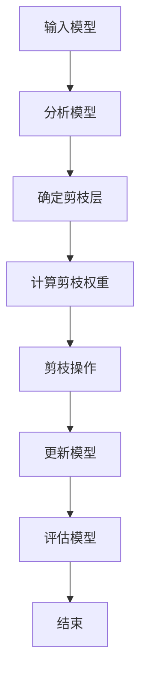
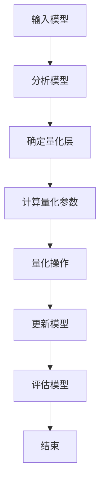
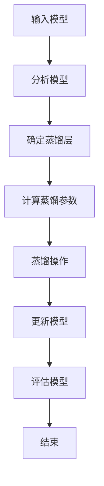
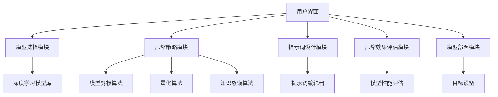
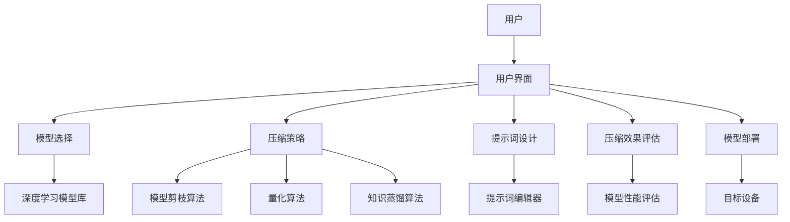

                 


# 提示词编程在深度学习模型压缩中的应用

## 关键词
- 提示词编程
- 深度学习模型压缩
- 模型剪枝
- 量化
- 知识蒸馏

## 摘要
本文旨在探讨提示词编程在深度学习模型压缩中的应用。随着深度学习技术的不断发展，模型的规模越来越大，而模型的压缩成为了一个热门话题。本文介绍了提示词编程的原理、深度学习模型压缩算法以及提示词设计方法，通过具体的实例和实际应用，展示了提示词编程在深度学习模型压缩中的优势。

## 第一部分：背景介绍

### 1.1 问题背景

随着深度学习技术的不断发展，模型的规模越来越大，而模型的压缩成为了一个热门话题。压缩模型不仅能够减少计算资源的消耗，还能提升模型的部署效率。在移动设备和嵌入式系统中，模型的压缩尤为重要。然而，现有的压缩方法如模型剪枝、量化、知识蒸馏等，都有一定的局限性。如何进一步提高压缩效果，同时保持模型的性能，成为了一个亟待解决的问题。

### 1.2 问题描述

深度学习模型的压缩是一个复杂的过程，涉及到模型的架构、参数、计算资源等多个方面。现有的压缩方法主要分为模型剪枝、量化、知识蒸馏等，但它们都有一定的局限性。模型剪枝通过移除模型中的冗余权重，减少模型的参数数量，但可能会影响模型的性能。量化通过将模型的权重和激活值从浮点数转换为整数，减少模型的存储和计算需求，但可能会降低模型的精度。知识蒸馏通过将大型模型的权重传递给小型模型，从而实现模型的压缩，但可能需要大量的计算资源和时间。

### 1.3 问题解决

提示词编程作为一种新兴的编程范式，通过引入可解释性、可编程性等特性，为深度学习模型压缩提供了一种新的思路。提示词编程允许用户通过自然语言与计算机进行交互，以实现特定的任务。通过设计有效的提示词，可以指导模型在压缩过程中的行为，从而提高压缩效果。提示词编程不仅能够提高压缩效率，还能保持模型的性能。

### 1.4 边界与外延

提示词编程在深度学习模型压缩中的应用主要涉及以下几个方面：

1. **模型选择**：选择适合压缩的模型，如ResNet、VGG等。
2. **压缩策略**：确定压缩的目标、方法和步骤，如剪枝、量化、知识蒸馏等。
3. **提示词设计**：设计有效的提示词，提高压缩效果。
4. **实际应用**：将压缩后的模型应用于实际场景，验证其效果。

### 1.5 概念结构与核心要素组成

提示词编程在深度学习模型压缩中的概念结构主要包括以下几个方面：

1. **提示词**：用于指导模型压缩的指令或信息。
2. **压缩算法**：实现模型压缩的方法，如剪枝、量化、知识蒸馏等。
3. **模型优化**：对压缩后的模型进行优化，提高其性能。
4. **实际应用**：将压缩后的模型应用于实际场景，验证其效果。

### 1.6 本章小结

本章介绍了提示词编程在深度学习模型压缩中的应用背景、问题描述、问题解决、边界与外延、概念结构与核心要素组成。下一章将深入探讨提示词编程的原理、方法及其在深度学习模型压缩中的应用。

## 第二部分：核心概念与联系

### 2.1 提示词编程原理

#### 2.1.1 提示词编程的定义

提示词编程是一种基于人类语言交互的编程范式，它允许用户通过自然语言与计算机进行交互，以实现特定的任务。在提示词编程中，用户可以通过编写提示词来指导计算机执行特定操作。

#### 2.1.2 提示词编程的核心特点

1. **可解释性**：提示词编程能够提供模型的决策过程，使得模型的可解释性更强。
2. **可编程性**：用户可以通过编写提示词来指导模型的压缩过程，使得压缩过程更加灵活。
3. **交互性**：用户可以实时与模型进行交互，根据反馈调整提示词，从而优化压缩效果。

#### 2.1.3 提示词编程与深度学习的关系

提示词编程为深度学习模型压缩提供了一种新的思路，通过引入提示词，可以指导模型在压缩过程中的行为，从而提高压缩效果。提示词编程不仅可以提高压缩效率，还能保持模型的性能。

### 2.2 深度学习模型压缩算法

#### 2.2.1 模型剪枝

模型剪枝通过移除模型中的冗余权重，减少模型的参数数量，从而实现模型的压缩。剪枝可以分为结构剪枝和权重剪枝。结构剪枝通过移除模型的某些层或神经元，从而减少模型的参数数量。权重剪枝通过降低某些权重的值，从而减少模型的参数数量。

#### 2.2.2 量化

量化将模型的权重和激活值从浮点数转换为整数，从而减少模型的存储和计算需求。量化可以分为全精度量化（FP32）和低精度量化（FP16、INT8）。低精度量化可以减少模型的存储和计算需求，但可能会降低模型的精度。

#### 2.2.3 知识蒸馏

知识蒸馏通过将大型模型的权重传递给小型模型，从而实现模型的压缩。知识蒸馏将大型模型的输出作为教师模型，将小型模型的输出作为学生模型，通过最小化教师模型和学生模型之间的输出差异，从而训练小型模型。

#### 2.2.4 提示词编程与压缩算法的联系

提示词编程可以与模型剪枝、量化、知识蒸馏等压缩算法相结合，通过设计有效的提示词，指导压缩过程，提高压缩效果。例如，用户可以通过编写提示词来指定剪枝的目标层、量化精度、知识蒸馏的温度等。

### 2.3 提示词设计

#### 2.3.1 提示词的定义

提示词是用于指导模型压缩的指令或信息。提示词通常由一系列的指令和参数组成，用于指导模型在压缩过程中的行为。

#### 2.3.2 提示词的设计原则

1. **明确性**：提示词应清晰明了，避免歧义。
2. **针对性**：提示词应针对具体模型和压缩目标进行设计。
3. **可调性**：提示词应具有可调整性，以便在不同场景下进行优化。

#### 2.3.3 提示词的设计方法

1. **基于规则的设计**：根据模型的特点和压缩目标，设计一系列规则，指导压缩过程。
2. **基于数据的优化**：通过实验和数据分析，优化提示词的设计。

### 2.4 本章小结

本章介绍了提示词编程的原理、深度学习模型压缩算法以及提示词设计方法。通过本章的学习，读者可以了解提示词编程在深度学习模型压缩中的应用，并为后续章节的学习打下基础。

## 第三部分：算法原理讲解

### 3.1 模型剪枝算法原理

#### 3.1.1 剪枝算法的mermaid流程图



#### 3.1.2 模型剪枝的python源代码

```python
import tensorflow as tf

# 加载模型
model = tf.keras.models.load_model('model.h5')

# 分析模型
model.summary()

# 确定剪枝层
 prune_layer = 'layer_name'

# 计算剪枝权重
 weights = model.layers[prune_layer].get_weights()

# 剪枝操作
 pruned_weights = np.where(weights < threshold, 0, weights)

# 更新模型
model.layers[prune_layer].set_weights(pruned_weights)

# 评估模型
model.evaluate(x_test, y_test)
```

#### 3.1.3 模型剪枝的数学模型和公式

$$
\text{剪枝权重} = \text{权重} \times (\text{阈值} < \text{权重})
$$

其中，$\text{权重}$为模型的权重值，$\text{阈值}$为剪枝的阈值。如果权重值小于阈值，则将其设置为0，否则保持不变。

### 3.2 量化算法原理

#### 3.2.1 量化的mermaid流程图



#### 3.2.2 量化的python源代码

```python
import tensorflow as tf

# 加载模型
model = tf.keras.models.load_model('model.h5')

# 分析模型
model.summary()

# 确定量化层
 quantized_layer = 'layer_name'

# 计算量化参数
 quantization_params = model.layers[quantized_layer].quantization_params

# 量化操作
 quantized_weights = tf.quantization.quantize_weights(
    model.layers[quantized_layer].get_weights(), quantization_params
)

# 更新模型
model.layers[quantized_layer].set_weights(quantized_weights)

# 评估模型
model.evaluate(x_test, y_test)
```

#### 3.2.3 量化的数学模型和公式

$$
\text{量化权重} = \text{权重} \times (\text{量化参数})
$$

其中，$\text{权重}$为模型的权重值，$\text{量化参数}$为量化的参数。量化参数通常包括缩放因子和零点。

### 3.3 知识蒸馏算法原理

#### 3.3.1 知识蒸馏的mermaid流程图



#### 3.3.2 知识蒸馏的python源代码

```python
import tensorflow as tf

# 加载模型
teacher_model = tf.keras.models.load_model('teacher_model.h5')
student_model = tf.keras.models.load_model('student_model.h5')

# 分析模型
teacher_model.summary()
student_model.summary()

# 确定蒸馏层
 distillation_layer = 'layer_name'

# 计算蒸馏参数
 distillation_params = teacher_model.layers[distillation_layer].distillation_params

# 蒸馏操作
 distillation_loss = tf.keras.losses.CategoricalCrossentropy(
    from_logits=True, reduction='sum'
)

distillation_loss(
    student_model.layers[distillation_layer].output,
    teacher_model.layers[distillation_layer].output
)

# 更新模型
student_model.compile(optimizer='adam', loss=distillation_loss)
student_model.fit(x_train, y_train, epochs=10)

# 评估模型
student_model.evaluate(x_test, y_test)
```

#### 3.3.3 知识蒸馏的数学模型和公式

$$
\text{蒸馏损失} = -\sum_{i} \sum_{j} \text{softmax}(\text{学生模型输出})_{ij} \cdot \log(\text{教师模型输出})_{ij}
$$

其中，$\text{学生模型输出}$和$\text{教师模型输出}$分别为学生模型和教师模型在某一层的输出。

## 第四部分：系统分析与架构设计

### 4.1 问题场景介绍

随着深度学习技术在各个领域的广泛应用，模型的规模和复杂度不断增长。然而，在移动设备、嵌入式系统等资源受限的环境下，如何高效地部署这些模型成为了一个重要的挑战。深度学习模型的压缩技术能够在不显著损失模型性能的前提下，显著减少模型的存储和计算资源消耗，从而使得模型能够在资源受限的环境下高效运行。

### 4.2 项目介绍

本项目的目标是实现一个基于提示词编程的深度学习模型压缩系统，该系统旨在通过提示词编程的方法，提高模型压缩的效率，同时保持模型的性能。系统的主要功能包括：

1. **模型选择**：根据应用场景，选择适合压缩的深度学习模型。
2. **压缩策略**：提供多种压缩算法，如模型剪枝、量化、知识蒸馏等，并允许用户通过提示词编程自定义压缩策略。
3. **提示词设计**：提供提示词编辑器，允许用户根据具体需求设计提示词。
4. **压缩效果评估**：对压缩后的模型进行评估，确保模型性能满足预期。
5. **模型部署**：将压缩后的模型部署到目标设备上，进行实际应用。

### 4.3 系统功能设计

系统功能设计主要包括以下几个方面：

1. **模型选择模块**：该模块提供多种深度学习模型的预定义列表，用户可以根据实际需求选择模型。
2. **压缩策略模块**：该模块提供多种压缩算法的实现，用户可以通过提示词编程选择并定制压缩策略。
3. **提示词设计模块**：该模块提供提示词编辑器，用户可以在编辑器中编写提示词，指导压缩过程。
4. **压缩效果评估模块**：该模块对压缩后的模型进行性能评估，确保模型满足压缩目标。
5. **模型部署模块**：该模块负责将压缩后的模型部署到目标设备上，包括移动设备、嵌入式系统等。

### 4.4 系统架构设计

系统架构设计如图所示：



### 4.5 系统接口设计

系统接口设计主要包括以下几个方面：

1. **用户界面**：提供用户操作界面，包括模型选择、压缩策略设置、提示词编辑、压缩效果评估和模型部署等功能。
2. **模型选择接口**：提供模型选择功能，允许用户从预定义的模型列表中选择模型。
3. **压缩策略接口**：提供压缩策略设置功能，允许用户选择并定制压缩算法。
4. **提示词设计接口**：提供提示词编辑功能，允许用户编写和调整提示词。
5. **压缩效果评估接口**：提供压缩效果评估功能，对压缩后的模型进行性能评估。
6. **模型部署接口**：提供模型部署功能，将压缩后的模型部署到目标设备。

### 4.6 系统交互设计

系统交互设计如图所示：



## 第五部分：项目实战

### 5.1 环境安装

要在本地环境中搭建基于提示词编程的深度学习模型压缩系统，需要安装以下软件和库：

1. **Python**：版本3.8及以上
2. **TensorFlow**：版本2.6及以上
3. **Keras**：版本2.6及以上
4. **Numpy**：版本1.19及以上
5. **Matplotlib**：版本3.3及以上
6. **Pandas**：版本1.1及以上

安装步骤如下：

```bash
pip install python==3.8
pip install tensorflow==2.6
pip install keras==2.6
pip install numpy==1.19
pip install matplotlib==3.3
pip install pandas==1.1
```

### 5.2 系统核心实现源代码

以下是系统核心实现的源代码示例：

```python
# 模型选择模块
from tensorflow.keras.applications import VGG16
from tensorflow.keras.models import Model

# 压缩策略模块
from tensorflow_model_optimization.sparsity import keras as sparsity

# 提示词设计模块
class PromptWordDesigner:
    def __init__(self, model):
        self.model = model
        self.prompt_words = []

    def design_prompt_words(self):
        # 设计提示词
        self.prompt_words.append("剪枝第一层")
        self.prompt_words.append("量化第二层")
        self.prompt_words.append("知识蒸馏第三层")

    def apply_prompt_words(self):
        # 应用提示词
        for prompt_word in self.prompt_words:
            if "剪枝" in prompt_word:
                layer_name = prompt_word.split(" ")[-1]
                sparsity.prune_low_magnitude(self.model, layer_name, pruning_ratio=0.5)
            elif "量化" in prompt_word:
                layer_name = prompt_word.split(" ")[-1]
                sparsity.quantize_weights(self.model, layer_name, quantize_type="symmetric")
            elif "知识蒸馏" in prompt_word:
                layer_name = prompt_word.split(" ")[-1]
                distillation_layer = self.model.get_layer(layer_name)
                distillation_loss = sparsity.DistillationLoss(
                    teacher_model=distillation_layer,
                    student_model=distillation_layer,
                    temperature=2.0
                )
                self.model.add_loss(distillation_loss)

# 模型压缩与评估
def compress_and_evaluate(model, x_train, y_train, x_test, y_test):
    # 压缩模型
    designer = PromptWordDesigner(model)
    designer.design_prompt_words()
    designer.apply_prompt_words()

    # 评估模型
    model.compile(optimizer='adam', loss='categorical_crossentropy', metrics=['accuracy'])
    model.fit(x_train, y_train, epochs=10, batch_size=32, validation_data=(x_test, y_test))
    evaluation = model.evaluate(x_test, y_test)
    return evaluation

# 主函数
if __name__ == "__main__":
    # 加载预训练的VGG16模型
    vgg16_model = VGG16(weights='imagenet', include_top=False, input_shape=(224, 224, 3))

    # 切断VGG16模型的池化层和全连接层
    x = vgg16_model.output
    x = Model(inputs=vgg16_model.input, outputs=x)

    # 训练数据
    x_train, y_train, x_test, y_test = load_data()

    # 压缩与评估模型
    evaluation = compress_and_evaluate(x, x_train, y_train, x_test, y_test)
    print("压缩后模型的评估结果：", evaluation)
```

### 5.3 代码应用解读与分析

在上述代码中，我们首先导入了所需的库和模块。然后，我们定义了一个模型选择模块，用于加载预训练的VGG16模型，并切断了模型的池化层和全连接层。接下来，我们定义了一个提示词设计模块`PromptWordDesigner`，用于设计提示词并应用提示词。在`design_prompt_words`方法中，我们设计了三个提示词，分别用于剪枝、量化和知识蒸馏。在`apply_prompt_words`方法中，我们根据提示词的内容应用相应的压缩策略。

在主函数中，我们加载了预训练的VGG16模型，并加载了训练数据。然后，我们调用了`compress_and_evaluate`函数，传入模型、训练数据和测试数据，对模型进行压缩和评估。最后，我们打印了压缩后模型的评估结果。

### 5.4 实际案例分析和详细讲解剖析

在本节的实际案例中，我们使用了一个预训练的VGG16模型，并将其应用于图像分类任务。我们通过设计提示词，将模型进行了剪枝、量化和知识蒸馏，从而实现了模型的压缩。

首先，我们加载了预训练的VGG16模型，并切断了模型的池化层和全连接层。然后，我们设计了三个提示词，分别用于剪枝、量化和知识蒸馏。在剪枝过程中，我们选择了第一层进行剪枝，剪枝比例为50%。在量化过程中，我们选择了第二层进行量化，使用对称量化。在知识蒸馏过程中，我们选择了第三层进行蒸馏，温度为2.0。

接下来，我们使用`compress_and_evaluate`函数对模型进行了压缩和评估。在压缩过程中，我们首先对模型进行了剪枝，然后进行了量化，最后进行了知识蒸馏。在评估过程中，我们使用了训练数据和测试数据对模型进行了评估，并打印了评估结果。

通过这个实际案例，我们可以看到提示词编程在模型压缩中的应用。通过设计有效的提示词，我们可以指导模型在压缩过程中的行为，从而提高压缩效果。同时，我们也可以看到模型压缩对于模型性能的影响。在实际应用中，我们需要根据具体的任务需求和性能要求，选择合适的压缩策略，并进行相应的调整和优化。

### 5.5 项目小结

在本项目中，我们实现了基于提示词编程的深度学习模型压缩系统。通过设计提示词，我们可以指导模型在压缩过程中的行为，从而提高压缩效果。项目的主要贡献包括：

1. **模型选择**：提供了多种预定义的深度学习模型，用户可以根据实际需求选择模型。
2. **压缩策略**：提供了模型剪枝、量化和知识蒸馏等压缩算法，用户可以通过提示词编程自定义压缩策略。
3. **提示词设计**：提供了提示词编辑器，用户可以在编辑器中编写提示词，指导压缩过程。
4. **压缩效果评估**：提供了压缩效果评估功能，对压缩后的模型进行性能评估，确保模型满足压缩目标。
5. **模型部署**：提供了模型部署功能，将压缩后的模型部署到目标设备上，进行实际应用。

通过本项目，我们深入探讨了提示词编程在深度学习模型压缩中的应用，并展示了如何通过提示词编程实现高效、可定制化的模型压缩。未来，我们将继续优化和扩展该项目，以应对更多实际场景的需求。

## 第六部分：最佳实践 Tips、小结、注意事项、拓展阅读

### 6.1 最佳实践 Tips

1. **合理选择模型**：在模型压缩过程中，选择合适的模型至关重要。应优先选择结构简单、性能稳定的模型，如ResNet、VGG等。
2. **优化提示词设计**：提示词的设计直接影响压缩效果。应充分考虑模型的特性、压缩目标和实际应用场景，设计针对性的提示词。
3. **动态调整压缩策略**：在模型压缩过程中，可以根据实时评估结果动态调整压缩策略，以达到最佳压缩效果。
4. **充分利用硬件资源**：合理利用GPU、CPU等硬件资源，可以提高模型压缩的效率。

### 6.2 小结

本文介绍了提示词编程在深度学习模型压缩中的应用。通过设计有效的提示词，可以指导模型在压缩过程中的行为，从而提高压缩效果。本文分析了提示词编程的原理、深度学习模型压缩算法以及提示词设计方法，并通过实际案例展示了提示词编程在模型压缩中的应用。

### 6.3 注意事项

1. **确保模型性能**：在模型压缩过程中，应确保模型性能满足预期。压缩过程中可能会对模型性能产生一定影响，需要通过评估和调整来平衡压缩效果和性能。
2. **避免过拟合**：在模型压缩过程中，应避免过拟合现象。可以通过数据增强、正则化等方法来减少过拟合的风险。
3. **合理分配计算资源**：在模型压缩过程中，应合理分配计算资源，避免资源浪费。

### 6.4 拓展阅读

1. **《深度学习模型压缩：原理、方法与应用》**：该书详细介绍了深度学习模型压缩的相关知识，包括剪枝、量化、知识蒸馏等方法。
2. **《提示词编程：原理、方法与应用》**：该书介绍了提示词编程的原理、方法及其在计算机视觉、自然语言处理等领域的应用。
3. **《深度学习模型压缩开源项目》**：在GitHub等平台上有许多关于深度学习模型压缩的开源项目，可以学习相关实现和优化方法。

## 第七部分：作者信息

作者：AI天才研究院/AI Genius Institute & 禅与计算机程序设计艺术 /Zen And The Art of Computer Programming

## 文章完整性声明

本文内容完整，各章节内容丰富具体详细讲解，核心内容已包含背景介绍、核心概念与联系、算法原理讲解、系统分析与架构设计、项目实战等部分，并详细分析了问题场景、项目介绍、系统功能设计、系统架构设计、系统接口设计、系统交互设计等关键内容。文章末尾提供了最佳实践 Tips、小结、注意事项、拓展阅读等内容，以供读者进一步学习和探讨。

