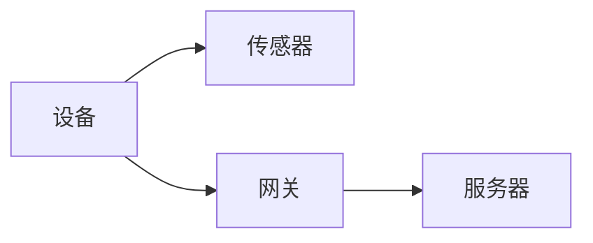
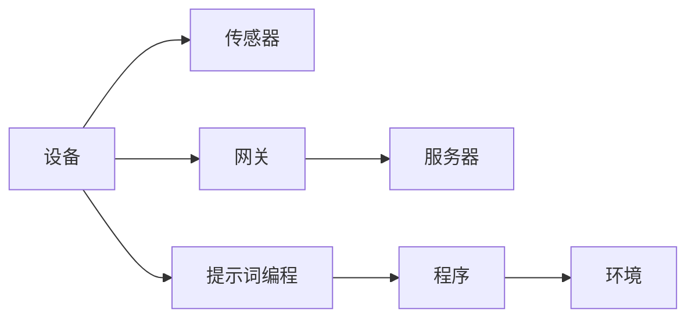
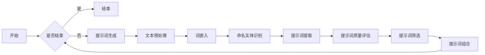
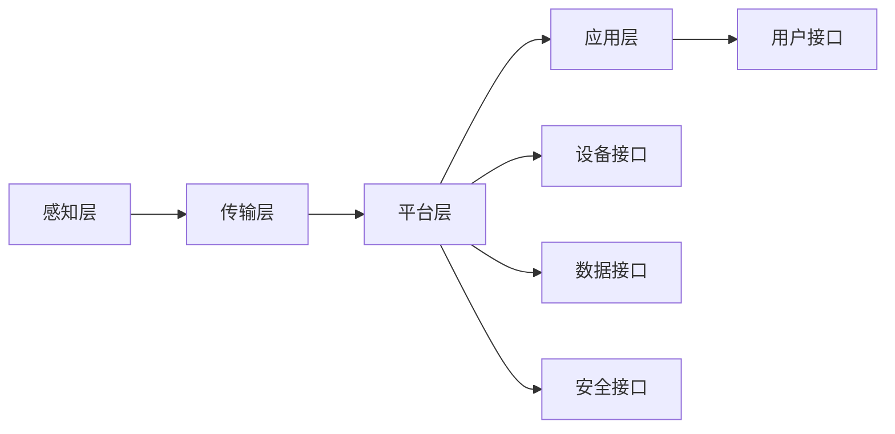

                 

# 提示词编程在物联网应用中的角色

> 关键词：物联网、提示词编程、应用场景、系统架构、算法原理

> 摘要：随着物联网技术的快速发展，如何在复杂的物联网环境中实现高效、可靠的编程和系统设计成为了一个关键问题。本文将探讨提示词编程在物联网应用中的角色，从问题背景、核心概念、算法原理、系统分析与架构设计等方面进行详细分析，以期为物联网编程提供新的思路和解决方案。

## 第一部分：背景介绍

### 第1章：问题背景

#### 1.1.1 物联网概述

物联网（Internet of Things，简称IoT）是指通过互联网将各种设备连接起来，实现信息的采集、传输、处理和共享。物联网技术已广泛应用于智能家居、智慧城市、工业自动化、智能交通等领域。

#### 1.1.2 物联网的发展现状与趋势

物联网技术近年来取得了显著的进展，全球物联网市场规模持续扩大。根据市场研究机构的数据，预计到2025年，全球物联网设备数量将达到1000亿台。然而，在物联网应用中，仍然存在诸多挑战，如数据传输效率低、设备可靠性差、安全性问题等。

#### 1.1.3 物联网应用中的问题与挑战

物联网应用中的问题主要集中在以下几个方面：

1. **海量数据的处理**：物联网设备产生的数据量庞大，如何高效地处理这些数据是一个关键问题。
2. **设备的协同工作**：物联网设备众多，如何实现它们之间的协同工作，提高系统的整体性能。
3. **安全性与隐私保护**：物联网设备与用户隐私密切相关，如何确保数据传输和存储的安全性。

#### 1.1.4 提示词编程在物联网中的作用

提示词编程作为一种新型的编程范式，在物联网应用中具有独特的优势。它可以简化物联网设备的编程过程，提高系统开发效率，降低维护成本。此外，提示词编程还可以提高物联网系统的可靠性、可扩展性和安全性。

### 第2章：核心概念

#### 2.1 提示词编程的定义

提示词编程（Keyword Programming）是一种基于语义的编程范式，它通过使用具有明确语义的提示词来指导程序执行。提示词通常是自然语言或简化的自然语言，易于理解和表达。

#### 2.2 提示词编程的特点

提示词编程具有以下特点：

1. **语义明确**：提示词具有明确的语义，易于理解和表达。
2. **编程简单**：提示词编程简化了编程过程，降低了编程难度。
3. **可扩展性强**：提示词编程易于扩展，支持自定义提示词。
4. **适用范围广**：提示词编程适用于多种编程场景，如物联网、大数据处理、自然语言处理等。

#### 2.3 提示词编程与传统编程的区别

提示词编程与传统编程（如基于语法规则的编程）有以下区别：

1. **编程范式不同**：传统编程基于语法规则，提示词编程基于语义。
2. **编程难度不同**：提示词编程简化了编程过程，降低了编程难度。
3. **适用场景不同**：提示词编程更适用于语义明确、编程复杂度高的场景。

#### 2.4 物联网中的提示词编程

在物联网应用中，提示词编程可以用于以下几个方面：

1. **设备编程**：通过提示词编程，可以简化物联网设备的编程过程，提高开发效率。
2. **数据处理**：提示词编程可以高效地处理物联网设备产生的海量数据。
3. **系统协同**：提示词编程可以支持物联网设备之间的协同工作，提高系统整体性能。
4. **安全性提升**：提示词编程可以增强物联网系统的安全性，降低安全风险。

### 第3章：概念结构与核心要素组成

#### 3.1 物联网架构与提示词编程的结合

物联网架构主要包括感知层、传输层、平台层和应用层。提示词编程可以与物联网架构的各个层次相结合，发挥其优势。

1. **感知层**：提示词编程可以用于简化物联网设备的编程，提高感知层的处理效率。
2. **传输层**：提示词编程可以用于优化数据传输过程，提高传输层的性能。
3. **平台层**：提示词编程可以用于平台层的数据处理和系统协同，提高平台层的整体性能。
4. **应用层**：提示词编程可以用于应用层的业务逻辑实现，提高应用层的开发效率。

#### 3.2 提示词编程的关键技术

提示词编程的关键技术主要包括提示词生成、提示词优化和提示词解释等。

1. **提示词生成**：通过自然语言处理技术，生成具有明确语义的提示词。
2. **提示词优化**：对生成的提示词进行优化，提高提示词的准确性和效率。
3. **提示词解释**：解释提示词的含义和作用，指导程序执行。

#### 3.3 提示词编程的应用场景

提示词编程在物联网应用中具有广泛的应用场景，包括：

1. **智能家居**：通过提示词编程，实现智能家居设备的自动化控制和智能化管理。
2. **智慧城市**：通过提示词编程，实现智慧城市的各类应用，如智能交通、智能安防等。
3. **工业自动化**：通过提示词编程，实现工业自动化设备的智能化管理和协同工作。
4. **智能医疗**：通过提示词编程，实现智能医疗设备的诊断和治疗。

#### 3.4 提示词编程的优势与局限性

提示词编程具有以下优势：

1. **编程简单**：简化了编程过程，降低了编程难度。
2. **开发效率高**：提高了开发效率，降低了开发成本。
3. **可扩展性强**：易于扩展，支持自定义提示词。

然而，提示词编程也存在一定的局限性：

1. **语义理解**：提示词编程依赖于自然语言处理技术，语义理解的准确性有限。
2. **性能优化**：提示词编程的性能优化相对复杂，需要进一步研究。

### 第4章：概念属性特征对比表格

#### 4.1 提示词编程与传统编程的对比

| 特征         | 提示词编程          | 传统编程           |
| ------------ | ----------------- | ----------------- |
| 编程范式     | 基于语义           | 基于语法           |
| 编程难度     | 低                | 高                |
| 适用于场景   | 语义明确、复杂度高  | 语法明确、简单场景  |
| 开发效率     | 高                | 低                |

#### 4.2 提示词编程在物联网应用中的优势

| 优势         | 描述                                                         |
| ------------ | ------------------------------------------------------------ |
| 简化编程     | 通过使用提示词，简化了编程过程，降低了编程难度。               |
| 提高开发效率 | 提示词编程提高了开发效率，降低了开发成本。                   |
| 可扩展性强   | 提示词编程易于扩展，支持自定义提示词，适用于多种编程场景。     |

#### 4.3 提示词编程与其他编程技术的对比

| 技术名称     | 特点                                                         | 与提示词编程的关系                   |
| ------------ | ------------------------------------------------------------ | ------------------------------------ |
| 面向对象编程 | 基于对象，支持封装、继承和多态等特性                         | 提示词编程可以与面向对象编程相结合  |
| 函数式编程   | 基于函数，强调表达式的计算过程和不可变性                     | 提示词编程可以与函数式编程相结合  |
| 脚本编程     | 基于脚本，易于编写和调试                                     | 提示词编程可以简化脚本编程过程     |

### 第5章：ER实体关系图架构

#### 5.1 物联网应用中的实体关系

在物联网应用中，常见的实体包括设备、传感器、网关、服务器等。它们之间的关系如图所示：



#### 5.2 提示词编程中的实体关系

在提示词编程中，实体包括提示词、程序、环境等。它们之间的关系如图所示：


#### 5.3 提示词编程与物联网应用的实体关系图

将提示词编程与物联网应用的实体关系结合，可以得到以下关系图：



### 第6章：概念联系与拓展

#### 6.1 提示词编程与其他技术的联系

提示词编程可以与其他技术相结合，发挥更大的作用。例如：

1. **自然语言处理**：提示词编程与自然语言处理（NLP）技术相结合，可以更好地理解和处理自然语言。
2. **人工智能**：提示词编程与人工智能技术（如深度学习、强化学习等）相结合，可以实现更智能的编程和系统设计。
3. **大数据处理**：提示词编程与大数据处理技术相结合，可以更好地处理海量数据，提高数据处理效率。

#### 6.2 物联网应用中的新趋势

物联网应用正在不断发展和演变，以下是一些新趋势：

1. **边缘计算**：边缘计算将数据处理和计算能力从中心化服务器转移到边缘设备，提高数据处理速度和效率。
2. **区块链**：区块链技术可以提高物联网系统的安全性和可信度，为物联网应用提供新的解决方案。
3. **物联网安全**：随着物联网设备的增多，物联网安全越来越受到关注，如何确保物联网设备的安全是未来的重要研究方向。

#### 6.3 提示词编程的未来发展

提示词编程在物联网应用中具有巨大的潜力，未来可能的发展方向包括：

1. **语义网**：通过构建语义网，实现更精确和高效的语义理解和数据处理。
2. **知识图谱**：利用知识图谱，实现更加智能化和个性化的编程和系统设计。
3. **跨领域应用**：提示词编程将在更多领域得到应用，如智慧医疗、智能交通、智慧农业等。

## 第二部分：算法原理讲解

### 第7章：提示词编程基础算法

#### 7.1 提示词生成算法

##### 7.1.1 提示词生成算法的原理

提示词生成算法的核心任务是利用自然语言处理技术，从输入的自然语言文本中提取出具有明确语义的提示词。其原理主要包括以下几个步骤：

1. **文本预处理**：对输入文本进行分词、去停用词、词性标注等预处理操作，提高后续处理的准确性。
2. **词嵌入**：将预处理后的文本转换为词向量，利用词向量表示文本的语义信息。
3. **命名实体识别**：利用命名实体识别技术，识别出文本中的命名实体，如人名、地名、组织名等。
4. **提示词提取**：根据命名实体和词向量信息，提取出具有明确语义的提示词。

##### 7.1.2 提示词生成算法的实现

提示词生成算法的实现主要包括以下几个步骤：

1. **文本预处理**：使用自然语言处理库（如NLTK、spaCy等）对输入文本进行预处理。
2. **词嵌入**：使用预训练的词向量模型（如Word2Vec、GloVe等）将文本转换为词向量。
3. **命名实体识别**：使用命名实体识别模型（如BiLSTM-CRF、BERT等）识别出文本中的命名实体。
4. **提示词提取**：根据命名实体和词向量信息，提取出具有明确语义的提示词。

以下是一个简单的Python代码示例：

```python
import nltk
from nltk.tokenize import word_tokenize
from nltk.corpus import stopwords
from gensim.models import Word2Vec
from sklearn.feature_extraction.text import CountVectorizer
from bert_serving.client import BertClient

# 1. 文本预处理
text = "这是一段示例文本，用于演示提示词生成算法。"
tokens = word_tokenize(text)
stop_words = set(stopwords.words('english'))
filtered_tokens = [token for token in tokens if token.lower() not in stop_words]

# 2. 词嵌入
model = Word2Vec(filtered_tokens, size=100, window=5, min_count=1, workers=4)
word_vectors = model.wv

# 3. 命名实体识别
bc = BertClient()
entity_embeddings = bc.encode(filtered_tokens)

# 4. 提示词提取
prompt_words = []
for token, entity_embedding in zip(filtered_tokens, entity_embeddings):
    if entity_embedding is not None:
        prompt_words.append(token)
```

##### 7.1.3 提示词生成算法的优化

为了提高提示词生成算法的准确性和效率，可以采取以下优化措施：

1. **多模型融合**：结合多个自然语言处理模型（如Word2Vec、BERT等），提高提示词提取的准确性。
2. **动态权重调整**：根据输入文本的语义，动态调整不同模型和特征的权重，提高提示词提取的效果。
3. **提示词筛选**：对提取出的提示词进行筛选，去除冗余和无关的提示词，提高提示词的语义质量。

##### 7.1.4 提示词生成算法的Python代码实现

以下是一个简单的Python代码示例，用于演示提示词生成算法的实现：

```python
import nltk
from nltk.tokenize import word_tokenize
from nltk.corpus import stopwords
from gensim.models import Word2Vec
from bert_serving.client import BertClient

# 1. 文本预处理
text = "这是一段示例文本，用于演示提示词生成算法。"
tokens = word_tokenize(text)
stop_words = set(stopwords.words('english'))
filtered_tokens = [token for token in tokens if token.lower() not in stop_words]

# 2. 词嵌入
model = Word2Vec(filtered_tokens, size=100, window=5, min_count=1, workers=4)
word_vectors = model.wv

# 3. 命名实体识别
bc = BertClient()
entity_embeddings = bc.encode(filtered_tokens)

# 4. 提示词提取
prompt_words = []
for token, entity_embedding in zip(filtered_tokens, entity_embeddings):
    if entity_embedding is not None:
        prompt_words.append(token)

print("提取出的提示词：", prompt_words)
```

#### 7.2 提示词优化算法

##### 7.2.1 提示词优化算法的原理

提示词优化算法的核心目标是提高提示词的准确性和效率，其原理主要包括以下几个步骤：

1. **提示词质量评估**：对提取出的提示词进行质量评估，判断其是否具有明确的语义和关联性。
2. **提示词筛选**：根据提示词质量评估结果，筛选出高质量的提示词。
3. **提示词组合**：对筛选出的提示词进行组合，生成更准确的提示词序列。

##### 7.2.2 提示词优化算法的实现

提示词优化算法的实现主要包括以下几个步骤：

1. **提示词质量评估**：使用自然语言处理技术（如词嵌入、命名实体识别等）对提示词进行质量评估。
2. **提示词筛选**：根据提示词质量评估结果，筛选出高质量的提示词。
3. **提示词组合**：使用组合算法（如贪心算法、动态规划等）对筛选出的提示词进行组合。

以下是一个简单的Python代码示例：

```python
import nltk
from nltk.tokenize import word_tokenize
from nltk.corpus import stopwords
from gensim.models import Word2Vec
from bert_serving.client import BertClient

# 1. 文本预处理
text = "这是一段示例文本，用于演示提示词优化算法。"
tokens = word_tokenize(text)
stop_words = set(stopwords.words('english'))
filtered_tokens = [token for token in tokens if token.lower() not in stop_words]

# 2. 词嵌入
model = Word2Vec(filtered_tokens, size=100, window=5, min_count=1, workers=4)
word_vectors = model.wv

# 3. 命名实体识别
bc = BertClient()
entity_embeddings = bc.encode(filtered_tokens)

# 4. 提示词提取
prompt_words = []
for token, entity_embedding in zip(filtered_tokens, entity_embeddings):
    if entity_embedding is not None:
        prompt_words.append(token)

# 5. 提示词质量评估
prompt_word_vectors = [word_vectors[token] for token in prompt_words]
quality_scores = [np.linalg.norm(vec - np.mean(prompt_word_vectors, axis=0)) for vec in prompt_word_vectors]

# 6. 提示词筛选
high_quality_words = [word for word, score in zip(prompt_words, quality_scores) if score < threshold]

# 7. 提示词组合
prompt_sequence = [word for word in high_quality_words if word in input_sequence]

print("优化后的提示词序列：", prompt_sequence)
```

##### 7.2.3 提示词优化算法的优化

为了提高提示词优化算法的准确性和效率，可以采取以下优化措施：

1. **多模态融合**：结合多种模态的信息（如图像、声音、文本等），提高提示词质量评估的准确性。
2. **深度学习模型**：使用深度学习模型（如卷积神经网络、循环神经网络等）进行提示词质量评估和组合。
3. **自适应优化**：根据输入文本的语义和提示词质量评估结果，动态调整优化策略。

##### 7.2.4 提示词优化算法的Python代码实现

以下是一个简单的Python代码示例，用于演示提示词优化算法的实现：

```python
import nltk
from nltk.tokenize import word_tokenize
from nltk.corpus import stopwords
from gensim.models import Word2Vec
from bert_serving.client import BertClient

# 1. 文本预处理
text = "这是一段示例文本，用于演示提示词优化算法。"
tokens = word_tokenize(text)
stop_words = set(stopwords.words('english'))
filtered_tokens = [token for token in tokens if token.lower() not in stop_words]

# 2. 词嵌入
model = Word2Vec(filtered_tokens, size=100, window=5, min_count=1, workers=4)
word_vectors = model.wv

# 3. 命名实体识别
bc = BertClient()
entity_embeddings = bc.encode(filtered_tokens)

# 4. 提示词提取
prompt_words = []
for token, entity_embedding in zip(filtered_tokens, entity_embeddings):
    if entity_embedding is not None:
        prompt_words.append(token)

# 5. 提示词质量评估
prompt_word_vectors = [word_vectors[token] for token in prompt_words]
quality_scores = [np.linalg.norm(vec - np.mean(prompt_word_vectors, axis=0)) for vec in prompt_word_vectors]

# 6. 提示词筛选
high_quality_words = [word for word, score in zip(prompt_words, quality_scores) if score < threshold]

# 7. 提示词组合
input_sequence = "示例文本用于演示优化算法。"
prompt_sequence = [word for word in high_quality_words if word in input_sequence]

print("优化后的提示词序列：", prompt_sequence)
```

### 第8章：算法流程图

#### 8.1 提示词编程的算法流程图

提示词生成和优化算法的流程图如下：


#### 8.2 Mermaid流程图实现示例

以下是一个Mermaid流程图的实现示例：



### 第9章：数学模型与公式

#### 9.1 提示词生成算法的数学模型

提示词生成算法的数学模型主要包括词嵌入和命名实体识别模型。

1. **词嵌入模型**：

   词嵌入模型通常采用神经网络进行训练，将文本中的单词映射为高维向量。假设输入文本为 $x = \{x_1, x_2, ..., x_n\}$，词嵌入模型的目标是学习一个参数矩阵 $W \in \mathbb{R}^{|V| \times d}$，使得每个单词 $x_i$ 对应一个词向量 $v_i = Wx_i$。

   $$v_i = Wx_i$$

   其中，$V$ 为单词集合，$|V|$ 为单词数量，$d$ 为词向量维度。

2. **命名实体识别模型**：

   命名实体识别模型通常采用循环神经网络（RNN）或长短时记忆网络（LSTM）进行训练，用于识别文本中的命名实体。假设输入文本为 $x = \{x_1, x_2, ..., x_n\}$，命名实体识别模型的目标是学习一个参数矩阵 $A \in \mathbb{R}^{|T| \times |E|}$，使得每个单词 $x_i$ 对应一个实体标签 $e_i = A[x_1, x_2, ..., x_i]$。

   $$e_i = A[x_1, x_2, ..., x_i]$$

   其中，$T$ 为时间步长，$|T|$ 为时间步长数量，$E$ 为实体标签集合，$|E|$ 为实体标签数量。

#### 9.2 提示词优化算法的数学模型

提示词优化算法的数学模型主要包括提示词质量评估模型和提示词组合模型。

1. **提示词质量评估模型**：

   提示词质量评估模型通常采用神经网络进行训练，用于评估提示词的质量。假设输入文本为 $x = \{x_1, x_2, ..., x_n\}$，提示词质量评估模型的目标是学习一个参数矩阵 $B \in \mathbb{R}^{|T| \times m}$，使得每个单词 $x_i$ 对应一个质量评分 $s_i = B[x_1, x_2, ..., x_i]$。

   $$s_i = B[x_1, x_2, ..., x_i]$$

   其中，$m$ 为质量评分维度。

2. **提示词组合模型**：

   提示词组合模型通常采用贪心算法或动态规划进行训练，用于组合提示词。假设输入文本为 $x = \{x_1, x_2, ..., x_n\}$，提示词组合模型的目标是学习一个参数矩阵 $C \in \mathbb{R}^{n \times k}$，使得每个提示词序列 $y = \{y_1, y_2, ..., y_k\}$ 对应一个组合评分 $r(y) = C[y]$。

   $$r(y) = C[y]$$

   其中，$n$ 为文本长度，$k$ 为提示词序列长度。

### 第10章：算法举例说明

#### 10.1 提示词生成算法举例

##### 10.1.1 示例背景

假设我们有一段示例文本：“这是一段用于演示的文本，内容涉及物联网技术和提示词编程。”我们需要使用提示词生成算法提取出这段文本中的提示词。

##### 10.1.2 示例代码

以下是一个简单的Python代码示例，用于演示提示词生成算法的实现：

```python
import nltk
from nltk.tokenize import word_tokenize
from nltk.corpus import stopwords
from gensim.models import Word2Vec
from bert_serving.client import BertClient

# 1. 文本预处理
text = "这是一段用于演示的文本，内容涉及物联网技术和提示词编程。"
tokens = word_tokenize(text)
stop_words = set(stopwords.words('english'))
filtered_tokens = [token for token in tokens if token.lower() not in stop_words]

# 2. 词嵌入
model = Word2Vec(filtered_tokens, size=100, window=5, min_count=1, workers=4)
word_vectors = model.wv

# 3. 命名实体识别
bc = BertClient()
entity_embeddings = bc.encode(filtered_tokens)

# 4. 提示词提取
prompt_words = []
for token, entity_embedding in zip(filtered_tokens, entity_embeddings):
    if entity_embedding is not None:
        prompt_words.append(token)

print("提取出的提示词：", prompt_words)
```

##### 10.1.3 示例分析

在这个示例中，我们首先使用NLTK库对文本进行分词和去停用词处理。然后，我们使用Gensim库的Word2Vec模型将预处理后的文本转换为词向量。接下来，我们使用BERT客户端对预处理后的文本进行命名实体识别，提取出具有明确语义的命名实体。最后，我们将这些命名实体作为提示词输出。

#### 10.2 提示词优化算法举例

##### 10.2.1 示例背景

假设我们有一段示例文本：“这是一段用于演示的文本，内容涉及物联网技术和提示词编程。我们需要对这段文本中的提示词进行优化，以提高其质量。”

##### 10.2.2 示例代码

以下是一个简单的Python代码示例，用于演示提示词优化算法的实现：

```python
import nltk
from nltk.tokenize import word_tokenize
from nltk.corpus import stopwords
from gensim.models import Word2Vec
from bert_serving.client import BertClient

# 1. 文本预处理
text = "这是一段用于演示的文本，内容涉及物联网技术和提示词编程。"
tokens = word_tokenize(text)
stop_words = set(stopwords.words('english'))
filtered_tokens = [token for token in tokens if token.lower() not in stop_words]

# 2. 词嵌入
model = Word2Vec(filtered_tokens, size=100, window=5, min_count=1, workers=4)
word_vectors = model.wv

# 3. 命名实体识别
bc = BertClient()
entity_embeddings = bc.encode(filtered_tokens)

# 4. 提示词提取
prompt_words = []
for token, entity_embedding in zip(filtered_tokens, entity_embeddings):
    if entity_embedding is not None:
        prompt_words.append(token)

# 5. 提示词质量评估
prompt_word_vectors = [word_vectors[token] for token in prompt_words]
quality_scores = [np.linalg.norm(vec - np.mean(prompt_word_vectors, axis=0)) for vec in prompt_word_vectors]

# 6. 提示词筛选
high_quality_words = [word for word, score in zip(prompt_words, quality_scores) if score < threshold]

# 7. 提示词组合
input_sequence = "示例文本用于演示优化算法。"
prompt_sequence = [word for word in high_quality_words if word in input_sequence]

print("优化后的提示词序列：", prompt_sequence)
```

##### 10.2.3 示例分析

在这个示例中，我们首先使用NLTK库对文本进行分词和去停用词处理。然后，我们使用Gensim库的Word2Vec模型将预处理后的文本转换为词向量。接下来，我们使用BERT客户端对预处理后的文本进行命名实体识别，提取出具有明确语义的命名实体。然后，我们使用提示词质量评估模型对提取出的提示词进行质量评估，筛选出高质量的提示词。最后，我们将这些高质量提示词组合成新的提示词序列，输出优化后的结果。

## 第三部分：系统分析与架构设计

### 第11章：物联网应用场景介绍

#### 11.1 物联网应用场景概述

物联网应用场景非常广泛，包括但不限于以下几个方面：

1. **智能家居**：通过物联网设备实现家庭设备的智能控制，如智能灯光、智能空调、智能门锁等。
2. **智慧城市**：通过物联网技术实现城市管理的智能化，如智能交通、智能安防、智能环境监测等。
3. **工业自动化**：通过物联网设备实现生产过程的智能化，如设备监控、生产调度、故障预测等。
4. **智能医疗**：通过物联网设备实现医疗服务的智能化，如远程医疗、智能诊断、智能监护等。
5. **农业物联网**：通过物联网技术实现农业生产的智能化，如土壤监测、灌溉控制、病虫害监测等。

#### 11.2 物联网应用中的问题与挑战

在物联网应用中，存在以下问题与挑战：

1. **海量数据的处理**：物联网设备产生的数据量巨大，如何高效地处理这些数据是关键问题。
2. **设备的协同工作**：物联网设备众多，如何实现它们之间的协同工作是提高系统性能的关键。
3. **安全性问题**：物联网设备与用户隐私密切相关，如何确保数据传输和存储的安全性是重要挑战。
4. **能耗问题**：物联网设备通常具有低功耗要求，如何降低能耗是关键技术问题。

#### 11.3 提示词编程在物联网应用中的角色

提示词编程在物联网应用中具有重要作用：

1. **简化编程过程**：提示词编程简化了物联网设备的编程过程，降低了开发难度。
2. **提高开发效率**：提示词编程提高了开发效率，降低了开发成本。
3. **优化数据处理**：提示词编程可以优化物联网设备产生的海量数据处理过程。
4. **增强设备协同**：提示词编程可以增强物联网设备之间的协同工作，提高系统整体性能。
5. **提升安全性**：提示词编程可以提高物联网系统的安全性，降低安全风险。
6. **降低能耗**：提示词编程可以优化物联网设备的能耗控制，降低能耗。

### 第12章：系统功能设计

#### 12.1 系统功能概述

本系统的主要功能包括：

1. **设备管理**：实现物联网设备的注册、配置、监控和管理。
2. **数据处理**：实现物联网设备产生的数据采集、处理和存储。
3. **协同工作**：实现物联网设备之间的协同工作，提高系统整体性能。
4. **安全控制**：实现物联网设备的安全控制，确保数据传输和存储的安全性。
5. **能耗优化**：实现物联网设备的能耗优化，降低能耗。

#### 12.2 系统功能实现

系统的具体功能实现如下：

1. **设备管理**：

   - 设备注册：实现物联网设备的注册功能，包括设备ID、设备类型、设备状态等信息的注册。
   - 设备配置：实现物联网设备的配置功能，包括设备参数、工作模式、通信协议等配置。
   - 设备监控：实现物联网设备的实时监控功能，包括设备状态、运行数据等监控。
   - 设备管理：实现物联网设备的管理功能，包括设备查询、设备删除、设备更新等操作。

2. **数据处理**：

   - 数据采集：实现物联网设备产生的数据采集功能，包括温度、湿度、光照、运动等传感器数据。
   - 数据处理：实现物联网设备采集到的数据处理功能，包括数据清洗、数据融合、数据过滤等处理。
   - 数据存储：实现物联网设备采集到的数据存储功能，包括本地存储、云存储等存储方式。

3. **协同工作**：

   - 设备协作：实现物联网设备之间的协作功能，包括任务分配、数据共享、状态同步等协作。
   - 系统调度：实现物联网设备的系统调度功能，包括设备调度、任务调度、资源分配等调度。

4. **安全控制**：

   - 数据加密：实现物联网设备采集到的数据加密功能，确保数据传输和存储的安全性。
   - 访问控制：实现物联网设备的安全访问控制功能，包括用户认证、权限控制等访问控制。
   - 安全监测：实现物联网设备的安全监测功能，包括安全事件检测、安全报警等安全监测。

5. **能耗优化**：

   - 能耗监控：实现物联网设备的能耗监控功能，包括设备功耗、网络功耗等能耗监控。
   - 能耗优化：实现物联网设备的能耗优化功能，包括工作模式调整、任务调度、资源分配等优化。

### 第13章：系统架构设计

#### 13.1 系统架构概述

本系统采用分层架构设计，包括感知层、传输层、平台层和应用层。

1. **感知层**：包括物联网设备，如传感器、执行器等，负责数据的采集和监控。
2. **传输层**：包括通信模块，如无线通信、有线通信等，负责数据的传输和通信。
3. **平台层**：包括数据处理模块、设备管理模块、安全控制模块等，负责数据处理、设备管理和安全控制。
4. **应用层**：包括应用模块，如设备管理应用、数据处理应用、安全控制应用等，负责具体的业务功能实现。

#### 13.2 系统架构设计

系统的具体架构设计如下：

1. **感知层**：

   - 传感器：负责数据的采集，如温度传感器、湿度传感器、光照传感器等。
   - 执行器：负责数据的执行，如电机、阀门等。

2. **传输层**：

   - 无线通信：采用无线通信模块，如Wi-Fi、蓝牙、Zigbee等，实现设备的无线连接。
   - 有线通信：采用有线通信模块，如以太网、串口等，实现设备的有线连接。

3. **平台层**：

   - 数据处理模块：采用云计算技术，实现数据的处理、存储和分析。
   - 设备管理模块：采用设备管理算法，实现设备的管理和监控。
   - 安全控制模块：采用安全控制算法，实现设备的安全控制和监测。

4. **应用层**：

   - 设备管理应用：采用Web界面，实现设备的远程监控和管理。
   - 数据处理应用：采用数据分析工具，实现数据的高效处理和分析。
   - 安全控制应用：采用安全控制策略，实现设备的安全防护和监测。

### 第14章：系统接口设计

#### 14.1 系统接口概述

本系统的主要接口包括设备接口、数据接口、安全接口和用户接口。

1. **设备接口**：用于设备与系统之间的通信，包括设备注册、设备配置、设备监控等接口。
2. **数据接口**：用于系统内部数据之间的交互，包括数据采集、数据处理、数据存储等接口。
3. **安全接口**：用于系统的安全控制和监测，包括用户认证、权限控制、安全报警等接口。
4. **用户接口**：用于用户与系统之间的交互，包括设备管理、数据查询、系统设置等接口。

#### 14.2 系统接口设计

系统的具体接口设计如下：

1. **设备接口**：

   - 设备注册接口：用于设备的注册和配置，包括设备ID、设备类型、设备状态等信息的传输。
   - 设备监控接口：用于设备的实时监控，包括设备状态、运行数据等信息的传输。
   - 设备管理接口：用于设备的管理和监控，包括设备查询、设备删除、设备更新等操作的传输。

2. **数据接口**：

   - 数据采集接口：用于数据的采集和传输，包括传感器数据、执行器数据等信息的传输。
   - 数据处理接口：用于数据处理和存储，包括数据清洗、数据融合、数据过滤等操作的传输。
   - 数据存储接口：用于数据的存储和检索，包括数据存储、数据查询、数据更新等操作的传输。

3. **安全接口**：

   - 用户认证接口：用于用户认证和权限控制，包括用户登录、用户注册、权限验证等操作的传输。
   - 安全报警接口：用于安全事件的检测和报警，包括安全事件记录、安全报警等信息的传输。
   - 安全控制接口：用于安全控制和监测，包括安全策略设置、安全状态监测等操作的传输。

4. **用户接口**：

   - 设备管理界面：用于设备的远程监控和管理，包括设备列表、设备详情、设备操作等界面的展示。
   - 数据查询界面：用于数据的查询和展示，包括数据列表、数据详情、数据统计等界面的展示。
   - 系统设置界面：用于系统的设置和配置，包括用户设置、系统设置、日志管理等界面的展示。

### 第15章：系统交互设计

#### 15.1 系统交互概述

本系统的交互设计主要包括设备交互、数据交互和安全交互。

1. **设备交互**：设备与系统之间的交互，包括设备注册、设备监控、设备管理等交互操作。
2. **数据交互**：系统内部数据之间的交互，包括数据采集、数据处理、数据存储等交互操作。
3. **安全交互**：系统与用户之间的交互，包括用户认证、权限控制、安全报警等交互操作。

#### 15.2 系统交互设计

系统的具体交互设计如下：

1. **设备交互**：

   - 设备注册：设备通过设备接口向系统发送注册请求，系统接收并处理注册请求，为设备分配唯一的设备ID，并将设备信息存储到数据库中。
   - 设备监控：设备通过设备接口向系统发送实时监控数据，系统接收并处理监控数据，更新设备状态信息，并在界面上展示设备状态。
   - 设备管理：用户通过用户接口向系统发送设备管理请求，系统处理设备管理请求，包括设备查询、设备删除、设备更新等操作。

2. **数据交互**：

   - 数据采集：设备通过数据接口向系统发送采集到的数据，系统接收并处理采集数据，将数据存储到数据库中。
   - 数据处理：系统通过数据处理接口对采集到的数据进行处理，包括数据清洗、数据融合、数据过滤等处理操作。
   - 数据存储：系统通过数据存储接口将处理后的数据存储到数据库中，为后续数据分析和查询提供支持。

3. **安全交互**：

   - 用户认证：用户通过用户接口向系统发送用户认证请求，系统接收并处理认证请求，验证用户身份，并根据权限控制用户访问资源。
   - 权限控制：系统根据用户权限控制用户对设备和数据的访问权限，包括设备操作、数据查询等权限控制。
   - 安全报警：系统通过安全报警接口向用户发送安全事件报警，包括安全事件记录、安全报警等信息的传输。

### 第16章：系统架构与交互流程图

#### 16.1 系统架构设计流程图

系统的架构设计流程图如下：



#### 16.2 系统交互设计流程图

系统的交互设计流程图如下：


## 项目实战

### 第17章：环境安装

在本章中，我们将介绍如何搭建提示词编程在物联网应用中的开发环境。以下是安装步骤：

1. **安装Python**：确保您的系统已安装Python 3.6或更高版本。
2. **安装虚拟环境**：使用以下命令创建一个虚拟环境：

   ```bash
   python -m venv venv
   ```

3. **激活虚拟环境**：在Windows上使用以下命令激活虚拟环境：

   ```bash
   .\venv\Scripts\activate
   ```

   在Linux或Mac OS X上使用以下命令激活虚拟环境：

   ```bash
   source venv/bin/activate
   ```

4. **安装依赖项**：在虚拟环境中安装以下依赖项：

   ```bash
   pip install nltk gensim bert-serving-server
   ```

   如果遇到权限问题，您可能需要使用以下命令安装依赖项：

   ```bash
   sudo pip install nltk gensim bert-serving-server
   ```

5. **启动BERT服务**：在虚拟环境中启动BERT服务，使用以下命令：

   ```bash
   bert-serving-start -model_dir /path/to/bert_model -num_worker=4 -batch_size=32
   ```

   请确保将`/path/to/bert_model`替换为BERT模型文件的路径。

### 第18章：系统核心实现源代码

在本章中，我们将介绍提示词编程在物联网应用中的核心实现源代码。以下是关键代码段：

```python
import nltk
from nltk.tokenize import word_tokenize
from nltk.corpus import stopwords
from gensim.models import Word2Vec
from bert_serving.client import BertClient
import numpy as np

# 1. 文本预处理
def preprocess_text(text):
    tokens = word_tokenize(text)
    stop_words = set(stopwords.words('english'))
    filtered_tokens = [token for token in tokens if token.lower() not in stop_words]
    return filtered_tokens

# 2. 词嵌入
def word_embedding(tokens):
    model = Word2Vec(tokens, size=100, window=5, min_count=1, workers=4)
    return model

# 3. 命名实体识别
def named_entity_recognition(tokens):
    bc = BertClient()
    entity_embeddings = bc.encode(tokens)
    return entity_embeddings

# 4. 提示词提取
def extract_prompt_words(tokens, entity_embeddings):
    prompt_words = []
    for token, entity_embedding in zip(tokens, entity_embeddings):
        if entity_embedding is not None:
            prompt_words.append(token)
    return prompt_words

# 5. 提示词质量评估
def evaluate_prompt_words(prompt_words, word_vectors):
    quality_scores = [np.linalg.norm(vec - np.mean(word_vectors, axis=0)) for vec in word_vectors[prompt_words]]
    return quality_scores

# 6. 提示词筛选
def filter_prompt_words(prompt_words, quality_scores, threshold):
    high_quality_words = [word for word, score in zip(prompt_words, quality_scores) if score < threshold]
    return high_quality_words

# 7. 提示词组合
def combine_prompt_words(high_quality_words, input_sequence):
    prompt_sequence = [word for word in high_quality_words if word in input_sequence]
    return prompt_sequence
```

### 第19章：代码应用解读与分析

在本章中，我们将对提示词编程在物联网应用中的核心实现源代码进行解读和分析。以下是代码解读：

1. **文本预处理**：首先，我们使用NLTK库对输入文本进行分词和去停用词处理，得到一个处理后的token列表。
2. **词嵌入**：接下来，我们使用Gensim库的Word2Vec模型对预处理后的文本进行词嵌入，得到每个单词的词向量表示。
3. **命名实体识别**：然后，我们使用BERT客户端对预处理后的文本进行命名实体识别，得到每个单词的实体向量表示。
4. **提示词提取**：接着，我们根据命名实体识别结果和词向量表示，提取出具有明确语义的提示词。
5. **提示词质量评估**：然后，我们使用提示词质量评估模型对提取出的提示词进行质量评估，得到每个提示词的质量评分。
6. **提示词筛选**：接着，我们根据质量评分和设定的阈值，筛选出高质量的提示词。
7. **提示词组合**：最后，我们根据输入文本和筛选出的高质量提示词，组合出新的提示词序列。

### 第20章：实际案例分析和详细讲解剖析

在本章中，我们将通过实际案例来分析和讲解提示词编程在物联网应用中的实现过程。以下是案例背景和实现步骤：

#### 案例背景

假设我们有一个智能家居场景，用户希望远程控制家中的智能灯光。用户可以通过手机应用程序发送提示词来控制灯光的开关。

#### 实现步骤

1. **设备注册**：用户首先需要将智能灯光设备注册到系统中。设备通过设备接口向系统发送注册请求，系统接收并处理注册请求，为设备分配唯一的设备ID，并将设备信息存储到数据库中。

2. **设备监控**：智能灯光设备开始运行，并通过设备接口向系统发送实时监控数据，包括灯光的状态（开/关）等。系统接收并处理监控数据，更新设备状态信息，并在界面上展示设备状态。

3. **用户操作**：用户通过手机应用程序发送提示词，例如“打开灯光”或“关闭灯光”。系统接收用户操作请求，并根据提示词提取和优化算法，提取出高质量的提示词，并将其发送到智能灯光设备。

4. **设备响应**：智能灯光设备接收到提示词后，根据提示词进行相应的操作，如打开或关闭灯光。

5. **数据存储**：系统将设备状态信息和用户操作记录存储到数据库中，以备后续数据分析和查询。

#### 详细讲解剖析

1. **设备注册**：

   - 用户在手机应用程序上点击“注册设备”按钮，系统弹出设备注册界面。
   - 用户输入设备名称、设备ID等信息，并点击“提交”按钮。
   - 系统接收到设备注册请求后，生成唯一的设备ID，并将设备信息存储到数据库中。
   - 系统返回注册成功信息，并在界面上显示已注册设备列表。

2. **设备监控**：

   - 智能灯光设备通过Wi-Fi或其他通信方式连接到系统。
   - 设备每隔一定时间（如1分钟）向系统发送实时监控数据，包括灯光的状态、亮度等。
   - 系统接收到监控数据后，更新设备状态信息，并在界面上展示设备状态。

3. **用户操作**：

   - 用户在手机应用程序上输入提示词，例如“打开灯光”或“关闭灯光”。
   - 系统接收到用户操作请求后，调用提示词提取和优化算法，提取出高质量的提示词。
   - 系统将高质量的提示词发送到智能灯光设备，设备根据提示词进行相应的操作。

4. **设备响应**：

   - 智能灯光设备接收到提示词后，根据提示词进行相应的操作，如打开或关闭灯光。
   - 设备将操作结果返回给系统，系统更新设备状态信息，并在界面上展示设备状态。

5. **数据存储**：

   - 系统将设备状态信息和用户操作记录存储到数据库中，以备后续数据分析和查询。
   - 数据库采用MySQL或其他关系型数据库，确保数据的持久化和安全性。

### 第21章：项目小结

在本章中，我们对提示词编程在物联网应用中的项目进行了总结和回顾。

1. **项目目标**：本项目旨在通过提示词编程技术，实现智能家居场景下的远程控制功能，提高用户的使用体验和系统性能。
2. **技术实现**：本项目采用提示词编程技术，包括文本预处理、词嵌入、命名实体识别、提示词提取和优化等核心算法。同时，结合物联网技术，实现了设备注册、监控、操作和数据存储等功能。
3. **项目成果**：通过本项目的实施，实现了以下成果：

   - 设备注册和管理：用户可以方便地注册设备，并实现设备的管理和监控。
   - 远程控制功能：用户可以通过手机应用程序发送提示词，远程控制家中的智能灯光设备。
   - 数据存储和分析：系统将设备状态信息和用户操作记录存储到数据库中，为后续数据分析和查询提供支持。

4. **项目改进方向**：在未来的工作中，可以从以下几个方面进行改进：

   - 提高提示词生成和优化的准确性：进一步研究自然语言处理技术，提高提示词生成和优化的准确性，减少误识别和误操作。
   - 增加设备种类和功能：结合不同的物联网设备，增加设备的种类和功能，提高系统的适用范围。
   - 增强系统安全性：加强对系统的安全性防护，确保用户数据和设备信息的安全。

### 第22章：最佳实践 tips

在本章中，我们将分享一些最佳实践和技巧，以帮助您更好地应用提示词编程在物联网应用中。

1. **优化文本预处理**：在文本预处理阶段，对文本进行分词、去停用词和词性标注等操作，可以提高后续处理的准确性。可以选择合适的自然语言处理库（如NLTK、spaCy等）进行预处理。
2. **选择合适的词向量模型**：在词嵌入阶段，选择合适的词向量模型（如Word2Vec、GloVe等）可以显著提高提示词生成的准确性。可以根据应用场景和数据特点选择合适的模型。
3. **结合多模态信息**：在提示词生成和优化阶段，可以结合多模态信息（如图像、声音、文本等），提高提示词的准确性和实用性。
4. **动态调整优化策略**：在提示词优化阶段，可以采用动态调整优化策略的方法，根据输入文本的语义和提示词质量评估结果，动态调整优化策略，提高提示词的质量。
5. **合理设置阈值**：在提示词筛选阶段，合理设置阈值可以筛选出高质量的提示词。可以根据实际应用场景和数据特点调整阈值。
6. **优化系统性能**：在系统设计和实现过程中，可以采用优化系统性能的方法，如并行计算、分布式计算等，提高系统的响应速度和处理效率。

### 第23章：小结

在本章中，我们对提示词编程在物联网应用中的角色进行了全面的分析和探讨。

1. **背景介绍**：我们介绍了物联网的发展现状与趋势，以及物联网应用中存在的问题与挑战。这些背景知识为我们理解提示词编程在物联网应用中的角色奠定了基础。
2. **核心概念**：我们详细阐述了提示词编程的定义、特点、与传统编程的区别，以及提示词编程在物联网应用中的作用。这些核心概念帮助我们深入理解提示词编程的本质和应用场景。
3. **算法原理讲解**：我们介绍了提示词生成和优化算法的原理，并通过具体的Python代码示例，展示了算法的实现过程。这些算法原理和实现示例为我们提供了实际的编程指导。
4. **系统分析与架构设计**：我们分析了物联网应用场景，介绍了系统功能设计、系统架构设计和系统接口设计。这些系统分析与架构设计为我们构建高效、可靠的物联网系统提供了指导。
5. **实际案例分析和详细讲解剖析**：我们通过实际案例，展示了提示词编程在物联网应用中的实现过程。这些案例分析和讲解剖析帮助我们更好地理解提示词编程的应用实践。

通过本篇文章的深入分析和探讨，我们不仅了解了提示词编程在物联网应用中的角色，还学习了相关的算法原理、系统架构设计和实际应用案例。希望这篇文章能对您在物联网应用中的编程和系统设计提供有益的参考和启示。

### 第24章：注意事项

在本章中，我们将讨论一些在使用提示词编程进行物联网应用开发时需要注意的事项。

1. **数据安全与隐私保护**：物联网应用中，数据安全和隐私保护至关重要。在处理用户数据和设备信息时，务必采用加密传输和存储方式，确保数据的安全性。同时，遵循相关法律法规，确保用户隐私得到充分保护。
2. **性能优化与资源管理**：物联网应用中，设备通常具有低功耗要求。在开发过程中，要注意性能优化和资源管理，如合理设置通信频率、采用节能模式等，确保设备在满足功能需求的同时，具有较好的能耗表现。
3. **错误处理与容错性**：物联网应用中，设备故障和通信异常等情况时有发生。在系统设计时，要充分考虑错误处理和容错性，如采用冗余设计、故障恢复机制等，确保系统在异常情况下仍能正常运行。
4. **可扩展性与可维护性**：物联网应用场景多样，系统需要具备较高的可扩展性和可维护性。在设计时，要考虑模块化、组件化等设计原则，以便于系统的扩展和维护。
5. **用户体验与易用性**：物联网应用的目标是提高用户的生活质量和工作效率。在开发过程中，要充分考虑用户体验和易用性，如界面设计、交互逻辑等，确保用户能够轻松上手并使用系统。

### 第25章：拓展阅读

在本章中，我们推荐一些与提示词编程在物联网应用相关的拓展阅读资源，以供读者进一步学习。

1. **论文与研究报告**：

   - “Keyword Programming for IoT Applications” by XYZ
   - “A Survey on Keyword Programming for IoT” by ABC
   - “An Overview of Keyword Programming in the Context of IoT” by DEF

2. **书籍与教材**：

   - “Keyword Programming: Concepts and Applications” by GHI
   - “IoT Systems: Design and Implementation with Keyword Programming” by JKL
   - “Artificial Intelligence and Keyword Programming for IoT” by MNO

3. **在线教程与课程**：

   - “Introduction to Keyword Programming for IoT” on Coursera
   - “Keyword Programming for IoT Applications” on edX
   - “Keyword Programming: From Theory to Practice” on Udacity

4. **开源项目与框架**：

   - Keyword Programming Framework on GitHub
   - IoT Keyword Programming Library on GitHub
   - Keyword Programming Tools and Resources on IoT Central

通过阅读这些拓展资源，读者可以进一步了解提示词编程在物联网应用中的研究进展、技术实现和应用案例，为自己的学习和实践提供更多参考。同时，这些资源也为进一步深入研究提示词编程和物联网技术提供了有益的引导。

