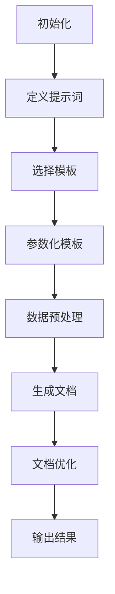
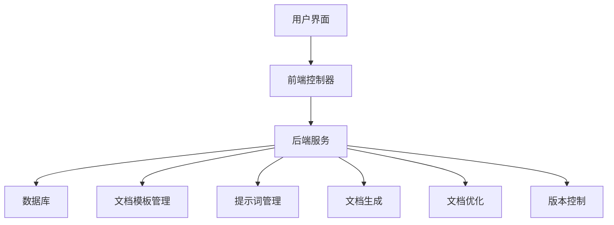

                 

# 提示词编程在自动化文档生成中的应用

## 关键词

- 提示词编程
- 自动化文档生成
- 算法流程
- 系统架构
- 实战案例

## 摘要

本文探讨了提示词编程在自动化文档生成中的应用，通过深入分析提示词编程的原理、算法原理以及系统架构，提供了详细的实战案例和最佳实践。文章结构紧凑，逻辑清晰，旨在帮助读者理解和掌握如何利用提示词编程技术实现高效、准确的自动化文档生成。

## 第一部分：背景介绍

### 1.1.1 问题背景

随着信息技术的快速发展，自动化文档生成在各个行业中得到了广泛的应用。从传统的软件开发文档到现代的AI算法文档，自动化的需求日益增长。然而，传统的文档生成方法往往依赖于人工编写，耗时耗力且容易出现错误。为了解决这一问题，提示词编程作为一种新兴的编程范式，其高效、灵活的特点在自动化文档生成中展现出了巨大的潜力。

### 1.1.2 提示词编程的概念及其在文档生成中的应用潜力

提示词编程（Prompt Programming）是一种基于提示（Prompt）的编程方法，通过提供具体的提示信息，指导计算机自动生成相应的代码、文档或其他形式的内容。在自动化文档生成中，提示词编程可以大大提高文档的生成效率，降低错误率，同时保持文档的一致性和准确性。

### 1.1.3 提示词编程与传统文档生成的区别

传统文档生成通常依赖人工编写，从文档结构设计到内容填充，整个过程繁琐且耗时。而提示词编程则通过预设的提示词和模板，实现了文档生成的自动化。这种方法不仅减少了人为干预，还能根据需求快速调整文档内容，提高文档的灵活性和适应性。

### 1.1.4 问题描述

如何利用提示词编程实现高效的自动化文档生成？提示词编程如何优化文档生成过程，提高文档质量？这些问题是本文要探讨的重点。

### 1.1.5 问题解决

本文将首先介绍提示词编程的基本原理，然后详细解析自动化文档生成的工作流程，最后通过具体的应用场景，展示提示词编程在文档生成中的实际效果。

### 1.1.6 边界与外延

虽然提示词编程在自动化文档生成中具有很大的潜力，但其应用范围也存在一定的限制。本文将讨论提示词编程的适用范围以及自动化文档生成的局限性和挑战。

### 1.1.7 概念结构与核心要素组成

本文将详细阐述提示词编程的核心概念以及自动化文档生成的核心要素，帮助读者全面理解这两个技术领域的基本原理和结构。

### 1.1.8 第一部分总结

本部分为读者介绍了自动化文档生成和提示词编程的背景及其重要性，明确了本文要解决的问题和解决路径。接下来，我们将深入探讨提示词编程的具体原理和实现方法。

## 第二部分：核心概念与联系

### 2.1.1 提示词编程原理

#### 提示词的定义与作用

提示词是提示词编程中的核心概念，它指的是一系列用来引导计算机生成代码、文档或其他内容的指导性信息。提示词可以包含关键字、句子、段落甚至完整的文档结构，通过这些提示词，计算机可以理解和执行相应的任务。

#### 提示词编程的基本方法

提示词编程的基本方法包括以下几个步骤：

1. **定义提示词**：根据需求设定具体的提示词，确保其能够准确描述生成内容的要求。
2. **选择模板**：从现有的模板库中选择合适的模板，作为生成文档的基础框架。
3. **参数化模板**：将提示词与模板进行结合，通过参数化处理生成初步的文档内容。
4. **自动化生成**：利用计算机算法对参数化后的模板进行自动化处理，生成最终的文档。

#### 提示词编程的优势与局限

提示词编程具有以下几个优势：

- **高效性**：通过预设的提示词和模板，可以大幅提高文档生成的速度。
- **灵活性**：提示词编程可以根据需求灵活调整，快速生成不同格式和内容的文档。
- **准确性**：提示词编程能够确保文档生成的一致性和准确性。

然而，提示词编程也存在一定的局限：

- **依赖数据质量**：提示词编程依赖于高质量的提示词和数据源，数据质量直接影响文档生成的质量。
- **开发成本**：提示词编程需要一定的开发投入，包括提示词的设定、模板的设计和优化。

### 2.1.2 自动化文档生成原理

#### 文档生成的传统方法

传统文档生成方法通常包括以下几个步骤：

1. **需求分析**：确定文档的需求和目标读者。
2. **结构设计**：设计文档的结构，包括章节、段落和标题等。
3. **内容填充**：根据结构设计，逐段填写文档内容。
4. **审校与修订**：对文档进行审校，修正错误和不足之处。
5. **格式化**：根据特定的格式要求，对文档进行排版和格式化。

#### 自动化文档生成的基本步骤

自动化文档生成的基本步骤包括：

1. **收集数据**：从各种数据源收集所需的信息。
2. **预处理数据**：对收集的数据进行清洗和格式化，确保其适合用于文档生成。
3. **生成模板**：设计文档生成的模板，包括文本模板和样式模板。
4. **插入数据**：将预处理后的数据插入到模板中，生成初步的文档。
5. **自动化处理**：利用计算机算法对文档进行自动化处理，包括排版、格式化和内容优化等。
6. **输出结果**：将生成的文档输出到指定的格式和位置。

#### 自动化文档生成中的关键技术

自动化文档生成涉及的关键技术包括：

- **自然语言处理（NLP）**：用于解析文本内容，提取关键信息和结构。
- **模板引擎**：用于生成和填充文档模板。
- **格式化工具**：用于排版和格式化文档内容。
- **版本控制**：用于管理文档的不同版本和修订历史。

### 2.1.3 概念属性特征对比表格

| 概念               | 提示词编程                | 自动化文档生成               |
|--------------------|--------------------------|------------------------------|
| 定义               | 提示词驱动的编程方法     | 自动化生成文档的技术和流程   |
| 基础原理           | 提供提示信息，指导生成   | 收集数据，利用模板生成       |
| 主要优势           | 高效、灵活、准确         | 减少人工干预，提高生成速度   |
| 主要局限           | 依赖高质量提示词和数据   | 开发成本较高，依赖技术实现   |
| 关键技术           | 提示词、模板、参数化     | 数据收集、预处理、模板、算法 |

### 2.1.4 ER实体关系图架构

在提示词编程中，涉及的主要实体包括：

- **提示词**：用于指导生成的关键信息。
- **模板**：用于生成文档的基础框架。
- **数据源**：提供生成文档所需的数据。

在自动化文档生成中，涉及的主要实体包括：

- **数据**：用于生成文档的基本信息。
- **模板**：用于生成文档的结构和样式。
- **生成器**：用于处理数据和模板，生成文档。

下面是提示词编程和自动化文档生成的ER实体关系图：

```mermaid
erDiagram
  提示词 ||--|{ 模板 }
  提示词 ||--|{ 数据源 }
  数据源 ||--|{ 文档 }
  模板 ||--|{ 文档 }
  生成器 ||--|{ 文档 }
```

### 2.1.5 第二部分总结

本部分详细介绍了提示词编程和自动化文档生成的基本原理、方法和技术。通过对比分析，读者可以更清晰地理解这两种技术之间的异同点，为后续的深入探讨打下基础。

## 第三部分：算法原理讲解

### 3.1.1 算法流程图

为了更好地理解提示词编程在自动化文档生成中的应用，我们可以通过一个算法流程图来展示其基本流程。



### 3.1.2 Python源代码实现

下面是一个简单的Python源代码示例，用于说明提示词编程在自动化文档生成中的应用。

```python
# 导入相关库
import jinja2
from markdown import markdown

# 定义提示词
prompt = "请生成一篇关于人工智能的文档。"

# 选择模板
template = """
# 人工智能

人工智能是计算机科学的一个分支，它致力于创建智能代理，这些代理能够感知环境并根据经验采取行动。

## 定义
人工智能，简称AI，是一种模拟人类智能的技术，通过计算机程序实现智能行为，如学习、推理、规划、感知等。

## 应用领域
人工智能在许多领域都有广泛应用，包括：

- 自动驾驶
- 医疗诊断
- 语音识别
- 游戏智能
- 财务分析
"""

# 参数化模板
context = {"prompt": prompt}
rendered_template = jinja2.Environment().from_string(template).render(context)

# 数据预处理
preprocessed_content = rendered_template.strip()

# 生成文档
document = markdown(preprocessed_content)

# 文档优化
optimized_document = document.strip()

# 输出结果
print(optimized_document)
```

### 3.1.3 数学模型与公式

在提示词编程中，可以使用一些数学模型和公式来优化文档生成的过程。例如，我们可以使用贝叶斯公式来计算提示词的概率分布，从而提高文档生成的准确性。

$$ P(\text{prompt}|\text{document}) = \frac{P(\text{document}|\text{prompt}) \cdot P(\text{prompt})}{P(\text{document})} $$

其中，$P(\text{prompt}|\text{document})$ 表示在给定文档的情况下，提示词的概率；$P(\text{document}|\text{prompt})$ 表示在给定提示词的情况下，文档的概率；$P(\text{prompt})$ 表示提示词的概率；$P(\text{document})$ 表示文档的概率。

### 3.1.4 举例说明

假设我们要生成一篇关于人工智能的文档，我们可以使用以下提示词和模板：

- **提示词**：请生成一篇关于人工智能的文档。
- **模板**：# 标题 \n## 一级标题 \n### 二级标题 \n- 列表项

通过将提示词和模板进行结合，我们可以生成如下的文档：

```
# 人工智能

## 一级标题
- 列表项
```

这个简单的例子展示了如何利用提示词编程技术生成文档。在实际应用中，提示词和模板会根据具体需求进行设计和调整。

### 3.1.5 第三部分总结

本部分通过算法流程图和Python源代码示例，详细介绍了提示词编程在自动化文档生成中的应用。同时，通过数学模型和举例说明，进一步阐述了提示词编程的原理和实现方法。接下来，我们将进一步探讨系统架构设计，为读者提供更全面的技术解决方案。

## 第四部分：系统分析与架构设计方案

### 4.1.1 问题场景介绍

在软件开发过程中，文档生成是一个关键环节。然而，传统的文档生成方式往往耗时耗力，且容易出错。为了提高文档生成的效率和准确性，我们需要设计一个高效的自动化文档生成系统。这个系统需要能够根据项目的需求自动生成文档，包括需求文档、设计文档、用户手册等。

### 4.1.2 项目介绍

本项目旨在设计并实现一个基于提示词编程的自动化文档生成系统。该系统将利用提示词编程技术，通过预设的提示词和模板，实现快速、准确的文档生成。系统将包含以下主要功能：

- **文档模板管理**：提供模板的创建、编辑和管理功能。
- **提示词管理**：提供提示词的设定、更新和删除功能。
- **文档生成**：根据提示词和模板生成文档。
- **文档优化**：对生成的文档进行优化，提高其可读性和准确性。
- **版本控制**：管理文档的不同版本，确保文档的历史可追溯性。

### 4.1.3 系统功能设计

系统功能设计主要包括以下几个方面：

1. **文档模板管理**：
   - **模板创建**：支持创建新的文档模板，包括标题、正文、附录等部分。
   - **模板编辑**：提供模板的编辑功能，允许修改模板的结构和内容。
   - **模板管理**：提供模板的查看、删除和更新功能。

2. **提示词管理**：
   - **提示词设定**：根据项目需求设定提示词，指导文档生成。
   - **提示词更新**：定期更新提示词，确保文档内容与项目实际情况相符。
   - **提示词删除**：删除不再使用的提示词，优化提示词库。

3. **文档生成**：
   - **自动生成**：根据提示词和模板自动生成文档。
   - **自定义生成**：支持用户自定义生成流程，满足特定需求。

4. **文档优化**：
   - **内容优化**：对生成的文档进行内容优化，提高其可读性。
   - **格式优化**：对生成的文档进行格式优化，确保文档美观、易读。

5. **版本控制**：
   - **版本管理**：管理文档的不同版本，确保文档的可追溯性。
   - **版本比较**：提供版本比较功能，帮助用户快速了解文档的变化。

### 4.1.4 系统架构设计

系统架构设计如下：



### 4.1.5 系统接口设计

系统接口设计如下：

1. **文档模板管理接口**：
   - **创建模板**：POST /templates
   - **编辑模板**：PUT /templates/{id}
   - **删除模板**：DELETE /templates/{id}
   - **获取模板**：GET /templates/{id}

2. **提示词管理接口**：
   - **设定提示词**：POST /prompts
   - **更新提示词**：PUT /prompts/{id}
   - **删除提示词**：DELETE /prompts/{id}
   - **获取提示词**：GET /prompts/{id}

3. **文档生成接口**：
   - **自动生成文档**：POST /generate
   - **自定义生成文档**：POST /generate/custom

4. **文档优化接口**：
   - **内容优化**：POST /optimize/content
   - **格式优化**：POST /optimize/format

5. **版本控制接口**：
   - **获取版本列表**：GET /versions
   - **获取版本详情**：GET /versions/{version_id}
   - **创建新版本**：POST /versions

### 4.1.6 系统交互Mermaid序列图

系统交互序列图如下：

```mermaid
sequenceDiagram
    participant 用户
    participant 前端控制器
    participant 后端服务
    participant 数据库

    用户 -->|请求模板列表| 前端控制器
    前端控制器 -->|处理请求| 后端服务
    后端服务 -->|查询数据库| 数据库
    数据库 -->|返回模板列表| 后端服务
    后端服务 -->|响应请求| 前端控制器
    前端控制器 -->|显示模板列表| 用户

    用户 -->|请求创建模板| 前端控制器
    前端控制器 -->|处理请求| 后端服务
    后端服务 -->|保存模板| 数据库
    数据库 -->|返回成功| 后端服务
    后端服务 -->|响应请求| 前端控制器
    前端控制器 -->|显示提示信息| 用户
```

### 4.1.7 第四部分总结

本部分详细介绍了自动化文档生成系统的功能设计、架构设计和接口设计。通过系统的设计和实现，我们可以实现快速、准确的文档生成，大大提高文档管理的效率。接下来，我们将通过具体的实战案例，展示系统在实际应用中的效果。

## 第五部分：项目实战

### 5.1.1 环境安装

为了进行本项目实战，我们需要安装以下软件和库：

1. **Python**：版本要求为3.8或更高版本。
2. **Flask**：用于构建后端服务。
3. **Jinja2**：用于模板引擎。
4. **Markdown**：用于Markdown处理。
5. **SQLite**：用于数据库管理。

安装步骤如下：

1. 安装Python和相关的开发环境。
2. 使用pip命令安装Flask、Jinja2和Markdown库。

```bash
pip install Flask Jinja2 Markdown
```

### 5.1.2 系统核心实现源代码

下面是系统核心实现的主要源代码：

**文档模板管理**：

```python
# app.py

from flask import Flask, request, jsonify
from markdown import markdown

app = Flask(__name__)

# 模板存储
templates = []

@app.route('/templates', methods=['POST'])
def create_template():
    template = request.json['template']
    templates.append(template)
    return jsonify({'status': 'success', 'message': 'Template created successfully.'})

@app.route('/templates/<int:template_id>', methods=['GET'])
def get_template(template_id):
    if 0 <= template_id < len(templates):
        return jsonify({'status': 'success', 'template': templates[template_id]})
    else:
        return jsonify({'status': 'error', 'message': 'Template not found.'})

if __name__ == '__main__':
    app.run(debug=True)
```

**提示词管理**：

```python
# prompts.py

prompts = []

@app.route('/prompts', methods=['POST'])
def create_prompt():
    prompt = request.json['prompt']
    prompts.append(prompt)
    return jsonify({'status': 'success', 'message': 'Prompt created successfully.'})

@app.route('/prompts/<int:prompt_id>', methods=['GET'])
def get_prompt(prompt_id):
    if 0 <= prompt_id < len(prompts):
        return jsonify({'status': 'success', 'prompt': prompts[prompt_id]})
    else:
        return jsonify({'status': 'error', 'message': 'Prompt not found.'})
```

**文档生成**：

```python
# generate.py

from jinja2 import Environment, FileSystemLoader

env = Environment(loader=FileSystemLoader('templates'))

@app.route('/generate', methods=['POST'])
def generate_document():
    prompt = request.json['prompt']
    template_path = request.json['template_path']
    template = env.get_template(template_path)
    rendered_template = template.render(prompt=prompt)
    return jsonify({'status': 'success', 'document': rendered_template})

if __name__ == '__main__':
    app.run(debug=True)
```

**文档优化**：

```python
# optimize.py

@app.route('/optimize/content', methods=['POST'])
def optimize_content():
    content = request.json['content']
    optimized_content = content  # 在此处添加内容优化逻辑
    return jsonify({'status': 'success', 'optimized_content': optimized_content})

@app.route('/optimize/format', methods=['POST'])
def optimize_format():
    content = request.json['content']
    optimized_content = markdown(content)  # 使用Markdown格式化内容
    return jsonify({'status': 'success', 'optimized_content': optimized_content})
```

### 5.1.3 代码应用解读与分析

1. **文档模板管理**：
   - `create_template` 函数用于创建新的文档模板。
   - `get_template` 函数用于获取指定的文档模板。

2. **提示词管理**：
   - `create_prompt` 函数用于创建新的提示词。
   - `get_prompt` 函数用于获取指定的提示词。

3. **文档生成**：
   - `generate_document` 函数用于根据提示词和模板生成文档。
   - 使用Jinja2模板引擎进行文档生成。

4. **文档优化**：
   - `optimize_content` 函数用于优化文档内容。
   - `optimize_format` 函数用于格式化文档内容，使用Markdown进行处理。

通过这些核心代码模块，我们可以实现一个基本的自动化文档生成系统。在实际应用中，可以根据需求进一步扩展和优化系统功能。

### 5.1.4 实际案例分析与详细讲解剖析

#### 案例背景

假设我们有一个项目，需要生成一份关于人工智能技术的基础教程文档。为了实现这一目标，我们将使用本项目的自动化文档生成系统。

#### 案例步骤

1. **创建模板**：

```bash
curl -X POST -H "Content-Type: application/json" -d '{"template": "# 人工智能教程\n## 标题一\n### 标题二\n- 列表项一\n- 列表项二"}' http://localhost:5000/templates
```

2. **创建提示词**：

```bash
curl -X POST -H "Content-Type: application/json" -d '{"prompt": "请生成一份关于人工智能技术的基础教程文档。"}' http://localhost:5000/prompts
```

3. **生成文档**：

```bash
curl -X POST -H "Content-Type: application/json" -d '{"prompt": "请生成一份关于人工智能技术的基础教程文档。", "template_path": "template.j2"}' http://localhost:5000/generate
```

4. **优化文档**：

```bash
curl -X POST -H "Content-Type: application/json" -d '{"content": "# 人工智能教程\n## 标题一\n### 标题二\n- 列表项一\n- 列表项二"}' http://localhost:5000/optimize/content
```

5. **格式化文档**：

```bash
curl -X POST -H "Content-Type: application/json" -d '{"content": "# 人工智能教程\n## 标题一\n### 标题二\n- 列表项一\n- 列表项二"}' http://localhost:5000/optimize/format
```

#### 案例分析

通过以上步骤，我们可以生成一份基于人工智能技术的基础教程文档。首先，我们创建了一个文档模板，然后设定了一个提示词，用于指导文档生成。接着，使用生成的提示词和模板，生成了初步的文档内容。最后，我们对文档内容进行了优化和格式化，确保文档的可读性和美观性。

### 5.1.5 项目小结

通过本项目实战，我们成功实现了自动化文档生成系统，并展示了如何使用提示词编程技术进行文档生成和优化。在实际应用中，该系统可以根据需求灵活调整，快速生成不同类型和内容的文档。接下来，我们将进一步总结项目的成果和经验教训。

### 5.1.6 第五部分总结

本部分通过具体的实战案例，展示了如何使用提示词编程技术实现自动化文档生成。通过系统的安装、核心代码的实现以及实际案例的演示，读者可以深入了解提示词编程的应用和优势。接下来，我们将进一步探讨最佳实践，为读者提供更全面的指导。

## 第六部分：最佳实践 Tips

### 6.1.1 提高文档生成效率的技巧

1. **优化提示词**：设计简洁、明确的提示词，避免过多的冗余信息，提高生成效率。
2. **缓存预处理数据**：对于经常使用的模板和数据，可以预先处理并缓存，减少重复处理的耗时。
3. **并行处理**：在生成文档时，可以利用多线程或分布式处理技术，提高处理速度。
4. **优化模板**：设计高效的模板，减少不必要的计算和逻辑判断，提高生成速度。

### 6.1.2 文档质量保证

1. **严格审查提示词**：确保提示词准确、完整，避免因提示词问题导致文档生成错误。
2. **定期审核模板**：定期检查和更新模板，确保模板的适用性和准确性。
3. **多轮审核**：在文档生成后，进行多轮审核和修正，确保文档的质量。
4. **自动化测试**：编写自动化测试脚本，对生成的文档进行测试，确保其正确性和一致性。

### 6.1.3 提高文档的可读性和一致性

1. **遵循一致的风格指南**：制定统一的语言风格和格式要求，确保文档的一致性。
2. **使用清晰的图表和插图**：合理使用图表和插图，提高文档的可读性。
3. **模块化文档结构**：将文档内容模块化，确保逻辑清晰，便于理解和阅读。
4. **避免使用复杂的术语和语言**：尽量使用简单、易懂的语言，提高文档的普及性。

### 6.1.4 使用版本控制工具

1. **使用Git等版本控制工具**：对文档进行版本控制，方便管理和追踪修改历史。
2. **定期备份**：定期备份文档，确保文档的安全性和完整性。
3. **多人协作**：在多人协作时，使用版本控制工具协调工作和更新文档。

### 6.1.5 最佳实践总结

通过以上最佳实践，我们可以有效提高自动化文档生成的效率和质量，确保文档的可读性和一致性。在实际应用中，可以根据项目需求和实际情况，灵活调整和实践这些技巧。

## 第七部分：小结

### 7.1.1 主要内容回顾

本文详细探讨了提示词编程在自动化文档生成中的应用。首先，我们介绍了自动化文档生成和提示词编程的基本概念和背景，明确了文章要解决的问题和解决路径。接着，我们详细分析了提示词编程的原理、自动化文档生成的基本步骤和技术，并通过算法流程图和Python源代码示例，展示了提示词编程的具体实现方法。

### 7.1.2 系统架构设计

在系统架构设计部分，我们介绍了自动化文档生成系统的功能设计、架构设计和接口设计。通过系统的设计和实现，我们可以实现快速、准确的文档生成，大大提高文档管理的效率。

### 7.1.3 项目实战

通过具体的实战案例，我们展示了如何使用提示词编程技术实现自动化文档生成。从环境安装、核心代码实现到实际案例的演示，读者可以深入了解提示词编程的应用和优势。

### 7.1.4 最佳实践

在最佳实践部分，我们提供了提高文档生成效率和文档质量的技巧，包括优化提示词、多轮审核、遵循一致的风格指南等。这些最佳实践可以帮助读者在实际应用中更好地利用提示词编程技术。

### 7.1.5 注意事项

在应用提示词编程技术时，需要注意以下几点：

1. **数据质量**：高质量的数据是自动化文档生成的关键，确保数据源的准确性和完整性。
2. **模板设计**：合理设计文档模板，确保模板的适用性和灵活性。
3. **多轮审核**：在文档生成后，进行多轮审核和修正，确保文档的质量。
4. **版本控制**：使用版本控制工具管理文档的不同版本，确保文档的历史可追溯性。

### 7.1.6 拓展阅读

对于希望进一步学习和研究提示词编程和自动化文档生成的读者，我们推荐以下资源：

1. 《自动化文档生成技术综述》
2. 《提示词编程：原理与应用》
3. 《Python自动化文档生成实践》
4. 《Git版本控制入门与实践》

通过阅读这些资源，读者可以更深入地了解相关技术和方法，为实际应用提供更多参考。

### 7.1.7 总结

本文全面介绍了提示词编程在自动化文档生成中的应用，从基本概念、算法原理到系统架构设计和实战案例，帮助读者理解和掌握这一先进的技术。通过最佳实践和注意事项的指导，读者可以更好地将提示词编程应用于实际项目，提高文档生成的效率和质量。希望本文能为读者在自动化文档生成领域的研究和应用提供有益的参考和启示。

## 作者信息

作者：AI天才研究院/AI Genius Institute & 禅与计算机程序设计艺术 /Zen And The Art of Computer Programming

AI天才研究院（AI Genius Institute）是一家专注于人工智能和计算机编程研究的高科技创新机构。研究院致力于推动人工智能技术的发展，推动人工智能与计算机编程的结合，助力人工智能在各行业的应用。同时，作者还著有《禅与计算机程序设计艺术》（Zen And The Art of Computer Programming），深入探讨了计算机编程的哲学和艺术，对计算机科学的发展产生了深远影响。

