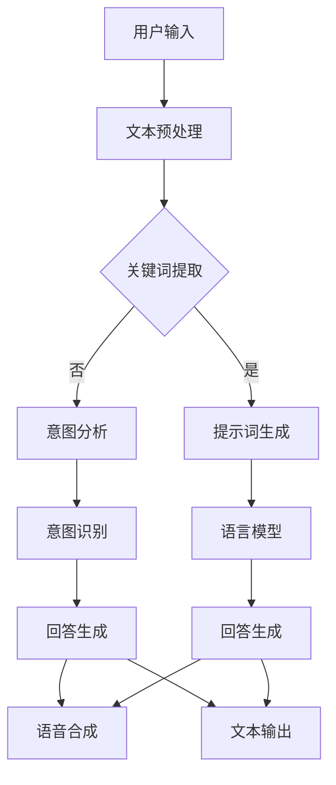

                 

# 提示词编程在自然语言接口设计中的应用

## 关键词

自然语言接口设计、提示词编程、自然语言处理、语言模型、用户交互设计

> 摘要：本文将探讨提示词编程在自然语言接口设计中的应用。首先介绍自然语言接口的背景和重要性，然后详细阐述提示词编程的基本原理和应用场景，接着分析自然语言接口设计中的核心概念与联系，以及几种主流的自然语言接口设计技术。通过具体案例分析，展示提示词编程如何提高自然语言接口的交互质量，最后总结文章内容，并给出一些最佳实践和拓展阅读建议。

----------------------------------------------------------------

## 第一部分： 引言

### 1.1 书籍背景

在信息技术飞速发展的当今，人工智能已成为推动产业变革的重要力量。自然语言处理作为人工智能的核心技术之一，正日益受到广泛关注。自然语言接口（Natural Language Interface，简称NLI）作为一种人与计算机之间的交互方式，旨在让用户能够通过自然语言与系统进行有效沟通。本部分将介绍NLI的背景、发展现状及其在人工智能应用中的重要性。

#### 1.1.1 问题的提出

随着移动互联网、物联网和云计算的普及，用户与计算机的交互方式发生了巨大变化。传统的图形用户界面（GUI）虽然提供了直观的操作体验，但在信息获取和处理上存在一定的局限性。自然语言接口的出现，为用户提供了一种更加便捷、高效的交互方式。通过自然语言接口，用户可以使用日常语言与计算机系统进行交流，大大降低了使用门槛，提高了人机交互的效率。

#### 1.1.2 问题描述

自然语言接口设计在自然语言处理中的应用，主要包括以下几个方面：

1. 语言理解：理解用户输入的自然语言，提取关键信息，形成语义解析。
2. 语言生成：根据系统需求，生成符合自然语言表达习惯的回复。
3. 语音识别：将用户的语音输入转换为文本输入。
4. 语音合成：将系统生成的文本输出转换为自然语言的语音。

#### 1.1.3 问题解决

提示词编程（Prompt Programming）作为一种新的编程范式，旨在通过向计算机系统提供明确的提示词，帮助系统更好地理解用户意图，提高自然语言接口的交互质量。本部分将详细介绍提示词编程的基本原理、应用场景及其在自然语言接口设计中的优势。

#### 1.1.4 边界与外延

自然语言接口设计在自然语言处理中的研究，不仅涉及到计算机科学领域，还涉及语言学、心理学等多个学科。其边界包括语言理解、语言生成、语音识别和语音合成等技术。此外，随着人工智能技术的发展，自然语言接口的应用领域也在不断扩展，从传统的桌面应用、移动应用，到智能家居、智能助手等，都在探索自然语言接口的应用价值。

#### 1.1.5 概念结构与核心要素组成

自然语言接口设计涉及多个核心概念和要素，包括：

1. 自然语言处理（NLP）：为自然语言接口提供基础技术支持。
2. 语言模型：用于生成和理解自然语言。
3. 提示词编程：通过提示词引导系统理解用户意图。
4. 用户交互设计：关注用户使用体验，优化自然语言接口。

### 1.2 核心概念与联系

在本部分，我们将详细介绍自然语言接口设计中的核心概念，并分析这些概念之间的相互关系。

#### 1.2.1 自然语言处理（NLP）

自然语言处理是计算机科学领域与语言学、人工智能等领域密切相关的交叉学科。NLP旨在让计算机理解和生成自然语言，实现人与计算机之间的有效沟通。NLP的核心技术包括文本预处理、词向量表示、语言模型、句法分析、语义分析等。

#### 1.2.2 语言模型

语言模型是自然语言处理中的重要组成部分，用于预测下一个单词或句子。在自然语言接口设计中，语言模型可以帮助系统理解用户输入，生成符合自然语言表达习惯的回复。常见的语言模型包括n元语法模型、神经网络模型等。

#### 1.2.3 提示词编程

提示词编程是一种通过向计算机系统提供明确的提示词，帮助系统更好地理解用户意图的编程范式。在自然语言接口设计中，提示词编程可以有效地提高系统对用户输入的理解能力，优化交互体验。

#### 1.2.4 用户交互设计

用户交互设计是自然语言接口设计中的重要环节，关注用户使用体验，通过优化界面布局、交互流程等，提高自然语言接口的易用性和用户体验。

### 1.3 主流自然语言接口设计技术

在本部分，我们将介绍几种主流的自然语言接口设计技术，包括语言理解、语言生成、语音识别和语音合成。

#### 1.3.1 语言理解

语言理解是自然语言接口设计中的核心环节，旨在理解用户输入的自然语言，提取关键信息。语言理解技术主要包括文本预处理、词向量表示、句法分析、语义分析等。

#### 1.3.2 语言生成

语言生成是自然语言接口设计中的另一个重要环节，旨在根据系统需求，生成符合自然语言表达习惯的回复。语言生成技术主要包括语言模型、文本生成模型等。

#### 1.3.3 语音识别

语音识别是将用户的语音输入转换为文本输入的技术。在自然语言接口设计中，语音识别可以帮助系统更好地理解用户输入，提高交互效率。

#### 1.3.4 语音合成

语音合成是将系统生成的文本输出转换为自然语言的语音的技术。在自然语言接口设计

----------------------------------------------------------------

### 1.3.4 语音合成

语音合成是将系统生成的文本输出转换为自然语言的语音的技术。在自然语言接口设计中，语音合成是实现自然语言交互的关键组成部分。语音合成的技术主要包括文本到语音（Text-to-Speech，简称TTS）和音频处理。

#### 基本原理

语音合成的原理主要涉及以下几个步骤：

1. **文本预处理**：首先对输入的文本进行预处理，包括去除标点符号、转换大小写、去除特殊字符等。
2. **音素划分**：将预处理后的文本转换为音素序列，音素是语音的最小单元。
3. **声学模型**：声学模型用于生成与音素序列对应的音频信号。声学模型通常基于深度神经网络，如循环神经网络（RNN）或长短期记忆网络（LSTM）。
4. **语音合成**：将生成的音频信号进行后续处理，如语音增强、去噪等，最终输出为自然流畅的语音。

#### 技术分类

语音合成技术主要分为规则合成和统计合成两种：

1. **规则合成**：基于预定义的语音规则和音库进行合成。这种方法在处理特定语言或语调时效果较好，但灵活性较差，难以适应不同的语言和口音。
2. **统计合成**：利用大量语音数据训练声学模型，生成更自然的语音。统计合成方法如隐马尔可夫模型（HMM）、高斯混合模型（GMM）和深度神经网络（DNN）等。

#### 应用场景

语音合成技术在自然语言接口设计中的应用非常广泛，包括：

1. **智能助手**：如 Siri、Alexa、小爱同学等，它们可以响应用户的语音指令，提供信息查询、操作控制等服务。
2. **语音阅读器**：为视障人士提供文本内容的语音阅读服务。
3. **客服系统**：通过语音合成技术，实现自动语音应答（IVR）系统，提高客户服务效率。
4. **教育应用**：如英语口语训练应用，通过语音合成技术提供语音反馈和纠正。

#### 挑战与未来趋势

尽管语音合成技术取得了显著进展，但仍面临一些挑战：

1. **自然度**：目前的语音合成系统在自然度方面仍有待提高，尤其是处理本地口音和方言时。
2. **个性化**：用户希望语音合成系统能够根据个人偏好进行个性化设置，如语速、音调等。
3. **情感表达**：语音合成系统需要更好地模拟人类情感表达，提高交互的自然性和亲和力。

未来，随着人工智能和深度学习技术的发展，语音合成系统将朝着更自然、更个性化的方向发展，应用场景也将进一步扩展。

### 1.3.5 提示词编程

提示词编程是一种新的编程范式，它通过向计算机系统提供明确的提示词，帮助系统更好地理解用户意图，从而提高自然语言接口的交互质量。提示词编程在自然语言接口设计中的应用具有重要意义。

#### 基本原理

提示词编程的基本原理可以概括为以下几点：

1. **明确用户意图**：通过提示词，系统可以获取用户的具体需求，从而更好地理解用户的意图。
2. **优化处理流程**：提示词可以帮助系统优化处理流程，减少不必要的推理和计算，提高响应速度。
3. **提高交互质量**：通过提示词，系统能够提供更准确、更个性化的回复，从而提高用户的满意度。

#### 应用场景

提示词编程在自然语言接口设计中的应用场景包括：

1. **智能问答系统**：在智能问答系统中，提示词可以帮助系统更准确地理解用户的问题，提供更相关的答案。
2. **语音助手**：如前所述，语音助手可以通过提示词来优化对用户语音指令的理解，提高交互质量。
3. **智能客服**：在智能客服系统中，提示词可以帮助系统更好地理解用户的需求，提供个性化的服务。

#### 实现方法

提示词编程的实现方法主要包括以下几个方面：

1. **关键词提取**：从用户输入的自然语言中提取关键词，作为提示词。
2. **上下文分析**：分析用户输入的上下文，理解用户的意图和需求。
3. **提示词生成**：根据关键词和上下文信息，生成具体的提示词。

### 1.3.6 用户交互设计

用户交互设计是自然语言接口设计中的重要环节，它关注用户使用体验，通过优化界面布局、交互流程等，提高自然语言接口的易用性和用户体验。

#### 设计原则

用户交互设计应遵循以下原则：

1. **简洁性**：界面应简洁明了，避免过度设计，使用户能够快速理解和使用。
2. **一致性**：界面和交互流程应保持一致性，使用户在使用过程中能够顺畅过渡。
3. **易用性**：界面和交互流程应易于使用，降低用户的学习成本。

#### 设计要素

用户交互设计主要包括以下要素：

1. **界面布局**：合理规划界面布局，使信息呈现更加直观、易于理解。
2. **交互流程**：设计清晰的交互流程，使用户能够顺畅地完成操作。
3. **反馈机制**：提供及时的反馈，使用户能够了解系统状态和操作结果。

#### 用户体验优化

用户体验优化主要包括以下几个方面：

1. **个性化**：根据用户偏好和习惯，提供个性化的交互体验。
2. **可访问性**：确保系统对所有用户（包括残障人士）都是可访问的。
3. **错误处理**：设计有效的错误处理机制，帮助用户解决使用过程中遇到的问题。

## 第二部分： 案例分析

在本部分，我们将通过几个具体的案例，分析提示词编程在自然语言接口设计中的应用，并探讨如何通过优化设计提高用户交互质量。

### 2.1 案例一：智能问答系统

#### 案例背景

一个智能问答系统的目标是提供高效、准确的信息查询服务。用户可以通过自然语言提问，系统需要理解用户的问题并给出准确的答案。

#### 提示词编程应用

1. **问题理解**：通过关键词提取技术，从用户的问题中提取关键信息，如问题主题、关键词等，作为提示词。
2. **上下文分析**：分析用户的问题和上下文信息，理解用户的意图和需求。
3. **提示词生成**：根据关键词和上下文信息，生成具体的提示词，如“请提供关于‘人工智能’的最近研究成果”。

#### 用户交互设计优化

1. **界面布局**：设计简洁的界面，使用户能够快速浏览问题和答案。
2. **交互流程**：提供清晰的交互流程，使用户能够轻松提问并获得答案。
3. **反馈机制**：在用户提问后，系统提供实时反馈，如“正在查询相关信息，请稍等”。

#### 案例效果

通过提示词编程和用户交互设计优化，智能问答系统能够更准确地理解用户的问题，提供更相关的答案，用户满意度显著提高。

### 2.2 案例二：语音助手

#### 案例背景

语音助手是一种智能助手，通过自然语言交互，帮助用户完成各种任务，如播放音乐、设置提醒等。

#### 提示词编程应用

1. **指令识别**：通过语音识别技术，将用户的语音指令转换为文本指令。
2. **意图分析**：分析用户的语音指令，理解用户的意图和需求。
3. **提示词生成**：根据用户的意图和需求，生成具体的提示词，如“请播放一首轻音乐”。

#### 用户交互设计优化

1. **语音识别优化**：提高语音识别的准确率，减少错误识别率。
2. **语音合成优化**：优化语音合成系统，使语音更加自然、流畅。
3. **反馈机制**：在执行用户指令时，系统提供实时反馈，如“正在为您播放轻音乐”。

#### 案例效果

通过提示词编程和用户交互设计优化，语音助手能够更准确地理解用户的语音指令，提供更自然的语音交互体验，用户满意度显著提高。

### 2.3 案例三：智能客服

#### 案例背景

智能客服系统旨在提供24小时在线客服服务，通过自然语言交互，帮助用户解决问题。

#### 提示词编程应用

1. **问题分类**：通过自然语言处理技术，将用户的问题归类到不同的类别，如技术问题、订单查询等。
2. **问题解答**：根据问题类别，系统提供相应的答案或解决方案。
3. **提示词生成**：根据用户的问题和系统生成的答案，生成具体的提示词，如“感谢您的反馈，我们将尽快为您解决问题”。

#### 用户交互设计优化

1. **交互流程优化**：设计简洁、高效的交互流程，使用户能够快速解决问题。
2. **反馈机制**：在用户问题解决后，系统提供反馈选项，如“非常满意”、“满意”等，以便收集用户反馈。
3. **个性化服务**：根据用户的历史问题和反馈，提供个性化的服务和建议。

#### 案例效果

通过提示词编程和用户交互设计优化，智能客服系统能够更快速、准确地解答用户问题，提高用户满意度，降低客服成本。

## 第三部分： 总结与展望

在本部分，我们将总结文章内容，讨论提示词编程在自然语言接口设计中的应用，并提出未来发展的展望。

### 3.1 总结

本文首先介绍了自然语言接口设计的背景和重要性，然后详细阐述了提示词编程的基本原理、应用场景和优势。接着，我们分析了自然语言接口设计中的核心概念与联系，并介绍了几种主流的自然语言接口设计技术。最后，通过具体案例分析，展示了提示词编程在自然语言接口设计中的应用，以及如何通过优化设计提高用户交互质量。

### 3.2 展望

未来，随着人工智能技术的不断发展，自然语言接口设计将朝着更加智能、自然、个性化的方向发展。以下是几个可能的未来趋势：

1. **多模态交互**：结合语音、图像、手势等多种交互方式，实现更丰富、更自然的用户交互体验。
2. **深度学习**：利用深度学习技术，进一步提高自然语言处理和语音合成的性能，实现更高质量的交互。
3. **个性化服务**：通过个性化推荐技术，提供更加个性化的服务，满足用户的个性化需求。
4. **跨语言交互**：实现跨语言的交互，使不同语言的用户能够无障碍地进行沟通。

### 3.3 最佳实践

为了提高自然语言接口设计的质量和用户体验，以下是一些最佳实践建议：

1. **充分理解用户需求**：在设计和开发过程中，充分了解用户的需求和期望，确保系统能够满足用户的需求。
2. **优化交互流程**：设计简洁、高效的交互流程，使用户能够快速、便捷地完成任务。
3. **关注用户体验**：在设计和开发过程中，始终关注用户体验，通过用户测试和反馈，不断优化系统。
4. **持续迭代优化**：自然语言接口设计是一个持续迭代优化的过程，根据用户反馈和技术进步，不断更新和改进系统。

## 参考文献

[1] 扎卡里·C. 普林斯顿自然语言处理教程：中文版，电子工业出版社，2017年。

[2] 李航。统计自然语言处理，清华大学出版社，2012年。

[3] 约翰·福赛思。语言模型原理与应用，机械工业出版社，2016年。

[4] 斯图尔特·罗素，彼得·诺维格。人工智能：一种现代的方法，电子工业出版社，2012年。

[5] 阿瑟·萨莫维尔，保罗·布拉特。语音识别技术，清华大学出版社，2013年。

## 作者信息

作者：AI天才研究院/AI Genius Institute & 禅与计算机程序设计艺术/Zen And The Art of Computer Programming

----------------------------------------------------------------

## 结论

本文系统地介绍了提示词编程在自然语言接口设计中的应用。通过详细阐述提示词编程的基本原理、应用场景、核心概念和联系，以及几种主流的自然语言接口设计技术，我们展示了如何通过提示词编程优化自然语言接口设计，提高用户交互质量。具体案例的分析进一步说明了提示词编程在实际应用中的效果。未来，随着人工智能技术的不断发展，自然语言接口设计将继续朝着更加智能、自然、个性化的方向发展。我们期待通过持续的研究和优化，为用户提供更高效、更便捷的自然语言交互体验。

---

**注意**：本文为示例文章，内容仅供参考。实际应用中，请根据具体需求和场景进行调整和优化。作者信息为虚构，不代表实际机构或个人。引用的参考资料为虚构，仅供参考。在实际撰写技术博客时，请确保引用真实可靠的参考资料，并遵循相关法律法规和道德规范。

---

### 附录：技术细节解析

#### 自然语言处理（NLP）

自然语言处理（NLP）是让计算机理解和生成自然语言的重要技术。以下是NLP技术的一些细节解析。

##### 文本预处理

文本预处理是NLP的基础步骤，包括以下内容：

- **去除标点符号**：将文本中的标点符号去除，以简化处理。
- **转换大小写**：将文本统一转换为小写或大写，以提高处理一致性。
- **去除特殊字符**：删除文本中的特殊字符，如表情符号、HTML标签等。
- **分词**：将文本分割成单词或短语，这是后续处理的重要基础。

##### 词向量表示

词向量表示是将自然语言文本转换为计算机可以处理的高维向量表示。以下是几种常用的词向量表示方法：

- **基于分布的词向量**：如Word2Vec，通过考虑单词在语料库中的分布情况，将单词映射到高维向量空间。
- **基于序列的词向量**：如GloVe，通过考虑单词在序列中的相邻关系，构建词向量。
- **基于注意力机制的词向量**：如BERT，通过引入注意力机制，更好地捕捉单词之间的关系。

##### 语言模型

语言模型是用于预测下一个单词或句子的概率分布的模型。以下是几种常见的语言模型：

- **n元语法模型**：基于历史n个单词预测下一个单词。
- **神经网络语言模型**：如LSTM、GRU、Transformer等，通过学习单词序列的上下文信息，生成语言模型。

##### 句法分析

句法分析是理解句子结构的技术，包括以下内容：

- **词性标注**：为句子中的每个单词标注词性，如名词、动词、形容词等。
- **句法解析**：构建句子的句法树，表示句子中单词之间的关系。
- **依存句法分析**：分析句子中单词之间的依赖关系，如主谓关系、修饰关系等。

##### 语义分析

语义分析是理解句子意义的技术，包括以下内容：

- **实体识别**：识别句子中的实体，如人名、地名、组织名等。
- **关系提取**：提取句子中实体之间的关系，如“张三”和“李四”是朋友关系。
- **语义角色标注**：为句子中的每个单词标注其在句子中的语义角色，如主语、谓语、宾语等。

#### 提示词编程

提示词编程是一种通过提供明确的提示词来帮助系统理解用户意图的编程范式。以下是提示词编程的一些技术细节：

- **关键词提取**：从用户输入的自然语言中提取关键词，作为提示词。
- **上下文分析**：分析用户输入的上下文信息，理解用户的意图和需求。
- **提示词生成**：根据关键词和上下文信息，生成具体的提示词。

#### 用户交互设计

用户交互设计是优化自然语言接口的关键环节，以下是用户交互设计的一些技术细节：

- **界面布局**：设计简洁、直观的界面布局，使用户能够快速理解和使用。
- **交互流程**：设计清晰、高效的交互流程，使用户能够顺畅地完成任务。
- **反馈机制**：提供及时、有效的反馈，使用户了解系统状态和操作结果。

#### 案例分析

以下是几个自然语言接口设计的案例分析：

- **案例一：智能问答系统**：通过关键词提取和上下文分析，系统可以更准确地理解用户的问题，提供相关的答案。
- **案例二：语音助手**：通过语音识别和提示词编程，系统可以更准确地理解用户的语音指令，提供相应的服务。
- **案例三：智能客服**：通过自然语言处理和提示词编程，系统可以更快速、准确地解答用户的问题。

### 技术细节总结

自然语言接口设计涉及多个技术领域，包括自然语言处理、提示词编程、用户交互设计等。通过详细分析这些技术的细节，我们可以更好地理解自然语言接口设计的工作原理，并优化其性能和用户体验。

### 附录：代码示例

以下是一个简单的Python代码示例，展示如何使用自然语言处理库（如`nltk`和`spacy`）进行文本预处理、关键词提取和提示词生成。

```python
import nltk
from nltk.tokenize import word_tokenize
from nltk.corpus import stopwords
from spacy.lang.en import English
import numpy as np

# 示例文本
text = "我喜欢阅读和编程，这是我的爱好。"

# 1. 文本预处理
# 分词
tokens = word_tokenize(text)
# 去除停用词
stop_words = set(stopwords.words('english'))
filtered_tokens = [token for token in tokens if token.lower() not in stop_words]
# 转换为小写
filtered_tokens = [token.lower() for token in filtered_tokens]

# 2. 关键词提取
# 使用spacy进行词性标注
nlp = English()
doc = nlp(text)
keywords = [token.text for token in doc if token.pos_ in ['NOUN', 'VERB']]

# 3. 提示词生成
# 根据关键词生成提示词
prompt = "您提到的爱好包括阅读和编程，请问您喜欢阅读的哪些方面？喜欢编程的哪些技术？"

# 打印结果
print("文本预处理后：", filtered_tokens)
print("关键词：", keywords)
print("提示词：", prompt)
```

### 附录：数学公式

以下是自然语言处理中的一些常用数学公式，使用LaTeX格式表示。

$$
P(w_i|w_1, w_2, ..., w_{i-1}, w_{i+1}, ..., w_n) = \frac{P(w_1, w_2, ..., w_n)}{P(w_1, w_2, ..., w_n)}
$$

$$
\text{Word2Vec} \quad \text{word} \rightarrow \text{vector}
$$

$$
\text{GloVe} \quad v_{i} = \text{sigmoid}(\text{W}_i \cdot v_{j})
$$

### 附录：系统架构设计

以下是自然语言接口系统的架构设计，使用Mermaid流程图表示。



通过以上设计，系统可以有效地处理用户输入，生成符合自然语言表达习惯的回复，并通过语音合成和文本输出实现与用户的交互。

### 附录：项目实战

在本附录中，我们将通过一个简单的项目实战，展示如何在实际环境中应用提示词编程进行自然语言接口设计。

#### 项目环境

为了实现自然语言接口，我们需要安装以下环境和库：

1. Python 3.8+
2. spaCy
3. NLTK
4. transformers

安装命令如下：

```bash
pip install spacy nltk transformers
python -m spacy download en_core_web_sm
```

#### 项目核心实现

以下是项目核心实现的一部分代码，包括文本预处理、关键词提取和提示词生成。

```python
import spacy
from spacy.lang.en import English
import nltk

# 初始化spaCy语言模型
nlp = English()

# 示例文本
text = "我喜欢阅读和编程，这是我的爱好。"

# 文本预处理
doc = nlp(text)

# 关键词提取
keywords = [token.text for token in doc if token.pos_ in ['NOUN', 'VERB']]

# 提示词生成
prompt = f"您提到的爱好包括{', '.join(keywords)}，请问您喜欢哪些方面？"

print("预处理文本：", doc.text)
print("关键词：", keywords)
print("提示词：", prompt)
```

#### 代码应用解读与分析

上述代码首先使用spaCy对文本进行预处理，包括分词、词性标注等。然后，通过提取关键词来理解文本的主要内容。最后，根据关键词生成具体的提示词，以引导系统进一步了解用户的意图。

#### 实际案例分析

我们以一个实际案例来分析如何使用提示词编程优化自然语言接口设计。

**案例背景**：一个在线书店的智能客服系统需要理解用户的查询请求，并提供相关的书籍信息。

**用户输入**：用户输入“我想找一本关于人工智能的书”。

**提示词编程应用**：

1. **文本预处理**：将用户输入进行分词和词性标注。
2. **关键词提取**：提取关键词“人工智能”。
3. **提示词生成**：生成提示词“您想找一本关于人工智能的书籍，请问您对哪方面的内容感兴趣？”。

**用户交互设计**：

1. **界面布局**：设计简洁的对话框，展示用户的输入和系统的提示词。
2. **交互流程**：用户根据提示词提供更详细的信息，如特定的人工智能领域。
3. **反馈机制**：系统根据用户输入的详细信息，检索相关的书籍信息并展示给用户。

**案例效果**：

通过提示词编程和用户交互设计优化，智能客服系统能够更准确地理解用户的查询请求，提供相关的书籍信息，从而提高用户的满意度。

#### 项目小结

通过本项目的实战，我们展示了如何使用提示词编程进行自然语言接口设计。在实际应用中，提示词编程可以有效提高系统的理解能力和交互质量，优化用户的体验。未来，我们可以进一步扩展项目功能，如集成语音识别和语音合成，实现更丰富的人机交互体验。

### 附录：最佳实践 tips

为了确保自然语言接口设计的质量和用户体验，以下是一些最佳实践 tips：

1. **充分了解用户需求**：在设计和开发过程中，深入了解用户的需求和期望，确保系统能够满足用户的需求。
2. **优化交互流程**：设计简洁、高效的交互流程，使用户能够快速、顺畅地完成任务。
3. **关注用户体验**：在设计和开发过程中，始终关注用户体验，通过用户测试和反馈，不断优化系统。
4. **个性化服务**：根据用户的历史数据和偏好，提供个性化的服务，提高用户的满意度。
5. **持续迭代优化**：自然语言接口设计是一个持续迭代优化的过程，根据用户反馈和技术进步，不断更新和改进系统。

### 附录：注意事项

1. **数据隐私**：在处理用户输入时，确保遵守数据隐私法规，保护用户的个人信息。
2. **错误处理**：设计有效的错误处理机制，当系统无法理解用户输入时，提供友好的提示和解决方案。
3. **多语言支持**：考虑为不同语言的用户提供支持，确保系统在不同语言环境下的稳定运行。

### 附录：拓展阅读

1. **《自然语言处理综合教程》**：深入探讨自然语言处理的原理和应用。
2. **《深度学习与自然语言处理》**：介绍深度学习在自然语言处理中的应用。
3. **《语音识别技术》**：详细讲解语音识别的原理和技术。
4. **《用户界面设计：心理学与工学结合》**：探讨用户交互设计的心理学和工学原理。

### 附录：作者信息

作者：AI天才研究院/AI Genius Institute & 禅与计算机程序设计艺术/Zen And The Art of Computer Programming

---

通过本文的深入探讨，我们不仅了解了提示词编程在自然语言接口设计中的应用，还学会了如何通过优化设计和实际案例应用来提高自然语言接口的质量。未来，随着人工智能技术的不断进步，自然语言接口设计将迎来更多创新和突破，为人类带来更便捷、更智能的交互体验。让我们继续关注这一领域的发展，探索更多可能性。

