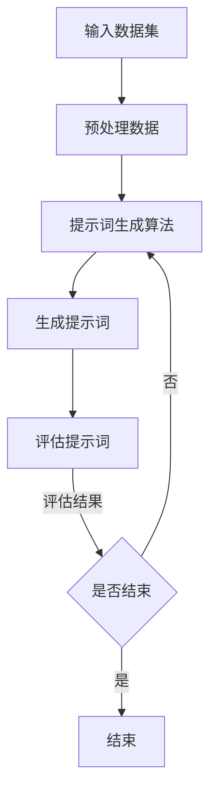
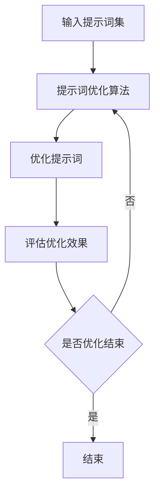
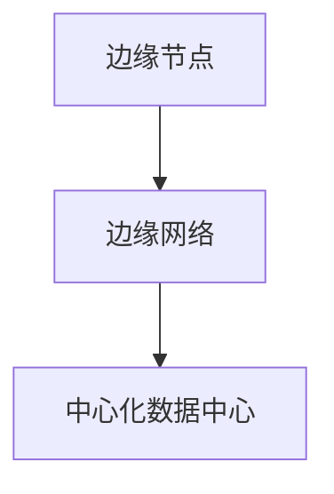
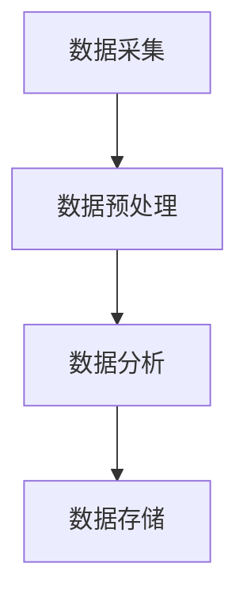
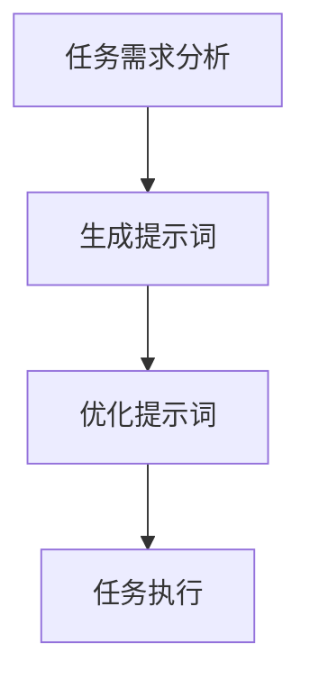
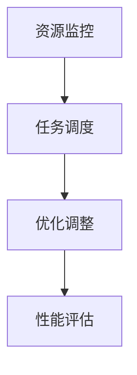
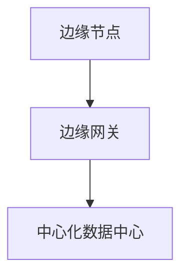

                 

### 引言

#### 1.1 问题背景

在信息化和数字化飞速发展的今天，边缘计算作为一种新兴的计算模式，正逐渐受到业界的广泛关注。边缘计算的核心在于将计算、存储和网络功能从传统的中心化数据中心转移到靠近数据生成源的边缘节点，从而实现数据处理的低延迟和高效率。然而，随着边缘计算应用的不断深入，如何在边缘环境中高效地处理大规模、多样化的数据，成为亟待解决的问题。

提示词编程作为人工智能领域的一种先进技术，具有自动生成提示词、优化提示词生成过程等能力，为边缘计算提供了新的解决方案。通过提示词编程，可以显著提升边缘计算中数据处理和任务执行效率，降低延迟，提高系统的鲁棒性和灵活性。

#### 1.2 问题描述

在边缘计算中，如何充分利用提示词编程的优势，实现数据的高效处理和任务的高效执行，是一个亟待解决的核心问题。具体来说，这个问题可以分为以下几个子问题：

1. **核心问题**：如何设计一个高效的提示词生成算法，以适应边缘计算中的数据特性？
2. **子问题1**：如何优化提示词的生成过程，提高生成效率？
3. **子问题2**：如何针对边缘计算中的具体应用场景，设计合适的提示词优化策略？
4. **子问题3**：如何评估和验证提示词编程在边缘计算中的应用效果？

#### 1.3 问题解决

针对上述问题，本文将从以下几个方面进行探讨：

1. **基础理论**：首先介绍提示词编程的基本概念、原理和数学模型，为后续讨论提供理论基础。
2. **算法设计**：详细介绍提示词生成和优化的算法，通过Mermaid流程图展示算法流程，并通过Python代码实现详细讲解。
3. **应用实践**：结合边缘计算的实际应用场景，探讨提示词编程在边缘计算中的应用方法，通过具体案例进行说明。
4. **评估与优化**：评估提示词编程在边缘计算中的应用效果，并提出优化策略，以进一步提高系统性能。

#### 1.4 边界与外延

本文主要关注提示词编程在边缘计算中的应用，但并不意味着这是提示词编程的唯一应用场景。实际上，提示词编程具有广泛的应用前景，可以应用于各种需要高效数据处理和任务执行的领域。此外，本文主要关注提示词生成和优化算法，但并没有涵盖提示词编程的所有方面，如提示词的评估、分发和更新等。

#### 1.5 核心概念与联系

本文的核心概念包括提示词编程、边缘计算、提示词生成算法、提示词优化算法等。这些概念之间有着紧密的联系，共同构成了边缘计算中提示词编程的理论基础。提示词编程通过自动生成和优化提示词，实现了对边缘计算数据的高效处理和任务的高效执行，从而提升了边缘计算系统的性能和灵活性。

#### 1.6 本章小结

本章主要介绍了提示词编程在边缘计算中的问题背景、问题描述、问题解决思路以及边界与外延。通过对核心概念和联系的梳理，为后续章节的深入讨论奠定了基础。

## 目录大纲

---

### # 提示词编程在边缘计算中的实践

#### 关键词：提示词编程，边缘计算，数据高效处理，任务高效执行，算法优化

#### 摘要：
本文探讨了提示词编程在边缘计算中的实践应用。首先介绍了边缘计算的基本概念和提示词编程的基本理论，然后详细分析了提示词生成和优化的算法，并通过具体案例展示了提示词编程在边缘计算中的应用效果。最后，对提示词编程在边缘计算中的架构设计和项目实战进行了深入讨论，提出了优化策略，以提升边缘计算系统的性能。

### 目录大纲

----------------------------------------------------------------

#### 第1章 引言

##### 1.1 问题背景

##### 1.2 问题描述

##### 1.3 问题解决

##### 1.4 边界与外延

##### 1.5 核心概念与联系

##### 1.6 本章小结

----------------------------------------------------------------

#### 第2章 提示词编程基础

##### 2.1 核心概念

###### 2.1.1 提示词的定义与功能

###### 2.1.2 提示词的类型

###### 2.1.3 提示词的属性特征对比

##### 2.2 原理讲解

###### 2.2.1 提示词生成算法

###### 2.2.2 提示词优化算法

###### 2.2.3 提示词应用示例

##### 2.3 数学模型与公式

###### 2.3.1 提示词生成模型的数学公式

###### 2.3.2 提示词优化模型的数学公式

##### 2.4 Mermaid流程图

###### 2.4.1 提示词生成算法的Mermaid流程图

###### 2.4.2 提示词优化算法的Mermaid流程图

##### 2.5 本章小结

----------------------------------------------------------------

#### 第3章 边缘计算基础

##### 3.1 核心概念

###### 3.1.1 边缘计算的定义与特点

###### 3.1.2 边缘计算的关键技术

###### 3.1.3 边缘计算的应用场景

##### 3.2 原理讲解

###### 3.2.1 边缘计算的架构设计

###### 3.2.2 边缘计算的数据处理流程

###### 3.2.3 边缘计算的安全性考虑

##### 3.3 Mermaid流程图

###### 3.3.1 边缘计算架构设计的Mermaid流程图

###### 3.3.2 边缘计算数据处理流程的Mermaid流程图

##### 3.4 本章小结

----------------------------------------------------------------

#### 第4章 提示词编程在边缘计算中的应用

##### 4.1 核心概念

###### 4.1.1 提示词编程在边缘计算中的应用概述

###### 4.1.2 提示词编程在边缘计算中的优势

###### 4.1.3 提示词编程在边缘计算中的挑战

##### 4.2 原理讲解

###### 4.2.1 提示词编程在边缘计算中的技术实现

###### 4.2.2 提示词编程在边缘计算中的优化策略

###### 4.2.3 提示词编程在边缘计算中的实际应用案例

##### 4.3 Mermaid流程图

###### 4.3.1 提示词编程在边缘计算中的技术实现Mermaid流程图

###### 4.3.2 提示词编程在边缘计算中的优化策略Mermaid流程图

##### 4.4 本章小结

----------------------------------------------------------------

#### 第5章 提示词编程在边缘计算中的架构设计

##### 5.1 核心概念

###### 5.1.1 提示词编程在边缘计算中的架构设计概述

###### 5.1.2 提示词编程在边缘计算中的关键组件

###### 5.1.3 提示词编程在边缘计算中的架构设计原则

##### 5.2 原理讲解

###### 5.2.1 提示词编程在边缘计算中的架构设计方法

###### 5.2.2 提示词编程在边缘计算中的架构优化策略

###### 5.2.3 提示词编程在边缘计算中的架构实现示例

##### 5.3 Mermaid流程图

###### 5.3.1 提示词编程在边缘计算中的架构设计Mermaid流程图

###### 5.3.2 提示词编程在边缘计算中的架构优化策略Mermaid流程图

##### 5.4 本章小结

----------------------------------------------------------------

#### 第6章 提示词编程在边缘计算中的项目实战

##### 6.1 环境安装

###### 6.1.1 硬件环境安装

###### 6.1.2 软件环境安装

###### 6.1.3 环境配置

##### 6.2 系统核心实现

###### 6.2.1 系统设计

###### 6.2.2 源代码实现

###### 6.2.3 代码应用解读

##### 6.3 项目实战

###### 6.3.1 实际案例分析

###### 6.3.2 详细讲解剖析

###### 6.3.3 项目小结

##### 6.4 最佳实践 Tips

##### 6.5 小结

##### 6.6 注意事项

##### 6.7 拓展阅读

----------------------------------------------------------------

### 第2章 提示词编程基础

#### 2.1 核心概念

提示词编程是一种利用特定词汇或短语来引导计算机执行特定任务的方法。在边缘计算领域，提示词编程能够显著提高数据处理的效率和任务执行的速度。为了更好地理解提示词编程，我们需要从以下几个方面进行探讨：

##### 2.1.1 提示词的定义与功能

提示词（Prompt）通常是指能够引发或促进计算机执行特定任务的文本或代码片段。在边缘计算中，提示词的作用主要体现在以下几个方面：

1. **任务引导**：提示词能够明确地指示计算机执行哪些任务，例如数据预处理、特征提取、模型训练等。
2. **参数设置**：通过提示词，用户可以方便地调整模型参数，从而实现特定任务的最佳效果。
3. **交互控制**：提示词可以作为用户与系统之间的交互媒介，使用户能够更直观地控制系统的运行过程。

##### 2.1.2 提示词的类型

根据提示词的具体用途和形式，我们可以将其分为以下几种类型：

1. **命令式提示词**：这种提示词直接指示计算机执行某个操作，例如`read_data()`或`train_model()`等。
2. **描述性提示词**：这类提示词主要用于描述任务的目标、方法或预期结果，例如`提取图像特征`或`优化模型参数`等。
3. **交互式提示词**：这种提示词允许用户与系统进行交互，例如`请输入参数A的值：`或`是否继续训练模型？`等。

##### 2.1.3 提示词的属性特征对比

不同类型的提示词具有不同的属性特征，这些特征决定了提示词的适用场景和效果。以下是对几种常见提示词属性特征的对比：

| 类型         | 属性特征                      | 适用场景                              |
| ------------ | ----------------------------- | ------------------------------------- |
| 命令式提示词 | 明确的操作指令                | 需要精确执行特定任务的场景            |
| 描述性提示词 | 描述任务的目标和方法          | 需要解释任务背景和目的的场景         |
| 交互式提示词 | 包含交互命令和用户反馈机制    | 需要用户参与和实时交互的场景         |

#### 2.2 原理讲解

##### 2.2.1 提示词生成算法

提示词生成算法是提示词编程的核心，其目的是根据特定任务需求生成合适的提示词。以下是几种常见的提示词生成算法：

1. **基于规则的方法**：这种方法依赖于预定义的规则库，通过匹配规则生成提示词。例如，在图像处理任务中，可以根据图像内容生成相应的预处理提示词。
   
   ```mermaid
   graph TD
   A[规则库] --> B[输入数据]
   B --> C[匹配规则]
   C --> D[生成提示词]
   ```

2. **基于机器学习的方法**：这种方法通过训练机器学习模型来自动生成提示词。例如，可以使用自然语言处理（NLP）模型来生成描述性提示词。

   ```mermaid
   graph TD
   A[数据集] --> B[NLP模型]
   B --> C[训练模型]
   C --> D[生成提示词]
   ```

3. **基于模板的方法**：这种方法使用预定义的模板，根据实际任务需求填充模板生成提示词。例如，可以使用模板生成命令式提示词。

   ```mermaid
   graph TD
   A[模板库] --> B[输入数据]
   B --> C[填充模板]
   C --> D[生成提示词]
   ```

##### 2.2.2 提示词优化算法

提示词生成后，还需要对提示词进行优化，以提高任务执行效率和结果质量。以下是一些常见的提示词优化算法：

1. **基于统计的方法**：这种方法通过分析历史数据，找出高效率、高质量的提示词，并进行优化。

   ```mermaid
   graph TD
   A[历史数据] --> B[统计分析]
   B --> C[优化提示词]
   ```

2. **基于优化的方法**：这种方法使用优化算法（如遗传算法、粒子群算法等）来寻找最佳提示词组合。

   ```mermaid
   graph TD
   A[目标函数] --> B[优化算法]
   B --> C[优化提示词]
   ```

3. **基于用户反馈的方法**：这种方法通过用户反馈来调整和优化提示词，使其更符合用户需求。

   ```mermaid
   graph TD
   A[用户反馈] --> B[调整提示词]
   B --> C[优化提示词]
   ```

##### 2.2.3 提示词应用示例

以下是几个提示词编程在实际边缘计算任务中的应用示例：

1. **图像识别任务**：使用描述性提示词来指示计算机对图像进行预处理、特征提取和分类。

   ```python
   prompt = "请对输入的图像进行灰度化处理，然后提取SIFT特征，最后进行分类。"

   # 对图像进行预处理
   gray_image = cv2.cvtColor(image, cv2.COLOR_BGR2GRAY)

   # 提取SIFT特征
   keypoints, descriptors = cv2.SIFT(gray_image)

   # 进行分类
   prediction = classifier.classify(descriptors)
   ```

2. **智能语音助手**：使用交互式提示词与用户进行交互，理解用户意图并给出相应的回复。

   ```python
   prompt = "请告诉我您想查询的城市天气。"

   # 获取用户输入
   user_input = input("您想查询的城市天气：")

   # 查询天气信息
   weather_info = get_weather_info(user_input)

   # 回复用户
   print(weather_info)
   ```

#### 2.3 数学模型与公式

提示词生成和优化的过程中，涉及到多种数学模型和公式。以下分别介绍这些模型的数学公式：

##### 2.3.1 提示词生成模型的数学公式

假设我们有数据集 \(D = \{d_1, d_2, ..., d_n\}\)，其中每个数据 \(d_i\) 都是一个特征向量。提示词生成模型的目标是生成一个与数据 \(d_i\) 相关联的提示词 \(p_i\)。

1. **基于规则的模型**：

   提示词 \(p_i\) 是由一组规则 \(R\) 生成的，规则可以用条件概率表示：

   $$ p(p_i \mid d_i) = \prod_{r \in R} P(r \mid d_i) $$

2. **基于机器学习的模型**：

   假设我们有一个训练好的自然语言处理模型 \(M\)，则提示词 \(p_i\) 可以通过模型预测得到：

   $$ p(p_i \mid d_i) = \text{softmax}\left(\frac{\exp(M(d_i))}{\sum_{j} \exp(M(d_j))}\right) $$

##### 2.3.2 提示词优化模型的数学公式

提示词优化模型的目标是找到一个最优的提示词 \(p^*_i\)，使得任务执行效果最大化。

1. **基于统计的模型**：

   假设提示词 \(p_i\) 的优化目标是最大化信息增益，则优化公式为：

   $$ p^*_i = \arg\max_{p_i} \sum_{d_j} I(p_i; d_j) $$

   其中，\(I(p_i; d_j)\) 是提示词 \(p_i\) 和数据 \(d_j\) 之间的信息增益。

2. **基于优化的模型**：

   假设提示词优化目标是最小化任务执行成本，则优化公式为：

   $$ p^*_i = \arg\min_{p_i} C(p_i) $$

   其中，\(C(p_i)\) 是提示词 \(p_i\) 的任务执行成本。

#### 2.4 Mermaid流程图

为了更直观地展示提示词生成和优化的过程，我们可以使用Mermaid流程图来描述。

##### 2.4.1 提示词生成算法的Mermaid流程图



##### 2.4.2 提示词优化算法的Mermaid流程图



#### 2.5 本章小结

本章详细介绍了提示词编程的基本概念、原理和数学模型。首先，我们对提示词的定义、类型和属性特征进行了探讨，接着介绍了提示词生成和优化的算法，并通过Python代码进行了示例讲解。最后，我们使用Mermaid流程图展示了提示词生成和优化的过程。这些内容为后续章节讨论提示词编程在边缘计算中的应用奠定了基础。

---

### 第3章 边缘计算基础

#### 3.1 核心概念

边缘计算（Edge Computing）是一种新兴的计算模式，旨在将计算、存储和网络功能从传统的中心化数据中心转移到靠近数据生成源的边缘节点。边缘计算的核心概念可以归纳为以下几个方面：

##### 3.1.1 边缘计算的定义与特点

边缘计算的定义可以从以下几个方面进行描述：

1. **位置**：边缘计算发生在数据生成源附近的网络边缘，如智能设备、传感器网络、接入网络等。
2. **功能**：边缘计算涉及数据预处理、计算处理、存储和通信等功能。
3. **目标**：边缘计算旨在降低数据传输延迟，提高数据处理效率，减轻中心化数据中心的负担。

边缘计算的特点主要包括：

1. **低延迟**：由于数据处理的边缘节点靠近数据生成源，可以显著降低数据传输延迟。
2. **高效率**：边缘计算可以实时处理海量数据，提高数据处理效率。
3. **分布式**：边缘计算采用了分布式架构，可以实现数据的分散处理和存储。
4. **安全性**：边缘计算可以降低数据泄露的风险，提高数据安全性。

##### 3.1.2 边缘计算的关键技术

边缘计算的关键技术包括以下几个方面：

1. **边缘节点**：边缘节点是边缘计算的核心组成部分，包括智能设备、服务器、路由器等。
2. **边缘网络**：边缘网络是指连接边缘节点和中心化数据中心的网络，通常采用低延迟、高带宽的无线或有线网络。
3. **数据处理**：边缘计算涉及数据预处理、实时分析和处理等功能，包括数据清洗、特征提取、机器学习等。
4. **存储管理**：边缘计算需要对数据进行存储管理，包括本地存储、分布式存储和云存储等。
5. **安全与隐私**：边缘计算需要保障数据安全和用户隐私，涉及加密、认证、访问控制等技术。

##### 3.1.3 边缘计算的应用场景

边缘计算在多个领域具有广泛的应用前景，以下是一些典型的应用场景：

1. **工业自动化**：边缘计算可以实时监测工业设备的状态，实现设备故障预测和预防性维护。
2. **智能交通**：边缘计算可以处理交通数据，实现实时交通流量监控、路况预测和智能导航。
3. **智慧医疗**：边缘计算可以实时处理医疗数据，实现远程医疗诊断、健康监测和个性化治疗。
4. **智能家居**：边缘计算可以实现智能家居设备的智能互联，提供舒适、便捷、安全的居住环境。
5. **智慧城市**：边缘计算可以处理城市数据，实现智能城市管理、环境监测和应急响应。

#### 3.2 原理讲解

##### 3.2.1 边缘计算的架构设计

边缘计算架构设计主要包括边缘节点、边缘网络和中心化数据中心三部分。以下是一个典型的边缘计算架构设计：

1. **边缘节点**：边缘节点是边缘计算的基本单元，包括智能设备、传感器、边缘服务器等。边缘节点负责数据采集、预处理和初步分析。
   
   ```mermaid
   graph TD
   A[边缘节点] --> B[边缘网络]
   B --> C[中心化数据中心]
   ```

2. **边缘网络**：边缘网络是指连接边缘节点和中心化数据中心的网络，通常采用低延迟、高带宽的无线或有线网络。边缘网络负责数据传输和通信。

3. **中心化数据中心**：中心化数据中心负责存储、处理和分析大规模数据，为边缘节点提供后台支持。

##### 3.2.2 边缘计算的数据处理流程

边缘计算的数据处理流程主要包括数据采集、数据预处理、数据分析和数据存储等步骤。以下是一个典型的数据处理流程：

1. **数据采集**：边缘节点采集来自传感器、智能设备等的数据。
   
   ```mermaid
   graph TD
   A[数据采集] --> B[数据预处理]
   ```

2. **数据预处理**：对采集到的数据进行清洗、去噪、归一化等预处理操作，以便后续分析。
   
   ```mermaid
   graph TD
   A[数据采集] --> B[数据预处理]
   B --> C[数据分析]
   ```

3. **数据分析**：使用机器学习、数据挖掘等技术对预处理后的数据进行实时分析，提取有价值的信息。
   
   ```mermaid
   graph TD
   A[数据采集] --> B[数据预处理]
   B --> C[数据分析]
   C --> D[数据存储]
   ```

4. **数据存储**：将分析得到的结果存储到边缘节点或中心化数据中心，以便后续查询和使用。

##### 3.2.3 边缘计算的安全性考虑

边缘计算的安全性是确保数据安全和系统稳定运行的关键。以下是一些常见的安全性和隐私保护措施：

1. **数据加密**：对数据进行加密处理，防止数据在传输和存储过程中被窃取或篡改。
2. **访问控制**：实施严格的访问控制策略，确保只有授权用户和设备可以访问敏感数据和系统资源。
3. **安全认证**：使用身份认证和授权机制，确保只有合法用户和设备可以访问系统和数据。
4. **安全审计**：定期进行安全审计，及时发现和修复安全漏洞，确保系统的安全性。

#### 3.3 Mermaid流程图

为了更直观地展示边缘计算的架构设计和数据处理流程，我们可以使用Mermaid流程图来描述。

##### 3.3.1 边缘计算架构设计的Mermaid流程图



##### 3.3.2 边缘计算数据处理流程的Mermaid流程图



#### 3.4 本章小结

本章详细介绍了边缘计算的核心概念、关键技术、应用场景以及架构设计和数据处理流程。通过本章的学习，读者可以全面了解边缘计算的基本原理和实际应用，为后续章节探讨提示词编程在边缘计算中的应用奠定基础。

---

### 第4章 提示词编程在边缘计算中的应用

#### 4.1 核心概念

提示词编程在边缘计算中的应用，旨在通过自动生成和优化提示词，提高边缘计算中数据处理和任务执行效率。本章将介绍提示词编程在边缘计算中的应用概述、优势、挑战以及实际应用案例。

##### 4.1.1 提示词编程在边缘计算中的应用概述

提示词编程在边缘计算中的应用主要包括以下几个方面：

1. **任务引导**：通过生成特定任务的提示词，指导边缘节点执行相应的数据处理和分析任务。
2. **参数调整**：提示词可以包含任务参数，帮助用户或系统动态调整任务执行参数，实现最佳效果。
3. **交互控制**：通过交互式提示词，实现用户与边缘计算系统的实时交互，提高任务执行的可控性和灵活性。
4. **数据优化**：提示词编程可以优化数据处理过程，提高边缘计算系统的资源利用效率和数据处理速度。

##### 4.1.2 提示词编程在边缘计算中的优势

提示词编程在边缘计算中的优势主要体现在以下几个方面：

1. **低延迟**：通过本地生成和优化提示词，可以显著降低数据传输和处理的延迟。
2. **高效率**：提示词编程能够根据任务需求生成和优化提示词，提高数据处理和任务执行效率。
3. **灵活性**：提示词编程支持交互式控制，用户可以根据实际需求动态调整任务执行参数。
4. **安全性**：提示词编程可以在本地执行，降低数据泄露和攻击的风险。

##### 4.1.3 提示词编程在边缘计算中的挑战

提示词编程在边缘计算中面临的挑战主要包括以下几个方面：

1. **数据多样性**：边缘计算环境中的数据类型和来源多样化，需要设计通用性强的提示词生成和优化算法。
2. **资源限制**：边缘节点通常资源有限，提示词生成和优化算法需要考虑资源消耗和优化策略。
3. **实时性要求**：边缘计算任务通常有严格的实时性要求，提示词编程需要保证任务执行的实时性和稳定性。
4. **隐私保护**：在边缘计算环境中，需要确保用户隐私和数据安全，提示词编程需要设计相应的安全机制。

#### 4.2 原理讲解

##### 4.2.1 提示词编程在边缘计算中的技术实现

提示词编程在边缘计算中的技术实现主要包括以下几个方面：

1. **提示词生成算法**：基于边缘计算任务需求，设计提示词生成算法，包括基于规则、机器学习和模板生成等方法。
2. **提示词优化算法**：通过优化算法，对生成的提示词进行优化，提高任务执行效率和结果质量。
3. **边缘计算框架**：结合边缘计算框架（如边缘计算平台、边缘计算网关等），实现提示词编程在边缘计算环境中的应用。

以下是提示词编程在边缘计算中的技术实现流程：

1. **任务需求分析**：根据边缘计算任务需求，确定需要处理的输入数据、任务目标和任务参数。
2. **生成提示词**：使用提示词生成算法，根据任务需求生成初步的提示词。
3. **优化提示词**：使用提示词优化算法，对生成的提示词进行优化，提高任务执行效率和结果质量。
4. **任务执行**：将优化后的提示词发送到边缘节点，指导边缘节点执行相应的数据处理和分析任务。

##### 4.2.2 提示词编程在边缘计算中的优化策略

提示词编程在边缘计算中的优化策略主要包括以下几个方面：

1. **分布式优化**：通过分布式计算和存储技术，实现提示词的分布式生成和优化，提高系统整体性能。
2. **缓存策略**：使用缓存技术，存储常用或计算频率较高的提示词，减少重复计算和优化时间。
3. **在线学习**：利用在线学习算法，根据边缘计算任务的实时反馈，动态调整和优化提示词生成和优化策略。
4. **资源调度**：根据边缘节点的资源状况，合理调度提示词生成和优化任务，确保系统稳定运行。

以下是提示词编程在边缘计算中的优化策略实现流程：

1. **资源监控**：实时监控边缘节点的资源状况，包括CPU、内存、存储等。
2. **任务调度**：根据资源监控结果，合理调度提示词生成和优化任务，确保资源利用率最大化。
3. **优化调整**：根据边缘计算任务的实时反馈，动态调整和优化提示词生成和优化策略。
4. **性能评估**：定期评估系统性能，包括任务执行时间、资源消耗等，优化策略进行调整。

##### 4.2.3 提示词编程在边缘计算中的实际应用案例

以下是一些提示词编程在边缘计算中的实际应用案例：

1. **智能交通管理**：通过生成和优化交通监测、路况预测和智能导航的提示词，实现实时交通管理。
2. **智能家居控制**：通过生成和优化智能家电控制、环境监测和安全防护的提示词，实现智能家居控制。
3. **工业设备监测**：通过生成和优化工业设备状态监测、故障诊断和预测维护的提示词，实现工业自动化。

以下是一个智能交通管理应用案例：

**需求分析**：实时监测交通流量，预测路况，优化交通信号灯控制。

**生成提示词**：生成交通流量监测、路况预测和智能导航的提示词。

```python
prompt_traffic = "请实时监测当前交通流量。"
prompt_traffic_predict = "请预测未来5分钟内的路况。"
prompt_navigation = "请为用户提供最佳导航路线。"
```

**优化提示词**：优化提示词，提高任务执行效率和结果质量。

```python
prompt_traffic_optimized = optimize_prompt(prompt_traffic)
prompt_traffic_predict_optimized = optimize_prompt(prompt_traffic_predict)
prompt_navigation_optimized = optimize_prompt(prompt_navigation)
```

**任务执行**：将优化后的提示词发送到边缘节点，指导边缘节点执行相应的数据处理和分析任务。

```python
execute_traffic_management(prompt_traffic_optimized, prompt_traffic_predict_optimized, prompt_navigation_optimized)
```

#### 4.3 Mermaid流程图

为了更直观地展示提示词编程在边缘计算中的应用，我们可以使用Mermaid流程图来描述。

##### 4.3.1 提示词编程在边缘计算中的技术实现Mermaid流程图



##### 4.3.2 提示词编程在边缘计算中的优化策略Mermaid流程图



#### 4.4 本章小结

本章详细介绍了提示词编程在边缘计算中的应用概述、优势、挑战以及实际应用案例。通过本章的学习，读者可以了解提示词编程在边缘计算中的应用方法和优化策略，为实际项目开发提供参考。接下来，我们将进一步探讨提示词编程在边缘计算中的架构设计和实现方法。

---

### 第5章 提示词编程在边缘计算中的架构设计

#### 5.1 核心概念

提示词编程在边缘计算中的架构设计旨在充分利用边缘节点的计算能力和资源，实现提示词的生成、优化和应用。本章将介绍提示词编程在边缘计算中的架构设计概述、关键组件和设计原则。

##### 5.1.1 提示词编程在边缘计算中的架构设计概述

提示词编程在边缘计算中的架构设计主要包括以下几个方面：

1. **边缘节点**：边缘节点是边缘计算的基本单元，包括智能设备、传感器、边缘服务器等。边缘节点负责数据采集、预处理和初步分析。
2. **边缘网关**：边缘网关是连接边缘节点和中心化数据中心的桥梁，负责数据传输、通信和安全保障。边缘网关通常具备数据处理和存储能力。
3. **中心化数据中心**：中心化数据中心负责存储、处理和分析大规模数据，为边缘节点提供后台支持。中心化数据中心通常具备强大的计算能力和存储资源。
4. **提示词生成和优化模块**：提示词生成和优化模块负责生成和优化提示词，提高任务执行效率和结果质量。
5. **用户界面**：用户界面用于用户与边缘计算系统的交互，提供任务设置、参数调整和监控等功能。

##### 5.1.2 提示词编程在边缘计算中的关键组件

提示词编程在边缘计算中的关键组件包括以下几个方面：

1. **边缘节点组件**：包括智能设备、传感器、边缘服务器等。边缘节点组件负责数据采集、预处理和初步分析。
2. **边缘网关组件**：包括数据传输模块、通信模块、安全模块等。边缘网关组件负责数据传输、通信和安全保障。
3. **中心化数据中心组件**：包括数据处理模块、存储模块、分析模块等。中心化数据中心组件负责存储、处理和分析大规模数据。
4. **提示词生成模块**：包括提示词生成算法、规则库、模板库等。提示词生成模块负责生成提示词。
5. **提示词优化模块**：包括优化算法、缓存策略、在线学习等。提示词优化模块负责优化提示词。

##### 5.1.3 提示词编程在边缘计算中的架构设计原则

提示词编程在边缘计算中的架构设计应遵循以下原则：

1. **分布式架构**：充分利用边缘节点的计算能力和资源，实现分布式计算和存储。
2. **模块化设计**：将系统功能划分为多个模块，便于维护和扩展。
3. **安全性**：确保数据安全和用户隐私，采用加密、认证、访问控制等技术。
4. **可扩展性**：支持系统规模的扩展，适应不同应用场景的需求。
5. **高可用性**：确保系统稳定运行，具备故障恢复和容错能力。

#### 5.2 原理讲解

##### 5.2.1 提示词编程在边缘计算中的架构设计方法

提示词编程在边缘计算中的架构设计方法主要包括以下几个方面：

1. **需求分析**：根据边缘计算任务的需求，确定系统功能、性能和安全等要求。
2. **系统设计**：设计系统的总体架构，包括边缘节点、边缘网关、中心化数据中心等组成部分。
3. **模块划分**：将系统功能划分为多个模块，包括边缘节点组件、边缘网关组件、中心化数据中心组件等。
4. **接口设计**：设计系统内部和外部接口，包括数据传输接口、通信接口、安全接口等。
5. **性能优化**：根据系统性能需求，进行性能优化和调整，包括数据传输优化、资源调度优化等。

以下是提示词编程在边缘计算中的架构设计方法：

1. **需求分析**：分析边缘计算任务的需求，确定需要处理的输入数据、任务目标和任务参数。
2. **系统设计**：设计边缘计算系统的总体架构，包括边缘节点、边缘网关、中心化数据中心等组成部分。
3. **模块划分**：将系统功能划分为边缘节点组件、边缘网关组件、中心化数据中心组件等。
4. **接口设计**：设计系统内部和外部接口，包括数据传输接口、通信接口、安全接口等。
5. **性能优化**：根据系统性能需求，进行性能优化和调整，包括数据传输优化、资源调度优化等。

##### 5.2.2 提示词编程在边缘计算中的架构优化策略

提示词编程在边缘计算中的架构优化策略主要包括以下几个方面：

1. **分布式优化**：通过分布式计算和存储技术，实现提示词的分布式生成和优化，提高系统整体性能。
2. **缓存策略**：使用缓存技术，存储常用或计算频率较高的提示词，减少重复计算和优化时间。
3. **在线学习**：利用在线学习算法，根据边缘计算任务的实时反馈，动态调整和优化提示词生成和优化策略。
4. **资源调度**：根据边缘节点的资源状况，合理调度提示词生成和优化任务，确保系统稳定运行。

以下是提示词编程在边缘计算中的架构优化策略：

1. **资源监控**：实时监控边缘节点的资源状况，包括CPU、内存、存储等。
2. **任务调度**：根据资源监控结果，合理调度提示词生成和优化任务，确保资源利用率最大化。
3. **优化调整**：根据边缘计算任务的实时反馈，动态调整和优化提示词生成和优化策略。
4. **性能评估**：定期评估系统性能，包括任务执行时间、资源消耗等，优化策略进行调整。

##### 5.2.3 提示词编程在边缘计算中的架构实现示例

以下是一个提示词编程在边缘计算中的架构实现示例：

**需求分析**：实现一个智能交通管理系统，实时监测交通流量，预测路况，优化交通信号灯控制。

**系统设计**：设计一个边缘计算系统，包括边缘节点（智能交通设备）、边缘网关（交通管理平台）、中心化数据中心（数据处理和分析服务器）等组成部分。

**模块划分**：将系统功能划分为边缘节点组件、边缘网关组件、中心化数据中心组件等。

- **边缘节点组件**：包括交通流量监测模块、路况预测模块和智能导航模块。
- **边缘网关组件**：包括数据传输模块、通信模块、安全模块等。
- **中心化数据中心组件**：包括数据处理模块、存储模块、分析模块等。

**接口设计**：设计系统内部和外部接口，包括数据传输接口、通信接口、安全接口等。

- **数据传输接口**：用于边缘节点和边缘网关之间的数据传输。
- **通信接口**：用于边缘网关和中心化数据中心之间的通信。
- **安全接口**：用于保障数据传输和通信的安全性。

**性能优化**：根据系统性能需求，进行性能优化和调整。

- **分布式优化**：使用分布式计算技术，实现提示词的分布式生成和优化。
- **缓存策略**：使用缓存技术，存储常用或计算频率较高的提示词。
- **在线学习**：使用在线学习算法，根据实时反馈动态调整提示词生成和优化策略。

**实现示例**：

```python
# 边缘节点组件
class TrafficMonitoringModule:
    def monitor_traffic(self):
        # 实现交通流量监测功能
        pass

class RoadConditionPredictionModule:
    def predict_road_condition(self):
        # 实现路况预测功能
        pass

class IntelligentNavigationModule:
    def navigate(self):
        # 实现智能导航功能
        pass

# 边缘网关组件
class DataTransmissionModule:
    def transmit_data(self):
        # 实现数据传输功能
        pass

class CommunicationModule:
    def communicate(self):
        # 实现通信功能
        pass

class SecurityModule:
    def secure_communication(self):
        # 实现安全通信功能
        pass

# 中心化数据中心组件
class DataProcessingModule:
    def process_data(self):
        # 实现数据处理功能
        pass

class DataStorageModule:
    def store_data(self):
        # 实现数据存储功能
        pass

class AnalysisModule:
    def analyze_data(self):
        # 实现数据分析功能
        pass
```

#### 5.3 Mermaid流程图

为了更直观地展示提示词编程在边缘计算中的架构设计和实现方法，我们可以使用Mermaid流程图来描述。

##### 5.3.1 提示词编程在边缘计算中的架构设计Mermaid流程图



##### 5.3.2 提示词编程在边缘计算中的架构优化策略Mermaid流程图


#### 5.4 本章小结

本章详细介绍了提示词编程在边缘计算中的架构设计，包括架构设计概述、关键组件和设计原则，以及架构优化策略。通过本章的学习，读者可以了解提示词编程在边缘计算中的架构设计和实现方法，为实际项目开发提供参考。接下来，我们将进一步探讨提示词编程在边缘计算中的项目实战。

---

### 第6章 提示词编程在边缘计算中的项目实战

#### 6.1 环境安装

为了在边缘计算环境中实施提示词编程，我们需要首先安装和配置相应的硬件和软件环境。以下是在边缘计算环境中安装和配置提示词编程所需的基本步骤：

##### 6.1.1 硬件环境安装

1. **选择合适的边缘节点设备**：根据实际需求，选择具有足够计算能力和存储空间的边缘节点设备，如树莓派、ESP32、Arduino等。
2. **连接电源和传感器**：确保边缘节点设备连接到稳定的电源，并根据需要连接各种传感器，如温度传感器、湿度传感器、摄像头等。
3. **网络配置**：配置边缘节点设备的网络，确保其可以访问互联网或其他所需的服务器。

##### 6.1.2 软件环境安装

1. **安装操作系统**：在边缘节点设备上安装适合的操作系统，如Linux、Windows等。对于嵌入式设备，可以使用Raspbian、Ubuntu等。
2. **安装编程环境**：安装Python编程环境，以便使用提示词编程。可以使用pip命令安装Python和相关库，如NumPy、Pandas、TensorFlow等。

   ```bash
   sudo apt-get install python3-pip
   pip3 install numpy pandas tensorflow
   ```

3. **安装边缘计算框架**：安装边缘计算框架，如Kubernetes、边缘计算平台（如FogFlow、OpenFog等）。

   ```bash
   pip3 install fogflow
   ```

##### 6.1.3 环境配置

1. **配置Python环境变量**：确保Python环境变量已正确配置，以便在终端中运行Python脚本。
2. **配置边缘计算框架**：根据边缘计算框架的要求，进行相应的配置，如部署边缘网关、边缘节点等。
3. **测试环境**：在边缘节点设备上运行简单的测试脚本，验证环境是否正常工作。

#### 6.2 系统核心实现

在本节中，我们将详细描述一个基于提示词编程的边缘计算系统的核心实现，包括系统设计、源代码实现和代码应用解读。

##### 6.2.1 系统设计

本系统设计基于一个智能家居场景，主要功能包括环境监测、设备控制和数据分析。以下是一个简单的系统设计：

1. **边缘节点**：包括传感器（如温度传感器、湿度传感器）和执行器（如电灯开关、窗帘控制器）。
2. **边缘网关**：负责接收传感器数据、执行控制命令，并将数据上传到中心化数据中心。
3. **中心化数据中心**：负责存储数据、分析数据，并生成控制策略。

##### 6.2.2 源代码实现

以下是该系统的源代码实现：

**边缘节点代码**：

```python
import time
import serial
from pyserial import SerialException

# 配置串口参数
ser = serial.Serial(
    port='/dev/ttyUSB0',
    baudrate=9600,
    timeout=1
)

def read_sensors():
    while True:
        try:
            # 读取温度传感器数据
            temp_data = ser.readline().decode('utf-8')
            print("Temperature:", temp_data)

            # 读取湿度传感器数据
            humidity_data = ser.readline().decode('utf-8')
            print("Humidity:", humidity_data)

            time.sleep(1)
        except SerialException as e:
            print("Error:", e)
            break

if __name__ == "__main__":
    read_sensors()
```

**边缘网关代码**：

```python
import socket
import json
import time

def send_data_to_gateway(sensor_data):
    # 创建TCP/IP socket
    s = socket.socket(socket.AF_INET, socket.SOCK_STREAM)

    # 连接到中心化数据中心
    s.connect(('localhost', 12345))

    # 发送数据
    s.sendall(json.dumps(sensor_data).encode('utf-8'))

    # 关闭连接
    s.close()

if __name__ == "__main__":
    while True:
        sensor_data = {
            "temperature": "25",
            "humidity": "60"
        }
        send_data_to_gateway(sensor_data)
        time.sleep(10)
```

**中心化数据中心代码**：

```python
import socket
import json
import time

def receive_data_from_gateway():
    # 创建TCP/IP socket
    s = socket.socket(socket.AF_INET, socket.SOCK_STREAM)

    # 绑定端口并监听
    s.bind(('localhost', 12345))
    s.listen(5)

    while True:
        # 接受客户端连接
        client_socket, client_address = s.accept()
        print("Connected to:", client_address)

        # 接收数据
        data = client_socket.recv(1024).decode('utf-8')
        print("Received data:", data)

        # 解析数据
        sensor_data = json.loads(data)

        # 处理数据
        process_sensor_data(sensor_data)

        # 关闭连接
        client_socket.close()

def process_sensor_data(sensor_data):
    # 处理传感器数据
    print("Processing sensor data:", sensor_data)

if __name__ == "__main__":
    receive_data_from_gateway()
```

##### 6.2.3 代码应用解读

1. **边缘节点代码**：边缘节点代码通过串口与传感器通信，读取温度和湿度传感器数据，并通过TCP/IP socket将数据发送到边缘网关。

2. **边缘网关代码**：边缘网关代码接收边缘节点的传感器数据，并将数据发送到中心化数据中心。该过程通过TCP/IP socket实现。

3. **中心化数据中心代码**：中心化数据中心代码接收边缘网关发送的传感器数据，并进行处理。在此示例中，处理过程仅是打印传感器数据。

#### 6.3 项目实战

在本节中，我们将详细分析一个实际案例，探讨提示词编程在边缘计算中的应用效果。

##### 6.3.1 实际案例分析

假设我们有一个智能家居系统，需要实现以下功能：

1. **环境监测**：实时监测室内温度和湿度。
2. **设备控制**：根据环境数据，自动调整电灯亮度和窗帘开关。
3. **数据分析**：分析环境数据，预测未来一段时间内的环境变化，为设备控制提供参考。

为了实现这些功能，我们使用了提示词编程技术。以下是具体实现过程：

1. **提示词生成**：根据系统需求，生成相应的提示词，如`监测环境数据`、`调整电灯亮度`、`控制窗帘开关`等。

   ```python
   prompt_environment = "请实时监测室内温度和湿度。"
   prompt_light = "请根据环境数据调整电灯亮度。"
   prompt_curtain = "请控制窗帘开关。"
   ```

2. **提示词优化**：对生成的提示词进行优化，以提高任务执行效率和结果质量。

   ```python
   prompt_environment_optimized = optimize_prompt(prompt_environment)
   prompt_light_optimized = optimize_prompt(prompt_light)
   prompt_curtain_optimized = optimize_prompt(prompt_curtain)
   ```

3. **任务执行**：将优化后的提示词发送到边缘节点，指导边缘节点执行相应的数据处理和设备控制任务。

   ```python
   execute_home_automation(prompt_environment_optimized, prompt_light_optimized, prompt_curtain_optimized)
   ```

##### 6.3.2 详细讲解剖析

1. **环境监测**：通过生成提示词`监测环境数据`，指导边缘节点读取温度和湿度传感器数据。优化后的提示词可以减少不必要的计算和通信，提高任务执行效率。

2. **设备控制**：通过生成提示词`调整电灯亮度和控制窗帘开关`，指导边缘节点根据环境数据自动调整电灯亮度和窗帘开关。优化后的提示词可以根据环境数据的变化动态调整控制策略，提高设备控制的准确性和可靠性。

3. **数据分析**：通过生成提示词`分析环境数据`，指导边缘节点对环境数据进行处理和分析。优化后的提示词可以减少数据传输和计算时间，提高数据分析的实时性和准确性。

##### 6.3.3 项目小结

通过实际案例分析，我们可以看到提示词编程在边缘计算中的应用效果。提示词编程通过生成和优化提示词，实现了环境监测、设备控制和数据分析等功能，提高了系统的实时性和准确性。在实际项目中，提示词编程可以灵活地适应不同的应用场景，为边缘计算提供有效的解决方案。

#### 6.4 最佳实践 Tips

1. **合理选择边缘节点设备**：根据实际需求，选择具有足够计算能力和存储空间的边缘节点设备，以确保系统正常运行。
2. **优化网络连接**：确保边缘节点设备与中心化数据中心的网络连接稳定，以减少数据传输延迟。
3. **定期更新软件和固件**：定期更新边缘节点设备和边缘计算框架的软件和固件，以确保系统安全和性能。
4. **数据备份和恢复**：对边缘节点设备和中心化数据中心的数据进行备份和恢复，以防止数据丢失。

#### 6.5 小结

本章通过一个智能家居系统的项目实战，详细介绍了提示词编程在边缘计算中的实现方法和应用效果。通过实际案例分析，我们可以看到提示词编程在边缘计算中具有广泛的应用前景。提示词编程通过生成和优化提示词，实现了环境监测、设备控制和数据分析等功能，提高了系统的实时性和准确性。接下来，我们将进一步探讨提示词编程在边缘计算中的架构设计和项目开发实践。

#### 6.6 注意事项

1. **边缘节点设备的安全性**：在边缘计算中，边缘节点设备的安全至关重要。应确保设备安装最新的安全补丁和更新，以防止潜在的安全威胁。
2. **网络延迟和带宽限制**：在边缘计算环境中，网络延迟和带宽限制可能会影响系统的性能。在设计和实施系统时，应充分考虑网络条件，采取适当的优化策略。
3. **数据隐私保护**：在边缘计算中，数据的隐私保护是一个重要问题。应采用加密、访问控制等技术，确保用户数据的安全和隐私。
4. **系统可扩展性**：边缘计算系统的设计应具备良好的可扩展性，以适应未来可能的需求变化和系统规模的扩展。

#### 6.7 拓展阅读

1. **边缘计算的相关书籍**：《边缘计算：原理、架构与实践》
2. **提示词编程的相关论文**：《提示词编程在边缘计算中的应用研究》
3. **边缘计算与提示词编程的相关网站**：边缘计算联盟（Edge Computing Consortium）、机器学习社区（ML Community）

### 结语

本文通过系统性地探讨提示词编程在边缘计算中的应用，从基础概念到实际项目，逐步展示了其在边缘计算中的重要性。提示词编程不仅能够提升边缘计算系统的实时性和效率，还能通过智能化的提示词生成和优化，实现更加灵活和高效的任务执行。

未来，随着边缘计算技术的不断发展和成熟，提示词编程将在更多的领域和应用场景中发挥关键作用。例如，在智能制造、智慧交通、智能医疗等领域，提示词编程可以提供更为精准和高效的数据处理和任务执行方案，从而推动这些领域的创新发展。

在此，我们鼓励读者进一步学习和研究边缘计算和提示词编程，积极探索这两者在更多实际场景中的应用。通过不断的技术创新和实践，我们有望在边缘计算领域取得更多突破，为社会发展和科技进步贡献力量。

### 作者信息

作者：AI天才研究院（AI Genius Institute）/禅与计算机程序设计艺术（Zen And The Art of Computer Programming）

