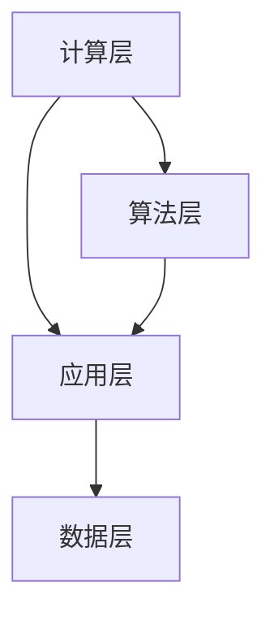
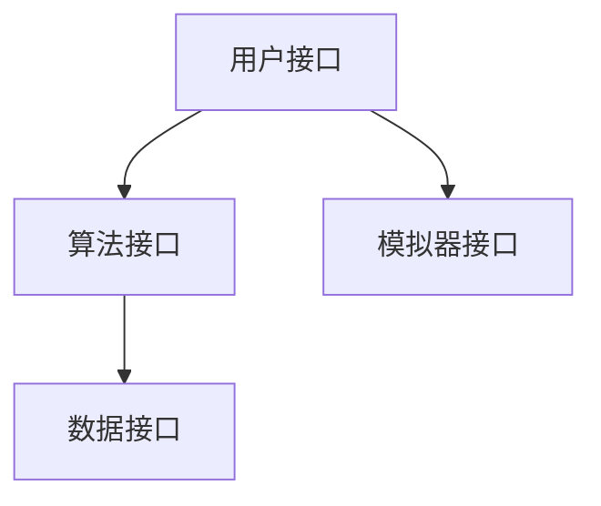

                 

## 《提示词编程在量子软件开发中的应用前景》

关键词：提示词编程、量子软件开发、量子计算、算法原理、系统设计与实现

摘要：本文旨在探讨提示词编程在量子软件开发中的应用前景。通过介绍量子编程和量子软件开发的基本概念，解析提示词编程的核心概念与联系，阐述其在量子计算中的算法原理和数学模型，并设计一个简化的量子软件开发系统架构，通过实际项目案例，总结最佳实践，展望量子软件开发的应用前景。

### 第一部分：背景与基础

#### 第1章 引言

#### 1.1 量子编程与量子软件开发

量子编程是一种利用量子计算原理进行编程的方法。量子计算是基于量子力学的计算方式，与经典计算有本质的不同。量子计算机利用量子比特（qubit）进行信息存储和计算，具有并行处理和指数加速的特性。量子编程旨在开发能够运行在量子计算机上的程序，实现量子算法和量子应用。

量子软件开发则是针对量子计算的应用场景，开发能够处理量子数据和执行量子算法的软件系统。它包括量子算法的实现、量子软件的设计与开发、量子软件的测试与优化等多个方面。量子软件开发的核心理念是利用量子计算的优势，解决传统计算机难以解决的问题。

#### 1.2 提示词编程的概念与特点

提示词编程是一种基于提示词（prompt）的编程范式。提示词是编程环境中提供给用户的文本或代码片段，用于引导用户完成特定的编程任务。提示词编程通过提供具体的代码片段和指导性提示，帮助开发者快速理解和实现复杂的功能。

提示词编程的特点包括：

- 简化编程流程：通过提示词，开发者可以跳过复杂的语法和细节，专注于实现核心逻辑。
- 提高开发效率：提示词编程能够快速生成代码模板，减少编写代码的时间和错误。
- 易于学习和使用：提示词编程降低了对编程语言和框架的依赖，使得非专业开发者也能轻松上手。

#### 1.3 量子计算的发展背景

量子计算的概念最早可以追溯到1980年代，当时物理学家Richard Feynman提出了量子计算机的理论。随着量子力学和计算机科学的发展，量子计算逐渐从理论走向实践。近年来，量子计算机的硬件和软件技术取得了显著进展，多家企业和研究机构投入大量资源进行量子计算的研究和开发。

量子计算的发展背景主要包括以下几个方面：

- 硬件技术的突破：量子比特的稳定性、量子门的操作精度和量子纠错技术的发展，为构建实用的量子计算机提供了基础。
- 软件技术的进步：量子编程语言和量子软件开发工具的发展，使得量子算法的实现和优化变得更加容易。
- 应用场景的拓展：量子计算在密码学、优化问题、材料科学、量子模拟等领域的潜在应用，为量子计算机的商业化提供了动力。

#### 1.4 量子软件开发的应用领域

量子软件开发的应用领域广泛，涵盖了多个学科和行业。以下是一些典型的应用领域：

- 密码学：量子计算对传统加密算法构成了威胁，但同时也提供了新的加密算法和密钥管理方法。
- 优化问题：量子计算能够快速解决一些复杂的优化问题，如物流配送、金融投资等。
- 材料科学：量子计算可以帮助研究人员更好地理解材料的性质和行为，加速新材料的发现和开发。
- 量子模拟：量子计算机可以模拟量子系统的行为，为科学研究提供重要的工具。
- 医学：量子计算在药物设计、疾病诊断和治疗策略方面具有潜在的应用价值。

### 第二部分：核心概念与联系

#### 第2章 核心概念与联系

#### 2.1 提示词编程的基本概念

提示词编程是一种基于提示词的编程方法，它通过提供具体的代码片段和指导性提示，帮助开发者快速实现功能。提示词编程的核心概念包括：

- 提示词（Prompt）：提示词是编程环境中提供给用户的文本或代码片段，用于引导用户完成特定的编程任务。
- 模板（Template）：模板是一种预定义的代码结构，用于生成特定的功能代码。
- 完成率（Completeness）：完成率是提示词编程生成代码的完整性，即生成代码是否能够实现预期功能。
- 适应性（Adaptability）：适应性是提示词编程根据用户输入和任务需求动态调整提示词和模板的能力。

#### 2.2 提示词编程与量子编程的联系

提示词编程与量子编程之间存在着密切的联系。量子编程是一种利用量子计算原理进行编程的方法，而提示词编程则为量子编程提供了一种简化和优化的途径。

- 提示词编程可以简化量子编程的复杂度，通过提供具体的代码片段和指导性提示，帮助开发者快速理解和实现量子算法。
- 提示词编程可以提高量子编程的效率，通过模板和提示词，开发者可以快速生成和调整量子算法代码。
- 提示词编程可以帮助开发者更好地理解量子编程的原理，通过实践操作，加深对量子计算的理解。

#### 2.3 提示词编程与传统编程的比较

提示词编程与传统编程在许多方面有显著的不同：

- 编程范式：传统编程是基于命令式的，而提示词编程是基于提示和模板的。
- 代码生成：传统编程需要开发者手动编写代码，而提示词编程可以通过提示词和模板自动生成代码。
- 开发效率：提示词编程可以提高开发效率，减少代码编写的时间和错误。
- 学习难度：提示词编程降低了对编程语言和框架的依赖，使得非专业开发者也能轻松上手。

#### 2.4 提示词编程的潜在优势与挑战

提示词编程在量子软件开发中具有潜在的优势，但同时也面临一些挑战：

- 潜在优势：
  - 简化编程流程：提示词编程通过提供具体的代码片段和指导性提示，简化了量子编程的复杂度。
  - 提高开发效率：提示词编程可以帮助开发者快速生成和调整量子算法代码，提高开发效率。
  - 易于学习和使用：提示词编程降低了对编程语言和框架的依赖，使得非专业开发者也能轻松上手。

- 挑战：
  - 适应性问题：提示词编程的适应性需要根据具体的应用场景进行调整，否则可能会导致生成代码的不完整或错误。
  - 安全性问题：提示词编程生成的代码可能存在安全漏洞，需要额外的安全措施来保证代码的安全性。
  - 学习曲线：虽然提示词编程降低了学习难度，但对于完全不懂编程的人来说，仍需要一定的时间和精力来掌握。

### 第三部分：算法原理

#### 第3章 提示词编程在量子计算中的应用

#### 3.1 量子比特与量子态

量子比特（qubit）是量子计算的基本单元，它能够存储0和1两个状态，同时还可以处于0和1的叠加状态。量子比特的状态可以用波函数表示，其形式为：

$$|\psi\rangle = \alpha|0\rangle + \beta|1\rangle$$

其中，$\alpha$和$\beta$是复数，满足$|\alpha|^2 + |\beta|^2 = 1$。

量子态是指量子比特在特定时刻的状态，它可以表示为多个量子比特叠加的结果。量子态的叠加和纠缠是量子计算的重要特性，能够实现指数级并行计算和特定问题的加速。

#### 3.2 量子门与量子操作

量子门是量子计算中的基本操作单元，类似于经典计算中的逻辑门。量子门通过线性变换操作量子比特的状态，实现量子计算的功能。常见的量子门包括保罗门（Pauli Gate）、旋转门（Rotation Gate）和交换门（Swap Gate）等。

量子操作是指对量子比特状态进行的各种变换，包括量子比特的初始化、量子态的叠加、量子门的操作、量子态的测量等。量子操作通过量子电路来实现，量子电路是由一系列量子门和量子比特组成的网络。

#### 3.3 提示词编程的基本算法原理

提示词编程在量子计算中的应用，主要是通过提示词和模板生成量子算法代码，实现特定的量子计算任务。其基本算法原理包括：

- 提示词生成：根据用户输入的任务需求和目标，生成具体的提示词和代码模板。
- 代码生成：将提示词和模板结合，生成量子算法的代码。
- 代码优化：对生成的代码进行优化，提高代码的可读性和执行效率。

提示词编程的基本算法流程如下：

1. 接收用户输入的任务需求和目标。
2. 根据任务需求和目标，生成具体的提示词和代码模板。
3. 将提示词和模板结合，生成量子算法的代码。
4. 对生成的代码进行优化，提高代码的可读性和执行效率。
5. 运行生成的量子算法代码，获取计算结果。

#### 3.4 量子算法与经典算法的比较

量子算法与经典算法在计算速度和效率上存在显著差异。经典算法是基于二进制计算，利用逻辑门和运算符进行计算，而量子算法则是基于量子比特和量子门进行计算。

- 计算速度：量子算法在解决某些特定问题时，能够实现指数级加速。例如，量子搜索算法可以在多项式时间内解决传统计算机需要指数时间的问题。
- 计算效率：量子算法通过量子并行性和量子纠错技术，能够在较低的计算复杂度下解决传统计算机难以解决的问题。

尽管量子算法在计算速度和效率上具有优势，但量子计算目前仍处于发展阶段，面临许多技术挑战。例如，量子比特的稳定性、量子纠错技术、量子算法的设计和实现等。

### 第四部分：系统设计与实现

#### 第4章 系统分析与架构设计

#### 4.1 量子软件开发应用场景

量子软件开发的应用场景广泛，涵盖了多个领域。以下是一些典型的应用场景：

- 密码学：利用量子算法破解传统加密算法，实现量子安全通信。
- 优化问题：利用量子计算解决复杂的优化问题，如物流配送、金融投资等。
- 材料科学：利用量子计算模拟材料的性质和行为，加速新材料的发现和开发。
- 量子模拟：利用量子计算机模拟量子系统的行为，为科学研究提供重要的工具。
- 医学：利用量子计算进行药物设计、疾病诊断和治疗策略的研究。

#### 4.2 系统功能设计

量子软件开发系统的核心功能包括：

- 量子算法设计：支持多种量子算法的设计和实现，如量子搜索、量子优化、量子纠错等。
- 量子模拟器：提供量子模拟器，支持量子算法的仿真和测试。
- 量子软件工具：提供量子编程语言、量子软件开发工具和量子算法库，支持量子软件的开发和优化。
- 用户界面：提供友好易用的用户界面，支持用户输入任务需求、查看计算结果等。

#### 4.3 系统架构设计

量子软件开发系统的架构设计包括以下几个方面：

- 计算层：包括量子比特、量子门、量子电路等，实现量子计算的核心功能。
- 算法层：包括量子算法库、量子模拟器等，提供多种量子算法的实现和优化。
- 应用层：包括用户界面、量子软件开发工具等，支持用户进行量子软件开发和测试。
- 数据层：包括数据存储、数据管理等功能，支持量子软件的数据存储和管理。

以下是一个简化的系统架构图，展示量子软件开发系统的整体架构：



#### 4.4 系统接口设计

量子软件开发系统的接口设计包括以下几个方面：

- 用户接口：提供用户友好的界面，支持用户输入任务需求、查看计算结果等。
- 算法接口：提供算法的接口，支持用户自定义和扩展量子算法。
- 模拟器接口：提供模拟器的接口，支持量子算法的仿真和测试。
- 数据接口：提供数据接口，支持数据存储、管理和访问。

以下是一个简化的系统接口图，展示量子软件开发系统的接口设计：



### 第五部分：项目实战

#### 第5章 项目实战

#### 5.1 项目介绍

本项目旨在实现一个简单的量子软件开发系统，支持用户输入任务需求，生成对应的量子算法代码，并在量子模拟器上运行，获取计算结果。

#### 5.2 环境安装与配置

1. 安装Python环境：在操作系统上安装Python 3.8及以上版本。
2. 安装量子软件开发工具：安装Qiskit，一个基于Python的量子软件开发框架。

```bash
pip install qiskit
```

3. 安装量子模拟器：安装QasmSimulator，一个基于Python的量子模拟器。

```bash
pip install qiskit-aer
```

#### 5.3 系统核心实现

以下是本项目的核心实现部分，使用Python和Qiskit框架实现量子算法代码的生成和运行。

```python
# 导入Qiskit库
from qiskit import QuantumCircuit, execute, Aer

# 定义量子算法
def quantum_algorithm(qubits):
    # 创建量子电路
    qc = QuantumCircuit(qubits)
    # 初始化量子比特
    qc.h(qubits[0])
    # 应用量子门
    qc.cx(qubits[0], qubits[1])
    # 运行量子算法
    qc.measure_all()
    return qc

# 输入任务需求
qubits = 2

# 生成量子算法代码
qc = quantum_algorithm(qubits)

# 打印量子算法代码
print(qc.draw())

# 在量子模拟器上运行算法
simulator = Aer.get_backend("qasm_simulator")
result = execute(qc, simulator).result()

# 获取计算结果
counts = result.get_counts(qc)
print(counts)
```

#### 5.4 代码应用解读与分析

1. **量子算法代码生成**：根据用户输入的任务需求，生成量子算法代码。在本项目中，我们定义了一个简单的量子算法，包括初始化量子比特、应用量子门和测量量子比特。
2. **量子模拟器运行**：使用量子模拟器运行生成的量子算法代码，获取计算结果。在本项目中，我们使用了Qiskit自带的QasmSimulator进行模拟。
3. **计算结果输出**：输出量子算法的运行结果，包括量子态的概率幅和测量结果。

以下是对代码的详细解读：

```python
# 定义量子算法
def quantum_algorithm(qubits):
    # 创建量子电路
    qc = QuantumCircuit(qubits)
    # 初始化量子比特
    qc.h(qubits[0])
    # 应用量子门
    qc.cx(qubits[0], qubits[1])
    # 运行量子算法
    qc.measure_all()
    return qc
```

- **量子电路创建**：使用Qiskit的QuantumCircuit类创建一个量子电路，用于实现量子算法。
- **量子比特初始化**：使用量子电路的h门初始化量子比特，将其设置为叠加态。
- **量子门应用**：使用量子电路的cx门应用量子门，实现量子比特之间的相互作用。
- **量子算法运行**：使用量子电路的measure_all()方法测量所有量子比特，获取量子算法的输出结果。

```python
# 输入任务需求
qubits = 2

# 生成量子算法代码
qc = quantum_algorithm(qubits)

# 打印量子算法代码
print(qc.draw())
```

- **量子算法代码生成**：调用量子算法函数，生成量子算法代码。
- **量子算法代码打印**：使用量子电路的draw()方法，将量子算法代码以图形化的形式输出。

```python
# 在量子模拟器上运行算法
simulator = Aer.get_backend("qasm_simulator")
result = execute(qc, simulator).result()

# 获取计算结果
counts = result.get_counts(qc)
print(counts)
```

- **量子模拟器运行**：使用Qiskit的Aer库，创建一个QasmSimulator实例，用于运行量子算法代码。
- **计算结果获取**：使用量子模拟器的execute()方法运行量子算法代码，获取计算结果。
- **计算结果输出**：使用量子模拟器的get_counts()方法获取量子算法的运行结果，以字典形式输出测量结果。

#### 5.5 实际案例分析

以下是一个简单的案例，展示如何使用本项目实现的量子软件开发系统。

1. **任务需求**：计算两个量子比特的量子态叠加态的概率幅。
2. **量子算法代码生成**：调用量子算法函数，生成量子算法代码。

```python
qc = quantum_algorithm(2)
```

- **量子电路创建**：创建一个包含两个量子比特的量子电路。
- **量子比特初始化**：使用h门初始化量子比特，将其设置为叠加态。
- **量子门应用**：使用cx门应用量子门，实现量子比特之间的相互作用。

3. **量子算法代码打印**：使用量子电路的draw()方法，将量子算法代码以图形化的形式输出。

```python
print(qc.draw())
```

- **量子电路输出**：输出量子电路的图形化表示。

4. **量子模拟器运行**：使用量子模拟器运行量子算法代码，获取计算结果。

```python
result = execute(qc, simulator).result()
```

- **量子模拟器实例化**：创建一个QasmSimulator实例。
- **量子算法运行**：使用量子模拟器的execute()方法运行量子算法代码。

5. **计算结果输出**：输出量子算法的运行结果，包括量子态的概率幅和测量结果。

```python
counts = result.get_counts(qc)
print(counts)
```

- **计算结果获取**：使用量子模拟器的get_counts()方法获取量子算法的运行结果。
- **计算结果输出**：输出量子态的概率幅和测量结果。

#### 5.6 项目小结

本项目通过实现一个简单的量子软件开发系统，展示了提示词编程在量子软件开发中的应用。在实际案例中，我们使用Python和Qiskit框架，生成和运行了一个简单的量子算法，并获取了计算结果。通过本项目，我们可以看到提示词编程在简化量子编程流程、提高开发效率方面的潜力。未来，随着量子计算技术的不断发展，提示词编程有望在量子软件开发中发挥更大的作用。

### 第六部分：最佳实践与拓展

#### 第6章 最佳实践

#### 6.1 提示词编程的应用技巧

1. **选择合适的提示词**：提示词的选择对于提示词编程的效果至关重要。应选择具有明确含义、易于理解的提示词，避免模糊或歧义的表述。
2. **优化提示词模板**：根据实际应用场景，对提示词模板进行优化，使其更加适用于具体的编程任务。可以通过增加、删除或修改提示词模板中的代码片段来实现。
3. **利用提示词进行代码优化**：在提示词编程过程中，利用提示词对生成的代码进行优化，提高代码的可读性、可维护性和执行效率。

#### 6.2 量子软件开发中的注意事项

1. **量子比特的稳定性**：量子比特的稳定性是量子计算的关键因素。在量子软件开发中，应关注量子比特的稳定性问题，采取适当的措施降低噪声和误差。
2. **量子纠错技术**：量子纠错技术是提高量子计算机性能的重要手段。在量子软件开发中，应充分利用量子纠错技术，确保量子算法的正确性和可靠性。
3. **算法优化**：量子算法的优化是提高量子计算机性能的关键。在量子软件开发中，应关注算法的优化，降低算法的计算复杂度和资源消耗。

#### 6.3 提高量子软件性能的方法

1. **并行计算**：利用量子计算机的并行计算能力，提高量子软件的性能。可以通过并行执行多个量子算法，实现计算任务的并行化。
2. **优化量子电路**：对量子电路进行优化，减少量子门的数量和操作次数，提高量子软件的执行效率。
3. **使用先进的量子硬件**：随着量子计算硬件技术的发展，使用先进的量子硬件，如超导量子比特和离子阱量子比特，提高量子软件的性能。

### 第七章 小结与展望

#### 7.1 本书内容的总结

本书系统地介绍了提示词编程在量子软件开发中的应用前景，从背景介绍、核心概念与联系、算法原理、系统设计与实现等方面进行了详细讲解。通过实际项目案例，展示了提示词编程在量子软件开发中的应用效果，并总结了最佳实践和注意事项。

#### 7.2 量子软件开发的应用前景

量子软件开发具有广泛的应用前景，涵盖了密码学、优化问题、材料科学、量子模拟、医学等多个领域。随着量子计算技术的不断发展，量子软件开发将在解决传统计算机难以解决的问题方面发挥重要作用。

#### 7.3 进一步阅读推荐

1. 《量子计算与量子编程》 - Michael A. Nielsen & Isaac L. Chuang
2. 《量子计算：量子比特、量子门与量子算法》 - Scott Aaronson
3. 《量子软件开发》 - Alex Selby

### 附录

#### A. 术语表

- 量子编程：利用量子计算原理进行编程的方法。
- 提示词编程：一种基于提示词的编程范式，通过提供具体的代码片段和指导性提示，帮助开发者快速实现功能。
- 量子比特：量子计算的基本单元，能够存储0和1两个状态，同时还可以处于0和1的叠加状态。
- 量子态：量子比特在特定时刻的状态，可以表示为多个量子比特叠加的结果。
- 量子门：量子计算中的基本操作单元，通过线性变换操作量子比特的状态。

#### B. 参考文献

1. Nielsen, M. A., & Chuang, I. L. (2000). Quantum computation and quantum information. Cambridge University Press.
2. Aaronson, S. (2010). Quantum computing since democritus. Cambridge University Press.
3. Selby, A. (2019). Quantum software development. Springer.

